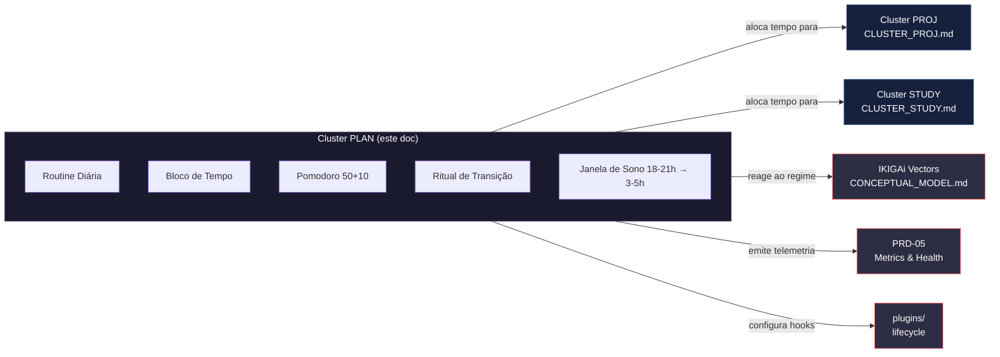
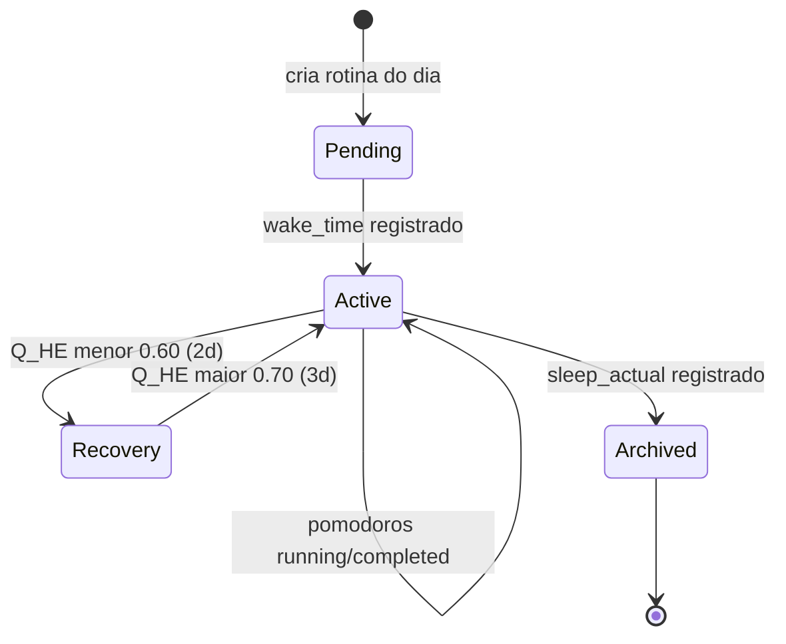
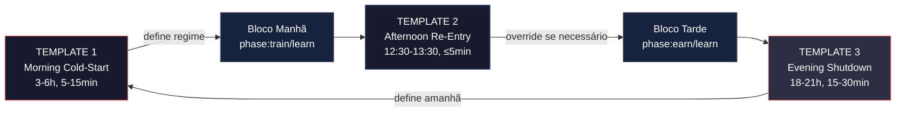
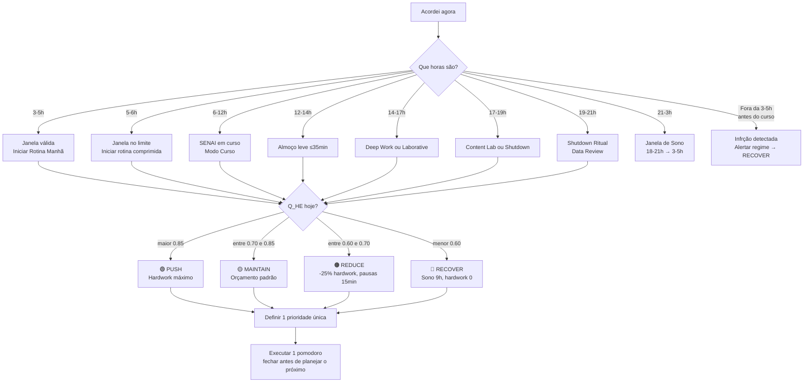
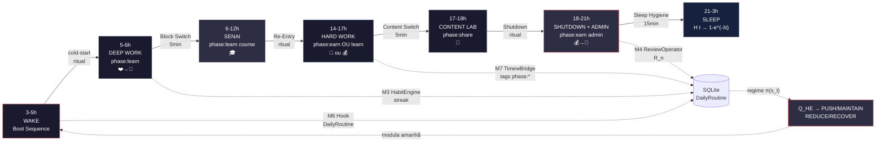
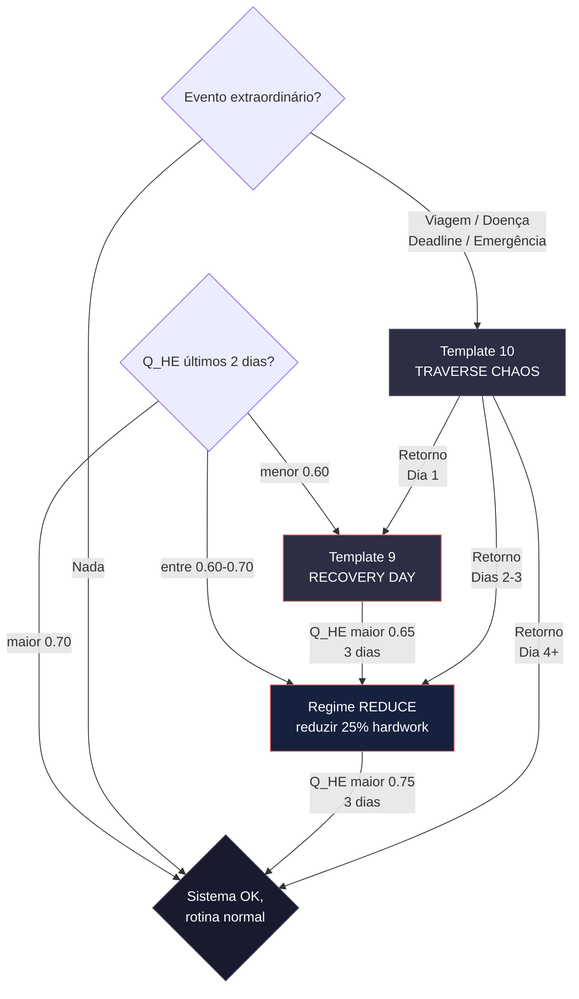
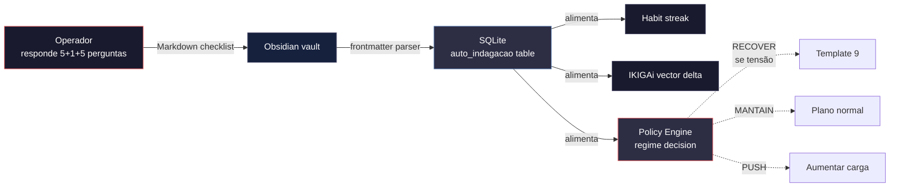

# CLUSTER_PLAN.md

> **Standalone Memory Machine — Cluster 1: Plan + Personal Productivity**
>
> Este documento define **como o dia é estruturado** — não o que é feito em
> cada bloco (isso é tarefa/cluster PROJ/STUDY), mas a **engenharia de tempo**
> que sustenta todos os outros clusters.
>
> **Audiência:** o Matheus lendo o sistema de fora, ou um agente/IA tentando
> implementar o módulo de rotinas diárias.
>
> **Escopo ESTREITO:** rotinas, blocos de tempo, rituais de transição, janelas
> de sono, pomodoro, **NÃO cobre** IKIGAi (→ `CONCEPTUAL_MODEL.md`),
> tarefas (→ `CLUSTER_PROJ.md` / `CLUSTER_STUDY.md`), nem métricas de
> saúde (→ `vibe-ops/planning/PRD-05-metrics-health.md`).

---

## §0. DECLARAÇÃO DE PROPÓSITO

> "A produtividade pessoal não é sobre o que se faz. É sobre **quando se faz**
> e **quanto tempo se gasta entre começar e parar**."

Este cluster trata o **substrato temporal** que torna possível qualquer
outra atividade. É o equivalente ao kernel de um sistema operacional: invisível
quando funciona, catastrófico quando falha.

### Diagrama de Contexto



**Leitura:** PLAN está no centro, mas não conversa diretamente com o usuário
para "fazer coisas" — ele aloca **quando** e **quanto**. As atividades
concretas vivem em PROJ/STUDY; PLAN é a infraestrutura que as torna possíveis.

---

## §1. DOMÍNIO & ESCOPO

### Hierarquia Canônica

```
Rotina Diária (24h)
  ├── Janela de Sono (18-21h → 3-5h, ≈7-9h)
  ├── Bloco Manhã (3-5h → 12h, transições, ritual)
  ├── Bloco Tarde (12h → 18h, SENAI ou Laborative)
  ├── Bloco Noite (18-21h, Shutdown Ritual)
  ├── Rituais de Transição (≤5min, entre blocos)
  └── Pomodoros (50+10, dentro de blocos Manhã/Tarde)
```

### Responsabilidades (dentro do escopo)

- Definir e validar janelas temporais (3-5h acordar, 18-21h dormir, 50+10 pomodoro)
- Modelar rotinas como **assets compostos** (consolidação exponencial via $H(t)$)
- Computar **Q_HE (Quociente de Eficiência Habitual)** agregado
- Disparar `TransitionRitual` automaticamente entre blocos
- Alimentar `policy_engine` com sinais de execução de rotina
- Fornecer base temporal (`anchor_wave`, `parent_phase`) para PROJ/STUDY

### Fora do Escopo (delega para outros clusters/docs)

- **Propósito / IKIGAi vectors:** `vibe-ops/base/IKIGAi.md`, `CONCEPTUAL_MODEL.md`
- **Tarefas concretas (story points, épicos, tópicos):** `CLUSTER_PROJ.md`, `CLUSTER_STUDY.md`
- **Métricas de saúde (sono detalhado, energia, batimento):** `vibe-ops/planning/PRD-05-metrics-health.md`
- **Hábitos como entidades biológicas (H(t), E(t) cálculo detalhado):** `vibe-ops/planning/PRD-02-habit-tracker.md`
- **Frequências Wave/Cycle/Phase:** `vibe-ops/planning/PRD-01-temporal-engine.md`
- **Day Logger UI legado (Tkinter):** `vibe-ops/context/Day Logger Program Documentation.md` (legado, não integrado)

---

## §2. ENTIDADES & ESTADOS

### Rotina Diária

```python
class DailyRoutine(BaseModel):
    id: str                     # ^dr_YYYYMMDD$
    date: date
    wake_time: time             # ideal: 3-5h
    sleep_target: time          # ideal: 18-21h
    blocks_executed: list[str]  # FKs → TimeBlock.ids
    pomodoros_planned: int
    pomodoros_done: int
    transitions_count: int      # esperado: ~6-9/dia
    sleep_actual: Optional[float]  # calculado via bedtime/wake
    energy_score_morning: Optional[int] = Field(ge=1, le=10)
    energy_score_evening: Optional[int] = Field(ge=1, le=10)
    qhe: Optional[float]        # Quociente de Eficiência Habitual
    regime: Optional[RegimeType]  # PUSH|MAINTAIN|REDUCE|RECOVER
```

### Bloco de Tempo (TimeBlock)

```python
class TimeBlock(BaseModel):
    id: str                     # ^tb_YYYYMMDD_(manhã|tarde|noite)$
    routine_id: str             # FK → DailyRoutine
    block_type: Literal["morning", "afternoon", "evening", "night"]
    start_window: time          # janela de início (ex: 14:00-14:35)
    end_window: time            # janela de fim (ex: 17:00-17:35)
    duration_min_target: int    # 90 (morning) | 240 (afternoon) | 180 (evening)
    duration_min_actual: Optional[int] = None
    primary_activity: Literal["deep_work", "laborative", "training", "study", "shutdown", "sleep"]
    pomodoros_inside: list[str]  # FKs → Pomodoro.ids
    transition_in: Optional[str]  # FK → TransitionRitual.id
    transition_out: Optional[str] # FK → TransitionRitual.id
    ikigai_vector_focus: Optional[IKIGAiVector]  # passion|skill|market|revenue|course
```

### Pomodoro (a unidade atômica de execução)

```python
class Pomodoro(BaseModel):
    id: str                     # ^pm_YYYYMMDD_HHMM$
    block_id: str               # FK → TimeBlock
    started_at: datetime
    ended_at: Optional[datetime]
    work_minutes: int = 50
    break_minutes: int = 10
    status: Literal["planned", "running", "completed", "interrupted", "skipped"]
    task_ref: Optional[str]     # FK → Task (CLUSTER_PROJ) ou StudySession (CLUSTER_STUDY)
    task_type: Literal["project", "study", "admin", "ritual"]
    energy_before: Optional[int] = Field(ge=1, le=10)
    energy_after: Optional[int] = Field(ge=1, le=10)
    interruptions_count: int = 0
    notes: str = ""
```

### Ritual de Transição (o anti-overhead de 157,5min/dia)

```python
class TransitionRitual(BaseModel):
    id: str                     # ^tr_YYYYMMDD_HHMM$
    ritual_type: Literal["cold_start", "warm_down", "context_switch", "shutdown"]
    duration_min_target: int = 5  # meta dura: ≤ 5min
    duration_min_actual: Optional[int] = None
    from_block: Optional[str]   # FK → TimeBlock
    to_block: Optional[str]     # FK → TimeBlock
    checklist: list[str]        # ex: ["fechar TW atual", "abrir Obsidian", "anotar intenção"]
    completed: bool = False
```

### Janela de Sono (SleepWindow)

```python
class SleepWindow(BaseModel):
    id: str                     # ^sw_YYYYMMDD$
    date: date
    bedtime: time               # ideal: 18-21h
    wake_time: time             # ideal: 3-5h
    duration_hours_actual: float
    deficit_hours: float        # vs target 7-9h
    quality_score: Optional[int] = Field(ge=1, le=10)  # subjetivo
    interruptions: int = 0
    source: Literal["manual", "garmin", "oura", "apple_health"]
```

### Estados e Transições



---

## §2.5. TEMPLATES INLINE: ROTINAS DIÁRIAS

> **Por que 3 templates?** O Matheus precisa **dormir melhor à noite sabendo
> o que fazer na manhã seguinte** e **terminar o dia com clareza, não em
> piloto automático ansioso**. Esses 3 templates cobrem o ciclo 24h completo
> (cold-start manhã, re-entry tarde, shutdown noite) e são derivados de:
> `strategics/Análise (Tático e Operacional).md` (perguntas socráticas),
> `vibe-ops/base/Produtividade Algorítmica Visual.md` (constantes 3-5h, 18-21h, 50+10),
> vetores IKIGAi (4 vetores + 5º contextual "course").

### Template 1: `TEMPLATE-Morning-Cold-Start.md`

**Duração alvo:** 5-15 min | **Janela:** 3-6h (após acordar)

```markdown
# Morning Cold-Start Ritual
**Data:** ____
**Duração:** 5-15 min

## 1. Validação da Janela de Acordar
- Acordei: __:__
- Classificação: [🟢 3-5h / 🟡 5-6h / 🔴 6h+]
- Se 🔴: marcar como infração no log, avaliar regime de hoje

## 2. Substrato Biológico (5 min, não negociável)
- [ ] Hidratação (300ml água)
- [ ] Luz natural (5min janela/sacada)
- [ ] Meditação (5-15 min) → streak: __ dias (alvo ≥ 12d)

## 3. Boot Pomodoro (5 min)
- [ ] Fechar task anterior no Taskwarrior
- [ ] Abrir Obsidian + Revisar "O que ficou pendente ontem?"
- [ ] Verificar timew status (parar/retomar)

## 4. Auto-indagação Matinal (5 perguntas socráticas)
1. 🔁 "O que fiz ontem que preciso repetir?" → ___
2. 🚫 "O que fiz ontem que preciso parar de fazer?" → ___
3. 🔄 "Que tarefa de ontem deve virar hábito?" → ___
4. 🏆 "Qual é a grande vitória de hoje?" → ___
5. 🎯 "Qual é a 1 prioridade única do dia?" → ___

## 5. Definição Operacional do Dia
- **IKIGAi foco hoje:** passion | skill | market | revenue | course
- **Vetor peso:** w₁=__ w₂=__ w₃=__ w₄=__ w₅=__
- **Q_HE ontem:** __ (prevê regime de hoje)
- **Regime previsto:** PUSH | MAINTAIN | REDUCE | RECOVER
- **Pomodoros planejados:** manhã=__ tarde=__ noite=__ total=__
- **Sub-blocos de Deep Work (se aplicável):**
  - [ ] Lectio Densa (25-50min) — material: ___
  - [ ] Codificação Algorítmica (50min) — projeto: ___
  - [ ] Prototipagem (50min) — ideia: ___

## 6. Notas (opcional)
___
```

**Origem do template:**
- 5 perguntas socráticas: `strategics/Análise (Tático e Operacional).md §Rotina inicial`
- Janela 3-5h/🟢🟡🔴: `vibe-ops/base/Produtividade Algorítmica Visual.md §Decision Tree`
- Vetores IKIGAi: `vibe-ops/vectors/README.md` + `CONCEPTUAL_MODEL.md §3`
- Streak/H(t): `life-ops/planner/Points_of_premisses-task-habits.md §3`
- Sub-blocos Deep Work: `vibe-ops/vectors/vector-skill.md §Sub-blocos`

---

### Template 2: `TEMPLATE-Afternoon-Re-Entry.md`

**Duração alvo:** ≤ 5 min | **Janela:** 12:30-13:30 (pós-almoço)

```markdown
# Afternoon Re-Entry Ritual
**Data:** ____
**Duração:** ≤ 5 min

## 1. Validação do Almoço
- Início almoço: __:__
- Fim almoço: __:__
- Duração: __ min (alvo ≤ 35min)
- Composição: [🟢 leve (≤35min) / 🟠 médio (35-60min) / 🔴 pesado (>60min)]
- Se 🔴: alerta regime REDUCE automático

## 2. Re-sincronização Cognitiva
- **Q_HE energy_score_after_lunch:** __/10
- **Nível de prontidão para Deep Work:** [🟢 ≥7 / 🟡 5-6 / 🔴 <5]
- **Fator do almoço impactando:** caféina [✓/✗] açúcar [✓/✗] digestão [✓/✗]

## 3. Decisão de Bloco
- "Tô pronto para Deep Work?" [🟢 sim / 🟡 parcial / 🔴 não]
- Próxima task H: ___
  - Cluster: PROJ | STUDY
  - Project: ___
  - Topic: ___
  - Estimativa restante: __ pomodoros
- Pomodoros restantes no dia: __ (alvo 3-4 típicos)

## 4. Roteiro do Bloco Tarde (segue PRD-01 WAVE position)
- Wave/Cycle posição: ___/15 ou ___/45
- Sub-blocos planejados: ___

## 5. Decisão de Regime (override se necessário)
- Regime mantido: PUSH | MAINTAIN | REDUCE | RECOVER
- Override aplicado: [sim/não] → ___

## 6. Notas (opcional)
___
```

**Origem do template:**
- Q_HE: `life-ops/planner/Points_of_premisses-task-habits.md §3` (Q_HE formula)
- Pomodoros planejados: `vibe-ops/vectors/vector-skill.md` (dia com curso: 1 round manhã + 3 tarde)
- Regime PUSH/MAINTAIN/REDUCE/RECOVER: `CONCEPTUAL_MODEL.md §4` + `vibe-ops/planning/PRD-06-policy-governance.md`

---

### Template 3: `TEMPLATE-Evening-Shutdown.md`

**Duração alvo:** 15-30 min | **Janela:** 18-21h (pré-sono)

```markdown
# Evening Shutdown Ritual
**Data:** ____
**Duração:** 15-30 min

## 1. Consolidação de Pomodoros
- **Planejados:** __ | **Fechados:** __ | **Interrompidos:** __ | **Pomodoro yield:** __% (alvo ≥ 85%)
- **Por cluster:**
  - PROJ: __ pomodoros
  - STUDY: __ pomodoros
  - PLAN: __ pomodoros (rituais)
  - MARKET/Content Lab: __ pomodoros

## 2. Auto-indagação Noturna (5 perguntas socráticas)
1. ✅ "O que correu bem hoje?" → ___
2. ❌ "O que correu mal hoje?" → ___
3. 📚 "Qual foi o maior aprendizado?" → ___
4. 🧘 "O que estou levando de tensão/peso desnecessário?" → ___
5. 🎯 "Se eu só pudesse fazer 1 coisa amanhã, qual seria?" → ___

## 3. Higiene do Sono (Sleep Hygiene)
- Última refeição: __:__ (alvo 15-18h)
- [ ] Arrumar casa / preparar refeições do dia seguinte
- [ ] Sem luz azul após 21h
- [ ] Hidratação suficiente (~2L no dia)
- **Bedtime planejado:** __:__ (alvo 18-21h)
- **Wake planejado amanhã:** __:__ (alvo 3-5h)
- **Sleep window target:** __h (alvo 7-9h)

## 4. Wave/Cycle Tracker
- **Wave posição:** ___/15
- **Cycle posição:** ___/45
- **$H_{wave}$ estimado:** __% (esperado: 75% ao fim, 48% mid-wave)
- **$H_{cycle}$ estimado:** __% (esperado: 98.5% ao fim, 88% mid-cycle)
- **Próximo checkpoint:** [Mid-Wave d7] [Wave-End d15] [Mid-Cycle d22] [Cycle-End d45]

## 5. Decisão de Regime para Amanhã
- **Q_HE estimado amanhã:** __
- **Regime previsto:** PUSH | MAINTAIN | REDUCE | RECOVER
- **Ajustes para amanhã:**
  - Hardwork: __ pomodoros
  - Treino: [intenso / leve / skip]
  - SENAI amanhã? [sim/não]

## 6. Logs & Persistência
- [ ] DailyRoutine JSON exportado (`plan today --json`)
- [ ] Pomodoros logados no Taskwarrior
- [ ] Timewarrior tags corretas (`phase:*`)
- [ ] SleepWindow registrado

## 7. Notas (opcional)
___
```

**Origem do template:**
- 5 perguntas socráticas: `strategics/Análise (Tático e Operacional).md §Rotina Final`
- Higiene do sono: `vibe-ops/base/Produtividade Algorítmica Visual.md §1` (LUZ_AZUL_CORTE=18h)
- $H_{wave}/H_{cycle}$: `life-ops/life_tatics/time-lenghts_reviews.md §9.2-3`
- Pomodoro yield ≥ 85%: `vibe-ops/planning/PRD-03-study-backlog.md §6`
- Regime π(s_t): `vibe-ops/planning/PRD-06-policy-governance.md §2`
- DailyRoutine JSON: `CLUSTER_PLAN.md §7` (CLI canônico)

---

### Fluxo Integrado: 3 Templates no Dia



**Total tempo de rituais no dia:** 5-15 + 5 + 15-30 = **25-50 min** (alvo ≤ 50 min, vs 157,5 min atuais de overhead = **-70% de overhead**).

---

## §3. FRENTES DE DECISÃO (o que precisa decidir no cluster)

### A pergunta-chave do cluster

> **"Em qual bloco eu estou agora, e qual é a próxima ação ritualizada?"**

### Árvore de Decisão: "Acordei agora, o que faço?"



### Casos Especiais (histerese e fallback)

| Caso | Regra |
|---|---|
| Acordei às 5h30 (entre 5-6h) | Aceitar, marcar como borderline, **não recuperar sono perdido** — entrar direto no bloco manhã comprimido |
| Dormi < 6h (deficit > 3h) | Auto-promover regime para `RECOVER`, cancelar próximo Deep Work, priorizar treino leve + meditação |
| Pomodoro interrompido 3+ vezes | Considerar "interrupted", bloquear próxima task H-priority até ritual de warm-down |
| Fora de casa / sem acesso | Modo **Minimal Routine** (só sono + treino + 1 pomodoro crítico) — **nunca** modo "tudo ou nada" |
| Fim de semana / sem SENAI | Trocar `Bloco Tarde: SENAI` por `Bloco Tarde: Deep Work estendido (5h)`, conforme `vibe-ops/base/IKIGAi.md` Setpoint Livre |

### O regime do dia vem de onde?

O regime `π(s_t)` é **computado fora deste cluster** (→ `vibe-ops/src/pipeline/policy_engine.py`),
mas este cluster é **fonte primária dos sinais** que alimentam o cálculo:

- `Q_HE` ← `PRD-02-habit-tracker.md §3`
- `energy_score` ← `PRD-05-metrics-health.md`
- `pomodoros_done / planned` ← este cluster
- `sleep_actual` ← este cluster

---

## §3.5. TEMPLATES INLINE: REVISÕES PERIÓDICAS

> **Por que 5 templates?** A cadência fractal WAVE (15d) / CYCLE (45d) /
> PHASE (180d) tem **pontos de virada canônicos** (d7, d15, d22, d45, d180)
> onde ajustes precisam acontecer — caso contrário, a deriva (drift)
> acumula. Esses 5 templates seguem o formato **Sensor → Adjuster** (vibe-ops)
> combinado com **Turning Points** (time-lenghts_reviews) e a proporção
> 5×3×3 (Desempenho Subjacente).

### Visão Geral: Cadência Fractal

```mermaid
gantt
    title Cadência Fractal: 5 Checkpoints Canônicos (WAVE+CYCLE+PHASE)
    dateFormat  D
    axisFormat  %d

    section WAVE 1 (15 D)
    MID_WAVE (d7)        :milestone, mw, 7, 0d
    WAVE_END (d15)       :milestone, we, 15, 0d

    section CYCLE 1 (45 D = 3×WAVE)
    MID_CYCLE (d22-23)   :milestone, mc, 23, 0d
    CYCLE_END (d45)      :milestone, ce, 45, 0d

    section PHASE 1 (180 D = 4×CYCLE)
    PHASE_END (d180)     :milestone, pe, 180, 0d
```



### Template 4: `TEMPLATE-Mid-Wave-Review.md`

**Quando:** d7 de 15 | **Duração:** 15-20 min | **Propósito:** ajuste de carga pré-consolidação

```markdown
# Mid-Wave Review (d7 de 15)
**WAVE_ID:** WAVE-2026-Q2-__ (ex: WAVE-2026-Q2-1)
**Data:** ____
**Dia na WAVE:** 7/15
**$H_{wave}$ esperado:** 48% (λ=0.093)

## 1. Sensor — Status da WAVE
- **$C_{comp}$** = completed_hours / estimated_hours = __/__ = __%
- **$A_{cal}$ (avaliação calendário)** = entregas concluídas / planejadas = __%
- **Tópicos/tarefas P0 ativos:** ___
- **Streak consolidado:** __ dias
- **Q_HE atual (rolling 7d):** __

## 2. Adjuster — Ajuste de Carga
- Resistência $R$ da tarefa diminuiu? [sim / não / parcial]
- Se NÃO: reduzir 1 pomodoro da tarde (de 3 para 2)
- Se PARCIAL: manter mas observar
- Se SIM: aumentar 1 pomodoro de manhã (se aplicável)
- Cognitive Debt: __ (deve estar caindo)

## 3. Top 3 Aprendizados da WAVE até aqui
1. ___
2. ___
3. ___

## 4. Ajustes para d8-d15
- [ ] Manter / aumentar / reduzir carga
- [ ] Ajustar rituais de transição (se overhead > 5min)
- [ ] Re-priorizar tasks (se P0 está atrasado)

## 5. Decisão sobre d15 (Wave-End)
- [ ] WAVE_END vai ser REVIEW ou REPLAN?
- [ ] Tasks L/M a cancelar ou mover?
- [ ] Cognitive Debt residual esperado: __
```

**Origem:**
- Sensor/Adjuster: `vibe-ops/planning/TEMPLATE-weekly-review.md` (formato)
- $H_{wave}$ esperado 48% (λ=0.093): `life-ops/life_tatics/time-lenghts_reviews.md §9.2`
- $C_{comp}$: `life-ops/planner/Points_of_premisses-task-habits.md §3`
- Cognitive Debt: `CLUSTER_STUDY.md §3`

---

### Template 5: `TEMPLATE-Wave-End-Review.md`

**Quando:** d15 de 15 | **Duração:** 30-45 min | **Propósito:** consolidação + decision sobre d16

```markdown
# Wave-End Review (d15 de 15)
**WAVE_ID:** WAVE-2026-Q2-__
**Data:** ____
**Dia na WAVE:** 15/15 ✅
**$H_{wave}$ real:** __% (meta: 75%)

## 1. Consolidação de Resultados
- Tarefas/tópicos concluídos: __ / __
- Pomodoros fechados: __ (yield: __%)
- Streak máximo na WAVE: __ dias
- Q_HE final: __
- Cognitive Debt: __ → __ (Δ)

## 2. Hábito Consolidado?
- Status: [SIM consolidado / PARCIAL / NÃO]
- Próxima WAVE: continuar mesmo hábito OU rotacionar?
- Se PARCIAL: investigar causa (carga? ambiente? motivação?)

## 3. IKIGAi Vector — qual avançou mais?
- ❤️ Passion: Δ = __
- 💼 Skill: Δ = __ (conhecimento novo)
- 🎯 Market: Δ = __ (conteúdo publicado)
- 💰 Revenue: Δ = __ (entregáveis gerados)
- 🎓 Course (5º vetor): Δ = __

## 4. Top 5 Aprendizados da WAVE
1. ___
2. ___
3. ___
4. ___
5. ___

## 5. Decisão de Continuidade
- [ ] Manter mesmo hábito na próxima WAVE
- [ ] Pivotar para hábito correlato (qual?): ___
- [ ] Pausar hábito (motivo): ___
- [ ] Adicionar novo hábito (qual?): ___

## 6. Ajustes Estruturais Identificados
- [ ] Mudança em horário de acordar
- [ ] Mudança em blocos de tempo
- [ ] Mudança em rituais de transição
- [ ] Mudança em tooling (TW tags, Obsidian, etc.)

## 7. Carryover para próxima WAVE
- Tasks não concluídas: __
- Decisão: [mover / cancelar / replan]
- Cognitive Debt projetado para próximo Wave: __
```

**Origem:**
- Hábito consolidado (75%): `life-ops/life_tatics/time-lenghts_reviews.md §9.3-4` (otimização duração WAVE)
- 5 vetores IKIGAi: `vibe-ops/vectors/README.md` + `CONCEPTUAL_MODEL.md §3`
- Format review: `vibe-ops/planning/TEMPLATE-weekly-review.md §2-5`

---

### Template 6: `TEMPLATE-Mid-Cycle-Review.md`

**Quando:** d22-23 de 45 (mid-cycle = 1.5×WAVE) | **Duração:** 30-45 min | **Propósito:** renormalização pré-CYCLE_END

```markdown
# Mid-Cycle Review (d22-23 de 45)
**CYCLE_ID:** CYCLE-2026-Q2-__
**Data:** ____
**Dia na CYCLE:** ___/45
**$H_{cycle}$ esperado:** 88.3% (λ=0.093, t=23)

## 1. Consolidação de 3 WAVE Reviews
- WAVE 1 (d1-d15): $H_{wave}$ = __% / status = ___
- WAVE 2 (d16-d30): em progresso
- WAVE 3 (d31-d45): planejado

## 2. HALF_QUARTER Cross-Check (mágica matemática)
- CYCLE 22.5 D ≈ HALF_QUARTER 22.5 D ≡ 33 W ÷ 2
- 1 QUARTER (90 D) ÷ 2 = 45 D = exatamente 1 CYCLE
- Estamos alinhados com o calendário fiscal? [sim/não]
- Decisão: recalibrar se desalinhado

## 3. Skill Velocity (mudou de nível?)
- Skills no início do CYCLE: __
- Skills agora: __
- Níveis avançaram? [sim/não — quais?]
- Portfolio evidence adicionada? [sim/não — quantos?]

## 4. ROI Vector Recap
- 💰 Revenue gerado: R$ ___
- 💼 Skill horas investidas: __h
- 🎯 Market posts/conteúdo: __
- ❤️ Passion horas treino: __h
- Eficiência média: __%

## 5. Cognitive Debt Reduction Trend
- Início CYCLE: __
- Agora: __
- Δ: __ (deve ser negativo)
- Se positivo: tarefa de replanning urgente

## 6. Ajustes Estruturais para Próximas 22 D
- [ ] Cortar projetos com ROI < 0
- [ ] Adicionar 1 tópico P0 bloqueante
- [ ] Pivotar vetor IKIGAi se necessário (de skill para market, etc.)
- [ ] Ajustar regime (se oscilando, forçar MAINTAIN por 2 semanas)

## 7. Decisão sobre Cycle-End (d45)
- [ ] Prever quais tasks vão precisar carryover
- [ ] Identificar próximo CYCLE tema (qual SKILL gap atacar)
- [ ] Comunicar a stakeholders (se aplicável)
```

**Origem:**
- CYCLE ≡ HALF_QUARTER: `life-ops/life_tatics/time-lenghts_reviews.md §2.2` (alinhamento exato)
- Skill velocity ≥ 1 nível por Phase: `vibe-ops/planning/PRD-03-study-backlog.md §6`
- Cognitive Debt: `CLUSTER_STUDY.md §3`
- ROI: `CLUSTER_PROJ.md §9`

---

### Template 7: `TEMPLATE-Cycle-End-Review.md`

**Quando:** d45 de 45 (1 CYCLE completo) | **Duração:** 60-90 min | **Propósito:** checkpoint principal do trimestre

```markdown
# Cycle-End Review (d45 de 45)
**CYCLE_ID:** CYCLE-2026-Q2-__
**Data:** ____
**Dia na CYCLE:** 45/45 ✅
**$H_{cycle}$ real:** __% (meta: 98.5%)

## 1. Sensor — Status Consolidado do CYCLE
### 1.1. Métricas Hardwork
- Total de horas investidas: __h
- Pomodoros fechados: __
- Pomodoro yield médio: __%
- Tasks PROJ concluídas: __ (de __ planejadas)
- Topics STUDY concluídos: __ (de __ planejados)
- Sprint velocity média: __

### 1.2. Métricas Biológicas
- Q_HE final: __ (início: __)
- Sleep window compliance: __%
- Training consistency: __%
- Streaks mantidos: __ (quais?)

### 1.3. Métricas IKIGAi (Δ ao longo do CYCLE)
- 💼 Skill: +__%
- 🎯 Market: +__%
- 💰 Revenue: +__ R$
- ❤️ Passion: +__h treino
- 🎓 Course: progresso __%

## 2. Adjuster — Decisões de Regime para Próximo CYCLE
- IKIGAi vector prioritário do próximo CYCLE: ___
- Razão: ___
- Peso dos vetores: w₁=__ w₂=__ w₃=__ w₄=__ w₅=__

## 3. HALF_QUARTER Checkpoint (45 D ≡ 45 D)
- Estamos no meio do trimestre fiscal? [sim/não]
- OKRs do trimestre: progresso __% (meta: 50% no HALF_QUARTER)
- Se < 50%: replanning urgente do trimestre

## 4. 3 WAVE Reviews Consolidadas
- WAVE 1 (d1-d15): ___
- WAVE 2 (d16-d30): ___
- WAVE 3 (d31-d45): ___

## 5. Top 10 Aprendizados do CYCLE
1. ___
2. ___
3. ___
4. ___
5. ___
6. ___
7. ___
8. ___
9. ___
10. ___

## 6. Decisões Arquiteturais (ADRs Pessoais)
- [ ] ADR-001: ___
- [ ] ADR-002: ___
- [ ] ADR-003: ___

## 7. Próximo CYCLE
- **Tema:** ___
- **Foco principal (vetor IKIGAi):** ___
- **Top 3 objetivos:** ___
- **Riscos identificados:** ___
- **Carryover tasks:** ___

## 8. PAE Trimestral (preparação)
- Estamos no HALF_QUARTER — alinhar com PAE
- Próximo checkpoint fiscal: QUARTER_END (d90)
```

**Origem:**
- 5×3×3 proporção: `strategics/Desempenho Subjacente.md §Estrutura Geral`
- HALF_QUARTER: `life-ops/life_tatics/time-lenghts_reviews.md §3.2`
- ADRs pessoais: `vibe-ops/planning/TEMPLATE-weekly-review.md §4` (retrospectiva)
- Próximo CYCLE: `vibe-ops/planning/TEMPLATE-epic-sprint.md §1-2`

---

### Template 8: `TEMPLATE-Phase-End-Review.md`

**Quando:** d180 de 180 (PHASE completo = 4 CYCLEs = 2 QUARTERs fiscais) | **Duração:** 2-3h (sessão dupla) | **Propósito:** transição de competência

```markdown
# Phase-End Review (d180 de 180)
**PHASE_ID:** PHASE-2026-H1__
**Data:** ____
**Dia na PHASE:** 180/180 ✅
**$H_{phase}$ real:** __% (meta: 99.98%)

## 1. Sensor — Status da PHASE
### 1.1. 4 CYCLEs Consolidados
- CYCLE 1 (d1-d45): $H_{cycle}$ = __%, achievements: ___
- CYCLE 2 (d46-d90): $H_{cycle}$ = __%, achievements: ___
- CYCLE 3 (d91-d135): $H_{cycle}$ = __%, achievements: ___
- CYCLE 4 (d136-d180): $H_{cycle}$ = __%, achievements: ___

### 1.2. Métricas Hardwork Consolidadas
- Total horas investidas: __h (meta: 132 W = ~960h líquido)
- Pomodoros fechados: __
- Tasks PROJ: __
- Topics STUDY: __ (skills aprendidas: __)
- ROI Revenue total: R$ ___

### 1.3. Transição de Competência
**Começo da PHASE:** beginner | intermediate | advanced | expert (em quais skills?)
**Fim da PHASE:** beginner | intermediate | advanced | expert (em quais skills?)
- Skill subiu 1 nível: [sim/não — quais?]
- Skill subiu 2 níveis: [sim/não — quais?]
- Skill dominada: [sim/não — quais?]

## 2. Teste de Fogo (180 D = MAESTRIA)
Conforme `strategics/Planejamento (Estratégico e Tático).md §3.1`:
- 5 dimensões avaliadas:
  1. **Hardwork vs Lazyness:** __
  2. **Discipline vs Distraction:** __
  3. **Strategic vs Tactical:** __
  4. **Learning vs Stagnation:** __
  5. **Sustainable vs Burnout:** __
- Score agregado: __/5

## 3. IKIGAi Vectors — Recalibração Completa
- ❤️ Passion: início=__ fim=__ Δ=__%
- 💼 Skill: início=__ fim=__ Δ=__%
- 🎯 Market: início=__ fim=__ Δ=__%
- 💰 Revenue: início=__ fim=__ Δ=__%
- 🎓 Course (5º): início=__ fim=__ Δ=__%
- Meta-vetor $|\vec{I}|$: início=__ fim=__

## 4. Quais SONHOS foram atingidos?
1. Sonho: ___ — status: ✅ / 🟡 / ❌
2. Sonho: ___ — status: ✅ / 🟡 / ❌
3. Sonho: ___ — status: ✅ / 🟡 / ❌

## 5. Decisões Estratégicas para Próxima PHASE
- [ ] Manter foco no mesmo vetor OU pivotar?
- [ ] Adicionar/remover skills alvo?
- [ ] Ajustar SONHOS de longo prazo?
- [ ] Mudar regime de carreira (Build to Learn → Earn ou vice-versa)?

## 6. Backlog Estratégico
- **Próxima PHASE (PHASE 2026-H2):**
  - SONHOS: ___
  - SKILLS alvo: ___
  - PROJETOS alvo: ___
  - IKIGAi foco: ___

## 7. PAE Anual (preparação)
- A PHASE 1 cobriu 6 meses = metade do PAE
- Revisão anual: 2 PHASEs × 180 D = 360 D ≈ 12 meses
- Próximo checkpoint: 2ª PHASE_END + PAE_FINAL
```

**Origem:**
- 4 CYCLEs: `life-ops/life_tatics/time-lenghts_reviews.md §2.1` (PHASE = 4×CYCLE)
- Teste de Fogo: `strategics/Planejamento (Estratégico e Tático).md §3.1`
- $|\vec{I}|$: `CONCEPTUAL_MODEL.md §3`
- PAE: `strategics/Modelagem Operacional.md`
- Transição de competência: `CONCEPTUAL_MODEL.md §3 §3` (skill levels beginner→expert)

---

### Fluxo Integrado: 5 Revisões na Cadência Fractal


**Total tempo de revisões (média):**
- Mid-Wave (15min) + Wave-End (30-45min) + Mid-Cycle (30-45min) + Cycle-End (60-90min) + Phase-End (2-3h) = **~6-8h por CYCLE (45d)**
- Distribuído: ~10-12 min/dia em média (aceitável)

---

## §4. FREQUÊNCIA E CADÊNCIA

| Camada | Frequência | Outputs Canônicos | Onde Mora |
|---|---|---|---|
| **Diária (rotina)** | A cada 24h | `DailyRoutine` JSON, `Pomodoro` log | `handlers/daily.py` (esqueleto) |
| **Pomodoro** | A cada 50+10 min | `Pomodoro.completed` event | Plugin `m3_habit_engine` (gap) |
| **Transição** | ~6-9x/dia | `TransitionRitual.completed` | Plugin `m6_hook_dispatcher` (gap) |
| **Janela de sono** | 1x/dia | `SleepWindow` record | `vibe-ops/src/pipeline/daily_consolidator.py` |
| **Revisão semanal** | 7 dias | Q_HE trend, regime promedio | `handlers/weekly.py` (esqueleto) |
| **Ajuste mensal** | 30 dias | Recalibração de janelas | `vibe-ops/planning/PRD-01-temporal-engine.md` |
| **Auditoria Phase** | 90/180 dias | Re-validar constantes | `vibe-ops/planning/PRD-01-temporal-engine.md` |

### Constantes Canônicas (do `vibe-ops/base/Produtividade Algorítmica Visual.md §1`)

| Constante | Valor | Impacto |
|---|---|---|
| `HORARIO_ACORDAR_MIN` | `3` (3h AM) | 🔴 Crítico |
| `HORARIO_ACORDAR_MAX` | `5` (5h AM) | 🔴 Crítico |
| `HORARIO_DORMIR_MIN` | `18` (18h) | 🔴 Crítico |
| `HORARIO_DORMIR_MAX` | `21` (21h) | 🟡 Alto |
| `HORARIO_ULTIMA_REFEICAO` | `15-18` (range) | 🟡 Alto |
| `POMODORO_WORK_MIN` | `50` | 🟢 Médio |
| `POMODORO_BREAK_MIN` | `10` | 🟢 Médio |
| `POMODORO_ROUNDS_MIN` | `3` | 🟢 Médio |
| `POMODORO_ROUNDS_MAX` | `4` | 🟢 Médio |
| `SONO_OPCOES_HORAS` | `[9, 8, 7, 4]` | 🔴 Crítico |
| `LUZ_AZUL_CORTE` | `18` (18h) | 🟡 Alto |
| `TRANSITION_RITUAL_MAX_MIN` | `5` (5min meta) | 🔴 Crítico |
| `OVERHEAD_TRANSICAO_TOTAL_MAX_MIN` | `45` (157,5 min atuais → alvo 45) | 🟡 Alto |

> **Origem completa:** `vibe-ops/base/Produtividade Algorítmica Visual.md §1` (constantes detalhadas com tabela de impacto)
> **Origem do gap 157,5 min:** `vibe-ops/base/IKIGAi.md §Análise de Gargalos (I/O Overhead)`
> **Origem das curvas H(t), E(t), Q_HE:** `life-ops/planner/Points_of_premisses-task-habits.md §2-3`

---

## §4.5. MAPEAMENTO IKIGAi ↔ PAV (Produtividade Algorítmica Visual)

> **O "missing link" do sistema.** Até agora existiam dois eixos paralelos:
> - **Eixo IKIGAi (4 vetores)**: passion / skill / market / revenue → blocos: Training / Deep Work / Content Lab / Laborative
> - **Eixo PAV (3 períodos)**: Manhã 3-5h / Tarde 12-17h / Noite 18-21h → rotinas: cold-start / deep work / shutdown
>
> Esta seção **conecta os dois eixos** em uma tabela-mãe, e mostra com
> 1 exemplo de dia preenchido como a integração acontece na prática.

### Tabela-Mãe: IKIGAi ↔ PAV (a "ponte" canônica)

| Período (PAV) | Janela | Vetor(es) IKIGAi | `phase:tag` TW | `@contexto` TW | Rituais de Borda | Output Cluster |
|---|:---:|:---:|:---:|:---:|:---|:---|
| **Manhã (Treino)** | 3-5h | ❤️ **Passion** | `phase:train` | `@training` | Boot Sequence (15min) → meditação+hidratação | CLUSTER_STUDY (substrato biológico) |
| **Manhã (Deep Work)** | 5-6h | 💼 **Skill** | `phase:learn` (cat: lectio/coding) | `@vscode` `@obsidian` | Lectio Densa (25-50min) | CLUSTER_STUDY |
| **SENAI (Curso)** | 6-12h | 🎓 **Course** (5º vetor contextual) | `phase:learn` (cat: course) | `@senai` | Block Switch (5min, contexto:senai) | externo (instituição) |
| **Tarde (Hard Work)** | 14-17h | 💼 **Skill** (curso) OU 💰 **Revenue** (livre) | `phase:learn` ou `phase:earn` | `@vscode` | Pomodoro 50+10 (3-4 rounds) | CLUSTER_STUDY ou CLUSTER_PROJ |
| **Tarde (Content Lab)** | 17-18h | 🎯 **Market** | `phase:share` | `@browser` | Polimento (15-20min) | CLUSTER_PROJ (portfolio/visibilidade) |
| **Noite (Shutdown)** | 18-21h | 💰 **Revenue** (admin leve) | `phase:earn` (cat: admin) | `@obsidian` | Shutdown Ritual (15-30min) | CLUSTER_PLAN (revisão/registro) |
| **Sono** | 21-3h | (recuperação) | (sem tracking) | — | Higiene do sono (sem luz azul) | CLUSTER_PLAN (consolidação H(t)) |

### Diagrama Mermaid: Jornada do Dia Atravessando os Vetores



### Exemplo de Dia Preenchido (2026-06-05, dia com SENAI)

```markdown
# Diário 2026-06-05 (Dia com SENAI) — Regime: MAINTAIN

## Manhã 3-5h (Passion/phase:train)
- 03:45 wake [🟢 dentro da janela 3-5h]
- 03:50-04:15 meditação + hidratação [streak 12d → mantém]
- 04:15-05:45 calistenia (60min strength + 15min cardio + 15min cool-down)
  - `timew start @training calistenia phase:train`
  - `timew stop` @ 05:45
- 05:45-06:00 banho + transição SENAI [Block Switch ritual, 5min]
- Vetor: ❤️ Passion +0.5h treino, energia score 7/10

## Manhã 5-6h (Skill/phase:learn) — SUB-BLOCO PULADO
- ⚠️ Não houve janela para Lectio Densa (transição direta para SENAI)
- Decisão: regime permanece MAINTAIN (Q_HE 0.78)

## SENAI 6-12h (Course/phase:learn cat:course)
- 06:00-12:00 ADS aula (efetivo)
- Tags TW: `phase:learn` `@senai` `ads` `course`
- Vetor: 🎓 Course mantém (não avança, é só presença)

## Tarde 12-17h (Skill/phase:learn) — 3 POMODOROS
- 12:35-13:00 almoço leve (25min) [🟢]
- 13:00-13:30 Re-Entry Ritual (Afternoon Cold-Start template)
  - Q_HE pós-almoço: 7/10 [🟢 pronto]
- 14:00-14:50 POMODORO 1: Lectio Densa (Pydantic v2 docs, 50min)
  - `timew start @vscode @obsidian phase:learn study pydantic_v2`
  - notas extraídas: 245 palavras
- 15:00-15:50 POMODORO 2: Codificação Algorítmica (implementa validator, 50min)
  - `timew start @vscode phase:learn coding`
  - 1 commit linkado a TEMA_xxx (M2 CommitLinker — gap, manual)
- 16:00-16:50 POMODORO 3: Notes → Obsidian (sintetiza aprendizados, 50min)
  - `timew start @obsidian phase:learn notes`
- 16:50-17:00 transition [Block Switch ritual, 5min]
- Vetor: 💼 Skill +2.5h estudo, +1 topic ativo (st_pydantic_v2)

## Tarde 17-18h (Market/phase:share) — CONTENT LAB
- 17:00-17:30 polimento: rascunho post "Computed fields em Pydantic v2"
  - `timew start @browser phase:share content linkedin`
- Decisão: publicar amanhã (amanhã tem mais tempo)
- Vetor: 🎯 Market +0.5h conteúdo, draft pronto

## Noite 18-21h (Shutdown + Admin/phase:earn cat:admin)
- 18:00-19:00 jantar + arrumar casa
- 19:00-19:30 SHUTDOWN RITUAL (Evening template)
  - 3 pomodoros fechados (yield 100%, todos cumpridos)
  - 1 aprendizado: "computed_field substitui @validator em alguns casos"
  - Regime amanhã: MAINTAIN (Q_HE estimado 0.80)
  - Wave posição: 7/15 (Mid-Wave amanhã)
  - Próxima WAVE revisão: d15 (10 dias)
  - 5 perguntas socráticas respondidas
- 19:30-21:00 tempo livre (família, leitura não-técnica)
- 21:00 bedtime [🟢 18-21h]
- 7h sleep window planejada

## Resumo do Dia (para Evening Shutdown template)
- Pomodoros: 3/3 planejados [100% yield] 🟢
- IKIGAi Δ: ❤️ +0.5h, 💼 +2.5h, 🎯 +0.5h, 🎓 mantido, 💰 0
- Q_HE rolling: 0.78 (estável)
- Regime de hoje: MAINTAIN → amanhã MAINTAIN
- Wave: 7/15 (Mid-Wave amanhã)
```

### Mapeamento Reverso: TW tags ↔ PAV período

```bash
# Como extrair horas por período do PAV via timew
timew summary :week :ids                            # total
timew summary @training phase:train :week           # manhã treino
timew summary @vscode phase:learn :week            # manhã/tarde skill
timew summary @senai phase:learn :week              # senai
timew summary @vscode phase:earn :week              # tarde revenue
timew summary @browser phase:share :week            # tarde content
timew summary @obsidian phase:earn :week            # noite admin

# Heatmap (futuro, M8 StreamlitBI)
# Eixo X: período PAV (3-5h | 5-6h | 6-12h | 14-17h | 17-18h | 18-21h)
# Eixo Y: vetor IKIGAi (passion | skill | market | revenue | course)
# Célula: horas investidas na semana
```

### Conexão com os Middlewares (a "ponte" técnica)

| Middleware | Como consome este §4.5 |
|---|---|
| **M3. HabitEngine** | Recebe `cold-start ritual completion` + `streak` da manhã → calcula $H_{sono}$, $H_{med}$ (componentes do Q_HE) |
| **M4. ReviewOperator** $\mathcal{R}_n$ | Recebe outputs dos templates de revisão (§3.5) → renormaliza $\lambda, k$ em checkpoints (d7, d15, d22, d45, d180) |
| **M6. HookDispatcher** | Cold-start hook (3-5h) dispara `DailyRoutine` creation; Shutdown hook (18-21h) dispara review automático; Block Switch hook (transições) marca `TransitionRitual` |
| **M7. TimewEnergyBridge** | Tags TW (`phase:train`, `phase:learn`, `phase:share`, `phase:earn`) cruzam com phase:tag da tabela-mãe → alimenta `DailyMetrics` |
| **M8. StreamlitBI** | Heatmap "PAV período (X) × IKIGAi vetor (Y)" usando as tags — visualização executiva |

### Regra de Ouro do Mapeamento

> **"Cada período do dia tem 1 (ou 2) vetor(es) IKIGAi dominante(s). O
> ritual de borda entre períodos é o que **fecha o anterior** e **abre o
> próximo** — sem disciplina nos rituais, o regime PAV colapsa."**

> **Origem do mapeamento IKIGAi ↔ PAV:** cruzada de `vibe-ops/vectors/README.md` (4 vetores + tags) × `vibe-ops/base/Produtividade Algorítmica Visual.md §Decision Tree` (3 períodos + janelas)
> **Origem do 5º vetor (Course):** `CONCEPTUAL_MODEL.md §3` (adaptação contextual reconhecida pelo Matheus)
> **Origem da jornada 3-5h → 21h:** `vibe-ops/base/IKIGAi.md §"Algoritmo de Escalonamento (Schedulling)"`

---

## §5. MIDDLEWARES ENVOLVIDOS

| Middleware | Papel neste cluster | Status | Localização |
|---|---|---|---|
| **M3. HabitEngine** | Computar $H(t)$, $E(t)$, $Q_{HE}$ a partir de execuções de rotina | 🟡 gap | `vibe-ops/src/pipeline/habit_engine.py` (não existe) |
| **M4. ReviewOperator $\mathcal{R}_n$** | Renormalizar $H, E, \lambda, k$ em checkpoints (7/15/30/45d) | 🟡 gap | `vibe-ops/src/pipeline/policy_engine.py` (parcial) |
| **M6. HookDispatcher** | Disparar transições automáticas (rotina manhã → tarde → noite) | 🟡 gap | `plugins/protocol.py` (declarado) / `handlers/daily.py` (não chama) |
| **M7. TimewEnergyBridge** | Extrair tags TW + `timew` para tracking de energia ao longo do dia | 🟡 gap | `vibe-ops/src/pipeline/tw_sync.py` (parcial) |
| `life/handlers/daily.py` | Esqueleto do orquestrador diário (escrita/leitura) | 🟡 stub | `handlers/daily.py` |
| `life/handlers/weekly.py` | Esqueleto do orquestrador semanal (Q_HE review) | 🟡 stub | `handlers/weekly.py` |
| `vibe-ops/src/pipeline/daily_consolidator.py` | Consolida métricas diárias em `DailyLog` | 🟡 parcial | `vibe-ops/src/pipeline/daily_consolidator.py` |
| `vibe-ops/src/models/operational_entities.py` | Pydantic para `DailyLog`, `TimeBlock` | 🟢 | `vibe-ops/src/models/operational_entities.py` |
| `vibe-ops/src/pipeline/ikigai_scorer.py` | Consome sinais de PLAN para atualizar vetor | 🟡 gap vetores | `vibe-ops/src/pipeline/ikigai_scorer.py` |
| `vibe-ops/src/cybernetics/daily_loop.py` | Loop Target→Sensor→Adjuster do regime | 🟡 parcial | `vibe-ops/src/cybernetics/daily_loop.py` |
| `life-ops/life_tatics/domain/time_blocks.py` | Cálculo de blocos de tempo (overlap com este cluster) | 🟢 | `life-ops/life_tatics/domain/time_blocks.py` |
| `life-ops/life_tatics/domain/screentime.py` | Tracking de horas de tela (consumidor de pomodoros) | 🟢 | `life-ops/life_tatics/domain/screentime.py` |
| `life-ops/life_tatics/cli.py` | CLI alternativo `life-tatics` (standalone) | 🟢 | `life-ops/life_tatics/cli.py` |
| `life-ops/life_tatics/Planning_notes.md` | Cópia das constantes de planejamento | 🟢 | `life-ops/life_tatics/Planning_notes.md` |
| `life-ops/life_tatics/time-lenghts_reviews.md` | Cópia das durações e reviews | 🟢 | `life-ops/life_tatics/time-lenghts_reviews.md` |
| `taskwarrior/scripts/daily-review.sh` | Script shell para review diário via TW | 🟢 | `taskwarrior/scripts/daily-review.sh` |
| `taskwarrior/scripts/weekly-review.sh` | Script shell para review semanal via TW | 🟢 | `taskwarrior/scripts/weekly-review.sh` |
| `taskwarrior/scripts/on-add.sh` | Hook on-add (alimenta telemetria ao adicionar task) | 🟢 | `taskwarrior/scripts/on-add.sh` |
| `taskwarrior/docs/TASKWARRIOR_STRATEGIC_WORKFLOWS.md` | Workflows de TW alinhados com rotinas | 🟢 | `taskwarrior/docs/TASKWARRIOR_STRATEGIC_WORKFLOWS.md` |

### Tabela Reversa: "se eu mexo em X, este cluster é impactado em Y"

| Mudança externa | Impacto neste cluster |
|---|---|
| Mudar `HORARIO_ACORDAR_MIN/MAX` em constantes | Todas as rotinas, Q_HE baseline, regime de partida |
| Implementar `M3 HabitEngine` | $Q_{HE}$ vira computado (não estimado) |
| Implementar `M6 HookDispatcher` | Transições viram automáticas, sem disciplina manual |
| Adicionar tarefa H-priority (PROJ) | Pode deslocar bloco pomodoro do PLAN |
| SENAI acabar (longo prazo) | `Bloco Tarde: SENAI` desaparece, virá `Deep Work` |
| Workout virar remote | Treino deixa de exigir janela fixa, fica mais flexível |

---

## §5.5. TEMPLATES INLINE: RECUPERAÇÃO & ANTI-FRAGILIDADE

> **Por que 2 templates?** A vida do operador real não é linear. Dias
> caóticos acontecem. O **anti-pattern mais comum** é tratar caos como
> "falha" e tentar compensar com mais horas. A solução real é ter
> **2 modos especiais pré-roteirizados** que substituem o regime normal
> de forma histerética (2-3 dias para subir, 1 dia para descer).
>
> Esses 2 templates vêm de: `vibe-ops/planning/PRD-06-policy-governance.md §2`
> (4 regimes), `life-ops/planner/Points_of_premisses-task-habits.md §4`
> (matriz de decisão com histerese) e `CONCEPTUAL_MODEL.md §4` (PUSH/MAINTAIN/REDUCE/RECOVER).

### Template 9: `TEMPLATE-Recovery-Day.md`

**Quando:** regime atual = `RECOVER` (Q_HE < 0.60 sustentado por 2d) | **Duração:** dia inteiro | **Propósito:** regenerar substrato biológico

```markdown
# Recovery Day (Q_HE < 0.60)
**Data:** ____
**Trigger:** regime π(s_t) = RECOVER
**Duração prevista:** 1-2 dias (retorna a MAINTAIN automaticamente após)

## 1. Causa Raiz (qual infração disparou?)
- [ ] Sono < 6h (≥ 2 noites)
- [ ] Energia < 4 (≥ 3 dias)
- [ ] 2+ infrações em 24h
- [ ] Doença / emergência pessoal
- [ ] Outra: ___

## 2. Protocolo Biológico (não negociável)
- [ ] Sono target: 9h (bedtime 20h, wake 05h) — ou 8h se preciso
- [ ] Janela 18-21h: zero tela / zero luz azul
- [ ] Treino: LEVE (yoga, alongamento, meditação 30min) — substituir calistenia pesada
- [ ] Alimentação: leve, sem açúcar refinado
- [ ] Hidratação: ≥ 3L

## 3. Protocolo Cognitivo (mínimo absoluto)
- **Hardwork = 0** (zero pomodoros PROJ/STUDY)
- Pomodoros permitidos: 1-2 CRÍTICOS apenas
  - [ ] task H-priority bloqueante (apenas 1)
  - [ ] admin inevitável (apenas se ≤ 15min)
- Content Lab: SKIP
- Networking: SKIP
- **Rituais mínimos:** Morning Cold-Start + Evening Shutdown (sem Re-Entry)

## 4. IKIGAi Focus
- **Vetor único:** ❤️ **Passion** apenas (recuperação biológica)
- ❌ 💼 Skill, 🎯 Market, 💰 Revenue, 🎓 Course — TODOS zerados
- Exceção: vetor com deadline crítico (mas requer override consciente)

## 5. Regime de Amanhã (histerese)
- Q_HE amanhã previsto: __ (recuperado vs ainda em queda)
- Regime automático se Q_HE ≥ 0.65 por 3 dias: → REDUCE
- Regime automático se Q_HE ≥ 0.75 por 3 dias: → MAINTAIN
- ⚠️ NUNCA pular de RECOVER direto para PUSH (causaria rebote)

## 6. Data de Retorno
- **Estimativa de retorno ao regime MAINTAIN:** ____
- **Condição para retorno:** 3 dias consecutivos com Q_HE ≥ 0.70
- **Se não recuperar em 3 dias:** escalar para médico / consultor

## 7. Logs & Telemetria
- [ ] SleepWindow target 9h
- [ ] Treino leve registrado
- [ ] Pomodoros = 0 (ou override documentado)
- [ ] Regime RECOVER documentado no SQLite

## 8. Notas (opcional)
___
```

**Origem:**
- Q_HE < 0.60 + 2d → RECOVER: `CONCEPTUAL_MODEL.md §4` (state machine)
- Histerese 2-3 dias: `life-ops/planner/Points_of_premisses-task-habits.md §4` (Q_HE matriz decisão)
- Pomodoros 1-2 críticos: `CONCEPTUAL_MODEL.md §3 §3` (regime REDUCE, -25% hardwork)
- Sono 9h obrigatório: `CONCEPTUAL_MODEL.md §3 §note right of RECOVER`
- Vetor único Passion: alinhamento com "reset de cache" metabólico do IKIGAi

---

### Template 10: `TEMPLATE-Traverse-Chaos.md`

**Quando:** evento extraordinário (viagem, doença, deadline externo, emergência) | **Duração:** 1-7 dias | **Propósito:** sobrevivência + rápida re-entrada

```markdown
# Traverse Chaos (modo sobrevivência)
**Data início:** ____
**Data prevista retorno:** ____
**Tipo de evento:**
- [ ] Viagem (trabalho / pessoal / emergência)
- [ ] Doença (gripe, cirurgia, etc.)
- [ ] Deadline externo (cliente, evento, prova)
- [ ] Emergência pessoal (familiar, saúde, legal)
- [ ] Outra: ___

## 1. Modo Minimal Routine (sobrevivência)
Atividades que **NÃO podem falhar** (escolher 3-4 no máximo):
- [ ] Sono (tentar 7h mesmo em caos)
- [ ] Treino (mínimo 15min, mesmo que reduzida)
- [ ] 1 pomodoro crítico (apenas o que tem deadline duro)
- [ ] Shutdown Ritual (5min, não precisa ser completo)

**Tudo o resto é SKIP.** Não há cobrança de Q_HE, regime, ou consistência.

## 2. IKIGAi em Caos
- **Vetor único:** ❤️ **Passion** (se saúde permitir) ou 0 (se doença)
- ❌ Todos os outros vetores zerados temporariamente
- Exceção: tarefa com deadline financeiro duro (ex: proposta vence amanhã)

## 3. Telemetria Simplificada
Não registrar:
- ❌ Pomodoros detalhados
- ❌ Q_HE
- ❌ Cognitive Debt
- ❌ Rotina inicial/final completa
Apenas registrar:
- [✓] SleepWindow (horário que dormiu)
- [✓] 1 nota por dia: "Sobrevivi. Aprendizado: ___"

## 4. Histerese de Re-Entrada
- **Dia 1 do retorno:** regime = RECOVER (aplicar Template 9)
- **Dia 2:** regime = REDUCE (1-2 pomodoros críticos)
- **Dia 3:** regime = MAINTAIN (volta ao padrão)
- **Dia 4+:** regime pode ser PUSH se Q_HE recuperado
- ⚠️ NUNCA pular etapas (volta gradual é obrigatória)

## 5. Re-Validação de Compromissos
Após o caos, re-checar:
- [ ] Tasks do Taskwarrior: arquivar canceladas, mover carryover
- [ ] IKIGAi vectors: realinhar pesos (o caos pode ter mudado prioridades)
- [ ] Wave/Cycle: replanning se necessário (não fingir normalidade)
- [ ] Curso SENAI: avisar se houver falta justificada
- [ ] Projetos PROJ: comunicar clientes se aplicável

## 6. Aprendizado do Caos
- O que funcionou (manter)?
- O que falhou (descartar)?
- O que adicionar (nova rotina-âncora)?
- Insight para anti-fragilidade?

## 7. Pre-mortem para o Próximo Caos
- Que tipo de caos é mais provável nos próximos 90 dias?
- Como pré-roteirizar (ex: kit de viagem minimal routine)?
- Quem avisar se acontecer (rede de suporte)?

## 8. Notas (opcional)
___
```

**Origem:**
- Minimal Routine: derivado do PRD-05 (modo recuperação) + IKIGAi §"Reset de Cache"
- Histerese de retorno (4 dias): `life-ops/planner/Points_of_premisses-task-habits.md §4` (Q_HE matriz)
- Pre-mortem: `vibe-ops/planning/TEMPLATE-weekly-review.md §4` (ADR pessoal)
- Re-validação de compromissos: `vibe-ops/planning/TEMPLATE-epic-sprint.md §4` (risco e dependências)

---

### Mapa Decisório: Quando Usar Cada Template



### Princípio Anti-Fragilidade

> **"O sistema que sobrevive ao caos é o que tinha modo de caos
> pré-roteirizado. Sistemas rígidos quebram; sistemas que **abraçam o caos
> como estado válido** ficam mais fortes a cada travessia."**

> **Origem do princípio:** `life-ops/planner/Points_of_premisses-task-habits.md §4` ("Anti-Fragilidade Temporal: $\pi(\mathbf{s}_{t+1}) = \mathcal{F}(\mathbf{s}_t, \epsilon_t)$")
> **Origem da histerese:** mesma fonte §"Matriz de Política com histerese 2-3 dias"
> **Origem do "modo minimal":** `vibe-ops/planning/PRD-06-policy-governance.md §2` (RECOVER mode)

---

## §6. INTEGRAÇÃO COM OUTROS CLUSTERS

| Cluster | Direção | Contrato |
|---|---|---|
| **CLUSTER_PROJ** | PLAN → PROJ | Aloca `TimeBlock.duration_min_target` para tasks; PROJ respeita janela |
| **CLUSTER_PROJ** | PROJ → PLAN | Task H-priority consome pomodoro, energia desce |
| **CLUSTER_STUDY** | PLAN → STUDY | `Block Manhã` pode virar `StudySession` (skill_python) |
| **CLUSTER_STUDY** | STUDY → PLAN | Skill velocity modula alocação semanal de horas de estudo |
| **IKIGAi (CONCEPTUAL_MODEL)** | PLAN → IKIGAi | Emite `pomodoros_done`, `sleep_actual`, `transitions_count` para IKIGAi Score |
| **IKIGAi (CONCEPTUAL_MODEL)** | IKIGAi → PLAN | `Regime π(s_t)` decide se dia é PUSH/MAINTAIN/REDUCE/RECOVER |
| **Metrics (PRD-05)** | PLAN → Metrics | SleepRecord, EnergyReading, PomodoroRecord |
| **Metrics (PRD-05)** | Metrics → PLAN | Energy score modula regime (Q_HE < 0.6 → REDUCE) |
| **Policy (PRD-06)** | PLAN → Policy | `routine_compliance` signal |
| **Policy (PRD-06)** | Policy → PLAN | `policy.alert` dispara `TransitionRitual` (warm_down) |
| **Temporal (PRD-01)** | PLAN → Temporal | `TimeBlock` ancora em `anchor_wave`, `parent_cycle` |
| **Habit (PRD-02)** | PLAN → Habit | Rotina alimenta `Habit.streak_current` |
| **Habit (PRD-02)** | Habit → PLAN | Q_HE vira entrada de `RegimeType` |
| **vibe-ops/base/IKIGAi.md** | PLAN → IKIGAi | Setpoints de horas por tipo de dia (curso vs livre) |
| **vibe-ops/base/Planning_notes.md** | PLAN → Frameworks | RICE, MoSCoW, Eisenhower para priorização de blocos |
| **strategics/Modelagem Operacional.md** | PLAN → Pirâmide | 4 níveis de granularidade (Sonhos→Tarefas) |
| **strategics/Planejamento (Estratégico e Tático).md** | PLAN → Setpoints | Setpoints por tipo de dia (CURSO/LIVRE) |
| **strategics/Hierarquia de Objetivos.md** | PLAN → Tarefas | Tarefas diárias ancoram em Metas Semanais |
| **strategics/Análise (Tático e Operacional).md** | PLAN → Rotinas | Rotinas Inicial/Final (manhã/noite) |

### Contrato de Fronteira com CLUSTER_PROJ

```yaml
# Quando PROJ quer alocar uma Task a um bloco PLAN
project_to_plan_contract:
  task_id: str
  task_priority: H|M|L
  task_energy_required: H|M|L
  requested_block: morning|afternoon|evening
  estimated_pomodoros: int
  depends_on: list[str]  # task_ids
  ikigai_vector: passion|skill|market|revenue

# PLAN responde:
plan_response:
  allocated_pomodoros: int
  block_assigned: TimeBlock
  window_start: time
  window_end: time
  energy_cost_estimate: float
  conflict_with: list[str]  # outras tasks no mesmo bloco
```

### Contrato de Fronteira com CLUSTER_STUDY

```yaml
# Quando STUDY quer alocar uma StudySession a um bloco PLAN
study_to_plan_contract:
  topic_id: str
  estimated_minutes: int
  difficulty: beginner|intermediate|advanced
  prerequisites_satisfied: bool
  ikigai_vector: skill  # sempre skill
  energy_required: H|M|L

# PLAN responde:
plan_response:
  allocated_minutes: int
  block_assigned: TimeBlock
  pomodoros_estimated: int
  prerequisites_blocking: list[str]  # topics bloqueantes
```

---

## §6.5. CONSTANTES CANÔNICAS + DRILL OKRs MANUAIS

> **Por que consolidar constantes?** O sistema tem 5+ docs definindo
> constantes (janelas, pomodoros, λ, ρ, WAVE/CYCLE/PHASE). Esta tabela
> é o **ground truth** — qualquer constante em conflito deve ser
> resolvida em favor desta.

### §6.5.A — Constantes Canônicas do Sistema (consolidadas de 5 fontes)

| Constante | Valor | Origem (fonte primária) | Origem (fonte secundária) | Impacto |
|---|---|---|---|---|
| `HORARIO_ACORDAR_MIN` | `3h` (3 AM) | `vibe-ops/base/Produtividade Algorítmica Visual.md §1` | `vibe-ops/base/IKIGAi.md §Setpoints` | 🔴 Crítico |
| `HORARIO_ACORDAR_MAX` | `5h` (5 AM) | `vibe-ops/base/Produtividade Algorítmica Visual.md §1` | `vibe-ops/base/IKIGAi.md §Setpoints` | 🔴 Crítico |
| `HORARIO_DORMIR_MIN` | `18h` (6 PM) | `vibe-ops/base/Produtividade Algorítmica Visual.md §1` | `CONCEPTUAL_MODEL.md §0` | 🔴 Crítico |
| `HORARIO_DORMIR_MAX` | `21h` (9 PM) | `vibe-ops/base/Produtividade Algorítmica Visual.md §1` | `CONCEPTUAL_MODEL.md §0` | 🟡 Alto |
| `HORARIO_ULTIMA_REFEICAO` | `15-18h` (range) | `vibe-ops/base/Produtividade Algorítmica Visual.md §1` | — | 🟡 Alto |
| `POMODORO_WORK_MIN` | `50 min` | `vibe-ops/base/Produtividade Algorítmica Visual.md §1` | `vibe-ops/vectors/vector-*.md` (todos) | 🟢 Médio |
| `POMODORO_BREAK_MIN` | `10 min` | `vibe-ops/base/Produtividade Algorítmica Visual.md §1` | `vibe-ops/vectors/vector-*.md` | 🟢 Médio |
| `POMODORO_ROUNDS_MIN` | `3` | `vibe-ops/base/Produtividade Algorítmica Visual.md §1` | `vibe-ops/vectors/vector-skill.md` (dia curso) | 🟢 Médio |
| `POMODORO_ROUNDS_MAX` | `4` (curso) / `5-6` (livre) | `vibe-ops/base/IKIGAi.md §Setpoints` | `vibe-ops/vectors/vector-skill.md` | 🟢 Médio |
| `SONO_OPCOES_HORAS` | `[9, 8, 7, 4]` | `vibe-ops/base/Produtividade Algorítmica Visual.md §1` | `vibe-ops/base/IKIGAi.md §Setpoints` | 🔴 Crítico |
| `LUZ_AZUL_CORTE` | `18h` | `vibe-ops/base/Produtividade Algorítmica Visual.md §1` | `IKIGAi.md` (saúde ocular) | 🟡 Alto |
| `TRANSITION_RITUAL_MAX_MIN` | `5 min` | `CONCEPTUAL_MODEL.md §1 T01` | `vibe-ops/base/IKIGAi.md §Análise Gargalos` | 🔴 Crítico |
| `OVERHEAD_TRANSICAO_TOTAL_MAX_MIN` | `45 min/dia` (alvo) | derivado de `IKIGAi.md §157,5 min` | `CONCEPTUAL_MODEL.md §1 T01` | 🟡 Alto |
| `λ` (taxa aprendizado hábito) | `0.093 D⁻¹` | `life-ops/life_tatics/time-lenghts_reviews.md §9.2` | `Points_of_premisses §2 R_n` | 🟡 Médio |
| `ρ` (conversão calend. $W \to D$) | `11/15 ≈ 0.7333` | `life-ops/life_tatics/time-lenghts_reviews.md §1.2` | `CLUSTER_STUDY.md §4` | 🟡 Médio |
| `WAVE` | `15 D = 11 W` | `life-ops/life_tatics/time-lenghts_reviews.md §2.1` | `vibe-ops/planning/PRD-01 §2.1` | 🟡 Médio |
| `CYCLE` | `45 D = 33 W ≡ HALF_QUARTER` | `life-ops/life_tatics/time-lenghts_reviews.md §2.2` | `vibe-ops/planning/PRD-01 §2.1` | 🟡 Médio |
| `PHASE` | `180 D = 132 W ≡ 2×QUARTER` | `life-ops/life_tatics/time-lenghts_reviews.md §2.1` | `CONCEPTUAL_MODEL.md §5` | 🟡 Médio |
| `Q_HE_target` (PUSH) | `≥ 0.85` | `CONCEPTUAL_MODEL.md §4` | `life-ops/planner/Points_of_premisses §3` | 🔴 Crítico |
| `Q_HE_threshold_DOWN` | `≤ 0.65` (2 dias consecutivos) | `life-ops/planner/Points_of_premisses §4` | `CONCEPTUAL_MODEL.md §4` | 🟡 Alto |
| `WORK_RATIO` | `22/30 = 0.7333` | `life-ops/life_tatics/time-lenghts_reviews.md §1.2` | `vibe-ops/planning/PRD-01 §3.3` | 🟡 Médio |
| `BUFFER_CYCLE` | `3 D ≈ 2 W` (~6.7% margem) | `life-ops/life_tatics/time-lenghts_reviews.md §3.5` | — | 🟢 Médio |

### Princípio de Resolução de Conflitos

Se duas fontes definem valores diferentes, a **ordem de prioridade** é:
1. `vibe-ops/base/Produtividade Algorítmica Visual.md §1` (constantes brutas)
2. `vibe-ops/base/IKIGAi.md §Setpoints` (constantes ajustadas ao perfil)
3. `CONCEPTUAL_MODEL.md §0` (vetor canônico do sistema)
4. `life-ops/life_tatics/time-lenghts_reviews.md` (constantes matemáticas)
5. `vibe-ops/vectors/vector-*.md` (ajustes por vetor)
6. `CLUSTER_*.md` (override contextual)

---

### §6.5.B — Drill em OKRs Manuais (Auto-indagação)

> **O que é "Auto-indagação"?** É o ritual socrático que o Matheus pratica
> ao iniciar e encerrar o dia. São 11 perguntas (5 manhã + 1 meio + 5 noite)
> que capturam estado subjetivo, priorizam, e alimentam o sistema de
> streak/decisão. Os templates `TEMPLATE-Morning-Cold-Start.md` (§2.5) e
> `TEMPLATE-Evening-Shutdown.md` (§2.5) já incorporam essas perguntas — este
> drill explica a **origem, o fluxo, e a integração com middlewares**.

#### As 11 Perguntas Socráticas (originais em `strategics/Análise (Tático e Operacional).md`)

**Rotina Inicial (manhã, 5 perguntas):**

1. 🔁 **"O que fiz ontem que preciso repetir?"** — captura o que **funcionou**, gera candidato a hábito
2. 🚫 **"O que fiz ontem que preciso parar de fazer?"** — captura o que **prejudicou**, alerta para ajustar
3. 🔄 **"Que tarefa de ontem deve virar hábito?"** — gera entrada em `DecisionRecord` (futuro → `streak`)
4. 🏆 **"Qual é a grande vitória de hoje?"** — foca intenção em 1 outcome dominante
5. 🎯 **"Se eu só pudesse fazer 1 coisa, qual seria?"** — colapsa prioridades, gera `priority=H` no Taskwarrior

**Rotina Intermediária (tarde, 1 pergunta):**

6. **"Tô pronto para Deep Work?"** — Q_HE check rápido, decide se continua ou reduz

**Rotina Final (noite, 5 perguntas):**

7. ✅ **"O que correu bem hoje?"** — fecha o ciclo com gratidão, alimenta `DecisionRecord.positive`
8. ❌ **"O que correu mal hoje?"** — fecha o ciclo com honestidade, alimenta `DecisionRecord.negative`
9. 📚 **"Qual foi o maior aprendizado?"** — extrai sabedoria, alimenta `StudySession.notes`
10. 🧘 **"O que estou levando de tensão/peso desnecessário?"** — emotional check, decide se amanhã = RECOVER
11. 🎯 **"Se amanhã eu só pudesse fazer 1 coisa, qual seria?"** — gera o **1 pomodoro prioritário** de amanhã

#### Fluxo da Auto-indagação no Data-Mesh



#### A Pergunta Mais Importante: "O que fiz ontem que preciso SEMPRE fazer?"

Esta pergunta (1 e 7) é a **semente de todo hábito**. Funciona como:

```
Resposta → DecisionRecord.positive
         → Habit.candidate (vira hábito se repetida 3+ dias)
         → Habit.lambda_learning (ajusta velocidade de consolidação)
         → Q_HE input (peso $H_{...}$ aumenta)
         → Vector Passion/Skill Δ (reforça o vetor correto)
```

#### A Pergunta Mais Crítica: "Qual é a 1 prioridade única?"

Esta pergunta (4 e 11) é o **filo da navalha** do dia. Funciona como:

```
Resposta → Task P0 com due=today
         → Pomodoro prioritário (1º do dia)
         → Se não cumprida: regime vira REDUCE amanhã
         → Se cumprida: regime vira PUSH
```

#### Integração com Templates (este doc)

| Pergunta | Template que a contém | Frequência |
|---|---|---|
| 1-5 (manhã) | `TEMPLATE-Morning-Cold-Start.md` (§2.5) | Diária, manhã |
| 6 (tarde) | `TEMPLATE-Afternoon-Re-Entry.md` (§2.5) | Diária, pós-almoço |
| 7-11 (noite) | `TEMPLATE-Evening-Shutdown.md` (§2.5) | Diária, noite |
| Consolidação semanal | `TEMPLATE-Weekly-Cybernetic-Review.md` (existente em `vibe-ops/planning/`) | Semanal, sábado |

#### Estado Atual (gaps)

| Componente | Estado | Localização atual |
|---|---|---|
| Perguntas (definição) | 🟢 definido | `strategics/Análise (Tático e Operacional).md §Rotina Inicial/Final` |
| Captura Markdown (input) | 🟢 manual | `Obsidian vault` (não indexado) |
| `auto_indagacao` SQLite table | 🔴 gap | não existe |
| `DecisionRecord` Pydantic | 🟡 parcial | `vibe-ops/src/models/feedback_entities.py` (rever) |
| Integração com `Habit.streak` | 🔴 gap | não implementado |
| Integração com `ikigai_scorer` | 🟡 parcial | `vibe-ops/src/pipeline/ikigai_scorer.py` |
| Integração com `PolicyEngine.regime` | 🟡 parcial | `vibe-ops/src/pipeline/policy_engine.py` |
| CLI `plan journal log` | 🔴 gap | não existe (proposta M3+) |
| LLM auto-summary (futuro) | 🔴 gap | vision: condensar 11 perguntas em 1-2 insights |

#### Próximos Passos Concretos (M3 HabitEngine v2)

Para ativar a auto-indagação de verdade, faltam:

1. **Criar tabela `auto_indagacao`** em `vibe-ops/src/storage/schema.sql`:
   ```sql
   CREATE TABLE auto_indagacao (
       id INTEGER PRIMARY KEY,
       date DATE,
       ritual_type TEXT,  -- morning | afternoon | evening
       q1_repeat TEXT,
       q2_stop TEXT,
       q3_habit_candidate TEXT,
       q4_big_win TEXT,
       q5_one_priority TEXT,
       q6_ready_for_deep_work TEXT,
       q7_went_well TEXT,
       q8_went_bad TEXT,
       q9_learned TEXT,
       q10_tension TEXT,
       q11_tomorrow_priority TEXT,
       regime_predicted TEXT,
       qhe_at_moment REAL,
       created_at TIMESTAMP DEFAULT CURRENT_TIMESTAMP
   );
   ```

2. **CLI `plan journal log`** (gap M3+):
   ```bash
   python -m life.cli plan journal log --morning
   # abre wizard interativo para 5 perguntas da manhã
   python -m life.cli plan journal log --evening
   # abre wizard interativo para 5 perguntas da noite
   ```

3. **Hook M6 (auto-trigger):** após `timew stop` no último pomodoro do dia, abrir wizard de evening automaticamente.

4. **AI Harness:** condensar 11 respostas em 1-2 insights via LLM local (gap futuro, baixa prioridade).

> **Origem das 11 perguntas:** `strategics/Análise (Tático e Operacional).md §Rotina Inicial (linhas 79-82) e §Rotina Final (linhas 85-88)`
> **Origem do fluxo de auto-indagação:** `vibe-ops/base/Produtividade Algorítmica Visual.md §"Novas features! burocraticas - series de perguntas que preciso fazer como auto-indagacao diaria"`
> **Origem do OKR "1 prioridade única":** `CONCEPTUAL_MODEL.md §8` (pergunta-chave do dia)

---

## §7. CLI / COMANDOS CANÔNICOS

```bash
# Estado da rotina de hoje
python -m life.cli plan today
python -m life.cli plan today --json

# Iniciar/finalizar bloco
python -m life.cli plan block start <block_type>
python -m life.cli plan block end

# Pomodoro
python -m life.cli plan pomodoro start
python -m life.cli plan pomodoro done --task <id> --type project
python -m life.cli plan pomodoro interrupted --count 2

# Rituais de transição
python -m life.cli plan ritual cold-start
python -m life.cli plan ritual warm-down

# Sono
python -m life.cli plan sleep log --bedtime 20:30 --wake 03:45 --quality 8

# Status e métricas
python -m life.cli plan status --qhe
python -m life.cli plan streak
python -m life.cli plan compliance --week

# Integração com TW
python -m life.cli plan tw sync
```

### Outputs Esperados (exemplo `plan today --json`)

```json
{
  "date": "2026-06-05",
  "wake_time": "03:50",
  "blocks": [
    {"type": "morning", "window": "03:50-12:00", "primary": "deep_work", "pomodoros_planned": 4},
    {"type": "afternoon", "window": "14:00-17:00", "primary": "laborative", "pomodoros_planned": 3},
    {"type": "evening", "window": "17:00-21:00", "primary": "shutdown", "pomodoros_planned": 0}
  ],
  "regime": "MAINTAIN",
  "qhe_predicted": 0.78,
  "transitions_planned": 6,
  "ikigai_vector_focus": "skill"
}
```

---

## §8. ANTI-PATTERNS

### 🚫 Proibido

1. **Pular cold-start ritual** — entrar direto no Deep Work sem o ritual de 5min (fecha a porta para foco)
2. **Bloco > 90min sem break documentado** — gera fadiga cumulativa, reduz Q_HE
3. **Trocar de bloco por notificação externa** (e-mail, mensagem) — destrói o regime de 50+10
4. **Dormir fora da janela 18-21h** — afeta `HORARIO_ACORDAR_MIN/MAX` e regime do dia seguinte
5. **Compensar déficit de sono com mais horas de trabalho** — gera fadiga de decisão, piora ROI
6. **Marcar pomodoro "done" sem fechar a task real** (cluster PROJ/STUDY) — infla métricas sem progresso real
7. **Misturar "modo estudo" e "modo projeto" no mesmo bloco** — força context-switch, viola Z1-Z4 do Data-Mesh
8. **Mudar regime PUSH→RECOVER em 1 dia** — só com histerese de 2-3 dias (→ `PRD-06-policy-governance.md`)

### ✅ Obrigatório

1. **`transition_in` registrado** sempre que um bloco começa (auditabilidade)
2. **`energy_before/after` em todo pomodoro** (alimenta Q_HE)
3. **1 prioridade única do dia** definida antes do primeiro pomodoro
4. **Shutdown ritual** executado entre 18-21h (não negociável, mesmo em dias ruins)
5. **Re-registro de `SleepWindow` por 7 dias consecutivos** antes de auditar constantes

---

## §9. MÉTRICAS DO CLUSTER (KPIs)

| KPI | Fórmula | Alvo | Alarme |
|---|---|---|---|
| **Sleep Window Compliance** | dias dentro 18-21h→3-5h / dias totais | ≥ 90% | < 70% |
| **Pomodoro Completion Rate** | pomodoros_done / pomodoros_planned | ≥ 80% | < 60% |
| **Transition Ritual Time (avg)** | média de `duration_min_actual` | ≤ 5 min | > 10 min |
| **Blocks Executed / Planned** | blocos com `duration_min_actual > 0` / blocos planejados | ≥ 85% | < 65% |
| **Q_HE rolling 7d** | média de `Q_HE(t)` últimos 7 dias | ≥ 0.75 | < 0.60 |
| **Regime Stability** | % de dias sem mudança de regime | ≥ 75% | < 50% (oscilação = bug) |
| **Daily Routine JSON Coverage** | dias com JSON registrado / dias totais | ≥ 95% | < 80% |
| **Overhead Total de Transições** | Σ `duration_min_actual` rituais | ≤ 45 min/dia | > 90 min (regressão) |

### Cálculo de Q_HE (resumo)

$$
Q_{HE}(t) = \left( \frac{\sum_{i=1}^{n} w_i \cdot H_i(t)}{\sum w_i} \right) \cdot \frac{E(t)}{E_{max}} \cdot \left(1 + \eta \cdot \frac{S_{streak}}{S_{max}}\right)
$$

| Componente $H_i(t)$ | Peso Base $w_i$ | Fonte |
|---|---|---|
| $H_{sono}(t)$ (consolidação 18-21h→3-5h) | 0.35 | `SleepWindow` (este cluster) |
| $H_{med}(t)$ (meditação matinal) | 0.20 | `Habit.completed` (PRD-02) |
| $H_{workout}(t)$ (treino físico) | 0.25 | `Habit.completed` (PRD-02) |
| $H_{lunch}(t)$ (almoço leve ≤35min) | 0.10 | `TimeBlock.afternoon` (este cluster) |
| $S_{streak}$ (streak da rotina-âncora) | $\eta=0.15$ | `DecisionRecord` (PRD-02) |

> **Cálculo detalhado:** `life-ops/planner/Points_of_premisses-task-habits.md §3`
> **Versão algorítmica:** `vibe-ops/planning/PRD-02-habit-tracker.md §2-3`

---

## §10. CONEXÕES CRUZADAS

### Documentos que ESTE cluster referencia

- **Propósito / IKIGAi:** [`vibe-ops/base/IKIGAi.md`](vibe-ops/base/IKIGAi.md) (vetores, regime, setpoints por tipo de dia)
- **Constantes detalhadas:** [`vibe-ops/base/Produtividade Algorítmica Visual.md`](vibe-ops/base/Produtividade%20Algor%C3%ADtmica%20Visual.md) (CONST, VAR, matrizes)
- **Q_HE / H(t) / E(t):** [`life-ops/planner/Points_of_premisses-task-habits.md`](life-ops/planner/Points_of_premisses-task-habits.md) (matemática formal)
- **Time Blocks (cálculo):** [`life-ops/life_tatics/domain/time_blocks.py`](life-ops/life_tatics/domain/time_blocks.py) (código)
- **Screentime (consumidor):** [`life-ops/life_tatics/domain/screentime.py`](life-ops/life_tatics/domain/screentime.py) (código)
- **CLI life-tatics:** [`life-ops/life_tatics/cli.py`](life-ops/life_tatics/cli.py) (standalone)
- **PRD Habit Tracker (entidade Habit):** [`vibe-ops/planning/PRD-02-habit-tracker.md`](vibe-ops/planning/PRD-02-habit-tracker.md)
- **PRD Metrics & Health (sinais fisiológicos):** [`vibe-ops/planning/PRD-05-metrics-health.md`](vibe-ops/planning/PRD-05-metrics-health.md)
- **PRD Policy & Governance (regime):** [`vibe-ops/planning/PRD-06-policy-governance.md`](vibe-ops/planning/PRD-06-policy-governance.md)
- **PRD Temporal Engine (anchor wave/cycle/phase):** [`vibe-ops/planning/PRD-01-temporal-engine.md`](vibe-ops/planning/PRD-01-temporal-engine.md)
- **IKIGAi Vectors Engine:** [`vibe-ops/planning/PRD-07-ikigai-vectors.md`](vibe-ops/planning/PRD-07-ikigai-vectors.md)
- **Conceitual (T→B→S):** [`CONCEPTUAL_MODEL.md`](CONCEPTUAL_MODEL.md) (5 tensões, 4 regimes)
- **Topologia (mapa técnico):** [`SYSTEMS_TOPOLOGY.md`](SYSTEMS_TOPOLOGY.md) (middlewares M1-M8)
- **Estratégico (pirâmide):** [`strategics/00-ÍNDICE-PROGRESSIVO.md`](strategics/00-%C3%8DNDICE-PROGRESSIVO.md) (navegação)
- **Setpoints estratégicos:** [`strategics/Planejamento (Estratégico e Tático).md`](strategics/Planejamento%20%28Estrat%C3%A9gico%20e%20T%C3%A1tico%29.md) (5×3×3)
- **Rotinas Inicial/Final:** [`strategics/Análise (Tático e Operacional).md`](strategics/An%C3%A1lise%20%28T%C3%A1tico%20e%20Operacional%29.md) (templates)
- **Hierarquia (4 níveis):** [`strategics/Hierarquia de Objetivos.md`](strategics/Hierarquia%20de%20Objetivos.md) (sonho→objetivo→meta→tarefa)
- **Integração Tática (formulário diário):** [`strategics/Integracao_Tatica.md`](strategics/Integracao_Tatica.md)
- **Frameworks de priorização (RICE, MoSCoW, Eisenhower):** [`vibe-ops/base/Planning_notes.md`](vibe-ops/base/Planning_notes.md)
- **Day Logger (legado Tkinter):** [`vibe-ops/context/Day Logger Program Documentation.md`](vibe-ops/context/Day%20Logger%20Program%20Documentation.md)
- **Dream Logger (NLP precursor):** [`vibe-ops/context/Dream_Logger-algo-data_struct.md`](vibe-ops/context/Dream_Logger-algo-data_struct.md)
- **TW Strategic Workflows:** [`taskwarrior/docs/TASKWARRIOR_STRATEGIC_WORKFLOWS.md`](taskwarrior/docs/TASKWARRIOR_STRATEGIC_WORKFLOWS.md)
- **TW on-add hook:** [`taskwarrior/scripts/on-add.sh`](taskwarrior/scripts/on-add.sh)
- **Daily review (TW shell):** [`taskwarrior/scripts/daily-review.sh`](taskwarrior/scripts/daily-review.sh)
- **Weekly review (TW shell):** [`taskwarrior/scripts/weekly-review.sh`](taskwarrior/scripts/weekly-review.sh)
- **TW Cheatsheet:** [`taskwarrior/docs/TASKWARRIOR_COMMAND_CHEATSHEET.md`](taskwarrior/docs/TASKWARRIOR_COMMAND_CHEATSHEET.md)
- **TW UDAs (energy, ikigai, wave):** [`taskwarrior/help/content/09-udas.md`](taskwarrior/help/content/09-udas.md)
- **TW Howto (setup):** [`taskwarrior/docs/TASKWARRIOR_HOWTO.md`](taskwarrior/docs/TASKWARRIOR_HOWTO.md)
- **TW Setup Completo:** [`taskwarrior/docs/TASKWARRIOR_SETUP_COMPLETE.md`](taskwarrior/docs/TASKWARRIOR_SETUP_COMPLETE.md)
- **TW Complete Features:** [`taskwarrior/docs/TASKWARRIOR_COMPLETE_FEATURES.md`](taskwarrior/docs/TASKWARRIOR_COMPLETE_FEATURES.md)
- **TW Pitfalls:** [`taskwarrior/docs/TASKWARRIOR_PITFALLS_AND_WORKAROUNDS.md`](taskwarrior/docs/TASKWARRIOR_PITFALLS_AND_WORKAROUNDS.md)
- **TW Vanilha Usage:** [`taskwarrior/docs/VANILLA_USAGE_GUIDE.md`](taskwarrior/docs/VANILLA_USAGE_GUIDE.md)
- **TW Strategic Workflows:** [`taskwarrior/docs/TASKWARRIOR_STRATEGIC_WORKFLOWS.md`](taskwarrior/docs/TASKWARRIOR_STRATEGIC_WORKFLOWS.md)
- **Taskwarrior config (.taskrc):** [`taskwarrior/config/taskrc.template`](taskwarrior/config/taskrc.template)
- **Handler diário (esqueleto):** [`handlers/daily.py`](handlers/daily.py)
- **Handler semanal (esqueleto):** [`handlers/weekly.py`](handlers/weekly.py)
- **Central task (CLI):** [`centrals/task.py`](centrals/task.py)
- **Plugin protocol (lifecycle hooks):** [`plugins/protocol.py`](plugins/protocol.py)
- **Plugin loader:** [`plugins/loader.py`](plugins/loader.py)
- **Plugin health_check (built-in):** [`plugins/builtin/health_check.py`](plugins/builtin/health_check.py)
- **CLI main:** [`cli/cli.py`](cli/cli.py)
- **CLI config:** [`cli/config.py`](cli/config.py)
- **CLI log:** [`cli/log.py`](cli/log.py)
- **Pipeline daily_consolidator:** [`vibe-ops/src/pipeline/daily_consolidator.py`](vibe-ops/src/pipeline/daily_consolidator.py)
- **Pipeline ikigai_scorer (consumidor):** [`vibe-ops/src/pipeline/ikigai_scorer.py`](vibe-ops/src/pipeline/ikigai_scorer.py)
- **Pipeline policy_engine (regime):** [`vibe-ops/src/pipeline/policy_engine.py`](vibe-ops/src/pipeline/policy_engine.py)
- **Pipeline tw_sync (alimentador):** [`vibe-ops/src/pipeline/tw_sync.py`](vibe-ops/src/pipeline/tw_sync.py)
- **Cybernetics daily_loop (Target-Sensor-Adjuster):** [`vibe-ops/src/cybernetics/daily_loop.py`](vibe-ops/src/cybernetics/daily_loop.py)
- **Models operational_entities:** [`vibe-ops/src/models/operational_entities.py`](vibe-ops/src/models/operational_entities.py)
- **Models habit_entities:** [`vibe-ops/src/models/habit_entities.py`](vibe-ops/src/models/habit_entities.py)
- **Models health_entities:** [`vibe-ops/src/models/health_entities.py`](vibe-ops/src/models/health_entities.py)
- **Models ikigai_entities:** [`vibe-ops/src/models/ikigai_entities.py`](vibe-ops/src/models/ikigai_entities.py)
- **Schemas pydantic_v2:** [`vibe-ops/src/schemas/pydantic_v2.py`](vibe-ops/src/schemas/pydantic_v2.py)
- **Storage schema.sql:** [`vibe-ops/src/storage/schema.sql`](vibe-ops/src/storage/schema.sql)
- **Storage sqlite_store:** [`vibe-ops/src/storage/sqlite_store.py`](vibe-ops/src/storage/sqlite_store.py)
- **Storage sqlite_adapter:** [`vibe-ops/src/storage/sqlite_adapter.py`](vibe-ops/src/storage/sqlite_adapter.py)
- **Storage data_mesh_adapter:** [`vibe-ops/src/storage/data_mesh_adapter.py`](vibe-ops/src/storage/data_mesh_adapter.py)
- **Storage ueid:** [`vibe-ops/src/storage/ueid.py`](vibe-ops/src/storage/ueid.py)
- **ADR-001 (data flow topology):** [`vibe-ops/architecture/ADR-001-data-flow-topology.md`](vibe-ops/architecture/ADR-001-data-flow-topology.md)
- **ADR-002 (mesh contracts & state machines):** [`vibe-ops/architecture/ADR-002-mesh-contracts-state-machines.md`](vibe-ops/architecture/ADR-002-mesh-contracts-state-machines.md)
- **Data mesh doc 01 (strategy):** [`vibe-ops/doc/01-data-mesh-strategy.md`](vibe-ops/doc/01-data-mesh-strategy.md)
- **Data mesh doc 01.5 (contracts & pipelines):** [`vibe-ops/doc/01.5-data-contracts-and-pipelines.md`](vibe-ops/doc/01.5-data-contracts-and-pipelines.md)
- **Data mesh doc 02 (TW factory reset):** [`vibe-ops/doc/02-tw-factory-reset.md`](vibe-ops/doc/02-tw-factory-reset.md)
- **Data mesh doc 03 (enrichment):** [`vibe-ops/doc/03-data-mesh-enrichment.md`](vibe-ops/doc/03-data-mesh-enrichment.md)
- **TW vanilla limits:** [`vibe-ops/doc/tw-vanilla_limits_analysis.md`](vibe-ops/doc/tw-vanilla_limits_analysis.md)
- **TW soluções/extensões:** [`vibe-ops/doc/solucoes_extensoes_tw.md`](vibe-ops/doc/solucoes_extensoes_tw.md)
- **Schema registry (master):** [`vibe-ops/src/contracts/registry.yaml`](vibe-ops/src/contracts/registry.yaml)
- **Schema registry (YAML legacy):** [`vibe-ops/schema_registry/registry.yaml`](vibe-ops/schema_registry/registry.yaml)
- **MOC Data:** [`vibe-ops/context/Data-MOC.md`](vibe-ops/context/Data-MOC.md)
- **MOC Primitives:** [`vibe-ops/context/Data-Primitives-MOC.md`](vibe-ops/context/Data-Primitives-MOC.md)
- **MOC Process:** [`vibe-ops/context/Data-Process-MOC.md`](vibe-ops/context/Data-Process-MOC.md)
- **MOC Database:** [`vibe-ops/context/Database-Comparison-MOC.md`](vibe-ops/context/Database-Comparison-MOC.md)
- **Vectors (skill):** [`vibe-ops/vectors/vector-skill.md`](vibe-ops/vectors/vector-skill.md)
- **Vectors (passion):** [`vibe-ops/vectors/vector-passion.md`](vibe-ops/vectors/vector-passion.md)
- **Vectors (market):** [`vibe-ops/vectors/vector-market.md`](vibe-ops/vectors/vector-market.md)
- **Vectors (revenue):** [`vibe-ops/vectors/vector-revenue.md`](vibe-ops/vectors/vector-revenue.md)
- **Schema frontmatter v2:** [`vibe-ops/specs/schema-frontmatter-contract-v2.md`](vibe-ops/specs/schema-frontmatter-contract-v2.md)
- **Schema planner extension:** [`vibe-ops/specs/schema-planner-extension.md`](vibe-ops/specs/schema-planner-extension.md)
- **Schema pydantic models v2:** [`vibe-ops/specs/schema-pydantic-models-v2.md`](vibe-ops/specs/schema-pydantic-models-v2.md)
- **System architecture (strategics):** [`strategics/system_architecture_and_tracking_framework.md`](strategics/system_architecture_and_tracking_framework.md)
- **Design system & knowledge tracking:** [`strategics/design_system_and_knowledge_tracking.md`](strategics/design_system_and_knowledge_tracking.md)
- **Desempenho Subjacente (5×3×3):** [`strategics/Desempenho Subjacente.md`](strategics/Desempenho%20Subjacente.md)
- **Top-level templates:**
  - [`vibe-ops/planning/TEMPLATE-micro-ciclo.md`](vibe-ops/planning/TEMPLATE-micro-ciclo.md)
  - [`vibe-ops/planning/TEMPLATE-weekly-review.md`](vibe-ops/planning/TEMPLATE-weekly-review.md)
  - [`vibe-ops/planning/README.md`](vibe-ops/planning/README.md)
- **life-ops/life_tatics cross-refs:**
  - [`life-ops/life_tatics/Planning_notes.md`](life-ops/life_tatics/Planning_notes.md)
  - [`life-ops/life_tatics/time-lenghts_reviews.md`](life-ops/life_tatics/time-lenghts_reviews.md)
  - [`life-ops/SPEC.md`](life-ops/SPEC.md)
  - [`life-ops/README.md`](life-ops/README.md)
- **life-ops/planner cross-refs (math foundations):**
  - [`life-ops/planner/Points_of_premisses-task-habits.md`](life-ops/planner/Points_of_premisses-task-habits.md)
  - [`life-ops/planner/SCALAR_DECOMPOSITION_BACKLOG.md`](life-ops/planner/SCALAR_DECOMPOSITION_BACKLOG.md)
  - [`life-ops/planner/time-lenghts_reviews.md`](life-ops/planner/time-lenghts_reviews.md)
- **Chat exports (provenance):**
  - [`vibe-ops/base/chat-Produtividade Algorítmica Visual.txt`](vibe-ops/base/chat-Produtividade%20Algor%C3%ADtmica%20Visual.txt)
  - [`vibe-ops/base/chat-Sistema Prático de Aprendizado Cibernético.txt`](vibe-ops/base/chat-Sistema%20Pr%C3%A1tico%20de%20Aprendizado%20Cibern%C3%A9tico.txt)
  - [`vibe-ops/base/chat-export-1776975058981.json`](vibe-ops/base/chat-export-1776975058981.json)

### Documentos NOVOS adicionados nesta versão (v1.1 — drill-downs)

- **Templates de Rotinas Diárias (3) — §2.5:**
  - `TEMPLATE-Morning-Cold-Start.md` (5-15min, ritual de acordar 3-6h)
  - `TEMPLATE-Afternoon-Re-Entry.md` (≤5min, pós-almoço)
  - `TEMPLATE-Evening-Shutdown.md` (15-30min, pré-sono 18-21h)
- **Templates de Revisões Periódicas (5) — §3.5:**
  - `TEMPLATE-Mid-Wave-Review.md` (d7 de 15)
  - `TEMPLATE-Wave-End-Review.md` (d15 de 15)
  - `TEMPLATE-Mid-Cycle-Review.md` (d22-23 de 45)
  - `TEMPLATE-Cycle-End-Review.md` (d45 de 45)
  - `TEMPLATE-Phase-End-Review.md` (d180 de 180)
- **Templates de Recuperação (2) — §5.5:**
  - `TEMPLATE-Recovery-Day.md` (regime RECOVER, Q_HE < 0.60)
  - `TEMPLATE-Traverse-Chaos.md` (modo sobrevivência)
- **Mapeamento IKIGAi ↔ PAV — §4.5:**
  - Tabela-mãe (7 períodos do dia × vetores IKIGAi)
  - Diagrama Mermaid (jornada 3-5h → 21h)
  - Exemplo de dia preenchido (2026-06-05)
  - Tabela de middlewares que consomem esta seção
- **Constantes Canônicas — §6.5.A:**
  - Tabela consolidada de 22 constantes (5 fontes)
  - Princípio de resolução de conflitos
- **Drill OKRs Manuais — §6.5.B:**
  - 11 perguntas socráticas (manhã + tarde + noite)
  - Fluxo no Data-Mesh (Mermaid)
  - Gaps atuais (tabela `auto_indagacao`, CLI `plan journal log`)
  - Próximos passos M3+
- **Templates oficiais REFERENCIADOS (não duplicados):**
  - [`vibe-ops/planning/TEMPLATE-epic-sprint.md`](vibe-ops/planning/TEMPLATE-epic-sprint.md) — usado em §3.5 (Cycle-End) e §6.5 (DR)
  - [`vibe-ops/planning/TEMPLATE-micro-ciclo.md`](vibe-ops/planning/TEMPLATE-micro-ciclo.md) — referenciado em §3.5 (Mid-Wave, Wave-End) para Cognitive Debt
  - [`vibe-ops/planning/TEMPLATE-weekly-review.md`](vibe-ops/planning/TEMPLATE-weekly-review.md) — referenciado em §3.5 (Mid-Cycle) para formato Sensor/Adjuster
  - [`strategics/Hierarquia de Objetivos.md`](strategics/Hierarquia%20de%20Objetivos.md) §1, §2 — Revisão Semanal/Mensal (formato PAE)
  - [`strategics/Desempenho Subjacente.md`](strategics/Desempenho%20Subjacente.md) §1, §2, §3 — Dimensões 5d/3sem/3m (proporção 5×3×3)
- **Vetores IKIGAi (cross-refs específicos ao §4.5):**
  - [`vibe-ops/vectors/README.md`](vibe-ops/vectors/README.md) — index dos 4 vetores + cross-cut
  - [`vibe-ops/vectors/vector-passion.md`](vibe-ops/vectors/vector-passion.md) — Training, @training, phase:train
  - [`vibe-ops/vectors/vector-skill.md`](vibe-ops/vectors/vector-skill.md) — Deep Work, phase:learn, @vscode
  - [`vibe-ops/vectors/vector-market.md`](vibe-ops/vectors/vector-market.md) — Content Lab, phase:share, @browser
  - [`vibe-ops/vectors/vector-revenue.md`](vibe-ops/vectors/vector-revenue.md) — Laborative, phase:earn, @vscode
  - [`vibe-ops/planning/PRD-07-ikigai-vectors.md`](vibe-ops/planning/PRD-07-ikigai-vectors.md) — spec IKIGAi vectors engine
- **Origem do PAV:**
  - [`vibe-ops/base/Produtividade Algorítmica Visual.md`](vibe-ops/base/Produtividade%20Algor%C3%ADtmica%20Visual.md) — constantes 3-5h, 18-21h, 50+10, sleep hygiene, Decision Tree
- **Origem do WAVE/CYCLE/PHASE:**
  - [`life-ops/life_tatics/time-lenghts_reviews.md`](life-ops/life_tatics/time-lenghts_reviews.md) — modelo fractal completo (45D ≡ HALF_QUARTER)
- **11 perguntas socráticas (origem):**
  - [`strategics/Análise (Tático e Operacional).md`](strategics/An%C3%A1lise%20%28T%C3%A1tico%20e%20Operacional%29.md) §Rotina Inicial (5 perguntas) + §Rotina Final (5 perguntas)
  - [`vibe-ops/base/Produtividade Algorítmica Visual.md`](vibe-ops/base/Produtividade%20Algor%C3%ADtmica%20Visual.md) §"Novas features! burocraticas" — origem da pergunta "O que fiz ontem que preciso fazer sempre?"

### Documentos que REFERENCIAM este cluster

- `CLUSTER_PROJ.md` §6 (integração)
- `CLUSTER_STUDY.md` §6 (integração)
- `CONCEPTUAL_MODEL.md` §3 (vetor Paixão), §4 (regimes)
- `SYSTEMS_TOPOLOGY.md` §3 (middlewares M3, M4, M6, M7)
- `vibe-ops/planning/PRD-01-temporal-engine.md` (anchor wave/cycle/phase)
- `vibe-ops/planning/PRD-02-habit-tracker.md` (Q_HE inputs)
- `vibe-ops/planning/PRD-06-policy-governance.md` (regime consumer)

---

## §11. PRINCÍPIOS DE DESIGN APLICADOS

1. **Append-Only** — nada foi deletado em `vibe-ops/`, `strategics/` ou `life-ops/`
2. **Standalone Memory Machine** — este doc é auto-contido, com cross-refs opcionais
3. **PT-BR formal** — alinhado com `strategics/`
4. **Estreito** — NÃO duplica IKIGAi (→ `CONCEPTUAL_MODEL.md`) nem Métricas (→ `PRD-05`)
5. **Foco em engenharia de tempo**, não em tarefas concretas
6. **Citação exaustiva** — todos os docs/scripts/contracts relacionados estão em §10

---

## §12. QUANDO REVISAR ESTE DOC

- A cada **PHASE_END (180d)** — checar se constantes (3-5h, 18-21h, 50+10) ainda são válidas
- Quando o **regime de sono mudar** (ex: jet lag, mudança de fuso, novo emprego)
- Quando o **SENAI acabar** (libera bloco tarde, realoca janelas)
- Quando **M3 HabitEngine** for implementado (Q_HE vira automático)
- Quando **M6 HookDispatcher** for implementado (transições viram automáticas)
- Quando o **TW sync** quebrar (auditabilidade de telemetria)

### Quando revisar CADA sub-seção de drill-down

| Sub-seção | Cadência de Revisão | Trigger Extra |
|---|---|---|
| **§2.5** (Templates de Rotinas Diárias) | Após **30 dias de uso** — ajustar campos que não foram preenchidos consistentemente | Mudança de tooling (Obsidian → outra app) |
| **§3.5** (Templates de Revisões Periódicas) | Após **cada WAVE_END** (d15) — refinar perguntas | Quando Q_HE mudar de fórmula ou quando λ for recalibrado |
| **§4.5** (Mapeamento IKIGAi ↔ PAV) | A cada **CYCLE_END** (d45) — checar se pesos $w_i$ ainda são válidos | Mudança de SENAI/vagas/foco de carreira |
| **§5.5** (Templates de Recuperação) | Após **cada Recovery Day real** — ver se protocolo funcionou | Quando aparecer novo tipo de caos (ex: pandemic) |
| **§6.5.A** (Constantes Canônicas) | A cada **PHASE_END** (d180) — re-auditar 5 fontes | Quando algum doc autoritativo for atualizado |
| **§6.5.B** (Drill OKRs Manuais) | Após **30 dias de uso** — ver se 11 perguntas ainda capturam o essencial | Quando M3 HabitEngine for implementado (auto-captura) |

### Cadência de Auditoria Global

```mermaid
gantt
    title Cadência de Revisão do CLUSTER_PLAN.md
    dateFormat  D
    axisFormat  %d

    section Rotinas (§2.5)
    Auditoria 30d         :milestone, r1, 30, 0d
    Auditoria 60d         :milestone, r2, 60, 0d
    Auditoria 90d         :milestone, r3, 90, 0d

    section Revisões (§3.5)
    Wave-End feedback     :milestone, r4, 15, 0d
    Cycle-End feedback    :milestone, r5, 45, 0d
    Phase-End formal      :milestone, r6, 180, 0d

    section Constantes (§6.5.A)
    Phase-End re-auditar  :milestone, r7, 180, 0d
```



---

*CLUSTER_PLAN.md — v1.1 — 2026-06-05 — Drill-downs locais (Rotinas, Revisões, IKIGAi↔PAV, Recuperação, Constantes, OKRs Manuais)*
