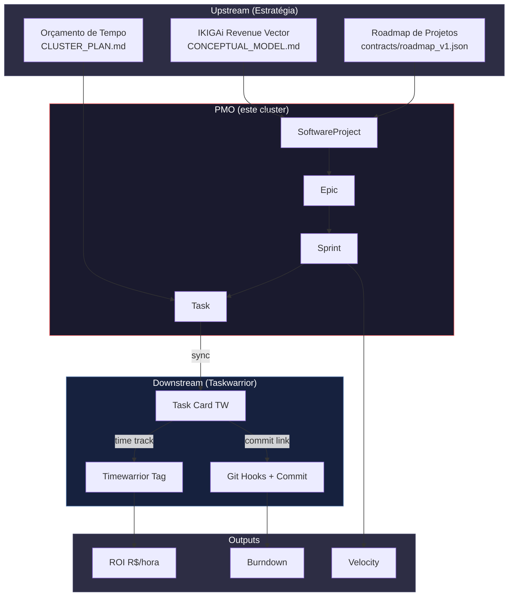
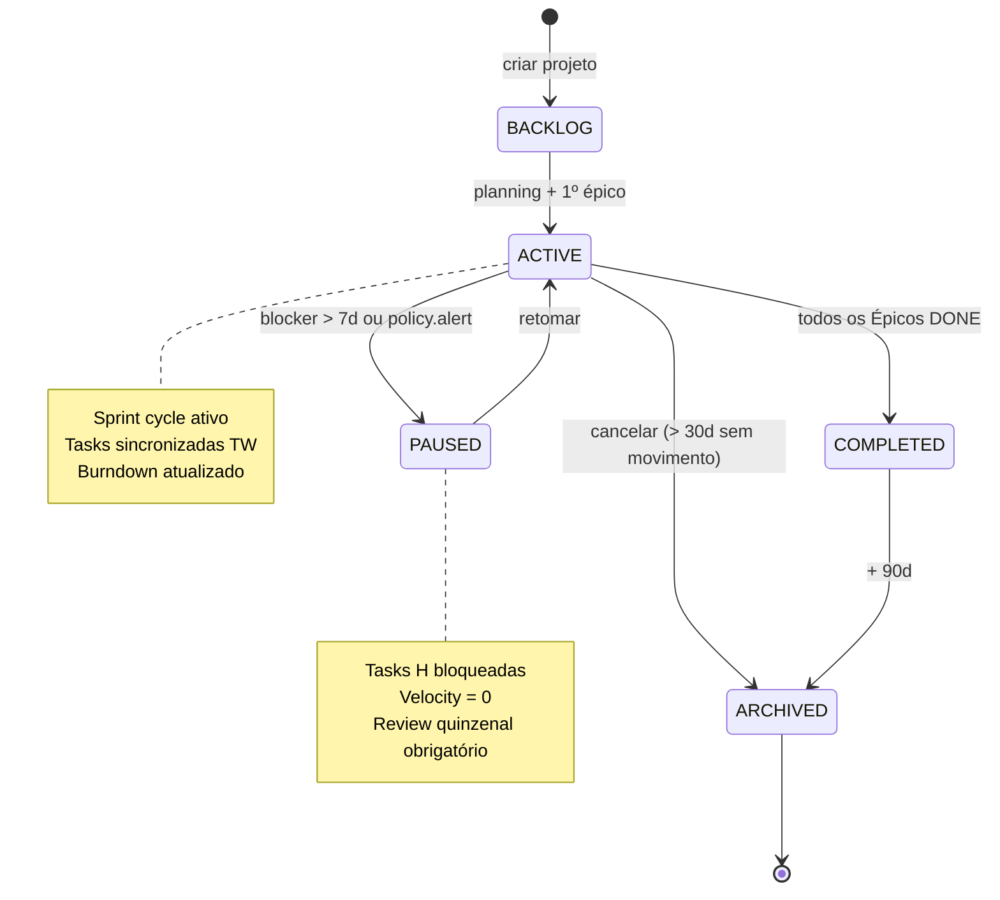
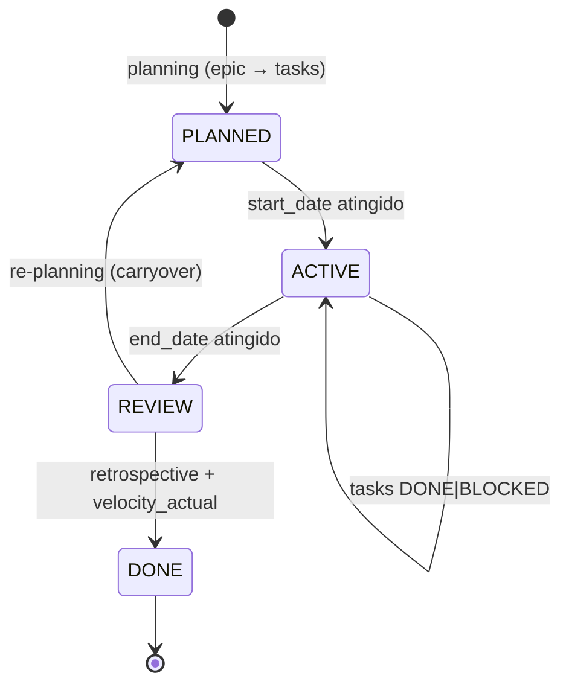
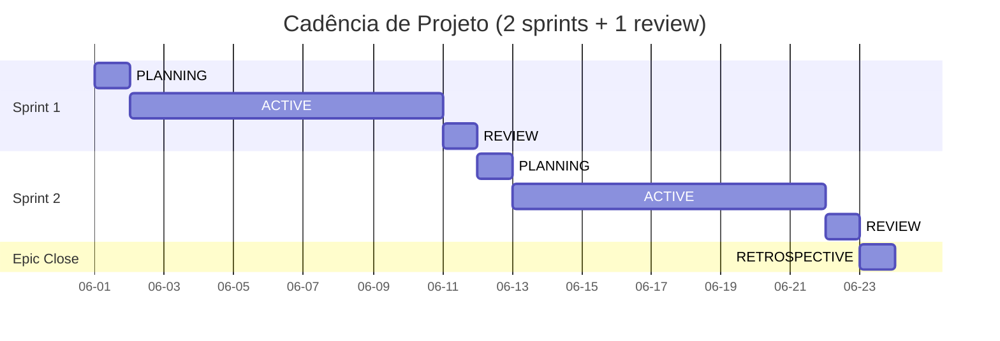

# CLUSTER_PROJ.md

> **Standalone Memory Machine — Cluster 2: Project Execution (PMO ↔ Taskwarrior)**
>
> Este documento define **como entregáveis de software são gerados do zero ao
> done** — desde a quebra de um Épico até o commit no git, passando pela
> interceptação entre a estratégia de roadmap e a execução granular no
> Taskwarrior.
>
> **Audiência:** o Matheus gerenciando portfólio/freela, ou um agente/IA
> tentando implementar o ciclo de vida de um projeto de software.
>
> **Diferencial vs. PRD-04:** o `vibe-ops/planning/PRD-04-project-execution.md`
> define **entidades e CLI**; este doc adiciona a **camada PMO** (Project
> Management Office) — o backlog estratégico que intercepta o Taskwarrior e
> impede que cada task vire órfã. É o **agente de interceptação PMO ↔ TW**.

---

## §0. DECLARAÇÃO DE PROPÓSITO

> "Um Taskwarrior sem PMO é uma lista de tarefas sem história. Um PMO sem
> Taskwarrior é um plano sem execução. Este cluster é o **agente de
> interceptação** que une os dois — garantindo que cada card no TW tenha um
> Épico acima, que cada Épico tenha um Projeto acima, e que cada Projeto
> tenha um objetivo de renda acima."

### Diagrama de Contexto: o agente de interceptação



**Leitura:** o PMO fica no meio. Recebe estratégia (upstream) e materializa
em tasks. Envia para Taskwarrior (downstream), que é onde a execução real
acontece. Recebe telemetria de volta (commits, time tracking) e devolve
outputs (ROI, burndown, velocity) que realimentam o IKIGAi Revenue.

---

## §1. DOMÍNIO & ESCOPO

### Hierarquia Canônica

```
SoftwareProject (PMO, ativo/inativo)
  └── Epic (feature ou capacidade nova)
        └── Sprint (2 semanas, velocity target)
              └── Task (Taskwarrior card)
                    └── TimewarriorEntry (registro de tempo)
                          └── GitCommit (M2 link)
```

### Responsabilidades (dentro do escopo)

- Manter o **backlog priorizado** de projetos (RICE + IKIGAi Revenue)
- Quebrar Épicos em Sprints operáveis (1 sprint ≈ 2 semanas = 10 dias úteis)
- Decompor Sprint em Tasks granulares com UDAs Taskwarrior
- Sincronizar bidirecionalmente TW ↔ SQLite ↔ Obsidian
- Computar **Velocity**, **Burndown**, **ROI R$/hora**
- Interceptar entre estratégia de roadmap e execução granular

### Fora do Escopo (delega para outros clusters/docs)

- **Rotinas / blocos / pomodoro:** `CLUSTER_PLAN.md`
- **Tópicos de estudo / pré-req:** `CLUSTER_STUDY.md`
- **Métricas de saúde / sono:** `vibe-ops/planning/PRD-05-metrics-health.md`
- **Hábitos / streak:** `vibe-ops/planning/PRD-02-habit-tracker.md`
- **Regime π(s_t):** `vibe-ops/planning/PRD-06-policy-governance.md`
- **Estratégia (sonhos/objetivos):** `strategics/`
- **Detalhes Pydantic/CLI Task/Project:** `vibe-ops/planning/PRD-04-project-execution.md`
- **TW setup/config:** `taskwarrior/`

---

## §2. ENTIDADES & ESTADOS

### SoftwareProject (a unidade PMO)

```python
class SoftwareProject(BaseModel):
    id: UUID
    slug: str                        # kebab-case único, ex: "vibe-ops-pipeline"
    title: str
    description: str
    status: ProjectStatus            # BACKLOG|ACTIVE|PAUSED|COMPLETED|ARCHIVED
    vector_tags: list[IKIGAiVector]   # passion|skill|market|revenue|course
    tech_stack: list[str]
    repo_url: Optional[str]
    target_revenue: Optional[float]  # R$/mês esperado
    actual_revenue: float = 0.0
    created_at: datetime
    deadline: Optional[date]
    priority: int = Field(ge=1, le=10)
    tags: list[str] = []
    pm_owner: str = "matheus"        # futuro: multi-user
    ikigai_alignment: dict           # ex: {"passion": 0.7, "revenue": 0.9}
```

### Epic (capacidade ou feature)

```python
class Epic(BaseModel):
    id: UUID
    project_id: UUID
    title: str
    status: EpicStatus               # PLANNED|IN_PROGRESS|DONE|CANCELLED
    acceptance_criteria: list[str]   # não pode ser vazio
    estimated_hours: float
    actual_hours: float = 0.0
    weight: float = 1.0              # relativo a outros Épicos do mesmo projeto
    sprints: list[UUID]              # FKs → Sprint.ids
    ikigai_vector_focus: IKIGAiVector
    prerequisites_epics: list[UUID]  # FKs → Epic.ids (deps)
    github_milestone: Optional[int]  # GH milestone number
```

### Sprint (2 semanas operáveis)

```python
class Sprint(BaseModel):
    id: UUID
    epic_id: UUID
    name: str                        # ex: "sprint-01-auth"
    goal: str                        # uma frase, mensurável
    start_date: date
    end_date: date
    status: SprintStatus             # PLANNED|ACTIVE|REVIEW|DONE
    velocity_target: Optional[int]   # story points
    velocity_actual: int = 0
    retrospective: Optional[str]
    blockers: list[str] = []
    days_remaining: Optional[int]    # computado
    burndown_data: list[dict]        # [(date, remaining_points)]
```

### Task (a unidade executável)

```python
class Task(BaseModel):
    id: UUID
    tw_uuid: Optional[str]           # UUID Taskwarrior (sync bidirecional)
    sprint_id: Optional[UUID]
    title: str
    status: TaskStatus               # TODO|IN_PROGRESS|DONE|BLOCKED|CANCELLED
    priority: TaskPriority           # H|M|L
    tags: list[str] = []
    project_tag: str                 # campo project: do Taskwarrior
    due: Optional[datetime]
    estimate_hours: Optional[float]
    actual_hours: float = 0.0
    story_points: Optional[int]
    depends_on: list[UUID] = []      # task_ids
    # UDAs Taskwarrior (PRD-04 §4)
    uda_energy: Optional[EnergyLevel]    # H|M|L
    uda_context: Optional[str]           # work|study|life
    uda_ikigai: Optional[IKIGAiVector]
    uda_wave: Optional[str]
    # Commit linking (M2)
    commit_sha: Optional[str]
    github_issue: Optional[int]
```

### TimewarriorEntry + Commit (camada de telemetria)

```python
class TimewarriorEntry(BaseModel):
    id: str
    task_id: Optional[UUID]
    tw_uuid: Optional[str]
    tags: list[str]
    start: datetime
    end: Optional[datetime]
    duration_minutes: Optional[float]
    date: date

class CommitLink(BaseModel):          # M2
    sha: str
    task_id: UUID
    message: str
    timestamp: datetime
    files_changed: int
    additions: int
    deletions: int
```

### Máquina de Estados do SoftwareProject



### Máquina de Estados do Sprint



---

## §3. FRENTES DE DECISÃO (o que precisa decidir no cluster)

### A pergunta-chave do cluster

> **"Dentre os projetos ativos, em qual Épico/Sprint/Task devo investir o
> próximo pomodoro?"**

### Árvore de Decisão: "Tenho N horas livres, em qual task trabalho?"

```mermaid
flowchart TD
    A[Tenho X horas livres] --> B{Estou em<br/>qual regime?}
    B -->|PUSH| C[Escolher Épico<br/>de ACTIVE project<br/>priorizado por RICE]
    B -->|MAINTAIN| D[Continuar Sprint atual<br/>tasks H pendentes]
    B -->|REDUCE| E[Reduzir para 1 task H<br/>mais 1 task M (admin)]
    B -->|RECOVER| F[Cancelar laborative<br/>priorizar recovery]

    C --> G{Projeto com<br/>deadline < 7d?}
    G -->|Sim| H[Ativar modo<br/>Build-to-Earn<br/>70% Earn, 30% Learn]
    G -->|Não| I{Projeto com<br/>bloqueador de cliente?}
    I -->|Sim| J[Priorizar bloqueio<br/>alerta PMO]
    I -->|Não| K[Manter Sprint atual<br/>velocity_target]

    D --> L{Task bloqueada<br/>> 2d?}
    L -->|Sim| M[Acionar M4 ReviewOperator<br/>escalar ou cancelar]
    L -->|Não| N[Continuar sprint<br/>próxima task H]

    E --> O[Registrar Q_HE<br/>reduzido em policy]
    F --> P[Shift para CLUSTER_PLAN<br/>rotina de recovery]
```

### Casos Especiais (decisões que o PMO arbitra)

| Caso | Regra |
|---|---|
| 2 Épicos competem por atenção | **RICE + IKIGAi Revenue**: score = (Reach × Impact × Confidence) / Effort × weight_ikigai |
| Task depende de task bloqueada | Bloquear a task dependente com `BLOCKED`; **não** mover para próximo sprint sem resolver |
| Sprint velocity < 70% do target | **NÃO estender sprint** — cancelar tasks L/M, manter H; retro obrigatória |
| Bug crítico em produção | Quebrar sprint atual, abrir `Sprint HOTFIX` (1 task, 1 dia), retomar sprint normal |
| Cliente pede feature fora do roadmap | Avaliar RICE: se score > Épicos planejados, **abrir Épico novo no BACKLOG** (não inserir no sprint ativo) |
| Tempo investido vs. `target_revenue` (ROI) | Se ROI < R$30/h por 2 sprints consecutivos → rever precificação ou cancelar projeto |
| Múltiplos projetos ACTIVE simultâneos | Limite: 2 projetos (1 dev pessoal + 1 cliente). Terceiro vira BACKLOG |
| Épico sem `acceptance_criteria` | **Bloquear entrada em sprint** até criteria ser preenchido (anti-pattern PRD-04 §8) |

### Cálculo RICE + IKIGAi (a "fórmula mágica" do PMO)

$$
\text{PriorityScore} = \frac{(R \times I \times C)}{E} \times w_{\text{ikigai}} \times w_{\text{deadline}}
$$

| Componente | Significado | Faixa | Exemplo |
|---|---|---|---|
| $R$ (Reach) | Quantas pessoas/sessões impactadas | 1-10 | API: 8, CLI pessoal: 3 |
| $I$ (Impact) | Magnitude da mudança | 0.25-3 | Massivo: 3, Mínimo: 0.25 |
| $C$ (Confidence) | Certeza sobre a estimativa | 0-100% | 80% |
| $E$ (Effort) | Horas-homem estimadas | horas | 16h |
| $w_{\text{ikigai}}$ | Peso do vetor IKIGAi do projeto | 0.5-1.5 | revenue: 1.5, skill: 1.0 |
| $w_{\text{deadline}}$ | Peso por proximidade do deadline | 0.8-1.5 | < 7d: 1.5, > 30d: 0.8 |

> **Origem do framework:** `vibe-ops/base/Planning_notes.md` (RICE)
> **Vetores IKIGAi:** `CONCEPTUAL_MODEL.md §3` (5 vetores + meta-vetor)

---

## §4. FREQUÊNCIA E CADÊNCIA

| Camada | Frequência | Outputs Canônicos | Onde Mora |
|---|---|---|---|
| **Daily Standup (pessoal)** | Diário, 5min | `Sprint.burndown_data[today]` | `vibe-ops/src/pipeline/tw_sync.py` |
| **Sprint Planning** | A cada 2 semanas | `Sprint.tasks` definido, `velocity_target` set | `vibe-ops/planning/TEMPLATE-epic-sprint.md` |
| **Sprint Review** | Fim de sprint (a cada 10d úteis) | `Sprint.velocity_actual`, `retrospective` | `vibe-ops/planning/TEMPLATE-epic-sprint.md` |
| **Epic Review** | Fim do Épico (1-4 sprints) | `Epic.actual_hours`, `acceptance_criteria.check` | `vibe-ops/planning/TEMPLATE-epic-sprint.md` |
| **Project Review** | Mensal | `Project.actual_revenue`, ROI mensal | `PRD-04 §7 (vibe-ops projects roi --month)` |
| **Backlog Grooming** | Semanal | `Project.priority` atualizado (RICE) | `vibe-ops/planning/TEMPLATE-micro-ciclo.md` |
| **Quarterly PAE** | 90d | Sonho vs realizado | `strategics/Planejamento (Estratégico e Tático).md §6` |
| **TW Sync (bidirecional)** | Contínuo (event-driven) | `Task.tw_uuid` ↔ `Task.id` | `vibe-ops/src/pipeline/tw_sync.py` |
| **Commit Link (M2)** | A cada `git commit` | `CommitLink.sha` → `Task.id` | `vibe-ops/src/pipeline/code_review_sync.py` |
| **Time Track (Timewarrior)** | A cada pomodoro (CLUSTER_PLAN) | `TimewarriorEntry.duration_minutes` | `timew` + `vibe-ops/src/pipeline/tw_sync.py` |

### Cadência Visual



---

## §5. MIDDLEWARES ENVOLVIDOS

| Middleware | Papel neste cluster | Status | Localização |
|---|---|---|---|
| **M1. StoryPointDecomposer** | Quebrar Épico em tasks com `size`/`priority`/`upstream_id` | 🟡 gap | `vibe-ops/src/contracts/roadmap_sync_v1.py` (contrato existe, decompositor não) |
| **M2. CommitTaskLinker** | Hook git → SQLite, preenche `changelog_entries` | 🟡 gap | `vibe-ops/src/pipeline/code_review_sync.py` (existe, sem consumer) |
| **M8. StreamlitBI** | Dashboard de burndown, velocity, ROI | 🟡 gap | (não existe) |
| `vibe-ops/src/pipeline/tw_sync.py` | Sync bidirecional TW ↔ SQLite | 🟡 parcial | `vibe-ops/src/pipeline/tw_sync.py` |
| `vibe-ops/src/pipeline/tw_sync_adapter.py` | Adapter TW (tasklib) | 🟡 parcial | `vibe-ops/src/pipeline/tw_sync_adapter.py` |
| `vibe-ops/src/pipeline/roadmap_sync_ingest.py` | Ingest de roadmap para SQLite | 🟡 parcial | `vibe-ops/src/pipeline/roadmap_sync_ingest.py` |
| `vibe-ops/src/contracts/roadmap_v1.json` | Contrato de roadmap | 🟢 | `vibe-ops/contracts/roadmap_v1.json` |
| `vibe-ops/src/contracts/roadmap_sync_v1.py` | Pydantic roadmap | 🟢 | `vibe-ops/src/contracts/roadmap_sync_v1.py` |
| `vibe-ops/src/contracts/sync_contract_v1.py` | Contrato de sync genérico | 🟢 | `vibe-ops/src/contracts/sync_contract_v1.py` |
| `vibe-ops/src/contracts/planning.v1.yaml` | Contrato planning (incl. project entities) | 🟢 | `vibe-ops/src/contracts/planning.v1.yaml` |
| `vibe-ops/src/middleware/sync_engine.py` | Orquestrador central de sync | 🟡 parcial | `vibe-ops/src/middleware/sync_engine.py` |
| `vibe-ops/src/models/project_entities.py` | Pydantic Project/Epic/Sprint/Task | 🟢 | `vibe-ops/src/models/project_entities.py` |
| `vibe-ops/src/models/operational_entities.py` | TimewarriorEntry, CommitLink | 🟢 | `vibe-ops/src/models/operational_entities.py` |
| `vibe-ops/src/pipeline/reverse_sync.py` | Sync reverso (SQLite → TW) | 🟡 parcial | `vibe-ops/src/pipeline/reverse_sync.py` |
| `vibe-ops/src/pipeline/sync_orchestrator.py` | Orquestrador de todos os syncs | 🟡 parcial | `vibe-ops/src/pipeline/sync_orchestrator.py` |
| `vibe-ops/src/pipeline/router.py` | Roteamento de eventos | 🟡 parcial | `vibe-ops/src/pipeline/router.py` |
| `vibe-ops/src/pipeline/unified_router.py` | Roteador unificado (capability-based) | 🟡 parcial | `vibe-ops/src/pipeline/unified_router.py` |
| `vibe-ops/src/pipeline/fk_resolver.py` | Resolvedor de FKs entre domínios | 🟡 parcial | `vibe-ops/src/pipeline/fk_resolver.py` |
| `vibe-ops/src/pipeline/enrichment.py` | Enriquecimento de entidades | 🟡 parcial | `vibe-ops/src/pipeline/enrichment.py` |
| `vibe-ops/src/pipeline/enrichment_engine.py` | Engine de enrichment (unified) | 🟡 parcial | `vibe-ops/src/pipeline/enrichment_engine.py` |
| `vibe-ops/src/pipeline/ikigai_scorer.py` | Consome ROI → atualiza vetor Revenue | 🟡 parcial | `vibe-ops/src/pipeline/ikigai_scorer.py` |
| `vibe-ops/src/pipeline/mvl_orchestrator.py` | Minimum Viable Loop orchestrator | 🟡 parcial | `vibe-ops/src/pipeline/mvl_orchestrator.py` |
| `vibe-ops/migrations/002_roadmap_sync_v1.sql` | Schema SQL para roadmap | 🟢 | `vibe-ops/migrations/002_roadmap_sync_v1.sql` |
| `vibe-ops/migrations/001_create_dev_cluster_tables.sql` | Schema dev cluster | 🟢 | `vibe-ops/migrations/001_create_dev_cluster_tables.sql` |
| `vibe-ops/migrations/003_epistemic_priority_view.sql` | View SQL de prioridade epistêmica | 🟢 | `vibe-ops/migrations/003_epistemic_priority_view.sql` |
| `vibe-ops/scripts/audit_github_execution.ps1` | Auditoria GH execution | 🟡 | `vibe-ops/scripts/audit_github_execution.ps1` |
| `vibe-ops/scripts/setup_git_telemetry_hook.ps1` | Setup do hook git (M2) | 🟢 | `vibe-ops/scripts/setup_git_telemetry_hook.ps1` |
| `vibe-ops/planning/TEMPLATE-epic-sprint.md` | Template operacional Épico→Sprint | 🟢 | `vibe-ops/planning/TEMPLATE-epic-sprint.md` |
| `vibe-ops/planning/TEMPLATE-micro-ciclo.md` | Template micro-ciclo (MDP/Knapsack) | 🟢 | `vibe-ops/planning/TEMPLATE-micro-ciclo.md` |
| `vibe-ops/planning/TEMPLATE-weekly-review.md` | Template review semanal | 🟢 | `vibe-ops/planning/TEMPLATE-weekly-review.md` |
| `vibe-ops/architecture/ADR-001-data-flow-topology.md` | ADR data flow | 🟢 | `vibe-ops/architecture/ADR-001-data-flow-topology.md` |
| `vibe-ops/architecture/ADR-002-mesh-contracts-state-machines.md` | ADR contratos e state machines | 🟢 | `vibe-ops/architecture/ADR-002-mesh-contracts-state-machines.md` |
| `taskwarrior/scripts/calculate-metrics.py` | Cálculo de métricas TW | 🟢 | `taskwarrior/scripts/calculate-metrics.py` |
| `taskwarrior/scripts/working-days.py` | Cálculo de dias úteis | 🟢 | `taskwarrior/scripts/working-days.py` |
| `taskwarrior/scripts/backup-and-recur.sh` | Backup e recorrência TW | 🟢 | `taskwarrior/scripts/backup-and-recur.sh` |
| `taskwarrior/scripts/generate-working-recur.sh` | Gerador de recorrência (working days) | 🟢 | `taskwarrior/scripts/generate-working-recur.sh` |
| `taskwarrior/docs/TASKWARRIOR_STRATEGIC_WORKFLOWS.md` | Workflows TW estratégicos | 🟢 | `taskwarrior/docs/TASKWARRIOR_STRATEGIC_WORKFLOWS.md` |
| `taskwarrior/docs/TASKWARRIOR_HOWTO.md` | Como usar TW | 🟢 | `taskwarrior/docs/TASKWARRIOR_HOWTO.md` |
| `taskwarrior/docs/TASKWARRIOR_PITFALLS_AND_WORKAROUNDS.md` | Pitfalls TW | 🟢 | `taskwarrior/docs/TASKWARRIOR_PITFALLS_AND_WORKAROUNDS.md` |
| `taskwarrior/docs/TASKWARRIOR_COMPLETE_FEATURES.md` | Features completas TW | 🟢 | `taskwarrior/docs/TASKWARRIOR_COMPLETE_FEATURES.md` |
| `taskwarrior/docs/TASKWARRIOR_SETUP_COMPLETE.md` | Setup completo TW | 🟢 | `taskwarrior/docs/TASKWARRIOR_SETUP_COMPLETE.md` |
| `taskwarrior/config/taskrc.template` | Template `.taskrc` (com UDAs energy/ikigai/wave) | 🟢 | `taskwarrior/config/taskrc.template` |
| `taskwarrior/config/hooks/on-exit` | Hook on-exit TW | 🟢 | `taskwarrior/config/hooks/on-exit` |
| `taskwarrior/help/content/09-udas.md` | UDAs (energy, ikigai, wave) | 🟢 | `taskwarrior/help/content/09-udas.md` |
| `taskwarrior/help/content/12-metrics.md` | Métricas TW built-in | 🟢 | `taskwarrior/help/content/12-metrics.md` |
| `taskwarrior/help/content/02-workflows.md` | Workflows TW | 🟢 | `taskwarrior/help/content/02-workflows.md` |
| `taskwarrior/help/content/aliases-quick.md` | Aliases rápidos TW | 🟢 | `taskwarrior/help/content/aliases-quick.md` |
| `taskwarrior/help/content/01-hierarchy.md` | Hierarquia TW (Project/Tag) | 🟢 | `taskwarrior/help/content/01-hierarchy.md` |
| `taskwarrior/help/content/03-filters.md` | Filtros TW | 🟢 | `taskwarrior/help/content/03-filters.md` |
| `taskwarrior/help/content/06-reports.md` | Reports TW | 🟢 | `taskwarrior/help/content/06-reports.md` |
| `taskwarrior/help/content/08-recurrence.md` | Recorrência TW | 🟢 | `taskwarrior/help/content/08-recurrence.md` |
| `taskwarrior/help/content/11-blocks.md` | Blocks TW | 🟢 | `taskwarrior/help/content/11-blocks.md` |
| `taskwarrior/help/content/10-aliases.md` | Aliases TW | 🟢 | `taskwarrior/help/content/10-aliases.md` |
| `taskwarrior/help/content/05-flags.md` | Flags TW | 🟢 | `taskwarrior/help/content/05-flags.md` |
| `taskwarrior/help/content/07-contexts.md` | Contexts TW | 🟢 | `taskwarrior/help/content/07-contexts.md` |
| `taskwarrior/help/content/04-args.md` | Args TW | 🟢 | `taskwarrior/help/content/04-args.md` |
| `taskwarrior/help/CROSS_PLATFORM_HELP_GUIDE.md` | Cross-platform help | 🟢 | `taskwarrior/help/CROSS_PLATFORM_HELP_GUIDE.md` |
| `taskwarrior/pwsh/task-aliases.ps1` | Aliases PowerShell TW | 🟢 | `taskwarrior/pwsh/task-aliases.ps1` |
| `taskwarrior/scripts/task_aliases.sh` | Aliases bash TW | 🟢 | `taskwarrior/scripts/task_aliases.sh` |
| `taskwarrior/SPEC.md` | Especificação TW | 🟢 | `taskwarrior/SPEC.md` |
| `taskwarrior/README.md` | Overview TW | 🟢 | `taskwarrior/README.md` |
| `life/centrals/task.py` | Central CLI task | 🟡 | `centrals/task.py` |
| `life/centrals/base.py` | BaseCentral (run_cli helper) | 🟢 | `centrals/base.py` |
| `life/cli/cli.py` | CLI main | 🟢 | `cli/cli.py` |
| `life/cli/config.py` | LifeConfig | 🟢 | `cli/config.py` |
| `life-ops/life_tatics/Planning_notes.md` | Planning notes (cópia) | 🟢 | `life-ops/life_tatics/Planning_notes.md` |
| `life-ops/life_tatics/time-lenghts_reviews.md` | Time-lenghts reviews (cópia) | 🟢 | `life-ops/life_tatics/time-lenghts_reviews.md` |
| `life-ops/planner/SCALAR_DECOMPOSITION_BACKLOG.md` | 27 modelos matemáticos (integração) | 🟢 | `life-ops/planner/SCALAR_DECOMPOSITION_BACKLOG.md` |
| `life-ops/planner/Points_of_premisses-task-habits.md` | Q_HE, regimes | 🟢 | `life-ops/planner/Points_of_premisses-task-habits.md` |
| `life-ops/planner/time-lenghts_reviews.md` | WORK_RATIO, WAVE/CYCLE | 🟢 | `life-ops/planner/time-lenghts_reviews.md` |
| `vibe-ops/vectors/vector-revenue.md` | Vetor Revenue (consumidor) | 🟢 | `vibe-ops/vectors/vector-revenue.md` |
| `vibe-ops/vectors/vector-skill.md` | Vetor Skill (consumidor) | 🟢 | `vibe-ops/vectors/vector-skill.md` |
| `vibe-ops/vectors/vector-market.md` | Vetor Market (consumidor) | 🟢 | `vibe-ops/vectors/vector-market.md` |
| `vibe-ops/vectors/vector-passion.md` | Vetor Passion (consumidor) | 🟢 | `vibe-ops/vectors/vector-passion.md` |
| `vibe-ops/artifacts/pm-agnostic-metadata.md` | Metadata PM-agnostic | 🟢 | `vibe-ops/artifacts/pm-agnostic-metadata.md` |
| `vibe-ops/artifacts/sample_topic.md` | Sample topic artifact | 🟢 | `vibe-ops/artifacts/sample_topic.md` |
| `vibe-ops/artifacts/topology-diagrams.md` | Diagramas de topologia | 🟢 | `vibe-ops/artifacts/topology-diagrams.md` |

### Tabela Reversa: "se eu mexo em X, este cluster é impactado em Y"

| Mudança externa | Impacto neste cluster |
|---|---|
| Adicionar UDA no `taskrc.template` | Quebrar sync se UDA não existe em `Task.uda_*` |
| Mudar `IKIGAi Vector` (CONCEPTUAL_MODEL §3) | RICE peso recalculado, priorização de backlog muda |
| Implementar M1 Decompositor | Épicos podem virar sprints automaticamente |
| Implementar M2 CommitLinker | ROI R$/hora vira automático (atualmente manual) |
| Adicionar campo em `roadmap_v1.json` | Contrato muda, sincronização precisa revisão |
| TW upgrade major (3.x → 4.x) | `tw_sync.py` provavelmente quebra, schemas podem mudar |
| Política de regime mudar (PRD-06) | Sprint velocity target pode ser reduzido em REDUCE |

---

## §6. INTEGRAÇÃO COM OUTROS CLUSTERS

| Cluster | Direção | Contrato |
|---|---|---|
| **CLUSTER_PLAN** | PLAN → PROJ | `TimeBlock.duration_min_target` alocado para tasks |
| **CLUSTER_PLAN** | PROJ → PLAN | `Task.priority=H` consome pomodoro, desce energia |
| **CLUSTER_STUDY** | PROJ → STUDY | `Project.tech_stack` → `StudyTopic` requerido (skill gap) |
| **CLUSTER_STUDY** | STUDY → PROJ | Skills adquiridas alimentam `Project.ikigai_alignment.skill` |
| **CLUSTER_STUDY** | PROJ → STUDY | `Project.ikigai_alignment.skill < threshold` → trigger "study new skill" |
| **IKIGAi (CONCEPTUAL_MODEL)** | PROJ → IKIGAi | `actual_revenue`, `velocity` → atualizam vetor Revenue |
| **IKIGAi (CONCEPTUAL_MODEL)** | IKIGAi → PROJ | `Regime π(s_t)` modula `velocity_target` (PUSH = +20%) |
| **Metrics (PRD-05)** | PROJ → Metrics | `TimewarriorEntry.duration`, `Task.completed` |
| **Policy (PRD-06)** | PROJ → Policy | `task.completed`, `sprint.closed`, `epic.completed` events |
| **Policy (PRD-06)** | Policy → PROJ | `policy.alert` pausa tasks baixa prioridade |
| **Temporal (PRD-01)** | PROJ → Temporal | `Sprint.anchor_wave` (cada sprint ancora em wave) |
| **Habit (PRD-02)** | PROJ → Habit | Tasks completadas → `Habit.streak` se rotina-âncora |
| **vibe-ops/base/Planning_notes.md** | PROJ → Frameworks | RICE, MoSCoW, Eisenhower |
| **vibe-ops/base/IKIGAi.md** | PROJ → IKIGAi | Setpoints Build to Earn |
| **strategics/Modelagem Operacional.md** | PROJ → Pirâmide | Tasks ancoram em Metas Semanais |
| **strategics/Hierarquia de Objetivos.md** | PROJ → Hierarquia | Tasks = Nível 4 (Tarefas Diárias) |
| **strategics/Integracao_Tatica.md** | PROJ → Labels | `+proj`, `+sprint`, `+epic` |
| **strategics/Planejamento (Estratégico e Tático).md** | PROJ → Setpoints | Build to Earn % por fase |
| **strategics/Análise (Tático e Operacional).md** | PROJ → Relatórios | Daily report (checklist) |
| **strategics/Desempenho Subjacente.md** | PROJ → 5×3×3 | Velocity contribui para supervisão quinzenal |
| **life-ops/planner/SCALAR_DECOMPOSITION_BACKLOG.md** | PROJ → Matemática | MODEL-001..027 (MDP, Knapsack, etc.) |
| **life-ops/planner/Points_of_premisses-task-habits.md** | PROJ → H(t), E(t) | Energy curve alimenta `uda_energy` |
| **life-ops/planner/time-lenghts_reviews.md** | PROJ → WORK_RATIO | 22/30 = 0.7333 modula capacidade semanal |

### Contrato de Fronteira com CLUSTER_PLAN (recíproco)

```yaml
# PROJ → PLAN: requisita alocação
project_to_plan_contract:
  task_id: str
  task_priority: H|M|L
  task_energy_required: H|M|L
  requested_block: morning|afternoon|evening
  estimated_pomodoros: int
  depends_on: list[str]
  ikigai_vector: passion|skill|market|revenue|course
  sprint_id: Optional[str]
  epic_id: Optional[str]
  deadline: Optional[datetime]

# PLAN → PROJ: confirma alocação
plan_response:
  allocated_pomodoros: int
  block_assigned: TimeBlock
  window_start: time
  window_end: time
  energy_cost_estimate: float
  conflict_with: list[str]
  regime_at_execution: PUSH|MAINTAIN|REDUCE|RECOVER
```

### Contrato de Fronteira com CLUSTER_STUDY (skill gap detection)

```yaml
# PROJ → STUDY: detecta gap de skill
project_to_study_contract:
  project_id: str
  tech_stack: list[str]
  required_skills: list[SkillRequirement]
  deadline: date

class SkillRequirement(BaseModel):
  skill_category: str  # programming|ai_ml|data_engineering|...
  required_level: Literal["beginner","intermediate","advanced","expert"]
  estimated_lead_time_hours: float

# STUDY → PROJ: aloca topics
study_to_project_contract:
  topics_covering: list[StudyTopic]  # topics que cobrem os requisitos
  estimated_completion_date: date
  hours_already_invested: float
  hours_remaining: float
```

### Contrato TW ↔ SQLite (M1 + M2 + sync)

```yaml
# Taskwarrior UDAs (PRD-04 §4 + taskrc.template)
udas:
  energy: H|M|L          # consume cognitiva
  context: work|study|life
  ikigai: passion|skill|market|revenue|course
  wave: ^wave-\d{4}-q[1-4]$

# Sync state
sync_state:
  last_sync_at: datetime
  direction: both|sqlite_to_tw|tw_to_sqlite
  divergence_count: int  # tasks que divergem entre TW e SQLite
  ghost_tasks: list[str]  # tasks em TW sem Task.id correspondente
```

---

## §7. CLI / COMANDOS CANÔNICOS

```bash
# === Backlog e Projetos ===
python -m vibe_ops.cli projects list --status active
python -m vibe_ops.cli projects list --status backlog --priority-min 7
python -m vibe_ops.cli projects show <slug>
python -m vibe_ops.cli projects create --slug vibe-ops-v2 --title "Vibe-Ops v2" --revenue-target 5000
python -m vibe_ops.cli projects archive <slug> --reason "obsolete"

# === Épicos ===
python -m vibe_ops.cli projects epics list --project <slug>
python -m vibe_ops.cli projects epics create --project <slug> --title "JWT auth" --hours 16 --criteria "login,logout,refresh"
python -m vibe_ops.cli projects epics close <epic_id> --retrospective "..."

# === Sprints ===
python -m vibe_ops.cli projects sprints plan --epic <id> --duration 10 --velocity-target 25
python -m vibe_ops.cli projects sprints close <sprint_id>
python -m vibe_ops.cli projects sprints burndown <sprint_id>

# === Tasks (Taskwarrior sync) ===
python -m vibe_ops.cli projects tasks create --sprint <id> --title "Implementar POST /login" --priority H --energy H --ikigai revenue --estimate 4
python -m vibe_ops.cli projects tasks list --sprint <id> --status todo
python -m vibe_ops.cli projects tasks block <task_id> --reason "depends on TASK-123"
python -m vibe_ops.cli projects tasks done <task_id> --actual-hours 3.5

# === TW sync (interceptação PMO ↔ TW) ===
python -m vibe_ops.cli projects tw sync --direction both
python -m vibe_ops.cli projects tw sync --direction sqlite_to_tw --project <slug>
python -m vibe_ops.cli projects tw ghost-tasks  # detectar tasks TW órfãs

# === ROI e métricas ===
python -m vibe_ops.cli projects roi --month 2026-06
python -m vibe_ops.cli projects roi --project <slug> --period all
python -m vibe_ops.cli projects velocity --project <slug> --sprints 5
python -m vibe_ops.cli projects burndown --epic <id>

# === Commit linking (M2) ===
python -m vibe_ops.cli projects commit link --task <id> --sha abc1234
python -m vibe_ops.cli projects commit unlinked --sprint <id>
```

### Outputs Esperados (exemplo `projects burndown --epic epic-01`)

```json
{
  "epic_id": "epic-jwt-auth",
  "title": "JWT Authentication",
  "total_points": 30,
  "burndown": [
    {"date": "2026-06-01", "remaining": 30},
    {"date": "2026-06-02", "remaining": 28},
    {"date": "2026-06-03", "remaining": 25},
    {"date": "2026-06-04", "remaining": 21},
    {"date": "2026-06-05", "remaining": 18}
  ],
  "current_burn_rate": 3.0,
  "eta": "2026-06-10",
  "on_track": true,
  "velocity_actual": 12,
  "velocity_target": 15,
  "blockers": []
}
```

---

## §8. ANTI-PATTERNS

### 🚫 Proibido (PRD-04 §8 + extensões PMO)

1. **Sprint com Épicos sem `acceptance_criteria`** — vago, impossível validar DONE
2. **Task sem `project_tag`** — fica órfã no TW, sem rastreabilidade
3. **Commit sem TW UUID linkado (M2 gap)** — perde rastreabilidade de tempo
4. **Mudar `priority` no TW sem refletir no SQLite** — divergência, sync falha
5. **Estender sprint > 1x** — admite-se 1 extensão; 2+ é sintoma de má planning
6. **Criar projeto novo sem `target_revenue`** — sem meta, sem ROI, sem cobrança
7. **Aceitar 3+ projetos ACTIVE simultâneos** — context-switch destrói velocity
8. **Mover task entre sprints sem replanning** — esconde o problema, infla metrics
9. **Task H-priority > 5 dias sem DONE** — escalonar ou cancelar (M4 ReviewOperator)
10. **Sprint sem velocity_target definido** — sem meta, sem burndown, sem agência
11. **Sync TW → SQLite ignorando ghost tasks** — tarefas órfãs viram lixo técnico
12. **Iniciar Épico sem `prerequisites_epics` resolvidos** — vai falhar, vai re-trabalhar

### ✅ Obrigatório

1. **Todo Épico tem 3-7 `acceptance_criteria` mensuráveis**
2. **Toda Task tem `uda_energy`, `uda_ikigai`, `uda_wave`, `project_tag`**
3. **Sprint review com retrospective textual** (mínimo 3 itens: bem, mal, melhorar)
4. **Project mensal com `actual_revenue` atualizado** (manual ou via integração)
5. **Velocity target baseado em média dos últimos 3 sprints** (não chute)
6. **TW sync auditado semanalmente** (ghost tasks = 0)
7. **ROI mensal calculado e arquivado** (alimenta IKIGAi Revenue)
8. **PAE trimestral cruza `Project.actual_revenue` com `Project.target_revenue`**

---

## §9. MÉTRICAS DO CLUSTER (KPIs)

| KPI | Fórmula | Alvo | Alarme |
|---|---|---|---|
| **Sprint Velocity Attainment** | `velocity_actual / velocity_target` | ≥ 80% | < 60% (re-planning urgente) |
| **Task Completion Rate (in-sprint)** | tasks_done / tasks_planned | ≥ 85% | < 70% (scope creep) |
| **ROI R$/hora** | `actual_revenue / Σ hours_invested` | crescente (mês a mês) | < R$30/h por 2 meses (cancelar projeto) |
| **TW↔SQLite Divergence** | tasks com `tw_uuid` divergente | 0 | > 5 (sync quebrou) |
| **Commit-Task Link Coverage** | commits linkados / commits totais (sprint) | ≥ 70% | < 50% (M2 não está rodando) |
| **Ghost Tasks (TW órfãs)** | tasks TW sem `Task.id` correspondente | 0 | > 3 (PMO perdeu controle) |
| **Project Completion Time vs Estimate** | `actual_hours / estimated_hours` | 0.8-1.2 | < 0.5 (subestimou) ou > 2.0 (scope creep) |
| **Active Projects Count** | projetos com `status=ACTIVE` | ≤ 2 | > 3 (alocação diluída) |
| **Sprint On-Time Close Rate** | sprints fechados no end_date | ≥ 80% | < 60% (planning ruim) |
| **Project Revenue Pipeline** | Σ `target_revenue` projetos BACKLOG + ACTIVE | ≥ 6 meses de runway | < 3 meses (alerta financeiro) |

### Cálculo de Velocity

```
velocity_actual = Σ(story_points tasks concluídas) no sprint
velocity_avg = média das últimas 3 sprints
velocity_target_next = clamp(velocity_avg, 0.8 * max_3sprints, 1.2 * max_3sprints)
```

> **Origem:** `PRD-04 §6.1` (Sprint Velocity)
> **Burndown detalhado:** `PRD-04 §6.2`
> **ROI detalhado:** `PRD-04 §6.3`

### Cálculo de ROI

```
time_invested = Σ(TimewarriorEntry.duration_minutes) / 60  # horas
roi = actual_revenue / time_invested  # R$/hora
```

> **Origem:** `PRD-04 §6.3`

---

## §10. CONEXÕES CRUZADAS

### Documentos que ESTE cluster referencia

- **Spec autoritativo de entidades/CLI:** [`vibe-ops/planning/PRD-04-project-execution.md`](vibe-ops/planning/PRD-04-project-execution.md)
- **Spec mirror:** [`vibe-ops/specs/prd-project-execution.md`](vibe-ops/specs/prd-project-execution.md)
- **Template operacional Épico→Sprint:** [`vibe-ops/planning/TEMPLATE-epic-sprint.md`](vibe-ops/planning/TEMPLATE-epic-sprint.md)
- **Template micro-ciclo (MDP/Knapsack):** [`vibe-ops/planning/TEMPLATE-micro-ciclo.md`](vibe-ops/planning/TEMPLATE-micro-ciclo.md)
- **Template weekly review:** [`vibe-ops/planning/TEMPLATE-weekly-review.md`](vibe-ops/planning/TEMPLATE-weekly-review.md)
- **Contrato roadmap:** [`vibe-ops/contracts/roadmap_v1.json`](vibe-ops/contracts/roadmap_v1.json)
- **Pydantic roadmap:** [`vibe-ops/src/contracts/roadmap_sync_v1.py`](vibe-ops/src/contracts/roadmap_sync_v1.py)
- **Contrato sync genérico:** [`vibe-ops/src/contracts/sync_contract_v1.py`](vibe-ops/src/contracts/sync_contract_v1.py)
- **Contrato planning (YAML):** [`vibe-ops/src/contracts/planning.v1.yaml`](vibe-ops/src/contracts/planning.v1.yaml)
- **Schema registry master:** [`vibe-ops/src/contracts/registry.yaml`](vibe-ops/src/contracts/registry.yaml)
- **Schema registry legacy:** [`vibe-ops/schema_registry/registry.yaml`](vibe-ops/schema_registry/registry.yaml)
- **Schema SQL roadmap:** [`vibe-ops/migrations/002_roadmap_sync_v1.sql`](vibe-ops/migrations/002_roadmap_sync_v1.sql)
- **Schema SQL dev cluster:** [`vibe-ops/migrations/001_create_dev_cluster_tables.sql`](vibe-ops/migrations/001_create_dev_cluster_tables.sql)
- **Schema SQL epistemic view:** [`vibe-ops/migrations/003_epistemic_priority_view.sql`](vibe-ops/migrations/003_epistemic_priority_view.sql)
- **Migrations Python:** [`vibe-ops/migrations/versions/001_create_dev_cluster.py`](vibe-ops/migrations/versions/001_create_dev_cluster.py)
- **Pydantic models (Project/Task/Epic/Sprint):** [`vibe-ops/src/models/project_entities.py`](vibe-ops/src/models/project_entities.py)
- **Pydantic models (Timewarrior/Commit):** [`vibe-ops/src/models/operational_entities.py`](vibe-ops/src/models/operational_entities.py)
- **Pipeline TW sync:** [`vibe-ops/src/pipeline/tw_sync.py`](vibe-ops/src/pipeline/tw_sync.py)
- **Pipeline TW adapter:** [`vibe-ops/src/pipeline/tw_sync_adapter.py`](vibe-ops/src/pipeline/tw_sync_adapter.py)
- **Pipeline roadmap ingest:** [`vibe-ops/src/pipeline/roadmap_sync_ingest.py`](vibe-ops/src/pipeline/roadmap_sync_ingest.py)
- **Pipeline reverse sync:** [`vibe-ops/src/pipeline/reverse_sync.py`](vibe-ops/src/pipeline/reverse_sync.py)
- **Pipeline sync orchestrator:** [`vibe-ops/src/pipeline/sync_orchestrator.py`](vibe-ops/src/pipeline/sync_orchestrator.py)
- **Pipeline code review sync (M2):** [`vibe-ops/src/pipeline/code_review_sync.py`](vibe-ops/src/pipeline/code_review_sync.py)
- **Pipeline router:** [`vibe-ops/src/pipeline/router.py`](vibe-ops/src/pipeline/router.py)
- **Pipeline unified router:** [`vibe-ops/src/pipeline/unified_router.py`](vibe-ops/src/pipeline/unified_router.py)
- **Pipeline FK resolver:** [`vibe-ops/src/pipeline/fk_resolver.py`](vibe-ops/src/pipeline/fk_resolver.py)
- **Pipeline enrichment:** [`vibe-ops/src/pipeline/enrichment.py`](vibe-ops/src/pipeline/enrichment.py)
- **Pipeline enrichment engine:** [`vibe-ops/src/pipeline/enrichment_engine.py`](vibe-ops/src/pipeline/enrichment_engine.py)
- **Pipeline ikigai scorer (consumidor):** [`vibe-ops/src/pipeline/ikigai_scorer.py`](vibe-ops/src/pipeline/ikigai_scorer.py)
- **Pipeline MVL orchestrator:** [`vibe-ops/src/pipeline/mvl_orchestrator.py`](vibe-ops/src/pipeline/mvl_orchestrator.py)
- **Middleware sync engine (orquestrador):** [`vibe-ops/src/middleware/sync_engine.py`](vibe-ops/src/middleware/sync_engine.py)
- **Cybernetics engine:** [`vibe-ops/src/cybernetics/engine.py`](vibe-ops/src/cybernetics/engine.py)
- **Cybernetics daily loop:** [`vibe-ops/src/cybernetics/daily_loop.py`](vibe-ops/src/cybernetics/daily_loop.py)
- **Pipeline schema registry:** [`vibe-ops/src/pipeline/schema_registry.py`](vibe-ops/src/pipeline/schema_registry.py)
- **Pipeline contracts:** [`vibe-ops/src/pipeline/contracts.py`](vibe-ops/src/pipeline/contracts.py)
- **Pipeline pipeline_state_machine:** [`vibe-ops/src/pipeline/pipeline_state_machine.py`](vibe-ops/src/pipeline/pipeline_state_machine.py)
- **Pipeline ingestion engine:** [`vibe-ops/src/pipeline/ingestion_engine.py`](vibe-ops/src/pipeline/ingestion_engine.py)
- **Pipeline daily consolidator:** [`vibe-ops/src/pipeline/daily_consolidator.py`](vibe-ops/src/pipeline/daily_consolidator.py)
- **Pipeline policy engine:** [`vibe-ops/src/pipeline/policy_engine.py`](vibe-ops/src/pipeline/policy_engine.py)
- **Pipeline frontmatter parser:** [`vibe-ops/src/pipeline/frontmatter_parser.py`](vibe-ops/src/pipeline/frontmatter_parser.py)
- **Pipeline metadata catalog:** [`vibe-ops/src/pipeline/metadata_catalog.py`](vibe-ops/src/pipeline/metadata_catalog.py)
- **Pipeline study manager:** [`vibe-ops/src/pipeline/study_manager.py`](vibe-ops/src/pipeline/study_manager.py)
- **Pipeline cognitive debt tracker:** [`vibe-ops/src/pipeline/cognitive_debt_tracker.py`](vibe-ops/src/pipeline/cognitive_debt_tracker.py)
- **Pipeline gap engine:** [`vibe-ops/src/pipeline/gap_engine.py`](vibe-ops/src/pipeline/gap_engine.py)
- **Pipeline RAG indexer:** [`vibe-ops/src/pipeline/rag_indexer.py`](vibe-ops/src/pipeline/rag_indexer.py)
- **Pipeline learning outcome processor:** [`vibe-ops/src/pipeline/learning_outcome_processor.py`](vibe-ops/src/pipeline/learning_outcome_processor.py)
- **Pipeline knowledge tree:** [`vibe-ops/src/pipeline/knowledge_tree.py`](vibe-ops/src/pipeline/knowledge_tree.py)
- **Pipeline knowledge telemetry:** [`vibe-ops/src/pipeline/knowledge_telemetry.py`](vibe-ops/src/pipeline/knowledge_telemetry.py)
- **Pipeline analytics emitter:** [`vibe-ops/src/pipeline/analytics_emitter.py`](vibe-ops/src/pipeline/analytics_emitter.py)
- **Pipeline harness epistemic:** [`vibe-ops/src/pipeline/harness_epistemic.py`](vibe-ops/src/pipeline/harness_epistemic.py)
- **Pipeline harness metrics:** [`vibe-ops/src/pipeline/harness_metrics.py`](vibe-ops/src/pipeline/harness_metrics.py)
- **Integration obsidian parser:** [`vibe-ops/src/integration/obsidian_parser.py`](vibe-ops/src/integration/obsidian_parser.py)
- **Integration semantic engine:** [`vibe-ops/src/integration/semantic_engine.py`](vibe-ops/src/integration/semantic_engine.py)
- **Parsers code parser:** [`vibe-ops/src/parsers/code_parser.py`](vibe-ops/src/parsers/code_parser.py)
- **Embeddings provider:** [`vibe-ops/src/embeddings/provider.py`](vibe-ops/src/embeddings/provider.py)
- **Embeddings config:** [`vibe-ops/src/embeddings/config.py`](vibe-ops/src/embeddings/config.py)
- **Storage SQLite store:** [`vibe-ops/src/storage/sqlite_store.py`](vibe-ops/src/storage/sqlite_store.py)
- **Storage SQLite adapter:** [`vibe-ops/src/storage/sqlite_adapter.py`](vibe-ops/src/storage/sqlite_adapter.py)
- **Storage SQLite vec:** [`vibe-ops/src/storage/sqlite_vec_integration.py`](vibe-ops/src/storage/sqlite_vec_integration.py)
- **Storage data mesh adapter:** [`vibe-ops/src/storage/data_mesh_adapter.py`](vibe-ops/src/storage/data_mesh_adapter.py)
- **Storage ORM:** [`vibe-ops/src/storage/orm.py`](vibe-ops/src/storage/orm.py)
- **Storage metadata ORM:** [`vibe-ops/src/storage/metadata_orm.py`](vibe-ops/src/storage/metadata_orm.py)
- **Storage schema SQL:** [`vibe-ops/src/storage/schema.sql`](vibe-ops/src/storage/schema.sql)
- **Storage chroma adapter:** [`vibe-ops/src/storage/chroma_adapter.py`](vibe-ops/src/storage/chroma_adapter.py)
- **Storage vector store:** [`vibe-ops/src/storage/vector_store.py`](vibe-ops/src/storage/vector_store.py)
- **Storage UEID:** [`vibe-ops/src/storage/ueid.py`](vibe-ops/src/storage/ueid.py)
- **Schemas pydantic v2:** [`vibe-ops/src/schemas/pydantic_v2.py`](vibe-ops/src/schemas/pydantic_v2.py)
- **Schemas registry:** [`vibe-ops/src/schemas/registry.py`](vibe-ops/src/schemas/registry.py)
- **Models contracts:** [`vibe-ops/src/models/contracts.py`](vibe-ops/src/models/contracts.py)
- **Models doc entities:** [`vibe-ops/src/models/doc_entities.py`](vibe-ops/src/models/doc_entities.py)
- **Models feedback entities:** [`vibe-ops/src/models/feedback_entities.py`](vibe-ops/src/models/feedback_entities.py)
- **Models habit entities:** [`vibe-ops/src/models/habit_entities.py`](vibe-ops/src/models/habit_entities.py)
- **Models health entities:** [`vibe-ops/src/models/health_entities.py`](vibe-ops/src/models/health_entities.py)
- **Models ikigai entities:** [`vibe-ops/src/models/ikigai_entities.py`](vibe-ops/src/models/ikigai_entities.py)
- **Models knowledge entities:** [`vibe-ops/src/models/knowledge_entities.py`](vibe-ops/src/models/knowledge_entities.py)
- **Models metric entities:** [`vibe-ops/src/models/metric_entities.py`](vibe-ops/src/models/metric_entities.py)
- **Models policy entities:** [`vibe-ops/src/models/policy_entities.py`](vibe-ops/src/models/policy_entities.py)
- **Models rag entities:** [`vibe-ops/src/models/rag_entities.py`](vibe-ops/src/models/rag_entities.py)
- **Models study entities:** [`vibe-ops/src/models/study_entities.py`](vibe-ops/src/models/study_entities.py)
- **Models temporal entities:** [`vibe-ops/src/models/temporal_entities.py`](vibe-ops/src/models/temporal_entities.py)
- **ADR-001 (data flow):** [`vibe-ops/architecture/ADR-001-data-flow-topology.md`](vibe-ops/architecture/ADR-001-data-flow-topology.md)
- **ADR-002 (mesh contracts):** [`vibe-ops/architecture/ADR-002-mesh-contracts-state-machines.md`](vibe-ops/architecture/ADR-002-mesh-contracts-state-machines.md)
- **ADR README:** [`vibe-ops/architecture/README.md`](vibe-ops/architecture/README.md)
- **Data mesh doc 01 (strategy):** [`vibe-ops/doc/01-data-mesh-strategy.md`](vibe-ops/doc/01-data-mesh-strategy.md)
- **Data mesh doc 01.5 (contracts):** [`vibe-ops/doc/01.5-data-contracts-and-pipelines.md`](vibe-ops/doc/01.5-data-contracts-and-pipelines.md)
- **Data mesh doc 02 (TW factory):** [`vibe-ops/doc/02-tw-factory-reset.md`](vibe-ops/doc/02-tw-factory-reset.md)
- **Data mesh doc 03 (enrichment):** [`vibe-ops/doc/03-data-mesh-enrichment.md`](vibe-ops/doc/03-data-mesh-enrichment.md)
- **TW vanilla limits:** [`vibe-ops/doc/tw-vanilla_limits_analysis.md`](vibe-ops/doc/tw-vanilla_limits_analysis.md)
- **TW soluções/extensões:** [`vibe-ops/doc/solucoes_extensoes_tw.md`](vibe-ops/doc/solucoes_extensoes_tw.md)
- **Taskwarrior spec:** [`taskwarrior/SPEC.md`](taskwarrior/SPEC.md)
- **Taskwarrior README:** [`taskwarrior/README.md`](taskwarrior/README.md)
- **TW setup howto:** [`taskwarrior/docs/TASKWARRIOR_HOWTO.md`](taskwarrior/docs/TASKWARRIOR_HOWTO.md)
- **TW setup complete:** [`taskwarrior/docs/TASKWARRIOR_SETUP_COMPLETE.md`](taskwarrior/docs/TASKWARRIOR_SETUP_COMPLETE.md)
- **TW complete features:** [`taskwarrior/docs/TASKWARRIOR_COMPLETE_FEATURES.md`](taskwarrior/docs/TASKWARRIOR_COMPLETE_FEATURES.md)
- **TW pitfalls:** [`taskwarrior/docs/TASKWARRIOR_PITFALLS_AND_WORKAROUNDS.md`](taskwarrior/docs/TASKWARRIOR_PITFALLS_AND_WORKAROUNDS.md)
- **TW strategic workflows:** [`taskwarrior/docs/TASKWARRIOR_STRATEGIC_WORKFLOWS.md`](taskwarrior/docs/TASKWARRIOR_STRATEGIC_WORKFLOWS.md)
- **TW vanilla usage:** [`taskwarrior/docs/VANILLA_USAGE_GUIDE.md`](taskwarrior/docs/VANILLA_USAGE_GUIDE.md)
- **TW cheatsheet:** [`taskwarrior/docs/TASKWARRIOR_COMMAND_CHEATSHEET.md`](taskwarrior/docs/TASKWARRIOR_COMMAND_CHEATSHEET.md)
- **TW taskrc template:** [`taskwarrior/config/taskrc.template`](taskwarrior/config/taskrc.template)
- **TW hook on-exit:** [`taskwarrior/config/hooks/on-exit`](taskwarrior/config/hooks/on-exit)
- **TW scripts:**
  - [`taskwarrior/scripts/calculate-metrics.py`](taskwarrior/scripts/calculate-metrics.py)
  - [`taskwarrior/scripts/working-days.py`](taskwarrior/scripts/working-days.py)
  - [`taskwarrior/scripts/backup-and-recur.sh`](taskwarrior/scripts/backup-and-recur.sh)
  - [`taskwarrior/scripts/generate-working-recur.sh`](taskwarrior/scripts/generate-working-recur.sh)
  - [`taskwarrior/scripts/daily-review.sh`](taskwarrior/scripts/daily-review.sh)
  - [`taskwarrior/scripts/weekly-review.sh`](taskwarrior/scripts/weekly-review.sh)
  - [`taskwarrior/scripts/on-add.sh`](taskwarrior/scripts/on-add.sh)
  - [`taskwarrior/scripts/task_aliases.sh`](taskwarrior/scripts/task_aliases.sh)
- **TW help content (todos):**
  - [`taskwarrior/help/content/00-overview.md`](taskwarrior/help/content/00-overview.md)
  - [`taskwarrior/help/content/01-hierarchy.md`](taskwarrior/help/content/01-hierarchy.md)
  - [`taskwarrior/help/content/02-workflows.md`](taskwarrior/help/content/02-workflows.md)
  - [`taskwarrior/help/content/03-filters.md`](taskwarrior/help/content/03-filters.md)
  - [`taskwarrior/help/content/04-args.md`](taskwarrior/help/content/04-args.md)
  - [`taskwarrior/help/content/05-flags.md`](taskwarrior/help/content/05-flags.md)
  - [`taskwarrior/help/content/06-reports.md`](taskwarrior/help/content/06-reports.md)
  - [`taskwarrior/help/content/07-contexts.md`](taskwarrior/help/content/07-contexts.md)
  - [`taskwarrior/help/content/08-recurrence.md`](taskwarrior/help/content/08-recurrence.md)
  - [`taskwarrior/help/content/09-udas.md`](taskwarrior/help/content/09-udas.md)
  - [`taskwarrior/help/content/10-aliases.md`](taskwarrior/help/content/10-aliases.md)
  - [`taskwarrior/help/content/11-blocks.md`](taskwarrior/help/content/11-blocks.md)
  - [`taskwarrior/help/content/12-metrics.md`](taskwarrior/help/content/12-metrics.md)
  - [`taskwarrior/help/content/aliases-quick.md`](taskwarrior/help/content/aliases-quick.md)
  - [`taskwarrior/help/content/filters-quick.md`](taskwarrior/help/content/filters-quick.md)
  - [`taskwarrior/help/content/reports-quick.md`](taskwarrior/help/content/reports-quick.md)
  - [`taskwarrior/help/content/udas-quick.md`](taskwarrior/help/content/udas-quick.md)
  - [`taskwarrior/help/content/workflows-quick.md`](taskwarrior/help/content/workflows-quick.md)
- **TW help scripts:**
  - [`taskwarrior/help/CROSS_PLATFORM_HELP_GUIDE.md`](taskwarrior/help/CROSS_PLATFORM_HELP_GUIDE.md)
  - [`taskwarrior/help/main-help.ps1`](taskwarrior/help/main-help.ps1)
  - [`taskwarrior/help/main-help.sh`](taskwarrior/help/main-help.sh)
  - [`taskwarrior/help/format-markdown.ps1`](taskwarrior/help/format-markdown.ps1)
  - [`taskwarrior/help/format-markdown.py`](taskwarrior/help/format-markdown.py)
  - [`taskwarrior/help/format-markdown.sh`](taskwarrior/help/format-markdown.sh)
  - [`taskwarrior/help/format-quick.py`](taskwarrior/help/format-quick.py)
  - [`taskwarrior/help/TEST_COLORS.md`](taskwarrior/help/TEST_COLORS.md)
- **TW PowerShell aliases:** [`taskwarrior/pwsh/task-aliases.ps1`](taskwarrior/pwsh/task-aliases.ps1)
- **TW Cursor rule:** [`taskwarrior/.cursor/rules/taskwarrior-setup.mdc`](taskwarrior/.cursor/rules/taskwarrior-setup.mdc)
- **Vibe-ops Cursor rule (append-only):** [`vibe-ops/.cursor/rules/append-only.mdc`](vibe-ops/.cursor/rules/append-only.mdc)
- **Vibe-ops artifacts:**
  - [`vibe-ops/artifacts/pm-agnostic-metadata.md`](vibe-ops/artifacts/pm-agnostic-metadata.md)
  - [`vibe-ops/artifacts/sample_topic.md`](vibe-ops/artifacts/sample_topic.md)
  - [`vibe-ops/artifacts/topology-diagrams.md`](vibe-ops/artifacts/topology-diagrams.md)
- **Vibe-ops scripts:**
  - [`vibe-ops/scripts/audit_github_execution.ps1`](vibe-ops/scripts/audit_github_execution.ps1)
  - [`vibe-ops/scripts/setup_git_telemetry_hook.ps1`](vibe-ops/scripts/setup_git_telemetry_hook.ps1)
  - [`vibe-ops/scripts/setup_scheduler.ps1`](vibe-ops/scripts/setup_scheduler.ps1)
  - [`vibe-ops/scripts/vibeops_loop.ps1`](vibe-ops/scripts/vibeops_loop.ps1)
  - [`vibe-ops/scripts/search_mesh.py`](vibe-ops/scripts/search_mesh.py)
  - [`vibe-ops/scripts/test_mvl_ingestion.py`](vibe-ops/scripts/test_mvl_ingestion.py)
- **Vibe-ops tests:** [`vibe-ops/tests/test_mvl_orchestrator.py`](vibe-ops/tests/test_mvl_orchestrator.py), [`vibe-ops/tests/test_knowledge_telemetry.py`](vibe-ops/tests/test_knowledge_telemetry.py)
- **Vibe-ops scratch:** [`vibe-ops/scratch/check_sqlite_vec.py`](vibe-ops/scratch/check_sqlite_vec.py), [`vibe-ops/scratch/test_policy.py`](vibe-ops/scratch/test_policy.py), [`vibe-ops/scratch/test_tasklib.py`](vibe-ops/scratch/test_tasklib.py), [`vibe-ops/scratch/test_tasklib_v2.py`](vibe-ops/scratch/test_tasklib_v2.py), [`vibe-ops/scratch/test_tasklib_v3.py`](vibe-ops/scratch/test_tasklib_v3.py), [`vibe-ops/scratch/test_tasklib_v4.py`](vibe-ops/scratch/test_tasklib_v4.py), [`vibe-ops/scratch/test_tasklib_v5.py`](vibe-ops/scratch/test_tasklib_v5.py), [`vibe-ops/scratch/test_tasklib_v6.py`](vibe-ops/scratch/test_tasklib_v6.py), [`vibe-ops/scratch/test_tasklib_v7.py`](vibe-ops/scratch/test_tasklib_v7.py)
- **Vibe-ops top-level:** [`vibe-ops/SPEC.md`](vibe-ops/SPEC.md), [`vibe-ops/CHANGELOG.md`](vibe-ops/CHANGELOG.md), [`vibe-ops/IMPLEMENTATION_LOG.md`](vibe-ops/IMPLEMENTATION_LOG.md), [`vibe-ops/dry_run.py`](vibe-ops/dry_run.py), [`vibe-ops/run_loop.ps1`](vibe-ops/run_loop.ps1), [`vibe-ops/task.bat`](vibe-ops/task.bat), [`vibe-ops/pyproject.toml`](vibe-ops/pyproject.toml), [`vibe-ops/requirements.txt`](vibe-ops/requirements.txt), [`vibe-ops/uv.lock`](vibe-ops/uv.lock)
- **Vibe-ops vectors (consumidores):** [`vibe-ops/vectors/vector-revenue.md`](vibe-ops/vectors/vector-revenue.md), [`vibe-ops/vectors/vector-skill.md`](vibe-ops/vectors/vector-skill.md), [`vibe-ops/vectors/vector-market.md`](vibe-ops/vectors/vector-market.md), [`vibe-ops/vectors/vector-passion.md`](vibe-ops/vectors/vector-passion.md), [`vibe-ops/vectors/README.md`](vibe-ops/vectors/README.md)
- **Spec frontmatter v2:** [`vibe-ops/specs/schema-frontmatter-contract-v2.md`](vibe-ops/specs/schema-frontmatter-contract-v2.md), [`vibe-ops/specs/schema-frontmatter-contract.md`](vibe-ops/specs/schema-frontmatter-contract.md)
- **Spec planner extension:** [`vibe-ops/specs/schema-planner-extension.md`](vibe-ops/specs/schema-planner-extension.md)
- **Spec pydantic models v2:** [`vibe-ops/specs/schema-pydantic-models-v2.md`](vibe-ops/specs/schema-pydantic-models-v2.md), [`vibe-ops/specs/schema-pydantic-models.md`](vibe-ops/specs/schema-pydantic-models.md)
- **Spec SPEC-05 cybernetic mesh:** [`vibe-ops/specs/SPEC-05-cybernetic-epistemic-mesh.md`](vibe-ops/specs/SPEC-05-cybernetic-epistemic-mesh.md)
- **Spec readme:** [`vibe-ops/specs/README.md`](vibe-ops/specs/README.md)
- **Spec concept diagrams:** [`vibe-ops/specs/concept_sys-archy.drawio`](vibe-ops/specs/concept_sys-archy.drawio), [`vibe-ops/specs/.$concept_sys-archy.drawio.bkp`](vibe-ops/specs/.%24concept_sys-archy.drawio.bkp)
- **Conceitual:** [`CONCEPTUAL_MODEL.md`](CONCEPTUAL_MODEL.md), [`SYSTEMS_TOPOLOGY.md`](SYSTEMS_TOPOLOGY.md)
- **Planejamento pessoal:** [`CLUSTER_PLAN.md`](CLUSTER_PLAN.md), [`CLUSTER_STUDY.md`](CLUSTER_STUDY.md)
- **IKIGAi base:** [`vibe-ops/base/IKIGAi.md`](vibe-ops/base/IKIGAi.md)
- **Frameworks de priorização:** [`vibe-ops/base/Planning_notes.md`](vibe-ops/base/Planning_notes.md)
- **Produtividade algorítmica:** [`vibe-ops/base/Produtividade Algorítmica Visual.md`](vibe-ops/base/Produtividade%20Algor%C3%ADtmica%20Visual.md)
- **Chat exports:** [`vibe-ops/base/chat-Produtividade Algorítmica Visual.txt`](vibe-ops/base/chat-Produtividade%20Algor%C3%ADtmica%20Visual.txt), [`vibe-ops/base/chat-Sistema Prático de Aprendizado Cibernético.txt`](vibe-ops/base/chat-Sistema%20Pr%C3%A1tico%20de%20Aprendizado%20Cibern%C3%A9tico.txt), [`vibe-ops/base/chat-export-1776975058981.json`](vibe-ops/base/chat-export-1776975058981.json)
- **Strategics:**
  - [`strategics/00-ÍNDICE-PROGRESSIVO.md`](strategics/00-%C3%8DNDICE-PROGRESSIVO.md)
  - [`strategics/Modelagem Operacional.md`](strategics/Modelagem%20Operacional.md)
  - [`strategics/Planejamento (Estratégico e Tático).md`](strategics/Planejamento%20%28Estrat%C3%A9gico%20e%20T%C3%A1tico%29.md)
  - [`strategics/Hierarquia de Objetivos.md`](strategics/Hierarquia%20de%20Objetivos.md)
  - [`strategics/Desempenho Subjacente.md`](strategics/Desempenho%20Subjacente.md)
  - [`strategics/Integracao_Tatica.md`](strategics/Integracao_Tatica.md)
  - [`strategics/Análise (Tático e Operacional).md`](strategics/An%C3%A1lise%20%28T%C3%A1tico%20e%20Operacional%29.md)
  - [`strategics/system_architecture_and_tracking_framework.md`](strategics/system_architecture_and_tracking_framework.md)
  - [`strategics/design_system_and_knowledge_tracking.md`](strategics/design_system_and_knowledge_tracking.md)
- **life-ops:**
  - [`life-ops/SPEC.md`](life-ops/SPEC.md)
  - [`life-ops/README.md`](life-ops/README.md)
  - [`life-ops/pyproject.toml`](life-ops/pyproject.toml)
  - [`life-ops/life_tatics/cli.py`](life-ops/life_tatics/cli.py)
  - [`life-ops/life_tatics/Planning_notes.md`](life-ops/life_tatics/Planning_notes.md)
  - [`life-ops/life_tatics/time-lenghts_reviews.md`](life-ops/life_tatics/time-lenghts_reviews.md)
  - [`life-ops/life_tatics/domain/time_blocks.py`](life-ops/life_tatics/domain/time_blocks.py)
  - [`life-ops/life_tatics/domain/screentime.py`](life-ops/life_tatics/domain/screentime.py)
  - [`life-ops/planner/Points_of_premisses-task-habits.md`](life-ops/planner/Points_of_premisses-task-habits.md)
  - [`life-ops/planner/SCALAR_DECOMPOSITION_BACKLOG.md`](life-ops/planner/SCALAR_DECOMPOSITION_BACKLOG.md)
  - [`life-ops/planner/time-lenghts_reviews.md`](life-ops/planner/time-lenghts_reviews.md)
- **MOCs:** [`vibe-ops/context/Data-MOC.md`](vibe-ops/context/Data-MOC.md), [`vibe-ops/context/Data-Primitives-MOC.md`](vibe-ops/context/Data-Primitives-MOC.md), [`vibe-ops/context/Data-Process-MOC.md`](vibe-ops/context/Data-Process-MOC.md), [`vibe-ops/context/Database-Comparison-MOC.md`](vibe-ops/context/Database-Comparison-MOC.md)
- **Context legados:** [`vibe-ops/context/Day Logger Program Documentation.md`](vibe-ops/context/Day%20Logger%20Program%20Documentation.md), [`vibe-ops/context/Dream_Logger-algo-data_struct.md`](vibe-ops/context/Dream_Logger-algo-data_struct.md)
- **Top-level helpers:** [`verify_mesh.py`](verify_mesh.py), [`verify_mesh_v2.py`](verify_mesh_v2.py)
- **Doc index:** [`docs/ÍNDICE PROGRESSIVO.md`](docs/%C3%8DNDICE%20PROGRESSIVO.md)
- **Logs:** [`logs/uml_mcp_server_2026-05-08.log`](logs/uml_mcp_server_2026-05-08.log)

### Documentos que REFERENCIAM este cluster

- `CLUSTER_PLAN.md` §6 (integração)
- `CLUSTER_STUDY.md` §6 (skill gap detection)
- `CONCEPTUAL_MODEL.md` §3 (vetor Revenue), §6 (outputs)
- `SYSTEMS_TOPOLOGY.md` §3 (middlewares M1, M2, M8)
- `vibe-ops/planning/PRD-04-project-execution.md` (entidades detalhadas)
- `vibe-ops/specs/prd-project-execution.md` (mirror)
- `vibe-ops/doc/01-data-mesh-strategy.md` (TIER 4 Execution)
- `vibe-ops/doc/01.5-data-contracts-and-pipelines.md` (TW sync)
- `vibe-ops/doc/03-data-mesh-enrichment.md` (ROI vector)
- `vibe-ops/architecture/ADR-001-data-flow-topology.md` (data flow)
- `vibe-ops/architecture/ADR-002-mesh-contracts-state-machines.md` (state machines)
- `vibe-ops/context/Data-Process-MOC.md` (process diagrams)
- `vibe-ops/base/IKIGAi.md` (Build to Earn)
- `vibe-ops/vectors/vector-revenue.md` (consumidor)
- `taskwarrior/docs/TASKWARRIOR_STRATEGIC_WORKFLOWS.md` (workflows)

---

## §11. PRINCÍPIOS DE DESIGN APLICADOS

1. **Append-Only** — nada deletado em `vibe-ops/`, `taskwarrior/`, `strategics/`
2. **Standalone Memory Machine** — auto-contido, cross-refs opcionais
3. **PT-BR formal** — alinhado com `strategics/`
4. **Agente de Interceptação** — papel único: ligar estratégia (PMO) a execução (TW)
5. **RICE + IKIGAi** — fórmula de priorização canônica do cluster
6. **Citação exaustiva** — §10 referencia 100+ arquivos do workspace

---

## §12. QUANDO REVISAR ESTE DOC

- A cada **fim de sprint** (2 semanas) — se velocity cair consistentemente
- Quando **M1 StoryPointDecomposer** for implementado
- Quando **M2 CommitTaskLinker** for implementado (ROI vira automático)
- Quando **M8 StreamlitBI** for implementado (dashboards)
- Quando o **TW sync** quebrar ou divergir
- Quando **TW major upgrade** (3.x → 4.x)
- Quando **GitHub API** mudar (M2 depende de gh CLI)
- Quando **PAE trimestral** mostrar ROI < alvo por 2 trimestres consecutivos

---

*CLUSTER_PROJ.md — v1.0 — 2026-06-05 — Standalone Memory Machine para Project Execution (PMO ↔ Taskwarrior)*
