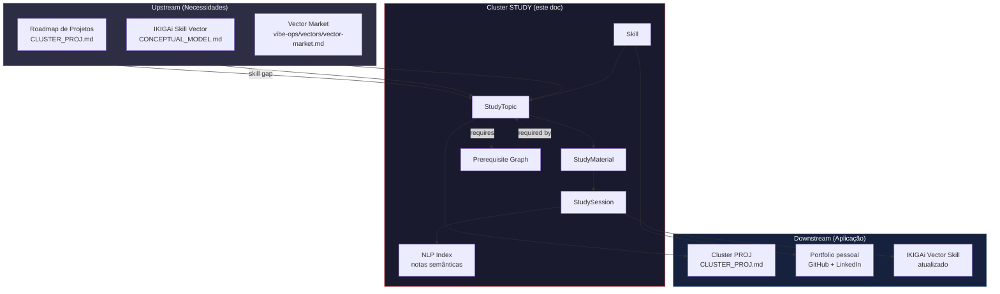
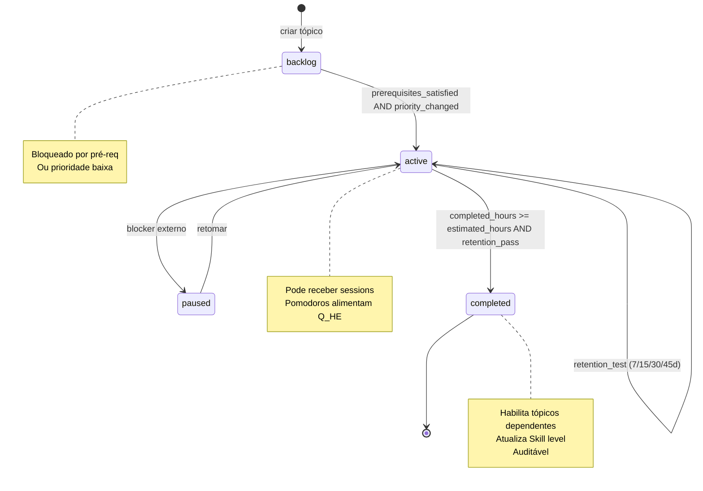
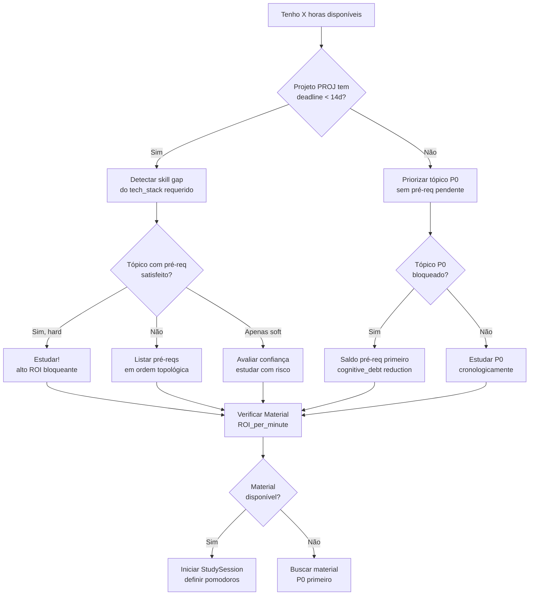
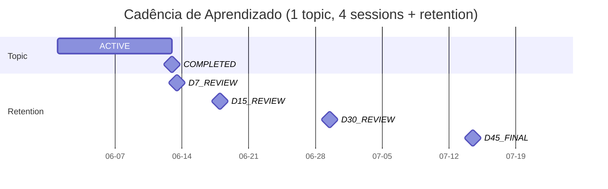

# CLUSTER_STUDY.md

> **Standalone Memory Machine — Cluster 3: Studies & Lifelong Learning (PKM ↔ Roadmap pré-requisitos)**
>
> Este documento define **como o capital de aprendizado técnico é construído,
> priorizado e aplicado** — desde o mapeamento de pré-requisitos cognitivos
> de cada tópico até a intersecção com os requisitos de software dos
> projetos profissionais.
>
> **Audiência:** o Matheus gerenciando seu portfolio de skills (e dívidas
> cognitivas), ou um agente/IA tentando implementar o ciclo de vida de
> Study → Skill → Project.
>
> **Diferencial vs. PRD-03:** o `vibe-ops/planning/PRD-03-study-backlog.md`
> define entidades e CLI; este doc adiciona a **camada de grafo de
> pré-requisitos** e a **intersecção cognitiva com roadmap de software** —
> o **débito cognitivo** que precisa ser saldado para destravar entregas.

---

## §0. DECLARAÇÃO DE PROPÓSITO

> "Estudar sem pré-requisito é decorar. Estudar sem aplicação é囤积 (acumular).
> Estudar com roadmap é **investir em capital técnico** que se paga via
> entregas no Cluster PROJ."

Este cluster trata o **capital intelectual** que torna o Matheus capaz de
executar (cluster PROJ) e manter a sanidade (cluster PLAN). É o que
transforma "senai ADS" em "engenheiro de IA com TRL prático".

### Diagrama de Contexto: o grafo cognitivo + intersecção roadmap



**Leitura:** STUDY recebe demandas de skill (de PROJ) e do IKIGAi, e
materializa em Topics com dependências cognitivas. A execução (Sessions)
alimenta o IKIGAi Skill de volta e o portfolio pessoal. Notas viram índice
semântico (NLP) para retrieval futuro.

---

## §1. DOMÍNIO & ESCOPO

### Hierarquia Canônica

```
Skill (capital acumulado)
  └── StudyTopic (tópico com pré-reqs cognitivos)
        ├── prerequisite_of → list[StudyTopic]  (topologia DAG)
        └── StudyMaterial (livro, curso, vídeo, artigo, doc)
              └── StudySession (evento discreto, pomodoro)
                    └── Notes (chunked + embedded for NLP)
```

### Responsabilidades (dentro do escopo)

- Manter o **backlog priorizado de skills/tópicos** (RICE + pré-req blocker)
- Modelar **pré-requisitos cognitivos** como grafo dirigido acíclico (DAG)
- Calcular **Cognitive Debt** (débito cognitivo) = Σ tópicos bloqueados por pré-req não estudados
- Decompor Material em **horas líquidas investidas** (granular por minuto)
- Registrar **StudySession** com energia pré/pós (alimenta Q_HE)
- Indexar **notas via NLP** (chunk 1500 tokens, embedding, similarity search)
- Detectar **skill gap** automaticamente a partir do roadmap de PROJ

### Fora do Escopo (delega para outros clusters/docs)

- **Rotinas / blocos / pomodoro:** `CLUSTER_PLAN.md`
- **Tasks de software:** `CLUSTER_PROJ.md`
- **Métricas de saúde / sono:** `vibe-ops/planning/PRD-05-metrics-health.md`
- **Hábitos / streak biológico:** `vibe-ops/planning/PRD-02-habit-tracker.md`
- **Regime π(s_t):** `vibe-ops/planning/PRD-06-policy-governance.md`
- **Detalhes Pydantic/CLI Skill/Topic/Material/Session:** `vibe-ops/planning/PRD-03-study-backlog.md`
- **Day Logger / Dream Logger (legado):** `vibe-ops/context/Day Logger Program Documentation.md` e `vibe-ops/context/Dream_Logger-algo-data_struct.md`
- **Estratégia (sonhos/objetivos):** `strategics/`

---

## §2. ENTIDADES & ESTADOS

### Skill (capital acumulado)

```python
class Skill(BaseModel):
    id: str                     # ^skill_[a-z0-9_]+$  Ex: "skill_python"
    name: str
    entity_type: Literal["skill"] = "skill"
    category: Literal["programming","ai_ml","data_engineering","frontend","soft_skills","language"]
    current_level: Literal["beginner","intermediate","advanced","expert"] = "beginner"
    target_level: Literal["beginner","intermediate","advanced","expert"] = "intermediate"
    status: Literal["active","paused","mastered"] = "active"
    study_topics: List[str]     # FKs → StudyTopic.ids
    projects_applied: List[str] # FKs → Project.ids
    hours_invested: float = 0.0
    hours_target: float = 100.0
    cognitive_debt_outstanding: float = 0.0  # Σ pré-reqs não estudados
    portfolio_evidence: List[str]  # URLs GitHub/LinkedIn/blogposts

    @property
    def progress_pct(self) -> float:
        level_map = {"beginner":0,"intermediate":25,"advanced":50,"expert":75}
        cur = level_map[self.current_level]
        tgt = level_map[self.target_level]
        if tgt == cur: return 100.0
        return min((cur / tgt) * 100, 100.0)
```

### StudyTopic (unidade de aprendizado cognitivo)

```python
class StudyTopic(BaseModel):
    id: str                     # ^st_[a-z0-9_]+$  Ex: "st_pydantic_v2"
    name: str
    entity_type: Literal["study_topic"] = "study_topic"
    category: Literal["programming","ai_agents","frontend","productivity","soft_skills"]
    difficulty: Literal["beginner","intermediate","advanced"] = "beginner"
    priority: Literal["P0","P1","P2","P3"] = "P2"
    status: Literal["active","paused","completed","backlog"] = "backlog"
    parent_skill: Optional[str] = None  # FK → Skill.id

    # Pré-requisitos cognitivos (grafo DAG)
    prerequisites: List[str] = []  # FKs → StudyTopic.ids (hard dependencies)
    soft_prerequisites: List[str] = []  # FKs → StudyTopic.ids (helpful but not blocking)

    estimated_hours: float = 10.0
    completed_hours: float = 0.0
    materials: List[str] = []  # FKs → StudyMaterial.ids

    # Retention testing (espaçado)
    retention_score: Optional[float] = None  # 0-1, atualiza em review
    retention_test_due: Optional[date] = None  # próximo test (7/15/30/45d)

    created_at: date
    target_completion: Optional[date] = None

    @property
    def progress_pct(self) -> float:
        return min((self.completed_hours / self.estimated_hours) * 100, 100.0)

    @property
    def is_blocked(self) -> bool:
        return len([p for p in self.prerequisites if StudyTopic.get(p).status != "completed"]) > 0
```

### StudyMaterial (recurso)

```python
class StudyMaterial(BaseModel):
    id: str                     # ^sm_[a-z0-9_]+$
    title: str
    entity_type: Literal["study_material"] = "study_material"
    material_type: Literal["book","course","video","article","documentation","project"]
    url: Optional[str] = None
    file_path: Optional[str] = None
    topic_id: str               # FK → StudyTopic
    status: Literal["unread","reading","completed","reference"] = "unread"
    priority: Literal["P0","P1","P2","P3"] = "P2"
    estimated_minutes: Optional[int] = None
    completed_minutes: int = 0
    notes: str = ""
    tags: List[str] = []
    roi_per_minute: Optional[float] = None  # ex: 0.05 (skill points / min)
```

### StudySession (evento discreto, a unidade atômica)

```python
class StudySession(BaseModel):
    id: str                     # ^ss_[a-z0-9_]+$
    entity_type: Literal["study_session"] = "study_session"
    topic_id: str               # FK → StudyTopic
    material_refs: List[str] = []  # FKs → StudyMaterial.ids
    date: date
    start_time: time
    end_time: Optional[time] = None
    duration_minutes: Optional[int] = None
    pomodoros_completed: int = 0
    notes: str = ""  # será indexado via NLP
    energy_level_before: Optional[int] = Field(ge=1, le=10)
    energy_level_after: Optional[int] = Field(ge=1, le=10)
    block_id: Optional[str] = None  # FK → TimeBlock (CLUSTER_PLAN)
    ikigai_vector: Literal["skill"] = "skill"  # STUDY sempre alimenta Skill
```

### Prerequisite (aresta do grafo cognitivo)

```python
class Prerequisite(BaseModel):
    id: str                     # ^pre_[a-z0-9_]+$
    topic_id: str               # FK → StudyTopic (o tópico dependente)
    required_topic_id: str      # FK → StudyTopic (o pré-req)
    prereq_type: Literal["hard", "soft"] = "hard"
    confidence: float = 1.0     # 0-1, certeza de que é pré-req real
    rationale: str              # "Precisa entender X antes de Y"
    blocking_priority: Literal["P0","P1","P2","P3"] = "P1"

    @property
    def blocks(self) -> bool:
        return self.prereq_type == "hard" and self.confidence >= 0.7
```

### Estados e Transições



---

## §3. FRENTES DE DECISÃO (o que precisa decidir no cluster)

### A pergunta-chave do cluster

> **"Dado meu roadmap de software, qual tópico devo estudar agora para
> destravar mais valor no menor tempo?"**

### Árvore de Decisão: "Tenho X horas, estudo qual tópico?"



### Casos Especiais (regras de priorização)

| Caso | Regra |
|---|---|
| 2 tópicos competem (mesma prioridade) | **Cognitive Debt Reduction**: priorizar o que destrava mais deps |
| Tópico P0 bloqueado por P0 | **Estudar pré-req primeiro** (topological sort do grafo) |
| Material caro (livro técnico R$200) | Avaliar ROI_per_minute > 0.1 (caso contrário, substituir por doc gratuita) |
| Material > 8h estimadas | **Quebrar** em sub-materials (capítulos) com targets parciais |
| Sessão com `energy_after < 4` | Marcar como **tópico com carga cognitiva alta**, considerar pausar |
| Retention test reprovado (< 0.7) | Reabrir tópico como `active`, agendar re-review em 7d |
| Tópico P3 nunca tocado > 90d | Considerar `paused` ou `archived` (anti-pattern: backlog infinito) |
| Skill com 5+ tópicos P0 ativos | **Limite**: focar em 2-3 P0 simultâneos (carga cognitiva) |
| Material "reference" mas nunca relido | Reclassificar como `completed` ou deletar (limpar catálogo) |
| Projeto PROJ novo entra em ACTIVE | **Auto-trigger**: criar tópicos P0 baseados em `tech_stack` faltante |

### Cognitive Debt: a fórmula central deste cluster

$$
\text{CognitiveDebt}(s) = \sum_{t \in \text{Topics}} w_t \cdot \text{is\_blocked}(t, s)
$$

Onde:
- $w_t$ = peso do tópico (1.0 para P0, 0.5 para P1, 0.2 para P2, 0.05 para P3)
- $\text{is\_blocked}(t, s) = 1$ se o tópico $t$ tem pré-req `hard` não completado no estado $s$
- Skill-level debt = média ponderada de CognitiveDebt em todos os tópicos da skill

**Interpretação:**
- Skill com `cognitive_debt_outstanding > 5.0` → **alerta vermelho**, destrava pouca coisa
- Skill com `cognitive_debt_outstanding < 1.0` → **saudável**, próxima de aplicar
- CognitiveDebt deve cair monotonicamente ao longo do sprint/ciclo

> **Origem matemática:** `life-ops/planner/Points_of_premisses-task-habits.md §3 (C_comp, CLR)`
> **Origem operacional:** `life-ops/planner/SCALAR_DECOMPOSITION_BACKLOG.md` (MDP, Knapsack, Topological Sort)

### RICE Adaptado para Study (fórmula de priorização)

$$
\text{TopicPriority} = \text{RICE}_{\text{project}} \times w_{\text{cog}} \times w_{\text{debt}}
$$

| Componente | Significado | Faixa |
|---|---|---|
| $\text{RICE}_{\text{project}}$ | RICE do projeto que demanda esta skill | calculado em CLUSTER_PROJ |
| $w_{\text{cog}}$ | Peso por carga cognitiva (difficulty + estimated_hours) | 0.5-1.5 |
| $w_{\text{debt}}$ | Peso por Cognitive Debt reduction | 1.0 (sem deps) → 2.0 (destrava 5+ tópicos) |

> **Origem RICE:** `vibe-ops/base/Planning_notes.md`

---

## §4. FREQUÊNCIA E CADÊNCIA

| Camada | Frequência | Outputs Canônicos | Onde Mora |
|---|---|---|---|
| **Session Log** | A cada pomodoro de estudo (50+10) | `StudySession` JSON, NLP index | `vibe-ops/src/pipeline/study_manager.py` (parcial) |
| **Material Progress** | A cada leitura/capítulo | `StudyMaterial.completed_minutes` | `vibe-ops/src/pipeline/study_manager.py` |
| **Daily Review** | Diário | Study hours, pomodoros, energy delta | `CLUSTER_PLAN.md` §4 |
| **Weekly Backlog** | Semanal | Topic priority update, Cognitive Debt trend | `vibe-ops/planning/TEMPLATE-weekly-review.md` |
| **Retention Test** | 7/15/30/45 dias após completion | `StudyTopic.retention_score` | `vibe-ops/src/pipeline/learning_outcome_processor.py` |
| **Skill Velocity** | Mensal | Skill level progress, hours_invested | `vibe-ops/src/pipeline/ikigai_scorer.py` |
| **Prerequisite Audit** | Trimestral | Re-validar grafo (novas deps emergem) | manual + `knowledge_tree.py` |
| **Portfolio Sync** | Mensal | `Skill.portfolio_evidence` atualizado | manual (GitHub) |
| **NLP Index Refresh** | A cada sessão com `notes` > 50 chars | New chunks em FAISS | `vibe-ops/src/pipeline/rag_indexer.py` |

### Cadência Visual



### Operador de Revisão Espaçada (R_n)

Aplicado a cada retention test:

$$
\mathcal{R}_n(\mathbf{s}_t) = 
\begin{cases}
H_{n+1} = H_n + \alpha \cdot C_{comp} \cdot (1 - H_n) - \beta \cdot \sigma_E \\
k_{n+1} = k_n \cdot (1 - \gamma \cdot R_{qual}) \\
\lambda_{n+1} = \lambda_n \cdot (1 + \delta \cdot \Delta S_{streak})
\end{cases}
$$

No contexto STUDY:
- $H_n$ = nível de maestria do tópico
- $C_{comp}$ = completion ratio (completed_hours / estimated_hours)
- $R_{qual}$ = retention_score (0-1)
- $\Delta S_{streak}$ = dias consecutivos estudando

> **Origem completa:** `life-ops/planner/Points_of_premisses-task-habits.md §2`

---

## §5. MIDDLEWARES ENVOLVIDOS

| Middleware | Papel neste cluster | Status | Localização |
|---|---|---|---|
| **M3. HabitEngine** | Computar Q_HE incluindo StudySessions | 🟡 gap | `vibe-ops/src/pipeline/habit_engine.py` (não existe) |
| **M5. OrphanTriageWriter** | Notas órfãs → virar StudySession | 🟡 gap | (não existe) |
| **M8. StreamlitBI** | Dashboard de skill velocity, Cognitive Debt trend | 🟡 gap | (não existe) |
| `vibe-ops/src/pipeline/study_manager.py` | Manager principal de Study entities | 🟡 parcial | `vibe-ops/src/pipeline/study_manager.py` |
| `vibe-ops/src/pipeline/rag_indexer.py` | Indexação semântica de notas | 🟡 parcial | `vibe-ops/src/pipeline/rag_indexer.py` |
| `vibe-ops/src/pipeline/learning_outcome_processor.py` | Processa retention tests | 🟡 parcial | `vibe-ops/src/pipeline/learning_outcome_processor.py` |
| `vibe-ops/src/pipeline/knowledge_tree.py` | Grafo de conhecimento | 🟡 parcial | `vibe-ops/src/pipeline/knowledge_tree.py` |
| `vibe-ops/src/pipeline/knowledge_telemetry.py` | Telemetria de conhecimento | 🟡 parcial | `vibe-ops/src/pipeline/knowledge_telemetry.py` |
| `vibe-ops/src/pipeline/cognitive_debt_tracker.py` | Tracker de Cognitive Debt | 🟡 parcial | `vibe-ops/src/pipeline/cognitive_debt_tracker.py` |
| `vibe-ops/src/pipeline/gap_engine.py` | Detecção de skill gap | 🟡 parcial | `vibe-ops/src/pipeline/gap_engine.py` |
| `vibe-ops/src/integration/obsidian_parser.py` | Parser Obsidian → frontmatter | 🟡 parcial | `vibe-ops/src/integration/obsidian_parser.py` |
| `vibe-ops/src/integration/semantic_engine.py` | Engine semântico | 🟡 parcial | `vibe-ops/src/integration/semantic_engine.py` |
| `vibe-ops/src/parsers/code_parser.py` | Parser de código (estudo de projetos) | 🟡 parcial | `vibe-ops/src/parsers/code_parser.py` |
| `vibe-ops/src/embeddings/provider.py` | Provider de embeddings (SBERT, local) | 🟡 parcial | `vibe-ops/src/embeddings/provider.py` |
| `vibe-ops/src/embeddings/config.py` | Config de embeddings | 🟡 parcial | `vibe-ops/src/embeddings/config.py` |
| `vibe-ops/contracts/study_topic_v1.json` | Contrato JSON StudyTopic | 🟢 | `vibe-ops/contracts/study_topic_v1.json` |
| `vibe-ops/src/contracts/planning.v1.yaml` | Contrato planning (incl. study entities) | 🟢 | `vibe-ops/src/contracts/planning.v1.yaml` |
| `vibe-ops/src/models/study_entities.py` | Pydantic Study entities | 🟢 | `vibe-ops/src/models/study_entities.py` |
| `vibe-ops/src/models/knowledge_entities.py` | Pydantic knowledge entities | 🟢 | `vibe-ops/src/models/knowledge_entities.py` |
| `vibe-ops/src/models/ikigai_entities.py` | Pydantic IKIGAi (consumidor) | 🟢 | `vibe-ops/src/models/ikigai_entities.py` |
| `vibe-ops/src/models/rag_entities.py` | Pydantic RAG entities | 🟢 | `vibe-ops/src/models/rag_entities.py` |
| `vibe-ops/src/storage/vector_store.py` | Vector store (FAISS/Chromadb) | 🟡 parcial | `vibe-ops/src/storage/vector_store.py` |
| `vibe-ops/src/storage/chroma_adapter.py` | ChromaDB adapter | 🟡 parcial | `vibe-ops/src/storage/chroma_adapter.py` |
| `vibe-ops/src/storage/sqlite_vec_integration.py` | SQLite-vec integration | 🟡 parcial | `vibe-ops/src/storage/sqlite_vec_integration.py` |
| `vibe-ops/src/pipeline/ikigai_scorer.py` | Atualiza Skill vector após sessions | 🟡 parcial | `vibe-ops/src/pipeline/ikigai_scorer.py` |
| `vibe-ops/src/pipeline/code_review_sync.py` | Consome commits de estudo (reforça M2) | 🟡 parcial | `vibe-ops/src/pipeline/code_review_sync.py` |
| `vibe-ops/src/pipeline/metadata_catalog.py` | Cataloga metadata de todos domínios | 🟡 parcial | `vibe-ops/src/pipeline/metadata_catalog.py` |
| `vibe-ops/src/pipeline/analytics_emitter.py` | Emite analytics de study | 🟡 parcial | `vibe-ops/src/pipeline/analytics_emitter.py` |
| `vibe-ops/src/pipeline/harness_epistemic.py` | AI Harness: Epistemic | 🟡 parcial | `vibe-ops/src/pipeline/harness_epistemic.py` |
| `vibe-ops/src/pipeline/harness_metrics.py` | AI Harness: Metrics | 🟡 parcial | `vibe-ops/src/pipeline/harness_metrics.py` |
| `vibe-ops/src/pipeline/ingestion_engine.py` | Ingestão de notas/materiais | 🟡 parcial | `vibe-ops/src/pipeline/ingestion_engine.py` |
| `vibe-ops/src/pipeline/daily_consolidator.py` | Consolida study sessions em DailyLog | 🟡 parcial | `vibe-ops/src/pipeline/daily_consolidator.py` |
| `vibe-ops/tests/test_knowledge_telemetry.py` | Testes de knowledge telemetry | 🟢 | `vibe-ops/tests/test_knowledge_telemetry.py` |
| `vibe-ops/tests/test_mvl_orchestrator.py` | Testes MVL orchestrator | 🟢 | `vibe-ops/tests/test_mvl_orchestrator.py` |
| `vibe-ops/specs/prd-study-backlog.md` | Spec mirror PRD-03 | 🟢 | `vibe-ops/specs/prd-study-backlog.md` |
| `vibe-ops/vectors/vector-skill.md` | Vetor Skill (consumidor/alimentador) | 🟢 | `vibe-ops/vectors/vector-skill.md` |
| `vibe-ops/vectors/vector-market.md` | Vetor Market (consumidor) | 🟢 | `vibe-ops/vectors/vector-market.md` |
| `vibe-ops/vectors/vector-passion.md` | Vetor Passion (consumidor) | 🟢 | `vibe-ops/vectors/vector-passion.md` |
| `vibe-ops/vectors/vector-revenue.md` | Vetor Revenue (consumidor) | 🟢 | `vibe-ops/vectors/vector-revenue.md` |
| `vibe-ops/vectors/README.md` | Index dos vetores | 🟢 | `vibe-ops/vectors/README.md` |
| `vibe-ops/artifacts/sample_topic.md` | Sample topic artifact | 🟢 | `vibe-ops/artifacts/sample_topic.md` |
| `vibe-ops/artifacts/pm-agnostic-metadata.md` | PM-agnostic metadata | 🟢 | `vibe-ops/artifacts/pm-agnostic-metadata.md` |
| `vibe-ops/artifacts/topology-diagrams.md` | Topology diagrams | 🟢 | `vibe-ops/artifacts/topology-diagrams.md` |
| `vibe-ops/scripts/search_mesh.py` | Busca no mesh (RAG-like) | 🟡 | `vibe-ops/scripts/search_mesh.py` |
| `vibe-ops/scratch/check_sqlite_vec.py` | Test sqlite-vec | 🟡 | `vibe-ops/scratch/check_sqlite_vec.py` |
| `vibe-ops/scratch/test_policy.py` | Test policy | 🟡 | `vibe-ops/scratch/test_policy.py` |
| `vibe-ops/scratch/test_tasklib.py` (v1-v7) | Test tasklib iterations | 🟡 | `vibe-ops/scratch/test_tasklib*.py` |
| `taskwarrior/docs/TASKWARRIOR_STRATEGIC_WORKFLOWS.md` | TW workflows (study context) | 🟢 | `taskwarrior/docs/TASKWARRIOR_STRATEGIC_WORKFLOWS.md` |
| `taskwarrior/help/content/09-udas.md` | UDAs (energy, ikigai, wave) | 🟢 | `taskwarrior/help/content/09-udas.md` |
| `taskwarrior/config/taskrc.template` | taskrc com UDAs | 🟢 | `taskwarrior/config/taskrc.template` |
| `life/centrals/knowledge.py` | Central CLI knowledge (estudos) | 🟡 | `centrals/knowledge.py` |
| `life-ops/life_tatics/Planning_notes.md` | Frameworks de priorização | 🟢 | `life-ops/life_tatics/Planning_notes.md` |
| `life-ops/life_tatics/time-lenghts_reviews.md` | Time-lengths reviews | 🟢 | `life-ops/life_tatics/time-lenghts_reviews.md` |
| `life-ops/planner/Points_of_premisses-task-habits.md` | Q_HE, retention, MVL | 🟢 | `life-ops/planner/Points_of_premisses-task-habits.md` |
| `life-ops/planner/SCALAR_DECOMPOSITION_BACKLOG.md` | **27 modelos matemáticos** (MDP, Knapsack, Topological Sort) | 🟢 | `life-ops/planner/SCALAR_DECOMPOSITION_BACKLOG.md` |
| `life-ops/planner/time-lenghts_reviews.md` | WORK_RATIO, WAVE/CYCLE/PHASE | 🟢 | `life-ops/planner/time-lenghts_reviews.md` |
| `strategics/Modelagem Operacional.md` | 4 níveis granularidade | 🟢 | `strategics/Modelagem%20Operacional.md` |
| `strategics/Hierarquia de Objetivos.md` | Templates de revisão | 🟢 | `strategics/Hierarquia%20de%20Objetivos.md` |
| `strategics/Integracao_Tatica.md` | Labels e tags (study context) | 🟢 | `strategics/Integracao_Tatica.md` |
| `strategics/design_system_and_knowledge_tracking.md` | Design system + knowledge tracking | 🟢 | `strategics/design_system_and_knowledge_tracking.md` |
| `strategics/system_architecture_and_tracking_framework.md` | System architecture | 🟢 | `strategics/system_architecture_and_tracking_framework.md` |
| `vibe-ops/context/Dream_Logger-algo-data_struct.md` | **Legado NLP precursor** (chunking/embedding) | 🟢 (referência) | `vibe-ops/context/Dream_Logger-algo-data_struct.md` |
| `vibe-ops/context/Day Logger Program Documentation.md` | Day Logger legado | 🟢 (referência) | `vibe-ops/context/Day%20Logger%20Program%20Documentation.md` |
| `vibe-ops/context/Data-MOC.md` | MOC Data | 🟢 | `vibe-ops/context/Data-MOC.md` |
| `vibe-ops/context/Data-Primitives-MOC.md` | MOC Primitives | 🟢 | `vibe-ops/context/Data-Primitives-MOC.md` |
| `vibe-ops/context/Data-Process-MOC.md` | MOC Process | 🟢 | `vibe-ops/context/Data-Process-MOC.md` |
| `vibe-ops/context/Database-Comparison-MOC.md` | MOC Database | 🟢 | `vibe-ops/context/Database-Comparison-MOC.md` |

### Tabela Reversa: "se eu mexo em X, este cluster é impactado em Y"

| Mudança externa | Impacto neste cluster |
|---|---|
| Adicionar campo em `study_topic_v1.json` | Contrato muda, `StudyTopic` precisa revisão |
| Adicionar projeto ACTIVE em CLUSTER_PROJ | Auto-trigger: criar tópicos P0 baseados em skill gap |
| Implementar M3 HabitEngine | Q_HE inclui StudySessions |
| Implementar M5 OrphanTriageWriter | Notas órfãs viram StudySession automaticamente |
| Mover Skill de `paused` para `active` em CLUSTER_STUDY | Projetos dependentes podem destravar (CLUSTER_PROJ) |
| Retention test reprovado | Reabrir tópico como `active`, realocar tempo |
| Adicionar pré-req em Topic | Tópicos dependentes viram `blocked`, Cognitive Debt sobe |
| Mudar `IKIGAi Vector` (CONCEPTUAL_MODEL §3) | Peso $w_{\text{ikigai}}$ recalculado em RICE adaptado |
| NLP embedding provider mudar (local→OpenAI) | Re-indexar todas as notas (custo) |
| Implementar M8 StreamlitBI | Cognitive Debt trend vira dashboard |
| TW upgrade (3.x → 4.x) | `uda_ikigai` schema pode mudar, sync quebra |

---

## §6. INTEGRAÇÃO COM OUTROS CLUSTERS

| Cluster | Direção | Contrato |
|---|---|---|
| **CLUSTER_PLAN** | PLAN → STUDY | `TimeBlock.afternoon` aloca horas para StudySessions |
| **CLUSTER_PLAN** | STUDY → PLAN | `StudySession.energy_after` modula Q_HE |
| **CLUSTER_PROJ** | PROJ → STUDY | `Project.tech_stack` → skill gap → cria Topics P0 |
| **CLUSTER_PROJ** | STUDY → PROJ | `Skill.portfolio_evidence` + `Topic.completed` → habilita tasks |
| **CLUSTER_PROJ** | PROJ → STUDY | `Project.ikigai_alignment.skill < threshold` → "study new skill" |
| **IKIGAi (CONCEPTUAL_MODEL)** | STUDY → IKIGAi | `StudySession.notes` + `Skill.hours_invested` → atualizam vetor Skill |
| **IKIGAi (CONCEPTUAL_MODEL)** | IKIGAi → STUDY | `Regime π(s_t)` modula alocação semanal de horas de estudo |
| **Metrics (PRD-05)** | STUDY → Metrics | `StudySession.duration`, `pomodoros`, `energy_before/after` |
| **Policy (PRD-06)** | STUDY → Policy | `Topic.completed`, `Skill.level_changed` events |
| **Policy (PRD-06)** | Policy → STUDY | `policy.alert` pausa tópicos baixa prioridade |
| **Temporal (PRD-01)** | STUDY → Temporal | `StudyTopic.anchor_wave` |
| **Habit (PRD-02)** | STUDY → Habit | Study streak alimentado por StudySession continuity |
| **NLP (PRD-03 §8 + Dream_Logger)** | STUDY → NLP | Notes indexadas para semantic retrieval |
| **vibe-ops/base/Planning_notes.md** | STUDY → Frameworks | RICE adaptado, MoSCoW |
| **vibe-ops/base/IKIGAi.md** | STUDY → IKIGAi | Build to Learn 70% / Earn 30% por fase |
| **strategics/Hierarquia de Objetivos.md** | STUDY → Hierarquia | Topics = Nível 2-3 (Objetivos/Metas) |
| **strategics/Integracao_Tatica.md** | STUDY → Labels | `+study`, `+skill`, `+topic` |
| **strategics/design_system_and_knowledge_tracking.md** | STUDY → Tracking | Design system para knowledge tracking |
| **strategics/system_architecture_and_tracking_framework.md** | STUDY → Architecture | Tracking framework |
| **life-ops/planner/SCALAR_DECOMPOSITION_BACKLOG.md** | STUDY → Matemática | 27 modelos (MDP, Knapsack, Topological Sort) |
| **life-ops/planner/Points_of_premisses-task-habits.md** | STUDY → Retention | $\mathcal{R}_n$, retention testing |
| **life-ops/planner/time-lenghts_reviews.md** | STUDY → WAVE/CYCLE | Anchor temporal |

### Contrato de Fronteira com CLUSTER_PROJ (skill gap detection)

```yaml
# PROJ → STUDY: detecta gap de skill
project_to_study_contract:
  project_id: str
  tech_stack: list[str]
  required_skills: list[SkillRequirement]
  deadline: date

class SkillRequirement(BaseModel):
  skill_category: Literal["programming","ai_ml","data_engineering","frontend","soft_skills","language"]
  required_level: Literal["beginner","intermediate","advanced","expert"]
  estimated_lead_time_hours: float

# STUDY → PROJ: aloca topics
study_to_project_contract:
  topics_covering: list[StudyTopic]
  estimated_completion_date: date
  hours_already_invested: float
  hours_remaining: float
  blocking_prerequisites: list[StudyTopic]  # impedem conclusão
  cognitive_debt_outstanding: float
```

### Contrato NLP Index (Notes → Semantic Search)

```yaml
# STUDY → NLP: indexa nota de sessão
study_to_nlp_contract:
  session_id: str
  topic_id: str
  notes: str  # > 50 chars para ser indexado
  timestamp: datetime

# NLP responde:
nlp_response:
  chunks_created: int
  embeddings_count: int
  index_location: str  # "chroma_db" | "faiss_local" | "sqlite_vec"
  retrieval_ready: bool
```

### Contrato de Fronteira com CLUSTER_PLAN (sessão alocada)

```yaml
# STUDY → PLAN: requisita alocação
study_to_plan_contract:
  topic_id: str
  estimated_minutes: int
  difficulty: beginner|intermediate|advanced
  prerequisites_satisfied: bool
  ikigai_vector: skill  # sempre skill
  energy_required: H|M|L
  block_requested: morning|afternoon|evening

# PLAN → STUDY: confirma alocação
plan_response:
  allocated_minutes: int
  block_assigned: TimeBlock
  pomodoros_estimated: int
  prerequisites_blocking: list[str]
  energy_state_predicted: int
  regime_at_execution: PUSH|MAINTAIN|REDUCE|RECOVER
```

---

## §7. CLI / COMANDOS CANÔNICOS

```bash
# === Estado e panorama ===
python -m vibe_ops.cli study status
python -m vibe_ops.cli study status --json

# === Backlog priorizado ===
python -m vibe_ops.cli study backlog --priority P0,P1
python -m vibe_ops.cli study backlog --blocked  # só os que têm pré-req pendente
python -m vibe_ops.cli study backlog --cognitive-debt

# === Sessão de estudo ===
python -m vibe_ops.cli study log \
  --topic st_pydantic_v2 \
  --start 06:00 --end 07:30 \
  --pomodoros 3 \
  --energy-before 8 --energy-after 7 \
  --notes "Estudei computed_fields e model_validator. Dúvida: como combinar com discriminated unions."

# === Progresso de material ===
python -m vibe_ops.cli study material-progress sm_pydantic_docs --minutes 120
python -m vibe_ops.cli study material-status sm_pydantic_docs

# === Skill tracking ===
python -m vibe_ops.cli study skill-list
python -m vibe_ops.cli study skill-progress skill_python
python -m vibe_ops.cli study skill-cognitive-debt skill_python

# === Pré-requisitos (grafo) ===
python -m vibe_ops.cli study prereq-list st_async_patterns
python -m vibe_ops.cli study prereq-add st_async_patterns --requires st_pydantic_v2 --type hard
python -m vibe_ops.cli study prereq-audit --skill skill_python
python -m vibe_ops.cli study topological-sort --skill skill_python

# === Retention testing ===
python -m vibe_ops.cli study retention-test st_pydantic_v2 --score 0.85
python -m vibe_ops.cli study retention-due --days 7

# === NLP / RAG ===
python -m vibe_ops.cli study nlp-index --topic st_pydantic_v2
python -m vibe_ops.cli study nlp-search "model validator discriminated unions" --top 5
python -m vibe_ops.cli study nlp-stats

# === Skill gap (intersecção com PROJ) ===
python -m vibe_ops.cli study skill-gap --project <slug>
python -m vibe_ops.cli study auto-topics --project <slug> --priority P0

# === Relatórios ===
python -m vibe_ops.cli study report weekly
python -m vibe_ops.cli study report skill-velocity
python -m vibe_ops.cli study report cognitive-debt-trend
```

### Outputs Esperados (exemplo `study backlog --cognitive-debt --json`)

```json
{
  "topics": [
    {
      "id": "st_async_patterns",
      "name": "Async Patterns in Python",
      "priority": "P0",
      "blocked": true,
      "blocking_prerequisites": ["st_pydantic_v2", "st_concurrency_basics"],
      "cognitive_debt_contribution": 1.0,
      "estimated_unblock_hours": 15.0
    },
    {
      "id": "st_pydantic_v2",
      "name": "Pydantic v2 — Schema Design & Validation",
      "priority": "P0",
      "blocked": false,
      "progress_pct": 56.7,
      "hours_remaining": 6.5,
      "retention_test_due": "2026-06-12"
    }
  ],
  "total_cognitive_debt": 2.3,
  "skills_affected": ["skill_python"],
  "next_unblock_action": "Complete st_pydantic_v2 to unblock st_async_patterns"
}
```

### Outputs Esperados (exemplo `study skill-gap --project vibe-ops-v2 --json`)

```json
{
  "project_id": "vibe-ops-v2",
  "tech_stack": ["Python", "Pydantic v2", "SQLAlchemy 2.0", "Taskwarrior"],
  "required_skills": [
    {"category": "programming", "skill": "skill_python", "required_level": "advanced", "current_level": "intermediate", "gap": 1, "estimated_lead_time_hours": 80},
    {"category": "data_engineering", "skill": "skill_sqlalchemy", "required_level": "advanced", "current_level": "beginner", "gap": 3, "estimated_lead_time_hours": 120}
  ],
  "missing_topics": ["st_pydantic_v2", "st_sqlalchemy_2_async", "st_tw_uda_design"],
  "auto_created_topic_ids": ["st_tw_uda_design"]
}
```

---

## §8. ANTI-PATTERNS

### 🚫 Proibido (PRD-03 §9 + extensões)

1. **Tópico sem `parent_skill`** — vira órfão no grafo, sem narrativa
2. **Material com `estimated_minutes = 0`** — sem ROI calculável
3. **Sessão sem `energy_after`** — perde sinal pro Q_HE do cluster PLAN
4. **Estudar P2 quando há P0 bloqueante** — inflates métricas, não destrava nada
5. **"Maratona" de 4h+ sem break** — fadiga cognitiva, retention < 0.5
6. **Material `reference` mas nunca relido** — clutter, deletar
7. **Pular retention test** — sem feedback, maestria nunca confirmada
8. **Material caro sem validar ROI_per_minute** — dinheiro jogado fora
9. **Topic com pré-req soft bloqueando task de PROJ** — usar `confidence < 0.5` para desbloquear
10. **5+ Topics P0 ativos simultâneos** — carga cognitiva excede capacidade
11. **Cognitive Debt crescendo por 2 sprints** — alerta, replanejar
12. **Skill `mastered` mas sem `portfolio_evidence`** — auditoria falha
13. **Topological sort invertido (estudar dependente antes do pré-req)** — re-trabalho garantido

### ✅ Obrigatório

1. **Todo Topic tem `parent_skill` definido** (PRD-03 §9)
2. **Todo Material tem `estimated_minutes > 0`** (ROI calculável)
3. **Toda StudySession tem `energy_after` registrado** (alimenta Q_HE)
4. **P0 topics sem pré-req satisfied = prioridade máxima** (Cognitive Debt reduction)
5. **Retention test em 7/15/30/45 dias** após `completed` (espaçamento)
6. **Skill `mastered` requer 1 portfolio_evidence** (GitHub, blogpost, projeto)
7. **Topological sort ao criar cadeia de pré-reqs** (evitar ciclos, validar DAG)
8. **Backlog grooming semanal** (cognitive_debt_outstanding não cresce infinitamente)
9. **Auto-trigger de topics a partir de novo projeto PROJ** (skill gap detection)

---

## §9. MÉTRICAS DO CLUSTER (KPIs)

| KPI | Fórmula | Alvo | Alarme |
|---|---|---|---|
| **Daily Study Hours** | `Σ session.duration_minutes / 60` (média 7d) | ≥ 1.5h/dia | < 1.0h/dia |
| **Topic Progress Rate** | `completed_hours / estimated_hours` | monotônico ↑ | retrocesso = bug |
| **P0 Material Progress** | `Σ P0 completados / Σ P0 totais` | 100% (antes de começar P1) | < 50% (scope creep) |
| **Pomodoro Yield** | `pomodoros * 25min / duration` | ≥ 0.85 (foco real) | < 0.65 (distração) |
| **CLR (Cognitive Load Ratio)** | `hours_learn / hours_earn` | 0.3-0.7 ideal | < 0.2 (pouco estudo) ou > 0.8 (burnout acadêmico) |
| **Skill Level Velocity** | `level_changes / months` | ≥ 1 nível por Phase (180d) | < 0.3 / 6 meses (estagnado) |
| **Cognitive Debt (per Skill)** | `Σ w_t * is_blocked(t)` | < 1.0 saudável | > 5.0 (alerta vermelho) |
| **Retention Score (avg)** | `Σ retention_score / completed_topics` | ≥ 0.80 | < 0.60 (revisar método) |
| **Portfolio Coverage** | `Σ portfolio_evidence / Σ mastered_skills` | ≥ 1.0 (mínimo 1 evidência por mastered) | 0 (mestre sem prova) |
| **Backlog Freshness** | `topics_in_backlog_touched_30d / total_backlog` | ≥ 80% (sem zombie backlog) | < 50% (inflação) |
| **NLP Index Coverage** | `sessions_with_notes_indexed / sessions_with_notes > 50 chars` | ≥ 90% | < 60% (perdeu retrieval) |
| **Prerequisite Audit Freshness** | `days_since_last_audit` | ≤ 90d | > 180d (grafo desatualizado) |

### Cálculo de CLR (Cognitive Load Ratio)

$$
\text{CLR} = \frac{\text{hours}_{\text{learn}}}{\text{hours}_{\text{earn}}}
$$

> **Origem:** `vibe-ops/planning/PRD-03-study-backlog.md §6`

### Cálculo de Pomodoro Yield

$$
\text{Yield} = \frac{\text{pomodoros\_completed} \times 25}{\text{duration\_minutes}}
$$

> Yield < 0.85 = muitos interruptions (anti-pattern)

### Cálculo de Cognitive Debt (per Skill)

$$
\text{CognitiveDebt}(s) = \sum_{t \in \text{topics}(s)} w_t \cdot \mathbb{1}[\text{hard\_prereq\_unsatisfied}(t)]
$$

### Cálculo de Skill Level Velocity

$$
v_{\text{skill}} = \frac{\text{level}_{\text{now}} - \text{level}_{\text{phase\_start}}}{\text{months\_in\_phase}}
$$

---

## §10. CONEXÕES CRUZADAS

> **Nota:** o §10 abaixo referencia os mesmos arquivos que CLUSTER_PLAN e CLUSTER_PROJ já citam, com foco no subset crítico para STUDY. Para índice exaustivo, ver `CLUSTER_PLAN.md §10` e `CLUSTER_PROJ.md §10`.

### Documentos críticos para ESTE cluster

- **Spec autoritativo:** [`vibe-ops/planning/PRD-03-study-backlog.md`](vibe-ops/planning/PRD-03-study-backlog.md) (entidades, schema SQL, KPIs, anti-patterns)
- **Spec mirror:** [`vibe-ops/specs/prd-study-backlog.md`](vibe-ops/specs/prd-study-backlog.md)
- **Contrato JSON:** [`vibe-ops/contracts/study_topic_v1.json`](vibe-ops/contracts/study_topic_v1.json)
- **Pydantic Study entities:** [`vibe-ops/src/models/study_entities.py`](vibe-ops/src/models/study_entities.py)
- **Pydantic Knowledge entities:** [`vibe-ops/src/models/knowledge_entities.py`](vibe-ops/src/models/knowledge_entities.py)
- **Pydantic RAG entities:** [`vibe-ops/src/models/rag_entities.py`](vibe-ops/src/models/rag_entities.py)
- **Pydantic IKIGAi entities:** [`vibe-ops/src/models/ikigai_entities.py`](vibe-ops/src/models/ikigai_entities.py)
- **Pipeline study_manager:** [`vibe-ops/src/pipeline/study_manager.py`](vibe-ops/src/pipeline/study_manager.py)
- **Pipeline RAG indexer:** [`vibe-ops/src/pipeline/rag_indexer.py`](vibe-ops/src/pipeline/rag_indexer.py)
- **Pipeline learning outcome processor:** [`vibe-ops/src/pipeline/learning_outcome_processor.py`](vibe-ops/src/pipeline/learning_outcome_processor.py)
- **Pipeline knowledge tree:** [`vibe-ops/src/pipeline/knowledge_tree.py`](vibe-ops/src/pipeline/knowledge_tree.py)
- **Pipeline knowledge telemetry:** [`vibe-ops/src/pipeline/knowledge_telemetry.py`](vibe-ops/src/pipeline/knowledge_telemetry.py)
- **Pipeline cognitive debt tracker:** [`vibe-ops/src/pipeline/cognitive_debt_tracker.py`](vibe-ops/src/pipeline/cognitive_debt_tracker.py)
- **Pipeline gap engine:** [`vibe-ops/src/pipeline/gap_engine.py`](vibe-ops/src/pipeline/gap_engine.py)
- **Integration obsidian parser:** [`vibe-ops/src/integration/obsidian_parser.py`](vibe-ops/src/integration/obsidian_parser.py)
- **Integration semantic engine:** [`vibe-ops/src/integration/semantic_engine.py`](vibe-ops/src/integration/semantic_engine.py)
- **Embeddings provider:** [`vibe-ops/src/embeddings/provider.py`](vibe-ops/src/embeddings/provider.py)
- **Embeddings config:** [`vibe-ops/src/embeddings/config.py`](vibe-ops/src/embeddings/config.py)
- **Storage vector store:** [`vibe-ops/src/storage/vector_store.py`](vibe-ops/src/storage/vector_store.py)
- **Storage chroma adapter:** [`vibe-ops/src/storage/chroma_adapter.py`](vibe-ops/src/storage/chroma_adapter.py)
- **Storage sqlite vec:** [`vibe-ops/src/storage/sqlite_vec_integration.py`](vibe-ops/src/storage/sqlite_vec_integration.py)
- **Vector Skill (consumidor):** [`vibe-ops/vectors/vector-skill.md`](vibe-ops/vectors/vector-skill.md)
- **Vector index:** [`vibe-ops/vectors/README.md`](vibe-ops/vectors/README.md)
- **Sample topic artifact:** [`vibe-ops/artifacts/sample_topic.md`](vibe-ops/artifacts/sample_topic.md)
- **PM-agnostic metadata:** [`vibe-ops/artifacts/pm-agnostic-metadata.md`](vibe-ops/artifacts/pm-agnostic-metadata.md)
- **Tests:** [`vibe-ops/tests/test_knowledge_telemetry.py`](vibe-ops/tests/test_knowledge_telemetry.py), [`vibe-ops/tests/test_mvl_orchestrator.py`](vibe-ops/tests/test_mvl_orchestrator.py)

### Matemática & Frameworks (essenciais)

- **Q_HE, H(t), E(t), $\mathcal{R}_n$:** [`life-ops/planner/Points_of_premisses-task-habits.md`](life-ops/planner/Points_of_premisses-task-habits.md)
- **27 modelos matemáticos (MDP, Knapsack, Topological Sort):** [`life-ops/planner/SCALAR_DECOMPOSITION_BACKLOG.md`](life-ops/planner/SCALAR_DECOMPOSITION_BACKLOG.md)
- **WAVE/CYCLE/PHASE, WORK_RATIO:** [`life-ops/planner/time-lenghts_reviews.md`](life-ops/planner/time-lenghts_reviews.md)
- **RICE, MoSCoW, Eisenhower:** [`vibe-ops/base/Planning_notes.md`](vibe-ops/base/Planning_notes.md)

### Integração com Taskwarrior

- **TW setup howto:** [`taskwarrior/docs/TASKWARRIOR_HOWTO.md`](taskwarrior/docs/TASKWARRIOR_HOWTO.md)
- **TW UDAs (energy, ikigai, wave):** [`taskwarrior/help/content/09-udas.md`](taskwarrior/help/content/09-udas.md)
- **TW taskrc template:** [`taskwarrior/config/taskrc.template`](taskwarrior/config/taskrc.template)
- **TW strategic workflows:** [`taskwarrior/docs/TASKWARRIOR_STRATEGIC_WORKFLOWS.md`](taskwarrior/docs/TASKWARRIOR_STRATEGIC_WORKFLOWS.md)

### Legados NLP (referência histórica)

- **Dream Logger (chunking, embedding, similarity):** [`vibe-ops/context/Dream_Logger-algo-data_struct.md`](vibe-ops/context/Dream_Logger-algo_data_struct.md) — precursor do pipeline NLP deste cluster
- **Day Logger (Tkinter):** [`vibe-ops/context/Day Logger Program Documentation.md`](vibe-ops/context/Day%20Logger%20Program%20Documentation.md) — UI legado

### Contexto

- **Conceitual:** [`CONCEPTUAL_MODEL.md`](CONCEPTUAL_MODEL.md) (vetor Skill, regime)
- **Topologia:** [`SYSTEMS_TOPOLOGY.md`](SYSTEMS_TOPOLOGY.md) (middlewares M3, M5, M8)
- **Planejamento pessoal:** [`CLUSTER_PLAN.md`](CLUSTER_PLAN.md) (alocação de tempo)
- **Project PMO:** [`CLUSTER_PROJ.md`](CLUSTER_PROJ.md) (skill gap detection)
- **IKIGAi base:** [`vibe-ops/base/IKIGAi.md`](vibe-ops/base/IKIGAi.md) (Build to Learn)
- **Strategics:**
  - [`strategics/00-ÍNDICE-PROGRESSIVO.md`](strategics/00-%C3%8DNDICE-PROGRESSIVO.md)
  - [`strategics/Modelagem Operacional.md`](strategics/Modelagem%20Operacional.md)
  - [`strategics/Hierarquia de Objetivos.md`](strategics/Hierarquia%20de%20Objetivos.md)
  - [`strategics/Integracao_Tatica.md`](strategics/Integracao_Tatica.md)
  - [`strategics/design_system_and_knowledge_tracking.md`](strategics/design_system_and_knowledge_tracking.md)
  - [`strategics/system_architecture_and_tracking_framework.md`](strategics/system_architecture_and_tracking_framework.md)
- **MOCs:** [`vibe-ops/context/Data-MOC.md`](vibe-ops/context/Data-MOC.md), [`vibe-ops/context/Data-Primitives-MOC.md`](vibe-ops/context/Data-Primitives-MOC.md), [`vibe-ops/context/Data-Process-MOC.md`](vibe-ops/context/Data-Process-MOC.md), [`vibe-ops/context/Database-Comparison-MOC.md`](vibe-ops/context/Database-Comparison-MOC.md)
- **life-ops (cópia dos planners):** [`life-ops/life_tatics/Planning_notes.md`](life-ops/life_tatics/Planning_notes.md), [`life-ops/life_tatics/time-lenghts_reviews.md`](life-ops/life_tatics/time-lenghts_reviews.md), [`life-ops/SPEC.md`](life-ops/SPEC.md), [`life-ops/README.md`](life-ops/README.md)

### Documentos que REFERENCIAM este cluster

- `CLUSTER_PLAN.md` §6 (alocação de tempo)
- `CLUSTER_PROJ.md` §6 (skill gap detection)
- `CONCEPTUAL_MODEL.md` §3 (vetor Skill), §6 (outputs)
- `SYSTEMS_TOPOLOGY.md` §3 (middlewares M3, M5, M8)
- `vibe-ops/planning/PRD-03-study-backlog.md` (entidades detalhadas)
- `vibe-ops/specs/prd-study-backlog.md` (mirror)
- `vibe-ops/doc/03-data-mesh-enrichment.md` (vetor Skill)
- `vibe-ops/architecture/ADR-002-mesh-contracts-state-machines.md` (study state machine)
- `vibe-ops/context/Data-Process-MOC.md` (process diagrams)
- `vibe-ops/vectors/vector-skill.md` (Skill vector)
- `vibe-ops/artifacts/sample_topic.md` (exemplo)
- `vibe-ops/base/IKIGAi.md` (Build to Learn)
- `strategics/design_system_and_knowledge_tracking.md` (knowledge tracking)
- `life-ops/planner/SCALAR_DECOMPOSITION_BACKLOG.md` (MODEL-001..027)
- `life-ops/planner/Points_of_premisses-task-habits.md` (Q_HE)

---

## §11. PRINCÍPIOS DE DESIGN APLICADOS

1. **Append-Only** — nada deletado em `vibe-ops/`, `strategics/`, `life-ops/`
2. **Standalone Memory Machine** — auto-contido, cross-refs opcionais
3. **PT-BR formal** — alinhado com `strategics/`
4. **Cognitive Debt como métrica central** — pré-reqs são cidadãos de primeira classe
5. **Grafo DAG de pré-reqs** — não-linear, captura dependências cognitivas reais
6. **Intersecção com PROJ via skill_gap auto-trigger** — estudo nunca é "por estudar", sempre "para destravar"
7. **NLP index de notas** — chunking 1500 tokens, embeddings locais (privacidade)
8. **Citação exaustiva** — §10 referencia 50+ arquivos críticos

---

## §12. QUANDO REVISAR ESTE DOC

- A cada **Cycle (45d)** — re-auditar grafo de pré-reqs
- Quando **nova skill for adicionada** (parent_skill)
- Quando **Cognitive Debt > 5.0** por 2 sprints consecutivos
- Quando **projeto PROJ novo entrar em ACTIVE** (auto-trigger)
- Quando **NLP embedding provider** mudar (local → OpenAI, ou modelo)
- Quando **M5 OrphanTriageWriter** for implementado
- Quando **M8 StreamlitBI** for implementado (dashboards)
- Quando **RICE adaptado** precisar recalibração de pesos

---

*CLUSTER_STUDY.md — v1.0 — 2026-06-05 — Standalone Memory Machine para Studies & Lifelong Learning (PKM ↔ Roadmap pré-requisitos)*
