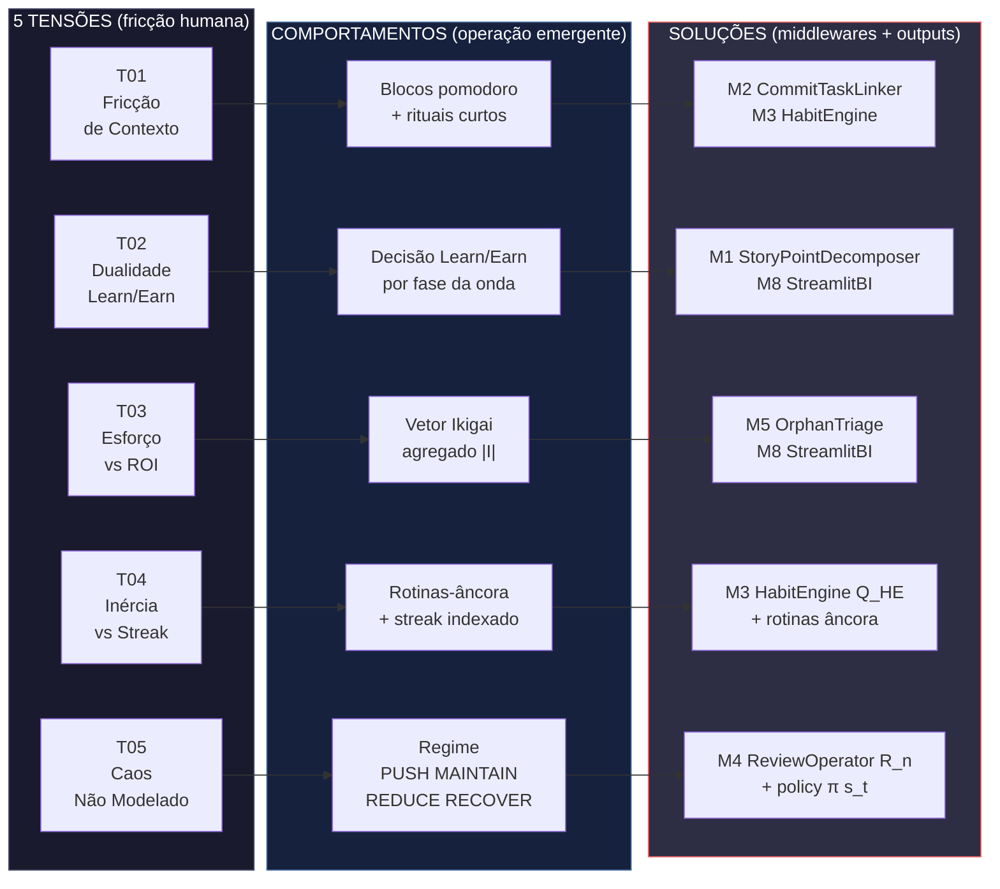
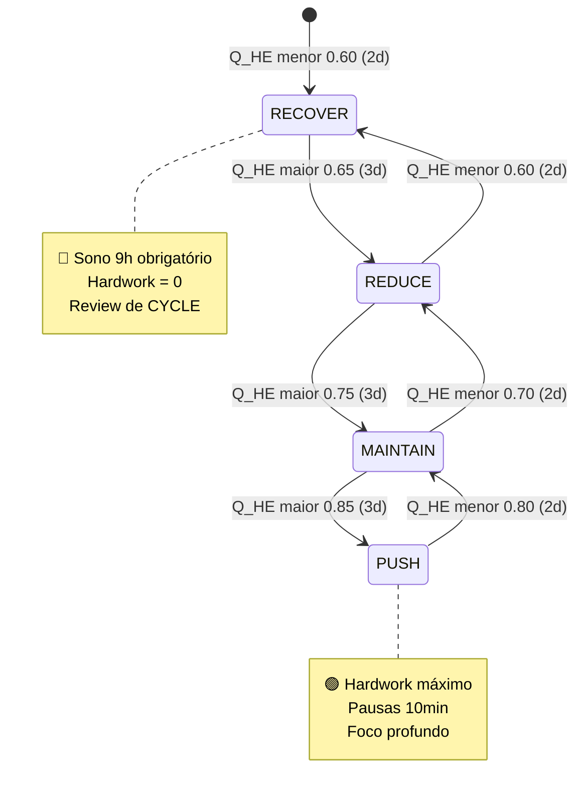
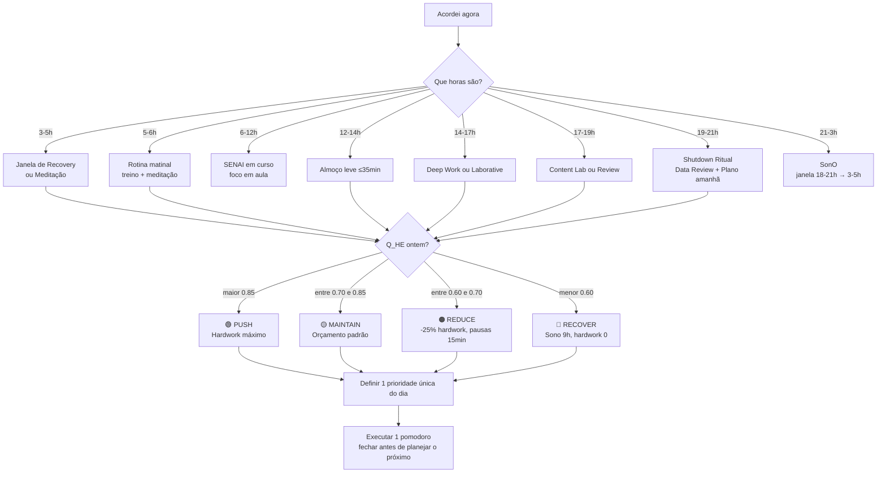

# CONCEPTUAL_MODEL.md

> **O Modelo Conceitual do Algorithmic Life OS**
>
> Este documento responde a pergunta **"por que"** antes do **"como"**.
> Complementa `AGENTS.md` (regras para o agente), `CLAUDE.md` (guia humano) e
> `SYSTEMS_TOPOLOGY.md` (mapa técnico de middlewares).
>
> **Audiência:** você (Matheus) lendo o sistema de fora, ou um futuro
> agente/IA tentando entender a *intenção* antes de tocar em código.
>
> **Framework central:** **Tensão → Comportamento → Solução** (T→B→S).
> Toda fricção observada no dia-a-dia é uma Tensão. Todo bloco operacional
> é um Comportamento que emerge dela. Todo middleware/output do workspace
> é uma Solução que a endereça.

---

## §0. DIAGRAMA DE CAPA — T→B→S em uma página

**Leitura do diagrama:** cada coluna é uma camada conceitual. As setas mostram
o fluxo causal: uma Tensão (esquerda) provoca um Comportamento operacional
(centro), que é sustentado por uma Solução técnica (direita). Não há setas
entre tensões — elas coexistem. Toda decisão do dia-a-dia pode ser rastreada
para uma (ou mais) destas 5 linhas.

---

## §1. AS 5 TENSÕES FUNDAMENTAIS

> "O sistema não foi construído para resolver tarefas. Foi construído para
> resolver *fricções* que tornam as tarefas impossíveis de terminar."

Cada tensão tem três propriedades canônicas:

- **Descrição narrativa** — como ela se manifesta no dia-a-dia
- **Métrica de impacto** — como ela é medida (quando há dado) ou sentida
- **Citação do workspace** — de qual documento/especificação ela se origina

### T01. Fricção de Contexto

**Descrição:** o sistema do Matheus é interrompido ~9 vezes por dia (rituais
de transição), cada um custando em média 17,5 minutos. O resultado é que
**157,5 minutos/dia (≈ 38% da capacidade líquida de um dia com curso) são
desperdiçados em mudança de contexto**. Em um mês, isso equivale a 1,3 dias
inteiros de foco que poderiam ter sido investidos em hardwork.

**Métrica:** $\text{Overhead}_{\text{transição}} = \sum_{i=1}^{9} \delta t_i$,
tipicamente $\approx 157$ min/dia em regime SENAI.

**Origem:** `vibe-ops/base/IKIGAi.md §"Análise de Gargalos (I/O Overhead)"`.

### T02. Conflito de Identidade (Build to Learn vs Build to Earn)

**Descrição:** o Matheus é, simultaneamente, um **aluno de ADS no SENAI
(6-12h)** e um **engenheiro de IA em transição de carreira**. Isso cria uma
dualidade: a energia cognitiva que vai para o curso (Build to Learn) não
está disponível para freelas/portfólio/vagas (Build to Earn), e vice-versa.
A dualidade não é eliminada — é gerenciada por pesos $w_i$ que se rearranjam
a cada onda do ciclo.

**Métrica:** proporção de horas-líquidas-dia alocadas a Learn vs Earn.
Dia com curso: ~75% Learn / 25% Earn. Dia livre: ~50/50.

**Origem:** `vibe-ops/base/IKIGAi.md §"Planejamento Tático (A Conexão)"`.

### T03. Assimetria Esforço ↔ Retorno

**Descrição:** o Matheus aloca tempo e energia, mas não tem métrica de
**ROI por vetor Ikigai**. Horas de treino (vetor $\vec{P}$) não são diretamente
comparáveis a horas de estudo (vetor $\vec{H}$), e nenhuma das duas é
diretamente comparável a entregas para o mercado (vetor $\vec{M}$). Sem um
$|\vec{I}|$ que agregue as 5 dimensões, "otimização" vira sensação, não
decisão. **O custo de não ter essa métrica é que toda alocação é negociada
no escuro.**

**Métrica ideal:** $|\vec{Ikigai}| = |\sum w_i \vec{v}_i|$, onde
$\vec{v}_i \in \{\vec{P}, \vec{H}, \vec{M}, \vec{R}, \vec{C}\}$.
Hoje: 🔴 (não calculado automaticamente — gap crítico).

**Origem:** `vibe-ops/base/IKIGAi.md §"Cluster de Alocação Ikigai"`.

### T04. Inércia vs. Streak

**Descrição:** as rotinas-âncora (sono 18-21h→3-5am, meditação matinal,
treino, almoço leve ≤35min) precisam atingir **consolidação assintótica**
$H(t) \to 1$ para liberar banda cognitiva. Antes disso, cada decisão custa
caro (fadiga decisória). A tensão é circular: **para ter streak é preciso
disciplina, mas disciplina exige o streak que ainda não se formou**.
O sistema resolve isso com o modelo $H(t) = 1 - e^{-\lambda t}$, que
reconhece que a consolidação é exponencial e não-linear.

**Métrica:** $Q_{HE}(t) \in [0, 1]$ — quociente de eficiência indexada
por hábitos. Se $Q_{HE} \geq 0{,}85$, o sistema está em regime de alta
eficácia e o hardwork escala naturalmente.

**Origem:** `life-ops/planner/Points_of_premisses-task-habits.md §"Quociente
de Eficiência Indexada por Hábitos (Q_HE)"`.

### T05. Caos Não Modelado

**Descrição:** infrações (acordar >5h, sono <6h, faltar treino, perder
pomodoro crítico) são tratadas como **"falhas"** em vez de **inputs do
sistema**. A política $\pi(\mathbf{s}_t)$ precisa absorver o caos como
ruído gaussiano $\epsilon_t \sim \mathcal{N}(0, \sigma^2)$ e fazer
histerese (manter 2-3 dias antes de mudar de regime), em vez de colapsar
a cada variação. **O custo de tratar o caos como exceção é que o sistema
quebra exatamente nos dias em que mais precisa funcionar.**

**Métrica:** $\pi(\mathbf{s}_t) \in \{\text{PUSH, MAINTAIN, REDUCE, RECOVER}\}$,
acionado por histerese de 2-3 dias.

**Origem:** `life-ops/planner/Points_of_premisses-task-habits.md §"Matrizes
de Decisão Estocásticas & Adaptação ao Caos"`.

---

## §2. MAPA TENSÃO → COMPORTAMENTO

> "A tensão não se resolve com vontade. Ela se resolve com **padrões
> operacionais** que a endereçam. Esta tabela é o coração do modelo."

| Tensão | Comportamento Operacional Emergente | Indicador Diário | Quando Ativa |
|---|---|---|---|
| **T01** Fricção de Contexto | Pomodoros 50+10 com rituais de cold-start ≤5min entre blocos; batch processing de mensagens; "regra do VS Code aberto" (não ler sem codar) | $n_{\text{pomodoros fechados}}/n_{\text{planejados}}$ | Toda transição entre blocos |
| **T02** Dualidade L/E | Decisão Learn/Earn por **fase da onda** (15d): semana 1-2 = Learn dominante; semana 3 = Earn catch-up. Pesos $w_i$ rearranjados a cada onda | $\Delta w_{\text{Learn}}$ vs $\Delta w_{\text{Earn}}$ | Domingo à noite (planejamento de onda) |
| **T03** Assimetria ROI | Cálculo semanal de $|\vec{I}|$ com pesos adaptativos; comparação orçado × realizado por vetor; dashboard de "qual pilar rendeu mais" | $\text{ROI}_{\text{vetor}} = \frac{\Delta |\vec{v}_i|}{\Delta t \cdot w_i}$ | Sábado (revisão semanal) |
| **T04** Inércia vs Streak | Rotinas-âncora em janela fixa (4-6h treino, 5min meditação, almoço ≤35min); streak indexado por rotina (não global); questionário socrático noturno | $Q_{HE}(t)$, $\text{streak}_{\text{sono}}$, $\text{streak}_{\text{treino}}$ | Toda manhã (ritual) e toda noite (review) |
| **T05** Caos | Matriz $\pi(\mathbf{s}_t)$ com histerese; downgrade gradual (PUSH→MAINTAIN→REDUCE→RECOVER) sem colapso; **oposto de "tudo ou nada"** | $\pi(\mathbf{s}_t)$, $\text{Infrações}_{24h}$ | A cada checagem de energia (mínimo 2x/dia) |

### Comportamento dominante por camada

- **Operacional (dia-a-dia):** T01 (fricção) e T04 (inércia) — acontecem em **escala de horas/pomodoros**
- **Tático (semana/onda):** T02 (dualidade) e T03 (assimetria) — acontecem em **escala de dias/semanas**
- **Estratégico (ciclo/fase):** T03 (assimetria) e T05 (caos) — acontecem em **escala de 45d/180d**

---

## §3. VETORES IKIGAI (5 FORÇAS + 1 META)

O IKIGAi do Matheus é representado como um **vetor em espaço
quintidimensional**. Cada eixo é um pilar que importa para o propósito
declarado (interseção entre IA, artes marciais, e carreira de engenheiro).

### Os 5 vetores canônicos

| Vetor | Nome | Pergunta-Canônica | Exemplo Concreto |
|---|---|---|---|
| $\vec{P}$ | **Paixão / Saúde** | "O sistema está sustentável biologicamente?" | Treino 60min, sono 7-9h, meditação |
| $\vec{H}$ | **Habilidade / IA Engineering** | "Estou aprofundando competência técnica?" | Deep Work em código, leitura técnica, projetos |
| $\vec{M}$ | **Mercado / Visibilidade** | "O mundo me vê como referência?" | Networking, conteúdo técnico-narrativo, GitHub público |
| $\vec{R}$ | **Renda / Fluxo de Caixa** | "Estou gerando entregáveis de valor de mercado?" | Freelas, vagas aplicadas, propostas enviadas |
| $\vec{C}$ | **Curso / SENAI (contexto bloqueante)** | "Estou cumprindo o ônus do curso com mínimo atrito?" | Presença, provas, trabalhos — o **vetor com peso decrescente** ao longo do ano |

> **Nota crítica:** a especificação em `vibe-ops/base/IKIGAi.md` define
> 4 vetores (paixão/habilidade/mercado/renda). O 5º ($\vec{C}$) é uma
> **adaptação contextual** reconhecida pelo próprio documento
> ("SENAI 6-12h"). Esta documentação o promove a 5º vetor canônico
> porque ele disputa ~27% da capacidade diária e precisa ser modelado
> explicitamente.

### O meta-vetor $\vec{Ikigai}$

$$
\vec{Ikigai} = w_1 \vec{P} + w_2 \vec{H} + w_3 \vec{M} + w_4 \vec{R} + w_5 \vec{C}
$$

O **módulo** $|\vec{Ikigai}|$ é o que deveria ser maximizado pelo sistema.
Os **pesos $w_i$** rearranjam-se a cada onda (15d) conforme a fase:

| Fase da Onda | Pesos Típicos ($w_1..w_5$) | Racional |
|---|---|---|
| **Fundamentação** (1-2 semanas de uma onda) | 0.15, 0.40, 0.15, 0.10, 0.20 | Habilidade domina, curso obrigatório |
| **Hackathon / Sprint** (deadline) | 0.10, 0.20, 0.20, 0.40, 0.10 | Renda domina, habilidade sustenta |
| **Busca de Mercado** (transição de fase) | 0.10, 0.15, 0.45, 0.20, 0.10 | Mercado domina, networking intenso |
| **Recuperação** (pós-infração) | 0.50, 0.10, 0.05, 0.05, 0.30 | Saúde domina, sistema estabiliza |

> ⚠️ **Gap identificado:** o cálculo automático de $|\vec{Ikigai}|$ **não
> existe no código atual**. A proposta `M8. StreamlitBI` (§7) é a solução
> canônica, mas hoje a soma é feita "no olho" durante a revisão semanal.

---

## §4. OS 4 REGIMES DE OPERAÇÃO

> "O sistema não opera com 1 setting fixo. Ele transiciona entre **4
> regimes discretos** baseados no estado atual $\mathbf{s}_t$."

### Estados e thresholds

| Regime | $Q_{HE}$ | $C_{comp}$ | Infrações 24h | TipoDia | Hardwork |
|---|---|---|---|---|---|
| 🟢 **PUSH** | $\geq 0{,}85$ | $\geq 0{,}90$ | 0 | Livre | 9h (máximo) |
| 🟡 **MAINTAIN** | $[0{,}70, 0{,}85)$ | $[0{,}80, 0{,}90)$ | ≤1 | Qualquer | 4-6h (orçamento padrão) |
| 🟠 **REDUCE** | $[0{,}60, 0{,}70)$ | $[0{,}70, 0{,}80)$ | ≤2 | Qualquer | -25% hardwork, pausas 15min |
| 🔴 **RECOVER** | $< 0{,}60$ | $< 0{,}70$ | ≥2 | Qualquer | 0h hardwork, sono 9h, review |

### Máquina de estados (histerese)

### Princípio de histerese (anti-oscilação)

- **Promoção** (ex: REDUCE→MAINTAIN) exige **3 dias consecutivos** acima do limiar
- **Downgrade** (ex: MAINTAIN→REDUCE) exige apenas **2 dias** abaixo
- Resultado: o sistema **sobe devagar e desce rápido** — protege contra
  entusiasmo momentâneo e reage rápido a degradação real

### Decisão de regime na prática

O regime é decidido **duas vezes por dia** (manhã na rotina inicial, noite
na rotina final), e é **revisado pela revisão semanal** para detectar
tendências de longo prazo que a histerese de 2-3 dias não captura.

---

## §5. AS 3 FREQUÊNCIAS TEMPORAIS

> "O sistema opera em **3 frequências aninhadas** que se reforçam
> mutuamente. Não é uma escolha de granularidade — é uma propriedade
> fractal do sistema."

### WAVE / CYCLE / PHASE

| Frequência | Duração | Granularidade | Revisão | Output Canônico |
|---|---|---|---|---|
| **WAVE** (Onda) | 15 dias úteis | Micro-ajustes de carga | Mid-wave (d7) + Wave-end (d15) | Relatório de Onda |
| **CYCLE** (Ciclo) | 45 dias úteis (3 ondas) | Renormalização de hábitos, política $\pi$ | Mid-cycle (d30) + Cycle-end (d45) | Supervisão Quinzenal |
| **PHASE** (Fase) | 180 dias úteis (4 ciclos) | Estratégia, sonho vs realizado, IKIGAi | Mid-phase (d90) + Phase-end (d180) | Avaliação Trimestral (PAE) + Teste de Fogo |

### Operador de revisão espaçada $\mathcal{R}_n$

A cada checkpoint temporal, o sistema aplica um **operador de renormalização**
que recalibra $\lambda$ (taxa de aprendizado), $k$ (fadiga), e o vetor
de estado $\mathbf{s}_t$:

$$
\mathcal{R}_n(\mathbf{s}_t) = 
\begin{cases}
H_{n+1} = H_n + \alpha \cdot C_{comp} \cdot (1 - H_n) - \beta \cdot \sigma_E \\
k_{n+1} = k_n \cdot (1 - \gamma \cdot R_{qual}) \\
\lambda_{n+1} = \lambda_n \cdot (1 + \delta \cdot \Delta S_{streak})
\end{cases}
$$

> Onde $\alpha, \beta, \gamma, \delta$ são hiperparâmetros calibrados
> por dados históricos. Ver `life-ops/planner/Points_of_premisses-task-habits.md §2`
> para faixas e gatilhos.

### Visualização do calendário fractal

```mermaid
gantt
    title Calendário de Revisões Espaçadas (WAVE/CYCLE/PHASE)
    dateFormat  D
    axisFormat  %d

    section WAVE 1
    MID_WAVE (Ajuste Carga)    :milestone, 7, 1d
    WAVE_END (Consolidação)    :milestone, 15, 1d

    section CYCLE 1
    MID_CYCLE (Renormalização) :milestone, 30, 1d
    CYCLE_END (Checkpoint)     :milestone, 45, 1d

    section PHASE 1
    MID_PHASE (Estratégia)     :milestone, 90, 1d
    PHASE_END (Maestria)       :milestone, 180, 1d
```

> 💡 **Insight:** a mesma pergunta ("como estamos?") é feita em
> **3 frequências** e espera **3 tipos de resposta**. Confundi-las é
> a fonte nº 1 de ansiedade: usar resposta de WAVE para questão de PHASE,
> ou vice-versa.

---

## §6. OUTPUTS PRÁTICOS DO SISTEMA

> "O que o workspace **entrega de fato hoje**? Esta seção é a fotografia
> do que existe, não do que deveria existir."

| Output | Tensão que Endereça | Frequência | Onde Mora | Status |
|---|---|---|---|---|
| **Daily Report** (narrativa + checklist) | T01, T04 | Diário | `strategics/Análise (Tático e Operacional).md` (template) + `life/handlers/daily.py` | 🟢 template existe, 🟡 execução parcial |
| **Weekly Review** (metas cumpridas) | T02, T03 | Semanal | `strategics/Hierarquia de Objetivos.md` | 🟢 template existe |
| **Wave Report** (consolidação 15d) | T04, T05 | 15d | `strategics/Desempenho Subjacente.md §2.2` | 🟡 template existe, 🟡 execução parcial |
| **Supervisão Quinzenal** (renormalização) | T04, T05 | 15d | `strategics/Desempenho Subjacente.md §2.1` | 🟢 template existe |
| **Avaliação Trimestral (PAE)** | T02, T03, T05 | 90d | `strategics/Planejamento (Estratégico e Tático).md §6.2` | 🟢 template existe |
| **Teste de Fogo** (avaliação de fase) | T03 | 180d | `strategics/Planejamento (Estratégico e Tático).md §3.1` | 🟡 template existe, 🔴 não aplicado |
| **Q_HE Score** (índice de eficiência) | T04, T05 | Diário | `life-ops/planner/Points_of_premisses-task-habits.md §3` | 🔴 não implementado (gap M3) |
| **Ikigai Vector Module** ($|\vec{I}|$) | T03 | Semanal | `vibe-ops/base/IKIGAi.md §Hypervisor` | 🔴 não implementado (gap M8) |
| **Orphan Triage Report** (`triagem.md`) | T03 | Diário | Proposta `M5. OrphanTriageWriter` | 🔴 não existe (gap M5) |
| **Burndown / Streak Dashboard** | T01, T04 | Diário | Proposta `M8. StreamlitBI` | 🔴 não existe (gap M8) |

### Padrão observado

- **Outputs de curto prazo (diário/semanal)** têm **template** mas **execução parcial** — faltam middlewares que automatizem a coleta
- **Outputs de médio prazo (quinzenal/mensal)** têm **template + execução razoável** — feitos manualmente
- **Outputs de longo prazo (trimestral/fase)** têm **template mas raramente aplicados** — dependem de consistência de meses

> 💡 **Diagnóstico:** o sistema **documenta o que deveria fazer** com
> alta qualidade. O **gargalo real é a automação da coleta**, não a
> modelagem. Cada gap de middleware (M1-M8 do §7) é um output que hoje
> exige disciplina manual.

---

## §7. MIDDLEWARES POR TENSÃO QUE RESOLVEM

> "Para cada tensão, qual middleware (proposto ou existente) é a
> alavanca técnica que a endereça? Tabela enxuta — para o mapa técnico
> completo, ver `SYSTEMS_TOPOLOGY.md §7`."

| Tensão | Middleware Principal | Status | Localização no Código |
|---|---|---|---|
| **T01** Fricção de Contexto | **M2. CommitTaskLinker** (git→SQLite) + ritual de cold-start ≤5min | 🟡 proposto | `vibe-ops/src/pipeline/` (gap) |
| **T02** Dualidade L/E | **M1. StoryPointDecomposer** (BacklogTask→TW cards) | 🟡 proposto | `vibe-ops/src/contracts/roadmap_sync_v1.py` (existe contrato, falta decompositor) |
| **T03** Assimetria ROI | **M8. StreamlitBI** (dashboard IKIGAi) | 🟡 proposto | `vibe-ops/src/` (gap) |
| **T04** Inércia vs Streak | **M3. HabitEngine** ($H(t), E(t), Q_{HE}$) | 🟡 proposto | `vibe-ops/src/pipeline/` (gap) |
| **T05** Caos Não Modelado | **M4. ReviewOperator** $\mathcal{R}_n(\mathbf{s}_t)$ + **M5. OrphanTriageWriter** | 🟡 proposto | `vibe-ops/src/pipeline/policy_engine.py` (parcial) |

### Tabela reversa (middleware → tensão)

Para auditabilidade: "se eu mexo nesse middleware, qual tensão eu impacto?"

| Middleware | Tensões Impactadas | Risco de Mudança |
|---|---|---|
| **M1. StoryPointDecomposer** | T02, T03 | Baixo (isolado em TW) |
| **M2. CommitTaskLinker** | T01 | Médio (depende de schema `changelog_entries`) |
| **M3. HabitEngine** | T04, T05 | **Alto** (núcleo do regime $\pi$) |
| **M4. ReviewOperator** | T05 | Médio (afeta todos os checkpoints) |
| **M5. OrphanTriageWriter** | T03 | Baixo (output isolado) |
| **M6. HookDispatcher** | (transversal) | Baixo (plugin lifecycle) |
| **M7. TimewEnergyBridge** | T01, T04 | Médio (depende de timew binary) |
| **M8. StreamlitBI** | T02, T03 | Baixo (read-only sobre SQLite) |

---

## §8. ÁRVORE DE DECISÃO DIÁRIA (1 página)

> "Cole isso ao lado do monitor. Toda manhã começa aqui."

### A pergunta-chave do dia

> **"Se eu só conseguir fazer 1 coisa hoje, qual é?"**

Se você não consegue responder, o regime está errado. Se você responde
com facilidade, o regime está certo e o sistema está funcionando.

### Fallback universal (se tudo falhar)

> **"Volte para a rotina-âncora mais simples: sono → treino → 1 pomodoro."**
> Recuperar o sistema sempre é mais barato do que tentar compensar com mais horas.

---

## §9. GLOSSÁRIO T↔B↔S ↔ WORKSPACE

> "Mapeamento reverso: se você vê este conceito no código, é esta tensão
> que ele endereça."

| Conceito no Workspace | Tensão | Comportamento | Middleware/Output |
|---|---|---|---|
| `vim` + `task` (Taskwarrior) | T01, T02 | Pomodoros + Decisão L/E | Taskwarrior (binário) + M1 |
| `Obsidian vault` (`.md` com frontmatter) | T03 | Documentação de ROI | `vibe-ops/src/middleware/sync_engine.py` |
| `Timewarrior` (`timew`) | T01, T04 | Tracking de energia | M7 (gap) |
| `changelog_entries` (SQLite table) | T01 | Métrica de fricção | M2 (gap) |
| `policy_engine.py` (4 regimes) | T05 | Histerese de estado | M4 (parcial) |
| `ikigai_scorer.py` (4-vec study/dev/health/global) | T03 | Cálculo de $\|\vec{I}\|$ | M8 (gap) + reconciliação de vetores |
| `habit_engine.py` (gap) | T04 | Cálculo de $Q_{HE}$ | M3 (gap) |
| `daily.py` handler | T01, T04 | Orquestração matinal | `life/handlers/daily.py` + M6 |
| `weekly.py` handler | T02, T03 | Orquestração semanal | `life/handlers/weekly.py` + M6 |
| `triagem.md` (gap) | T03 | Triage de itens órfãos | M5 (gap) |
| `streamlit` dashboard (gap) | T02, T03 | Visualização executiva | M8 (gap) |

### Onde a tensão aparece como **código**

| Tensão | Arquivo mais representativo |
|---|---|
| T01 | `vibe-ops/src/middleware/sync_engine.py` (fricção de sync) |
| T02 | `vibe-ops/src/pipeline/roadmap_sync_ingest.py` (decomposição Learn/Earn) |
| T03 | `vibe-ops/src/pipeline/ikigai_scorer.py` (módulo do vetor) |
| T04 | (gap) `vibe-ops/src/pipeline/habit_engine.py` |
| T05 | `vibe-ops/src/pipeline/policy_engine.py` (4 regimes) |

### Onde a tensão aparece como **documento**

| Tensão | Documento mais representativo |
|---|---|
| T01 | `vibe-ops/base/IKIGAi.md §Análise de Gargalos` |
| T02 | `vibe-ops/base/IKIGAi.md §Planejamento Tático` |
| T03 | `vibe-ops/base/IKIGAi.md §Hypervisor (Equação de Equilíbrio)` |
| T04 | `life-ops/planner/Points_of_premisses-task-habits.md §3` |
| T05 | `life-ops/planner/Points_of_premisses-task-habits.md §4` |

---

## §10. NOTAS FINAIS

### Conexões cruzadas

- **Para o mapa técnico completo de middlewares:** `SYSTEMS_TOPOLOGY.md`
- **Para a navegação estratégica-tática-operacional:** `strategics/00-ÍNDICE-PROGRESSIVO.md`
- **Para a origem conceitual Ikigai:** `vibe-ops/base/IKIGAi.md`
- **Para a matemática formal ($H, E, Q_{HE}, \mathcal{R}_n$):** `life-ops/planner/Points_of_premisses-task-habits.md`
- **Para a decomposição em 27 modelos matemáticos:** `life-ops/planner/SCALAR_DECOMPOSITION_BACKLOG.md`

### Princípios de design aplicados

1. **Append-Only** — não deleta/reescreve nada em `vibe-ops/`, `strategics/` ou `life-ops/`
2. **Não duplica** `SYSTEMS_TOPOLOGY.md` — aponta para ele quando o leitor quiser detalhe técnico
3. **PT formal** — alinhado com `strategics/` e a tradição documental do workspace
4. **1 página de decisão** (§8) — utilizável em 30 segundos para a rotina matinal
5. **Mapeamento reverso** (§9) — "se você vê X no código, é a tensão Y"

### Quando revisar este documento

- **A cada 90 dias** (PHASE_END) — checar se as 5 tensões ainda são canônicas ou se alguma nova tensão emergiu
- **Quando o IKIGAi do Matheus mudar** (ex: SENAI acabar) — $\vec{C}$ pode deixar de ser vetor canônico
- **Quando um middleware novo for implementado** — atualizar §7

### Versão

- **v1.0** (2026-06-05): primeira versão do modelo conceitual T→B→S, identifica 5 tensões, 4 regimes, 3 frequências, 8 middlewares e suas correspondências.
