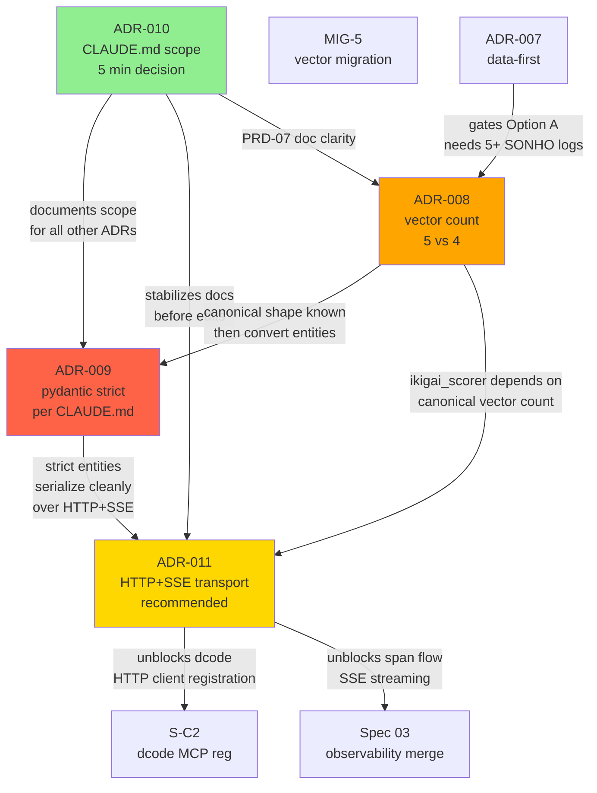

# Cross-Cutting ADR Triage — 2026-08-27

> **Companion to:** `code-docs/adr/ADR-008..011` (4 Proposta ADRs) + `code-docs/adr/2026-08-27-decision-questionnaire.md`
> **Synthesizes:** shared concerns, decision dependencies, unified decision flow
> **Date:** 2026-08-27
> **Status:** 🟡 Draft — pending user review

---

## §0 Purpose

This document synthesizes the four **Proposta** ADRs drafted on 2026-08-27
(ADR-008, 009, 010, 011) into a single triage surface so the decider (Matheus)
can resolve them with full awareness of cross-cutting implications. The four
ADRs are:

| ADR | Title | Layer | Decision surface |
|-----|-------|-------|------------------|
| **008** | IKIGAI Vector Count (5 vs 4) | schema / data | migration MIG-5 |
| **009** | Pydantic Strict Mode Invariance | schema / code | 30+ entity files |
| **010** | Dual CLAUDE.md Scope Strategy | documentation | 2 file edits |
| **011** | HTTP+SSE Transport for IKIGAI MCP | infrastructure / transport | 3-5 days + tests |

**Why a triage doc?** The four ADRs are not independent. They share
infrastructure (entity files, MCP server, vault frontmatter), they touch
overlapping test suites, and decisions on one affect the migration cost of
others. Resolving them in arbitrary order risks double-migration churn, broken
documentation, and inconsistent downstream deployments.

**Goal:** Identify shared concerns, dependencies, optimal order, and a single
human-in-loop decision session that resolves all 4 in one sitting.

**Reading order:** §1 (matrix) → §2 (graph) → §4 (order) → §5 (session
template) → §6-§8 (risk + cost + refs).

---

## §1 Shared Concerns Matrix

Rows = the 4 Proposta ADRs. Columns = the cross-cutting concerns each
ADR touches. Cells use a 0/1/2 weight:

- **0** = not affected
- **1** = tangentially affected (small surface, secondary effect)
- **2** = directly affected (primary surface, primary effect)

| ADR   | Schema | Transport | Docs | Tests | Ops | **Total** |
|-------|:------:|:---------:|:----:|:-----:|:---:|:---------:|
| 008 (vector count) | **2** | 0 | 1 | **2** | 0 | 5 |
| 009 (pydantic strict) | **2** | 0 | 1 | **2** | 1 | 6 |
| 010 (CLAUDE.md) | 0 | 0 | **2** | 0 | 1 | 3 |
| 011 (HTTP+SSE) | 0 | **2** | 1 | 1 | **2** | 6 |
| **Hits per concern** | **4** | **2** | **5** | **5** | **4** | — |

**Reading the matrix:**

- **Schema column (4 hits):** ADR-008 + ADR-009 both touch entity files
  (`IKIGAiProfile`, `PlanEntity`, `VectorScorePoint`). Schema is the most
  contended concern — two ADRs directly modify schema, and any decision on
  one reshapes the migration cost of the other.
- **Docs column (5 hits):** Every ADR requires some documentation update.
  ADR-010 is the canonical docs decision; the other three must update docs
  once their technical decisions land (PRD-07, CLAUDE.md invariant wording,
  README transport section).
- **Tests column (5 hits):** ADR-008 + ADR-009 both require test rewrites
  (4-vs-5 vector assertions; lax-vs-strict behavior assertions). ADR-011
  adds a `pytest.mark.parametrize("transport", ["stdio", "http"])` sweep.
  ADR-010 has no direct test impact.
- **Transport column (2 hits):** ADR-011 owns transport; ADR-009 has
  secondary impact because strict Pydantic serialization changes how
  HTTP+SSE responses are framed.
- **Ops column (4 hits):** ADR-011 is the largest ops change (HTTP server
  lifecycle, auth, port binding). ADR-010 affects ops via on-call runbooks
  that reference either CLAUDE.md. ADR-009 affects ops via the CI check
  (`scripts/check-pydantic-strict.py`).

**Cross-cutting hot spots:**

1. **Entity file overlap.** ADR-008 + ADR-009 both edit `src/ikigai/entities/`.
   Decide 008 first (so you know the canonical vector shape), then 009
   (so you convert the right entities to strict).
2. **Documentation divergence.** ADR-010 changes the canonical docs surface;
   ADR-009 changes one specific invariant wording in CLAUDE.md (Pydantic
   v2 strict). ADR-010 should land first so subsequent docs edits have a
   known scope.
3. **Test matrix growth.** ADR-008 + ADR-009 + ADR-011 all add test
   permutations. Combined sweep count: `4-or-5 vectors × 2 lax/strict ×
   2 transports = 16-20 matrix cells`. Plan test infra accordingly.

---

## §2 Decision Dependency Graph



**Key edges (color-coded by recommended order):**

1. **ADR-010 → ADR-009** (green → red): ADR-010 stabilizes the docs surface so
   ADR-009's CLAUDE.md invariant edit has a known scope. If 010 is unresolved,
   009 cannot safely edit "the canonical invariant wording" because it's
   unclear which CLAUDE.md owns the invariant.
2. **ADR-010 → ADR-011** (green → gold): ADR-010 establishes which CLAUDE.md
   gets the new "Transport" section. If 010 is unresolved, 011's docs edit
   lands in the wrong file.
3. **ADR-007 → ADR-008** (methodology → ADR): data-first methodology gates
   ADR-008 Option A behind observed usage. ADR-008 cannot legitimately pick
   Option A without the 30-day SONHO audit.
4. **ADR-008 → ADR-009** (gold → red): if you convert entities to strict
   Pydantic (009) before deciding vector count (008), you may convert 5
   vector fields and then remove one. Decide 008 first to know the shape.
5. **ADR-008 → ADR-011** (gold → gold): `ikigai_scorer` (called by MCP tool
   `ikigai_score`) depends on canonical vector count. ADR-011's HTTP
   transport serves the same tools, so vector count must be settled before
   HTTP integration tests assert correct response shape.
6. **ADR-009 → ADR-011** (red → gold): strict Pydantic serializes more
   predictably over JSON-RPC/HTTP; converting entities first makes the
   HTTP+SSE implementation slightly cleaner.

**Cycles:** None. The graph is a DAG with ADR-010 at the top, ADR-009 at the
bottom, and ADR-011/008 in the middle.

**Parallelization opportunities:**

- **010 + 011 can be decided in parallel** if the user splits the decision
  between two reviewers (docs reviewer for 010; infra reviewer for 011).
  However, ADR-010 → ADR-011 is a soft doc dependency; sequencing 010 first
  is preferred but not blocking.
- **008 + 009 cannot be parallelized** (008 must land first). They touch
  the same entity files.

---

## §3 Cross-Cutting Implications

Decisions that ripple across more than one ADR:

### 3.1 Entity file migration shape (008 + 009)

Both ADRs modify `src/ikigai/entities/`. If 009 lands first, the migration
script must handle 5-vector → strict mode AND know which fields stay. If
008 lands first, the migration script for 009 only converts the canonical
4-or-5 fields. **Sequence: 008 → 009** saves ~1 day of double-migration
churn on `IKIGAiProfile`.

### 3.2 CLAUDE.md invariant wording (009 + 010)

CLAUDE.md currently states "Pydantic v2 strict ... non-negotiable" in both
root and `life/CLAUDE.md`. ADR-009 Option B relaxes this invariant; ADR-010
determines which CLAUDE.md is canonical. If ADR-010 picks Option B (merge
+ delete root), the invariant edit lands in one file. **Sequence: 010 → 009.**

### 3.3 Test matrix growth (008 + 009 + 011)

```
   vector_count    ∈ {4, 5}                # ADR-008
 × pydantic_mode   ∈ {lax, strict}          # ADR-009
 × transport       ∈ {stdio, http_sse}     # ADR-011
 = 8 cells × 8 IKIGAI MCP tools = 64 test variants
```

Test infra (`conftest.py` with `@pytest.mark.parametrize`) must support
matrix sweeps before any of 008/009/011 lands. Plan 1-2 days for test
infrastructure first.

### 3.4 MCP tool surface (008 + 011)

`ikigai_score` MCP tool returns a `VectorScorePoint` array. Vector count
(008) determines array length; transport (011) determines JSON-RPC stdio vs
HTTP+SSE framing. **ADR-008 must settle before HTTP+SSE integration tests
can assert correct response shape for `ikigai_score`.**

### 3.5 Documentation cross-links (010 + minor 008/009/011)

ADR-010 establishes which CLAUDE.md is authoritative. The other three ADRs
each require a doc update (PRD-07 wording, invariant edit, README transport
section). Cross-links from each doc update depend on 010 being settled.

---

## §4 Recommended Decision Order

Based on the dependency graph (§2) and cross-cutting implications (§3):

| Order | ADR   | Rationale                                                                                   |
|------:|-------|---------------------------------------------------------------------------------------------|
| **1** | 010   | Pure docs decision; 5-min resolution; no code impact; frees subsequent docs edits           |
| **2** | 011   | Recommended acceptance in source ADR; unblocks S-C2 + Spec 03; minimal entity-file impact |
| **3** | 008   | Data-gated (ADR-007); 30-day SONHO audit prerequisite; settles entity shape before 009     |
| **4** | 009   | Largest blast radius (30+ entities); tackle when sprint bandwidth allows staged migration   |

**Detailed rationale:**

- **010 first** because it's a documentation-only decision. No code impact,
  no test impact, no migration script. It also stabilizes the docs surface
  so ADR-009's CLAUDE.md invariant edit lands in the right place.

- **011 second** because (a) the source ADR already recommends acceptance,
  (b) downstream work (S-C2 dcode MCP, Spec 03 observability, LangChain
  deep agents) is queued, and (c) it has minimal entity-file overlap with
  ADR-008/009. Default-port decision (`127.0.0.1:3737`) is uncontroversial.

- **008 third** because the decision is data-gated (ADR-007 forbids
  promoting vectors without observed usage). The 30-day SONHO audit must
  complete before Option A is legitimate. While the audit runs, the team
  can begin ADR-011 implementation in parallel.

- **009 fourth** because it has the largest blast radius (30+ entities,
  ~50 tests) and depends on 008 being settled (canonical vector shape) and
  010 being settled (canonical docs surface). It is the riskiest decision
  and benefits from being scheduled in a sprint with review bandwidth.

**Parallelization: ADR-010 + ADR-011 can be decided in the same session**
because they don't share code surfaces. ADR-008 must wait for audit; ADR-009
must wait for 008.

---

## §5 Single Decision Session Template

A one-shot human-in-loop session that resolves all 4 ADRs:

### §5.1 Pre-session setup (60 min)

1. **Read this triage doc** to absorb cross-cutting implications.
2. **Read each ADR** (008, 009, 010, 011) — about 5 min each.
3. **Read the decision questionnaire** (`2026-08-27-decision-questionnaire.md`)
   for weighted criteria.
4. **Pull SONHO logs** for the 30-day audit (ADR-008 prerequisite):
   ```bash
   grep -r "ikigai_vectors" data/matheus/ | awk -F'[][]' '{print $2}' \
     | tr ',' '\n' | sort | uniq -c | sort -rn
   ```
   Count 4-vector vs 5-vector occurrences in dreams/objectives/SONHO logs.

### §5.2 Session agenda (45-60 min)

```
[0:00-0:05]  ADR-010 — Pick A (boundaries) or B (merge+delete); edit CLAUDE.md Scope headers
[0:05-0:20]  ADR-011 — Pick A (HTTP+SSE, recommended); IKIGAI_MCP_TRANSPORT=stdio default; bind 127.0.0.1:3737
[0:20-0:35]  ADR-008 — gated on §5.1 audit; A if 5-vec ≥ 5 occurrences, else B (data-first); trigger MIG-5
[0:35-0:50]  ADR-009 — Pick A (strict, staged per namespace); Stage 1: PlanEntity; add CI check; trigger MIG-S-M3
[0:50-0:60]  Wrap-up — update 00-INDEX §7, file sprint tickets, schedule +6mo re-eval for reversible Option B
```

Each decision appends to `code-docs/adr/DECISIONS-LOG.md` (template in §5.3).

### §5.3 Decision log entry template

After each decision, append to `code-docs/adr/DECISIONS-LOG.md`:

```markdown
## YYYY-MM-DD — ADR-NNN — Decision: <Option X>

**Decider:** Matheus
**Context link:** code-docs/adr/ADR-NNN-<slug>.md
**Questionnaire link:** code-docs/adr/2026-08-27-decision-questionnaire.md §N

**Choice:** Option A | Option B
**Rationale:** <one paragraph>
**Gating conditions (if any):** <e.g., "Option B pending 30-day SONHO audit">
**Migration kickoff:** Owner, MIG-id, earliest date
```

### §5.4 ADR status flip checklist

After session:

- [ ] Flip ADR-008 status: Proposta → Accepted/Rejected
- [ ] Flip ADR-009 status: Proposta → Accepted/Rejected
- [ ] Flip ADR-010 status: Proposta → Accepted/Rejected
- [ ] Flip ADR-011 status: Proposta → Accepted/Rejected
- [ ] Update CLAUDE.md `## Status` blocks if cross-referenced
- [ ] Update `code-docs/00-INDEX.md §7` cross-link table
- [ ] Trigger migration scripts (MIG-5, MIG-8, MIG-S-M3) per the chosen options

---

## §6 Risk of Inaction (30 days)

What breaks if all 4 ADRs stay Proposta for 30 days:

### ADR-008 — Vector count drift continues

~25 files keep producing inconsistent reads. Agents reading `IKIGAiProfile`
(5 fields) and writing to `PRD-07` (4 fields) introduce drop-on-write bugs.
At the current rate (~2 new dream entries/week), ~8 more entries will have
5-vector frontmatter while scoring assumes 4. MIG-5 migration gets harder
as frontmatter entries pile up.

### ADR-009 — Silent data loss accumulates

Typo'd field names silently dropped; `int → str` coercion fails in
downstream arithmetic. The 0 of 12 strict entities remains 0 of 12. New
entities added during the 30 days inherit the lax pattern (CLAUDE.md says
strict but no CI check enforces it). Strict-mode count goes down over time.

### ADR-010 — New contributor confusion persists

Agents at session start read the wrong CLAUDE.md first; root file says
"2839 tests" (stale); life submodule says "74 pytest files" (also stale).
Pitfall notes scattered. Low absolute cost but quality-of-life issue
compounded per session.

### ADR-011 — S-C2 + Spec 03 stall

dcode MCP registration (S-C2) waits for HTTP+SSE because dcode prefers
HTTP transport. Observability spec 03 (merge plan) waits for HTTP+SSE
because span flow via SSE is cleaner than JSON-RPC stdio. LangChain deep
agents work around stdio with ad-hoc shims. S-C2 stays in P0 backlog;
Spec 03 merge plan extends by 1-2 sprints.

### Combined risk

The 4 ADRs are not independent. Inaction on any one slows the others.
**Longest critical path: ADR-008 → ADR-009** (shared entity files).
**Shortest critical path: ADR-010 → ADR-011** (unblocks S-C2).

**Aggregate 30-day cost:** ~3 days of accumulated migration debt per week
of inaction. After 30 days, the migrations cost 2x what they would have
cost on day 1.

---

## §7 Migration Cost Estimator

Effort per ADR + combined:

| ADR   | Dev effort | Test effort | Docs effort | Migration script | **Total** |
|-------|:----------:|:-----------:|:-----------:|:----------------:|:---------:|
| 008   | 0.5 d      | 0.5 d       | 0.1 d       | MIG-5 (1 d)      | **2.1 d** |
| 009   | 2-3 d      | 1-2 d       | 0.2 d       | MIG-S-M3 (1 d)   | **4-6 d** |
| 010   | 0.05 d     | 0 d         | 0.1 d       | MIG-8 (0.1 d)    | **0.25 d** |
| 011   | 3-5 d      | 2 d         | 0.3 d       | (none, in-code)  | **5-7 d** |
| **Sum (serial)** | **5.5-8.5 d** | **3.5-4.5 d** | **0.7 d** | **2.1 d** | **~12-16 d** |

**Parallelization savings:**

- **010 + 011 in parallel:** saves ~0.2 d (010 is so small it doesn't matter).
- **008 + 011 in parallel:** saves ~1-2 d (separate surfaces).
- **009 cannot be parallelized** with 008 (shared entity files).
- **Combined parallel:** ~7-10 d (vs 12-16 d serial) — about 30-40% time
  savings.

**Where the time goes:**

- **ADR-008 (MIG-5):** frontmatter backfill dominates. Each
  `data/matheus/dreams/*.md` file must be inspected for the 5th vector.
  ~10 files × 5 min each = ~1 hour, plus the script runtime (~5 min).
- **ADR-009 (MIG-S-M3):** entity-by-entity audit dominates. Each of 30+
  entities must be inspected for `frozen=False` dependencies (mutable
  defaults, `score_history` lists). ~30 entities × 10 min each = ~5 hours.
- **ADR-010 (MIG-8):** trivial. Diff + edit + verify. ~30 min total.
- **ADR-011:** HTTP+SSE wiring dominates. FastAPI/Starlette setup, auth
  middleware, lifecycle hooks, test parametrize. ~3-5 days for the HTTP
  layer + 2 days for tests.

**Hidden costs:**

- **Code review bandwidth** for the 30+ entity changes in ADR-009 (each
  PR touches many files). Plan for 2-3 review rounds.
- **CI pipeline updates** for the new `check-pydantic-strict.py` script.
- **Vault migration coordination** with vault authors (4 of 10 dream files
  have non-canonical vector count).

---

## §8 Cross-References

### Source ADRs

- `code-docs/adr/ADR-008-ikigai-vector-count.md`
- `code-docs/adr/ADR-009-pydantic-strict-mode-invariance.md`
- `code-docs/adr/ADR-010-dual-claude-md-scope.md`
- `code-docs/adr/ADR-011-ikigai-mcp-http-sse-transport.md`

### Companion documents

- `code-docs/adr/2026-08-27-decision-questionnaire.md` — per-ADR decision aids
- `code-docs/diagnostic/2026-08-27-master-system-diagnostic.md` — source of
  these ADRs (G2, G3, S-M3, S-H1, S-C1, S-C2, P8)
- `code-docs/diagnostic/2026-08-27-migration-scripts-catalog.md` —
  implementation scripts (MIG-5, MIG-8, MIG-S-M3)

### Methodology + memory

- `code-docs/adr/ADR-007-data-first-methodology.md` — gates ADR-008 Option A
- Memory `algorithm-issues-registry.md` — N01 vector weight mechanism
- Memory `ikigai-weight-mechanism-defer.md` — Option C chosen 2026-07-03

### Implementation points

- `life-ops/ikigai/src/ikigai/entities/profile.py` — `IKIGAiProfile`
- `life-ops/ikigai/src/ikigai/entities/base.py:30` — `PlanEntity`
- `life-ops/ikigai/src/mcp_server/server.py:534` — stdio-only MCP entrypoint
- `life-ops/ikigai/src/agents/tools.py` — tool registry (8 IKIGAI tools)
- `vibe-ops/planning/PRD-07.md` — IKIGAI PRD (4 vectors currently)
- `vibe-ops/pipeline/ikigai_scorer.py` — 4-vector scoring
- `life-oss/CLAUDE.md` — root CLAUDE.md
- `life/CLAUDE.md` — life submodule CLAUDE.md
- `life-ops/operational/CLAUDE.md` — PAV kernel CLAUDE.md (third surface,
  out of scope for ADR-010 but related)

### Decision log

- `code-docs/adr/DECISIONS-LOG.md` — append-only audit trail; create if absent

### Related construction cards (master diagnostic §6)

- **A** AI-native strategic model migration (out of scope here)
- **B** HTTP+SSE transport — same as ADR-011
- **F** Schema split-brain reconciliation (S-C1) — orthogonal; pending canonical writer
- **G** dcode MCP registration (S-C2) — depends on ADR-011
- **H** PAV CLI restoration (P1) — orthogonal
- **I** Vector count reconciliation (G2) — same as ADR-008

---

*Triage document — v1.0 — 2026-08-27 — synthesizes ADR-008..011 Proposta decisions
into a unified decision flow; pending user review.*
