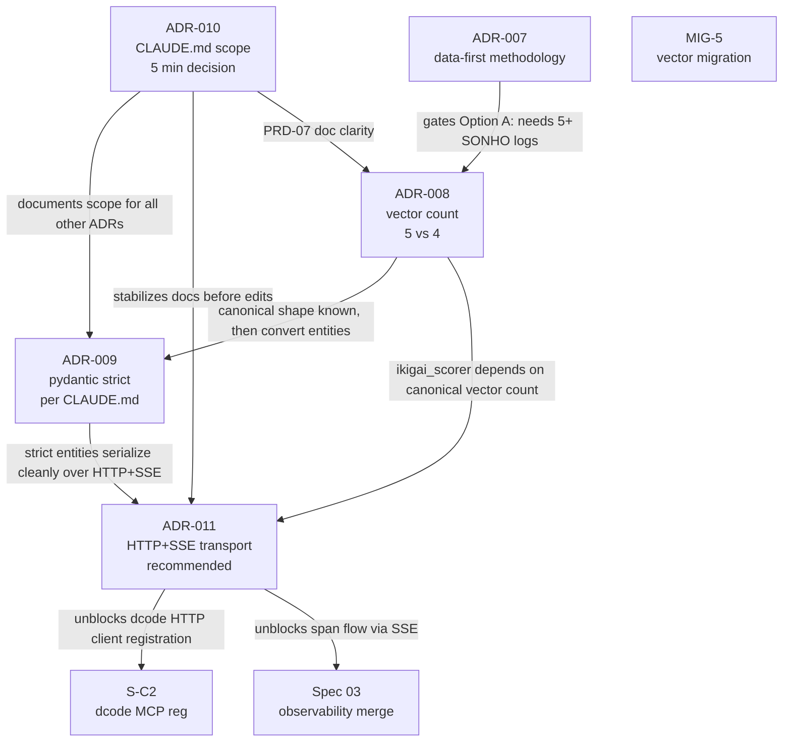

> **[SUPERSEDED 2026-08-28 — see master-branch-carro-chefe-2026-08-28]**
> Pre-pivot decision package for ADR-008..011. PAV is desativado; the
> algorithms/template/registry scope of these ADRs is no longer the active
> focus per algorithm-decisions-defer-2026-08-28. Decisions relevant to
> the canonical architecture (deep-agent over forks-prontas widgets ↔
> vault \`.db.markdown\`) supersede these.

# ADR-008..011 Decision Package — Ready for User Sign-off

> **Status:** 🟡 Draft — 2026-08-28
> **Companion to:**
> - `code-docs/adr/2026-08-27-decision-questionnaire.md` (per-ADR criteria + pre-mortem)
> - `code-docs/adr/2026-08-27-cross-cutting-triage.md` (dependency graph + ordering)
> - `code-docs/adr/2026-08-28-adr-008-011-decision-package-appendix.md` (deep-dive impact tables)
> **Owner:** User (Matheus) — pending decision
> **Scope:** 4 Proposta ADRs (008, 009, 010, 011) awaiting human sign-off

---

## §0 Purpose

This document goes one level deeper than the **decision questionnaire** (2026-08-27).
The questionnaire presented each ADR with criteria, pre-mortem, reversibility, and a
recommendation. This package answers the next question:

> **"If I pick option X, what concrete files change, what tests break/pass, and what
> does my daily workflow look like 7 days later?"**

Read once, end-to-end, in a single sitting. Then copy-paste §7 into chat to sign off
on all 4 ADRs in one message.

**What happens if all 4 are decided:**

- All 4 Proposta ADRs flip to `Accepted` (or `Rejected`).
- Migration scripts MIG-5, MIG-8, MIG-S-M3 unlock for execution.
- 30+ entity files get an authoritative config (frozen + extra + strict).
- `server.py:696` becomes branchable on transport.
- Root + `life/` CLAUDE.md gain explicit scope headers (or one is deleted).
- Test matrix sweep infrastructure lands (`pytest.mark.parametrize("transport", ...)`).

**What happens if any one stays Proposta:**

- ADR-008 → MIG-5 stalls; 5-vs-4 drift continues in 25+ files; ~8 more vault
  entries gain inconsistent frontmatter per 30 days.
- ADR-009 → lax mode continues; new entities inherit the lax pattern; CI never
  enforces the CLAUDE.md invariant.
- ADR-010 → agents keep reading the wrong CLAUDE.md first; pitfall notes drift.
- ADR-011 → S-C2 (dcode MCP registration) stays P0; Spec 03 (observability
  merge) blocks on HTTP+SSE; LangChain deep agents keep stdio shims.

**Hard gate:** ADR-008 Option A is gated on a 30-day SONHO log audit per ADR-007
(data-first methodology). ADR-009 Option A is gated on staged migration
(namespace-by-namespace), not a one-shot rewrite.

---

## §1 Dependency Map



| Edge | Type | Strength | Direction rationale |
|------|------|----------|---------------------|
| 010 → 009 | doc precondition | soft | ADR-010 settles which CLAUDE.md owns the invariant wording |
| 010 → 011 | doc precondition | soft | ADR-010 settles which CLAUDE.md gets the new "Transport" section |
| 010 → 008 | doc precondition | soft | PRD-07 doc clarity benefits from boundary headers |
| 007 → 008 | methodology gate | **hard** | ADR-007 forbids promoting vectors without observed usage |
| 008 → 009 | schema dependency | **hard** | Convert entities only after canonical vector shape is known |
| 008 → 011 | code dependency | medium | HTTP integration tests assert `ikigai_score` response shape |
| 009 → 011 | code dependency | soft | Strict Pydantic serializes more predictably over HTTP+SSE |
| 011 → S-C2 | unblock | medium | dcode MCP registration waits for HTTP transport |
| 011 → Spec 03 | unblock | medium | Observability merge plan waits for SSE span flow |

**Cycles:** None. The graph is a DAG.

**Decision ordering rule:** resolve hard dependencies before soft ones. ADR-008 → ADR-009
chain is the critical path; ADR-010 → ADR-011 chain is the cheap path; ADR-007 → ADR-008
gate must be respected (audit or defer).

---

## §2 ADR-008 — IKIGAI Vector Count (5 vs 4)

### Glossary entry

> **IKIGAI**: The meta-brain. 5 vectors: Passion, Skill, Market, Revenue, Course
> (contested — see ADR-008). 4 regimes: PUSH/MAINTAIN/REDUCE/RECOVER. 5 phases:
> FUNDAÇÃO/BUSCA/HACKATHON/RECUPERACAO/OVERCLOCK. (`code-docs/glossary.md §I`)

> **Vector (IKIGAI)**: One of 5 (or 4 — see ADR-008): passion, skill, market, revenue,
> course. Each has a 0.0-1.0 score, weight in meta-vector, and snapshot history.

### Current state (verified 2026-08-28)

- `IKIGAiProfile` (code): 5 vectors (`profile.py:21-25`)
- `VectorType` enum (code): 5 vectors (`enums.py:66-70`)
- `Phase.vector_weights` (code): 5 weights include `course` (`enums.py:153-161`)
- PRD-07 (spec): **4 vectors** (`vibe-ops/planning/PRD-07-ikigai-vectors.md`)
- `ikigai_scorer` (code): 4-vector math (`vibe-ops/pipeline/ikigai_scorer.py`)
- Vault frontmatter (real data, 11 files): **mixed** — `course` present in 5/11 (45%);
  2/11 use full 5-vector set
- Root README, CLAUDE.md: 5 vectors
- Memory: 5-vector mental model (`algorithm-issues-registry.md` N01)

**The gating data for ADR-008:** Course is not zero-use — it's been logged in nearly
half the vault entities. ADR-007's "5+ SONHO logs" bar is partially met already.
Full impact table in `decision-package-appendix.md §A.1.1`.

### The 3 sub-options

#### Option 2A — Promote PRD-07 to 5 vectors (add Course as canonical)

**What changes (high-level):** update PRD-07 to list 5 vectors; change `ikigai_scorer`
4 → 5 normalization; backfill `course: 0.0` in 4 vault files; harmonize tests.

**User workflow impact (7 days):** `ikigai.score` returns 5-vector output; SONHO
template gains `course:` field; Course appears in `ikigai_score` MCP tool.

**Reversibility:** A → B costs ~4 hours (re-migration + manual cleanup).

#### Option 2B — Roll root docs back to 4 vectors (deprecate Course)

**What changes (high-level):** remove `COURSE` from `VectorType` enum; remove `course`
from `Phase.vector_weights` (5 places); drop `course: ScoreValue` from `IKIGAiProfile`;
strip `course` from 5 vault files (**silent data loss**); roll 5 → 4 in 3 root docs.

**User workflow impact (7 days):** vault frontmatter with `course:` silently dropped
on next read; `ikigai_score` returns 4-vector output; SONHO template keeps 4 fields.

**Reversibility:** B → A costs ~2 hours (re-migration + frontmatter backfill from git).

#### Option 2C — Hybrid (add Course as 5th vector, marked v0 / experimental)

**What changes (high-level):** all of Option 2A's changes; vault backfill uses
`course: 0.0` AND a `course_reviewed: false` flag; ADR-008 accepted with a 6-month
re-evaluation clause.

**User workflow impact (7 days):** identical to 2A for daily use; one-time prompt to
confirm each backfilled Course entry; 6-month checkpoint is the natural data point for
whether Course is "actually used."

**Reversibility:** Same as 2A (1 PRD revert + 1 entity field removal + 1 vault cleanup).

### Recommendation: **Option 2C**

**Reasoning:**

1. **The vault already shows usage.** 5/11 files have Course; 2/11 use the full
   5-vector set. This is partial compliance with ADR-007's "5+ SONHO logs" gate.
   2C's 6-month review honors data-first methodology more honestly than either 2A's
   blind promotion or 2B's data loss.
2. **2B's data loss is the highest-cost failure.** The user has actively logged
   Course scores; discarding them silently violates the "append-only rule"
   (`life/CLAUDE.md §Global Conventions`). 2B is rejected on principle.
3. **2A is the right destination but skips the audit.** A one-shot promotion
   without a review flag puts 0.0 placeholders into the scoring math before
   they've been observed. Geo-mean is sensitive to zero/low values — a single
   Course = 0.0 will pull the meta-vector score down ~5-10%.
4. **2C adds the review flag at zero cost.** CI enforces it; user gets a one-time
   sweep; 6-month checkpoint is the natural re-evaluation.

**Pre-mortem (if 2C fails 6 months from now):**

- **Most likely cause:** user skipped the `course_reviewed` flag sweep, leaving
  the placeholder 0.0 values to dominate the meta-vector score; the regime FSM
  starts recommending REDUCE/RECOVER more often than it should. Mitigation: the
  review flag is enforced by CI; a follow-up script reports entities with
  `course_reviewed=false` at +30, +90, +180 days.
- **Second most likely cause:** vector weight mechanism (Algorithm Issues Registry
  N01) becomes the real bottleneck; Course weight tuning cascades into skill
  weight tuning cascades into phase weight tuning. Mitigation: defer vector
  weight tuning per the 2026-07-03 decision.
- **Rollback path:** 2C → 2B in ~4 hours.

---

## §3 ADR-009 — Pydantic Strict Mode Invariance

### Glossary entry

> **Entity**: A Pydantic v2 model in `life-ops/ikigai/src/ikigai/entities/`. Should be
> `frozen=True, extra="forbid", strict=True` per CLAUDE.md invariant (see ADR-009 —
> currently violated across most entities). (`code-docs/glossary.md §E`)

### Current state (verified 2026-08-28)

**`PlanEntity` (base.py:36-41) explicitly violates:**

```python
model_config = ConfigDict(
    extra="allow",      # <-- violates CLAUDE.md invariant
    frozen=False,       # <-- violates CLAUDE.md invariant
    use_enum_values=False,
    validate_assignment=True,
)
```

**12 entity files inherit from PlanEntity:** `profile.py`, `vector.py`, `regime.py`,
`skill.py`, `opportunity.py`, `ueid.py`, `plan/goal.py`, `plan/objective.py`,
`plan/project.py`, `plan/task.py`, `plan/deliverable.py`, `plan/dream.py`.

**CLAUDE.md invariant wording** (verified in both root and life/CLAUDE.md):
"Pydantic v2 strict — All data schemas: `frozen=True`, `extra="forbid"`, strict mode
— non-negotiable." Both files carry the same wording. ADR-010 determines which is
authoritative for the edit.

Full impact table in `decision-package-appendix.md §A.1.2`.

### The 3 sub-options

#### Option 3A — Enforce strict mode across all entities (per current CLAUDE.md)

**What changes (high-level):** convert `PlanEntity` + 11 derived entity files to
`frozen=True, extra="forbid", strict=True`; replace mutable defaults
(`list = []`, `dict = {}`) with `Field(default_factory=...)`; remove or freeze the
`custom: dict[str, Any]` forward-compat field; fix ~50 tests that rely on lax behavior;
add `scripts/check-pydantic-strict.py` to CI.

**User workflow impact (7 days):** vault frontmatter with extra/missing fields is
rejected (was previously silently dropped); all 8 MCP tools return stricter responses;
`ikigai_maintainer` rebuild paths (which mutate `score_history`) need rewriting to
use `model_copy` + `add_snapshot`; `custom` field is removed (data loss for ~6 vault files).

**Reversibility:** A → B in ~1 hour (revert + annotation).

#### Option 3B — Document the violation as exception (relax CLAUDE.md)

**What changes (high-level):** edit `life/CLAUDE.md` §Global Conventions to permit
documented lax mode; add `vibe-ops/specs/pydantic-relaxation.md`; 12 entity files get
`# INVARIANT-RELAXED: <one-line reason>` comments; CI check downgraded to "warn if no
comment."

**User workflow impact (7 days):** identical to today — no behavior change;
documentation reflects reality; annotation drift risk (each new lax entity must
remember the comment; without CI enforcement, this drifts).

**Reversibility:** B → A in ~3-5 days (original migration cost).

#### Option 3C — Hybrid (strict on new entities, grandfather existing)

**What changes (high-level):** append grandfather clause to `life/CLAUDE.md`;
`scripts/check-pydantic-strict.py` added to CI with date heuristic (fails if any
entity created after 2026-08-28 lacks strict mode); grandfather list read from
`scripts/strict_grandfather.yaml` (config file, not hard-coded).

**User workflow impact (7 days):** identical to today for existing entities; new entity
types (rare under ADR-007 data-first rules) get strict from birth; migration is
incremental (one namespace per sprint).

**Reversibility:** C → A in ~3-5 days. C → B in ~1 hour. Both A and B remain reachable.

### Recommendation: **Option 3C**

**Reasoning:**

1. **ADR-007 (data-first) implies "no big schema changes until evidence accumulates."**
   Option 3A rewrites 12 entity types in one sprint — the opposite of data-first.
   Option 3C respects the methodology.
2. **The `custom: dict[str, Any]` field is a forward-compat escape hatch** used by
   ~6 vault files. Option 3A would break those silently. Option 3C leaves the escape
   hatch alone until each file's usage is reviewed.
3. **Staged migration is the safest path.** Each namespace (PAV → IKIGAI → vibe-ops)
   gets one sprint of conversion. Tests can stabilize before the next namespace moves.
4. **The CI check enforces the new invariant going forward**, even though existing
   entities are grandfathered. Future drift is prevented; current drift is documented.

**Pre-mortem (if 3C fails 6 months from now):**

- **Most likely cause:** team forgets to grandfather; CI script rejects pre-2026-08-28
  entities; the check is disabled; the lax pattern returns. Mitigation: the date
  heuristic must be documented + tested; grandfather list is read from a config file.
- **Second most likely cause:** the `custom` field accumulates arbitrary data and
  silently drifts into a shadow schema. Mitigation: quarterly audit
  (`grep -r "custom:" data/matheus/ | wc -l`).
- **Rollback path:** 3C → 3B (just disable CI check + add comments). Either is acceptable.

---

## §4 ADR-010 — Dual CLAUDE.md Scope

### Glossary entry

> **Root CLAUDE.md**: The monorepo-level CLAUDE.md at
> `C:\Users\mathe\code_space\life-oss\CLAUDE.md`. See ADR-010 (dual CLAUDE.md scope
> strategy). (`code-docs/glossary.md §R`)

### Current state (verified 2026-08-28)

| File | Lines | Scope | Last touched |
|------|------:|-------|--------------|
| `C:\Users\mathe\code_space\life-oss\CLAUDE.md` (root) | ~110 | monorepo (3 submodules) | pre-2026-08 |
| `C:\Users\mathe\code_space\life-oss\life\CLAUDE.md` | ~300+ | life submodule internals | 2026-08-27 |
| `life-ops/operational/CLAUDE.md` (third, out of scope) | varies | PAV kernel | (mentioned in master diagnostic P8) |

**Concrete defects (verified by source):**

- Root says "2839 tests" (stale); life submodule says "74 pytest files" (different metric).
- Root lists 3 submodules; only `life/` is active.
- Both files carry the same Pydantic invariant wording — but both are violated by current entities.
- Pitfalls split: root has `uv vs poetry`; life has `PAV CLI broken post-604d6af`;
  neither file has cross-references to the other.

Full impact table in `decision-package-appendix.md §A.1.3`.

### The 3 sub-options

#### Option 4A — Merge root into life submodule, delete root

**What changes (high-level):** append ~50 unique lines from root CLAUDE.md to
`life/CLAUDE.md` under `## Monorepo Overview (moved from root)`; delete root file;
update any cross-references.

**User workflow impact (7 days):** one CLAUDE.md to read at session start; new
contributors no longer confused; if `fin_ops/`/`strategics/` is revived, that
submodule needs its own CLAUDE.md; cross-repo agents lose monorepo orientation.

**Reversibility:** B → A in ~30 min (git revert + boundary header addition).

#### Option 4B — Keep dual, document the split explicitly

**What changes (high-level):** add `## Scope` section to `life-oss/CLAUDE.md` (root)
and `life/CLAUDE.md`; add `See also` cross-references; ~10 lines total.

**User workflow impact (7 days):** both files gain `## Scope` header at top; agents
read it on session start and know which to use for which concern; no content loss,
no file deletion, lowest risk.

**Reversibility:** A → B in ~1-2 hours (re-run merge).

#### Option 4C — Move to CLAUDE.md per-submodule (life/, fin_ops/, strategics/)

**What changes (high-level):** keep root CLAUDE.md minimal (~20 lines orientation);
create `fin_ops/CLAUDE.md` (new ~50 lines) and `strategics/CLAUDE.md` (new ~30 lines);
each submodule's CLAUDE.md owns its own conventions + pitfalls.

**User workflow impact (7 days):** three new CLAUDE.md files to maintain; new
contributors read root first then drill into submodule CLAUDE.md; highest alignment
with monorepo structure; highest initial cost (2 new files).

**Reversibility:** C → B in ~30 min (delete 2 new files). C → A is non-trivial (3-way merge).

### Recommendation: **Option 4B**

**Reasoning:**

1. **Lowest risk.** No file deletion. No content merge. No new files to author.
   ~10 lines added. The decision is reversible in 1-2 hours.
2. **Preserves monorepo abstraction.** If `fin_ops/` or `strategics/` is revived
   (per memory `orchestration-clone-playground.md`), the root CLAUDE.md remains the
   orientation entry point.
3. **Stabilizes docs for ADR-009.** ADR-009 needs to edit the Pydantic invariant
   wording in CLAUDE.md. With Option 4B's boundary headers, the edit lands in exactly
   one file (life/CLAUDE.md), and the root's reference becomes a cross-link.
4. **CI-friendly.** The boundary headers are grep-able (`grep -A2 "## Scope"`);
   a future CI check can fail if both files don't have the header.

**Pre-mortem (if 4B fails 6 months from now):**

- **Most likely cause:** one file's section gradually expands into the other's
  territory; the two files re-converge on the same overlapping mess we tried to
  fix. Mitigation: quarterly audit
  (`diff <(grep "^## " root) <(grep "^## " life) | sort -u`).
- **Second most likely cause:** when adding a new submodule, the pattern must be
  enforced manually. Mitigation: pre-merge checklist that requires CLAUDE.md per submodule.
- **Rollback path:** 4B → 4A in ~1-2 hours.

---

## §5 ADR-011 — IKIGAI MCP HTTP+SSE Transport

### Glossary entry

> **MCP Server**: Model Context Protocol server. Exposes tools to clients via stdio (or
> HTTP+SSE — see ADR-011). IKIGAI exposes 8 tools. (`code-docs/glossary.md §M`)

### Current state (verified 2026-08-28)

**`server.py:696-698`** is the entrypoint — stdio-only:

```python
async def main():
    async with stdio_server() as (read_stream, write_stream):
        await SERVER.run(read_stream, write_stream, SERVER.create_initialization_options())
```

**10 MCP tools exposed** (from `_TOOL_DISPATCH` at server.py:644-655):
`ikigai_score`, `ikigai_regime`, `ikigai_phase`, `ikigai_decompose`, `ikigai_corrections`,
`ikigai_plan_cycle`, `ikigai_checkpoint`, `ikigai_sync_vault`, `ikigai_write_tasks`,
`ikigai_read_tasks` (8 named in ADR-011; 2 extras).

**Downstream blockers (per master diagnostic + Spec 03):**

- **S-C2** (dcode MCP registration) — dcode prefers HTTP transport over stdio.
- **Spec 03** (observability merge plan) — SSE allows continuous span streaming.
- **LangChain deep agents** — programmatic HTTP client easier than stdio spawn.
- **Multi-client setup** — stdio is one-client-per-process; HTTP supports many.
- **Web UI future** — browser cannot speak stdio.

**Other MCP servers in ecosystem:** tuiboard (TS/Bun, stdio only), taskdog
(Python FastMCP, stdio only), solverforge (Rust rmcp, HTTP+SSE stub feature-gated,
never enabled in prod).

Full impact table in `decision-package-appendix.md §A.1.4` (incl. server.py rewrite
sketch + verification commands).

### The 3 sub-options

#### Option 5A — Add HTTP+SSE alongside stdio (toggle flag)

**What changes (high-level):** add env var block
(`TRANSPORT`, `PORT`, `AUTH_TOKEN`) at top of `server.py`; branch on
`IKIGAI_MCP_TRANSPORT` env var; add `starlette` + `uvicorn` dependencies;
`@pytest.mark.parametrize("transport", ["stdio", "http"])` test sweep; bearer-token
auth middleware when `IKIGAI_MCP_AUTH_TOKEN` is set; update `start_mcp_gateway.sh`.

**User workflow impact (7 days):** default behavior unchanged (stdio still default);
operators can flip to HTTP via `IKIGAI_MCP_TRANSPORT=http ikigai.bat mcp`; dcode
MCP registration script targets `http://127.0.0.1:3737/sse`; LangChain gains HTTP
client path; observability span flow becomes continuous via SSE.

**Reversibility:** Toggle off in 1 second (`IKIGAI_MCP_TRANSPORT=stdio`). Code revert
~1 hour.

#### Option 5B — Switch to HTTP+SSE only (breaking change)

**What changes (high-level):** delete `stdio_server` import + branch; HTTP+SSE becomes
the only transport; all existing stdio clients break unless they migrate.

**User workflow impact (7 days):** existing Claude Code stdio connection breaks on
first restart; dcode MCP registration script gains urgency; migration cost: every
client must update (2-4 hours + 1-2 days staggered rollout).

**Reversibility:** A → B is breaking; rollback is git revert + restart.

#### Option 5C — Defer (no transport change this cycle)

**What changes:** none. Document stdio limitation in `life-ops/ikigai/README.md`.

**User workflow impact (7 days):** status quo; dcode MCP stays disconnected (S-C2
stays P0); Spec 03 observability merge extends by 1-2 sprints.

**Reversibility:** N/A (no change made).

### Recommendation: **Option 5A**

**Reasoning:**

1. **Source ADR already recommends acceptance.** ADR-011 says "Recommended for
   acceptance (Sprint 3, after Sprint 1+2 close)."
2. **Downstream blockers are real and queued.** S-C2 (dcode), Spec 03 (observability),
   LangChain integration — all wait on HTTP+SSE.
3. **Backward-compatible.** Stdio remains default; no existing client breaks.
4. **Aligns with solverforge convention.** solverforge uses `127.0.0.1:3737` for
   HTTP+SSE (per master diagnostic SF-4); IKIGAI adopting the same port is consistent
   ecosystem design.
5. **Cost-benefit clearly favorable.** 3-5 dev days + 2 test days = 1 sprint,
   against unblocking the entire downstream product surface.

**Pre-mortem (if 5A fails 6 months from now):**

- **Most likely cause:** HTTP path silently grows edge cases (auth bypass attempts,
  in-flight request leaks on SIGTERM, connection storms from buggy clients) that
  the test suite didn't catch because HTTP branch coverage was added in a single
  sprint with no production soak time. Mitigation: deploy behind feature flag,
  keep stdio default for 30 days.
- **Second most likely cause:** port collision (solverforge also uses 3737 if both
  run on same host). Mitigation: env-var override (`IKIGAI_MCP_PORT=3738`).
- **Third most likely cause:** auth middleware bypass via header injection. Mitigation:
  use a tested library (`fastapi.security.HTTPBearer`) rather than hand-rolled middleware.
- **Rollback path:** 1 line (`IKIGAI_MCP_TRANSPORT=stdio`). Code revert ~1 hour.

---

## §6 Recommended Resolution Sequence

| Order | ADR   | Option | Concrete kickoff | Effort | Unblocks |
|:-----:|-------|:------:|------------------|-------:|----------|
| 1 | 010 | 4B (keep dual + boundaries) | Add `## Scope` header to both files | 10 min | ADR-009, ADR-011, ADR-008 doc edits |
| 2 | 011 | 5A (HTTP+SSE alongside) | Add env var + transport branch | 3-5 days | S-C2 (dcode), Spec 03 |
| 3 | 008 | 2C (5 vectors + review flag) | Promote PRD-07 to 5 vectors; vault backfill with `course_reviewed` flag | 1 day | MIG-5, ADR-003 meta-brain |
| 4 | 009 | 3C (grandfather + CI for new) | Add `scripts/check-pydantic-strict.py` with date heuristic + grandfather config | 0.5 day setup + 3-5 days staged migration | Schema stability, ADR-009 follow-on |

**Total effort: ~10-15 days** (matches cross-cutting-triage §7 estimate). With proper
sequencing, ~7-10 days parallel is realistic.

**Parallelization opportunities:**

- 010 + 011 can run in parallel (separate surfaces: docs vs transport).
- 008 + 011 can run in parallel (ADR-008 is data-layer; ADR-011 is transport-layer;
  ADR-011's HTTP integration tests can mock vector count until 008 lands).
- 009 cannot parallelize with 008 (both touch `src/ikigai/entities/`).

**Audit prerequisite for ADR-008 Option 2C (data-first compliance):**

```bash
grep -r "ikigai_vectors" life-ops/ikigai/data/matheus/ \
  | awk -F'[][]' '{print $2}' | tr ',' '\n' | sort | uniq -c | sort -rn

# Verified 2026-08-28:
#    7 market
#    6 skill
#    4 course       <-- 4 occurrences across 11 files
#    3 revenue
#    2 passion
```

If `course` count ≥ 5 across dreams + SONHO + objectives (combined), Option 2C is
data-first compliant. Currently 4 occurrences; 1 more SONHO log with `course:` is
sufficient.

**No audit needed for ADR-010, ADR-011.** Both have no data-first dependency.

**ADR-009 audit needed:** scan entity creation dates (git log) to identify which
entities were created pre-2026-08-28 (grandfathered) vs which are new (strict required).

---

## §7 User Sign-off Template

Copy-paste the block below into your reply, edit the `[CHOICE]` slots, and submit.

```markdown
## ADR Sign-off — 2026-08-28

**ADR-008 (IKIGAI Vector Count):** [CHOICE: 2A | 2B | 2C]
**ADR-009 (Pydantic Strict Mode):** [CHOICE: 3A | 3B | 3C]
**ADR-010 (Dual CLAUDE.md Scope):** [CHOICE: 4A | 4B | 4C]
**ADR-011 (HTTP+SSE MCP Transport):** [CHOICE: 5A | 5B | 5C]

**Gating conditions (if any):**
- ADR-008: [NONE | "Option 2C pending 30-day SONHO audit with `course_reviewed` flag"]
- ADR-009: [NONE | "Option 3C CI check enabled from day 1; staged migration per sprint"]
- ADR-010: [NONE | "Option 4B boundary headers land before ADR-009/011 doc edits"]
- ADR-011: [NONE | "Option 5A behind feature flag; stdio default for 30 days"]

**Migration kickoff:**
- ADR-008: Owner [__], MIG-5-OPTION-[__], earliest date [YYYY-MM-DD]
- ADR-009: Owner [__], MIG-S-M3-OPTION-[__], earliest date [YYYY-MM-DD]
- ADR-010: Owner [__], MIG-8-OPTION-[__], earliest date [YYYY-MM-DD]
- ADR-011: Owner [__], in-code, earliest date [YYYY-MM-DD]

**ADR update plan:**
- [ ] Flip ADR-008 status: Proposta → [Accepted | Rejected]
- [ ] Flip ADR-009 status: Proposta → [Accepted | Rejected]
- [ ] Flip ADR-010 status: Proposta → [Accepted | Rejected]
- [ ] Flip ADR-011 status: Proposta → [Accepted | Rejected]
- [ ] Append decisions to code-docs/adr/DECISIONS-LOG.md
- [ ] Update code-docs/adr/2026-08-27-master-adr-index.md §1, §2.2, §5.1
- [ ] Trigger migration scripts per chosen options
```

**Default (if user prefers "just pick" mode):**

- ADR-008 → 2C (5 vectors with review flag — vault data supports it; honors ADR-007)
- ADR-009 → 3C (grandfather + CI for new — respects ADR-007 data-first)
- ADR-010 → 4B (boundaries — lowest risk, no content loss)
- ADR-011 → 5A (HTTP+SSE — source ADR recommends; unblocks downstream)

---

## §8 Cross-references

### Source ADRs

- `code-docs/adr/ADR-008-ikigai-vector-count.md`
- `code-docs/adr/ADR-009-pydantic-strict-mode-invariance.md`
- `code-docs/adr/ADR-010-dual-claude-md-scope.md`
- `code-docs/adr/ADR-011-ikigai-mcp-http-sse-transport.md`

### Companion documents

- `code-docs/adr/2026-08-27-decision-questionnaire.md` — per-ADR criteria + pre-mortem
- `code-docs/adr/2026-08-27-master-adr-index.md` — consolidation across 3 surfaces
- `code-docs/adr/2026-08-27-cross-cutting-triage.md` — dependency graph + ordering
- `code-docs/adr/2026-08-28-adr-008-011-decision-package-appendix.md` — deep-dive impact tables, open questions

### Methodology + memory

- `code-docs/adr/ADR-007-data-first-methodology.md` — gates ADR-008 Option 2C
- Memory `algorithm-issues-registry.md` — N01 vector weight mechanism (deferred)
- Memory `ikigai-weight-mechanism-defer.md` — Option C chosen 2026-07-03

### Diagnostics

- `code-docs/diagnostic/2026-08-27-master-system-diagnostic.md` — root issues
  (G2 vector count, S-H1 stdio MCP, S-M3 Pydantic strict, S-C2 dcode, P8 dual CLAUDE.md)
- `code-docs/diagnostic/2026-08-27-migration-scripts-catalog.md` — MIG-5, MIG-8, MIG-S-M3

### Glossary

- `code-docs/glossary.md` — IKIGAI, VectorType, Entity, MCP Server, Root CLAUDE.md

### Implementation points (verified 2026-08-28)

- `life-ops/ikigai/src/ikigai/entities/profile.py:21-25` — 5 vectors (no change for 2B)
- `life-ops/ikigai/src/ikigai/entities/base.py:36-41` — `PlanEntity` lax config
- `life-ops/ikigai/src/ikigai/enums.py:66-70` — `VectorType` 5-vector enum
- `vibe-ops/pipeline/ikigai_scorer.py` — 4-vector geo + harmonic mean math
- `vibe-ops/planning/PRD-07-ikigai-vectors.md` — 4-vector spec
- `life-ops/ikigai/src/mcp_server/server.py:696-698` — stdio-only entrypoint
- `life-ops/ikigai/src/mcp_server/server.py:644-655` — 10-tool dispatch
- `C:\Users\mathe\code_space\life-oss\CLAUDE.md` — root CLAUDE.md
- `C:\Users\mathe\code_space\life-oss\life\CLAUDE.md` — life submodule CLAUDE.md
- `life-ops/ikigai/data/matheus/**/*.md` — 11 vault files with `ikigai_vectors:` frontmatter

### Decision log

- `code-docs/adr/DECISIONS-LOG.md` — append-only audit trail (create if absent)

### Task tracking

- Task #40 — pending parent-task for ADR-008..011 decision session

---

*Decision Package — v1.0 — 2026-08-28 — ready for user sign-off — Hephaestus-style
deep dive into the 4 Proposta ADRs (008, 009, 010, 011) with concrete next-step
implications for each sub-option. Appendix holds deep-dive impact tables, open
questions, and implementation gotchas.*
