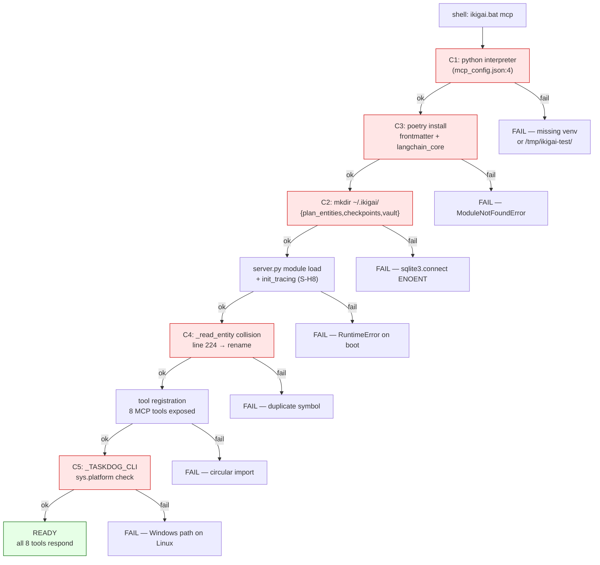
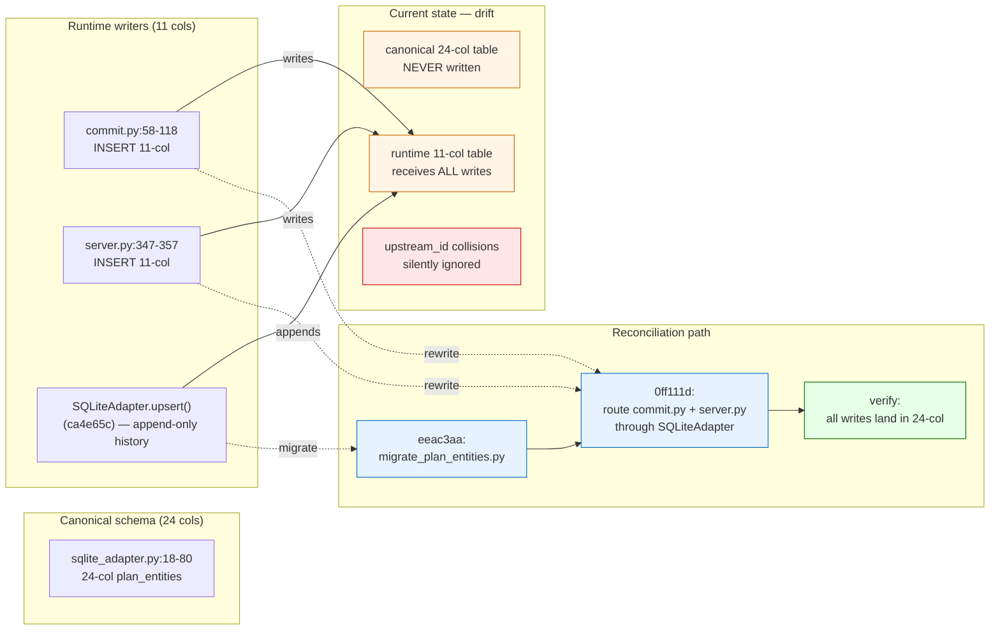
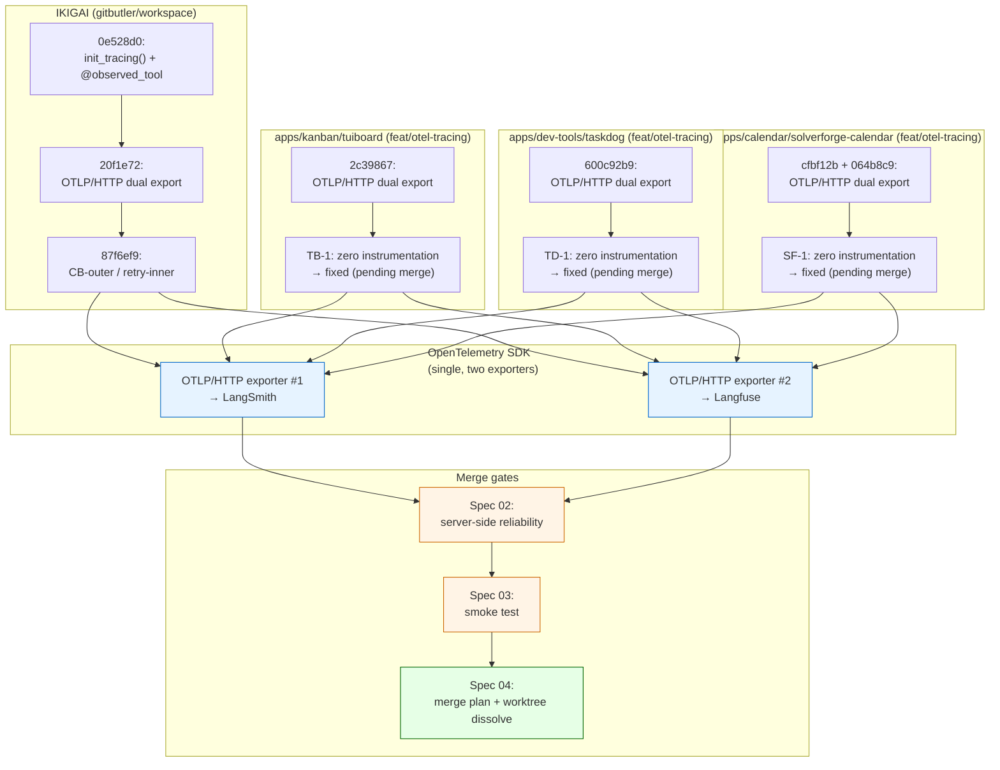
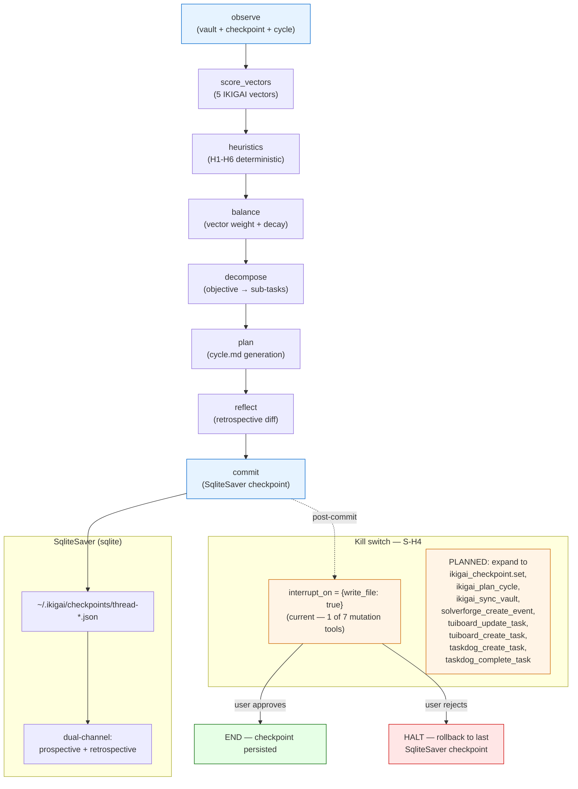

# Architecture Diagrams — 5 Critical Paths

> **Date:** 2026-08-27
> **Author:** Architecture (Claude Code session 44aa707a)
> **Status:** Draft — append-only visualization companion to `2026-08-27-master-system-diagnostic.md`
> **Scope:** Six Mermaid diagrams (5 critical paths + 1 bonus) covering IKIGAI boot, schema reconciliation, PAV CLI restoration, MCP convergence, observability stack, and the IKIGAI maintainer LangGraph.

---

## 0. Purpose

The Algorithmic Life OS has 77 catalogued issues across 5 subsystems (master diagnostic, 2026-08-27). The five critical paths below are the **load-bearing sequences** whose failure or restoration gates everything else: if path 1 fails, the system won't boot; if path 2 fails, data drifts permanently; if path 3 fails, the PAV kernel is unreachable; if path 4 fails, three external servers stay disconnected from IKIGAI; if path 5 fails, observability is blind across four repos. A sixth bonus diagram shows the IKIGAI maintainer LangGraph with its kill switch — the agentic heart of the system.

Each diagram includes:
- **Title + purpose** (what this path is for)
- **Mermaid source** (`graph TD` for hierarchical flows, `graph LR` for lateral ones)
- **Interpretation paragraph** (what to read off the diagram)

---

## 1. Diagram 1 — IKIGAI Boot Path (C1 → C5)

### 1.1 Description

IKIGAI's MCP server (`server.py`) currently fails to boot for 5 documented reasons (master diagnostic §1.1). The boot sequence flows: shell entry → Python interpreter resolution → package deps → filesystem bootstrap → in-process collision → subprocess platform check. Every node must succeed for `ikigai.bat mcp` to expose its 8 tools.

### 1.2 Mermaid Source



### 1.3 Interpretation

The diagram traces `ikigai.bat mcp` from shell entry through five sequential gates. Each gate is a separate critical-path blocker (C1 → C5) named in the master diagnostic §1.1; the red boxes highlight each gate's exit point. The recovery edges (`BX`, `CX`, `DX`, `EX`, `FX`, `GX`, `HX`) all converge to a single green terminal node (`READY`), which is reached only when all five gates succeed. The intended fix sequence (master diagnostic §7 P0) is C2 → C3 → C1 → C4 → C5; note the boot order in the diagram follows data dependencies (deps must load before filesystem state is touched).

---

## 2. Diagram 2 — Schema Split-Brain (S-C1) Reconciliation

### 2.1 Description

The canonical 24-column `plan_entities` schema (`sqlite_adapter.py:18-80`) is never written to. The runtime 11-column table (created by `commit.py:58-118` and `server.py:347-357`) receives every write. Two writers, two schemas, permanent drift. The reconciliation path unifies writers onto the canonical 24-col target via the `migrate_plan_entities.py` script (`eeac3aa`).

### 2.2 Mermaid Source



### 2.3 Interpretation

Two green clusters bracket the problem: `CANON` (the 24-col schema that *should* receive every write) and `RUNTIME` (the 11-col schema that *actually* does). Dashed orange boxes (`DRIFT`) show the three symptoms today — canonical table never written, runtime table overflowed, and content-addressed `upstream_id` keys silently collide because both tables share the same index namespace. The reconciliation path (blue nodes) follows three commits already shipped: `ca4e65c` adds `SQLiteAdapter.upsert()` with append-only history, `0ff111d` routes both `commit.py` and `server.py` through that adapter, and `eeac3aa` ships `migrate_plan_entities.py` for legacy 11-col databases. Green terminal is `verify: all writes land in 24-col`. Until M3 passes, every commit silently widens the split.

---

## 3. Diagram 3 — PAV CLI Restoration (P1) Dependencies

### 3.1 Description

Commit `604d6af` deleted `apps/cli/src/operational/cli/` and `apps/tui/src/operational/tui/`. Editable-install `.pth` files in `.venv/Lib/site-packages/` still point at the deleted paths, so `pav`, `pav-os`, `operational` console scripts all fail. This diagram shows the dependency graph that must be reconstructed to restore the CLI.

### 3.2 Mermaid Source

```mermaid
graph TD
    subgraph DELETED["Deleted in 604d6af"]
        D1["apps/cli/src/operational/cli/"]
        D2["apps/tui/src/operational/tui/"]
        D3["apps/cli theme tokens"]
        D4["dataset_selector"]
        D5["home_v2"]
    end

    subgraph STALE["Stale references"]
        S1[".pth → apps/cli/src<br/>(edit. install)"]
        S2["tests/unit/cli/*<br/>(import fails)"]
        S3["tests/tui/* + tests/ui/*<br/>(orphan — source gone)"]
    end

    subgraph CORE["Sole surviving workspace"]
        K1["packages/core/src/operational/<br/>(entities, core, parsers,<br/>reports, persistence, agents)"]
    end

    subgraph RESTORE["Restoration path"]
        R1["1. git checkout 604d6af^ -- apps/cli/src<br/>(recover deleted tree)"]
        R2["2. uv sync — regenerate editable-install .pth"]
        R3["3. pav --help smoke test"]
        R4["4. uv run pytest tests/unit/cli -v<br/>(baseline recovery)"]
        R5["5. Decide: restore TUI? or delete orphan tests?"]
    end

    subgraph BLOCKED["Blocked until restore"]
        B1["74 pytest files — collection errors"]
        B2["daily/weekly handlers calling<br/>python -m life.cli daily run"]
        B3["PAV TUI consumers"]
    end

    S1 -. .pth points to .-> D1
    S2 -. imports .-> D1
    S3 -. imports .-> D2
    K1 --> R1
    R1 --> R2 --> R3 --> R4 --> R5
    R5 -->|restore TUI| D2
    R5 -->|delete orphans| S3
    R4 -->|success| B1
    B1 -->|fixes| B2
    B1 -->|fixes| B3

    style D1 fill:#ffe6e6,stroke:#cc0000
    style D2 fill:#ffe6e6,stroke:#cc0000
    style S1 fill:#fff4e6,stroke:#cc6600
    style R5 fill:#e6f3ff,stroke:#0066cc
    style B1 fill:#fff4e6,stroke:#cc6600
```

### 3.3 Interpretation

The deletion cascade is shown in red on the left (5 entries in `DELETED`). The orange `STALE` cluster is where the damage lives today: `.pth` files pointing at deleted dirs, plus two test directories (`tests/tui/`, `tests/ui/`) whose source code no longer exists. The `CORE` cluster is what survives — `packages/core/src/operational/` is the only viable workspace member. Restoration flows left-to-right through 5 sequential blue nodes (R1 → R5); the key fork is at R5, where the choice is "restore TUI" (recover `apps/tui/src/operational/tui/`) versus "delete orphan tests" (`tests/tui/` + `tests/ui/`). The blocked downstream consumers (orange `BLOCKED`) — 74 pytest files, daily/weekly handlers, TUI consumers — all unblock once R4 (baseline test recovery) passes.

---

## 4. Diagram 4 — External MCP Convergence (3 repos → IKIGAI)

### 4.1 Description

Three external MCP servers (tuiboard / taskdog / solverforge-calendar) live in separate repositories and must converge onto IKIGAI's tool registry. Today the integration is inconsistent: stdio subprocess for tuiboard, CLI subprocess for taskdog, HTTP+SSE stub for solverforge. Standardization is the goal.

### 4.2 Mermaid Source

```mermaid
graph LR
    subgraph TUIBOARD["apps/kanban/tuiboard<br/>(TypeScript/Bun)"]
        T1["5 tools:<br/>board.list, board.tasks.get/update/create/delete"]
        T2["integration: stdio MCP<br/>(tools.py:747)"]
        T3["TB-2: hand-rolled JSON-RPC"]
    end

    subgraph TASKDOG["apps/dev-tools/taskdog<br/>(Python FastMCP)"]
        K1["8 tools:<br/>taskdog_list/create/complete/archive/..."]
        K2["integration: CLI subprocess<br/>(tools.py:910)"]
        K3["TD-2: CLI truncation"]
    end

    subgraph SOLVERFORGE["apps/calendar/solverforge-calendar<br/>(Rust rmcp)"]
        F1["16 tools:<br/>calendars_*, projects_*, events_*,<br/>dependencies_*, google_sync, upi_*"]
        F2["integration: HTTP+SSE stub<br/>(SF-4: never enabled)"]
        F3["SF-2: calendar.db never seeded"]
    end

    subgraph IKIGAI["IKIGAI tool registry<br/>(src/agents/tools.py)"]
        I1["S-C3: standardize on stdio MCP"]
        I2["29 tools total<br/>(5+8+16) post-convergence"]
        I3["S-H4: HITL gates on all<br/>create/update/complete/archive"]
    end

    T2 -->|stdio| I1
    K2 -. migrate .->|stdio| I1
    F2 -. enable .->|stdio or HTTP+SSE| I1
    I1 --> I2
    I2 --> I3

    style T2 fill:#fff4e6,stroke:#cc6600
    style K2 fill:#ffe6e6,stroke:#cc0000
    style F2 fill:#fff4e6,stroke:#cc6600
    style I1 fill:#e6f3ff,stroke:#0066cc
    style I2 fill:#e6ffe6,stroke:#006600
```

### 4.3 Interpretation

Three external MCP servers feed into IKIGAI's tool registry. Today (solid lines) only tuiboard uses stdio MCP; taskdog shells out via CLI subprocess (the worst path — see M1 truncation); solverforge has an HTTP+SSE transport built but never enabled. Dashed orange migration edges converge all three onto the IKIGAI stdio MCP standard (S-I1). Once converged, the registry exposes 29 unified tools (5+8+16) and every mutation tool falls under HITL gating per S-H4. Red `K2` is the worst offender — CLI truncation drops tasks with long descriptions. The whole diagram reduces to one standardization decision: pick stdio MCP for all three, gate mutations, retire the CLI subprocess path.

---

## 5. Diagram 5 — Observability Stack (4 repos + LangSmith + Langfuse)

### 5.1 Description

The observability sprint wires OpenTelemetry SDK with dual OTLP/HTTP exporters — one to LangSmith, one to Langfuse — across four repos: IKIGAI (already on `gitbutler/workspace`), tuiboard, taskdog, and solverforge-calendar. Each repo has a `feat/otel-tracing` branch with dual export wired; merges are gated by Spec 02 (server-side reliability) and Spec 03 (smoke test).

### 5.2 Mermaid Source



### 5.3 Interpretation

Four repos (one IKIGAI + three external MCP servers) each run their own OpenTelemetry SDK with dual OTLP/HTTP exporters — one to LangSmith, one to Langfuse. The `OTEL` cluster shows the shared export pattern: a single SDK initialized per process emits to both backends simultaneously. IKIGAI is furthest along (8 commits; `0e528d0` adds `init_tracing()` + `@observed_tool`; `87f6ef9` adds circuit-breaker-outer / retry-inner). The three external repos are at parity — each has a `feat/otel-tracing` branch with dual export wired (`2c39867`, `600c92b9`, `cfbf12b`+`064b8c9`) but merges are gated by three specs (orange `GATING`): Spec 02 (server-side reliability) must pass first, then Spec 03 (smoke test), then Spec 04 (merge plan + worktree dissolve). Green terminal `G3` is reached only when all three specs clear.

---

## 6. Diagram 6 (Bonus) — IKIGAI Maintainer LangGraph (8 nodes + kill switch)

### 6.1 Description

The IKIGAI maintainer graph (`vibe-ops/src/langgraph_entry.py:178`) is an 8-node pipeline: `observe → score_vectors → heuristics → balance → decompose → plan → reflect → commit`. It uses `SqliteSaver` checkpointing and runs dual-channel (prospective + retrospective) with H1–H6 deterministic heuristics. The kill switch is the singleton `interrupt_on = {"write_file": True}` gate (S-H4) plus the planned expansion to gate 6 mutation tools.

### 6.2 Mermaid Source



### 6.3 Interpretation

The 8-node IKIGAI maintainer pipeline flows top-down from `observe` (which reads vault, checkpoint, and current cycle) through `score_vectors` (computes the 5 IKIGAI vectors), `heuristics` (applies H1–H6 deterministic rules), `balance` (vector weights + decay), `decompose` (objective → sub-tasks), `plan` (generates `cycle.md`), `reflect` (retrospective diff against prior cycle), and finally `commit` (persists to `SqliteSaver`). Checkpointing uses dual-channel (prospective + retrospective) for replay safety. The kill switch (`KILL` cluster) is the human-in-the-loop gate: today it only intercepts `write_file` (1 of 7 mutation tools — `K1`); the planned expansion (`K2`) gates 8 mutation tools including `ikigai_checkpoint.set`, `ikigai_plan_cycle`, and the create/update/complete tools across all three external MCP servers. Rejection routes to `HALT`, rolling back to the last `SqliteSaver` checkpoint — that's why dual-channel storage matters.

---

## 7. Cross-References

| Diagram | Master diagnostic section | Issue IDs covered |
|---------|--------------------------|-------------------|
| §1 IKIGAI boot path | §1.1 CRITICAL | C1, C2, C3, C4, C5 |
| §2 Schema split-brain | §2.1 CRITICAL | S-C1 |
| §3 PAV CLI restoration | §3 + `604d6af` history | P1, P2 |
| §4 External MCP convergence | §4 + §2.1 S-C3 | TB-1..6, TD-1..6, SF-1..6 |
| §5 Observability stack | Sprint status + §2.1 S-H8 | TB-1, TD-1, SF-1 + Spec 02/03/04 |
| §6 IKIGAI maintainer LangGraph | §2.1 S-H4, S-H5 | S-H4, S-H5, dual-channel design |

**Related diagnostics:**
- `code-docs/diagnostic/2026-08-27-master-system-diagnostic.md` — full 77-issue catalog
- `code-docs/diagnostic/2026-08-27-issue-dependencies.md` — sequencing + blocking graph
- `code-docs/diagnostic/2026-08-27-migration-scripts-catalog.md` — `migrate_plan_entities.py` details
- `code-docs/diagnostic/2026-08-27-risk-effort-matrix.md` — effort estimates per path

**Append-only rule:** Add new diagrams when a new critical path emerges; never edit existing diagrams retroactively. If a path changes (e.g., merge lands, schema migrates), append a new diagram with the updated state.

---

*Architecture Diagrams — v1.0 — 2026-08-27 — diagnostic + planning only, no code changes this turn*