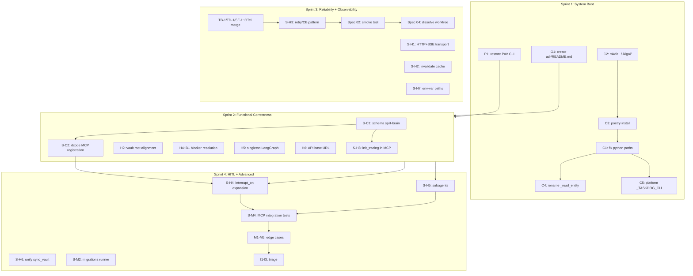

# Issue Dependencies & Sprint Plan — 2026-08-27

> **Companion doc** to `2026-08-27-master-system-diagnostic.md`. Maps every
> issue's blockers and dependents, then sequences 4 sprints to clear the
> critical + high buckets.
>
> **Status:** 🟡 Draft — diagnostic + planning only, no code changes

---

## 1. Dependency Notation

| Symbol | Meaning |
|--------|---------|
| `→` | Blocks (must be fixed first) |
| `⇉` | Soft dependency (parallelizable with coordination) |
| `⟂` | Independent (parallelizable freely) |
| `⊕` | Co-fix (same PR/commit, atomic) |

---

## 2. Critical Path — Schema Split-Brain (S-C1)

The longest dependency chain in the system. S-C1 transitively blocks 6 other issues.

```
[Schema split-brain — S-C1] (root)
   │
   ├──→ [S-M2: migrations runner]
   │       └──→ [S-M7: ikigai_score fallback table] (depends on C4)
   │
   ├──→ [I3: _read_entity fallback] (depends on C4)
   │       └──→ [S-M7]
   │
   ├──→ [S-C2: dcode MCP registration]
   │       └──→ [S-H4: interrupt_on expansion]
   │              └──→ [S-H5: subagents decomposition]
   │
   └──→ [S-H8: init_tracing() in MCP server module]
           └──→ [D1: @observed_tool decorator wrapping]
```

**Implication:** S-C1 + C4 are the root of multiple chains. Fixing them unblocks 6+ downstream issues.

---

## 3. Critical Path — PAV CLI Restoration (P1)

```
[Restore apps/cli/ — P1] (root, recovery branch)
   │
   ├──→ [P2: orphan test dirs cleanup]
   │       └──→ [P7: stray 0-byte files cleanup]
   │
   ├──→ [P3: _PersistentRepo path]
   │       └──→ [P4: ikigai.bat venv path]
   │              └──→ [P5: verify_sprint.sh wrapper]
   │
   └──→ [P6: Makefile uv vs poetry]
           └──→ [P8: dual CLAUDE.md scope]
```

**Implication:** P1 unblocks the entire test suite. Without P1, no `uv run pytest` succeeds.

---

## 4. Critical Path — IKIGAI Backend Boot (C1-C5)

```
[C2: mkdir ~/.ikigai/] ──→ [C3: poetry install] ──→ [C1: fix mcp_config.json paths]
                                                              │
                                                              ├──→ [C4: rename _read_entity]
                                                              │       └──→ [I3]
                                                              │
                                                              └──→ [C5: platform-aware _TASKDOG_CLI]
                                                                      └──→ [H1: tuiboard path]
                                                                              └──→ [M5: SOLVERFORGE_ROOT WSL2]
```

**Implication:** C2 → C3 → C1 is the boot sequence (3 sequential fixes). C4 + C5 are parallel after C1.

---

## 5. External MCP Server Convergence

```
[TB-1: tuiboard OTel] ──→ [S-H3: retry/CB pattern]
[TD-1: taskdog OTel]  ──→ [S-H3]            ──→ [Observability sprint merge — Spec 03]
[SF-1: solverforge OTel] ──→ [S-H3]
                                       │
                                       └──→ [Spec 02: integration smoke test]
                                                └──→ [Spec 04: dissolve worktree]
```

**Implication:** The 3 OTel branches merge in dependency order per Spec 03 (merge plan).

---

## 6. Full Dependency Table (subset)

| Issue | Blocks | Blocked by |
|-------|--------|------------|
| **C2** mkdir `~/.ikigai/` | C3, H2, H4 | none |
| **C3** `poetry install` | C1, H6 | C2 |
| **C1** fix python paths | C4, C5, H2, H4, H5, H6 | C2, C3 |
| **C4** rename `_read_entity` | I3, S-M7, H5 | C1 |
| **C5** platform `_TASKDOG_CLI` | H1, M1, M2 | C1 |
| **P1** restore PAV CLI | P2, P3, P4, P5, P6, P8 | none |
| **S-C1** schema split-brain | S-M2, S-C2, S-H8, D1 | none |
| **S-C2** dcode MCP registration | S-H4 | S-C1 (recommended) |
| **G2** vector count decision | none (cross-cutting) | none |
| **TB-1/TD-1/SF-1** OTel | S-H3, Spec 02, Spec 04 | Spec 03 merge order |

---

## 7. Sprint Plan — 4 sprints, 6 weeks

### Sprint 1 — "System Boot" (Week 1, 5 working days)

**Goal:** All C-severity issues closed. PAV CLI restored. Schema split-brain reconciled.

**Days 1-2:**
- C2 mkdir + bootstrap dirs (Task #12)
- C3 `poetry install` + commit `poetry.lock` (Task #12)
- C1 fix mcp_config.json + start_mcp_gateway.sh paths (Task #12)
- G1 create `code-docs/adr/README.md`

**Days 3-4:**
- C4 rename `_read_entity` (Task #12)
- C5 platform-aware `_TASKDOG_CLI` (Task #12)
- P1 restore PAV CLI from pre-`604d6af` snapshot
- P2 orphan test dirs cleanup

**Day 5:**
- Verification: `ikigai.bat mcp` boots; `uv run pytest` runs; all C-issues closed
- Update `docs/.sdd-progress.md`

**Sprint 1 deliverables:** 7 issues closed (5 C + P1 + P2 + G1)

---

### Sprint 2 — "Functional Correctness" (Week 2, 5 days)

**Goal:** All H-severity issues closed. Schema split-brain resolved.

**Days 1-2:**
- S-C1 schema reconciliation (canonical 24-col → all writers)
- S-C2 dcode MCP registration
- S-C3 taskdog via MCP (deprecate CLI subprocess)

**Days 3-4:**
- H2 vault root alignment (Task #13)
- H4 B1 blocker resolution (Task #13)
- H5 singleton LangGraph (Task #13)
- H6 API base URL verification (Task #13)
- S-H8 `init_tracing()` in MCP server module

**Day 5:**
- P3 `_PersistentRepo` path
- P4 `ikigai.bat` venv path env-var
- Verification: all 8 MCP tools work; dcode can call IKIGAI

**Sprint 2 deliverables:** 10+ issues closed (6 H + 3 S-C + P3 + P4)

---

### Sprint 3 — "Reliability + Observability" (Weeks 3-4, 10 days)

**Goal:** Merge OTel feature branches from 3 repos. Add retry/CB. Spec 04 cleanup.

**Days 1-3:**
- TB-1, TD-1, SF-1: merge OTel branches per Spec 03
- S-H1 HTTP+SSE transport for IKIGAI MCP
- S-H2 invalidate `_MCP_SESSION_CACHE` on error

**Days 4-6:**
- S-H3 retry/CB pattern (Spec 01 implementation)
- S-H7 env-var override for hard-coded paths

**Days 7-9:**
- Spec 02 integration smoke test
- Spec 04 dissolve worktree

**Day 10:**
- P5 verify_sprint.sh wrapper
- P6 Makefile uv target
- Verification: all OTel spans flow to LangSmith + Langfuse

**Sprint 3 deliverables:** 11+ issues closed (3 OTel + S-H1..3.7 + Spec 02/04 + P5 + P6)

---

### Sprint 4 — "HITL + Advanced" (Weeks 5-6, 10 days)

**Goal:** Subagent decomposition. HITL on mutation tools. Test coverage.

**Days 1-3:**
- S-H4 `interrupt_on` expansion (gate 6+ mutation tools)
- S-H5 subagents decomposition
- S-H6 unify `ikigai_sync_vault` destinations

**Days 4-6:**
- S-M2 schema migrations runner
- S-M4 MCP integration tests (mock + real)
- S-M5 Pydantic factories for tests
- S-M6 mock backends for MCP servers in tests

**Days 7-9:**
- M1 taskdog tag truncation (Task #14)
- M3 grep-based JSON-RPC test replacement (Task #14)
- M4 tuiboard empty configPath (Task #14)
- M5 SOLVERFORGE_ROOT WSL2 path (Task #14)
- I1, I2, I3 triage (Task #15)
- G2 vector count reconciliation (user decision)

**Day 10:**
- P7 stray 0-byte files cleanup
- P8 dual CLAUDE.md scope clarification
- G3-G10 documentation + cleanup
- Verification: full test suite green; all medium+info issues closed

**Sprint 4 deliverables:** 20+ issues closed (S-H4..6, S-M2..7, M1..5, I1..3, G2, P7+P8, G3-G10)

---

## 8. Critical Path Visualization (Mermaid)



---

## 9. Parallel Work Opportunities

| Window | Parallel tracks | Independence |
|--------|-----------------|--------------|
| Sprint 1 day 1-2 | (C2 + C3 + G1) ⟂ (P1 prep — git history checkout) | ⟂ fully |
| Sprint 2 day 3 | (H2 + H4) ⟂ (H5 + H6) ⟂ (S-H8) | ⟂ fully |
| Sprint 3 day 4-6 | TB-1 merge ⟂ TD-1 merge ⟂ SF-1 merge | ⇉ after Spec 03 |
| Sprint 4 day 1-3 | (S-H4) ⟂ (S-H5) ⟂ (S-H6) | ⟂ fully |
| Sprint 4 day 7-9 | (M1-M5) ⟂ (I1-I3) ⟂ (P7+G3-G10) | ⟂ fully |

**Throughput target:** 30+ issues closed in 6 weeks with 2-3 parallel engineers.

---

## 10. Sprint Exit Criteria

Each sprint MUST satisfy before moving on:

- [ ] All issues targeted for that sprint have ✅ in the diagnostic doc
- [ ] `uv run pytest` passes for `life-ops/ikigai/`
- [ ] `uv run ruff check src/` passes
- [ ] `docs/.sdd-progress.md` updated with sprint results
- [ ] If sprint introduces new issues, they are appended to the diagnostic
- [ ] If sprint needs cross-cutting decisions, they are escalated to user

---

*Dependency + Sprint Plan — v1.0 — 2026-08-27*
