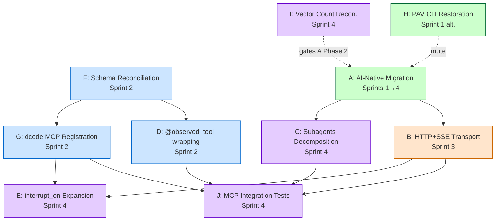

> **[SUPERSEDED 2026-08-28 — see master-branch-carro-chefe-2026-08-28]**
> Detailed expansion of 10 mini-specs for the pre-pivot PAV/IKIGAI sprint.
> Most constructions are deferred per ADR-007 (5+ SONHO logs gate) and the
> post-pivot reframing. See doc-migration plan for current state.

# Pending Constructions Detail (A-J)

**Date:** 2026-08-27
**Source:** `code-docs/diagnostic/2026-08-27-master-system-diagnostic.md` §6, `code-docs/diagnostic/2026-08-27-issue-dependencies.md`, `code-docs/adr/ADR-008..011`, `docs/superpowers/specs/2026-08-26-ai-native-strategic-model.md`
**Status:** Detailed expansion of the 10 mini-specs; ready for sprint grooming
**Author:** Matheus Mendes + Claude (superpowers-driven sprint planning)

---

## §0 — Sumário

Ten constructions (A-J) derived from the master system diagnostic. Each is sized for 1 engineer
working 4 days/week with the goal of closing all gaps across Sprints 1-4 (~6 weeks total,
2-3 engineers parallel).

| ID  | Title                                                | Effort (eng-days) | Risk | Sprint | Mutex |
|-----|------------------------------------------------------|--------------------|------|--------|-------|
| A   | AI-Native Strategic Model Migration                  | 32                 | 7/10 | 1 → 4  | ⊕ H   |
| B   | HTTP+SSE Transport for IKIGAI MCP                    | 5                  | 4/10 | 3      | —     |
| C   | Subagents Decomposition                              | 12                 | 6/10 | 4      | —     |
| D   | `@observed_tool` Decorator Wrapping (18 tools)       | 2                  | 2/10 | 2      | —     |
| E   | `interrupt_on` Expansion (Gate 6+ Mutation Tools)    | 5                  | 5/10 | 4      | —     |
| F   | Schema Split-Brain Reconciliation                    | 10                 | 7/10 | 2      | —     |
| G   | dcode MCP Registration                               | 1                  | 2/10 | 2      | —     |
| H   | PAV CLI Restoration (post-`604d6af`)                 | 5                  | 6/10 | 1 (alt)| ⊕ A   |
| I   | Vector Count Reconciliation (5 vs 4 — ADR-008)      | 1                  | 4/10 | 4      | —     |
| J   | MCP Integration Tests (Mock + Real Servers)          | 5                  | 3/10 | 4      | —     |

**Total:** ~78 engineer-days across 4 sprints. **Highest-risk path:** F → G → E (data schema →
registration → UX gating). **Quickest wins (≤2 days):** D, G, I — gated only by upstream
decisions (D needs S-H8; G needs F; I needs user decision).

**Mutex note:** A and H are mutually exclusive. If the user adopts the AI-native strategic
model (per `2026-08-26-ai-native-strategic-model.md` Phase 0), A proceeds and H is skipped;
otherwise H restores PAV CLI in Sprint 1.

---

## §1 — Construction A: AI-Native Strategic Model Migration

**Title:** PAV TUI/CLI deprecation → contract-first workspace with deepagents harness

**Description:** Invert the architecture: delete `life-ops/operational/apps/` (PAV Typer CLI +
Textual TUI, commit `604d6af`) as a clean deletion, retain `packages/core/` as pure logic, and
build `life-ops/ikigai/src/agents/ikigai_maintainer/` (LangGraph with 8 nodes: observe, plan,
reflect, balance, score_vectors, apply_heuristics, decompose, commit) plus
`ikigai_maintainer_mcp/` (8 MCP tools over stdio + HTTP+SSE). External apps (Claude Code, dcode,
Obsidian, solverforge) become the eyes/hands/voice; the workspace becomes contracts + logic +
data. Mirrors `docs/superpowers/specs/2026-08-26-ai-native-strategic-model.md` Phases 0-5.

**Files affected (est.):** ~85 (apps/ deletion ≈ 30 files; ikigai_maintainer ≈ 15 new;
ikigai_maintainer_mcp ≈ 8 new; deepagents_harness ≈ 3 new; langgraph_entry updates ≈ 4; tests
≈ 15; CI/docs ≈ 10).

**Dependencies:** Blocks H (PAV CLI restoration is moot post-deletion — A supersedes it);
enables B (HTTP+SSE is required by deepagents integration); enables C (subagents are part of the
new harness); orthogonal to F, G, I, J. ADR-009 (Pydantic strictness) gates entity conversion
in ikigai_maintainer.

**Acceptance criteria:**
- `life-ops/operational/apps/` deleted; `pav`, `pav-os`, `operational` console scripts removed
  from `pyproject.toml`; CI no longer references PAV.
- `ikigai_maintainer` LangGraph builds + checkpointed run produces valid `IKIGAiStateDict`
  end-to-end.
- `ikigai_maintainer-mcp` exposes all 8 tools over both transports; `tools/list` returns
  non-empty.
- `deepagents_harness.py` invokes `create_deep_agent()` with the 8 tools + sqlite memory.
- `langgraph.json` registers `ikigai` graph; `langgraph dev` boots clean.

**Effort:** 32 engineer-days (8 weeks × 4 days). **Risk:** 7/10 (large blast radius; deleted UI
cannot be fully recovered from git without restoring CLAUDE.md inconsistencies). **Sprint:**
Sprint 1 (Phases 0-1) → Sprint 4 (Phases 2-5).

---

## §2 — Construction B: HTTP+SSE Transport for IKIGAI MCP

**Title:** Add HTTP+SSE transport alongside stdio for the IKIGAI MCP server

**Description:** Branch `server.py:534 main()` on `IKIGAI_MCP_TRANSPORT` env var (`stdio`
default; `http` → FastAPI + `mcp.server.sse.SseServerTransport` bound to `127.0.0.1:3737`).
Adds lifecycle hooks (SIGTERM drain), optional bearer-token auth (`IKIGAI_MCP_AUTH_TOKEN`),
and parametrized tests over both transports. Authoritative record: ADR-011.

**Files affected (est.):** ~12 (server.py branching; new `sse_transport.py`; starlette app
wiring; 4-5 new integration tests; IKIGAI README + ARCHITECTURE_INDEX.md updates; `ikigai.bat`/
`start_mcp_gateway.sh` env awareness).

**Dependencies:** Requires A Phase 2 (the new `ikigai_maintainer_mcp` package is the canonical
home for the branch) **or** backport into legacy `src/mcp_server/server.py` if A is deferred;
blocked by C2/C3 (IKIGAI must boot); unblocks deepagents LangGraph + dcode MCP registration
over HTTP. Required by Observability Sprint Spec 03 (OTel span flow benefits from streaming).

**Acceptance criteria:**
- `IKIGAI_MCP_TRANSPORT=stdio ikigai.bat mcp` → unchanged behavior.
- `IKIGAI_MCP_TRANSPORT=http ikigai.bat mcp` → server binds `127.0.0.1:3737`; `curl -X POST
  http://127.0.0.1:3737/sse -d '{"jsonrpc":"2.0","method":"tools/list","id":1}'` returns 8 tools.
- SIGTERM drains in-flight requests within 5 s.
- Auth middleware rejects requests without token when `IKIGAI_MCP_AUTH_TOKEN` is set.
- Test matrix covers both transports with identical fixtures.

**Effort:** 5 engineer-days (1 week). **Risk:** 4/10 (additive, env-gated, reversible by
flipping default; new attack surface mitigated by 127.0.0.1 bind). **Sprint:** Sprint 3.

---

## §3 — Construction C: Subagents Decomposition

**Title:** Split monolithic deepagent into planner / executor / observer / reflector subagents

**Description:** Replace the single `deepagents_harness.py` agent (master diagnostic S-H5) with
a coordinator that dispatches to four specialized subagents. Planner produces prospective
actions for the active tier; Executor mutates state via MCP tools gated by `interrupt_on`
(Construction E); Observer ingests vault/SQLite/telemetry and produces `CorrectionSignal`s;
Reflector aggregates retrospective logs into regime/phase deltas. Each subagent has its own
system prompt, scoped tool list, and `SqliteSaver` namespace.

**Files affected (est.):** ~22 (4 × `subagent.py`; coordinator wiring in `deepagents_harness.py`;
state-extension for cross-agent handoff dict; 8 new subagent-specific tests; 4 system-prompt
files in `prompts/`; registry additions).

**Dependencies:** Hard-blocked by A (subagents live inside the new harness); requires E to gate
executor mutations; requires D so all subagent tool calls emit OTel spans; benefits from B
(HTTP+SSE allows parallel subagent invocation).

**Acceptance criteria:**
- Coordinator dispatches a single cycle (observe → plan → balance → reflect) by invoking the 4
  subagents in sequence.
- Each subagent's tool list is enforced (planner cannot call mutation tools; executor cannot
  read raw vault files).
- Cross-agent handoff dict persists in shared `SqliteSaver` namespace; cycle completes
  idempotently.
- OTel trace shows 4 child spans per cycle, each labeled with subagent name.
- Unit tests assert each subagent refuses out-of-scope tool calls.

**Effort:** 12 engineer-days (3 weeks). **Risk:** 6/10 (architectural change inside the new
harness; reversible by falling back to monolithic harness; risk that subagent coordination adds
latency vs. gains in modularity). **Sprint:** Sprint 4.

---

## §4 — Construction D: `@observed_tool` Decorator Wrapping

**Title:** Apply the observability-sprint decorator to every production MCP tool

**Description:** Decorate all 18 production tools in `src/agents/tools.py` with `@observed_tool`
(introduced in observability sprint commit `0e528d0`). Spans flow to LangSmith + Langfuse when
`OTEL_ENABLED=true`. Each decorator captures tool name, args hash, latency, return-type
fingerprint, and trace correlation id. Mirrors `src/agents/tools.py:550` cache invalidation
pattern for span lifecycle.

**Files affected (est.):** ~3 (single decorator import + 18 decorator applications; one new test
file asserting all tools emit spans; one new CI check that fails if a new tool lacks the
decorator).

**Dependencies:** Requires S-H8 (MCP server must call `init_tracing()` at module load — master
diagnostic §2.2); benefits from F (canonical schema so tool args/returns are uniform); depends
on A if the tools move into `ikigai_maintainer_mcp`.

**Acceptance criteria:**
- All 18 tools emit an OpenTelemetry span when invoked; spans visible in LangSmith + Langfuse
  when `OTEL_ENABLED=true`.
- Span attributes include: tool name, args SHA-256, latency ms, return-type schema name,
  trace_id, parent_span_id (when nested).
- New tool added without decorator → CI fails via `scripts/check-observed-tools.py`.
- Existing tools in tests still pass; no behavior change observable from tool consumers.

**Effort:** 2 engineer-days. **Risk:** 2/10 (purely additive; no schema or behavior change;
decorator is in-tree since `0e528d0`). **Sprint:** Sprint 2.

---

## §5 — Construction E: `interrupt_on` Expansion

**Title:** Extend deepagents HITL gating from 1 tool to all mutation tools

**Description:** Expand `deepagents_harness.py`'s `interrupt_on` config (currently
`{"write_file": True}` only — master diagnostic S-H4) to gate every tool that mutates persistent
state. Target set: `ikigai_checkpoint(set)`, `ikigai_plan_cycle`, `ikigai_sync_vault`,
`solverforge_create_event`, `tuiboard_update_task`, `tuiboard_create_task`, `taskdog_create_task`,
`taskdog_complete_task` (6+ tools). Each gate requires explicit user approval before the
mutation executes; the approval UI surfaces tool name, args diff, and last-3 audit-log entries.

**Files affected (est.):** ~8 (deepagents_harness.py config block; one new
`mutation_registry.py`; 4 new tests asserting each mutation tool triggers interrupt; UI
affordance for approval surface; docs).

**Dependencies:** Requires G (dcode MCP registration) so the user is connected to the IKIGAI
MCP server where approval flows back; benefits from C (executor subagent enforces gates
cleanly); requires B if HTTP+SSE is the transport carrying interrupt payloads.

**Acceptance criteria:**
- Invoking any of the 8 listed tools returns an interrupt payload (not the mutation result).
- Approval flow surfaces tool name + args + last-3 audit-log entries.
- Rejection flow aborts the mutation and returns a structured error; state is unchanged.
- Test matrix: 8 tools × {approve, reject} = 16 cases; each passes.
- New mutation tool added to registry → fails fast at startup if not added to `interrupt_on`.

**Effort:** 5 engineer-days (1 week). **Risk:** 5/10 (changes user-facing UX — every mutation
becomes a 2-step flow; risk of friction; risk of bypass via direct MCP call). **Sprint:**
Sprint 4.

---

## §6 — Construction F: Schema Split-Brain Reconciliation

**Title:** Single canonical writer for the 24-col `plan_entities` table

**Description:** The canonical 24-col schema in `sqlite_adapter.py:18-80` is never written to;
every commit writes the runtime 11-col table (`commit.py:58-118`, `server.py:347-357`). Drift is
permanent (master diagnostic S-C1). Migrate every runtime writer to the canonical 24-col schema;
introduce a single writer path through `SQLiteAdapter.upsert()` (introduced in `ca4e65c`); add a
schema-version column + migration runner (master diagnostic S-M2). Append-only history
preserved (per commit `ca4e65c`).

**Files affected (est.):** ~20 (sqlite_adapter.py schema update; commit.py rewrite; server.py
writer unification; migration runner `scripts/migrate_plan_entities.py` (exists per `eeac3aa`,
expand); ~10 test updates; CI check for schema-version drift).

**Dependencies:** Root blocker for many chains (per `2026-08-27-issue-dependencies.md` §2 — S-C1
unblocks S-M2, I3, S-C2, S-H8, D); unblocks G (dcode registration is cleaner with one schema);
unblocks D (uniform args/returns); **must close before A Phase 2** if the new harness writes
plan_entities.

**Acceptance criteria:**
- `plan_entities` table has exactly 24 columns matching `sqlite_adapter.py:18-80`; runtime
  11-col table is removed.
- All writers (`commit.py`, `server.py`, `ikigai_sync_vault`, future harness) go through
  `SQLiteAdapter.upsert()`.
- Migration script runs idempotently; legacy DBs upgrade without data loss.
- Append-only history preserved: every prior row readable post-migration.
- CI check fails if a new writer bypasses `SQLiteAdapter`.

**Effort:** 10 engineer-days (2 weeks). **Risk:** 7/10 (touches every commit path; data-loss
risk if migration script bugs; reversible until production cutover; affects S-M7 fallback table
too). **Sprint:** Sprint 2 (must precede G, D, and any A Phase 2+ work).

---

## §7 — Construction G: dcode MCP Registration

**Title:** Add `ikigai-maintainer-mcp` to `.mcp.json` so dcode can call IKIGAI tools

**Description:** Register `ikigai-maintainer-mcp` in the dcode config (`~/.claude/.mcp.json` or
project `.mcp.json`) so dcode's tool prefix resolution finds IKIGAI tools (master diagnostic
S-C2). Today, the only path to IKIGAI from dcode is `Bash → ikigai.bat agent|chat`, which
bypasses MCP entirely. After G, dcode can invoke `ikigai_score`, `ikigai_phase`, etc. as
first-class tools.

**Files affected (est.):** 3 (`.mcp.json` entry addition; one verification script; README update
documenting the dcode-side tool surface).

**Dependencies:** Requires F (clean writer path) for stable tool semantics; benefits from B
(HTTP+SSE for cross-process dcode connection); benefits from A (the `ikigai-maintainer-mcp`
from A Phase 2 is the canonical server to register); unblocks E (HITL gates can flow back
through dcode).

**Acceptance criteria:**
- `cat ~/.claude/.mcp.json | jq '.mcpServers | keys'` lists `ikigai-maintainer-mcp`.
- From dcode: invoking `ikigai_score` returns the 5-vector score (or 4, per ADR-008 outcome).
- Failure modes surfaced: missing server, auth failure, schema mismatch all return structured
  errors.
- Documented in dcode-side README + IKIGAI README.

**Effort:** 1 engineer-day. **Risk:** 2/10 (config change; reversible by removing the entry;
no schema/data risk). **Sprint:** Sprint 2 (quick win alongside F).

---

## §8 — Construction H: PAV CLI Restoration (post-`604d6af`)

**Title:** Restore PAV CLI from pre-`604d6af` snapshot

**Description:** `604d6af` deleted `apps/cli/src/operational/cli/`. Editable-install `.pth`
files in `.venv/Lib/site-packages/` still point at the deleted directory, so `pav`, `pav-os`,
`operational` all fail. Restore CLI from `git show 604d6af^:life-ops/operational/apps/cli/src/
operational/cli/` (or use `git checkout 604d6af^ -- apps/cli/`), recreate `.pth` files, verify
`tests/unit/cli/` pass. Master diagnostic P1.

**Files affected (est.):** ~15 (restored `apps/cli/src/operational/cli/`; `.pth` file fixes;
`pyproject.toml` workspace member re-addition; CI workflow re-addition; verify-sprint script;
tests).

**Dependencies:** **Mutually exclusive with A** — A deletes the PAV UI entirely (per
`2026-08-26-ai-native-strategic-model.md` Phase 0); restoring CLI is wasted work if A proceeds.
If user defers A, H is required to unblock the test suite (master diagnostic §3 critical path).

**Acceptance criteria:**
- `uv run pav --help` returns non-empty help; `pav home` and `pav tui` boot.
- `tests/unit/cli/` passes (74 pytest files, per CLAUDE.md).
- Editable-install `.pth` files point at restored paths.
- CI workflow includes PAV CLI smoke test.

**Effort:** 5 engineer-days (1 week). **Risk:** 6/10 if A proceeds (restored UI is immediately
re-deleted — wasted effort); 4/10 if A is deferred (recovery from git is mechanical).
**Sprint:** Sprint 1 **only if user defers A**; otherwise skip H entirely (A supersedes).

---

## §9 — Construction I: Vector Count Reconciliation

**Title:** Pick canonical IKIGAI vector count (5 with Course, or 4 without) and migrate

**Description:** Per ADR-008, root docs + `IKIGAiProfile` use 5 vectors (Passion/Skill/Market/
Revenue/Course); `vibe-ops/planning/PRD-07.md` and `vibe-ops/pipeline/ikigai_scorer.py` use 4.
Drift is concrete. Execute MIG-5 (Option A: add Course canonical, ~25 files; or Option B:
remove Course, ~25 files). Whichever chosen: align root docs, PRD-07, `IKIGAiProfile`,
`IKIGAiVectorEntity` enum, `ikigai_scorer` weight normalization, vault frontmatter, and tests.
Per ADR-007 (data-first), the right answer depends on which vector count appears in 5+ manual
logs.

**Files affected (est.):** ~25 (3 root docs + PRD-07 + 2 entity files + ~6 vault files + ~10
tests + scorer updates).

**Dependencies:** User decision required (ADR-008 status: Proposta); independent of A/B/C/D/E/F/G/H/J
(cross-cutting documentation/schema sync); should close before A Phase 2 if the new harness
hard-codes a vector count.

**Acceptance criteria:**
- User selects Option A (5 vectors) or Option B (4 vectors).
- MIG-5 runs idempotently; vault frontmatter backfilled or stripped per choice.
- `ikigai vector list --json | jq 'length'` returns 4 or 5.
- `grep -r "ikigai_vectors" data/matheus/ | awk -F'[][]' '{print $2}' | tr ',' '\n' | sort -u`
  shows uniform count.
- All tests pass; scorer weight normalization updated (4 → 5 or stays at 4).

**Effort:** 1 engineer-day (post-decision; the decision itself is the bottleneck).
**Risk:** 4/10 (Option A is additive; Option B is destructive for Course-tagged entries — data
loss possible; reversible until MIG-5 runs against production data). **Sprint:** Sprint 4.

---

## §10 — Construction J: MCP Integration Tests

**Title:** Add mock + real-server integration tests for the IKIGAI MCP tool surface

**Description:** Master diagnostic S-M4: zero MCP integration tests in IKIGAI today. Add
(a) mock-layer tests using `unittest.mock` to stub `_mcp_call_v1` / `_taskdog_run`;
(b) real-server tests that spawn `ikigai-maintainer-mcp`, `taskdog-mcp`, `tuiboard-mcp`,
`solverforge-calendar-mcp` as subprocesses and exercise JSON-RPC `tools/list` + `tools/call`
against each; (c) Pydantic factories (`make_goal()`, `make_dream()`, etc.) per S-M5 to cut test
boilerplate; (d) mock backends for the 3 external MCP servers per S-M6.

**Files affected (est.):** ~18 (3 test directories × ~5 tests each; 6 factory files; 3 mock
backend stubs; CI integration test target; README update).

**Dependencies:** Requires G (registration must work for real-server tests); benefits from B
(HTTP+SSE parametrize over transports); requires D (so tests can assert span emission);
orthogonal to A/C/E/F/H/I.

**Acceptance criteria:**
- Mock-layer tests: each of the 8 IKIGAI tools has a happy-path + 2 error-path unit tests.
- Real-server tests: subprocess-launched MCP server responds to `tools/list` within 2 s;
  `tools/call` round-trip on at least one tool per server.
- Pydantic factories reduce boilerplate: every test fixture uses `make_*()` helpers.
- CI matrix runs both mock + real-server suites; real-server tests are tagged `integration`
  and skipped without `--integration` flag.
- Coverage report shows ≥80% on `src/mcp_server/server.py` and `src/agents/tools.py`.

**Effort:** 5 engineer-days (1 week). **Risk:** 3/10 (additive; flakiness risk on real-server
tests mitigated by tagging + retries; no schema/data risk). **Sprint:** Sprint 4.

---

## §11 — Dependency Graph Between Constructions

**Notes on the graph:**
- `F` is the root blocker for the schema/registration chain (F → G → E). Sequencing F first
  means G and E ride a clean schema.
- `A` feeds `C` (subagents live inside the new harness) and `B` (HTTP+SSE is part of the
  contract-first architecture).
- `D` is parallel to `F`; both close in Sprint 2.
- `I` is independent (cross-cutting doc/schema sync) but should gate A Phase 2.
- `H ⊕ A` is mutually exclusive.

---

## §12 — Sequencing Recommendation

**Sprint 1 (Week 1):** A Phases 0-1 + H (if A deferred) + G1 + C2/C3/C1
- Begin AI-native migration (Phase 0: snapshot, Phase 1: harness scaffold).
- If user defers A: restore PAV CLI (H) to unblock test suite.
- Begin S-H8 (init_tracing wiring — feeds D).

**Sprint 2 (Week 2):** F + G + D + H2-H6 + S-H8
- F first (10 days); G + D parallel once F exits acceptance criteria.
- S-H8 closes (enables D's observability).
- H2-H6 (orthogonal reliability items) close alongside.

**Sprint 3 (Weeks 3-4):** B + S-H1/S-H2/S-H3 + OTel merges (TB-1/TD-1/SF-1) + Spec 02/04
- B (HTTP+SSE) — 5 days, single engineer.
- Observability-sprint merges from 4 worktrees converge per Spec 02/04.

**Sprint 4 (Weeks 5-6):** C + E + J + I (after user decision) + A Phases 2-5 + edge cases
- C (12 days), E (5 days), J (5 days) — 3 parallel engineers.
- I (1 day) once user picks Option A or B.
- A Phases 2-5 land alongside (32 days span Sprints 1-4).

**Highest-risk path:** **F → G → E** (data schema → registration → UX gating) carries compound
risk. Sequence F first, gate G+E on F's exit criteria. A pre-commit hook scanning for direct
`sqlite3` / `INSERT INTO plan_entities` calls (bypassing `SQLiteAdapter`) closes the bypass
vector.

**Quickest wins (≤2 days each):** D, G, I — all gated only by upstream decisions (D needs S-H8;
G needs F; I needs user).

**Parallelism:** 2-3 engineers; the F→G→E sequence is single-threaded; C, E, J in Sprint 4
can run in parallel after F+G close.

---

## §13 — Cross-References

**Source documents:**
- `code-docs/diagnostic/2026-08-27-master-system-diagnostic.md` — §2 (S-H8), §3 (P1 critical
  path), §6 (construction list), §8 (S-C1, S-C2, S-M2, S-M4, S-M5, S-M6, S-M7).
- `code-docs/diagnostic/2026-08-27-issue-dependencies.md` — §2 (chain analysis), §9
  (throughput target).
- `code-docs/adr/ADR-007` — Data-first methodology (SONHO ≥ 5 manual logs gating I).
- `code-docs/adr/ADR-008` — 5 vs 4 vector count (Proposta → awaiting decision).
- `code-docs/adr/ADR-009` — Pydantic strictness (gates A entity conversion).
- `code-docs/adr/ADR-010` — Schema version column (gates F migration runner).
- `code-docs/adr/ADR-011` — HTTP+SSE transport (authoritative record for B).
- `docs/superpowers/specs/2026-08-26-ai-native-strategic-model.md` — Phases 0-5 (A blueprint).
- `life-ops/ikigai/docs/observability/0{1..4}-*.md` — OTel specs (B, D, E inputs).

**Existing implementation touchpoints:**
- `commit.py:58-118` — runtime 11-col writer (F target).
- `sqlite_adapter.py:18-80` — canonical 24-col schema (F source of truth).
- `server.py:347-357` — server-side writer (F target).
- `commit.py:534 main()` — stdio branch point (B target).
- `src/agents/tools.py:550` — `@observed_tool` decorator / cache invalidation pattern (D model).
- `deepagents_harness.py` — monolithic agent (C source), `interrupt_on` block (E target).
- `vibe-ops/planning/PRD-07.md` — 4-vector scorer (I target).
- `IKIGAiProfile` — 5-vector entity (I target).

**Sprint artifacts (to be created during execution):**
- `code-docs/sprint/S1-plan.md` — Sprint 1 detailed plan.
- `code-docs/sprint/S2-plan.md` — Sprint 2 detailed plan.
- `code-docs/sprint/S3-plan.md` — Sprint 3 detailed plan.
- `code-docs/sprint/S4-plan.md` — Sprint 4 detailed plan.
- `code-docs/sprint/gantt.md` — cross-sprint timeline (Mermaid gantt).
- `code-docs/sprint/risk-register.md` — per-construction risk register (updated weekly).

**Linked external commitments:**
- IKIGAI observability sprint (4 worktrees → merges per Spec 02/03/04).
- 5+ SONHO manual logs required before I decision (per ADR-007 data-first).
- User decision on ADR-008 vector count (Proposta → Aceita/Rejeitada).

---

*Pending Constructions Detail — A-J — 2026-08-27*
