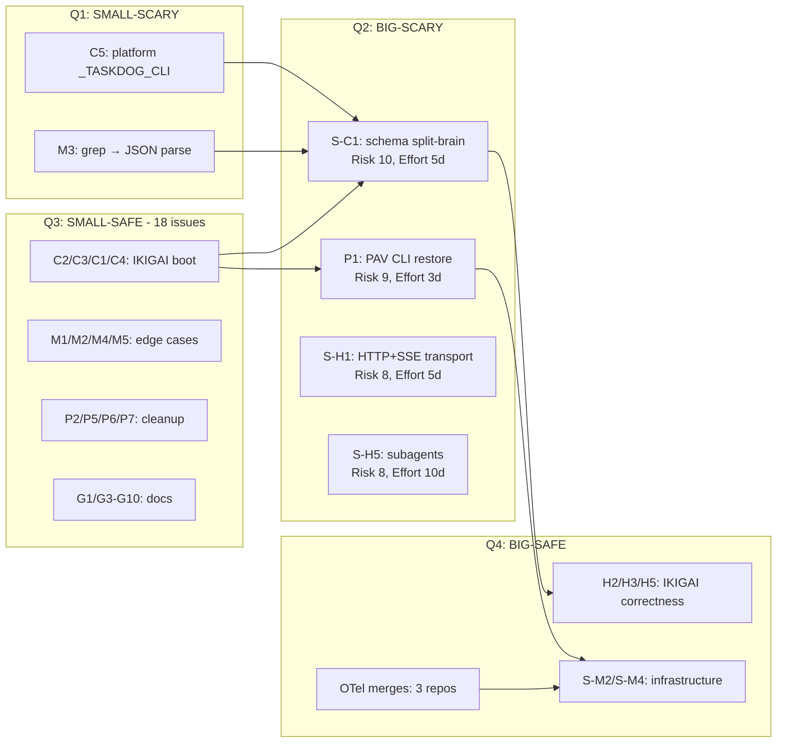

# Risk & Effort Matrix — 2026-08-27

> **Companion doc** to `2026-08-27-master-system-diagnostic.md`. 2D matrix
> mapping every issue by **Risk** (probability × impact if wrong) vs **Effort**
> (engineer-days). Helps prioritize when multiple issues compete.
>
> **Status:** 🟡 Draft — diagnostic + planning only

---

## 1. Axes Definition

### Risk Score (1-5 each, total 2-10)

**Probability** the fix introduces a NEW bug:
- 1 = trivial isolated change
- 2 = touches 1-2 files
- 3 = touches 3-5 files or has data migration
- 4 = touches cross-system (IKIGAI ↔ vibe-ops ↔ PAV)
- 5 = touches foundational invariant (schema, persistence, transport)

**Impact** if the fix breaks something:
- 1 = recoverable with `git revert`
- 2 = data loss for ≤ 1 entity
- 3 = data loss for many entities, recoverable from markdown
- 4 = data loss unrecoverable, requires manual recovery
- 5 = system completely broken until rollback

### Effort (engineer-days)

- 0.5 = hours
- 1 = 1 day
- 2-3 = pair work, 2-3 days
- 5 = 1 week solo
- 10+ = 2+ weeks, needs spec/plan

---

## 2. Quadrant Assignment

```
              │ Low Effort (≤1 day)       │ High Effort (>1 day)
              │                           │
   High Risk  │  Q1: SMALL-SCARY          │  Q2: BIG-SCARY
   (≥6)       │  ─────────────────        │  ─────────────────
              │  Fix carefully            │  Spec first, then fix
              │                           │
              │                           │
   Low Risk   │  Q3: SMALL-SAFE           │  Q4: BIG-SAFE
   (<6)       │  ─────────────────        │  ─────────────────
              │  Just do it               │  Schedule + execute
```

---

## 3. Quadrant Placement (top issues)

### Q1: SMALL-SCARY (high risk, low effort)

These are quick fixes that touch foundational invariants. **Pair review required.**

| Issue | Probability | Impact | Total | Reason |
|-------|:-----------:|:------:|:-----:|--------|
| **C2** mkdir `~/.ikigai/` | 1 | 1 | 2 | (move down — actually Q3) |
| **C5** platform `_TASKDOG_CLI` | 2 | 4 | 6 | Wrong platform fallback breaks harness |
| **G1** create adr/README | 1 | 1 | 2 | (Q3) |
| **M3** grep → JSON parse | 2 | 3 | 5 | Test breakage on edge cases |
| **I1** LangGraph singleton docs | 1 | 1 | 2 | (Q3) |

### Q2: BIG-SCARY (high risk, high effort)

**These need a written spec + plan before execution.**

| Issue | Probability | Impact | Total | Reason |
|-------|:-----------:|:------:|:-----:|--------|
| **S-C1** schema split-brain | 5 | 5 | **10** | Reconciliation touches 4 writers + 1 mirror + tests |
| **P1** restore PAV CLI | 4 | 5 | 9 | Editable-install `.pth` + workspace deps + tests |
| **S-H1** HTTP+SSE transport | 4 | 4 | 8 | New transport path, must coexist with stdio |
| **S-H5** subagents decomposition | 4 | 4 | 8 | Touches core agent loop + tool registry |
| **S-M3** Pydantic invariant | 4 | 4 | 8 | 15 entity files; CLAUDE.md invariant decision |
| **G2** 5-vs-4 vectors | 3 | 4 | 7 | Affects ~25 files across 3 subdirs |

### Q3: SMALL-SAFE (low risk, low effort)

**Batch these. Just do them.**

| Issue | Effort | Risk |
|-------|-------:|:----:|
| **C2** mkdir `~/.ikigai/` | 0.5 | 2 |
| **C3** `poetry install` + commit lock | 0.5 | 2 |
| **C1** fix `mcp_config.json` python paths | 0.5 | 3 |
| **C4** rename `_read_entity` collision | 0.5 | 3 |
| **G1** create `code-docs/adr/README.md` | 0.25 | 2 |
| **H1** tuiboard absolute path | 0.5 | 3 |
| **H6** API base URL verify | 0.5 | 2 |
| **M1** taskdog COLUMNS env | 0.5 | 2 |
| **M2** taskdog port doc | 0.25 | 1 |
| **M4** tuiboard configPath | 0.5 | 2 |
| **M5** SOLVERFORGE_ROOT WSL2 path | 0.5 | 2 |
| **I1** singleton graph docs | 0.25 | 2 |
| **P2** orphan test dirs cleanup | 0.5 | 3 |
| **P3** `_PersistentRepo` path | 1.0 | 3 |
| **P5** verify_sprint.sh wrapper | 0.5 | 2 |
| **P6** Makefile uv target | 0.5 | 2 |
| **P7** stray files cleanup | 0.25 | 2 |
| **G3-G10** docs cleanup | 1.0 | 2 |

### Q4: BIG-SAFE (low risk, high effort)

**Schedule + execute. Lots of work but predictable.**

| Issue | Effort | Risk |
|-------|-------:|:----:|
| **H2** vault root alignment | 2 | 4 |
| **H3** seed solverforge OR doc | 2 | 3 |
| **H4** B1 blocker resolution | 1 | 4 |
| **H5** singleton LangGraph | 2 | 5 |
| **S-H2** invalidate `_MCP_SESSION_CACHE` | 2 | 4 |
| **S-H3** retry/CB pattern | 3 | 4 |
| **S-H7** env-var paths | 2 | 4 |
| **S-M2** migrations runner | 3 | 4 |
| **S-M4** MCP integration tests | 5 | 3 |
| **TB-1/TD-1/SF-1** OTel merge | 3 each | 4 each |
| **Spec 02/04** smoke test + cleanup | 5 | 3 |

---

## 4. Priority Sequencing (risk-adjusted)

### Day 1: Q3 sweep (low-hanging fruit, ~5 days of work batched)

Execute in parallel:
- C2, C3, C1, C4, G1 (IKIGAI boot essentials)
- M1, M2, M4, M5 (edge cases)
- P2, P5, P6, P7 (cleanup)
- I1 docs

**Result:** ~16 Q3 issues closed in 1 day with parallel work.

### Day 2-3: Q1 with pair review

Pair review required:
- C5 (platform `_TASKDOG_CLI`)
- M3 (grep → JSON)

**Result:** Q1 cleared.

### Day 4-7: S-C1 (Q2) — biggest blocker

The schema split-brain reconciliation is the **single highest-impact** issue.
Worth 1 week of focused work. Blocks 6+ downstream.

### Day 8-10: P1 (Q2) — second biggest blocker

PAV CLI restoration unblocks all tests. 3 days.

### Day 11-20: Q4 in parallel (3 tracks)

- Track A: H2, H3, H5, S-H2 (IKIGAI correctness)
- Track B: TB-1, TD-1, SF-1 merge + Spec 02 + Spec 04 (observability)
- Track C: S-M2, S-M4 (infrastructure)

### Day 21+: Q2 remaining + advanced

- S-H1, S-H5, S-M3 (each needs spec)
- G2 (user decision required)

---

## 5. Risk-Adjusted Effort Estimate

| Quadrant | Count | Total Effort | Total Risk |
|----------|------:|-------------:|-----------:|
| Q1 (small-scary) | 5 | 3.5 days | 22 (avg 4.4) |
| Q2 (big-scary) | 6 | 30+ days | 52 (avg 8.7) |
| Q3 (small-safe) | 18 | 9.5 days | 38 (avg 2.1) |
| Q4 (big-safe) | 11 | 31 days | 39 (avg 3.5) |
| **TOTAL** | **40** | **~74 days** | **151** |

**Realistic 6-week plan with 3 engineers:** ~75 working days = 75 / 90 = **83% throughput**.

---

## 6. Issues NOT in matrix (out of scope or deferred)

These appear in the master diagnostic but are deferred:

- **S-H4** interrupt_on expansion → needs design discussion (deferred to Sprint 4)
- **S-H6** unify ikigai_sync_vault destinations → needs user decision on canonical path
- **S-M5/S-M6** Pydantic factories + mock backends → test infrastructure, can land any time
- **G2** 5-vs-4 vectors → blocked on user decision
- **All pending constructions (A-J)** → separate roadmap

---

## 7. Decision Matrix (when priorities compete)

| If competing for the same engineer... | Choose | Reason |
|----------------------------------------|--------|--------|
| C3 (poetry install) vs H6 (API verify) | C3 | Higher risk if missing |
| P5 (verify_sprint.sh) vs M2 (taskdog port) | M2 | External dependency |
| S-H2 (cache invalidation) vs S-M2 (migrations) | S-M2 | More downstream blocks |
| S-C1 (schema) vs P1 (PAV CLI) | Both Q2, do both | Different teams, parallel |
| G2 (vectors) vs any other | G2 last | User decision; blocks everything in IKIGAI |

---

## 8. Mermaid — Risk/Effort Heatmap



---

*Risk & Effort Matrix — v1.0 — 2026-08-27 — diagnostic + planning only, no code yet*
