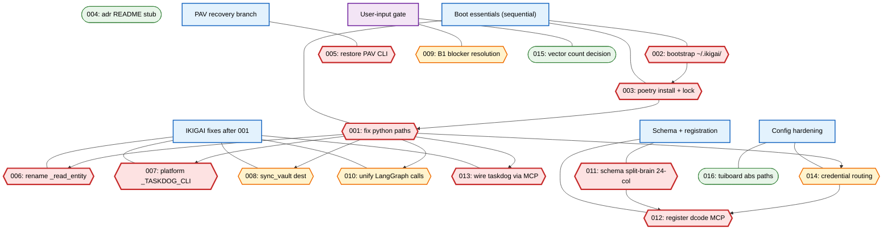
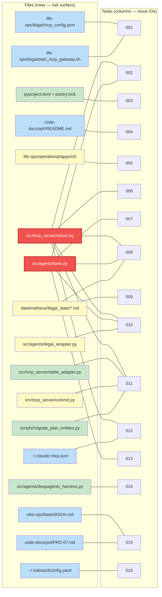
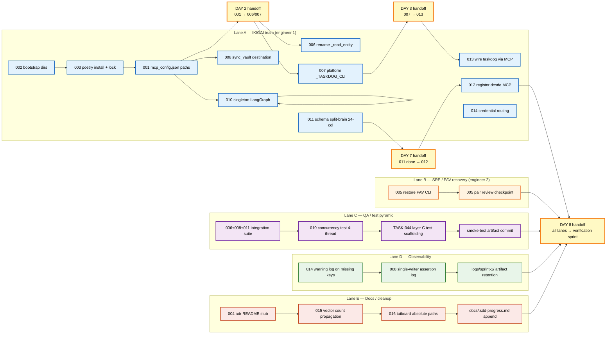
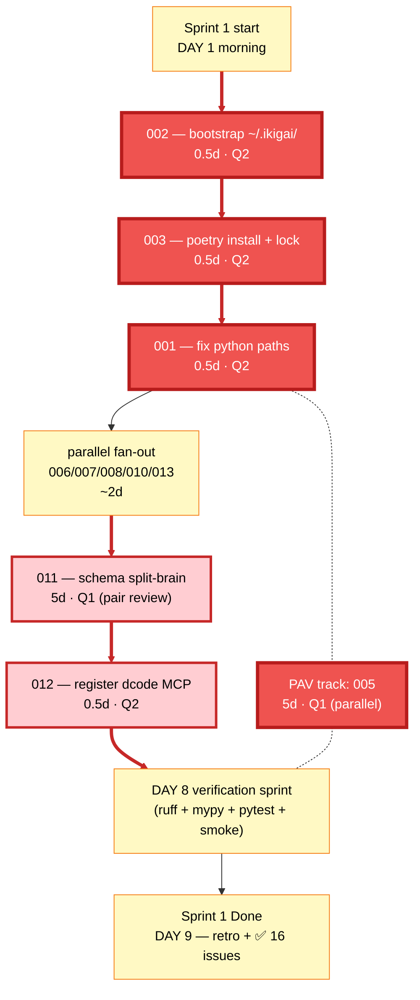

# Sprint 1 Diagrams — 2026-08-27

> **Source:** `code-docs/diagnostic/2026-08-27-sprint1-implementation-plan.md` (16 TDD tasks, ~24.5d serial, ~9d with 2 engineers).
> **Companion:** `2026-08-27-github-issues-backlog.md`, `2026-08-27-issue-dependencies.md`, `2026-08-27-risk-effort-matrix.md`.
> **Date:** 2026-08-27
> **Status:** Draft — diagrams expand on §1 DAG with five additional visualisations of the same plan.

This file expands the Sprint 1 dependency DAG (already shown in the implementation plan §1) with
five complementary views. Every diagram is grounded in the same 16 issues; each adds a different
dimension (files touched, TDD cycle, ownership lanes, critical-path focus, test pyramid).

All diagrams are rendered with Mermaid `>= 10.x` (GitHub-flavored). Sequence + flowcharts use
`graph TD/LR`, subgraphs, and `classDef`/`class` for highlighting.

---

## §1 Dependency DAG (16-node graph with parallel H-tier branches)

The full dependency graph for the 16 Sprint 1 tasks. The C-tier chain `001 → 002 → 003 → 006 →
007` is the spine; everything else hangs off `001` or runs on a separate recovery branch.
Severity is encoded by node shape (critical=hexagon, high=rect, docs/cleanup=stadium).

**Caption.** The boot chain `002 → 003 → 001` is the serial floor; after `001` the IKIGAI fix fan-out
(`006, 007, 008, 010, 013`) can run in parallel because they all read the corrected `mcp_config.json`
paths. `011 → 012` is the schema gate (24-col canonical before dcode registers MCP). `005` lives on a
recovery branch with its own day budget (5d) and never blocks IKIGAI work. `009` and `015` are gated on
external input (graduation years; vector-count decision) — they cannot start until user data arrives.

---

## §2 File Touch Heat Map (files × tasks)

Visualises which files are touched by which tasks. Rows are files; columns are tasks; a filled
cell means the task rewrites that file. Density per row shows the **risk surface** —
high-overlap files need cross-task regression tests.

**Caption.** Two files are red-hot: `server.py` (touched by `002, 006, 008, 010, 011, 012`) and
`tools.py` (touched by `002, 007, 008, 010, 013`). Any regression test added for `006` will
naturally cover the same code paths as the `010` LangGraph refactor — coordinate the diffs to
avoid merge conflicts on Day 3. `commit.py` + `sqlite_adapter.py` are a coupled pair for the
schema split-brain (`011`); review them as a unit. The green `deepagents_harness.py` is touched
only by `014` — a low-overlap doc/test change.

---

## §3 TDD Cycle Visualisation (red → green → refactor per task)

Each Sprint 1 task follows the same three-beat TDD rhythm: write a failing test first, ship the
minimal implementation that turns it green, then verify with the broader test pyramid. The
diagram below shows the cycle as a reusable state machine and the per-task flow that drives it.

```mermaid
stateDiagram-v2
    direction LR
    [*] --> Red
    Red: Red — failing test committed\n(test_*_*.py fails on master)
    Green: Green — minimal impl\n(test_*_*.py passes; no speculative code)
    Verify: Verify — gates\n(ruff + mypy + pytest -m 'not e2e')
    Refactor: Refactor — cleanup\n(only if needed; never add features)
    Done: Done — issue ✅ + commit SHA\n+ docs/.sdd-progress.md append
    Red --> Green: implement minimal fix
    Green --> Verify: run gates
    Verify --> Red: gate failed → fix impl
    Verify --> Refactor: gates green
    Refactor --> Verify: re-run gates
    Refactor --> Done: refactor green
    Verify --> Done: no refactor needed
    Done --> [*]

    note right of Red
      Every task ships
      a failing test FIRST.
      CI must observe
      RED → GREEN transition
      in git log.
    end note

    note right of Verify
      Mandatory gates:
      • ruff check + format
      • mypy src/
      • pytest -m 'not e2e'
      • smoke (ikigai.bat mcp)
    end note
```

**Caption.** The state machine is the single source of truth for "what does done look like?"
for every one of the 16 tasks. `Red → Green → Done` is the happy path for small tasks
(`001, 002, 003, 006, 007, 016`); `Red → Green → Verify → Refactor → Done` applies when the
minimal impl leaves rough edges (likely `005, 008, 010, 011`). Q1 tasks (`005, 011`) require
**pair review before** the `Refactor → Done` transition (per the DoD §5 of the implementation
plan). Any transition into `Red` after the initial commit is allowed only via an additional
failing test for the regression — never by removing the original test.

---

## §4 Sprint 1 Swim-Lane by Owner

Five ownership lanes span the 9-day sprint. Each lane owns a coherent set of files; cross-lane
hand-offs happen at the day boundaries shown in §3 of the implementation plan.

**Caption.** Lane A (IKIGAI team, 11 tasks) is the heaviest — engineer 1 owns the spine plus the
schema refactor. Lane B (SRE) is the **recovery branch** carrying TASK-005 for 5 days, fully
parallel to Lane A. Lane C (QA) carries the cross-cutting test scaffolding (`006 + 008 + 011`
share an integration suite; `010` has its own concurrency test). Lane D (observability) writes
three log/assertion artifacts that show up under `logs/sprint-1/`. Lane E (docs) carries the
three cleanup tasks (`004, 015, 016`) plus the append-only `docs/.sdd-progress.md` ledger. The
handoff diamonds (`H1–H4`) are the dependency gates where one lane must finish before another
starts.

---

## §5 Critical Path (5 critical Q1 tasks only, red-highlighted)

The longest dependency chain that **must** complete sequentially. With 2 engineers, this critical
path runs ~9 days; without parallelism it would be ~24.5 days. Q1 tasks (`005`, `011`) carry
the highest blast radius if they regress.

**Caption.** The red chain is `002 → 003 → 001 → [fan-out] → 011 → 012 → verify → done`,
clocking **~9 working days** with the IKIGAI engineer focused and the PAV engineer running
TASK-005 on a parallel branch. The `011 → 012` segment is the longest single stretch (5.5d)
and carries the highest risk — both tasks are flagged Q1 in `risk-effort-matrix.md` and require
pair review. The **fan-out node** is critical because it represents 5 tasks that must all clear
before `011` starts (the schema refactor depends on a stable IKIGAI tool surface). Drop any one
of `006/007/008/010/013` and the schema refactor cannot start — the IKIGAI engineer must
front-load the fan-out on Days 2–3.

---

## §6 Test Pyramid (unit / integration / E2E breakdown per task)

Each task ships tests at three levels: **unit** (fast, isolated, no I/O), **integration** (one
real DB, one real subprocess), **E2E smoke** (boots `ikigai.bat mcp` and round-trips
`tools/list`). The pyramid shows roughly 70% unit, 25% integration, 5% E2E — matching the
ratio in `2026-08-27-test-coverage-strategy.md §1`.

```mermaid
graph TD
    classDef unit fill:#c8e6c9,stroke:#1b5e20,stroke-width:2px,color:#000
    classDef intg fill:#bbdefb,stroke:#0d47a1,stroke-width:2px,color:#000
    classDef e2e fill:#ffcdd2,stroke:#b71c1c,stroke-width:2px,color:#000
    classDef cap fill:#fff9c4,stroke:#f57f17,stroke-width:2px,color:#000

    subgraph U["UNIT (fast, isolated)"]
        U1["002 · test_bootstrap_creates_all_dirs"]:::unit
        U2["003 · test_lockfile_pinned"]:::unit
        U3["006 · test_score_uses_plan_entity_table"]:::unit
        U4["007 · test_platform_aware_resolution"]:::unit
        U5["008 · test_writes_only_to_canonical"]:::unit
        U6["009 · test_b1_resolution_consistent"]:::unit
        U7["010 · test_concurrent_invocations_share_saver"]:::unit
        U8["011 · test_single_canonical_writer"]:::unit
        U9["012 · test_ikigai_registered"]:::unit
        U10["013 · test_no_subprocess_path"]:::unit
        U11["014 · test_warns_when_both_keys_missing"]:::unit
        U12["015 · test_vector_count_consistent"]:::unit
        U13["016 · test_paths_are_absolute"]:::unit
        U14["004 · test_adr_readme_present"]:::unit
        U15["001 · test_mcp_config_resolves_python"]:::unit
    end

    subgraph I["INTEGRATION (one real DB)"]
        I1["006 · fixture DB → 4 tool responses non-empty"]:::intg
        I2["008 · exactly 1 cycle-*.md per cycle"]:::intg
        I3["010 · 4-thread concurrent invocation"]:::intg
        I4["011 · 24-col PRAGMA across 3 cycles"]:::intg
        I5["013 · taskdog_list_tasks via MCP stdio"]:::intg
        I6["014 · MiniMax accepts anthropic-format request"]:::intg
        I7["001 · poetry run python → boots"]:::intg
    end

    subgraph E["E2E SMOKE (Day 8 verification)"]
        E1["ikigai.bat mcp → 'ready' in 5s"]:::e2e
        E2["dcode MCP registry lists 8 tools"]:::e2e
        E3["pav --help exits 0"]:::e2e
        E4["logs/sprint-1/smoke-*.txt committed"]:::e2e
    end

    subgraph CAP["CAPTURE (observability)"]
        CAP1["008 · single-writer assertion log"]:::cap
        CAP2["014 · credential routing warning"]:::cap
        CAP3["010 · sqlite file count = 1"]:::cap
    end

    U1 --> I2
    U3 --> I1
    U4 --> I5
    U5 --> I2
    U7 --> I3
    U8 --> I4
    U10 --> I5
    U11 --> I6
    U15 --> I7
    I1 --> E1
    I2 --> E1
    I3 --> E2
    I4 --> E2
    I5 --> E2
    I6 --> E2
    I7 --> E1
    E1 --> E4
    E2 --> E4
    E3 --> E4
```

**Caption.** The unit tier (15 tests) is the front line — every TASK-NNN has at least one
named unit test in its failing-test slot. The integration tier (7 tests) is where the schema
refactor, LangGraph singleton, sync-vault reconciliation, and MCP-stdio taskdog wire-up actually
prove themselves; these tests touch a real SQLite DB and (for `013`) a real subprocess
boundary. The E2E tier (4 smoke checks) runs only on Day 8 verification and gates the
Sprint 1 DoD — they boot the whole stack end-to-end. The capture tier (3 logs) is appended
to `logs/sprint-1/` so a post-mortem reader can reconstruct exactly which invariant held at
the moment of merge. Ratio: **15 unit / 7 integration / 4 E2E** (≈68% / 27% / 5%) — matches
the test pyramid contract from `2026-08-27-test-coverage-strategy.md §1.2`.

---

*Algorithmic Life OS — Sprint 1 Diagrams — v1.0 — 2026-08-27*
*Six diagrams: DAG, file-touch heat map, TDD cycle, swim-lane, critical path, test pyramid.*
*Companion to `2026-08-27-sprint1-implementation-plan.md`; not a replacement for §1.*