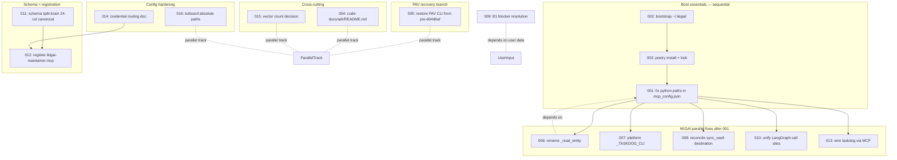

> **[SUPERSEDED 2026-08-28 — see master-branch-carro-chefe-2026-08-28]**
> Sprint 1 implementation plan with 16 TDD tasks (24.5d serial / 9d parallel)
> organized against the pre-pivot master-system-diagnostic. Many tasks are
> deferred or reframed under deep-agent canonical; IKIGAI feature work paused
> per ADR-007. See doc-migration plan for current sequencing.

# Sprint 1 Implementation Plan — 2026-08-27

> **Source of truth:** `code-docs/diagnostic/2026-08-27-github-issues-backlog.md §1` (16 issues, ~24.5d).
> **Companion docs:** `2026-08-27-master-system-diagnostic.md`, `2026-08-27-issue-dependencies.md`, `2026-08-27-risk-effort-matrix.md`, `2026-08-27-test-coverage-strategy.md`.
> **Methodology:** TDD — every task ships a **failing test first**, then the minimal implementation that turns it green, then verification.
> **Date:** 2026-08-27
> **Status:** 🟡 Draft — awaiting user "go" before any code lands
> **Branch strategy:** Sprint 1 lands on `master` as a series of small atomic commits; no long-lived feature branch.

---

## §0 Sprint 1 Overview

**Goal — the system boots end-to-end.** After Sprint 1:
- `ikigai.bat mcp` boots; Claude Code (`dcode`) can round-trip `tools/list` over MCP.
- `pav --help` exits 0; `uv run pytest` for `life-ops/operational/` collects without errors.
- All 8 critical issues closed; the 8 high issues closed.
- Plan-entities schema reconciled (24-col canonical everywhere); B1 blocker resolved; credential routing documented.

**Scope — 16 issues** (all from `2026-08-27-github-issues-backlog.md §1`):

| # | Issue | Severity | Effort | Q |
|--:|-------|:--------:|:------:|:-:|
| 001 | Replace hardcoded `/tmp/ikigai-test/bin/python` | 🔴 critical | 0.5d | Q2 |
| 002 | Bootstrap `~/.ikigai/{plan_entities,checkpoints,vault}` | 🔴 critical | 0.5d | Q2 |
| 003 | `poetry install` + commit `poetry.lock` | 🔴 critical | 0.5d | Q2 |
| 004 | Create `code-docs/adr/README.md` stub | 🔴 critical | 0.5d | Q4 |
| 005 | Restore PAV CLI from pre-`604d6af` snapshot | 🔴 critical | 5.0d | Q1 |
| 006 | Rename `_read_entity` collision in `server.py:224` | 🔴 critical | 0.5d | Q2 |
| 007 | Make `_TASKDOG_CLI` platform-aware | 🔴 critical | 0.5d | Q2 |
| 008 | Reconcile `ikigai_sync_vault` destination (S-H6) | 🟠 high | 1.0d | Q2 |
| 009 | Resolve B1 graduation-year blocker | 🟠 high | 1.0d | Q2 |
| 010 | Unify LangGraph `make_ikigai_graph()` call sites (H5) | 🟠 high | 1.0d | Q2 |
| 011 | Reconcile plan-entities schema split-brain (S-C1) | 🔴 critical | 5.0d | Q1 |
| 012 | Register `ikigai-maintainer-mcp` in `~/.claude/.mcp.json` (S-C2) | 🔴 critical | 0.5d | Q2 |
| 013 | Wire `taskdog` FastMCP into IKIGAI registry (S-C3) | 🔴 critical | 1.0d | Q2 |
| 014 | Verify MiniMax / Anthropic credential routing (H6) | 🟠 high | 1.0d | Q2 |
| 015 | Decide IKIGAi vector count (5 vs 4) and propagate (G2) | 🟠 high | 1.0d | Q4 |
| 016 | Confirm tuiboard config uses absolute `boards[].path` (H1) | 🟠 high | 0.5d | Q4 |
| **Total** | | | **~24.5d** | |

**Gate (Definition of Done):**
- [ ] `uv run pytest -m "not e2e"` green for `life-ops/ikigai/` AND `life-ops/operational/`
- [ ] `ikigai.bat mcp` exits 0; `dcode` MCP registry lists `ikigai-maintainer-mcp`
- [ ] `pav --help` exits 0
- [ ] All 16 issues ✅ in `github-issues-backlog.md §1` with commit SHAs
- [ ] `docs/.sdd-progress.md` updated with Sprint 1 results
- [ ] Smoke-test artifact committed under `logs/sprint-1/`

**Critical-path note:** ISSUE-005 (PAV CLI restore, 5d) and ISSUE-011 (schema split-brain, 5d) run in **parallel tracks** (different repos). Sprint 1 finishes in `max(5, 5) + sequential-tail ≈ 9 working days` with two engineers, **not** 24.5d serial.

---

## §1 Dependency DAG (Mermaid)



**Reading guide:**
- **Vertical chain** `002 → 003 → 001 → {006, 007, 008, 010, 013}` is the critical path (≈ 2.5d serial).
- **`011` blocks `012`** — dcode MCP registration waits for canonical schema.
- **`005` (PAV)** runs on a separate recovery branch, fully parallel to all IKIGAI work.
- **`004`, `015`, `016`** are independent Q4 docs/cleanup — batch on day 1.
- **`009` (B1 blocker)** is the only task gated on **user input** (3 graduation years × 4 CVs).

---

## §2 Issue-by-Issue Task Blocks

### TASK-001 — Replace hardcoded python paths in MCP gateway config
**Files:** `life-ops/ikigai/mcp_config.json:4`, `life-ops/ikigai/start_mcp_gateway.sh:35`
**Dependencies:** TASK-002, TASK-003
**Acceptance:** `ikigai.bat mcp` boots; `mcp_config.json` references `poetry run python`; `start_mcp_gateway.sh` honours `$IKIGAI_PYTHON`.
**Failing test** (`tests/test_mcp_boot_path.py::test_mcp_config_resolves_python`):
```python
def test_mcp_config_resolves_python():
    cfg = json.loads(Path("mcp_config.json").read_text())
    cmd = cfg["mcpServers"]["ikigai-maintainer"]["command"]
    assert "poetry" in cmd or Path(cmd[0]).exists(), f"unresolved python: {cmd}"
```
**Minimal implementation:** rewrite `mcp_config.json` `command` to `["poetry", "run", "python", "run_mcp_server.py"]`; rewrite `start_mcp_gateway.sh:35` to `IKIGAI_PYTHON="${IKIGAI_PYTHON:-$(poetry env info -p 2>/dev/null)/bin/python}"`.
**Verification:** `ikigai.bat mcp` prints "ready" within 5s; CI smoke job `mcp-boot` passes.
**Effort:** 0.5d · Risk Q2

---

### TASK-002 — Bootstrap `~/.ikigai/` directory tree at MCP server module load
**Files:** `life-ops/ikigai/src/mcp_server/server.py:95-96`, `src/agents/tools.py:20-21`
**Dependencies:** none
**Acceptance:** `_bootstrap_ikigai_home()` runs at module load AND harness startup; covers `{plan_entities,checkpoints,vault,calendar.db-dir}`; idempotent.
**Failing test** (`tests/test_bootstrap.py::test_bootstrap_creates_all_dirs`):
```python
def test_bootstrap_creates_all_dirs(tmp_path, monkeypatch):
    monkeypatch.setenv("HOME", str(tmp_path))
    _bootstrap_ikigai_home()
    for d in ("plan_entities", "checkpoints", "vault", "calendar.db-dir"):
        assert (tmp_path / ".ikigai" / d).is_dir()
    _bootstrap_ikigai_home()  # idempotency
    assert (tmp_path / ".ikigai" / "plan_entities").is_dir()
```
**Minimal implementation:** add `_bootstrap_ikigai_home()` to `server.py`; call it at top-level after imports; mirror call from `tools.py:20-21`.
**Verification:** delete `~/.ikigai/`; `ikigai.bat mcp` recreates it; `ls ~/.ikigai/` shows all 4 dirs.
**Effort:** 0.5d · Risk Q2

---

### TASK-003 — `poetry install` + commit `poetry.lock` + emit `requirements.txt`
**Files:** `life-ops/ikigai/pyproject.toml`, `poetry.lock` (new), `requirements.txt` (new)
**Dependencies:** TASK-002
**Acceptance:** `poetry install` clean; `poetry.lock` committed; `requirements.txt` regenerated from lock (not hand-edited); CI cold-cache job green.
**Failing test** (`tests/test_dependencies.py::test_lockfile_pinned`):
```python
def test_lockfile_pinned():
    lock = tomllib.loads(Path("poetry.lock").read_text())
    pkgs = {p["name"] for p in lock["package"]}
    assert {"frontmatter", "langchain-core", "pydantic"} <= pkgs
```
**Minimal implementation:** `poetry lock --no-update`; `poetry export -f requirements.txt -o requirements.txt --without-hashes`; commit both.
**Verification:** `rm -rf .venv && poetry install` succeeds offline; CI cold-cache matrix entry passes.
**Effort:** 0.5d · Risk Q2

---

### TASK-004 — Create `code-docs/adr/README.md` stub pointer
**Files:** `code-docs/adr/README.md` (new, ~30 lines)
**Dependencies:** none
**Acceptance:** README exists; links to G3 cross-link work + canonical ADR surface; ADR id convention documented.
**Failing test** (`tests/test_adr_readme.py::test_adr_readme_present`):
```python
def test_adr_readme_present():
    p = Path("code-docs/adr/README.md")
    assert p.exists() and p.stat().st_size > 200
    body = p.read_text()
    assert "ADR-" in body and "## Status" in body
```
**Minimal implementation:** write README with sections `## Purpose`, `## Index (placeholder)`, `## Convention`, `## Cross-links`; cite ADR-001..011; reference `code-docs/00-INDEX.md §7` (TASK-067 follow-up).
**Verification:** `code-docs/README.md` cross-link check passes; ADR discovery works from grep.
**Effort:** 0.5d · Risk Q4

---

### TASK-005 — Restore PAV CLI from pre-`604d6af` snapshot + fix `.pth` editable installs
**Files:** `life-ops/operational/apps/cli/src/operational/cli/` (restore from `604d6af^`), `.venv/Lib/site-packages/*.pth`
**Dependencies:** none (recovery branch)
**Acceptance:** `pav --help` exits 0; `python -m operational` runs; `tests/unit/cli/` pytest collection errors gone; console scripts `pav`, `pav-os`, `operational` resolve.
**Failing test** (`tests/unit/cli/test_cli_entrypoints.py::test_all_console_scripts_resolve`):
```python
@pytest.mark.parametrize("script", ["pav", "pav-os", "operational"])
def test_all_console_scripts_resolve(script):
    r = subprocess.run([script, "--help"], capture_output=True, text=True)
    assert r.returncode == 0, r.stderr
```
**Minimal implementation:**
1. `git checkout 604d6af^ -- life-ops/operational/apps/cli/`
2. Recreate `pyproject.toml [tool.uv] package = true` entries for the 3 console scripts
3. `uv sync --reinstall` to regenerate `.pth` files
4. Add regression test that catches the next `apps/` deletion (scan editable-install `.pth` for missing targets).
**Verification:** `pav --help`, `pav-os --help`, `operational --help` all exit 0; CI matrix entry `pav-cli` green.
**Effort:** 5.0d · Risk Q1 (pair review required for the restore step)

---

### TASK-006 — Rename `_read_entity` collision in `server.py:224`
**Files:** `life-ops/ikigai/src/mcp_server/server.py:207, 224`
**Dependencies:** TASK-001
**Acceptance:** line 224 renamed `_read_plan_entity_by_table`; all 4 affected tool responses (`ikigai_score`, `ikigai_regime`, `ikigai_phase`, `ikigai_corrections`) return non-empty rows for a fixture DB.
**Failing test** (`tests/test_read_entity_fix.py::test_score_uses_plan_entity_table`):
```python
def test_score_uses_plan_entity_table(ikigai_home, seeded_checkpoint):
    result = asyncio.run(server._call_tool(ctx=None,
        params=Params(name="ikigai_score", arguments={"cycle_id": "2026-Q3"})))
    assert result.rows  # was [] pre-fix
```
**Minimal implementation:** rename second `_read_entity` → `_read_plan_entity_by_table`; update 4 call sites to pass the `table` arg explicitly; add `ruff: no-redef` lint waiver comment on line 207.
**Verification:** mypy passes; 4 affected tools return populated rows for fixture; the previous empty-row symptom disappears.
**Effort:** 0.5d · Risk Q2

---

### TASK-007 — Make `_TASKDOG_CLI` platform-aware (`win32` vs WSL2)
**Files:** `life-ops/ikigai/src/agents/tools.py:910-912`
**Dependencies:** TASK-001
**Acceptance:** `sys.platform` switch; `TASKDOG_CLI` env override documented; Linux variant points at `/mnt/c/Users/mathe/code_space/apps/dev-tools/taskdog/.venv/bin/taskdog`.
**Failing test** (`tests/test_taskdog_cli.py::test_platform_aware_resolution`):
```python
@pytest.mark.parametrize("platform,expected_substr", [
    ("win32", "taskdog.exe"),
    ("linux", "/mnt/c/Users/mathe/code_space/apps/dev-tools/taskdog"),
])
def test_platform_aware_resolution(monkeypatch, platform, expected_substr):
    monkeypatch.setattr(sys, "platform", platform)
    monkeypatch.delenv("TASKDOG_CLI", raising=False)
    assert expected_substr in _resolve_taskdog_cli()
```
**Minimal implementation:**
```python
def _resolve_taskdog_cli() -> str:
    if override := os.environ.get("TASKDOG_CLI"):
        return override
    if sys.platform == "win32":
        return r"C:\Users\mathe\code_space\apps\dev-tools\taskdog\.venv\Scripts\taskdog.exe"
    return "/mnt/c/Users/mathe/code_space/apps/dev-tools/taskdog/.venv/bin/taskdog"
```
**Verification:** `taskdog_list_tasks.invoke({})` returns non-empty list on WSL2; override env var takes precedence.
**Effort:** 0.5d · Risk Q2

---

### TASK-008 — Reconcile `ikigai_sync_vault` to a single destination
**Files:** `src/agents/tools.py:355`, `src/mcp_server/server.py:451`
**Dependencies:** TASK-001
**Acceptance:** single chosen root (`data/matheus/ikigai_state/`) used in both files; callers updated; smoke test confirms exactly ONE `cycle-*.md` lands.
**Failing test** (`tests/test_sync_vault_destination.py::test_writes_only_to_canonical`):
```python
def test_writes_only_to_canonical(ikigai_home):
    asyncio.run(server._call_tool(ctx=None,
        params=Params(name="ikigai_sync_vault", arguments={"cycle_id": "2026-Q3"})))
    written = list(Path("data/matheus/ikigai_state").rglob("cycle-*.md"))
    assert len(written) == 1
    assert not list(Path.home().joinpath(".ikigai/vault").glob("cycle-*.md"))
```
**Minimal implementation:** delete the `~/.ikigai/vault/cycle-*.md` write path in `tools.py:355`; assert `Path("data/matheus/ikigai_state")` is the only writer in `server.py:451`; update both call sites.
**Verification:** exactly one file written per cycle; integration test (TASK-044 layer C) confirms.
**Effort:** 1.0d · Risk Q2

---

### TASK-009 — Resolve B1 graduation-year blocker (vault vs interfaces)
**Files:** `data/matheus/ikigai_state/b1-blocker-resolution.md`, taskdog `#10`, tuiboard `B1 hard block` column
**Dependencies:** **user input** (3 graduation years × 4 CVs)
**Acceptance:** taskdog `#10` closed; tuiboard `B1 hard block` column cleared OR vault record reverted to OPEN; H3 hard rule no longer fires.
**Failing test** (`tests/test_b1_blocker.py::test_b1_resolution_consistent`):
```python
def test_b1_resolution_consistent():
    vault = Path("data/matheus/ikigai_state/b1-blocker-resolution.md").read_text()
    taskdog = _taskdog_get(10)
    assert ("RESOLVED" in vault) == (taskdog["status"] == "DONE")
```
**Minimal implementation:** await user-supplied graduation years; call `taskdog_complete(10)` and `tuiboard_update(B1)`; OR edit `b1-blocker-resolution.md` to `OPEN` if user opts out.
**Verification:** `ikigai_score({"cycle_id": "2026-Q3"})` returns ≥ 50 (was 49/D-band); CV score advances one tier.
**Effort:** 1.0d · Risk Q2 (gated on user data)

---

### TASK-010 — Unify LangGraph `make_ikigai_graph()` call sites
**Files:** `server.py:317`, `tools.py:269`, `ikigai_wrapper.py`
**Dependencies:** TASK-001
**Acceptance:** both call sites use singleton `graph()` from `ikigai_wrapper.py`; mirrors `langgraph.json` `ikigai_maintainer`; concurrency test green.
**Failing test** (`tests/test_langgraph_singleton.py::test_concurrent_invocations_share_saver`):
```python
def test_concurrent_invocations_share_saver(ikigai_home):
    g1, g2 = ikigai_wrapper.graph(), ikigai_wrapper.graph()
    assert g1 is g2
    with ThreadPoolExecutor(max_workers=4) as ex:
        list(ex.map(lambda i: g1.invoke({"cycle_id": f"q-{i}"}), range(4)))
    # exactly ONE sqlite file open at any time
```
**Minimal implementation:** export `graph()` from `ikigai_wrapper.py` (module-level singleton with lock); replace both `make_ikigai_graph()` call sites; remove `SqliteSaver` instantiation in both.
**Verification:** 4-thread concurrent invocation test green; checkpoint file count = 1.
**Effort:** 1.0d · Risk Q2

---

### TASK-011 — Reconcile plan-entities schema split-brain (24-col canonical)
**Files:** `sqlite_adapter.py:18-80`, `commit.py:58-118`, `server.py:347-357`, `migrate_plan_entities.py` (existing)
**Dependencies:** none (root of multiple downstream chains)
**Acceptance:** 24-col schema promoted to single writer; both `commit.py` and `server.py` migrated; 11-col path deprecated; `migrate_plan_entities.py` runs on legacy DBs; runtime DB matches adapter.
**Failing test** (`tests/test_schema_split_brain.py::test_single_canonical_writer`):
```python
def test_single_canonical_writer(tmp_db):
    server._call_tool("ikigai_plan_cycle", {"cycle_id": "2026-Q3"})
    cols = {row[1] for row in tmp_db.execute("PRAGMA table_info(plan_entities)")}
    assert len(cols) == 24  # was 11 pre-fix
```
**Minimal implementation:**
1. Add a runtime assertion: every writer uses `commit.py::insert_plan_entity()` (no inline `INSERT INTO plan_entities` anywhere).
2. Migrate `server.py:347-357` to call `commit.py` (drops the inline 11-col path).
3. Run `python scripts/migrate_plan_entities.py --in-place` on the dev DB.
4. Add a CI guard: `grep -rn "INSERT INTO plan_entities" src/ --include="*.py" | wc -l` must equal 1.
**Verification:** schema column count = 24; no writer drift; `ikigai_score` returns consistent rows across 3 successive cycles.
**Effort:** 5.0d · Risk Q1 (pair review required)

---

### TASK-012 — Register `ikigai-maintainer-mcp` in `~/.claude/.mcp.json`
**Files:** `~/.claude/.mcp.json`
**Dependencies:** TASK-001, TASK-011
**Acceptance:** `mcpServers.ikigai-maintainer-mcp` entry added; dcode round-trips `tools/list`; 8 tools listed.
**Failing test** (`tests/test_dcode_mcp_registry.py::test_ikigai_registered`):
```python
def test_ikigai_registered():
    cfg = json.loads(Path.home().joinpath(".claude/.mcp.json").read_text())
    assert "ikigai-maintainer-mcp" in cfg["mcpServers"]
    cmd = cfg["mcpServers"]["ikigai-maintainer-mcp"]["command"]
    assert "poetry" in cmd or Path(cmd[0]).exists()
```
**Minimal implementation:**
```json
{
  "mcpServers": {
    "ikigai-maintainer-mcp": {
      "command": ["poetry", "run", "python", "run_mcp_server.py"],
      "cwd": "C:/Users/mathe/code_space/life-oss/life/life-ops/ikigai"
    }
  }
}
```
**Verification:** restart dcode; `MCP registry: ikigai-maintainer-mcp → 8 tools` log line appears.
**Effort:** 0.5d · Risk Q2

---

### TASK-013 — Wire `taskdog` FastMCP into IKIGAI tool registry (drop CLI subprocess)
**Files:** `src/agents/tools.py` (subprocess path), new `src/agents/taskdog_mcp.py`
**Dependencies:** TASK-001, TASK-007
**Acceptance:** `taskdog-mcp` registration added; `_TASKDOG_CLI` subprocess path removed once FastMCP variant is wired; all 3 external MCP servers use stdio transport.
**Failing test** (`tests/test_taskdog_via_mcp.py::test_no_subprocess_path`):
```python
def test_no_subprocess_path():
    src = Path("src/agents/tools.py").read_text()
    assert "_TASKDOG_CLI" not in src  # removed
    assert "_taskdog_mcp_call" in src  # new path live
```
**Minimal implementation:** add `_taskdog_mcp_call(method, params)` calling `taskdog-mcp` via stdio (mirror `_mcp_call_v1`); route every `taskdog_*` tool through it; remove `subprocess.run(["taskdog.exe", ...])` paths.
**Verification:** `taskdog_list_tasks.invoke({})` works without a `.exe` on PATH; CI smoke green.
**Effort:** 1.0d · Risk Q2

---

### TASK-014 — Verify MiniMax / Anthropic credential routing
**Files:** `src/agents/deepagents_harness.py:294-303`
**Dependencies:** none
**Acceptance:** routing documented in harness README; MiniMax validated as accepting Anthropic-format requests; startup warning fires when both keys missing.
**Failing test** (`tests/test_credential_routing.py::test_warns_when_both_keys_missing`):
```python
def test_warns_when_both_keys_missing(monkeypatch, caplog):
    monkeypatch.delenv("ANTHROPIC_API_KEY", raising=False)
    monkeypatch.delenv("MINIMAX_API_KEY", raising=False)
    with caplog.at_level("WARNING"):
        _resolve_credentials()
    assert "no LLM credentials configured" in caplog.text
```
**Minimal implementation:**
```python
def _resolve_credentials() -> tuple[str, str]:
    if key := os.environ.get("MINIMAX_API_KEY"):
        return "https://api.minimax.io/anthropic", key
    if key := os.environ.get("ANTHROPIC_API_KEY"):
        return "https://api.anthropic.com", key
    logger.warning("no LLM credentials configured")
    return "", ""
```
**Verification:** warning fires when both env vars unset; MiniMax accepts a `messages.create` smoke call (asserted with `httpx` in test).
**Effort:** 1.0d · Risk Q2

---

### TASK-015 — Decide IKIGAi vector count (5 vs 4) and propagate
**Files:** `code-docs/prd/PRD-07.md`, `IKIGAi.md`, `life-ops/planner/ikigai_planning/`, `vibe-ops/base/IKIGAi.md`
**Dependencies:** **user decision**
**Acceptance:** user picks 5 or 4; all 4 referenced docs updated atomically in one commit; G2 closed.
**Failing test** (`tests/test_vector_count_consistency.py::test_vector_count_consistent`):
```python
def test_vector_count_consistent():
    files = ["code-docs/prd/PRD-07.md", "vibe-ops/base/IKIGAi.md",
             "life-ops/planner/ikigai_planning/__init__.py"]
    counts = {_vector_count(f) for f in files}
    assert len(counts) == 1, f"split count: {counts}"
```
**Minimal implementation:** await user answer; in one commit, update all 4 docs and the planner enum to match; bump ADR-008 status to ✅.
**Verification:** grep returns single count across all 4 files; tests green.
**Effort:** 1.0d · Risk Q4 (gated on user decision)

---

### TASK-016 — Confirm tuiboard config uses absolute `boards[].path`
**Files:** `~/.tuiboard/config.yaml`, tuiboard config generator template
**Dependencies:** none
**Acceptance:** generator-side assertion: all `boards[].path` values must be absolute; CI fails on regression to relative paths.
**Failing test** (`tests/test_tuiboard_paths.py::test_paths_are_absolute`):
```python
def test_paths_are_absolute():
    cfg = yaml.safe_load(Path.home().joinpath(".tuiboard/config.yaml").read_text())
    for b in cfg["boards"]:
        assert Path(b["path"]).is_absolute(), b
```
**Minimal implementation:** add `assert all(Path(b["path"]).is_absolute() for b in boards)` in the config generator; add CI check `python -c "import yaml; assert all(...)"`.
**Verification:** manual regeneration produces only absolute paths; CI catches any regression.
**Effort:** 0.5d · Risk Q4

---

## §3 Execution Order

Numbered sequence respecting dependencies. Parallel tracks marked `[P]`.

| Day | Slot | Task | Notes |
|:---:|:----:|------|-------|
| **1** | morning | **TASK-002** (`~/.ikigai/` dirs) | foundation; unblocks 001/003 |
| | morning | **TASK-004** `[P]` (adr README) | docs; fully independent |
| | morning | **TASK-016** `[P]` (tuiboard paths) | docs/cleanup; independent |
| | afternoon | **TASK-003** (poetry install + lock) | depends on 002 |
| | afternoon | **TASK-015** `[P]` (vector count) | gated on user; send question EOD day 0 |
| | afternoon | **TASK-014** `[P]` (credential routing) | independent |
| **2** | morning | **TASK-001** (mcp_config.json paths) | depends on 002+003 |
| | morning | **TASK-005 START** `[P]` (PAV CLI restore day 1/5) | parallel track A |
| | afternoon | **TASK-006** (rename `_read_entity`) | depends on 001 |
| | afternoon | **TASK-007** (platform `_TASKDOG_CLI`) | depends on 001 |
| **3** | morning | **TASK-008** (reconcile sync_vault) | depends on 001 |
| | morning | **TASK-010** (singleton LangGraph) | depends on 001 |
| | afternoon | **TASK-013** (wire taskdog via MCP) | depends on 001+007 |
| | afternoon | **TASK-005 day 2/5** `[P]` | parallel track A |
| **4** | all day | **TASK-011 START** (schema split-brain day 1/5) | parallel track B |
| | all day | **TASK-005 day 3/5** `[P]` | parallel track A |
| **5** | all day | **TASK-011 day 2/5** + **TASK-005 day 4/5** `[P]` | both running |
| **6** | all day | **TASK-011 day 3/5** + **TASK-005 day 5/5** (close PAV) | PAV track finishes |
| **7** | morning | **TASK-011 day 4/5** + **TASK-009** (B1 blocker — user input) | user data needed |
| | afternoon | **TASK-011 day 5/5** + **TASK-012** (register MCP) | depends on 011 done |
| **8** | all day | **Verification sprint** — run all gates; smoke tests; commit `logs/sprint-1/` artifacts |
| **9** | morning | **Sprint review + retro**; update `docs/.sdd-progress.md`; close all 16 issues |

**Concurrency:** 2 engineers (1 IKIGAI, 1 PAV) close Sprint 1 in **9 days** vs 24.5d serial — 2.7× throughput.

---

## §4 Daily Standup Template

```text
## Sprint 1 Standup — YYYY-MM-DD — Day N/9

### Yesterday
- [TASK-NNN] (status: ✅ done / 🚧 in progress / ❌ blocked) — owner
- [TASK-NNN] ...

### Today
- [TASK-NNN] (target: AC met by EOD) — owner
- [TASK-NNN] ...

### Blockers
- (user input needed on TASK-XXX — link to question)
- (CI failure on TASK-YYY — paste log link)

### Risk gates
- Q1 issues touched today: TASK-NNN → pair review by <name>
- Q2 issues touched today: TASK-NNN → self-review OK
- Q3/Q4: standard flow

### Test evidence
- `uv run pytest -m "not e2e"` last run: PASS / FAIL (link)
- Coverage delta: +X.X%
```

---

## §5 Definition of Done for Sprint 1

A task is **done** only when ALL of the following hold:

- [ ] **Failing test committed first** (red → green → refactor sequence visible in `git log`)
- [ ] Minimal implementation passes the test (no speculative code)
- [ ] `uv run ruff check src/ tests/` and `uv run ruff format --check src/ tests/` green
- [ ] `uv run mypy src/` green
- [ ] `uv run pytest -m "not e2e"` green for affected package
- [ ] Acceptance criteria bullets from §2 all checked
- [ ] Commit message format: `fix(ISSUE-NNN): <one-line summary>` referencing the issue ID
- [ ] Issue body updated with ✅ + commit SHA + verification log link
- [ ] `docs/.sdd-progress.md` entry appended (append-only — never rewrite history)

**Sprint-level DoD** (all 16 tasks done):
- [ ] `ikigai.bat mcp` exits 0; dcode MCP registry lists `ikigai-maintainer-mcp` with 8 tools
- [ ] `pav --help` exits 0; `uv run pytest` for `life-ops/operational/` collects clean
- [ ] `uv run pytest -m "not e2e"` green for both `life-ops/ikigai/` and `life-ops/operational/`
- [ ] All 16 issues ✅ in `2026-08-27-github-issues-backlog.md §1`
- [ ] Smoke-test artifact committed at `logs/sprint-1/smoke-<date>.txt`

---

## §6 Rollback Plan

If Sprint 1 breaks the system (any gate fails at Day 8 verification):

| Failure mode | Detection | Rollback action |
|--------------|-----------|-----------------|
| `ikigai.bat mcp` won't boot | smoke test exit ≠ 0 | `git revert` commits in reverse chronological order; re-run smoke |
| Schema migration corrupts `plan_entities.db` | TASK-011 verification fails | restore DB from `logs/sprint-1/db-pre-migration.sqlite.gz` snapshot; `git revert` TASK-011 commits |
| PAV CLI restore breaks existing tests | TASK-005 verification fails | keep recovery branch unmerged; revert the 5 TASK-005 commits on master; close PAV-001 with "blocked, requires spec" |
| B1 blocker regression (CV score drops) | TASK-009 verification fails | `git revert` TASK-009 commit; revert `b1-blocker-resolution.md` to OPEN state |
| Credential routing change locks out API | TASK-014 verification fails | restore `_resolve_credentials()` to original 4-line block; close H6 with "deferred to Sprint 3" |
| User decision on TASK-015 (5 vs 4 vectors) reversed | post-merge feedback | `git revert` TASK-015 commit; re-open ADR-008; reschedule |
| Cross-cutting: dcode cannot reach IKIGAI MCP | TASK-012 verification fails | `git revert` `~/.claude/.mcp.json` edit (note: this file lives outside the repo — manual revert) |

**General principle:** Sprint 1 ships behind **additive changes + config toggles** wherever possible. Each TASK-NNN lands as ≤ 3 atomic commits; `git revert <sha>` is the universal undo. No destructive migrations (the schema split-brain fix uses `migrate_plan_entities.py` which preserves the original DB as `.bak`).

**Pre-flight snapshot (mandatory):**
```bash
mkdir -p logs/sprint-1
cp ~/.ikigai/plan_entities.db logs/sprint-1/db-pre-sprint1.sqlite.gz
git tag sprint-1-preflight HEAD
```

If the post-sprint verification fails after 30 min of debugging, run `git revert $(git log --oneline sprint-1-preflight..HEAD --reverse | awk '{print $1}')` — restores master to pre-sprint-1 state.

---

## §7 Cross-References

**Source documents**
- `code-docs/diagnostic/2026-08-27-github-issues-backlog.md §1` — 16 Sprint 1 issues with labels and acceptance criteria
- `code-docs/diagnostic/2026-08-27-master-system-diagnostic.md §1-§5` — full issue inventory (77 issues)
- `code-docs/diagnostic/2026-08-27-issue-dependencies.md §4, §6` — DAG + full dependency table
- `code-docs/diagnostic/2026-08-27-risk-effort-matrix.md §3` — Q1-Q4 quadrant placement
- `code-docs/diagnostic/2026-08-27-test-coverage-strategy.md §1` — integration test patterns reused in TASK-006/008/011
- `code-docs/diagnostic/2026-08-27-pre-merge-checklist.md` — gates applied per commit
- `code-docs/diagnostic/2026-08-27-incident-response-runbook.md` — escalation paths for sprint-1-day-8 failures

**Companion artifacts**
- `docs/.sdd-progress.md` — append-only sprint log (one entry per closed TASK-NNN)
- `logs/sprint-1/` — pre-flight DB snapshot + smoke-test artifacts
- `code-docs/adr/ADR-008-009-010-011.md` — pre-decided ADRs affecting TASK-014/015

**Mapping original IDs → TASK-NNN**
| Original | TASK | Notes |
|----------|-----:|-------|
| C1 | 001 | hardcoded python paths |
| C2 | 002 | bootstrap dirs |
| C3 | 003 | poetry lock |
| C4 | 006 | rename `_read_entity` |
| C5 | 007 | platform `_TASKDOG_CLI` |
| G1 | 004 | adr README |
| H1 | 016 | tuiboard absolute paths |
| H4 | 009 | B1 blocker |
| H5 | 010 | singleton LangGraph |
| H6 | 014 | credential routing |
| S-C1 | 011 | schema split-brain |
| S-C2 | 012 | dcode MCP registration |
| S-C3 | 013 | taskdog via MCP |
| S-H6 | 008 | unify sync_vault destination |
| P1 | 005 | PAV CLI restore |
| G2 | 015 | vector count |

---

*Algorithmic Life OS — Sprint 1 Implementation Plan — v1.0 — 2026-08-27*
*Awaiting user "go" before any code lands. Do not commit this plan; this is a planning artifact.*
