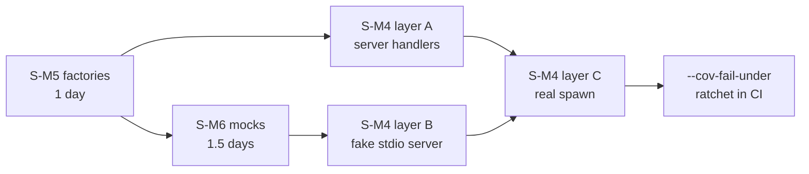

> **[SUPERSEDED 2026-08-28 — see master-branch-carro-chefe-2026-08-28]**
> Test coverage strategy for S-M4/S-M5/S-M6 testing-gap issues in the pre-pivot
> master-system-diagnostic. Many issues are reframed; coverage strategy
> retained as audit reference but not active. IKIGAI feature work paused per
> ADR-007; new tests should target deep-agent contracts not legacy PAV/IKIGAI.

# Test Coverage Strategy — S-M4 / S-M5 / S-M6 — 2026-08-27

> **Companion doc** to `2026-08-27-master-system-diagnostic.md` §2.3 (MEDIUM).
> The three testing-gap issues resolve as ONE strategy: factories (S-M5) are the
> foundation, mock backends (S-M6) build on them, MCP integration tests (S-M4)
> consume both.
>
> **Status:** 🟡 Draft — strategy + sample code only, no test files created yet
> **Target repo:** `life-ops/ikigai/` (Poetry, pytest 8, hypothesis 6)

---

## 0. Sumário

| Issue | Gap | Strategy | Effort |
|-------|-----|----------|:------:|
| **S-M4** | Zero MCP integration tests | `tests/test_mcp_integration.py` — fake stdio server + real `run_mcp_server.py` spawn + JSON-RPC round-trips | 3 d |
| **S-M5** | No Pydantic factories (every test hand-builds a UEID + 6 fields) | `tests/factories.py` — hand-rolled `make_*()`, no new dependency | 1 d |
| **S-M6** | No mock backends for the 3 external servers | `tests/mocks.py` — `unittest.mock` patches for `_mcp_call_v1` / `_taskdog_run` / solverforge CLI | 1.5 d |

### Current coverage gap

13 test files / 2 583 lines cover **`src/ikigai/`** only. They cover **nothing**
under `src/agents/`, `src/mcp_server/`, or `src/observability/`.

| Package | Source files | Source LOC | Test files | Coverage |
|---------|-------------:|-----------:|-----------:|:--------:|
| `ikigai/` (core domain) | 48 | ~5 400 | 13 | 🟢 good |
| `agents/` (tools + graph nodes) | 15 | ~2 600 | **0** | 🔴 **0 %** |
| `mcp_server/` (JSON-RPC surface) | 3 | ~550 | **0** | 🔴 **0 %** |
| `observability/` (otel init) | 3 | ~90 | **0** | 🔴 **0 %** |

The untested third is exactly the part that talks to the outside world —
subprocess, stdio, JSON-RPC, SQLite, filesystem. That is where the master
diagnostic's HIGH issues live (S-H6 vault split-brain, S-H7 hard-coded paths,
S-H8 missing `init_tracing()`, C1 broken python paths). **Each would have been
caught by a single integration test.**

---

## 1. S-M4 — MCP integration tests

### 1.1 Approach

Three layers, cheapest first. Only layer C touches a real process.

| Layer | What it exercises | Speed | Marker |
|-------|-------------------|:-----:|--------|
| **A. Handler-level** | `_call_tool()` / `_list_tools()` in-process, DB + vault under `tmp_path` | ~ms | `unit` |
| **B. Fake stdio server** | `_mcp_call_v1()` against a `python` script speaking JSON-RPC — proves handshake, `tools/call` unwrap, timeout, error mapping | ~100 ms | `integration` |
| **C. Real server spawn** | `python run_mcp_server.py` subprocess, real `tools/list` → `tools/call` round-trip | ~1-3 s | `integration` + `slow` |

Decisions:

- **`asyncio.run()` over `pytest-asyncio`** — `_call_tool` / `_list_tools` are
  `async def`; wrapping avoids a new dev dependency.
- **Env isolation** — every test redirects `~/.ikigai/` into `tmp_path`. This
  *also* pins S-H7: a path a test cannot redirect is a path that is hard-coded.
- **Session-cache reset** — `_MCP_SESSION_CACHE` is module-global; an autouse
  fixture must clear it or test order changes behaviour.
- **No network.** Layer C spawns only IKIGAI's own server; tuiboard / taskdog /
  solverforge stay mocked (§3).

### 1.2 Files

```
tests/
├── conftest.py                  # EXTEND: ikigai_home, clean_mcp_session, fake_mcp_cmd
├── test_mcp_integration.py      # NEW ~220 lines — layers A/B/C
└── fixtures/fake_mcp_server.py  # NEW ~45 lines — one-shot JSON-RPC stdio server
```

### 1.3 Sample test code

`tests/fixtures/fake_mcp_server.py` — stands in for tuiboard's MCP server.
One request in, one response out, exit — mirroring `_mcp_call_v1`'s one-shot
process model:

```python
"""Minimal JSON-RPC 2.0 stdio server for MCP client tests."""

from __future__ import annotations

import json
import os
import sys

_RESPONSES: dict[str, dict] = {
    "board_list": {"boards": [{"name": "life", "path": "life.md", "taskCount": 3}]},
    "board_tasks_get": {"tasks": [{"id": "t1", "title": "ship spec", "column": "doing"}]},
}


def main() -> int:
    req = json.loads(sys.stdin.read())
    method, rid = req.get("method"), req.get("id")

    if method == "initialized":
        return 0  # notification — no response
    if method == "initialize":
        result = {"protocolVersion": "2024-11-05", "capabilities": {"tools": {}}}
    elif method == "tools/call":
        name = req["params"]["name"]
        if os.environ.get("FAKE_MCP_FAIL") == name:
            print(json.dumps({"jsonrpc": "2.0", "id": rid,
                              "error": {"code": -32000, "message": f"boom in {name}"}}))
            return 0
        # tuiboard-style content wrapper — exercises the unwrap branch
        result = {"content": [{"type": "text",
                               "text": json.dumps(_RESPONSES.get(name, {}))}]}
    else:
        print(json.dumps({"jsonrpc": "2.0", "id": rid,
                          "error": {"code": -32601, "message": "method not found"}}))
        return 0

    print(json.dumps({"jsonrpc": "2.0", "id": rid, "result": result}))
    return 0


if __name__ == "__main__":
    raise SystemExit(main())
```

`tests/conftest.py` additions:

```python
_FAKE_SERVER = Path(__file__).parent / "fixtures" / "fake_mcp_server.py"


@pytest.fixture
def fake_mcp_cmd() -> list[str]:
    return [sys.executable, str(_FAKE_SERVER)]


@pytest.fixture(autouse=True)
def clean_mcp_session():
    """_MCP_SESSION_CACHE is module-global — reset around every test."""
    from agents import tools
    tools._MCP_SESSION_CACHE.clear()
    yield
    tools._MCP_SESSION_CACHE.clear()


@pytest.fixture
def ikigai_home(tmp_path, monkeypatch) -> Path:
    """Redirect every ~/.ikigai/ write into tmp_path (pins S-H7)."""
    home = tmp_path / "home"
    (home / ".ikigai" / "vault").mkdir(parents=True)
    monkeypatch.setenv("IKIGAI_HOME", str(home / ".ikigai"))
    monkeypatch.setattr(Path, "home", classmethod(lambda cls: home))
    return home / ".ikigai"
```

`tests/test_mcp_integration.py` — the five load-bearing tests:

```python
"""S-M4 — MCP integration: client handshake, server handlers, real round-trip."""

from __future__ import annotations

import asyncio
import json
import subprocess
import sys
from unittest import mock

import pytest

from agents import tools


@pytest.mark.integration
def test_mcp_call_v1_unwraps_tuiboard_content(fake_mcp_cmd):
    """result {content:[{text: json}]} is unwrapped into a plain dict."""
    result = tools._mcp_call_v1(fake_mcp_cmd, "board_list", {"configPath": ""})

    assert result == {"boards": [{"name": "life", "path": "life.md", "taskCount": 3}]}


@pytest.mark.integration
def test_mcp_call_v1_handshakes_once_per_server(fake_mcp_cmd):
    """initialize runs once per server_cmd, not once per call."""
    cache_key = " ".join(fake_mcp_cmd[:3])
    tools._mcp_call_v1(fake_mcp_cmd, "board_list", {})
    assert tools._MCP_SESSION_CACHE[cache_key] is True

    with mock.patch.object(tools.subprocess, "Popen", wraps=subprocess.Popen) as spy:
        tools._mcp_call_v1(fake_mcp_cmd, "board_list", {})
    assert spy.call_count == 1, "second call must not re-handshake"


@pytest.mark.integration
@pytest.mark.parametrize("cmd_kind,needle", [("error", "boom in board_list"),
                                             ("hang", "timed out")])
def test_mcp_call_v1_surfaces_failures_as_runtimeerror(
    fake_mcp_cmd, monkeypatch, cmd_kind, needle
):
    """A JSON-RPC error or a hung server raises — never returns a silent {}."""
    if cmd_kind == "error":
        monkeypatch.setenv("FAKE_MCP_FAIL", "board_list")
        cmd, timeout = fake_mcp_cmd, 15.0
    else:
        cmd, timeout = [sys.executable, "-c", "import time; time.sleep(30)"], 0.5

    with pytest.raises(RuntimeError, match=needle):
        tools._mcp_call_v1(cmd, "board_list", {}, timeout=timeout)


@pytest.mark.unit
def test_list_tools_exposes_eight_ikigai_tools():
    """Advertised tool list matches TOOLS — guards accidental deletions."""
    from mcp_server import server

    result = asyncio.run(server._list_tools(ctx=None, params=None))

    assert {t.name for t in result.tools} == {
        "ikigai_score", "ikigai_regime", "ikigai_phase", "ikigai_decompose",
        "ikigai_corrections", "ikigai_plan_cycle", "ikigai_checkpoint",
        "ikigai_sync_vault",
    }


@pytest.mark.unit
def test_sync_vault_writes_to_single_destination(ikigai_home, seeded_checkpoint):
    """S-H6 regression guard: exactly ONE cycle-*.md destination exists."""
    from mcp_server import server

    params = type("P", (), {"name": "ikigai_sync_vault",
                            "arguments": {"cycle_id": "2026-Q3"}})()
    asyncio.run(server._call_tool(ctx=None, params=params))

    written = list(ikigai_home.rglob("cycle-*.md"))
    assert len(written) == 1, f"split-brain: {[str(p) for p in written]}"


@pytest.mark.integration
@pytest.mark.slow
def test_real_server_answers_tools_list(ikigai_home):
    """run_mcp_server.py boots and answers a real JSON-RPC tools/list."""
    req = {"jsonrpc": "2.0", "id": "1", "method": "tools/list"}
    proc = subprocess.run([sys.executable, "run_mcp_server.py"],
                          input=json.dumps(req), capture_output=True,
                          text=True, timeout=20)

    assert proc.returncode == 0, proc.stderr
    body = json.loads(proc.stdout.strip().splitlines()[-1])
    assert len(body["result"]["tools"]) == 8
```

### 1.4 Acceptance criteria

- [ ] `tests/test_mcp_integration.py` with ≥ 12 tests across layers A/B/C
- [ ] `fake_mcp_server.py` handles `initialize`, `initialized`, `tools/call`, unknown-method
- [ ] Every writing test runs under `ikigai_home` — the suite leaves `~/.ikigai/` byte-identical
- [ ] `_MCP_SESSION_CACHE` reset is autouse; suite green under `-p no:randomly` **and** `--randomly-seed=1`
- [ ] `pytest -m "not slow"` finishes < 10 s; `pytest -m "not e2e"` (CI gate) includes layers A + B
- [ ] One guard test per HIGH issue: S-H6 (single vault destination), S-H7 (path redirectable), S-H8 (`init_tracing` called at import)
- [ ] Markers `unit`, `integration`, `slow` registered in `pyproject.toml`

---

## 2. S-M5 — Pydantic factories

### 2.1 Approach

**Hand-rolled, not `factory_boy`:**

| Criterion | `factory_boy` | Hand-rolled |
|-----------|:-------------:|:-----------:|
| New dependency | yes (+`faker`) | **no** |
| Pydantic v2 validators respected | via glue layer | natively |
| Literal `horizon_days` unions | `Iterator` per class | plain default arg |
| `UEID.generate()` tri-key | `LazyFunction` wrapper | direct call |
| Failure traces | factory internals | 1 frame |

Rules: one `make_*()` per entity, `**overrides` last; **valid with zero
arguments**; slug derived deterministically from `title` while `uuid_short`
stays fresh (real `UEID.generate()` semantics); **no I/O** — DB seeding is a
separate fixture that *consumes* factories; `make_plan_tree()` wires the full
Dream → Deliverable chain that every propagation/decompose test needs.

### 2.2 Files

```
tests/
├── factories.py         # NEW ~140 lines — make_* helpers + make_plan_tree()
└── conftest.py          # EXTEND: re-export factories as fixtures
```

### 2.3 Sample factory code

```python
"""S-M5 — test factories for IKIGAI Pydantic entities (no factory_boy)."""

from __future__ import annotations

import re
from typing import Any

from ikigai.entities.base import PlanEntity
from ikigai.entities.plan.deliverable import DeliverableEntity
from ikigai.entities.plan.dream import DreamEntity
from ikigai.entities.plan.goal import GoalEntity
from ikigai.entities.plan.objective import ObjectiveEntity
from ikigai.entities.plan.project import ProjectEntity
from ikigai.entities.plan.task import TaskEntity, TaskPriority
from ikigai.enums import Phase, RegimeType, StatusType, VectorType
from ikigai.types import UEID


def slugify(text: str) -> str:
    """title → valid PlanEntity.slug (lowercase, [a-z0-9_-], 2-64 chars)."""
    s = re.sub(r"[^a-z0-9]+", "-", text.lower()).strip("-")
    return (s or "entity")[:64].rstrip("-")


def make_ueid(entity_type: str, slug: str = "test-entity", namespace: str = "ikigai") -> UEID:
    return UEID.generate(namespace, entity_type, slug, canonical_content=slug)


def _base(entity_type: str, title: str, overrides: dict[str, Any]) -> dict[str, Any]:
    """Common identity block shared by every plan entity."""
    slug = overrides.pop("slug", slugify(title))
    return {"ueid": make_ueid(entity_type, slug), "slug": slug, "title": title}


def make_dream(title: str = "Ser perito cross-funcional", **overrides: Any) -> DreamEntity:
    defaults = {
        **_base("dream", title, overrides),
        "status": StatusType.ACTIVE, "horizon_days": 3650,
        "motivation": "test motivation", "success_metric": "test metric",
        "core_values": ["autonomia", "rigor"],
        "ikigai_vectors": [VectorType.SKILL, VectorType.MARKET],
        "phase_at_creation": Phase.BUSCA, "regime_at_creation": RegimeType.MAINTAIN,
    }
    return DreamEntity(**{**defaults, **overrides})


def make_goal(title: str = "Fechar 2026 com portfolio", **overrides: Any) -> GoalEntity:
    defaults = {
        **_base("goal", title, overrides),
        "status": StatusType.ACTIVE, "horizon_days": 365,
        "success_metrics": ["3 cases publicados"], "review_frequency_days": 90,
    }
    return GoalEntity(**{**defaults, **overrides})


def make_objective(title: str = "Publicar case BYD", **overrides: Any) -> ObjectiveEntity:
    defaults = {
        **_base("objective", title, overrides),
        "status": StatusType.IN_PROGRESS, "horizon_days": 90,
        "key_results": ["6 dimensões provadas", "1-pager entregue"],
        "progress_pct": 40.0,
    }
    return ObjectiveEntity(**{**defaults, **overrides})


def make_project(title: str = "Value factory portfolio", **overrides: Any) -> ProjectEntity:
    defaults = {
        **_base("project", title, overrides),
        "status": StatusType.ACTIVE, "horizon_days": 90,
        "tech_stack": ["python", "sqlite"], "target_revenue_brl": 12000.0,
    }
    return ProjectEntity(**{**defaults, **overrides})


def make_task(title: str = "Escrever spec de testes", **overrides: Any) -> TaskEntity:
    defaults = {
        **_base("task", title, overrides),
        "status": StatusType.DRAFT, "horizon_days": 3, "priority": TaskPriority.HIGH,
        "rice_reach": 4.0, "rice_impact": 2.0,
        "rice_confidence": 0.8, "rice_effort_h": 4.0,
    }
    return TaskEntity(**{**defaults, **overrides})


def make_deliverable(title: str = "Coverage strategy", **overrides: Any) -> DeliverableEntity:
    defaults = {
        **_base("deliverable", title, overrides),
        "status": StatusType.IN_PROGRESS, "horizon_days": 7,
        "artifact_type": "document", "is_public": False,
    }
    return DeliverableEntity(**{**defaults, **overrides})


def make_plan_tree() -> dict[str, PlanEntity]:
    """Dream → Goal → Objective → Project → Task → Deliverable, parents wired."""
    dream = make_dream()
    goal = make_goal(parent_ueid=dream.ueid)
    objective = make_objective(parent_ueid=goal.ueid)
    project = make_project(parent_ueid=objective.ueid)
    task = make_task(parent_ueid=project.ueid)
    return {
        "dream": dream, "goal": goal, "objective": objective, "project": project,
        "task": task, "deliverable": make_deliverable(parent_ueid=task.ueid),
    }
```

Boilerplate removed — 9 lines per entity becomes 1:

```python
# BEFORE                                    # AFTER
goal = GoalEntity(                          goal = make_goal(title="My Goal")
    ueid=UEID("ikigai:goal:my-goal:abcd1234:deadbeef"),
    slug="my-goal", title="My Goal",        paused = make_goal(status=StatusType.PAUSED)
    status=StatusType.ACTIVE, horizon_days=365,
)
```

### 2.4 Acceptance criteria

- [ ] `tests/factories.py` exports ≥ 7 factories (`make_ueid`, `make_dream`, `make_goal`, `make_objective`, `make_project`, `make_task`, `make_deliverable`) plus `make_plan_tree`
- [ ] Every factory with **zero args** yields a valid entity — parametrized `test_factories.py::test_all_factories_valid`
- [ ] `**overrides` reach the constructor unchanged (an invalid override still raises)
- [ ] `make_plan_tree()` returns 6 entities, `parent_ueid` chain intact, 6 distinct `uuid_short`s
- [ ] Zero new dependencies in `pyproject.toml`; `mypy --strict tests/factories.py` clean
- [ ] ≥ 3 existing test files refactored onto factories (proves the API is ergonomic)

---

## 3. S-M6 — Mock backends for MCP servers

### 3.1 Approach

`agents/tools.py` funnels all three external systems through exactly three
seams. Patch the seam, never the transport:

| External system | Seam to patch | Real backend |
|-----------------|---------------|--------------|
| tuiboard | `agents.tools._mcp_call_v1` (`tools.py:553`) | Node MCP stdio server |
| taskdog | `agents.tools._taskdog_run` (`tools.py:915`) | `taskdog.exe` + API server |
| solverforge-calendar | `agents.tools.subprocess.run`, scoped to `_SOLVERFORGE_CLI` | Rust CLI binary |

Rules: assert on the tool's **markdown string output** (that is what the agent
consumes); `autospec=True` everywhere so a seam signature change breaks loudly;
model **four modes** per backend — `ok`, `server_down`, `timeout`,
`malformed`/`missing` (each is a distinct untested branch today); use a
**recorder** so tests can assert the *request* shape, not just the response;
never fake the `mcp` package via `sys.modules`.

### 3.2 Files

```
tests/
├── mocks.py             # NEW ~120 lines — MCPRecorder, patch_tuiboard, patch_taskdog
└── conftest.py          # EXTEND: mock_tuiboard / mock_taskdog / mock_solverforge
```

### 3.3 Sample mock code

```python
"""S-M6 — mock backends for the 3 external MCP/CLI servers."""

from __future__ import annotations

import subprocess
from contextlib import contextmanager
from dataclasses import dataclass, field
from typing import Any, Iterator
from unittest import mock


@dataclass
class MCPRecorder:
    """Records (method, params) and replays canned results."""

    responses: dict[str, Any] = field(default_factory=dict)
    calls: list[tuple[str, dict]] = field(default_factory=list)
    mode: str = "ok"  # ok | server_down | timeout | malformed

    def __call__(self, server_cmd: list[str], method: str,
                 params: dict | None = None, timeout: float = 15.0) -> dict:
        self.calls.append((method, params or {}))
        if self.mode == "server_down":
            raise RuntimeError("MCP server error (exit 1): ECONNREFUSED")
        if self.mode == "timeout":
            raise RuntimeError(f"MCP call timed out after {timeout}s: {method}")
        if self.mode == "malformed":
            return {"unexpected": "shape"}
        if method not in self.responses:
            raise AssertionError(f"unstubbed tuiboard method: {method}")
        return self.responses[method]

    def assert_called_with_param(self, method: str, key: str) -> None:
        if not any(m == method and key in p for m, p in self.calls):
            raise AssertionError(f"{method} never got param {key!r}; calls={self.calls}")


_TUIBOARD_DEFAULTS: dict[str, Any] = {
    "board_list": {"boards": [{"name": "life", "path": "life.md", "taskCount": 2}]},
    "board_tasks_get": {"tasks": [
        {"id": "t1", "title": "write spec", "column": "doing", "priority": "high"},
        {"id": "t2", "title": "review PR", "column": "todo", "priority": "low"},
    ]},
    "board_task_update": {"ok": True, "id": "t1"},
    "board_task_create": {"ok": True, "id": "t3"},
}


@contextmanager
def patch_tuiboard(mode: str = "ok", **overrides: Any) -> Iterator[MCPRecorder]:
    """Patch agents.tools._mcp_call_v1 with a recording fake."""
    rec = MCPRecorder(responses={**_TUIBOARD_DEFAULTS, **overrides}, mode=mode)
    with mock.patch("agents.tools._mcp_call_v1", new=rec):
        yield rec


_TASKDOG_LIST_STDOUT = (
    "----  -----------  -----------  --\n"
    "1  spec-review  PENDING  5  2026-09-01\n"
    "2  ship-tests  IN_PROGRESS  8  2026-09-03\n"
)


def taskdog_result(stdout: str = "", stderr: str = "", code: int = 0):
    """CompletedProcess shaped like _taskdog_run's return value."""
    return subprocess.CompletedProcess(args=["taskdog"], returncode=code,
                                       stdout=stdout, stderr=stderr)


@contextmanager
def patch_taskdog(mode: str = "ok", stdout: str | None = None) -> Iterator[mock.MagicMock]:
    """Patch agents.tools._taskdog_run. Modes: ok | server_down | timeout | missing."""
    modes: dict[str, Any] = {
        "ok": lambda args, timeout=10.0: taskdog_result(
            _TASKDOG_LIST_STDOUT if stdout is None else stdout),
        "server_down": lambda args, timeout=10.0: taskdog_result(
            stderr="error: connection refused", code=1),
        "timeout": mock.Mock(side_effect=subprocess.TimeoutExpired("taskdog", 10.0)),
        "missing": mock.Mock(side_effect=FileNotFoundError("taskdog.exe")),
    }
    if mode not in modes:
        raise ValueError(f"unknown taskdog mock mode: {mode}")
    with mock.patch("agents.tools._taskdog_run", autospec=True,
                    side_effect=modes[mode]) as m:
        yield m
```

Tests these enable (`tests/test_tools_external.py`):

```python
@pytest.mark.unit
def test_tuiboard_get_tasks_passes_config_path():
    """Request-shape coverage: the seam receives configPath, not just any params."""
    from agents.tools import tuiboard_get_tasks

    with patch_tuiboard() as rec:
        out = tuiboard_get_tasks.invoke({"board_name": "life"})

    rec.assert_called_with_param("board_tasks_get", "configPath")
    assert "write spec" in out


@pytest.mark.unit
@pytest.mark.parametrize("mode,needle", [
    ("server_down", "taskdog server not running"),
    ("timeout", "timed out"),
    ("missing", "CLI not found"),
])
def test_taskdog_list_degrades_gracefully(mode, needle):
    """Every failure mode returns a ⚠️ string — never raises into the agent."""
    from agents.tools import taskdog_list_tasks

    with patch_taskdog(mode=mode):
        out = taskdog_list_tasks.invoke({})

    assert "⚠️" in out and needle in out
```

### 3.4 Acceptance criteria

- [ ] `tests/mocks.py` exports `MCPRecorder`, `patch_tuiboard`, `patch_taskdog`, `patch_solverforge`, `taskdog_result`
- [ ] All 4 modes (`ok`, `server_down`, `timeout`, `malformed`/`missing`) covered per backend
- [ ] Every patch uses `autospec=True` or a callable with the real signature
- [ ] An unstubbed method raises `AssertionError` naming it — never a silent `{}`
- [ ] `assert_called_with_param` used in ≥ 3 tests (request-shape, not just response)
- [ ] No test invokes a real `tuiboard` / `taskdog` / `solverforge` binary — enforced by an autouse guard that patches `subprocess.Popen`/`run` to raise unless explicitly allowed
- [ ] Every shelling-out `@tool` has ≥ 1 success + ≥ 1 failure test (10 tools → ≥ 20 tests)

---

## 4. Coverage targets

Measured with `pytest --cov=src --cov-report=term-missing` (`pytest-cov` is
already a dev dep).

| Subsystem | Current | Target | Gate |
|-----------|:-------:|:------:|------|
| `ikigai/entities/` | ~90 % | 95 % | hard |
| `ikigai/core/` (scoring + heuristics) | ~85 % | 90 % | hard |
| `ikigai/state_machines/` | ~85 % | 90 % | hard |
| `ikigai/propagation/` | ~70 % | 85 % | hard |
| `ikigai/cli/` | ~60 % | 75 % | soft |
| **`agents/tools.py`** | **0 %** | **70 %** | hard |
| `agents/ikigai_maintainer/nodes/` | 0 % | 40 % | soft |
| `agents/deepagents_harness.py` | 0 % | 25 % | soft |
| **`mcp_server/server.py`** | **0 %** | **65 %** | hard |
| `observability/` | 0 % | 50 % | soft |
| **Overall `src/`** | **~48 %** | **≥ 72 %** | hard |

**hard** = CI fails below target. **soft** = reported only — graph nodes call
the LLM and need the subagent decomposition (Construction C) before they are
cheaply testable. Ratchet policy: `--cov-fail-under` rises to the achieved
value on merge, never falls.

---

## 5. Implementation order

S-M5 → S-M6 → S-M4. Each step is independently mergeable and green.



| Step | Deliverable | Why here | Exit condition |
|:----:|-------------|----------|----------------|
| **1** | `factories.py` + `test_factories.py` | No deps on the others; every later test needs entities | 7 factories green, 3 files refactored |
| **2** | `mocks.py` + `test_tools_external.py` | Needs factories for payloads; unblocks all `agents/tools.py` coverage | 10 tools × (ok + failure) green |
| **3** | `test_mcp_integration.py` layer A | Handlers use factories to seed the DB, mocks for external calls | `_list_tools` + `_call_tool` covered, S-H6 guard in place |
| **4** | layer B + `fake_mcp_server.py` | Needs step 2's mock discipline to know the correct request shape | handshake / unwrap / error / timeout green |
| **5** | layer C | Slowest and most brittle — land last, marked `slow` | real spawn answers `tools/list` |
| **6** | CI ratchet | Only meaningful once numbers stop moving | `--cov-fail-under=72` in `ci.yml` |

**Do not invert 2 and 3:** server-handler tests written before the mock seams
exist reach the real `taskdog.exe` on the dev machine and fail in CI.

---

## 6. Verification commands

From `life-ops/ikigai/` (C3 — committed `poetry.lock` — must land first):

```bash
poetry install --with dev

# Step 1 — factories
poetry run pytest tests/test_factories.py -v
poetry run mypy --strict tests/factories.py

# Step 2 — mocks + external tools
poetry run pytest tests/test_tools_external.py -v \
  --cov=src/agents/tools.py --cov-report=term-missing

# Steps 3-4 — integration, fast layers
poetry run pytest tests/test_mcp_integration.py -m "not slow" -v
# Step 5 — real server spawn
poetry run pytest tests/test_mcp_integration.py -m slow -v

# Full suite + coverage (the CI gate)
poetry run pytest -m "not e2e" --cov=src --cov-report=term-missing --cov-fail-under=72

# Order-independence (catches _MCP_SESSION_CACHE leaks)
poetry run pytest -p no:randomly -q && poetry run pytest -q --randomly-seed=1

# Hygiene: prove no test wrote to the real home
git status --porcelain ~/.ikigai 2>/dev/null | head    # must be empty
poetry run ruff check tests/ && poetry run ruff format --check tests/
```

CI addition (`.github/workflows/ci.yml`, ikigai matrix entry):

```yaml
- name: Test with coverage
  run: |
    poetry run pytest -m "not e2e" \
      --cov=src --cov-report=xml --cov-report=term-missing \
      --cov-fail-under=72
```

---

## 7. Cross-references

| Topic | Canonical source |
|-------|------------------|
| S-M4 / S-M5 / S-M6 definitions + Construction **J** | `code-docs/diagnostic/2026-08-27-master-system-diagnostic.md` §2.3, §6 |
| Dependency ordering vs other issues | `code-docs/diagnostic/2026-08-27-issue-dependencies.md` |
| Risk / effort quadrant for testing work | `code-docs/diagnostic/2026-08-27-risk-effort-matrix.md` |
| S-H6 vault split-brain (guarded by §1.3) | master diagnostic §2.2 — `tools.py:355` vs `server.py:451` |
| S-H7 hard-coded paths (guarded by `ikigai_home`) | master diagnostic §2.2 — `tools.py:638-640, 729-733, 910-912` |
| S-H8 missing `init_tracing()` in MCP server | master diagnostic §2.2 — `mcp_server/server.py` |
| S-M3 Pydantic strict-mode invariant (affects factory defaults) | ADR-009, `code-docs/adr/` |
| C3 `poetry install` + lockfile (blocks all of §6) | master diagnostic §2.1 |
| MCP client seams | `life-ops/ikigai/src/agents/tools.py:553`, `:915` |
| MCP server tool list (8 tools) | `life-ops/ikigai/src/mcp_server/server.py:24-88` |
| Entity models the factories mirror | `life-ops/ikigai/src/ikigai/entities/plan/*.py` |
| Existing test conventions + markers | `tests/conftest.py`, `tests/test_entities.py`, `pyproject.toml` |

---

*Test Coverage Strategy — S-M4 / S-M5 / S-M6 — v1.0 — 2026-08-27 — strategy + sample code only, no test files created yet*
