# PAV Productivity Kernel — Complete Inventory

> **Project:** `C:\Users\mathe\code_space\life-oss\life\life-ops\operational\`
> **Purpose:** Single-source-of-truth inventory to drive IKIGAI unification.
> **Generated:** 2026-06-30 (knowledge cutoff: 2026-01)
> **Conventions used throughout:** Python 3.11+, Pydantic v2 (`frozen`, `extra="forbid"`, `validate_assignment`), mypy --strict, ruff ALL, pure arithmetic (no LLM/NLP).

---

## 0. Workspace Layout

Single **uv workspace** rooted at `pyproject.toml`:

```
life-ops/operational/
├── pyproject.toml              # uv workspace root (members: packages/core, apps/cli, apps/tui)
├── ruff.toml, mypy.ini, pytest.ini, uv.toml
├── SPEC.md                     # canonical spec (PAV §1-§10 mapping)
├── CHANGELOG.md
├── verify_sprint.py            # quality-gate driver script
├── datasets/                   # bundled CSV datasets for the analytics engine
├── docs/                       # ADRs, architecture, algorithms, UX/UI
├── scripts/                    # utility scripts
├── tests/                      # 2518 pytest tests (unit/integration/property/e2e/tui)
├── packages/core/              # pure business logic (no Rich/Typer/Textual)
│   └── src/operational/        # constants, enums, types, exceptions, entities, core, persistence, parsers, reports, analytics, meta
├── apps/cli/                   # Typer CLI (pav / pav-os / operational entry points)
│   └── src/operational/cli/
└── apps/tui/                   # Textual TUI (7 screens + help modal)
    └── src/operational/tui/
```

**Three enforcement rules** (per project AGENTS guidance):
1. **`life-ops/operational/` is fully standalone** — no imports from `life/` or `vibe-ops/`.
2. **All CLI commands support `--json`** for machine-readable output.
3. **No LLM / no NLP** — algorithms are pure arithmetic.

**Entry points** registered in `apps/cli/pyproject.toml`: `pav`, `pav-os`, `operational` (all alias to `operational.cli.app:app`).
**TUI entry:** `pav tui` (or `pav tui --screen <name>`).

---

## 1. Top-Level Entry Points

### 1.1 `SPEC.md` (`life-ops/operational/SPEC.md`)

Draft v0.1.0 — 79 lines. Source documents in priority order:
1. `vibe-ops/base/Produtividade Algorítmica Visual.md` (PAV canonical, 815K)
2. `vibe-ops/planning/PRD-02-habit-tracker.md` (habit + Q_HE)
3. `vibe-ops/planning/PRD-05-metrics-health.md` (metrics & health)
4. `life-ops/planner/Points_of_premisses-task-habits.md` (math + hysteresis)
5. `strategics/Modelagem Operacional.md` (4 regimes, hysteresis)

Coverage: Routines, Time blocks, Journal, Habits (H(t), E_req, streak, weight, resistance), Q_HE, Metrics (SleepRecord, EnergyReading, DailyLog), Consolidation (daily/weekly), Policy FSM (PUSH/MAINTAIN/REDUCE/RECOVER with hysteresis).

**Source spec mapping table:**

| PAV Section | Module(s) | Sprint |
|:--|:--|:--:|
| §1 — Constants (22) | `constants.py` | 1 |
| §2 — Variables (14) | `entities/metric.py` | 2 |
| §3 — Periods (3) | `entities/routine.py` | 2 |
| §4 — Decision Tree | `core/time_validator.py` | 3 |
| §6 — Error Handling (10) | `exceptions.py` | 1 |
| §7 — Sleep Calculation | `core/sleep_calculator.py` | 3 |
| §8 — Scenarios (3) | `core/scenario_classifier.py` | 3 |
| §9 — Pomodoro SM | `core/pomodoro_machine.py` | 3 |
| §10 — Dashboard | (CLI output) | 7 |

### 1.2 `pyproject.toml` (workspace root)

```toml
[build-system]
requires = ["hatchling"]
build-backend = "hatchling.build"

[tool.uv.workspace]
members = ["packages/core", "apps/cli", "apps/tui"]

[tool.uv.sources]
operational-core = { workspace = true }
operational-cli  = { workspace = true }
operational-tui  = { workspace = true }

[tool.coverage]
source = ["packages/core/src/operational"]
omit  = ["*/tests/*", "*/__pycache__/*", "*/migrations/*"]
```

### 1.3 `packages/core/src/operational/constants.py` — `PAVConstants` (24 fields; grown from original PAV §1 to absorb §9 long-break + Policy/QHE/Lambda constants)

`@dataclass(frozen=True, slots=True, kw_only=True, repr=True)` with `__post_init__` validation. Single instance `DEFAULT: Final[PAVConstants] = PAVConstants()`.

| # | Field | Type | Value | Source |
|:--|:--|:--|:--|:--|
| 1 | `PERIODOS_DIA` | `tuple[str, ...]` | `("MANHA","TARDE","NOITE")` | PAV §1 |
| 2 | `HORARIO_ACORDAR_MIN` | `int` | `3` | PAV §1 |
| 3 | `HORARIO_ACORDAR_MAX` | `int` | `5` | PAV §1 |
| 4 | `HORARIO_DORMIR_MIN` | `int` | `18` | PAV §1 |
| 5 | `HORARIO_DORMIR_MAX` | `int` | `21` | PAV §1 |
| 6 | `HORARIO_ULTIMA_REFEICAO_MIN` | `int` | `15` | PAV §1 (split) |
| 7 | `HORARIO_ULTIMA_REFEICAO_MAX` | `int` | `18` | PAV §1 (split) |
| 8 | `LUZ_AZUL_CORTE` | `int` | `18` | PAV §1 |
| 9 | `POMODORO_WORK_MIN` | `int` | `50` | PAV §1 |
| 10 | `POMODORO_BREAK_MIN` | `int` | `10` | PAV §1 |
| 11 | `POMODORO_LONG_BREAK_MIN` | `int` | `30` | PAV §9 |
| 12 | `POMODORO_ROUNDS_MIN` | `int` | `3` | PAV §1 |
| 13 | `POMODORO_ROUNDS_MAX` | `int` | `4` | PAV §1 |
| 14 | `SONO_OPCOES_HORAS` | `tuple[int, ...]` | `(9, 8, 7, 4)` | PAV §1 |
| 15 | `AGUA_GLASSES_DIA` | `int` | `8` | health baseline |
| 16 | `POLICY_UPGRADE_DAYS` | `int` | `3` | Points_of_premisses §4 |
| 17 | `POLICY_DOWNGRADE_DAYS` | `int` | `2` | Points_of_premisses §4 (asymmetric) |
| 18 | `POLICY_RECOVER_ENTRY_DAYS` | `int` | `1` | Points_of_premisses §4 (emergency) |
| 19 | `QHE_ALPHA` | `float` | `0.45` | PRD-02 §Fórmula QHE (H_avg weight) |
| 20 | `QHE_BETA` | `float` | `0.35` | PRD-02 §Fórmula QHE (Consistency weight) |
| 21 | `QHE_GAMMA` | `float` | `0.20` | PRD-02 §Fórmula QHE (StreakBonus weight) |
| 22 | `QHE_PUSH_THRESHOLD` | `float` | `0.85` | Points_of_premisses §4 |
| 23 | `QHE_RECOVER_THRESHOLD` | `float` | `0.60` | Points_of_premisses §4 |
| 24 | `LAMBDA_LEARNING_DEFAULT` | `float` | `0.093` | ADR-003 / time-lengths §9.2 |

`ClassVar[int] FIELD_COUNT = 24`.

**Invariants enforced in `__post_init__`**:
- `len(PERIODOS_DIA) == 3`
- `HORARIO_ACORDAR_MIN < HORARIO_ACORDAR_MAX`
- `HORARIO_DORMIR_MIN < HORARIO_DORMIR_MAX`
- `HORARIO_ULTIMA_REFEICAO_MIN < HORARIO_ULTIMA_REFEICAO_MAX`
- `POMODORO_BREAK_MIN < POMODORO_WORK_MIN`
- `POMODORO_ROUNDS_MIN ≤ POMODORO_ROUNDS_MAX`
- `len(SONO_OPCOES_HORAS) == 4`
- `|QHE_ALPHA + QHE_BETA + QHE_GAMMA − 1.0| ≤ 1e-3`
- `QHE_PUSH_THRESHOLD > QHE_RECOVER_THRESHOLD`
- All non-negative-int fields named in the non_negative_int tuple
- `0.0 < LAMBDA_LEARNING_DEFAULT ≤ 1.0`

**Domain helpers** (pure):
- `is_valid_wake_hour(hour: int) -> bool`
- `is_valid_sleep_hour(hour: int) -> bool`
- `is_valid_sleep_duration(hours: float) -> bool` — ±0.5h tolerance vs `SONO_OPCOES_HORAS`
- `qhe_push_active(qhe: float) -> bool` — `qhe >= QHE_PUSH_THRESHOLD`
- `qhe_recover_required(qhe: float) -> bool` — `qhe < QHE_RECOVER_THRESHOLD`

### 1.4 `packages/core/src/operational/enums.py` — 15 StrEnum classes

All inherit from `enum.StrEnum` (Python 3.11+ stdlib), all members serialise to plain strings (JSON / YAML / SQLite TEXT).

| Enum | Members | Properties / Helpers |
|:--|:--|:--|
| **`Period`** | `MANHA`, `TARDE`, `NOITE` | `.default_start_hour` (3/8/18), `.default_end_hour` (5/17/21), `.is_work_period` (TARDE only) |
| **`RoutineType`** | `ENTRY`, `CORE`, `TRANSITION`, `EXIT` | `.is_ritual`, `.is_boundary` |
| **`RitualType`** | `HYDRATION`, `MEDITATION`, `SHUTDOWN`, `REVIEW`, `MORNING`, `EVENING` | `.default_period` (Period or None), `.is_evening` |
| **`HabitCategory`** | `PHYSIOLOGICAL`, `COGNITIVE`, `SOCIAL`, `CREATIVE`, `RITUAL` | `.is_body`, `.is_mind` |
| **`EnergyLevel`** | `HIGH="H"`, `MEDIUM="M"`, `LOW="L"` | `.numeric` (2/1/0), `.label` ("High"/"Medium"/"Low"), full ordering via `__lt__` |
| **`QualityLabel`** | `EXCELENTE`, `BOM`, `ACEITAVEL`, `HARDCORE`, `CRITICO` | `.min_hours`, `from_hours(h)` classifier |
| **`PomodoroState`** | `IDLE`, `WORK`, `BREAK`, `LONG_BREAK`, `PAUSED`, `SKIPPED`, `COMPLETE` | `.is_terminal`, `.is_active`, `.is_paused`, `.can_transition_to(other)` (full FSM graph) |
| **`PolicyState`** | `PUSH`, `MAINTAIN`, `REDUCE`, `RECOVER` | `.ordinal` (0/1/2/3), `.is_protective`, `.is_productive`, `.is_critical`, full ordering via `__lt__`, `.can_step_to(target)` (±1 only) |
| **`WeekLabel`** | `EXCELENTE="excellent"`, `BOM="good"`, `MEDIO="average"`, `RUIM="poor"`, `RECUPERACAO="recovery"` | `.min_score`, `from_score(s)` classifier |
| **`AlertLevel`** | `INFO`, `WARNING`, `CRITICAL` | `.severity` (0/1/2), `.requires_action`, full ordering |

**PAV V3 additions** (PT-BR strings):

| Enum | Members | Properties / Helpers |
|:--|:--|:--|
| **`TipoDia`** | `CURSO`, `LIVRE`, `HARDCORE`, `DESCANSO` | `.orcado_min_padrao` (240/540/660/120), `.is_work_intensive` |
| **`NivelInfracao`** | `LEVE`, `MEDIA`, `GRAVE`, `GRAVISSIMA` | `from_minutes(m)` (30/60/120 cutoffs), `.color_emoji` |
| **`EstadoPsicomatico`** | `EXCELENTE`, `BOM`, `REGULAR`, `RUIM`, `CRITICO` | `from_score(s)` (9/7/5/3 cutoffs), `.emoji` |
| **`CausaDesvio`** | `SONO`, `CURSO`, `INTERNET`, `VISITA`, `DOENCA`, `ALIMENTACAO`, `LUZ_AZUL`, `PROCRRASTINACAO`, `OUTRO` | `.label_pt` (emoji-prefixed) |
| **`WorkoutTipo`** | `CALISTENIA`, `CORRIDA`, `HIIT`, `ALONGAMENTO`, `NATAÇÃO`, `MUSCULACAO`, `OUTRO` | `.label_pt` (emoji-prefixed) |

### 1.5 `packages/core/src/operational/types.py`

**Branded `Annotated` type aliases** (Pydantic `Field`-driven):

| Alias | Type | Constraint |
|:--|:--|:--|
| `Hour` | `int` | 0 ≤ x ≤ 23 |
| `Minute` | `int` | 0 ≤ x ≤ 59 |
| `UEID` | `str` | regex `^[a-z]{3,5}_[a-z0-9_]+$` (e.g. `hab_morning_water`) |
| `StreakInt` | `int` | ≥ 0 |
| `Score` | `float` | 0.0 ≤ x ≤ 1.0 |

`UEID_PATTERN: re.Pattern[str] = re.compile(r"^[a-z]{3,5}_[a-z0-9_]+$")` — compiled regex exposed for runtime checks.

**TypeVars**: `T`, `T_Entity: BaseModel`, `T_Enum: StrEnum`.

**`@runtime_checkable` Protocols:**

```python
class Repository(Protocol[T_Entity]):
    def get(self, id: UEID) -> T_Entity | None
    def list(self, filters: dict[str, Any] | None = None) -> list[T_Entity]
    def upsert(self, entity: T_Entity) -> UEID
    def delete(self, id: UEID) -> bool
    def count(self, filters: dict[str, Any] | None = None) -> int

class Clock(Protocol):
    def now(self) -> datetime
    def today(self) -> date

class Logger(Protocol):
    def info(self, msg: str, **fields: Any) -> None
    def warning(self, msg: str, **fields: Any) -> None
    def error(self, msg: str, **fields: Any) -> None
```

### 1.6 `packages/core/src/operational/exceptions.py`

**Base:** `ProductivitySystemError(Exception)` with class-level `code: str = "ERR_UNKNOWN"` and `severity: Severity = Severity.INFO`. `__init__(message, *, code=None, severity=None)`; `__str__` returns `[CODE] message`.

**`Severity` StrEnum**: `INFO`, `LOW`, `MEDIUM`, `HIGH`, `CRITICAL` (5 levels; PAV §6 uses 3 actionable).

**PAV §6 exception subclasses** (with default `severity`):

| Exception | Severity | PAV §6 family |
|:--|:--|:--|
| `TimeValidationError` | CRITICAL | wake/sleep time validation (`ERR_TIME_*`) |
| `SleepTrackingError` | CRITICAL | sleep duration (`ERR_SLEEP_*`) |
| `MealTimingWarning` | HIGH | late-meal (`ERR_MEAL_*`) |
| `BlueLightWarning` | HIGH | blue-light (`ERR_LIGHT_*`) |
| `PomodoroSessionError` | MEDIUM | pomodoro state (`ERR_POMO_*`) |
| `RoutineCompletionError` | MEDIUM | routine completion (`ERR_ROUTINE_001`) |
| `PAVErrorLookupError` | INFO | developer — `code="ERR_PAV_LOOKUP"` |

**`PAVErrorCode(StrEnum)`** — the 10 canonical PAV §6 codes:

| Member | Condition | Severity | Action |
|:--|:--|:--|:--|
| `TIME_001` | hora_acordou < 3 | CRITICAL | Raise + Log |
| `TIME_002` | hora_acordou > 12 | CRITICAL | Raise + Log |
| `TIME_003` | hora_acordou > 5 | HIGH | Warn + Adjust |
| `SLEEP_001` | horas_sono < 4 | CRITICAL | Raise + Alert |
| `SLEEP_002` | horas_sono > 12 | CRITICAL | Raise + Log |
| `MEAL_001` | refeicao_apos_18h | HIGH | Warn + Track |
| `LIGHT_001` | luz_azul_apos_18h | HIGH | Warn + Notify |
| `POMO_001` | rounds < 3 | MEDIUM | Warn + Recover |
| `POMO_002` | break < 5min | MEDIUM | Warn + Force |
| `ROUTINE_001` | rotina_incompleta | MEDIUM | Warn + Schedule |

```python
@dataclass(frozen=True, slots=True, kw_only=True)
class PAVErrorSpec:
    code: PAVErrorCode
    severity: Severity
    exception_class: type[ProductivitySystemError]
    condition: str
    action: str

PAV_ERROR_REGISTRY: Final[tuple[PAVErrorSpec, ...]]  # 10 entries, ordered as above
```

**Helpers:**
- `get_pav_error_spec(code: PAVErrorCode | str) -> PAVErrorSpec` — raises `PAVErrorLookupError` if unknown.
- `raise_pav_error(code: PAVErrorCode | str, message: str) -> NoReturn` — raises the bound subclass with correct `code` + `severity`.

---

## 2. Entities Layer (`packages/core/src/operational/entities/`)

All 10 entity modules + `__init__`. Every entity is a **Pydantic v2 BaseModel** with `frozen=True` (immutable) **except** `PolicyDecision`, `MetricAlert`, `DailyLog`, `JournalEntry`, `PeriodReport` which use `frozen=False` with `validate_assignment=True`. All use `extra="forbid"`. Entities are **leaves**: imports limited to `operational.{constants, enums, types}` plus `operational.entities.{ajuste_fino, metric}` for cross-entity refs.

### 2.1 `entities/__init__.py` exports (3 of 11 entities)

```python
from operational.entities.pomodoro import PomodoroConfig, PomodoroRound, PomodoroSession
from operational.entities.routine import VALID_WEEKDAYS, Ritual, Routine, Transition, Weekday, RoutineLog
from operational.entities.time_block import TimeBlock
```

> Note: `HabitState`, `QHEMetrics`, `PolicySetpoints`, `PolicyDecision`, `DecisionRecord`, `SleepRecord`, `EnergyReading`, `DailyLog`, `JournalEntry`, `AutoIndagacao`, `MetricAlert`, `DailyConsolidation`, `WeeklyAggregate`, `PeriodReport`, `DayContext`, `DailyReflection`, `LunchRecord`, `TransicaoRegistrada`, `Habit`, `AjusteFino` are **not re-exported** by the package — callers import from the sub-modules directly.

### 2.2 `entities/habit.py`

```python
@dataclass(frozen=True, kw_only=True)
class Habit(BaseModel):  # frozen, extra=forbid, validate_assignment=True
    id: UEID
    name: Annotated[str, Field(min_length=1, max_length=100)]
    category: HabitCategory
    resistance: Annotated[float, Field(ge=0.0, le=10.0)]
    lambda_learning: Annotated[float, Field(ge=0.0, le=1.0)] = DEFAULT.LAMBDA_LEARNING_DEFAULT  # 0.093
    weight_in_qhe: Annotated[float, Field(ge=0.0, le=1.0)]
    frequency: Literal["DAILY","WEEKLY","WAVE"] = "DAILY"
    target_streak: Annotated[int, Field(ge=0)] | None = None
    description: Annotated[str, Field(default="", max_length=500)]
    created_at: datetime
    archived: bool = False

    # validators
    @field_validator("name") _validate_name_not_blank  # strips + rejects whitespace-only

    @classmethod
    def from_pav_defaults(cls, name, category, resistance, weight_in_qhe, **overrides) -> Habit
        # id = f"hab_{uuid4().hex[:12]}"
```

| Field | Type | Range / Default | Notes |
|:--|:--|:--|:--|
| `id` | `UEID` | prefix `hab_` | FK target of `HabitState.habit_id` |
| `name` | `str` | 1–100 chars, whitespace stripped | |
| `category` | `HabitCategory` | one of 5 | drives QHE balance analysis |
| `resistance` | `float` | 0.0–10.0 | R in `E_req = R·(1 − H(t))` |
| `lambda_learning` | `float` | 0.0–1.0 (default 0.093) | λ in `H(t) = 1 − e^(−λs)` |
| `weight_in_qhe` | `float` | 0.0–1.0 | `w_i` in QHE aggregator |
| `frequency` | `Literal` | DAILY / WEEKLY / WAVE | WAVE = 15-day cycle |
| `target_streak` | `int?` | ≥ 0 | |
| `description` | `str` | ≤ 500 chars | |
| `created_at` | `datetime` | required | |
| `archived` | `bool` | default `False` | only field not via in-place mut |

```python
class HabitState(BaseModel):  # frozen=True, extra=forbid
    id: UEID                       # convention "hst_<habit>_<yyyymmdd>"
    habit_id: UEID                 # FK -> Habit.id
    date: date
    completed: bool
    streak_current: Annotated[int, Field(ge=0)] = 0
    streak_broken_count: Annotated[int, Field(ge=0)] = 0
    effort_minutes: Annotated[int, Field(ge=0)] = 0

    # computed fields
    habit_level      -> float   # 1 - exp(-DEFAULT.LAMBDA_LEARNING_DEFAULT * streak_current)
    energy_required  -> float   # 5.0 * (1 - habit_level)   [R = 5.0 placeholder]
    efficiency_ratio -> float   # habit_level / (1 + energy_required)

    # factories
    HabitState.for_completed(habit_id, on_date, *, streak_current=1, effort_minutes=0)
    HabitState.for_missed(habit_id, on_date, *, streak_current=0, streak_broken_count=0)
```

```python
class QHEMetrics(BaseModel):  # frozen=True, extra=forbid
    id: UEID                                 # convention "qhe_<yyyymmdd>"
    date: date
    habit_avg:     Annotated[float, Field(ge=0.0, le=1.0)]
    consistency:   Annotated[float, Field(ge=0.0, le=1.0)]
    streak_bonus:  Annotated[float, Field(ge=0.0, le=1.0)]
    energy_ratio:  Annotated[float, Field(ge=0.0, le=1.0)]
    eta:           Annotated[float, Field(ge=0.0, le=1.0)] = 0.5

    # computed
    qhe -> float           # = habit_avg * energy_ratio * (1 + eta*streak_bonus)
    regime_predicted -> PolicyState
        # PUSH if qhe >= QHE_PUSH_THRESHOLD (0.85)
        # RECOVER if qhe <  QHE_RECOVER_THRESHOLD (0.60)
        # MAINTAIN otherwise
        # NB: REDUCE never produced by QHE alone — requires multi-signal

    # factories
    QHEMetrics.for_perfect_day(on_date)   # all inputs = 1.0
    QHEMetrics.for_zero_day(on_date)      # all inputs = 0.0
    to_dict() -> dict[str, Any]           # mode="json"
```

### 2.3 `entities/routine.py`

Module-level:
```python
VALID_WEEKDAYS: frozenset[int] = frozenset({0,1,2,3,4,5,6})   # Mon=0..Sun=6
Weekday = Annotated[int, Field(ge=0, le=6)]
```

```python
class Routine(BaseModel):  # frozen, extra=forbid, validate_assignment, str_strip_whitespace
    id: UEID
    name:           Annotated[str, Field(min_length=1, max_length=100)]
    period:         Period
    routine_type:   RoutineType
    start_time:     time
    end_time:       time              # validator: end_time > start_time (no overnight)
    description:    Annotated[str, Field(default="", max_length=500)]
    mandatory:      bool = True
    days_of_week:   set[Weekday] = Field(default_factory=lambda: {0..6})
    created_at:     datetime
    archived:       bool = False

    # validators
    @field_validator("days_of_week") _validate_days_of_week       # each ∈ [0,6]
    @model_validator(mode="after")   _validate_times              # end > start

    # computed
    duration_minutes -> int           # (end - start).total_seconds() // 60
    active_on_weekend -> bool         # 5 ∈ days or 6 ∈ days
```

```python
class Ritual(BaseModel):  # frozen, extra=forbid, validate_assignment
    id: UEID
    name:                Annotated[str, Field(min_length=1, max_length=100)]
    ritual_type:         RitualType
    duration_minutes:    Annotated[int, Field(ge=1, le=60)]   # short by design
    triggers_routine_id: UEID | None = None
    created_at:          datetime

    # computed
    default_period  -> Period | None   # delegates to RitualType.default_period
    triggers_routine -> bool           # True iff triggers_routine_id is set
```

```python
class Transition(BaseModel):  # frozen, extra=forbid, validate_assignment
    id: UEID
    name:             Annotated[str, Field(min_length=1, max_length=100)]
    from_period:      Period
    to_period:        Period           # validator: from_period != to_period
    rituals:          list[UEID] = Field(default_factory=list)
    duration_minutes: Annotated[int, Field(ge=0, le=120)]
    created_at:       datetime

    # computed
    is_ritual_heavy -> bool            # len(rituals) > 1
```

```python
class RoutineLog(BaseModel):  # frozen, extra=forbid, validate_assignment
    id: UEID
    routine_id:    UEID                       # FK -> Routine.id
    block_id:      UEID | None = None         # FK -> TimeBlock.id
    date:          date
    period:        Period                     # denormalised
    routine_type:  RoutineType                # denormalised
    text:          Annotated[str, Field(min_length=1, max_length=2000)]
    energia_nivel: Annotated[int, Field(ge=1, le=10)] | None = None
    foco_nivel:    Annotated[int, Field(ge=1, le=10)] | None = None
    humor:         Annotated[int, Field(ge=1, le=5)] | None = None
    created_at:    datetime

    # validators
    @field_validator("routines_completed") _validate_unique_routines  # unique UEIDs (note: applied to wrong field, see source)

    # computed
    is_entry_routine -> bool
    is_exit_routine  -> bool
```

### 2.4 `entities/policy.py`

```python
class PolicySetpoints(BaseModel):  # frozen, extra=forbid, validate_assignment, str_strip_whitespace
    id: UEID
    state:                  PolicyState
    hardwork_budget_hours:  Annotated[float, Field(ge=0.0, le=16.0)]
    max_pomodoros_per_day:  Annotated[int,   Field(ge=0,   le=12)]
    sleep_target_hours:     Annotated[float, Field(ge=4.0, le=10.0)]
    qhe_target:             Annotated[float, Field(ge=0.0, le=1.0)]
    break_minutes:          Annotated[int,   Field(ge=1,   le=30)]
    allowed_phases:         list[Literal["DEEP_WORK", "SHALLOW_WORK", "RECOVERY"]]
    description:            Annotated[str,  Field(default="", max_length=200)]
    created_at:             datetime

    # validators
    @model_validator(mode="after") _validate_phases  # allowed_phases non-empty

    @classmethod
    def from_pav_defaults(cls, state: PolicyState, **overrides) -> PolicySetpoints
        # Canonical values per state (PRD-06):
        #   PUSH     : 8.0h, 10 pomodoros, sleep 7.0h, qhe_target 0.85, break 10, [DEEP, SHALLOW]
        #   MAINTAIN : 6.0h, 8,            sleep 8.0h,              0.75, break 10, [DEEP, SHALLOW]
        #   REDUCE   : 4.0h, 5,            sleep 8.0h,              0.65, break 15, [SHALLOW, RECOVERY]
        #   RECOVER  : 2.0h, 2,            sleep 9.0h,              0.50, break 20, [RECOVERY]
```

```python
class PolicyDecision(BaseModel):  # frozen=False, extra=forbid, validate_assignment  ← mutable!
    id: UEID
    date:                _dt.date
    state:               PolicyState
    severity:            Literal["INFO","WARNING","CRITICAL"] = "INFO"
    rationale:           Annotated[str, Field(default="", max_length=500)]
    setpoints:           PolicySetpoints     # validator: setpoints.state == self.state
    days_in_state:       Annotated[int, Field(ge=0)] = 0
    previous_state:      PolicyState | None = None
    qhe_input:           Annotated[float, Field(ge=0.0, le=1.0)] | None = None
    energy_input:        EnergyLevel | None = None
    infraction_count:    Annotated[int, Field(ge=0)] = 0
    created_at:          datetime
    applied:             bool = False
    applied_at:          datetime | None = None   # auto-stamped when applied flips True

    @model_validator(mode="after") _validate_setpoints_match_state
    @model_validator(mode="after") _validate_applied_at   # auto-stamp applied_at

    @classmethod
    def from_state(cls, decision_date, state, rationale="", severity="INFO",
                   previous_state=None, qhe_input=None, energy_input=None,
                   infraction_count=0, days_in_state=0, **overrides) -> PolicyDecision
```

```python
class DecisionRecord(BaseModel):  # frozen, extra=forbid, validate_assignment (append-only audit log)
    id: UEID
    from_state:             PolicyState | None = None   # validator: from_state != to_state
    to_state:               PolicyState
    transition_date:        _dt.date
    days_in_previous_state: Annotated[int, Field(ge=0)]
    trigger:                Annotated[str, Field(default="", max_length=200)]
    qhe_at_transition:      Annotated[float, Field(ge=0.0, le=1.0)] | None = None
    created_at:             datetime

    @classmethod
    def from_states(cls, from_state, to_state, transition_date,
                    days_in_previous_state=0, trigger="", qhe_at_transition=None, **overrides)
```

### 2.5 `entities/pomodoro.py`

```python
class PomodoroConfig(BaseModel):  # frozen, extra=forbid, validate_assignment
    id: UEID
    name:              Annotated[str, Field(min_length=1, max_length=100)]
    work_minutes:      Annotated[int, Field(ge=10, le=120)]    # default DEFAULT.POMODORO_WORK_MIN (50)
    break_minutes:     Annotated[int, Field(ge=1,  le=30)]     # validator: < work_minutes
    long_break_minutes:Annotated[int, Field(ge=10, le=60)]     # DEFAULT.POMODORO_LONG_BREAK_MIN (30)
    rounds_min:        Annotated[int, Field(ge=1,  le=10)]     # validator: rounds_max >= rounds_min
    rounds_max:        Annotated[int, Field(ge=1,  le=10)]     # DEFAULT.POMODORO_ROUNDS_MIN/MAX (3/4)
    routine_id:        UEID | None = None
    created_at:        datetime

    @classmethod
    def from_pav_defaults(cls, name, **overrides) -> PomodoroConfig

    # computed
    session_duration_minutes -> int   # rounds_max*work + (rounds_max-1)*break + long_break
```

```python
class PomodoroRound(BaseModel):  # frozen, extra=forbid, validate_assignment
    id: UEID
    round_number:            Annotated[int, Field(ge=1, le=20)]
    state:                   PomodoroState
    started_at:              datetime | None = None
    completed_at:            datetime | None = None
    paused_duration_seconds: Annotated[int, Field(ge=0)] = 0

    # validators
    @model_validator(mode="after") _validate_timestamps  # completed_at >= started_at

    # computed
    actual_duration_minutes -> float     # (completed-started).total_seconds()/60 - paused_sec
    is_focus_round           -> bool
    is_break_round           -> bool
```

```python
class PomodoroSession(BaseModel):  # frozen, extra=forbid, validate_assignment
    id: UEID
    config_id:    UEID
    state:        PomodoroState
    rounds:       list[PomodoroRound] = Field(default_factory=list)
    started_at:   datetime
    completed_at: datetime | None = None   # validator: only set if state.is_terminal

    # computed
    total_focus_minutes -> int       # sum of WORK/COMPLETE round durations
    total_break_minutes -> int       # sum of BREAK/LONG_BREAK durations
    total_minutes       -> int
    completion_ratio     -> float     # completed_rounds / len(rounds)
    focus_ratio         -> float     # focus_minutes / total_minutes
```

### 2.6 `entities/metric.py`

```python
class SleepRecord(BaseModel):  # frozen=True, extra=forbid
    id: UEID
    date:               date
    bedtime:            time
    wake_time:          time
    quality_score:      Annotated[int, Field(ge=1, le=10)]
    deep_sleep_pct:     Annotated[float, Field(ge=0.0, le=100.0)] | None = None
    rem_sleep_pct:      Annotated[float, Field(ge=0.0, le=100.0)] | None = None
    interruptions:      Annotated[int, Field(ge=0)] = 0
    notes:              Annotated[str, Field(default="", max_length=500)]
    source:             Literal["MANUAL","GARMIN","OURA","APPLE_HEALTH"] = "MANUAL"
    created_at:         datetime

    # computed
    duration_hours -> float    # handles midnight crossing (wake_dt < bed_dt adds +1 day)
```

```python
class EnergyReading(BaseModel):  # frozen=True, extra=forbid
    id: UEID                                     # convention "erg_YYYYMMDD_HHMM"
    date:           date
    timestamp:      datetime
    level:          EnergyLevel                   # H / M / L
    context:        Literal["morning","afternoon","evening"]
    mood:           Annotated[int, Field(ge=1, le=5)] | None = None
    focus:          Annotated[int, Field(ge=1, le=10)] | None = None
    stress:         Annotated[int, Field(ge=1, le=10)] | None = None
    notes:          Annotated[str, Field(default="", max_length=500)]
    created_at:     datetime
```

```python
class DailyLog(BaseModel):  # frozen=False, extra=forbid, validate_assignment (mutable)
    id: UEID                                    # convention "day_YYYY_MM_DD"
    date:               date
    sleep:              SleepRecord | None = None
    energy_readings:    list[EnergyReading] = Field(default_factory=list)
    tasks_completed:    Annotated[int, Field(ge=0)] = 0
    tasks_created:      Annotated[int, Field(ge=0)] = 0
    time_tracked_hours: Annotated[float, Field(ge=0.0)] = 0.0
    focus_sessions:     Annotated[int, Field(ge=0)] = 0
    habits_done:        Annotated[int, Field(ge=0)] = 0
    habits_total:       Annotated[int, Field(ge=0)] = 0
    study_minutes:      Annotated[int, Field(ge=0)] = 0
    pomodoros:          Annotated[int, Field(ge=0)] = 0
    exercise_done:      bool = False
    exercise_minutes:   Annotated[int, Field(ge=0)] = 0
    water_glasses:      Annotated[int, Field(ge=0)] = 0
    meals_logged:       Annotated[int, Field(ge=0)] = 0
    notes:              Annotated[str, Field(default="", max_length=1000)]
    mood_morning:       Annotated[int, Field(ge=1, le=5)] | None = None
    mood_evening:       Annotated[int, Field(ge=1, le=5)] | None = None
    created_at:         datetime
    updated_at:         datetime | None = None

    # computed
    habit_compliance_pct -> float                        # 0 if habits_total=0; else (done/total)*100
    avg_energy           -> float | None                 # mean of EnergyReading numeric (H=100,M=60,L=30); None if empty
    peak_energy_time     -> "morning"|"afternoon"|"evening" | None
    daily_score          -> float | None
        # energy = avg_energy - max(0, (8 - sleep.duration)*10)   (sleep penalty)
        # base     = (tasks_completed / max(tasks_created,1)) * 60
        # time_bonus = min(time_tracked_hours/8, 1) * 25
        # focus_bonus = min(pomodoros/8, 1) * 15
        # productivity = base + time_bonus + focus_bonus
        # health = (sleep.quality*10)*0.5 + (25 if exercise_done else 0) + min(water_glasses/8,1)*15
        # daily_score = energy*0.3 + productivity*0.4 + health*0.3
        # weights per ADR-004

    @model_validator(mode="after") _auto_set_updated_at   # auto-stamp updated_at if None
    def touch(self) -> DailyLog                            # refresh updated_at to now (UTC)
```

### 2.7 `entities/consolidation.py`

```python
class MetricAlert(BaseModel):  # frozen=False, extra=forbid, validate_assignment  ← mutable
    id: UEID
    level:        AlertLevel
    metric:       Annotated[str, Field(min_length=1, max_length=100)]
    message:      Annotated[str, Field(min_length=1, max_length=500)]
    value:        float
    threshold:    float
    created_at:   datetime
    resolved:     bool = False
    resolved_at:  datetime | None = None   # auto-stamped when resolved flips True

    @model_validator(mode="after") _auto_stamp_resolved_at
    def resolve(self) -> MetricAlert       # idempotent
```

```python
class DailyConsolidation(BaseModel):  # frozen=True, extra=forbid
    id: UEID                             # convention "cnl_YYYYMMDD"
    date:                   date
    daily_log_id:           UEID          # FK -> DailyLog.id
    energy_score:           Annotated[float, Field(ge=0.0, le=100.0)]
    productivity_score:     Annotated[float, Field(ge=0.0, le=100.0)]
    health_score:           Annotated[float, Field(ge=0.0, le=100.0)]
    sleep_debt_hours:       Annotated[float, Field(ge=0.0)] = 0.0
    productivity_trend:     float | None = None    # vs trailing 7-day mean
    energy_trend:           float | None = None
    alerts:                 list[MetricAlert] = Field(default_factory=list)
    recommendations:        list[Annotated[str, Field(max_length=200)]] = Field(default_factory=list)
    created_at:             datetime

    # computed
    overall_score -> float   # 0.3*energy + 0.4*productivity + 0.3*health  (ADR-004)

    @staticmethod
    def compute_sleep_debt(sleep_hours: float | None) -> float
        # = 8.0 if None else max(0, 8 - sleep_hours)
```

```python
class WeeklyAggregate(BaseModel):  # frozen=True, extra=forbid
    id: UEID
    week_start:    date              # Monday
    week_end:      date              # validator: exactly week_start + 6 days
    days:          list[UEID] = Field(default_factory=list)
    avg_sleep_hours:    Annotated[float, Field(ge=0.0)]              = 0.0
    avg_sleep_quality:  Annotated[float, Field(ge=1.0, le=10.0)]     = 5.0
    avg_energy_score:   Annotated[float, Field(ge=0.0, le=100.0)]    = 0.0
    avg_productivity:    Annotated[float, Field(ge=0.0, le=100.0)]    = 0.0
    total_tasks_done:   Annotated[int,   Field(ge=0)]                = 0
    total_study_minutes:Annotated[int,   Field(ge=0)]                = 0
    total_exercise_days:Annotated[int,   Field(ge=0, le=7)]          = 0
    habit_compliance_avg: Annotated[float, Field(ge=0.0, le=100.0)]  = 0.0
    best_streak_habit:    Annotated[str,  Field(max_length=100)] | None = None
    week_score:           Annotated[float, Field(ge=0.0, le=100.0)]  = 0.0
    created_at: datetime

    # computed
    week_label -> WeekLabel
        # >=85 EXCELENTE / >=70 BOM / >=50 MEDIO / >=30 RUIM / else RECUPERACAO
```

### 2.8 `entities/time_block.py`

```python
class TimeBlock(BaseModel):  # frozen, extra=forbid, validate_assignment
    id: UEID
    label:        Annotated[str, Field(min_length=0, max_length=100)] = ""
    start:        datetime
    end:          datetime                  # validator: end > start (overnight allowed)
    period:       Period
    routine_id:   UEID | None = None
    energia_nivel: Annotated[int | None, Field(ge=1, le=10)] = None
    foco_nivel:    Annotated[int | None, Field(ge=1, le=10)] = None
    notes:        Annotated[str, Field(default="", max_length=500)]
    created_at:   datetime

    # computed
    duration_minutes -> int
    overlaps_period   -> bool     # within canonical period windows [lo, hi)
    has_routine_link  -> bool     # routine_id is not None
```

### 2.9 `entities/journal.py`

```python
class JournalEntry(BaseModel):  # frozen=False, extra=forbid, validate_assignment, str_strip_whitespace
    id: UEID
    date:              date
    entry_text:        Annotated[str, Field(default="", max_length=5000)]
    periods_covered:   set[Period] = Field(default_factory=set)
    routines_completed:list[UEID] = Field(default_factory=list)
    desvios:           list[Annotated[str, Field(max_length=200)]] = Field(default_factory=list)
    ajustes_finos:     list[AjusteFino] = Field(default_factory=list)
    rotinas_logs:      list[UEID] = Field(default_factory=list)
    licoes_aprendidas: list[Annotated[str, Field(max_length=500)]] = Field(default_factory=list)
    energia_nivel:     Annotated[int, Field(ge=1, le=10)] | None = None
    foco_nivel:        Annotated[int, Field(ge=1, le=10)] | None = None
    pomodoros_completos: Annotated[int, Field(ge=0, le=12)] = 0
    humor_morning:     Annotated[int, Field(ge=1, le=5)] | None = None
    humor_evening:     Annotated[int, Field(ge=1, le=5)] | None = None
    created_at:        datetime
    updated_at:        datetime | None = None

    @field_validator("routines_completed") _validate_unique_routines
    @model_validator(mode="after")          _auto_set_updated_at
    def touch(self) -> JournalEntry
    def to_dict(self) -> dict[str, Any]    # JSON-serialisable
```

```python
class AutoIndagacao(BaseModel):  # frozen=True, extra=forbid
    id: UEID
    journal_entry_id:   UEID                        # FK -> JournalEntry.id
    ritual_type:        RitualType                  # validator restricted to {MORNING, EVENING, REVIEW}
    questions_answered: dict[str_q_max200, str_a_max1000]
                            # validator: non-empty, max 20 entries
    insights:           list[Annotated[str, Field(max_length=500)]]  = Field(default_factory=list)
    action_items:       list[Annotated[str, Field(max_length=200)]]  = Field(default_factory=list)
    created_at:         datetime
```

### 2.10 `entities/ajuste_fino.py`

```python
class AjusteFino(BaseModel):  # frozen, extra=forbid, validate_assignment, str_strip_whitespace
    id: UEID
    date:             date
    period:           Period
    minutos:          Annotated[int, Field(ge=-1440, le=1440)]   # signed, bounded by 24h
    reason:           Annotated[str, Field(min_length=1, max_length=500)]
    block_id_before:  UEID | None = None       # FK -> TimeBlock.id
    block_id_after:   UEID | None = None
    created_at:       datetime

    @field_validator("reason") _validate_reason_not_empty
```

### 2.11 `entities/v3.py`

```python
class DayContext(BaseModel):  # frozen, extra=forbid, validate_assignment
    id: UEID                              # convention "ctx_YYYY_MM_DD"
    date:                  date
    tipo_dia:              TipoDia = TipoDia.CURSO
    hardwork_orcado_min:   Annotated[int, Field(ge=0, le=1440)] = 240
    hardwork_realizado_min:Annotated[int, Field(ge=0, le=1440)] = 0
    pomodoros_meta:        Annotated[int, Field(ge=0, le=24)] = 0
    pomodoros_realizados:  Annotated[int, Field(ge=0, le=24)] = 0
    tem_curso:             bool = False
    tem_deadline:          bool = False
    observacoes:           Annotated[str, Field(default="", max_length=500)] = ""
    created_at:            datetime

    # computed
    desvio_min       -> int     # realizado - orçado
    produtividade_pct -> float  # min(100, realizado/orcado * 100)
```

```python
class DailyReflection(BaseModel):  # frozen, extra=forbid, validate_assignment
    id: UEID                              # convention "ref_YYYY_MM_DD"
    date:                 date

    # Entrada (manhã)
    parar_de_fazer:    list[str max200] = []
    repetir:           list[str max200] = []
    sempre_fazer:      list[str max200] = []
    big_win:           str (max 300)     = ""

    # Saída (noite)
    deu_certo:         list[str max200] = []
    deu_errado:        list[str max200] = []
    maior_aprendizado:  str (max 500)   = ""
    ajustes_para_amanha:list[str max200] = []

    estado_geral:       EstadoPsicomatico = EstadoPsicomatico.REGULAR
    created_at:         datetime
```

```python
class LunchRecord(BaseModel):  # frozen, extra=forbid, validate_assignment
    id: UEID                              # convention "lun_YYYY_MM_DD"
    date:        date
    eat_min:     Annotated[int, Field(ge=0, le=120)] = 5      # ideal 5
    rest_min:    Annotated[int, Field(ge=0, le=180)] = 30     # ideal 30
    pesado:      bool = False                                # heavy-lunch flag
    notas:       Annotated[str, Field(default="", max_length=300)] = ""
    created_at:  datetime

    # computed
    duracao_total -> int     # eat + rest
    within_budget -> bool    # eat <= 5 and rest <= 30
```

```python
class TransicaoRegistrada(BaseModel):  # frozen, extra=forbid, validate_assignment
    id: UEID                              # convention "trn_<T>_<YYYY_MM_DD>"
    date:          date
    codigo:        Annotated[str, Field(pattern=r"^T[1-9]$")]   # T1..T9
    ritual:        RitualType
    duracao_min:   Annotated[int, Field(ge=0, le=60)] = 15
    completed:     bool = False
    notas:         Annotated[str, Field(default="", max_length=300)] = ""
    created_at:    datetime
```

### 2.12 `entities/period_report.py` (mirror of `vibe-ops.PeriodReport`)

```python
class PeriodReport(BaseModel):  # frozen=False, extra=forbid, validate_assignment (operational-internal storage)
    id:              str = Field(min_length=1, max_length=200)
    entity_type:     Literal["period_report"] = "period_report"
    period:          Literal["daily","weekly","onda","quarterly","sonho"]
    date_start:      _dt.date
    date_end:        _dt.date                         # validator: end >= start, period-day span
    verdict:         str                              # validator: per-period verdict set
    verdict_score:   float (ge=0.0, le=1.0)
    template_version:str = "1.0"
    ikigai_cluster:  str = "plan"
    sonho_id:        str | None = None
    ikigai_vector:   Literal["passion","skill","market","revenue"] | None = None
    xp_gained:       int | None = Field(default=None, ge=0)
    mastery_delta:   str | None = None
    policy_recommendation: Literal["push","maintain","reduce","recover"] | None = None
    parent_period:   str | None = None               # validator: sonho cannot have parent
    status:          Literal["draft","active","closed"] = "active"
    tags:            list[str] = Field(default_factory=list)

    # Operational sync metadata (separate from vibe-ops)
    vault_path:      str | None = None
    vault_hash:      str | None = None
    last_synced_at:  _dt.datetime | None = None
```

Per-period verdict sets:
- daily/weekly/quarterly: `{PASS, PARTIAL, FAIL}`
- onda: `{CONTINUE_WAVE, CORRECT_TRAJECTORY, KILL_WAVE}`
- sonho: `{ACTIVE, VALIDATED, FALSIFIED, PIVOTED, ABANDONED}`

Period-day constraints (`daily=1`, `weekly=7`, `onda=45`, `quarterly=90`, `sonho=None`). ADR-006 invariant: vault-wins for `period_reports` (no computed fields).

---

## 3. Core Algorithms (`packages/core/src/operational/core/`)

All pure functions unless stated. **No I/O, no Rich/Typer/Textual** in this directory.

### 3.1 `habit_engine.py` — H(t), E_req, Q_HE, regime prediction

**Pure functions:**

```python
def compute_habit_level(lambda_learning: float, streak: int) -> float
    # H(t) = 1 - exp(-λ * s)
    # 0.0 when streak==0 or λ==0; raises if λ<0 or streak<0

def compute_energy_required(resistance: float, habit_level: float) -> float
    # E_req = R * (1 - H(t));  resistance must be in [0,10], habit_level in [0,1]

def compute_efficiency_ratio(habit_level: float, energy_required: float) -> float
    # = H(t) / (1 + E_req)

def compute_habit_avg(habit_states: Sequence[HabitState], habits: Sequence[Habit]) -> float
    # H_avg = Σ_i (w_i * H_i) / Σ_i w_i
    # silently skips: missing habit_id, archived, weight_in_qhe == 0

def compute_consistency(habit_states: Sequence[HabitState]) -> float
    # = completed / total; 0.0 for empty

def compute_streak_bonus(current_streak: int, max_streak: int = STREAK_MAX_DEFAULT = 90) -> float
    # = min(current_streak / max_streak, 1.0)

def compute_qhe(habit_states, habits, energy_ratio, current_streak,
                 eta=ETA_DEFAULT=0.5, max_streak=STREAK_MAX_DEFAULT=90) -> QHEMetrics
    # returns QHEMetrics(id=f"qhe_{uuid4().hex[:12]}", date=today, ...)
    # the actual qhe is computed inside QHEMetrics.qhe:
    #   qhe = habit_avg * energy_ratio * (1 + eta * streak_bonus)
    # theoretical max = 1.0 * 1.0 * (1 + 1.0 * 1.0) = 2.0

def predict_regime_from_qhe(qhe_value: float) -> PolicyState
    # if qhe >= QHE_PUSH_THRESHOLD    (0.85) -> PUSH
    # elif qhe < QHE_RECOVER_THRESHOLD (0.60) -> RECOVER
    # else                                  -> MAINTAIN
    # NB: REDUCE never produced from QHE alone
```

**OO wrapper:**

```python
@dataclass  # effectively stateless
class HabitEngine:
    def __init__(self, eta: float = 0.5, max_streak: int = 90)

    @property
    def eta(self) -> float
    @property
    def max_streak(self) -> int

    def compute_habit(self, habit: Habit, streak: int) -> HabitComputation
        # returns NamedTuple(habit_id, habit_level, energy_required, efficiency_ratio, streak_current)

    def compute_qhe(self, habit_states, habits,
                    energy_level: EnergyLevel | None = None,
                    energy_ratio: float | None = None,
                    current_streak: int = 0) -> QHEMetrics
        # energy_level mapping: HIGH→1.0 / MEDIUM→0.6 / LOW→0.3
        # energy_ratio wins over energy_level
        # default ratio = 0.5 if neither given

EnergyLevel → ratio map (_ENERGY_MAP): {HIGH:1.0, MEDIUM:0.6, LOW:0.3}
STREAK_MAX_DEFAULT = 90 (PRD-02 + "90 days to form a habit")
ETA_DEFAULT = 0.5
```

### 3.2 `policy_engine.py` — 4-state FSM with asymmetric hysteresis

```python
class Severity(StrEnum):                # 3-tier subset for policy decisions
    INFO     = "INFO"
    WARNING  = "WARNING"
    CRITICAL = "CRITICAL"

@dataclass(frozen=True, slots=True)
class PolicyEvaluation:
    new_state:        PolicyState
    severity:         Severity
    rationale:        str                       # ≤ 200 chars
    days_in_state:    int
    is_transition:    bool
    previous_state:   PolicyState | None

# Pure helpers
def is_recover_entry_condition(qhe: float, infraction_count: int) -> bool
    # True iff infraction_count >= 3  OR  qhe < 0.30   (emergency entry — no hysteresis)

def consecutive_days_below_threshold(history, threshold: float) -> int
def consecutive_days_above_threshold(history, threshold: float) -> int
    # Both sort history by date desc, walk, count consecutive days satisfying predicate
    # QHE=None in any decision breaks the streak

def _count_days_in_state(history, state: PolicyState) -> int

# Main pure decision function
def evaluate_policy(current_state: PolicyState | None,
                     qhe_metrics: QHEMetrics,
                     history: list[PolicyDecision] | tuple = (),
                     infraction_count: int = 0) -> PolicyEvaluation
```

**Decision priority** (in `evaluate_policy`):

1. **Emergency RECOVER entry** (highest priority, no hysteresis)
   - if `current_state != RECOVER AND is_recover_entry_condition(qhe, infractions)` → RECOVER [CRITICAL]
2. **RECOVER exit**: stays RECOVER [CRITICAL] unless `QHE >= QHE_RECOVER_THRESHOLD` for `POLICY_UPGRADE_DAYS` (3) days → REDUCE [INFO]
3. **REDUCE** transitions (severity WARNING during stays):
   - `QHE >= QHE_PUSH_THRESHOLD` for `POLICY_UPGRADE_DAYS` (3) days → MAINTAIN [INFO]
   - `QHE <  QHE_RECOVER_THRESHOLD` for `POLICY_DOWNGRADE_DAYS` (2) days → RECOVER [WARNING]
   - else stay [WARNING]
4. **MAINTAIN** transitions (severity INFO during stays):
   - `QHE >= QHE_PUSH_THRESHOLD` for `POLICY_UPGRADE_DAYS` days → PUSH [INFO]
   - `QHE <  QHE_RECOVER_THRESHOLD` for `POLICY_DOWNGRADE_DAYS` days → REDUCE [WARNING]
   - else stay [INFO]
5. **PUSH** transitions:
   - `QHE < QHE_RECOVER_THRESHOLD` for `POLICY_DOWNGRADE_DAYS` days → MAINTAIN [WARNING]
   - `infractions >= 2` → REDUCE [WARNING] (early warning channel)
   - else stay [INFO]
6. **Initial state** (no current_state, no history) → MAINTAIN [INFO]

**Stateful engine:**

```python
class PolicyEngine:
    def __init__(self, max_history: int = 30)             # ≥ 1

    @property
    def current_state(self) -> PolicyState | None
    @property
    def max_history(self) -> int
    @property
    def history(self)     -> list[PolicyDecision]        # defensive copy
    @property
    def transitions(self) -> list[DecisionRecord]
    @property
    def days_in_current_state(self) -> int

    def evaluate(self, qhe_metrics: QHEMetrics,
                  infraction_count: int = 0,
                  energy_level: EnergyLevel | None = None,
                  on_date: date | None = None) -> PolicyDecision
        # Calls evaluate_policy, builds PolicyDecision with canonical PolicySetpoints,
        # appends to history (trimmed to max_history), emits DecisionRecord if transition,
        # clamps qhe_input to [0,1].

    def reset(self) -> None
```

Constants `_RECOVER_QHE_CRITICAL = 0.30`, `_RECOVER_INFRACTION_THRESHOLD = 3`, `_PUSH_EARLY_WARNING_INFRACTIONS = 2`, `_DECISION_ID_PREFIX = "pcs_"`, `_RECORD_ID_PREFIX = "dtr_"`. `_clamp_qhe_for_storage` clamps `[0,1]`.

### 3.3 `pomodoro_machine.py` — 8-state SM + pluggable plugin contract

```python
DEFAULT_TRANSITIONS: Final[dict[PomodoroState, frozenset[PomodoroState]]] = {
    PomodoroState.IDLE:       {WORK, COMPLETE},
    PomodoroState.WORK:       {BREAK, LONG_BREAK, PAUSED},
    PomodoroState.BREAK:      {WORK, SKIPPED},
    PomodoroState.LONG_BREAK: {IDLE},
    PomodoroState.PAUSED:     {WORK, IDLE},
    PomodoroState.SKIPPED:    {WORK},
    PomodoroState.COMPLETE:   set()                                # terminal
}
# NB: this differs slightly from the per-state .can_transition_to() graph (which adds COMPLETE)
```

**Plugin contract:**

```python
@runtime_checkable
class PomodoroPlugin(Protocol):
    def start_session(self, session_id: UEID, *, rounds_max: int = 4) -> PomodoroSession
    def get_session(self, session_id: UEID) -> PomodoroSession | None
    def list_sessions(self) -> list[PomodoroSession]
    def delete_session(self, session_id: UEID) -> bool
    def record_event(self, session_id: UEID, event: PomodoroSessionEvent) -> None
```

**Records:**

```python
@dataclass(frozen=True, slots=True)
class PomodoroEvent:
    timestamp:    datetime
    from_state:   PomodoroState
    to_state:     PomodoroState
    round_number: int
    reason:       str = ""

@dataclass(frozen=True, slots=True)
class PomodoroSessionEvent:                                # plugin-agnostic (e.g. Timewarrior)
    session_id:   UEID
    timestamp:    datetime
    state:        PomodoroState
    round_number: int = 0
    note:         str = ""

@dataclass
class PomodoroSession:                                     # plugin record (different from PomodoroSession entity!)
    session_id:    UEID
    rounds_max:    int
    state:         PomodoroState = IDLE
    current_round: int = 0
    started_at:    datetime | None = None
    completed_at:  datetime | None = None
    events:        list[PomodoroSessionEvent] = field(default_factory=list)
```

**Default in-memory implementation** `InMemoryPomodoroPlugin` — singleton via `get_default_plugin()` / `set_default_plugin(plugin)`.

**`PomodoroTracker`** — the canonical reference state machine:

```python
PomodoroTracker(session_id, rounds_max=4, work_minutes=50, break_minutes=10,
                long_break_minutes=30, transitions=None)  # uses DEFAULT_TRANSITIONS if None

# properties: session_id, current_state, current_round, events, is_running, is_complete
# can_transition_to(target) -> bool
# transition(target, reason="", when=None) -> PomodoroEvent   # raises on invalid

# Lifecycle methods (all return PomodoroEvent):
start()                       # IDLE -> WORK
complete_round()              # WORK -> BREAK (or LONG_BREAK if last round)
complete_break()              # BREAK -> WORK, increments round
complete_long_break()         # LONG_BREAK -> IDLE
interrupt()                   # any -> PAUSED
resume()                      # PAUSED -> WORK
abort()                       # any -> IDLE
skip_break()                  # BREAK -> SKIPPED -> WORK (two transitions)
finish()                      # IDLE -> COMPLETE (terminal)

get_state_duration_minutes(state) -> int   # WORK=work_min, BREAK/SKIPPED=break_min, LONG_BREAK=long_break_min
```

`default_transition_table()` returns a deep copy of `DEFAULT_TRANSITIONS`.

### 3.4 `sleep_calculator.py` — sleep duration + 5×4 PAV §7 decision matrix

```python
class SleepQuality:
    @staticmethod
    def calcular_horas_sono(hora_dormir: int, hora_acordar: int) -> float
        # if acordar < dormir (crossed midnight): (24 - dormir) + acordar
        # else: acordar - dormir

    @staticmethod
    def validar_sono_ideal(horas_sono: float) -> QualityLabel
        # >= 9 EXCELENTE / >= 8 BOM / >= 7 ACEITAVEL / >= 4 HARDCORE / else CRITICO
        # negative input raises ValueError

    @staticmethod
    def is_optimal_sleep(hora_dormir: int, hora_acordar: int) -> bool
        # HRARIO_DORMIR ∈ [18,21] AND HORARIO_ACORDAR ∈ [3,5] AND 7 ≤ hours ≤ 9
```

Module aliases: `calcular_horas_sono`, `validar_sono_ideal`, `is_within_optimal_window`.

```python
@dataclass(frozen=True, kw_only=True)
class SleepDecision:
    dormir:         int
    acordar:        int
    target_horas:   int
    actual_horas:   float
    status:         str              # one of STATUS_OK / STATUS_HARDCORE / STATUS_CRITICO
    is_optimal:     bool

    def __post_init__(self) -> None   # status must be one of the 3 glyphs

STATUS_OK       = "\u2705"     # green check
STATUS_HARDCORE = "\u26a0\ufe0f" # warning sign
STATUS_CRITICO   = "\u274c"     # red cross

def get_sleep_matrix() -> list[SleepDecision]
    # 5x4 = 20 cells (rows 18/19/20/21/23, cols (3,9)/(4,8)/(5,7)/(3,4-HARDCORE))

def render_sleep_matrix(decisions: list | None = None) -> str    # ASCII table
```

Internal `_classify` decision layers (in priority order):
1. `dormir=23 ∧ acordar=3 ∧ target=4` → OK (HARDCORE escape hatch)
2. `dormir=23` → CRITICO (every other 23h cell)
3. `target=4 ∧ dormir≠23` → CRITICO (4h column strictness)
4. `actual == 9` → OK (9h ideal diagonal)
5. `4 < actual < 12` → HARDCORE (in-range fallback)
6. else → CRITICO (out of range)

### 3.5 `budget.py` — day-type budget + Cartesian quadrant classifier

```python
def budget_for_day_type(tipo: TipoDia) -> int                                # → tipo.orcado_min_padrao
def budget_for_date(d: date, tipo: TipoDia | None = None) -> int             # weekday<5 -> CURSO (240min) else LIVRE (540min)
def classify_infracao(realizado_min: int, orcado_min: int) -> tuple[str, int]
    # labels: "MUITO_ACIMA" (>60) / "ACIMA" (>20) / "DENTRO" (≥-20) /
    #         "ABAIXO" (≥-60) / "MUITO_ABAIXO"  ;  returns (label, delta)
def productivity_pct(realizado: int, orcado: int) -> float                   # X-axis; cap at 100
def efficiency_pct(foco_min: int, total_min: int) -> float                   # Y-axis; cap at 100
def classify_quadrant(x: float, y: float) -> tuple[str, str, str]
    # ("Q1", "Excelente/bom..."), ("Q2", "Otimizado/pouco output"),
    # ("Q3", "Crítico"), ("Q4", "Produtivo disperso")
def infer_tipo_dia(d: date, has_school_workout: bool = False) -> TipoDia
```

### 3.6 `break_calculator.py` — breaks between TimeBlocks + net rest

```python
@dataclass(frozen=True, slots=True)
class BreakInfo:
    from_block_id:   str
    to_block_id:     str
    break_minutes:   float
    is_overlap:      bool
    overlap_minutes: float

@dataclass(frozen=True, slots=True)
class BreakStatistics:
    total_break_minutes: float
    mean_break_minutes:  float
    max_break_minutes:   float
    min_break_minutes:   float
    break_count:         int
    overlap_count:       int

def compute_break_minutes(prev: TimeBlock, next_: TimeBlock) -> float       # overlap > 0.5min -> ValueError
def compute_breaks(blocks: Sequence[TimeBlock]) -> list[BreakInfo]          # sorts by start
def compute_break_statistics(blocks: Sequence[TimeBlock]) -> BreakStatistics

def total_break_minutes(blocks) -> float
def total_block_minutes(blocks) -> float

def adjusted_net_rest_minutes(gross_break_minutes: float,
                              from_period: Period, to_period: Period,
                              ajustes_finos: Iterable[AjusteFino] | None = None,
                              custom_overrides: dict[tuple[Period,Period], int] | None = None
                              ) -> float
    # net = max(0, gross - context_switch_overhead(from, to))
    #       + sum(ajuste.minutos for ajuste if ajuste.period == from_period)
```

### 3.7 `scenario_classifier.py` — 3-scenario PAV §8 classifier

```python
class Scenario(StrEnum):                  # PERFEITO / DESVIADO / HARDCORE
class ScenarioClassification:             # (scenario, confidence, reasons, recommended_adjustments)

HARDCORE_MAX_PER_MONTH: Final[int] = 2

def classificar_dia(horas_sono: float,
                     pomodoros_planejados: int,
                     pomodoros_completos: int,
                     infraction_count: int = 0,
                     energia_nivel: int | None = None,
                     foco_nivel: int | None = None) -> ScenarioClassification
    # Decision tree (priority):
    #   1. horas_sono < 5  OR  infractions >= 3 → HARDCORE (conf 95 / 90)
    #   2. 5 ≤ horas_sono < 7  OR  pomodoro_completion < 0.7  OR  infractions >= 1 → DESVIADO (80/70/75)
    #      + optional +5 boost on focus/energy self-reports < 5 (capped at 95)
    #   3. else → PERFEITO (conf 95; "Manter rotina" + "Continuar tracking")

def is_hardcore_alert(hardcore_count_this_month: int) -> bool   # >= HARDCORE_MAX_PER_MONTH
```

Adjustment strings (PT-BR) preserved as `_ADJ_*` constants in module.

### 3.8 `consolidator.py` — daily composite scores + alerts + recommendations

```python
@dataclass(frozen=True, slots=True)
class DailyConsolidationResult:           # in-memory result (no DailyConsolidation Pydantic)
    energy_score:        float
    productivity_score:  float
    health_score:        float
    overall_score:       float
    sleep_debt_hours:    float
    alerts:              tuple[MetricAlert, ...]
    recommendations:     tuple[str, ...]

def compute_energy_score(daily_log: DailyLog) -> float
    # energy_map = {H:100, M:60, L:30}
    # avg = mean(energy_map[r.level] for r in energy_readings)
    # if sleep: penalty = max(0, (8 - sleep.duration) * 10); return max(0, avg - penalty)
    # else:    return max(0, avg)
    # Returns 0.0 if no readings

def compute_productivity_score(daily_log: DailyLog) -> float
    # base      = (tasks_completed / max(tasks_created, 1)) * 60
    # time_bonus= min(time_tracked_hours/8, 1) * 25
    # focus_bonus=min(pomodoros/8, 1) * 15
    # return base + time_bonus + focus_bonus   # max 100

def compute_health_score(daily_log: DailyLog) -> float
    # sleep_score  = sleep.quality*10 (else 0)
    # exercise_score = 25 if exercise_done else 0
    # water_score = min(water_glasses/8, 1) * 15
    # return sleep_score*0.5 + exercise_score + water_score    # max 90

def compute_overall_score(energy: float, productivity: float, health: float) -> float
    # 0.3 * energy + 0.4 * productivity + 0.3 * health    (ADR-004, with defensive clamp)

def compute_sleep_debt(daily_log: DailyLog) -> float     # 8 if no sleep else max(0, 8 - h)

def generate_alerts(sleep_debt_hours: float,
                     habit_compliance_pct: float,
                     productivity_score: float,
                     *, now: datetime | None = None) -> list[MetricAlert]
    # Sleep debt:    WARNING > 4h, CRITICAL > 8h
    # Habit compl:   WARNING < 60%, CRITICAL < 40%
    # Productivity:  WARNING < 40,  CRITICAL < 25

def generate_recommendations(energy, productivity, health, overall) -> list[str]
    # Reco order: low-energy → low-prod → low-health → excellent (>=85) → recovery (<30)

def consolidate_daily(daily_log: DailyLog,
                     on_date: date | None = None,
                     *, now: datetime | None = None) -> DailyConsolidation
    # the canonical entry point; builds DailyConsolidation with id=f"cnl_{uuid}"
```

`class Consolidator` is a static-namespace wrapper exposing all of the above as `@staticmethod`s.

### 3.9 `insights.py` — narrative generation from analytics dataset

```python
@dataclass
class InsightBlock:                       # (title, summary, bullets, severity)
    title: str
    summary: str
    bullets: list[str]
    severity: Literal["positive","warning","critical","info"]

FullReport = dict[str, InsightBlock]

# Master dispatcher
def generate_full_report(ds: Dataset) -> FullReport
    # Calls: compute_aggregations, build_trajectory, correlation_matrix, growth_score,
    #        habit_analytics, scenario_analysis, regime_analysis, weekly_trend, linear_forecast
    # Returns 10 blocks:
    #   growth, weekly_arc, regime, correlations, scenarios, habits,
    #   trajectory, sleep, forecast, pomodoros

def format_insights_text(report: FullReport) -> str
```

Threshold constants (private): `_THRESHOLD_SCORE_OUTSTANDING=80`, `_THRESHOLD_SCORE_SOLID=60`, `_THRESHOLD_SCORE_FLAT=40`, `_THRESHOLD_PUSH_PCT_HEALTHY=70`, `_THRESHOLD_PUSH_PCT_MIXED=50`, `_THRESHOLD_CORR_STRONG=0.8`, `_THRESHOLD_CORR_MODERATE=0.5`, `_THRESHOLD_HABIT_EXCELLENT=0.85`, `_THRESHOLD_HABIT_DECENT=0.65`, `_THRESHOLD_POM_EXCELLENT=9`, `_THRESHOLD_POM_DECENT=6`, `_THRESHOLD_SLEEP_GAP_MILD=0.5`, `_SLEEP_TARGET=8`, `_SLOPE_FLAT=0.001`.

### 3.10 `next_step.py` — single-action advice engine

```python
@dataclass(frozen=True)
class NextStep:
    observation: str
    action:      str
    severity:    Literal["primary","success","warning","danger","info"]

# Thresholds
SLEEP_TARGET_H          = 8.0
SLEEP_DEBT_THRESHOLD    = -1.0
POMODORO_META_TYPICAL   = 12
ENERGY_LOW_THRESHOLD    = 4
FOCUS_LOW_THRESHOLD     = 5
HARDWORK_UNDER_PERCENT  = 50   # %

def compute_next_step(snap, today: date | None = None) -> NextStep
    # Priority (first match wins):
    #   1. snap is None                                → empty_step (info)
    #   2. No sleep record                              → "log sleep first" (info)
    #   3. Sleep debt > 1h                              → "wind down" (warning)
    #   4. Energy < 4                                    → "real break" (warning)
    #   5. Pomodoros < 50% of meta                      → "focus session now" (primary)
    #   6. Focus < 5                                     → "low-attention task" (info)
    #   7-9. Quadrant Q3/Q2/Q4                          → critical/info/warning
    #   10. default Q1                                   → "maintain" (success)
    # Uses _classify_severity(x, y) to map quadrant to border color.
    # Delegates quadrant computation to compute_day_quadrant from cli.services.

def get_current_regime(snap=None) -> str
    # Returns PolicyState from latest PolicyDecision in cli.state.policy_decisions
    # Falls back to "MAINTAIN" on any failure (used by CLI + TUI for parity)
```

### 3.11 `journal_segmenter.py` — period-by-period NL rendering

```python
@dataclass(frozen=True, slots=True)
class JournalSegment:
    period:              Period
    text:                str
    energia_nivel:       int | None
    foco_nivel:          int | None
    pomodoros_completos: int
    routine_logs:        tuple[RoutineLog, ...] = ()
    ajustes_finos:       tuple[AjusteFino, ...] = ()

@dataclass(frozen=True, slots=True)
class JournalReport:
    date:     date
    segments: tuple[JournalSegment, ...]
    full_text:str

def segment_journal_by_period(journal: JournalEntry,
                               routine_logs=(),
                               ajustes_finos=()) -> JournalReport
    # splits text by PT-BR markers ("Manhã:", "Tarde:", "Noite:"); default bucket = MANHÃ
    # attaches routine logs + ajustes finos filtered by journal.date

def render_period_summary(segment: JournalSegment) -> str
def render_natural_language_report(report: JournalReport) -> str    # markdown w/ emoji
def render_full_day_report(journal, routine_logs=(), ajustes_finos=()) -> str   # one-shot
```

### 3.12 `context_switch.py` — period transition overhead

```python
# Base overhead matrix (minutes)
_BASE_OVERHEAD = {
    (MANHA, TARDE): 30,    (TARDE, NOITE): 20,    (MANHA, NOITE): 60,
    (TARDE, MANHA): 45,    (NOITE, MANHA): 45,    (NOITE, TARDE): 30,
    (MANHA, MANHA): 5,     (TARDE, TARDE): 5,     (NOITE, NOITE): 5
}

class ContextSwitchSeverity(IntEnum):
    MINIMAL=1, LOW=2, MEDIUM=3, HIGH=4, SEVERE=5

@dataclass(frozen=True, slots=True)
class ContextSwitchEstimate:
    from_period:      Period
    to_period:        Period
    overhead_minutes: int
    severity:         ContextSwitchSeverity
    is_canonical:     bool       # forward canonical (MANHÃ→TARDE→NOITE)
    is_reverse:       bool       # backwards in canonical chain

def context_switch_overhead_minutes(from_period, to_period,
                                     custom_overrides: dict[tuple, int] | None = None) -> int
def estimate_context_switch(from_period, to_period, custom_overrides=None) -> ContextSwitchEstimate
def net_rest_minutes(gross_break_minutes: float,
                      from_period, to_period, custom_overrides=None) -> float
```

### 3.13 `time_validator.py` — PAV §4 wake-up match-case

```python
WakeUpStatus = Literal["OPTIMAL","LEVE_DESVIO","DESVIO_MODERADO","CRITICO","IMPOSSIVEL"]

@dataclass(frozen=True, kw_only=True)
class WakeUpValidation:
    status:            WakeUpStatus
    message:           str
    acao:              str
    desvio_minutos:    int
    is_valid:          bool

def validar_horario_acordar(hora_acordou: int) -> WakeUpValidation
    # match-case decision tree:
    #   3|4|5       -> OPTIMAL       (desvio 0, action "Continuar rotina normal")
    #   6           -> LEVE_DESVIO   (desvio 60min, "Compensar com pausa extra no período 1")
    #   7           -> DESVIO_MODERADO (desvio 120min, "Reduzir pomodoros do período 1 em 1 round")
    #   8..11       -> CRITICO       (desvio (h-5)*60, "Reiniciar ciclo")
    #   0|1|2       -> raises TimeValidationError(PAVErrorCode.TIME_001, CRITICAL, "[<3]")
    #   >=12        -> raises TimeValidationError(PAVErrorCode.TIME_002, CRITICAL, "[>12]")

def is_optimal_wake_hour(hora_acordou: int) -> bool
    # delegates to DEFAULT.is_valid_wake_hour (3..5)
```

### 3.14 `weekly_aggregator.py` — week rollup

```python
WEEK_DAYS: Final[int] = 7
WEEKLY_POMODORO_TARGET: Final[int] = 60

@dataclass(frozen=True)
class WeeklyAggregator:
    def aggregate_from_logs(week_start: date, logs: list[DailyLog]) -> WeeklyAggregate
        # raises ValueError if len(logs) > 7
        # week_end = week_start + 6 days
        # avg_sleep_hours, avg_sleep_quality (5.0 if no data),
        # avg_energy_score, total_tasks_done, total_study_minutes,
        # total_exercise_days, habit_compliance_avg,
        # week_score = min(100, total_pomodoros/60 * 100)
        # avg_productivity = 0.0   (not derivable from DailyLog alone)
        # days = []                (caller populates later)

    def aggregate_from_consolidations(week_start: date, consolidations: list[DailyConsolidation]
                                       ) -> WeeklyAggregate
        # means of energy/productivity/health/overall
        # avg_sleep_hours = 8 - mean(sleep_debt_hours)
        # week_score = mean(overall)
        # habit_compliance_avg = avg_health
        # days = [c.id for c in consolidations]

def aggregate_week(week_start: date,
                    logs: list[DailyLog] | None = None,
                    consolidations: list[DailyConsolidation] | None = None
                    ) -> WeeklyAggregate
    # logs wins if both provided; raises ValueError if neither
```

### 3.15 `analytics.py` — pure-arithmetic analytics on 180-day CSV dataset (single-table JSON blob)

**Dataset shape** (dict keyed by entity name):
```
{
    "qhe_metrics", "sleep_record", "policy_decision", "habit_state",
    "day_context", "journal_entry", "pomodoro_round", "habit",
    "routine_log", "routine", "time_block", "daily_reflection",
    "lunch_record", "ajuste_fino", "transicao"
}
```

**Core types:**
- `Scalar = float | int | bool`, `Series = list[Scalar]`, `Dates = list[date]`
- `Dataset = dict[str, list[dict[str, Any]]]` (CSV row = `dict[str, Any]`)

**Loading helpers:**
- `load_dataset(csv_dir: Path | str) -> Dataset` — 15 CSV files keyed by entity
- `date_col(rows, col='date') -> Dates`
- `numeric(rows, key) -> Series` — `0.0` for missing
- `float_col(rows, date_key, val_key) -> tuple[Dates, Series]`

**Time-series wrapper `@dataclass TimeSeriesSlice`** — dates/values/label with `.window()`, `.last_n()`, `.rolling()`, `.diff()`, `.pct_change()`, `.trend_direction() (slope sign)`, `.mean()`, `.stdev()`, `.min()`, `.max()`, `.median()`.

**Dataclasses (results):**
- `Aggregations` — pre-computed summary (n_days, qhe_mean/std/min/max/trend, sleep_mean/std/trend, energia_mean/std, foco_mean/std, pomodoros_mean/total, habit_completion_rate, streak_avg, hardwork_budget/actual_mean/adherence_pct, regime_distribution/dominant, scenario_distribution/dominant).
- `WeeklyTrend` — week index, start/end, values, mean/std/min/max/trend.
- `TrajectorySegment` — (start, end, direction, start_val, end_val, delta, days).
- `Trajectory` — (metric, full_series, overall_slope, overall_direction, segments).
- `CorrelationPair` — (metric_a, metric_b, r, strength ∈ strong_pos/strong_neg/moderate_pos/moderate_neg/weak).
- `ScenarioStats` — (name, days, pct, qhe_avg, sleep_avg, energia_avg, pomodoros_avg, hardwork_adh).
- `RegimeTransition` — (from_state, to_state, date, days_in_previous).
- `RegimeStats` — (state, days, pct, qhe_avg, avg_days_in_state, transitions).
- `ForecastPoint` — (date, predicted, lower_ci, upper_ci).
- `HabitStats` — (habit_id, habit_name, category, completion_rate, current/longest_streak, avg_effort_minutes, total_completions).
- `PeriodComparison` — (label_a, label_b, metrics: dict[metric → (val_a, val_b, delta_pct)]).

**Aggregate functions:**
- `compute_aggregations(ds) -> Aggregations`
- `weekly_trend(ds, metric='qhe') -> list[WeeklyTrend]` — uses internal `_METRIC_MAP`
- `build_trajectory(ds, metric='qhe') -> Trajectory` — rolling OLS slope segmentation
- `correlation_matrix(ds, metrics=None) -> list[CorrelationPair]` — pairwise Pearson, sorted by |r| desc
- `scenario_analysis(ds) -> list[ScenarioStats]`
- `regime_analysis(ds) -> list[RegimeStats]` — includes transitions per state
- `regime_timeline(ds) -> list[tuple[date, str]]`
- `habit_analytics(ds) -> list[HabitStats]`
- `growth_score(ds) -> GrowthScore` — composite 0–100 (weights: qhe 40, sleep 20, regime 25, habit 15)
- `linear_forecast(series, horizon=7) -> list[ForecastPoint]` — OLS with ±1.96·residual_std CI
- `compare_periods(ds, metric, period_a, period_b) -> PeriodComparison`

**Other files in `analytics/`:**
- `circadian.py` (18K) — additional circadian analytics
- `engine.py` (41K) — alternative engine

### 3.16 `routine_logger.py` — log helpers

```python
def build_routine_log(routine_id, block_id, date, period, routine_type, text,
                       energia=None, foco=None, humor=None) -> RoutineLog
def build_ajuste_fino(date, period, minutos, reason,
                       block_id_before=None, block_id_after=None) -> AjusteFino
def filter_routine_logs_by_date(logs, target_date) -> list[RoutineLog]
def filter_routine_logs_by_period(logs, period) -> list[RoutineLog]
def filter_ajustes_finos_by_date(ajustes, target_date) -> list[AjusteFino]
def filter_ajustes_finos_by_period(ajustes, period) -> list[AjusteFino]
def total_ajuste_minutos(ajustes: Iterable[AjusteFino]) -> int

class RoutineLogger:    # stateful wrapper
```

---

## 4. Persistence (`packages/core/src/operational/persistence/`)

### 4.1 `base.py` — `RepositoryBase[T_Entity]` (ABC)

```python
class RepositoryBase(ABC, Generic[T_Entity]):
    # subclasses must implement:
    @abstractmethod def _load_all(self) -> dict[str, dict[str, Any]]
    @abstractmethod def _persist_one(self, entity_id: str, data: dict[str, Any]) -> None
    @abstractmethod def _remove_one(self, entity_id: str) -> None
    @abstractmethod def _serialize(self, entity: T_Entity) -> dict[str, Any]
    @abstractmethod def _deserialize(self, data: dict[str, Any]) -> T_Entity

    # CRUD implementations (implements Repository Protocol):
    def get(self, id)      -> T_Entity | None
    def list(self, filters: dict | None = None) -> list[T_Entity]
    def upsert(self, entity) -> UEID            # idempotent
    def delete(self, id)    -> bool
    def count(self, filters: dict | None = None) -> int

    # convenience helpers
    def exists(self, id) -> bool
    def get_many(self, ids) -> list[T_Entity]
    def upsert_many(self, entities) -> None
    def delete_many(self, ids) -> int
```

### 4.2 `memory.py` — `InMemoryRepository[T_Entity]`

Backed by `dict[str, dict[str, Any]]`. No I/O. `mode='python'` (not JSON) for `_serialize`, computed fields excluded. `__iter__`, `__len__`, `__bool__`, `clear()`.

### 4.3 `sqlite.py` — `SqliteRepository[T_Entity]`

**Single-table JSON-blob design** — one `entities` table for all entity types. Trade-off: no per-entity DDL, full-text search potential on JSON, single file.

```python
def get_connection(db_path) -> sqlite3.Connection
    # PRAGMA journal_mode=WAL, foreign_keys=ON, busy_timeout=5000, row_factory=sqlite3.Row

class SqliteRepository(RepositoryBase[T_Entity]):
    def __init__(model_class, entity_type: str, conn, table_name="entities")

    # DDL
    def ensure_table(self) -> None
        # CREATE TABLE IF NOT EXISTS entities (id TEXT PK, entity_type TEXT NOT NULL,
        #                                     data TEXT NOT NULL, created_at, updated_at)
        # CREATE INDEX IF NOT EXISTS idx_<table>_type ON <table>(entity_type);

    def vacuum(self) -> None

    # Custom serialization (date/time → ISO, set → list, Enum → value)
    def _serialize_value / _deserialize_value
```

`_serialize` strips `id` (stored as PK). Upsert uses `INSERT OR REPLACE` while preserving `created_at` via subselect.

### 4.4 `persistence/migrations/` — schema versions

**`001_initial.sql`** (2026-06-07):
```sql
CREATE TABLE IF NOT EXISTS entities (
    id          TEXT PRIMARY KEY,                          -- UEID
    entity_type TEXT NOT NULL,                             -- e.g. "routine", "habit"
    data        TEXT NOT NULL,                             -- JSON blob of entity fields
    created_at  TEXT NOT NULL,
    updated_at  TEXT NOT NULL
);
CREATE INDEX IF NOT EXISTS idx_entities_type     ON entities(entity_type);
CREATE INDEX IF NOT EXISTS idx_entities_created  ON entities(created_at);

CREATE TABLE IF NOT EXISTS _migrations (
    id INTEGER PRIMARY KEY AUTOINCREMENT,
    name TEXT NOT NULL UNIQUE,
    applied_at TEXT NOT NULL,
    checksum TEXT,
    success INTEGER NOT NULL DEFAULT 1
);
```

**`002_period_reports.sql`** (2026-06-26, ADR-006):
```sql
CREATE INDEX IF NOT EXISTS idx_entities_period_report
    ON entities(entity_type, json_extract(data, '$.period'),
                json_extract(data, '$.date_start'))
    WHERE entity_type = 'period_report';

CREATE INDEX IF NOT EXISTS idx_entities_period_report_sonho
    ON entities(json_extract(data, '$.sonho_id'))
    WHERE entity_type = 'period_report' AND json_extract(data, '$.sonho_id') IS NOT NULL;

CREATE INDEX IF NOT EXISTS idx_entities_period_report_verdict
    ON entities(json_extract(data, '$.period'), json_extract(data, '$.verdict'))
    WHERE entity_type = 'period_report'
    AND json_extract(data, '$.verdict') IN ('FAIL','KILL_WAVE','FALSIFIED','ABANDONED');
```

### 4.5 `runner.py` — `MigrationRunner`

```python
class MigrationRunner:
    def __init__(conn, migration_dir=None)               # default: sibling "migrations/"
    def apply_all()         -> list[str]                 # names applied
    def apply_one(name: str) -> bool
    def applied()            -> list[str]
    def pending()            -> list[str]

def get_applied_migrations(conn) -> list[str]
```

Discoveries via `migration_dir.glob("*.sql")`; records each application with SHA-256 checksum and success flag.

### 4.6 `persistence/exceptions.py`

```python
class StorageBackendError(...)        # raises on SQLite ops
class MigrationError(...)             # raises on migration failures
```

---

## 5. Parsers & Reports (`packages/core/src/operational/{parsers,reports}/`)

### 5.1 `parsers/frontmatter.py` — YAML ↔ JournalEntry

```python
def parse_journal_frontmatter(markdown_text: str, default_id: str | None = None) -> JournalEntry
    # Reads ---delimited YAML frontmatter; tolerates PT-BR aliases:
    #   "ajusteFinos" ↔ "ajustes_finos", "rotinas" ↔ "routines_completed",
    #   "humor_manha" ↔ "humor_morning", "energia" ↔ "energia_nivel", etc.
    # Builds AjusteFino for each ajustes entry with `aju_{hash:08x}` fallback id.

def serialize_journal_to_markdown(entry: JournalEntry) -> str
    # Inverse: writes YAML frontmatter + body with PT-BR keys preserved
```

### 5.2 `parsers/time_block_parser.py` — CSV/dict ↔ TimeBlock

```python
def parse_time_block_dict(data: dict[str, Any]) -> TimeBlock
    # accepts "start"/"inicio", "end"/"fim", "period"/"periodo", "routine_id"/"rotina_id", etc.

def parse_time_block_line(line: str, delimiter: str = ",") -> TimeBlock
    # CSV: id, label, start, end, period [, routine_id [, energia [, foco]]]

def serialize_time_block_line(block: TimeBlock, delimiter: str = ",") -> str

def _coerce_datetime(raw) -> datetime | None
```

### 5.3 `reports/daily_summary.py` — PAV §10 daily markdown

```python
def calculate_efficiency(budget: int, actual: int) -> float         # cap 100
def render_cartesian_ascii(produtividade_x: float, eficiencia_y: float) -> str
    # 10x10 ASCII grid + plot + quadrant label (Q1/Q2/Q3/Q4)

def generate_daily_summary(*,
    report_date: date,
    wake_hour/minute=None, sleep_hour/minute=None,
    sleep_hours=None, sleep_quality=None,
    workout_done=None, workout_minutes=None,
    meditation_done=None, meditation_minutes=None,
    energia=None,
    day_type="normal",                     # "curso"|"sem_curso"|"hardcore"|"normal"
    hardwork_budget_minutes=0, hardwork_actual_minutes=0,
    pomodoros_completed=0, pomodoros_budget=0,
    lunch_eat_minutes=5, lunch_rest_minutes=30, dinner_before_18=None,
    transitions_completed=0, transitions_total=9,
    desvios=None, licoes=None, ajustes=None) -> str
```

### 5.4 `reports/weekly_report.py` — PAV §10 weekly markdown

```python
def generate_weekly_report(*,
    week_start: date, week_end: date,
    days_with_course=0, days_without_course=0,
    hardwork_total_minutes=0, hardwork_budget_minutes=1980,        # 33h default
    pomodoros_total=0, pomodoros_budget=0,
    sleep_hours_list=None, sleep_quality_list=None,
    workout_days=0, meditation_days=0,
    dinner_before_18_days=0, no_blue_light_days=0,
    daily_quadrants=None,             # list[(X, Y)]
    reflections=None) -> str
```

Aggregates 7 days → markdown with metrics, sleep histogram, Cartesian weekly position, quadrant distribution, weekly reflection prompts.

---

## 6. CLI Surface (`apps/cli/src/operational/cli/`)

### 6.1 `app.py` — Typer application

`app = typer.Typer(name="pav-os", help="◆ PAV-OS v2 — ...", no_args_is_help=True)`

Global options callback: `--verbose / -v`, `--json-log`, `--log-file`.

**12 registered sub-typers + 2 root commands + 1 help** (from `app.py` / `add_typer` calls):

| Subcommand | Module | Help |
|:--|:--|:--|
| `routine` | `routine_cmd` | Gerenciar rotinas (MANHA/TARDE/NOITE) |
| `block` | `block_cmd` | Gerenciar blocos de tempo |
| `journal` | `journal_cmd` | Gerenciar entradas do diário |
| `habit` | `habit_cmd` | Gerenciar hábitos com Q_HE |
| `metric` | `metric_cmd` | Registrar métricas (sono, energia) |
| `policy` | `policy_cmd` | Setpoints/decisões PUSH/MAINTAIN/REDUCE/RECOVER |
| `demo` | `demo_cmd` | Dados de demonstração (seed/clear/show) |
| `report` | `report_cmd` | Relatórios diário/semanal |
| `state` | `state_cmd` | Dashboard do dia corrente |
| `reflect` | `reflect_cmd` | OKRs reflexão entrada/saída |
| `lunch` | `lunch_cmd` | Registrar almoço (eat + rest + pesado) |
| `analytics` | `analytics_cmd` | Analytics 180d |
| `sync` | `sync_cmd` | Vault period reports ↔ vibe_ops.db |
| `plan` | `plan_cmd` | Strategic planning via PAE-Maintainer agent (T11) |

**Root commands:**
- `pav doctor` — health check (delegates to `doctor_cmd.run_health_check`)
- `pav home` — interactive PAV-OS v2 menu (`home_v2.run`)
- `pav tui [--screen ...] [--data-file ...] [--golden] [--debug]` — launches Textual app

### 6.2 Per-command subcommand inventory (from `commands/*.py`)

| File | Typer app | Subcommands |
|:--|:--|:--|
| `routine_cmd.py` | `app` | `create`, `list` |
| `block_cmd.py` | `app` | `create`, `list` |
| `journal_cmd.py` | `app` | `create`, `list` |
| `habit_cmd.py` | `app` | `create`, `list`, `stats`, `today` |
| `metric_cmd.py` | `app` | `sleep`, `list`, `energy` (and others) |
| `policy_cmd.py` | `app` | (setpoints + decisions) |
| `demo_cmd.py` | `app` | (7 seed/clear/dataset commands: e.g. `seed`, `clear`, `list`, `dataset`, `load`, `import-csv`...) |
| `report_cmd.py` | `app` | `daily`, `weekly` (renders PAV-OS v2) |
| `state_cmd.py` | `app` | `show`, `migrate` |
| `reflect_cmd.py` | `app` | `morning`, `evening`, `list` |
| `lunch_cmd.py` | `app` | `register`, `list` |
| `analytics_cmd.py` | `analytics_app` | `overview`, `qhe`, `sleep`, `habits`, `pomodoro`, `policy`, `mood`, `week`, `report`, `quality`, `ritual`, `circadian`, `lunch`, `blocks`, `narrative`, `compare`, `growth`, `trajectory`, `forecast`, `correlations`, `insights`, `scenarios`, `all` |
| `sync_cmd.py` | `app` | `vault`, `list`, `hierarchy` |
| `plan_cmd.py` | `app` | `run`, `status`, `balance` |
| `doctor_cmd.py` | (function only) | `pav doctor` (no Typer app) |

### 6.3 `state.py` — 14 `_PersistentRepo` instances

State directory: `$TIME_TASKER_STATE_DIR || ~/.time-tasker/` — JSON flat files per entity, dumped on every mutation.

```python
class _PersistentRepo(InMemoryRepository):
    def __init__(model_class, filename)
    def _load()  # JSON → store
    def _dump()  # every store entry → model_validate → model_dump(mode='json')

# 14 instances — one per entity, persisted to ~/.time-tasker/<file>.json
routines            = _PersistentRepo(Routine,           "routines.json")
routine_logs        = _PersistentRepo(RoutineLog,        "routine_logs.json")
time_blocks         = _PersistentRepo(TimeBlock,         "time_blocks.json")
journals            = _PersistentRepo(JournalEntry,     "journals.json")
habits              = _PersistentRepo(Habit,            "habits.json")
sleep_records       = _PersistentRepo(SleepRecord,       "sleep_records.json")
pomodoros           = _PersistentRepo(PomodoroRound,     "pomodoros.json")
policy_decisions    = _PersistentRepo(PolicyDecision,   "policy_decisions.json")
policy_setpoints    = _PersistentRepo(PolicySetpoints,   "policy_setpoints.json")
ajustes_finos       = _PersistentRepo(AjusteFino,        "ajustes_finos.json")

# V3 entities
day_contexts        = _PersistentRepo(DayContext,         "day_contexts.json")
daily_reflections   = _PersistentRepo(DailyReflection,    "daily_reflections.json")
lunch_records       = _PersistentRepo(LunchRecord,        "lunch_records.json")
transicoes          = _PersistentRepo(TransicaoRegistrada,"transicoes.json")

# Auto-load on import: $TIME_TASKER_DATASET ("synthetic"|"golden") if state dir empty
```

### 6.4 Other CLI files

| File | Purpose |
|:--|:--|
| `__init__.py` | PEP 562 lazy `__getattr__` for `app` (breaks cli ↔ tui circular import) |
| `home_v2.py` | Interactive 10-item menu (FLUXO / DASHBOARD / DADOS) |
| `services.py` | `get_day_snapshot()` pure data service, `compute_day_quadrant()` |
| `csv_loader.py` | CSV → Pydantic entities |
| `dataset_selector.py` | `golden` vs `synthetic` dataset resolver |
| `seed.py` | 7-day seeded mock data generator |
| `dataset_selector.py` | dataset selection via env var / CLI flag |
| `telemetry.py` | structured JSON logging (`Level`, `configure`) |
| `_compat.py` | compat shims (likely for older entry points) |
| `console.py` | Rich console singleton |
| `commands/__init__.py` | (empty stub) |
| `formatters/` | output adapters (JSON, table) — directory |

### 6.5 CLI entry points (from `apps/cli/pyproject.toml`)

Three equivalent script aliases that all point to `operational.cli.app:app`:
- `pav`
- `pav-os`
- `operational`

---

## 7. TUI Surface (`apps/tui/src/operational/tui/`) — brief

8 screens registered in `PAVApp`:

| Screen | Module | Key |
|:--|:--|:--:|
| Dashboard | `dashboard_screen` | `1` |
| Daily Flow | `daily_flow_screen` | `2` |
| Pomodoro Timer | `pomodoro_timer_screen` | `3` |
| Habits | `habits_screen` | `4` |
| Metrics | `metrics_screen` | `5` |
| Policy | `policy_screen` | `6` |
| Journal | `journal_screen` | `7` |
| Analytics | (in `analytics_screen`) | `8` |
| Help (modal) | `help_screen` | `Ctrl+H` |

**L0 keys:** `q` quit, `Esc` back, `Ctrl+H` help.
**Theme:** `get_tui_theme()` from `theme.py` (color palette).
**Charts:** `charts.py` (plotext renderers — sparkline, bar, dual_axis, subplot).
**Widgets:** `kpi_card`, `regime_bar`, `habit_streak`, `pomodoro_grid`, `time_block`, `sparkline_chart`.
**Launch:** `pav tui` (defaults to dashboard) or `pav tui --screen daily_flow`.

---

## 8. Entity Relationship Diagram (Mermaid)

```mermaid
erDiagram
    Habit ||--o{ HabitState : "1:N (habit_id)"
    Habit }o--|| HabitCategory : "enum"
    Routine ||--o{ RoutineLog : "1:N (routine_id)"
    RoutineLog }o--o| TimeBlock : "block_id (optional)"
    RoutineLog }o--|| Period : "denormalised"
    RoutineLog }o--|| RoutineType : "denormalised"
    Routine }o--|| Period : "period"
    Routine }o--|| RoutineType : "routine_type"
    Ritual }o--|| RitualType : "ritual_type"
    Ritual }o--o| Routine : "triggers_routine_id (optional)"
    Transition ||--o{ Ritual : "rituals (UEID list)"
    Transition }o--|| Period : "from_period"
    Transition }o--|| Period : "to_period"
    TimeBlock }o--|| Period : "period"
    TimeBlock }o--o| Routine : "routine_id"
    JournalEntry ||--o{ AjusteFino : "ajustes_finos"
    JournalEntry ||--o{ AutoIndagacao : "1:N (journal_entry_id)"
    JournalEntry }o--o{ Period : "periods_covered (set)"
    AutoIndagacao }o--|| RitualType : "ritual_type (MORNING/EVENING/REVIEW)"
    AjusteFino }o--|| Period : "period"
    AjusteFino }o--o| TimeBlock : "block_id_before / block_id_after"
    PomodoroSession ||--o{ PomodoroRound : "1:N (rounds)"
    PomodoroSession }o--|| PomodoroConfig : "config_id"
    PomodoroSession }o--|| PomodoroState : "state"
    PomodoroRound }o--|| PomodoroState : "state"
    PomodoroConfig }o--o| Routine : "routine_id"
    SleepRecord }o--|| SleepRecord : "(date, bedtime, wake_time)"
    DailyLog ||--o| SleepRecord : "1:1 (date)"
    DailyLog ||--o{ EnergyReading : "1:N (date)"
    EnergyReading }o--|| EnergyLevel : "level"
    DailyConsolidation }o--|| DailyLog : "daily_log_id"
    WeeklyAggregate ||--o{ DailyConsolidation : "1:N (days)"
    MetricAlert }o--|| AlertLevel : "level"
    QHEMetrics }o--|| PolicyState : "regime_predicted (computed)"
    PolicyDecision }o--|| PolicySetpoints : "setpoints (validated state match)"
    PolicyDecision }o--|| PolicyState : "state"
    PolicyDecision }o--|| EnergyLevel : "energy_input (optional)"
    DecisionRecord }o--o| PolicyState : "from_state"
    DecisionRecord }o--|| PolicyState : "to_state"
    DayContext }o--|| TipoDia : "tipo_dia"
    DailyReflection }o--|| EstadoPsicomatico : "estado_geral"
    LunchRecord }o--|| DayContext : "(date)"
    TransicaoRegistrada }o--|| RitualType : "ritual"
    PeriodReport }o--o| PeriodReport : "parent_period (hierarchical, sonho=root)"
    PeriodReport }o--o{ PeriodReport : "tags"
```



---

## 9. Algorithm Quick-Reference (for unification with IKIGAI)

| Concept | PAV formula/constants | IKIGAI hook |
|:--|:--|:--|
| Habit consolidation | `H(t) = 1 − exp(−λ·s)`, `λ = 0.093` | HabitConsolidation entity? |
| Energy required | `E = R·(1 − H)`, `R ∈ [0,10]` | |
| QHE (composite) | `qhe = H_avg · energy · (1 + η·S_bonus)`, weights (α=0.45, β=0.35, γ=0.20) | QualitySnapshot |
| Policy FSM | PUSH/MAINTAIN/REDUCE/RECOVER with hysteresis (3-up, 2-down, 1-emergency) | RegimeDecision |
| QHE thresholds | PUSH ≥ 0.85, RECOVER < 0.60 | |
| Pomodoro | 50/10/30 min, 3–4 rounds, 7 states (IDLE/WORK/BREAK/LONG_BREAK/PAUSED/SKIPPED/COMPLETE) | |
| Periods | MANHÃ(3-5h), TARDE(8-17h), NOITE(18-21h) | |
| Daily composite | `overall = 0.3·energy + 0.4·productivity + 0.3·health` | DailyScore? |
| Sleep model | 9/8/7/4 hour options; 5×4 decision matrix | SleepCycle |
| Scenario | PERFEITO/DESVIADO/HARDCORE; HARDCORE ≤ 2/month | |
| Day type | CURSO(4h) / LIVRE(9h) / HARDCORE(11h) / DESCANSO(2h) | |
| Cartesion plane | X = realizado/orçado, Y = foco/total — Q1/Q2/Q3/Q4 | |
| Storage | single-table JSON-blob SQLite, period_report entity type (ADR-006) | |

---

## 10. File Counts and Sizes (raw)

| Layer | Files | Notes |
|:--|:--|:--|
| `packages/core/src/operational/constants.py` | 329 lines, 24 fields | `PAVConstants` (frozen, slots, kw_only) |
| `packages/core/src/operational/enums.py` | 915 lines | 15 StrEnum classes (4 PAV V3 in PT-BR) |
| `packages/core/src/operational/types.py` | 269 lines | 5 type aliases + 3 @runtime_checkable Protocols |
| `packages/core/src/operational/exceptions.py` | 358 lines | 10 PAV §6 codes + Severity hierarchy |
| `entities/` | 11 modules | 11 entity classes (+PeriodReport mirror) |
| `core/` | 16 modules | Pure arithmetic + pluggable Pomodoro |
| `persistence/` | 5 + 2 migrations | Repository Protocol + InMemory + SQLite + migration runner |
| `parsers/` | 2 | YAML frontmatter + CSV/dict time-block |
| `reports/` | 2 | Daily + weekly markdown (PAV-OS v2 design) |
| `analytics/` | 3 (analytics + circadian + engine) | 180d dataset analysis |
| `cli/commands/` | 16 files | 14 typer apps + ~60+ subcommands |
| `cli/` root | 11 files | app, home_v2, services, state, csv_loader, seed, telemetry, etc. |
| `tui/` | 7 screens + 6 widgets + charts + theme | Textual-based 8-screen UI |

**Tests:** `tests/` directory at root with **2518 pytest tests** marked `unit|integration|property|e2e|tui`.

---

*End of inventory — generated 2026-06-30, intended as raw structural reference for IKIGAI unification work. All formulas, threshold constants, and field types preserved verbatim from source.*
