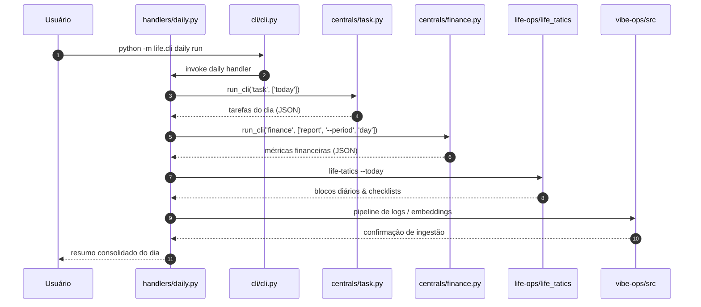
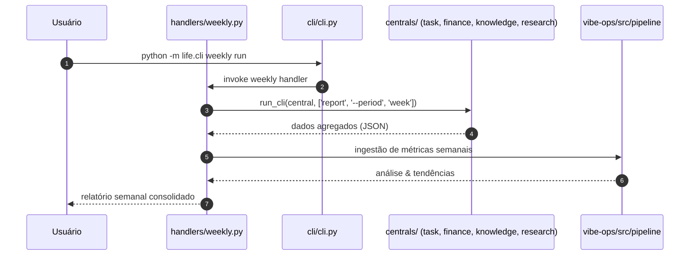

# ÍNDICE PROGRESSIVO — Algorithmic Life OS

> **Mapa mestre de navegação** entre a camada estratégica, tática, operacional e a topologia de código.
> Use este arquivo como *ponto de entrada* para qualquer análise ou modificação no sistema.

---

## 🧭 Como usar este índice

1. **Navegação vertical** → Sonhos → Objetivos → Metas → Tarefas → Atividades (código/ops).
2. **Navegação horizontal** → Saltos entre os documentos de `strategics/` e as camadas técnicas do repositório.
3. **Diagramas** → Mermaid para fluxos relacionais; ASCII para topologia de diretórios.

---

## 1. ARQUITETURA CONCEITUAL (PAE × Estrutura Hierárquica)

### 1.1 Pirâmide de Granularidade

```
                    ┌─────────────┐
                    │   SONHOS    │  ← 6-12 meses  │  #supervisão mensal
                    │  (Estratégia)│
                    └──────┬──────┘
                           │
              ┌────────────┴────────────┐
              │       OBJETIVOS         │  ← 3 meses / 45 dias úteis  │  #revisão quinzenal
              │        (Tático)         │
              └────────────┬────────────┘
                           │
         ┌─────────────────┴─────────────────┐
         │              METAS                │  ← 15 dias / 1 semana  │  #relatórios semanais
         │           (Tático-Operacional)    │
         └─────────────────┬─────────────────┘
                           │
      ┌────────────────────┴────────────────────┐
      │               TAREFAS                   │  ← 5 dias / diário  │  #narrativa + #to-do
      │            (Operacional)                │
      └────────────────────┬────────────────────┘
                           │
         ┌─────────────────┴─────────────────┐
         │           ATIVIDADES / CÓDIGO      │  ← Execução imediata
         │    (life-ops, vibe-ops, centrals)  │
         └─────────────────────────────────────┘
```

### 1.2 Dual-Frame Temporal

| Frame | Base Temporal | Unidade | Foco | Documento Principal |
|-------|---------------|---------|------|---------------------|
| **PAE** | Calendário padrão | Trimestres (Q1-Q4) | Metas mensais, checklists semanais | [[Planejamento (Estratégico e Tático)]] |
| **Estrutura Hierárquica** | Dias úteis | 45 dias úteis (ciclos) | Ondas de 3 semanas, blocos diários | [[Modelagem Operacional]] |

**Proporção Integrada:** `5 Dias Úteis → 3 Semanas → 3 Meses`

---

## 2. MAPEAMENTO DE DOCUMENTOS (Camada Estratégica/Tática)

### 2.1 Navegação por Nível

```
┌─────────────────────────────────────────────────────────────────────────────┐
│                           DOCUMENTOS STRATEGICS                              │
├─────────────────────────────────────────────────────────────────────────────┤
│                                                                             │
│   ┌──────────────────────┐         ┌──────────────────────┐                │
│   │ [[Modelagem          │         │ [[Planejamento       │                │
│   │  Operacional]]       │◄───────►│ (Estratégico e      │                │
│   │  • Pirâmide E/T/O    │         │  Tático)]]           │                │
│   │  • Dual-Frame        │         │  • Arquitetura Dual  │                │
│   │  • 4 Níveis          │         │  • Proporção 5x3x3   │                │
│   └──────────┬───────────┘         └──────────┬───────────┘                │
│              │                                │                            │
│              ▼                                ▼                            │
│   ┌──────────────────────┐         ┌──────────────────────┐                │
│   │ [[Hierarquia de      │         │ [[Desempenho         │                │
│   │  Objetivos]]         │◄───────►│  Subjacente]]        │                │
│   │  • Revisão Semanal   │         │  • Execução 5 dias   │                │
│   │  • Revisão Mensal    │         │  • Análise 3 semanas │                │
│   │  • Templates         │         │  • Planej. 3 meses   │                │
│   └──────────┬───────────┘         └──────────────────────┘                │
│              │                                                             │
│              ▼                                                             │
│   ┌──────────────────────┐         ┌──────────────────────┐                │
│   │ [[Análise (Tático e  │         │ [[Integracao_Tatica]] │                │
│   │  Operacional)]]      │◄───────►│  • Labels & Tags      │                │
│   │  • Micro-Fase        │         │  • Fluxo de Registro  │                │
│   │  • Blocos Diários    │         │  • Formulário Diário  │                │
│   │  • Relatórios        │         │  • Interface Kanban   │                │
│   └──────────────────────┘         └──────────────────────┘                │
│                                                                             │
└─────────────────────────────────────────────────────────────────────────────┘
```

### 2.2 Links de Navegação Rápida

- **Raiz Conceitual**: [[Modelagem Operacional]] — define a pirâmide E/T/O e os 4 níveis de granularidade.
- **Planejamento Macro**: [[Planejamento (Estratégico e Tático)]] — arquitetura dual-frame, proporção 5x3x3, templates trimestrais.
- **Acompanhamento de Metas**: [[Hierarquia de Objetivos]] — revisões semanais e mensais com tabelas de status.
- **Métricas & Performance**: [[Desempenho Subjacente]] — folha de desempenho com dimensões execução/análise/planejamento.
- **Execução Diária**: [[Análise (Tático e Operacional)]] — blocos diários, rotinas inicial/final, relatórios.
- **Integração & Tags**: [[Integracao_Tatica]] — sistema de labels, fluxo de registro por nível, tags de relacionamento.

---

## 3. TOPOLOGIA DO REPOSITÓRIO (Camada Técnica)

### 3.1 Árvore de Diretórios — Visão ASCII

```
life/
│
├── 📁 strategics/          ← CAMADA ESTRATÉGICA (você está aqui)
│   ├── ÍNDICE PROGRESSIVO.md  (este arquivo)
│   ├── Modelagem Operacional.md
│   ├── Planejamento (Estratégico e Tático).md
│   ├── Hierarquia de Objetivos.md
│   ├── Desempenho Subjacente.md
│   ├── Análise (Tático e Operacional).md
│   └── Integracao_Tatica.md
│
├── 📁 cli/                 ← ORQUESTRAÇÃO (entrada do sistema)
│   ├── cli.py              # Typer app principal (life.cli:app)
│   ├── config.py           # LifeConfig, load_config, submodules
│   ├── log.py              # logging utilities
│   └── test_runner.py      # descobre e roda pytest em submódulos
│
├── 📁 handlers/            ← CICLO DE VIDA diário/semanal
│   ├── daily.py            # orquestra centrals para rotina diária
│   └── weekly.py           # orquestra centrals para revisão semanal
│
├── 📁 centrals/            ← DOMÍNIOS (hubs de negócio)
│   ├── base.py             # BaseCentral.run_cli()
│   ├── task.py             # Taskwarrior, scripts, fin_ops
│   ├── finance.py          # fin_ops submodule
│   ├── knowledge.py        # leitura, mindmaps, notes
│   └── research.py         # research submodule
│
├── 📁 plugins/             ← EXTENSIBILIDADE
│   ├── protocol.py         # PluginProtocol (register, hooks)
│   ├── loader.py           # descoberta dinâmica de plugins
│   └── builtin/
│       └── health_check.py # plugin built-in (comando health)
│
├── 📁 life-ops/            ← SUBMÓDULO STANDALONE (táticas de tempo)
│   ├── life_tatics/        # CLI Typer: life-tatics
│   └── planner/            # planejamentos, backlog, reviews
│
├── 📁 vibe-ops/            ← SUBMÓDULO STANDALONE (dados/mesh)
│   ├── src/                # contracts, embeddings, storage, pipeline
│   ├── architecture/       # ADRs, specs
│   └── schema_registry/    # schemas de dados
│
├── 📁 time-tasker/         ← Mirror de strategics + Taskwarrior
│   └── strategics/         # (cópia/local dos docs estratégicos)
│
├── 📁 logs/                ← outputs de execução
└── verify_mesh*.py         # scripts de verificação de integridade
```

### 3.2 Diagrama de Componentes (Mermaid)

```mermaid
graph TD
    subgraph "🖥️ CLI Layer"
        CLI[cli/cli.py<br/>Typer App]
        CFG[cli/config.py<br/>LifeConfig]
        LOG[cli/log.py]
    end

    subgraph "🔄 Handlers (Ciclo de Vida)"
        DAILY[handlers/daily.py]
        WEEKLY[handlers/weekly.py]
    end

    subgraph "🎯 Centrals (Domínios)"
        BASE[centrals/base.py<br/>BaseCentral]
        TASK[centrals/task.py]
        FIN[centrals/finance.py]
        KNOW[centrals/knowledge.py]
        RES[centrals/research.py]
    end

    subgraph "🔌 Plugins"
        PROT[plugins/protocol.py<br/>PluginProtocol]
        LOAD[plugins/loader.py]
        HEALTH[plugins/builtin<br/>health_check.py]
    end

    subgraph "📦 Submódulos Standalone"
        LOPS[life-ops/<br/>life-tatics CLI]
        VOPS[vibe-ops/<br/>data mesh & pipeline]
    end

    subgraph "📚 Strategics (Camada Conceitual)"
        IDX[strategics/<br/>ÍNDICE PROGRESSIVO]
        MOD[[Modelagem Operacional]]
        PLA[[Planejamento (Estratégico e Tático)]]
        HIE[[Hierarquia de Objetivos]]
        DES[[Desempenho Subjacente]]
        ANA[[Análise (Tático e Operacional)]]
        INT[[Integracao_Tatica]]
    end

    CLI --> CFG
    CLI --> LOG
    CLI --> DAILY
    CLI --> WEEKLY
    CLI --> TASK
    CLI --> FIN
    CLI --> KNOW
    CLI --> RES
    CLI --> LOAD

    DAILY --> BASE
    WEEKLY --> BASE
    BASE --> LOPS
    BASE --> VOPS

    LOAD --> PROT
    LOAD --> HEALTH

    IDX -.-> MOD
    IDX -.-> PLA
    IDX -.-> HIE
    IDX -.-> DES
    IDX -.-> ANA
    IDX -.-> INT

    style IDX fill:#ff9900,stroke:#333,stroke-width:2px,color:#000
    style CLI fill:#4a90d9,stroke:#333,color:#fff
    style BASE fill:#7cb342,stroke:#333,color:#fff
```

---

## 4. MODELO RELACIONAL ENTRE CAMADAS

### 4.1 Matriz de Rastreabilidade

| Camada Conceitual | Documento | Camada Técnica | Artefato de Código |
|---|---|---|---|
| **Sonhos** (6-12 meses) | [[Planejamento (Estratégico e Tático)]] | Configuração | `cli/config.py` → `life.yaml` |
| **Objetivos** (3 meses) | [[Planejamento (Estratégico e Tático)]] | Planejador | `life-ops/planner/` |
| **Metas** (15 dias) | [[Hierarquia de Objetivos]] | Táticas | `life-ops/life_tatics/cli.py` |
| **Tarefas** (5 dias) | [[Análise (Tático e Operacional)]] | Task Central | `centrals/task.py` + Taskwarrior |
| **Atividades** (diárias) | [[Integracao_Tatica]] | Daily Handler | `handlers/daily.py` |
| **Relatórios** | [[Desempenho Subjacente]] | Vibe-Ops | `vibe-ops/src/pipeline/` |
| **Revisão** | [[Integracao_Tatica]] | Weekly Handler | `handlers/weekly.py` |

### 4.2 Fluxo de Dados — Execução Diária (Mermaid)



### 4.3 Fluxo de Dados — Revisão Semanal



---

## 5. SISTEMA DE RÓTULOS & NAVEGAÇÃO CRUZADA

### 5.1 Convenção de Labels (usada nos documentos e no código)

```
#[Área]_[Função]_[Tempo]_[Status]

Exemplos:
  #projeto_designio_execucao_diaria_ativo
  #saude_habito_mensal_concluido
  #financas_planejamento_trimestral_em_andamento
```

### 5.2 Hashtags de Revisão (usadas em todos os documentos strategics)

| Tag | Significado | Documento de Origem |
|-----|-------------|---------------------|
| `#supervisão` | Revisão mensal de sonhos | [[Modelagem Operacional]] |
| `#revisão` | Revisão quinzenal de objetivos | [[Hierarquia de Objetivos]] |
| `#relatórios` | Relatórios semanais de metas | [[Desempenho Subjacente]] |
| `#narrativa` | Registro diário reflexivo | [[Análise (Tático e Operacional)]] |
| `#to-do` | Checklists diárias | [[Integracao_Tatica]] |
| `#execucao-semanal` | Foco na execução da semana | [[Hierarquia de Objetivos]] |
| `#execucao-diaria` | Foco na execução do dia | [[Análise (Tático e Operacional)]] |

---

## 6. CHECKLIST DE NAVEGAÇÃO POR OBJETIVO

> Use esta lista para descobrir qual documento ou camada de código consultar.

- [ ] **Quero entender a pirâmide de desempenho e os 4 níveis** → [[Modelagem Operacional]]
- [ ] **Quero planejar um trimestre ou entender o dual-frame PAE vs. Hierárquico** → [[Planejamento (Estratégico e Tático)]]
- [ ] **Quero fazer uma revisão semanal ou mensal com templates** → [[Hierarquia de Objetivos]]
- [ ] **Quero calcular métricas de eficiência e folha de desempenho** → [[Desempenho Subjacente]]
- [ ] **Quero estruturar meu dia, blocos de tempo e rotinas** → [[Análise (Tático e Operacional)]]
- [ ] **Quero entender o sistema de tags, labels e integração tática** → [[Integracao_Tatica]]
- [ ] **Quero modificar ou adicionar um comando ao CLI** → `cli/cli.py` + `centrals/<dominio>.py`
- [ ] **Quero entender como os submódulos se comunicam** → `centrals/base.py` + `cli/config.py`
- [ ] **Quero criar um plugin novo** → `plugins/protocol.py` + `plugins/loader.py`
- [ ] **Quero ver dados/análises automáticas** → `vibe-ops/src/pipeline/` + `handlers/weekly.py`

---

## 7. GLOSSÁRIO RÁPIDO

| Termo | Definição | Onde encontrar |
|-------|-----------|----------------|
| **PAE** | Plano Anual Estratégico (trimestral) | [[Planejamento (Estratégico e Tático)]] |
| **Onda** | Período de 15 dias úteis (3 semanas) | [[Modelagem Operacional]] |
| **Ciclo** | Período de 45 dias úteis | [[Modelagem Operacional]] |
| **Correção do Trajeto** | Revisão após cada onda | [[Planejamento (Estratégico e Tático)]] |
| **Teste de Fogo** | Avaliação após 180 dias úteis | [[Planejamento (Estratégico e Tático)]] |
| **BaseCentral** | Classe base que executa submódulos via subprocess | `centrals/base.py` |
| **PluginProtocol** | Interface para extensões do CLI | `plugins/protocol.py` |
| **LifeConfig** | Configuração central (YAML + defaults) | `cli/config.py` |

---

## 8. HIERARQUIA DE IMPORTS & DEPENDÊNCIAS (Código)

```
cli/cli.py
  ├── cli/config.py ---------------┐
  ├── cli/log.py                   │
  ├── handlers/daily.py            │
  ├── handlers/weekly.py           │
  ├── centrals/task.py             │
  ├── centrals/finance.py          │
  ├── centrals/knowledge.py        │
  ├── centrals/research.py         │
  ├── plugins/loader.py            │
  │   └── plugins/protocol.py      │
  │   └── plugins/builtin/*        │
  │                                │
  └── BaseCentral.run_cli() ----───┘
         │
         ├──► life-ops/life_tatics/cli.py  (standalone)
         ├──► vibe-ops/src/main.py          (standalone)
         └──► fin_ops / research / leitura  (submódulos externos)

REGRA CRÍTICA: life-ops e vibe-ops NÃO devem importar do pacote raiz `life`.
```

---

*Última atualização: 2026-05-15*
*Mantenha este índice sincronizado ao criar novos documentos em `strategics/` ou novos centrals/plugins.*
