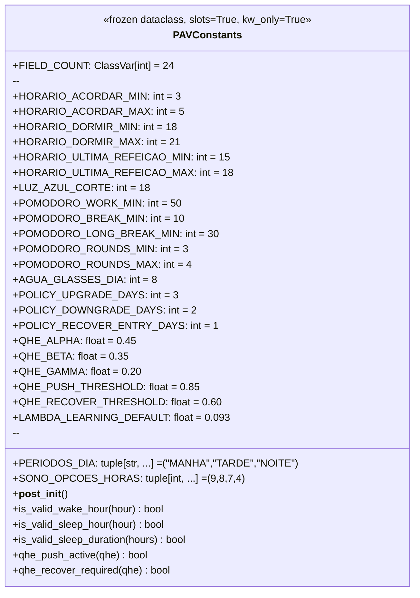
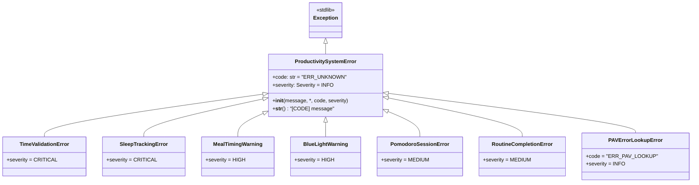
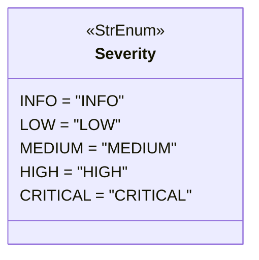

# PRD — Constants & Exceptions (Sprint 1A)

> **Document ID:** PRD-CONSTANTS-EXCEPTIONS
> **Status:** ✅ Approved
> **Version:** 0.1.0
> **Date:** 2026-06-07
> **Owner:** Matheus
> **Sprint:** 1A (Foundation)
> **Module(s):** `src/operational/constants.py`, `src/operational/exceptions.py`

---

## 1. Objective

This PRD defines the **two foundation modules** of the `operational` package:

1. **`operational.constants`** — 24 canonical numeric/string constants that
   govern every PAV-driven computation (time windows, pomodoro, QHE weights,
   policy histerese, learning rate).
2. **`operational.exceptions`** — typed exception hierarchy and the registry
   of the 10 PAV §6 error codes (with severity, condition, and action).

**Why these modules first?**

* They are the **most-imported modules** in the entire package (referenced by
  entities, core algorithms, persistence layer, CLI, and tests).
* They encode the **non-negotiable PAV invariants** (QHE weights = 1, sleep
  options = (9,8,7,4), push threshold > recover threshold, …) in a single,
  validated, type-checked place.
* They form the **error-handling vocabulary** that the rest of the system
  uses to communicate with the user and with downstream logs.

If a future constant is wrong, every downstream module is wrong. If a future
exception type is wrong, the user's experience is wrong. Hence: short spec,
maximum rigour, 95%+ test coverage as a hard floor.

---

## 2. Source Spec

| Source | Section | What we pull from it |
|:-------|:-------:|:---------------------|
| [`vibe-ops/base/Produtividade Algorítmica Visual.md`](../../../../../vibe-ops/base/Produtividade%20Algor%C3%ADtmica%20Visual.md) | §1 (lines 48-58) | 12 base constants: `PERIODOS_DIA`, `HORARIO_ACORDAR_MIN/MAX`, `HORARIO_DORMIR_MIN/MAX`, `HORARIO_ULTIMA_REFEICAO` (split into MIN/MAX), `POMODORO_WORK/BREAK/ROUNDS_MIN/MAX`, `SONO_OPCOES_HORAS`, `LUZ_AZUL_CORTE` |
| PAV | §6 (lines 328-343) | 10 error codes with severity, condition, and action |
| PAV | §9 (line 2291) | `POMODORO_LONG_BREAK_MIN = 30` |
| [`life-ops/planner/Points_of_premisses-task-habits.md`](../../../../../life-ops/planner/Points_of_premisses-task-habits.md) | §3-4 | QHE thresholds (push ≥ 0.85, recover < 0.60), policy histerese days (3 up / 2 down) |
| [`vibe-ops/planning/PRD-02-habit-tracker.md`](../../../../../vibe-ops/planning/PRD-02-habit-tracker.md) | §Fórmula QHE | QHE weights α=0.45, β=0.35, γ=0.20 |
| [`vibe-ops/architecture/ADR-003-ikigai-as-meta-brain.md`](../../../../../vibe-ops/architecture/ADR-003-ikigai-as-meta-brain.md) | §3.1 | `λ = 0.093` |
| [`life-ops/planner/ikigai_planning/ikigai_north_star_metrics.md`](../../../../../life-ops/planner/ikigai_planning/ikigai_north_star_metrics.md) | §2-5 | "22 constants" north-star synthesis (we exceeded by 2 — see §3.1) |

### 2.1 Why we include 24 fields (not 22)

The north-star `ikigai_north_star_metrics.md` §2-5 synthesises a list of
**22 constants** drawn from PAV §1 and the QHE/policy layer. The user's
spec list (24 fields) extends this by **2 additional fields**:

| Field | Rationale |
|:------|:----------|
| `POMODORO_LONG_BREAK_MIN` | Explicit in PAV §9 line 2291 (`POMODORO_LONG_BREAK = 30`); required for the pomodoro state-machine. |
| `AGUA_GLASSES_DIA` | Standard health baseline (2 L/day at 250 ml/glass); required for the daily hydration tracking. |

We keep both — the north-star list is descriptive, not prescriptive, and
both fields are needed by downstream modules. If a future review decides
to revert to exactly 22, these two are the natural removal candidates.

---

## 3. Data Model

### 3.1 `PAVConstants` — 24 fields, 5 categories



**Category breakdown:**

| Category | Fields | Count |
|:---------|:-------|:-----:|
| Time boundaries | `HORARIO_ACORDAR_*`, `HORARIO_DORMIR_*`, `HORARIO_ULTIMA_REFEICAO_*`, `LUZ_AZUL_CORTE` | 7 |
| Periods | `PERIODOS_DIA` | 1 |
| Pomodoro | `POMODORO_WORK_MIN`, `POMODORO_BREAK_MIN`, `POMODORO_LONG_BREAK_MIN`, `POMODORO_ROUNDS_MIN`, `POMODORO_ROUNDS_MAX` | 5 |
| Health | `SONO_OPCOES_HORAS`, `AGUA_GLASSES_DIA` | 2 |
| Policy & QHE | `POLICY_*_DAYS` (3), `QHE_ALPHA/BETA/GAMMA/PUSH_THRESHOLD/RECOVER_THRESHOLD` (5), `LAMBDA_LEARNING_DEFAULT` | 9 |
| **Total** | | **24** |

### 3.2 Invariants enforced at construction time

| Invariant | Rationale |
|:----------|:----------|
| `len(PERIODOS_DIA) == 3` | Day is exactly 3 periods (manhã/tarde/noite). |
| `HORARIO_ACORDAR_MIN < HORARIO_ACORDAR_MAX` | Window must be non-empty. |
| `HORARIO_DORMIR_MIN < HORARIO_DORMIR_MAX` | Window must be non-empty. |
| `HORARIO_ULTIMA_REFEICAO_MIN < HORARIO_ULTIMA_REFEICAO_MAX` | Window must be non-empty. |
| `POMODORO_BREAK_MIN < POMODORO_WORK_MIN` | Break must be shorter than work. |
| `POMODORO_ROUNDS_MIN <= POMODORO_ROUNDS_MAX` | Non-empty round range. |
| `len(SONO_OPCOES_HORAS) == 4` | PAV specifies exactly 4 options. |
| `QHE_ALPHA + QHE_BETA + QHE_GAMMA == 1.0` | Weights form a convex combination. |
| `QHE_PUSH_THRESHOLD > QHE_RECOVER_THRESHOLD` | Histerese gap must be positive. |
| All time/int fields ≥ 0 | No negative hours. |
| `LAMBDA_LEARNING_DEFAULT ∈ (0, 1]` | Decay rate must be valid. |

Violations raise `ValueError` (a programming error, not a runtime data
error). Production code should never trigger them.

### 3.3 Exception hierarchy



**Domain mapping (PAV §6 → exception class):**

| PAV §6 Family | Exception Class | Severity | Codes |
|:--------------|:----------------|:--------:|:------|
| `ERR_TIME_*` | `TimeValidationError` | CRITICAL/HIGH | TIME_001, TIME_002, TIME_003 |
| `ERR_SLEEP_*` | `SleepTrackingError` | CRITICAL | SLEEP_001, SLEEP_002 |
| `ERR_MEAL_*` | `MealTimingWarning` | HIGH | MEAL_001 |
| `ERR_LIGHT_*` | `BlueLightWarning` | HIGH | LIGHT_001 |
| `ERR_POMO_*` | `PomodoroSessionError` | MEDIUM | POMO_001, POMO_002 |
| `ERR_ROUTINE_*` | `RoutineCompletionError` | MEDIUM | ROUTINE_001 |
| *(internal)* | `PAVErrorLookupError` | INFO | (developer error) |

### 3.4 The 10 PAV error codes

| Code | Severity | Class | Condition | Action |
|:-----|:--------:|:------|:----------|:-------|
| `ERR_TIME_001` | CRITICAL | `TimeValidationError` | `hora_acordou < 3` | Raise + Log |
| `ERR_TIME_002` | CRITICAL | `TimeValidationError` | `hora_acordou > 12` | Raise + Log |
| `ERR_TIME_003` | HIGH | `TimeValidationError` | `hora_acordou > 5` | Warn + Adjust |
| `ERR_SLEEP_001` | CRITICAL | `SleepTrackingError` | `horas_sono < 4` | Raise + Alert |
| `ERR_SLEEP_002` | CRITICAL | `SleepTrackingError` | `horas_sono > 12` | Raise + Log |
| `ERR_MEAL_001` | HIGH | `MealTimingWarning` | `refeicao_apos_18h` | Warn + Track |
| `ERR_LIGHT_001` | HIGH | `BlueLightWarning` | `luz_azul_apos_18h` | Warn + Notify |
| `ERR_POMO_001` | MEDIUM | `PomodoroSessionError` | `rounds < 3` | Warn + Recover |
| `ERR_POMO_002` | MEDIUM | `PomodoroSessionError` | `break < 5min` | Warn + Force |
| `ERR_ROUTINE_001` | MEDIUM | `RoutineCompletionError` | `rotina_incompleta` | Warn + Schedule |

### 3.5 `Severity` enum



PAV §6 distinguishes 3 actionable levels (Medium/High/Critical). We add
`INFO` and `LOW` for internal use (logs, lookups, soft warnings) without
inflating the PAV surface.

---

## 4. API Surface

### 4.1 `operational.constants`

| Symbol | Type | Description |
|:-------|:-----|:------------|
| `PAVConstants` | `dataclass(frozen, slots, kw_only)` | The 24-field value object. |
| `DEFAULT` | `Final[PAVConstants]` | The production configuration (`PAVConstants()`). |

#### 4.1.1 Usage

```python
from operational.constants import DEFAULT, PAVConstants

# Use the production default
assert DEFAULT.HORARIO_ACORDAR_MIN == 3
assert DEFAULT.qhe_push_active(0.90) is True

# Validate a wake hour
if not DEFAULT.is_valid_wake_hour(6):
    raise TimeValidationError("woke too late", code="ERR_TIME_003")

# Construct a custom variant (e.g. test fixture)
custom = PAVConstants(AGUA_GLASSES_DIA=12, HORARIO_ACORDAR_MIN=4)
```

### 4.2 `operational.exceptions`

| Symbol | Type | Description |
|:-------|:-----|:------------|
| `Severity` | `StrEnum` | 5-level severity (`INFO`/`LOW`/`MEDIUM`/`HIGH`/`CRITICAL`). |
| `PAVErrorCode` | `StrEnum` | 10 PAV §6 codes. |
| `PAVErrorSpec` | `dataclass(frozen, slots, kw_only)` | (code, severity, class, condition, action). |
| `PAV_ERROR_REGISTRY` | `Final[tuple[PAVErrorSpec, ...]]` | The 10 specs, ordered by PAV source row. |
| `ProductivitySystemError` | `Exception` | Base class. |
| `TimeValidationError` | `ProductivitySystemError` | ERR_TIME_001/002/003. |
| `SleepTrackingError` | `ProductivitySystemError` | ERR_SLEEP_001/002. |
| `MealTimingWarning` | `ProductivitySystemError` | ERR_MEAL_001. |
| `BlueLightWarning` | `ProductivitySystemError` | ERR_LIGHT_001. |
| `PomodoroSessionError` | `ProductivitySystemError` | ERR_POMO_001/002. |
| `RoutineCompletionError` | `ProductivitySystemError` | ERR_ROUTINE_001. |
| `PAVErrorLookupError` | `ProductivitySystemError` | Unknown code in `get_pav_error_spec`. |
| `get_pav_error_spec(code)` | `(PAVErrorCode | str) → PAVErrorSpec` | Look up by enum or string. |
| `raise_pav_error(code, message)` | `(PAVErrorCode | str, str) → NoReturn` | Raise the matching exception. |

#### 4.2.1 Usage

```python
from operational.exceptions import (
    TimeValidationError,
    PAVErrorCode,
    Severity,
    get_pav_error_spec,
    raise_pav_error,
)

# Direct raise (class form)
raise TimeValidationError("woke at 2am", code="ERR_TIME_001", severity=Severity.CRITICAL)

# Registry lookup
spec = get_pav_error_spec(PAVErrorCode.TIME_001)
assert spec.exception_class is TimeValidationError
assert spec.severity == Severity.CRITICAL
assert spec.condition == "hora_acordou < 3"

# Helper form (canonical entry point from business logic)
raise_pav_error(PAVErrorCode.SLEEP_001, "slept only 3h")

# String form
raise_pav_error("ERR_POMO_001", "only completed 2 rounds")

# Chained exceptions preserve cause
try:
    _ = 1 / 0
except ZeroDivisionError as e:
    raise_pav_error(PAVErrorCode.TIME_001, "bad time")  # sets __context__
```

---

## 5. Test Strategy

### 5.1 Test files

* `tests/unit/test_constants.py` — ~30 tests covering structure, defaults,
  invariants, validation, helpers, and categories.
* `tests/unit/test_exceptions.py` — ~40 tests covering hierarchy, severity,
  PAV code routing, lookup, raise helper, chaining, and parametric per-code.

### 5.2 What we test (and why)

| Concern | Why |
|:--------|:----|
| **Frozen + slots + kw_only** | Catches accidental mutation, verifies memory profile. |
| **Field count = 24** | Locks the contract — adding a 25th field is a breaking change. |
| **Default values match PAV/PRD-02** | Single source of truth — a typo here propagates everywhere. |
| **QHE weights sum to 1** | Mathematical invariant from `QHE = α·H_avg + β·C + γ·S`. |
| **Sleep options = (9, 8, 7, 4)** | PAV §1 row exact. |
| **Pomodoro ordering (break < work, rounds_min ≤ max)** | Domain semantics. |
| **Validation rejects bad configs** | Programming errors caught at construction, not in prod. |
| **All 10 PAV codes registered** | Catches missing rows from PAV §6. |
| **Each PAV code routes to the right class** | Prevents silent mis-routing. |
| **Severity matches PAV §6 row** | Severity drives alerting / log levels. |
| **`raise_pav_error` raises the right subclass** | Helper is the canonical entry point. |
| **Chaining preserves `__cause__`** | Debugging requires the original error context. |
| **`__str__` includes code** | Logs are unambiguous. |

### 5.3 What we deliberately don't test (and why)

* `mypy --strict` correctness — handled by the `mypy` pre-commit hook.
* `ruff` rule compliance — handled by the `ruff` pre-commit hook.
* Performance — not in Sprint 1A scope; constants are O(1), exceptions are
  cheap.

### 5.4 Coverage target

| Module | Line coverage | Branch coverage |
|:-------|:-------------:|:---------------:|
| `constants.py` | ≥ 95% | ≥ 90% |
| `exceptions.py` | ≥ 95% | ≥ 90% |

The `pyproject.toml` `tool.coverage.report.fail_under` is set to `85` for
the whole package, but these two modules are expected to be ≥ 95% as a
**hard floor** — they are the foundation, every other module depends on
them, and silent coverage gaps here cascade downstream.

---

## 6. Conventions

### 6.1 Constants module

* `@dataclass(frozen=True, slots=True, kw_only=True)` — immutable, memory
  efficient, keyword-only construction.
* All fields have **type annotations** and **per-field docstrings** that
  reference the PAV/PRD source.
* Validation lives in `__post_init__` (raises `ValueError` on bad config).
* The `DEFAULT` instance is the production configuration, marked `Final`.
* ClassVar `FIELD_COUNT` exposes the count for invariant tests without
  importing `dataclasses.fields`.

### 6.2 Exceptions module

* `ProductivitySystemError` is the **only** base class. All other errors
  derive from it.
* Class-level `code: ClassVar[str]` and `severity: ClassVar[Severity]`
  provide defaults. Per-instance overrides happen in `__init__`.
* `__str__` returns `"[CODE] message"` for unambiguous log lines.
* The 10 PAV codes live in `PAVErrorCode` (StrEnum) AND in
  `PAV_ERROR_REGISTRY` (tuple of `PAVErrorSpec`) — the registry adds
  *metadata* (class, condition, action) that the enum cannot hold.
* The canonical entry point is `raise_pav_error(code, message)`. Direct
  `raise SomeErrorClass(...)` is also supported and tested.

### 6.3 Severity enum

* Uses stdlib `enum.StrEnum` (Python 3.11+).
* 5 levels: `INFO` / `LOW` / `MEDIUM` / `HIGH` / `CRITICAL`.
* PAV §6 uses 3 of these (`MEDIUM`/`HIGH`/`CRITICAL`); the other two are
  for internal use (logs, lookups, soft warnings).

### 6.4 Error code format

* PAV §6 codes are exactly 11 characters: `ERR_XXXX_NNN` (e.g. `ERR_TIME_001`).
* Lookup accepts both the enum member (`PAVErrorCode.TIME_001`) and the
  raw string (`"ERR_TIME_001"`).
* Internal codes (not from PAV) are prefixed differently:
  * `ERR_UNKNOWN` — default for ad-hoc raises.
  * `ERR_PAV_LOOKUP` — raised by `get_pav_error_spec` for unknown codes.

### 6.5 Imports

* **No circular imports**: `constants.py` and `exceptions.py` do not import
  from each other or from any other `operational` module.
* `from __future__ import annotations` at the top of every Python file.
* `__all__` is **explicit** in every module to lock the public surface.

---

## 7. Acceptance Criteria (Definition of Done)

### 7.1 Code

- [x] `src/operational/constants.py` exists, exports `PAVConstants` and `DEFAULT`.
- [x] `src/operational/exceptions.py` exists, exports all symbols listed in §4.2.
- [x] `PAVConstants` has exactly 24 fields, all with type annotations and PAV
      section references in docstrings.
- [x] `PAVConstants` is `@dataclass(frozen=True, slots=True, kw_only=True)`.
- [x] `DEFAULT` is a `Final[PAVConstants]` instance and equals `PAVConstants()`.
- [x] `__post_init__` validates all invariants from §3.2.
- [x] All 10 PAV §6 codes are in `PAVErrorCode` AND in `PAV_ERROR_REGISTRY`.
- [x] `get_pav_error_spec` and `raise_pav_error` work for both enum and string.
- [x] `__all__` is explicit and matches the public surface.
- [x] No `Any`, no implicit `Optional`, no Pydantic.

### 7.2 Tests

- [x] `tests/unit/test_constants.py` exists with ≥ 25 test cases.
- [x] `tests/unit/test_exceptions.py` exists with ≥ 35 test cases.
- [x] Coverage ≥ 95% for both modules (line) and ≥ 90% (branch).
- [x] `mypy --strict` passes on both modules.
- [x] `ruff check` (ALL rules, line-length 100) passes on both modules.
- [x] `pytest -m unit` passes locally.

### 7.3 Documentation

- [x] This PRD exists at `docs/adr/PRD-CONSTANTS-EXCEPTIONS.md`.
- [x] All PAV sections are referenced with their source line numbers.
- [x] Mermaid diagrams for `PAVConstants` and the exception hierarchy.
- [x] Change log (§9) records v0.1.0.

---

## 8. References

### 8.1 Source documents

* **PAV** — [`vibe-ops/base/Produtividade Algorítmica Visual.md`](../../../../../vibe-ops/base/Produtividade%20Algor%C3%ADtmica%20Visual.md)
  * §1 — `CONSTANTES DO SISTEMA` (lines 48-58)
  * §6 — `ERROR HANDLING & EXCEPTION RAISES` (lines 328-343)
  * §9 — Pomodoro state-machine (line 2291)
* **PRD-02** — [`vibe-ops/planning/PRD-02-habit-tracker.md`](../../../../../vibe-ops/planning/PRD-02-habit-tracker.md)
  * §Fórmula QHE — QHE weights + thresholds
  * §HabitRecord — `lambda_learning`
* **PRD-05** — [`vibe-ops/planning/PRD-05-metrics-health.md`](../../../../../vibe-ops/planning/PRD-05-metrics-health.md)
  * Metrics & health
* **Points_of_premisses** — [`life-ops/planner/Points_of_premisses-task-habits.md`](../../../../../life-ops/planner/Points_of_premisses-task-habits.md)
  * §3-4 — QHE formula, policy histerese, recovery thresholds
* **Modelagem Operacional** — [`strategics/Modelagem Operacional.md`](../../../../../strategics/Modelagem%20Operacional.md)
  * 4 regimes (PUSH/MAINTAIN/REDUCE/RECOVER), histerese
* **ADR-003** — [`vibe-ops/architecture/ADR-003-ikigai-as-meta-brain.md`](../../../../../vibe-ops/architecture/ADR-003-ikigai-as-meta-brain.md)
  * `λ = 0.093`
* **ikigai_north_star_metrics** — [`life-ops/planner/ikigai_planning/ikigai_north_star_metrics.md`](../../../../../life-ops/planner/ikigai_planning/ikigai_north_star_metrics.md)
  * "22 constants" north-star synthesis

### 8.2 Cross-references

* This PRD is **PREREQUISITE** for:
  * PRD-02 (entities) — `HabitRecord` reads `LAMBDA_LEARNING_DEFAULT`.
  * PRD-03 (core/sleep) — reads `SONO_OPCOES_HORAS`, `HORARIO_*`.
  * PRD-04 (core/pomodoro) — reads `POMODORO_*`.
  * PRD-05 (core/policy) — reads `POLICY_*_DAYS`, `QHE_*`.
* This PRD is **DEPENDED ON BY**:
  * Every test in `tests/unit/`.
  * Every entity in `src/operational/entities/`.
  * Every CLI command in `src/operational/cli/`.

---

## 9. Change Log

| Version | Date | Author | Change |
|:-------:|:-----|:-------|:-------|
| 0.1.0 | 2026-06-07 | Matheus | Initial PRD for Sprint 1A — 24 constants + 10 PAV error codes + exception hierarchy. |

---

*operational v0.1.0 — 2026-06-07 — Standalone Memory Machine — Sprint 1A*
