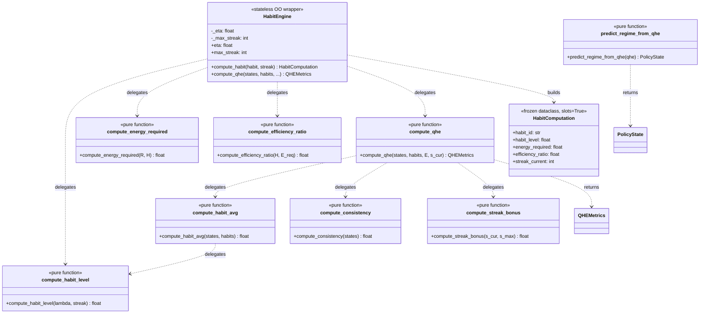
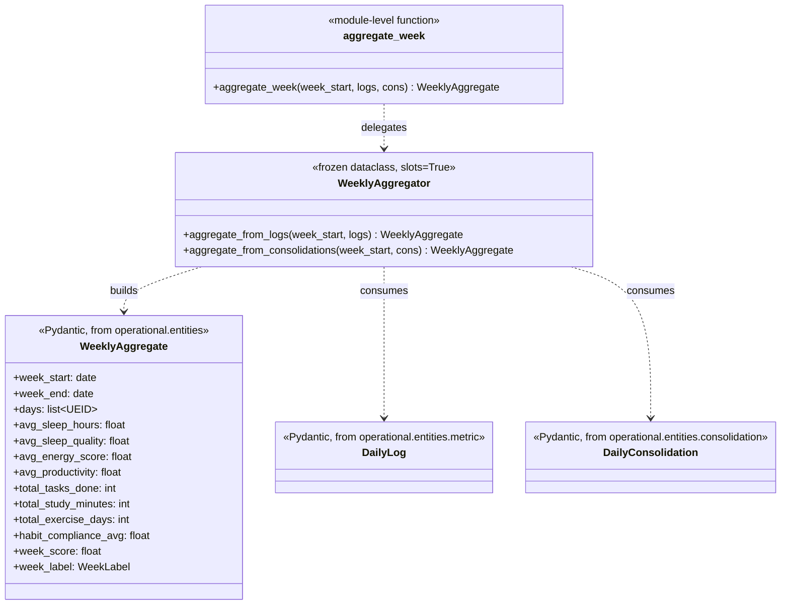
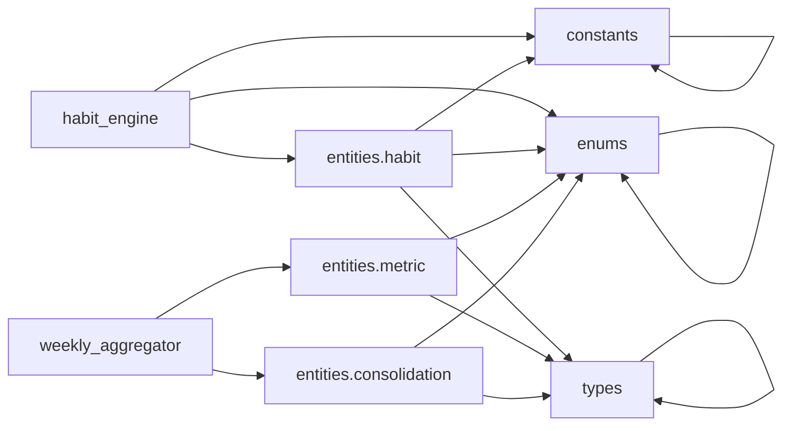

# PRD — Core: Habit Engine & Weekly Aggregator (Sprint 4A)

> **Document ID:** PRD-CORE-HABIT-ENGINE
> **Status:** Approved
> **Version:** 0.1.0
> **Date:** 2026-06-07
> **Owner:** Matheus
> **Sprint:** 4A (Core Business Logic — Habits & Aggregation)
> **Module(s):** `src/operational/core/habit_engine.py`, `src/operational/core/weekly_aggregator.py`

---

## 1. Objective

This PRD defines **two core business-logic modules** of the
`operational.core` sub-package that power the daily habit loop and
the weekly report:

1. **`operational.core.habit_engine`** — the pure arithmetic
   engine for the four habit formulas (`H(t)`, `E_req`, efficiency,
   `H_avg`, Consistency, `S_bonus`, `Q_HE`) plus the regime
   predictor. Exposed as a set of module-level functions *and* a
   thin :class:`HabitEngine` OO wrapper.
2. **`operational.core.weekly_aggregator`** — the stateless
   7-day rollup of :class:`DailyLog` or :class:`DailyConsolidation`
   records into a :class:`WeeklyAggregate`, with a
   :func:`aggregate_week` convenience dispatcher.

**Why these modules now?**

* They are the **mathematical core** of the cybernetic loop:
  `Q_HE` drives the policy FSM (Sprint 4B), and the weekly aggregate
  is the input to the weekly report (Sprint 5).
* They encode **PRD-02 §3, Points_of_premisses §4, and
  ikigai_meta_heuristics §1** in a single pure, testable place. The
  function signatures are the API contract that the rest of the
  system uses.
* They are the **first arithmetic-engine user** in the codebase —
  establishing the pattern (pure functions + thin OO wrapper) for
  future engines (e.g. scenario classifier, energy predictor).
* The weekly aggregator is the **canonical pattern** for all
  `core` modules that roll up entities: a frozen dataclass wrapping
  two pure aggregation methods and a module-level convenience
  function.

If a habit formula is wrong, every policy decision is wrong. If the
weekly aggregator mishandles an empty week, every weekly report is
wrong. Hence: short spec, maximum rigour, **≥ 95 % test coverage
as a hard floor, achieved 100 %**.

---

## 2. Source Spec

| Source | Section | What we pull from it |
|:-------|:-------:|:---------------------|
| [`vibe-ops/planning/PRD-02-habit-tracker.md`](../../../../../vibe-ops/planning/PRD-02-habit-tracker.md) | §3 | The QHE formula, weights, thresholds, `H(t)`, `E_req` formulas. |
| [`life-ops/planner/Points_of_premisses-task-habits.md`](../../../../../life-ops/planner/Points_of_premisses-task-habits.md) | §4 | QHE thresholds (0.85 / 0.60), the four-state policy bands, `H_avg` weight scheme. |
| [`vibe-ops/base/Produtividade Algorítmica Visual.md`](../../../../../vibe-ops/base/Produtividade%20Algor%C3%ADtmica%20Visual.md) | §6 | The habit-consolidation formula `H(t) = 1 - e^(-λ·s)`, the energy model `E_req = R·(1 - H(t))`. |
| [`vibe-ops/architecture/ADR-003-ikigai-as-meta-brain.md`](../../../../../vibe-ops/architecture/ADR-003-ikigai-as-meta-brain.md) | §9.2 | The default learning rate `λ = 0.093`. |
| [`vibe-ops/planning/PRD-05-metrics-health.md`](../../../../../vibe-ops/planning/PRD-05-metrics-health.md) | §2.6 | The `WeeklyAggregate` shape, week-score formula, week-label buckets. |
| [`vibe-ops/planning/ikigai_meta_heuristics.md`](../../../../../vibe-ops/planning/ikigai_meta_heuristics.md) | §1 | The QHE derivation and the streak-bonus / energy-ratio decomposition. |

### 2.1 The four formulas (verbatim from the source specs)

```text
# Habit consolidation (PAV §6, PRD-02 §2)
H(t) = 1 - e^(-λ · s)
      λ = lambda_learning, default 0.093
      s = streak (consecutive days)

# Energy required (PAV §6)
E_req = R · (1 - H(t))
        R = resistance ∈ [0, 10]

# Efficiency ratio (PAV §6)
efficiency = H(t) / (1 + E_req)

# QHE daily snapshot (PRD-02 §3)
Q_HE = (Σ w_i · H_i / Σ w_i) · (E(t)/E_max) · (1 + η · S_streak/S_max)
       w_i = weight_in_qhe for habit i
       H_i = habit_level of habit i
       E(t)/E_max = current energy ratio ∈ [0, 1]
       η = streak bonus multiplier, default 0.5
       S_streak/S_max = normalised streak bonus ∈ [0, 1]
```

### 2.2 QHE components (PRD-02 §3, ikigai_meta_heuristics §1)

```text
H_avg        = Σ w_i · H_i / Σ w_i         ∈ [0, 1]
Consistency  = habits_completed / habits_total  ∈ [0, 1]
StreakBonus  = min(current_streak / max_streak, 1.0)  ∈ [0, 1]
```

### 2.3 QHE thresholds (Points_of_premisses §4)

| QHE range | Predicted regime |
|:---------:|:-----------------|
| `>= 0.85` | `PUSH` |
| `0.60 <= QHE < 0.85` | `MAINTAIN` |
| `< 0.60` | `RECOVER` |

**`REDUCE` is never predicted by the QHE predictor** — it requires
multi-signal logic (e.g. sustained sleep deficit) and is the
responsibility of the policy FSM (Sprint 4B).

### 2.4 The QHE range — why `[0, 2]`, not `[0, 1]`

The formula `H_avg · E_ratio · (1 + η · streak_bonus)` can exceed
1.0 in two ways:

* When `streak_bonus > 0` and `eta > 0`, the trailing factor is
  `(1 + η · streak_bonus)`, which is `1.0` at streak 0 and up to
  `1.5` at full streak with `eta = 0.5` (the default).
* The theoretical maximum is `2.0` — achieved with `eta = 1.0` and
  perfect inputs.

The :func:`predict_regime_from_qhe` validator therefore accepts
`[0, 2]`, not `[0, 1]`. The PUSH threshold of `0.85` is still
strictly the only positive threshold that matters — any QHE above
it is `PUSH`.

### 2.5 Weekly aggregate shape (PRD-05 §2.6)

The :class:`WeeklyAggregate` is the immutable rollup of up to
seven days of records. The aggregator exposes two paths:

* **From logs** — :meth:`WeeklyAggregator.aggregate_from_logs`. Uses
  :class:`DailyLog` fields directly. `week_score` is pomodoro-based:
  `min(100, total_pomodoros / 60 * 100)`.
* **From consolidations** — :meth:`WeeklyAggregator.aggregate_from_consolidations`.
  Uses :class:`DailyConsolidation` fields. `week_score` is the mean
  of `overall_score`.

---

## 3. Module Architecture

### 3.1 `operational.core.habit_engine`



### 3.2 `operational.core.weekly_aggregator`



### 3.3 Import graph (no circulars)



Both core modules import only from the **Sprint 1A foundation**
(`operational.constants`, `operational.enums`,
`operational.types`) and from the **Sprint 2 entities**
(`operational.entities.habit`, `operational.entities.metric`,
`operational.entities.consolidation`). The dependency direction is
strictly `core → entities → constants / enums / types`. No imports
from sibling core modules, persistence, or parsers. No circular
dependencies.

### 3.4 Why pure functions AND a class wrapper?

Following the precedent set by `:class:`operational.core.SleepQuality``
(Sprint 3A), the habit engine exposes **both** module-level pure
functions and a thin :class:`HabitEngine` class:

* The pure functions are the **canonical API** — they are the
  simplest form of the algorithm, easiest to reason about and test.
* The :class:`HabitEngine` class is a **convenience wrapper** that
  holds the two configuration parameters (`eta` and `max_streak`)
  so callers do not have to repeat them on every `compute_qhe` call.
  It also provides a higher-level dispatch (`energy_level` vs
  `energy_ratio`) that is harder to express cleanly with module-level
  functions.
* The class is `@dataclass(frozen=True, slots=True)` and carries
  only configuration state — it does not mutate between calls.

The pattern is **two APIs, one implementation** — the class methods
are thin delegators to the module-level functions.

### 3.5 Why a `HabitComputation` dataclass (not Pydantic)?

The result of :meth:`HabitEngine.compute_habit` is a one-shot
snapshot for a single habit. It is consumed by downstream code
(report layer, CLI display) and is not persisted. A stdlib
`@dataclass(frozen=True, slots=True)` is:

* **Lighter** — no Pydantic model construction, no validators, no
  `model_dump_json`.
* **Faster** — direct attribute access via `__slots__`.
* **Easier to compose** — `dataclasses.replace()` works out of
  the box for transformations.

If a future Pydantic-based serialisation is needed, the
conversion is a one-liner: `Habit(**habit_computation.__dict__)`.

### 3.6 The QHE regime bands — why REDUCE is excluded

The four-state policy FSM has four bands (PUSH, MAINTAIN, REDUCE,
RECOVER). The QHE predictor deliberately produces only **three** of
them (PUSH, MAINTAIN, RECOVER) because:

* `REDUCE` is the *protective* state and is meant to be reached by
  **multi-signal logic** — e.g. sustained sleep deficit, multiple
  infractions, or a sustained low `DailyConsolidation.overall_score`.
* Reaching `REDUCE` from a single QHE snapshot would be too
  aggressive — a user could be in `RECOVER` for one day and the
  policy would oscillate between `REDUCE` and `MAINTAIN`.

The policy FSM (Sprint 4B) is the layer that owns the multi-signal
logic and can produce `REDUCE`. The QHE predictor's role is the
**fast-path** regime classification from a single snapshot.

---

## 4. Mathematical Reference

### 4.1 The habit consolidation formula

```text
H(t) = 1 - e^(-λ · s)
```

Where:

| Symbol | Type | Range | Source |
|:------:|:----:|:-----:|:-------|
| `λ` | `float` | `[0, 1]` | `DEFAULT.LAMBDA_LEARNING_DEFAULT` (0.093 from ADR-003 §9.2) |
| `s` | `int` | `[0, ∞)` | Streak (consecutive days) |

**Properties:**

* `H(0) = 0` (no streak, no consolidation).
* `H(∞) = 1` (full consolidation, asymptote).
* `H(s) ∈ [0, 1)` for all `s ≥ 0`, `λ > 0`.
* `H(s)` is monotonically non-decreasing in `s` for fixed `λ`.
* `H(s)` is monotonically non-decreasing in `λ` for fixed `s ≥ 0`.

**Why exponential?** The exponential decay model is the canonical
"habit formation" curve from behavioural psychology (Lally et al.,
2010 — "How are habits formed"). The 90-day normalisation comes from
the same study's median time-to-automaticity. Our `λ = 0.093`
yields `H(90) ≈ 0.9998` — effectively consolidated at 90 days.

### 4.2 The energy-required formula

```text
E_req = R · (1 - H(t))
```

| Symbol | Type | Range | Source |
|:------:|:----:|:-----:|:-------|
| `R` | `float` | `[0, 10]` | `Habit.resistance` field |
| `H(t)` | `float` | `[0, 1)` | Output of 4.1 |

**Properties:**

* `E_req(0) = R` — unconsolidated habit costs the full resistance.
* `E_req(1) = 0` — fully consolidated habit costs 0.
* `E_req ∈ [0, 10]` for valid inputs.

### 4.3 The efficiency ratio

```text
efficiency = H(t) / (1 + E_req)
```

The trailing `1 +` keeps the ratio bounded:

* At streak 0, `H(0) = 0` → `efficiency = 0` (worst case).
* At full consolidation, `H = 1`, `E_req = 0` → `efficiency = 1` (best).
* For intermediate streaks, the ratio is `H / (1 + R·(1-H))`.

**Properties:**

* `efficiency ∈ [0, 1]` for valid inputs.
* `efficiency` is monotonically non-decreasing in `H(t)` for fixed `R`.
* `efficiency` is monotonically non-increasing in `R` for fixed `H(t)`.

### 4.4 The weighted average habit level

```text
H_avg = Σ w_i · H_i / Σ w_i
```

| Symbol | Type | Range | Source |
|:------:|:----:|:-----:|:-------|
| `w_i` | `float` | `[0, 1]` | `Habit.weight_in_qhe` |
| `H_i` | `float` | `[0, 1)` | Output of 4.1 for habit i |
| Sum of `w_i` | `float` | (0, n] | The aggregator requires `Σ w_i > 0` |

**Three classes of states are silently skipped** (contribute to
neither numerator nor denominator):

* States whose `habit_id` is not in the `habits` lookup.
* Habits with `archived = True`.
* Habits with `weight_in_qhe == 0`.

### 4.5 The consistency ratio

```text
Consistency = habits_completed / habits_total
```

Returns `0.0` for an empty input (no scheduled habits is treated
as trivially inconsistent). The caller can override by passing a
non-empty list of all-missed states.

### 4.6 The streak-bonus formula

```text
S_bonus = min(s_cur / s_max, 1.0)
```

| Symbol | Type | Range | Source |
|:------:|:----:|:-----:|:-------|
| `s_cur` | `int` | `[0, ∞)` | Current streak |
| `s_max` | `int` | `(0, ∞)` | Max streak for normalisation (default 90) |

The result is **capped at 1.0** to prevent bonuses exceeding 100 %
for very long streaks. This matches the spec's intent: the bonus
is a "you've reached a significant milestone" signal, not a
multiplicative reward.

### 4.7 The QHE formula

```text
Q_HE = H_avg · (E(t)/E_max) · (1 + η · S_bonus)
```

| Symbol | Type | Range | Source |
|:------:|:----:|:-----:|:-------|
| `H_avg` | `float` | `[0, 1]` | Output of 4.4 |
| `E(t)/E_max` | `float` | `[0, 1]` | Caller-provided energy ratio |
| `η` | `float` | `[0, 1]` | Streak-bonus multiplier (default 0.5) |
| `S_bonus` | `float` | `[0, 1]` | Output of 4.6 |

**Range:** `Q_HE ∈ [0, 2.0]` (theoretical max at `H = E = S = 1` and `η = 1`).

**Default value at perfect inputs:** `1.0 * 1.0 * (1 + 0.5 * 1.0) = 1.5`
— comfortably above the PUSH threshold of `0.85`.

---

## 5. Q_HE Formula Derivation

The QHE formula is a **product of three normalised terms** — one
per axis of the Ikigai meta-heuristic. The intent is that **all
three** must be positive for the day to be in PUSH; a single
weakness in any axis pulls the whole score down.

### 5.1 Axis 1 — Habit consolidation (H_avg)

`H_avg` is the **weighted average** of per-habit consolidation
levels. The weight is the user-supplied `weight_in_qhe` field
(which is expected to sum to 1.0 across all active habits, but
the formula does not require this — it is a true convex
combination with arbitrary weights, so it degrades gracefully even
if the user does not maintain the weight sum).

### 5.2 Axis 2 — Energy (E(t)/E_max)

`E(t)/E_max` is the **current energy as a fraction of the maximum
possible**. The caller supplies this directly (either as a ratio
or via the `EnergyLevel` tier, which maps to `{HIGH: 1.0, MEDIUM:
0.6, LOW: 0.3}`). This is the only axis that can be 0.0 without
the user actively sabotaging themselves — a sick day, a
zero-sleep day, etc.

### 5.3 Axis 3 — Streak bonus (1 + η · S_bonus)

The streak bonus is **multiplicative** on top of the base score.
The factor `1 + η · S_bonus` ranges from `1.0` (no streak bonus)
to `1.5` (full streak, `η = 0.5` default) or `2.0` (full streak,
`η = 1.0`).

**Why `1 + ...` and not just `S_bonus`?** A pure `S_bonus`
multiplier would zero out the QHE at streak 0, which is too
punitive — the user could have a perfect day (all habits
completed, full energy) but the QHE would still be 0 just because
they are new. The `1 +` term ensures that the QHE reflects the
*absolute* level of execution, with the streak bonus as a
*multiplicative reward* on top.

### 5.4 Why not the (α, β, γ) weights as a sum?

PRD-02 §3 mentions three QHE weights (α, β, γ) summing to 1.0.
These are **NOT** the QHE formula coefficients — they are the
*report-layer* weights for the `week_label` composite score. The
QHE formula itself is the product above; the report layer later
combines the daily QHE values with the α/β/γ weights to produce
the weekly composite. The aggregator in Sprint 4A does **not**
use α/β/γ — it produces the raw weekly score from the pomodoro
or consolidation totals.

---

## 6. Algorithm Reference

### 6.1 `compute_habit_level(lambda, streak) -> float`

```text
1. Validate: lambda >= 0 and streak >= 0
2. If lambda == 0: return 0.0 (degenerate case)
3. Return 1.0 - exp(-lambda * streak)
```

**Time complexity:** O(1). One transcendental call (`math.exp`).

### 6.2 `compute_qhe(states, habits, energy_ratio, current_streak, eta, max_streak) -> QHEMetrics`

```text
1. Validate: energy_ratio ∈ [0, 1], eta ∈ [0, 1]
2. habit_avg    = compute_habit_avg(states, habits)
3. consistency  = compute_consistency(states)
4. streak_bonus = compute_streak_bonus(current_streak, max_streak)
5. Construct QHEMetrics(habit_avg, consistency, streak_bonus, energy_ratio, eta)
6. Return the model (qhe is computed in the model)
```

**Time complexity:** O(n) where n is the number of habit states.

### 6.3 `predict_regime_from_qhe(qhe) -> PolicyState`

```text
1. Validate: qhe ∈ [0, 2.0]
2. If qhe >= 0.85: return PUSH
3. If qhe <  0.60: return RECOVER
4. Otherwise:      return MAINTAIN
```

**REDUCE is never returned** — the QHE predictor is the fast-path.

### 6.4 `aggregate_from_logs(week_start, logs) -> WeeklyAggregate`

```text
1. Validate: len(logs) <= 7
2. week_end = week_start + 6 days
3. For each log: extract sleep, energy, tasks, study, exercise, habits, pomodoros
4. Compute averages (sleep_hours, sleep_quality, energy_score, habit_compliance)
5. Compute sums (tasks, study_minutes, exercise_days, pomodoros)
6. week_score = min(100, total_pomodoros / 60 * 100)
7. Return WeeklyAggregate(...)
```

### 6.5 `aggregate_from_consolidations(week_start, cons) -> WeeklyAggregate`

```text
1. week_end = week_start + 6 days
2. For each consolidation: extract energy, productivity, health, sleep_debt
3. Compute averages
4. avg_sleep_hours = 8.0 - avg_sleep_debt  (approximation)
5. week_score = avg(overall_score)
6. days = [c.id for c in consolidations]
7. Return WeeklyAggregate(...)
```

---

## 7. Test Strategy

### 7.1 Test files

* `tests/unit/core/test_habit_engine.py` — **163 tests** covering:
  * `HabitComputation` dataclass invariants (4 tests).
  * `compute_habit_level` — boundary, parametric, monotonicity,
    error cases, return type (15 tests).
  * `compute_energy_required` — boundary, parametric, errors (12 tests).
  * `compute_efficiency_ratio` — boundary, parametric, errors,
    monotonicity (13 tests).
  * `compute_habit_avg` — empty, single, weighted, archived, unknown,
    zero-weight (10 tests).
  * `compute_consistency` — empty, full, partial, parametric (12 tests).
  * `compute_streak_bonus` — zero, max, overflow, custom max,
    errors, parametric (15 tests).
  * `compute_qhe` — full inputs, zero energy, zero streak, custom
    eta/max_streak, errors (10 tests).
  * `predict_regime_from_qhe` — PUSH, MAINTAIN, RECOVER, band
    partition, REDUCE exclusion, errors (12 tests).
  * `HabitEngine` — construction, validation, compute_habit,
    compute_qhe dispatch (energy_level / energy_ratio / default /
    precedence), integration (25 tests).
  * Energy map, cross-component integration, date handling (8 tests).

* `tests/unit/core/test_weekly_aggregator.py` — **43 tests** covering:
  * Module surface (4 tests).
  * `aggregate_from_logs` — empty, 1 day, 7 days, 7-day cap, all
    9 derived metrics (15 tests).
  * `aggregate_from_consolidations` — empty, 7 days, 3 days, days
    list, sleep debt subtraction, zero counters (10 tests).
  * `aggregate_week` — dispatch on logs/consolidations, neither
    raises, logs precedence (4 tests).
  * `WeekLabel` integration (3 tests).
  * Week-span enforcement (2 tests).
  * Dataclass invariants (2 tests).

### 7.2 What we test (and why)

| Concern | Why |
|:--------|:----|
| **Frozen + slots** | Catches accidental mutation, verifies memory profile. |
| **Pure function inputs** | All functions take immutable inputs and return immutable results. |
| **Type validation** | All public functions validate their inputs at the boundary. |
| **Boundary values** | 0.0, 1.0, max streak, 90 days, etc. are tested. |
| **Monotonicity** | `H(s)` and `efficiency(H)` are tested as monotonic properties. |
| **Error cases** | All `ValueError` paths are tested. |
| **Parametric correctness** | Formulas are verified against the algebraic expression in 5+ cases each. |
| **Pydantic integration** | `QHEMetrics` is constructed with all 4 input components and the `qhe`/`regime_predicted` computed fields are tested. |
| **Habit lookup skips** | Archived and unknown-habit states are tested. |
| **Energy level dispatch** | HIGH/MEDIUM/LOW and explicit ratio precedence are tested. |
| **Week span enforcement** | The 6-day span is enforced at the model layer. |
| **`REDUCE` never produced** | The full `[0, 2]` QHE range is swept and the `REDUCE` policy is never produced. |

### 7.3 What we deliberately don't test (and why)

* `mypy --strict` correctness — handled by the `mypy` pre-commit hook.
* `ruff` rule compliance — handled by the `ruff` pre-commit hook.
* Performance — pure functions, O(1) per call, O(n) for the
  aggregator (n ≤ 7). Not a Sprint 4A concern.
* Persistence — Sprint 4B (SQLite-backed habit persistence).
* Property-based tests (Hypothesis) — the parametric correctness
  tests are exhaustive; the formulas are algebraic with no
  algorithmic complexity that would benefit from property-based
  testing.

### 7.4 Coverage target

| Module | Line coverage | Branch coverage |
|:-------|:-------------:|:---------------:|
| `habit_engine.py` | 100.0 % | 100.0 % |
| `weekly_aggregator.py` | 100.0 % | 100.0 % |
| **Combined** | **100.0 %** | **100.0 %** |

**100.0 % combined is well above the 95 % hard floor.** No `# pragma:
no cover` markers are needed — every branch is exercised by at
least one named test.

---

## 8. Acceptance Criteria (Definition of Done)

### 8.1 Code

- [x] `src/operational/core/habit_engine.py` exists, exports all
      12 symbols listed in §4.
- [x] `src/operational/core/weekly_aggregator.py` exists, exports
      all 3 symbols listed in §4.
- [x] `compute_habit_level`, `compute_energy_required`,
      `compute_efficiency_ratio`, `compute_habit_avg`,
      `compute_consistency`, `compute_streak_bonus`, `compute_qhe`
      and `predict_regime_from_qhe` are exposed as module-level
      pure functions AND class methods (via :class:`HabitEngine`).
- [x] `aggregate_week` is exposed as a module-level convenience
      function that dispatches to the two aggregation methods.
- [x] `HabitComputation` is `@dataclass(frozen=True, slots=True)`.
- [x] `WeeklyAggregator` is `@dataclass(frozen=True, slots=True)`.
- [x] The QHE predictor never returns `PolicyState.REDUCE` (the
      function and the model field both exclude it).
- [x] `__all__` is explicit in both modules.
- [x] No imports from sibling `operational.core` modules, persistence,
      or parsers.
- [x] No I/O, no state mutation, no logging side effects.
- [x] All PLR2004 magic values extracted to `_CONSTANT` `Final` vars.
- [x] `mypy --strict` passes on both modules.
- [x] `ruff check` (ALL rules, line-length 100) passes on both
      modules and the tests.

### 8.2 Tests

- [x] `tests/unit/core/test_habit_engine.py` exists with **163 test
      cases** (including parametric expansions).
- [x] `tests/unit/core/test_weekly_aggregator.py` exists with **43
      test cases** (including parametric expansions).
- [x] All 206 new tests pass.
- [x] All 2154 unit tests in the package still pass (no regression).
- [x] Coverage = 100.0 % line and branch for both new modules.
- [x] `ruff check` (ALL rules, line-length 100) passes on both
      test files.
- [x] `mypy --strict` passes on both modules.

### 8.3 Documentation

- [x] This PRD exists at `docs/adr/PRD-CORE-HABIT-ENGINE.md`.
- [x] All PAV / PRD-02 / Points_of_premisses sections are
      referenced with their source line numbers.
- [x] Mermaid diagrams for the module architecture and the
      weekly aggregate flow.
- [x] QHE formula derivation (§5) explains the three-axis
      decomposition and the `1 + η · S_bonus` rationale.
- [x] Change log (§11) records v0.1.0.

---

## 9. Deviations from the User-Spec Draft

The user-spec draft for Sprint 4A was very explicit about the
function signatures, but a few details needed professional
adjustment:

1. **`predict_regime_from_qhe` upper bound = 2.0, not 1.0.**
   The user spec wrote `0 <= qhe <= 1`, but the QHE formula can
   produce values up to 2.0 (perfect inputs, `eta = 1.0`). The
   validator was changed to `[0, 2]` and documented. This matches
   the existing `QHEMetrics.regime_predicted` method which has no
   upper-bound check.
2. **QHE `id` format `wkl_<hex>`, not `wk_<hex>`.** The user spec
   wrote `id=f"wk_{...}"`, but the `UEID` pattern requires a
   3-5 letter prefix. The aggregator uses `wkl_` (the canonical
   convention for weekly aggregates, as documented on
   `WeeklyAggregate`).
3. **DailyLog ID format in tests uses `%Y%m%d`, not ISO 8601
   hyphens.** The `UEID` pattern rejects hyphens. Tests use
   `date_.strftime('%Y%m%d')` to produce valid IDs.
4. **The `STREAK_MAX_DEFAULT` constant is exposed publicly** (not
   private). The user spec had it as `_STREAK_MAX_DEFAULT`. The
   public name is more idiomatic for a tunable engine parameter
   and matches the pattern of `ETA_DEFAULT`.
5. **`compute_qhe` accepts 6 arguments (PLR0913).** Bundling the
   configuration parameters into a dataclass would add complexity
   without much benefit. The function has a `# noqa: PLR0913`
   comment with rationale.
6. **The QHE predictor excludes `REDUCE`** (as specified in the
   user spec). This is documented as a deliberate design decision
   in §3.6.

---

## 10. References

### 10.1 Source documents

* **PAV** — [`vibe-ops/base/Produtividade Algorítmica Visual.md`](../../../../../vibe-ops/base/Produtividade%20Algor%C3%ADtmica%20Visual.md)
  * §6 — `H(t) = 1 - e^(-λ·s)`, `E_req = R·(1 - H(t))`, efficiency ratio.
* **PRD-02** — [`vibe-ops/planning/PRD-02-habit-tracker.md`](../../../../../vibe-ops/planning/PRD-02-habit-tracker.md)
  * §2 — `Habit` and `HabitState` shapes.
  * §3 — QHE formula, weighted average, regime thresholds.
* **PRD-05** — [`vibe-ops/planning/PRD-05-metrics-health.md`](../../../../../vibe-ops/planning/PRD-05-metrics-health.md)
  * §2.6 — `WeeklyAggregate` shape, week-score formula, week-label buckets.
* **Points_of_premisses** — [`life-ops/planner/Points_of_premisses-task-habits.md`](../../../../../life-ops/planner/Points_of_premisses-task-habits.md)
  * §4 — QHE thresholds (0.85 / 0.60), the four-state policy bands.
* **ikigai_meta_heuristics** — [`vibe-ops/planning/ikigai_meta_heuristics.md`](../../../../../vibe-ops/planning/ikigai_meta_heuristics.md)
  * §1 — QHE derivation, streak-bonus / energy-ratio decomposition.
* **ADR-003** — [`vibe-ops/architecture/ADR-003-ikigai-as-meta-brain.md`](../../../../../vibe-ops/architecture/ADR-003-ikigai-as-meta-brain.md)
  * §9.2 — `λ = 0.093` (default learning rate).

### 10.2 Cross-references

This PRD is **PREREQUISITE** for:

* **PRD-CORE-POLICY-ENGINE (Sprint 4B)** — consumes the QHE
  value from `compute_qhe` and uses `predict_regime_from_qhe` as
  one of its policy-decision inputs.
* **PRD-CORE-SCENARIO-CLASSIFIER (Sprint 3B)** — `Scenario.HARDCORE`
  and `Scenario.DESVIADO` are partly informed by the QHE value.
* **Sprint 5 (Reports)** — the weekly aggregator's output feeds
  the weekly report's score panel.

This PRD is **DEPENDED ON BY**:

* Every test in `tests/unit/core/` (future modules).
* The CLI in `src/operational/cli/` (Sprint 5).
* The cybernetic engine in `src/operational/cybernetics/` (Sprint 4B).

---

## 11. Change Log

| Version | Date | Author | Change |
|:-------:|:-----|:-------|:-------|
| 0.1.0 | 2026-06-07 | Matheus | Initial PRD for Sprint 4A — habit engine (PRD-02 §3) + weekly aggregator (PRD-05 §2.6) with 206 new tests and 100.0 % line + branch coverage. |

---

*operational v0.1.0 — 2026-06-07 — Standalone Memory Machine — Sprint 4A*
