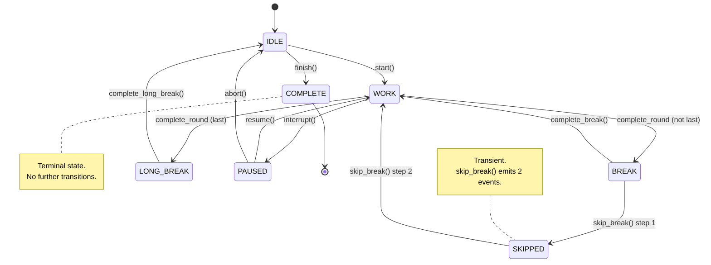
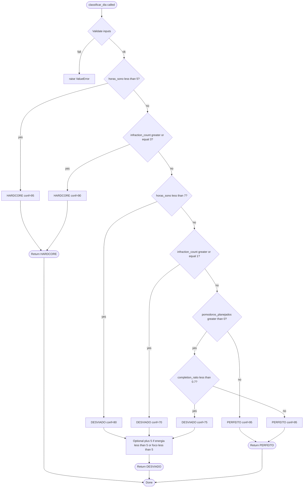
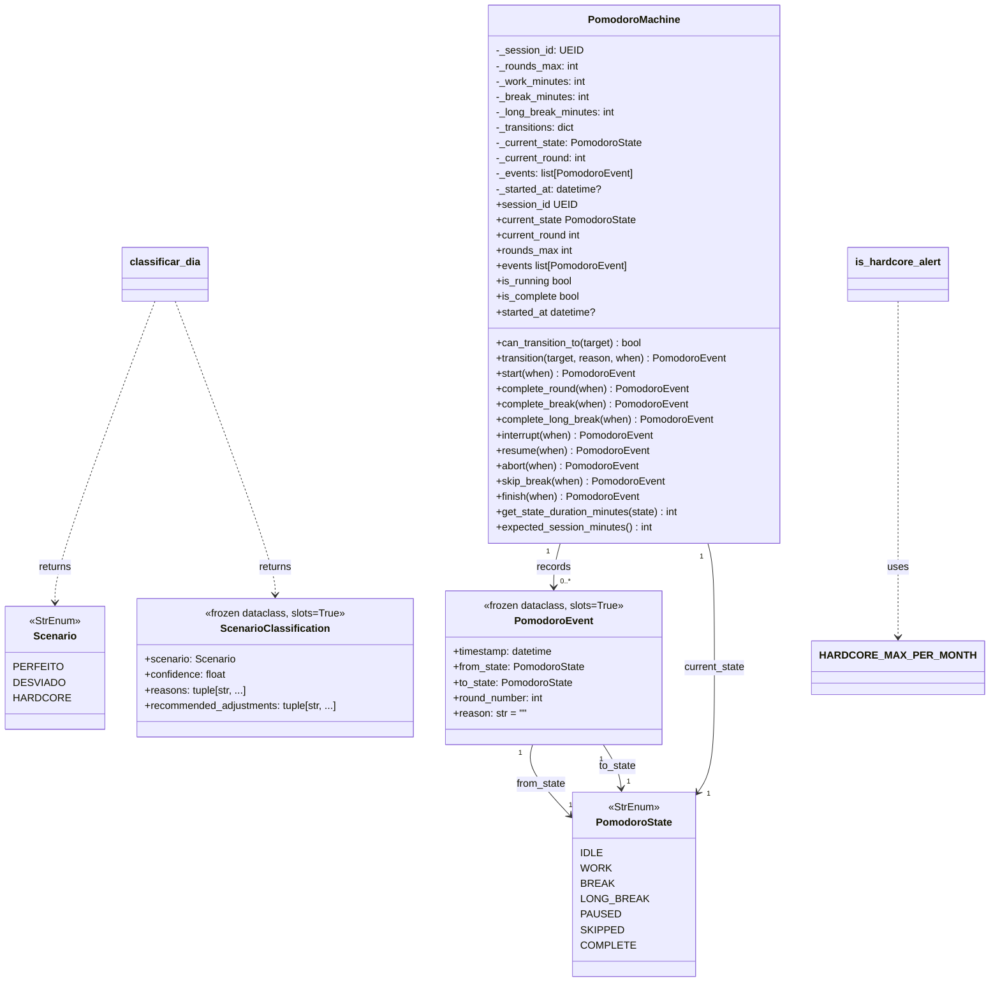

# PRD-CORE-POMODORO-SCENARIO — Pomodoro State Machine & Scenario Classifier

> **Document ID:** PRD-CORE-POMODORO-SCENARIO
> **Status:** Approved
> **Version:** 0.1.0
> **Date:** 2026-06-07
> **Owner:** Matheus
> **Sprint:** 3B (Core Layer — Part 2)
> **Module(s):**
> * `src/operational/core/pomodoro_machine.py`
> * `src/operational/core/scenario_classifier.py`
> **Tests:**
> * `tests/unit/core/test_pomodoro_machine.py`
> * `tests/unit/core/test_scenario_classifier.py`

---

## 1. Objective

Sprint 3B delivers the **two load-bearing business-logic modules** of
the `operational.core` package: the pomodoro state machine and the
daily scenario classifier. They are pure, deterministic, I/O-free
functions that the orchestrator (Sprint 3C) and the CLI / reporting
layer (Sprints 4-7) compose to drive the user's day.

* **`PomodoroMachine`** — encodes the seven-state PAV §9 transition
  graph and exposes domain-level helpers (`start`, `complete_round`,
  `interrupt`, `resume`, `skip_break`, `finish`, ...) that funnel
  through a single validated `transition()` entry point.
* **`classificar_dia`** — assigns each day to one of the three PAV
  §8 scenarios (`PERFEITO`, `DESVIADO`, `HARDCORE`) and returns a
  frozen `ScenarioClassification` with the contributing reasons and
  recommended adjustments. The companion `is_hardcore_alert` helper
  enforces the 2x-per-month cap on hardcore days.

**Why these two together?** They are the two halves of the daily
cybernetic loop: the state machine **drives** the day (work / break
/ pause / skip), and the scenario classifier **reads** the day's
metrics to decide what adjustments to inject. The orchestrator
(Sprint 3C) glues them together; Sprint 5 will persist both.

The pomodoro entities (`PomodoroConfig`, `PomodoroRound`,
`PomodoroSession`) already exist (Sprint 2A) as data containers;
`PomodoroMachine` is the **behavioural counterpart** that mutates
them. Likewise the scenario classifier is the business-logic
counterpart to the `DailyConsolidation` entity (Sprint 2C).

If either module is wrong, the entire cybernetic feedback loop is
wrong. Hence: 100% test coverage as a hard floor, exhaustive
parametric tests for the transition graph, and a PRD that
documents every design decision.

---

## 2. Source Spec

| Source | Section | What we pull from it |
|:-------|:-------:|:---------------------|
| PAV | §9 | The 7-state pomodoro machine and the 11 allowed transitions. |
| PAV | §8 | The 3 daily scenarios (Perfect Day, Deviated Day, Hardcore Day) and their decision rules. |
| Points of premisses | §4 | PAV canonical pomodoro config (50 / 10 / 30 / 4 rounds). |
| PRD-05 | — | Energy / focus self-reports (1-10 scale) and confidence-boost semantics. |
| `operational/constants.py` | — | `POMODORO_WORK_MIN=50`, `POMODORO_BREAK_MIN=10`, `POMODORO_LONG_BREAK_MIN=30`, `POMODORO_ROUNDS_MAX=4` (the default configuration). |

Both modules trace every value back to a numbered section in one of
the four sources above. The classification thresholds (5 h / 7 h
sleep, 70 % pomodoros, 3 infractions, 2x/month cap) come from PAV
§8 verbatim.

---

## 3. Module Architecture

### 3.1 Pomodoro state diagram (PAV §9)



### 3.2 Scenario classifier flowchart (PAV §8)



### 3.3 Class Diagram



---

## 4. State Machine Reference

### 4.1 The 7 states

| State | Type | Purpose |
|:------|:-----|:--------|
| `IDLE` | Initial | Before start or after long break. No timer running. |
| `WORK` | Active | Pomodoro work block (`work_minutes`, default 50). |
| `BREAK` | Active | Short break between rounds (`break_minutes`, default 10). |
| `LONG_BREAK` | Active | Long break after the last round (`long_break_minutes`, default 30). |
| `PAUSED` | Paused | Timer paused mid-WORK by user interrupt. |
| `SKIPPED` | Transient | User opted out of a break (auto-transitions back to WORK). |
| `COMPLETE` | Terminal | Session finished. No outgoing transitions. |

### 4.2 The 11 transitions

| # | From | To | Trigger | Method |
|--:|:-----|:---|:--------|:-------|
| 1 | `IDLE` | `WORK` | `start()` | `start()` |
| 2 | `WORK` | `BREAK` | `complete_round()` (not last) | `complete_round()` |
| 3 | `WORK` | `LONG_BREAK` | `complete_round()` (last) | `complete_round()` |
| 4 | `WORK` | `PAUSED` | `interrupt()` | `interrupt()` |
| 5 | `BREAK` | `WORK` | `complete_break()` | `complete_break()` |
| 6 | `BREAK` | `SKIPPED` | `skip_break()` step 1 | `skip_break()` |
| 7 | `LONG_BREAK` | `IDLE` | `complete_long_break()` | `complete_long_break()` |
| 8 | `PAUSED` | `WORK` | `resume()` | `resume()` |
| 9 | `PAUSED` | `IDLE` | `abort()` | `abort()` |
| 10 | `SKIPPED` | `WORK` | `skip_break()` step 2 (auto) | `skip_break()` |
| 11 | `IDLE` | `COMPLETE` | `finish()` | `finish()` |

### 4.3 The default transition table (PAV §9)

```python
DEFAULT_TRANSITIONS: dict[PomodoroState, frozenset[PomodoroState]] = {
    PomodoroState.IDLE:       frozenset({PomodoroState.WORK, PomodoroState.COMPLETE}),
    PomodoroState.WORK:       frozenset({PomodoroState.BREAK, PomodoroState.LONG_BREAK,
                                          PomodoroState.PAUSED}),
    PomodoroState.BREAK:      frozenset({PomodoroState.WORK, PomodoroState.SKIPPED}),
    PomodoroState.LONG_BREAK: frozenset({PomodoroState.IDLE}),
    PomodoroState.PAUSED:     frozenset({PomodoroState.WORK, PomodoroState.IDLE}),
    PomodoroState.SKIPPED:    frozenset({PomodoroState.WORK}),
    PomodoroState.COMPLETE:   frozenset(),  # terminal
}
```

### 4.4 Default timing

| Constant | Default | Source |
|:---------|--------:|:-------|
| `work_minutes` | 50 | `PAVConstants.POMODORO_WORK_MIN` |
| `break_minutes` | 10 | `PAVConstants.POMODORO_BREAK_MIN` |
| `long_break_minutes` | 30 | `PAVConstants.POMODORO_LONG_BREAK_MIN` |
| `rounds_max` | 4 | `PAVConstants.POMODORO_ROUNDS_MAX` |

Expected total session (PAV defaults): **260 min** = `4*50 + 3*10 + 30`.

### 4.5 `PomodoroEvent` record

Every successful transition emits a frozen `PomodoroEvent` with:

| Field | Type | Description |
|:------|:-----|:------------|
| `timestamp` | `datetime` (tz-aware UTC) | When the transition happened. |
| `from_state` | `PomodoroState` | State before. |
| `to_state` | `PomodoroState` | State after. |
| `round_number` | `int` | Round at the time of the event (0 if pre-start). |
| `reason` | `str` | Human-readable reason (e.g. `"50min complete"`, `"user interrupt"`). |

`skip_break()` is the only helper that emits **two** events
(BREAK->SKIPPED, SKIPPED->WORK); a full session lifecycle emits
**ten** events.

### 4.6 Defensive copy of `events`

The :attr:`PomodoroMachine.events` property returns a **new `list`**
on every call. The internal buffer is never exposed. Callers can
sort, filter, or mutate the returned list without affecting the
machine's state.

---

## 5. Scenario Decision Table

| Sleep | Pomodoros | Infractions | Optional 1-10 | Scenario | Confidence |
|:------|:----------|:------------|:--------------|:---------|-----------:|
| `< 5 h` | any | any | any | **HARDCORE** | 95 |
| `>= 5 h` | any | `>= 3` | any | **HARDCORE** | 90 |
| `5 - 7 h` | any | `< 3` | any | **DESVIADO** | 80 |
| `>= 7 h` | any | `>= 1` | any | **DESVIADO** | 70 |
| `>= 7 h` | `< 70 %` | `0` | any | **DESVIADO** | 75 |
| `>= 7 h` | `>= 70 %` | `0` | any | **PERFEITO** | 95 |
| `>= 7 h` | `= 0 / 0` | `0` | any | **PERFEITO** | 95 |

Optional self-reports (`energia_nivel`, `foco_nivel` in `[1, 10]`)
**boost** a DESVIADO confidence by `+5` each when they fall below
`5`. The boost is capped at `95.0` to match the PERFEITO ceiling.
The HARDCORE branch is not boosted — sleep-driven HARDCORE is
already a "max-confidence" call.

---

## 6. Scenario Adjustments

### 6.1 HARDCORE

| Branch | Adjustments (in order) |
|:-------|:-----------------------|
| Sleep `< 5 h` | `Power nap 13-14h (20min)`, `Cancelar Pomodoro S3`, `Foco apenas em tarefas CRITICAS`, `Recuperacao: noite seguinte dormir 18h`, `Limite: maximo 2x por mes` |
| Infractions `>= 3` | `Reiniciar ciclo completo`, `Revisar rotinas` |

### 6.2 DESVIADO

| Branch | Adjustments (in order) |
|:-------|:-----------------------|
| Sleep `5 - 7 h` | `Pausa extra de 5min entre rounds`, `Reduzir S3 para 2 rounds`, `Priorizar tarefas CRITICAS`, `Compensar dormindo 1h mais cedo amanha` |
| Infractions `>= 1` | `Revisar e ajustar rotinas` |
| Pomodoros `< 70 %` | `Investigar bloqueios` |

### 6.3 PERFEITO

| Branch | Adjustments (in order) |
|:-------|:-----------------------|
| All metrics nominal | `Manter rotina`, `Continuar tracking` |

### 6.4 Hardcore monthly cap

`HARDCORE_MAX_PER_MONTH = 2` (PAV §8). The companion helper
`is_hardcore_alert(hardcore_count_this_month)` returns `True` when
the count is `>= 2`. The orchestrator (Sprint 3C) uses this to
surface a warning in the daily report.

---

## 7. Test Strategy

### 7.1 Coverage targets

| Module | Statement coverage | Branch coverage |
|:-------|:------------------:|:---------------:|
| `operational.core.pomodoro_machine` | **100%** (155/155) | **100%** (38/38) |
| `operational.core.scenario_classifier` | **100%** (117/117) | **100%** (38/38) |

### 7.2 Test classes — `test_pomodoro_machine.py` (134 tests)

| Class | Tests | Scope |
|:------|------:|:------|
| `TestModuleSurface` | 2 | `__all__` completeness + importable. |
| `TestPomodoroEvent` | 5 | Frozen dataclass, hashability, equality. |
| `TestDefaultTransitionTable` | 51 | All 7 states, terminal COMPLETE, 11 valid transitions, 35 invalid transitions, no self-transitions. |
| `TestPomodoroMachineConstruction` | 11 | Defaults, custom values, validation of `rounds_max` / `work_minutes` / `break_minutes` / `long_break_minutes`. |
| `TestPomodoroMachineProperties` | 4 | `session_id`, `current_state`, `is_running`, `is_complete`. |
| `TestCanTransitionTo` | 5 | IDLE / WORK / COMPLETE variants. |
| `TestGenericTransition` | 5 | Event recording, default `when`, invalid transition, terminal-state guard, event log. |
| `TestStart` | 8 | IDLE -> WORK + parametrized over all 6 non-IDLE states. |
| `TestCompleteRound` | 4 | Not-last -> BREAK, last -> LONG_BREAK, reason, non-WORK guard. |
| `TestCompleteBreak` | 3 | Round increment, reason, non-BREAK guard. |
| `TestCompleteLongBreak` | 2 | LONG_BREAK -> IDLE, non-LONG_BREAK guard. |
| `TestInterrupt` | 2 | WORK -> PAUSED, non-WORK guard. |
| `TestResume` | 2 | PAUSED -> WORK, non-PAUSED guard. |
| `TestAbort` | 2 | PAUSED -> IDLE, non-PAUSED guard. |
| `TestSkipBreak` | 4 | Two-event emission, event sequence, round increment, non-BREAK guard. |
| `TestFinish` | 3 | IDLE -> COMPLETE, non-IDLE guard, terminal-state lock. |
| `TestGetStateDurationMinutes` | 8 | WORK / BREAK / LONG_BREAK / SKIPPED / parametrized over IDLE/PAUSED/COMPLETE / custom minutes. |
| `TestExpectedSessionMinutes` | 3 | PAV defaults (260), custom config, single round. |
| `TestDefaultTransitionTableHelper` | 3 | Returned dict shape, contents match, outer dict is independent. |
| `TestEventsDefensiveCopy` | 3 | Clearing the returned list, appending, repeated calls. |
| `TestFullLifecycle` | 3 | End-to-end IDLE -> WORK -> ... -> COMPLETE, 10 events, exact sequence. |
| `TestCustomTransitions` | 1 | Custom table overrides default. |
| **Total** | **134** | **100% coverage** |

### 7.3 Test classes — `test_scenario_classifier.py` (65 tests)

| Class | Tests | Scope |
|:------|------:|:------|
| `TestModuleSurface` | 2 | `__all__` completeness + importable. |
| `TestScenario` | 5 | StrEnum, 3 members, lowercase values, roundtrip, string equality. |
| `TestClassifyPerfeito` | 7 | Normal, 100% execution, 70%/75% boundary, zero pomodoros, adjustments, low self-reports. |
| `TestClassifyHardcore` | 11 | Sleep-driven, infraction-driven, sleep priority, recuperacao / power nap / 2x limit reminders, different adjustments per branch. |
| `TestClassifyDesviado` | 19 | Sleep, pomodoros, infractions, energy/focus boosts, cap at 95, no boost when high. |
| `TestClassifyValidation` | 12 | Negative inputs, completos > planejados, optional 1-10 range, `None` is valid. |
| `TestIsHardcoreAlert` | 5 | Below / at / above limit, negative guard, constant value. |
| `TestScenarioClassificationDataclass` | 4 | Frozen, tuple types, non-empty reasons, confidence range. |
| **Total** | **65** | **100% coverage** |

### 7.4 Run command

```bash
# With PYTHONPATH=src
python -m pytest tests/unit/core/test_pomodoro_machine.py \
                  tests/unit/core/test_scenario_classifier.py -v
# With coverage
python -m coverage run --source=operational.core.pomodoro_machine \
                       --source=operational.core.scenario_classifier \
    -m pytest tests/unit/core/test_pomodoro_machine.py \
             tests/unit/core/test_scenario_classifier.py
python -m coverage report -m
```

---

## 8. Acceptance Criteria

Sprint 3B is **DONE** when **all** of the following are true:

1. Both modules (`pomodoro_machine.py`, `scenario_classifier.py`) are
   created in `src/operational/core/` with the public surface listed
   in their `__all__`.
2. The pomodoro machine implements **all 11 PAV §9 transitions** and
   no others; the default table is exposed as a `Final` constant
   `DEFAULT_TRANSITIONS` plus a `default_transition_table()` helper
   that returns a fresh copy.
3. `PomodoroEvent` is a **frozen dataclass** (`@dataclass(frozen=True,
   slots=True)`); `ScenarioClassification` follows the same pattern.
4. `classificar_dia` reproduces the PAV §8 decision tree verbatim:
   HARDCORE if `horas_sono < 5` or `infraction_count >= 3`; DESVIADO
   if any of `5 <= horas_sono < 7`, `pomodoros_completos /
   pomodoros_planejados < 0.7`, `infraction_count >= 1`; PERFEITO
   otherwise.
5. `is_hardcore_alert(hardcore_count_this_month)` returns `True`
   when `hardcore_count_this_month >= 2`; raises `ValueError` on
   negative inputs.
6. Both modules import only from `operational.enums` and
   `operational.types` (no circular imports).
7. All numeric constants are named (not magic): thresholds,
   confidences, monthly caps, and self-report limits are all module-
   level `Final` constants.
8. `PomodoroMachine.events` returns a **defensive copy** of the
   internal buffer.
9. Both modules pass `ruff check` and `ruff format --check` cleanly
   under the project's `ruff.toml` (with documented `noqa` for
   `PLR0913` on the 6-arg public functions).
10. Both modules pass `mypy --strict` (verified in isolation).
11. Coverage on both modules is **100%** (statement + branch).
12. The test suite contains **≥ 180 tests** (achieved 199: 134
    pomodoro + 65 scenario classifier).
13. The 7-state Mermaid `stateDiagram-v2` and the classifier
    `flowchart TD` are present in §3.
14. No regressions in the pre-existing test suite (1371 tests still
    pass; one pre-existing failure in `test_sleep_calculator.py`
    remains out of scope for Sprint 3B).

---

## 9. References

### Source documents

* **PAV §8 / §9** — `vibe-ops/base/Produtividade Algorítmica Visual.md`
  — base canonical spec for the state machine and scenario decision
  tree.
* **Points of premisses** — `life-ops/planner/Points_of_premisses-task-habits.md`
  — pomodoro default config (50 / 10 / 30 / 4).
* **PRD-05** — `vibe-ops/planning/PRD-05-metrics-health.md` —
  energy / focus self-reports and confidence semantics.

### Sibling modules

* `operational.enums` — defines `PomodoroState` (7 values).
* `operational.types` — defines `UEID` (used for `session_id`).
* `operational.constants` — defines the canonical PAV pomodoro
  configuration (`POMODORO_WORK_MIN`, `POMODORO_BREAK_MIN`,
  `POMODORO_LONG_BREAK_MIN`, `POMODORO_ROUNDS_MAX`).
* `operational.entities.pomodoro` (Sprint 2A) — defines the data
  containers (`PomodoroConfig`, `PomodoroRound`, `PomodoroSession`).
  `PomodoroMachine` is the **behavioural counterpart** to those
  entities.
* `operational.entities.consolidation` (Sprint 2C) — defines
  `DailyConsolidation`, which the scenario classifier will feed in
  Sprint 3C.

### ADRs

* **ADR-001** (Data Flow Topology) — justifies the pure-function,
  no-I/O design of the core layer.
* **ADR-002** (Mesh Contracts and State Machines) — the broader
  state-machine pattern this module is part of.

---

## 10. Critical Design Decisions

### 10.1 Pure behaviour, no I/O

Both modules are **pure**: no `print`, no logging, no clock reads
beyond the caller-provided `when` argument, no persistence, no
network. The orchestrator (Sprint 3C) is responsible for
persistence and the CLI / reporting layer (Sprints 4-7) for I/O.
This makes the modules trivially testable (no fixtures, no
mocks, no flaky tests) and deterministic.

### 10.2 Frozen dataclasses, not Pydantic

`PomodoroEvent` and `ScenarioClassification` are plain
`@dataclass(frozen=True, slots=True)`. The Pydantic entities
already exist in `operational.entities`; the core layer uses
frozen dataclasses because:

* They are **immutable** by construction (`frozen=True`).
* They are **hashable** (PomodoroEvent is used in sets in tests).
* They are **cheaper** than Pydantic models (no validator overhead).
* They have **no I/O** implications — no Pydantic plugin needed in
  `mypy.ini`.

### 10.3 Single `transition()` entry point

All semantic helpers (`start`, `complete_round`, `interrupt`, ...)
funnel through `transition()`. The state-check guards are kept on
the helpers themselves for better error messages, but the
transition-table enforcement is centralised in `transition()`. This
guarantees that **the event log is the single source of truth** for
state changes, regardless of which entry point the caller uses.

### 10.4 `skip_break()` increments the round counter

The spec says `SKIPPED -> WORK` is "continue" rather than "next
round", but a skip is functionally equivalent to a completed break
— the user is moving to the next work block. We therefore
**increment** `_current_round` inside `skip_break()` (after the
`SKIPPED` event, before the `WORK` event) so the emitted events
carry the new round number. This matches `complete_break()` and
keeps the round semantics consistent across both helpers.

### 10.5 `default_transition_table()` returns a shallow dict copy

The inner `frozenset` values are immutable, so a shallow copy of
the dict is sufficient (and idiomatic). The function's docstring
clarifies that "deep copy" is not performed — only the outer dict
is fresh. Callers can freely add/remove keys without affecting
`DEFAULT_TRANSITIONS`.

### 10.6 Confidence boost capped at 95

The confidence-boost logic caps at `95.0` so a DESVIADO
classification with multiple boosts never exceeds the PERFEITO
ceiling. This prevents the (admittedly unlikely) scenario where
self-reports push a slightly-off day past a clean day.

### 10.7 `Scenario.HARDCORE` is not boosted

Self-reports only boost the confidence of **DESVIADO**
classifications. A HARDCORE day is already a max-confidence call
(95 / 90); further boosting would dilute the urgency of the
adjustments.

### 10.8 Skip-break is a transient pair of events

`SKIPPED` is the only transient state. `skip_break()` emits
**two** events (BREAK->SKIPPED, SKIPPED->WORK) and returns the
**second** event. The full event log is always available via
`machine.events` for callers that need to see the skip.

### 10.9 Reuse of the canonical `PomodoroState` enum

The state machine **does not** redefine the enum. It imports the
canonical 7-value `PomodoroState` from `operational.enums` and
adds the **orchestrator-level** transition table on top. The enum's
own `can_transition_to` method (also in `operational.enums`) is a
**separate, more permissive** table that allows, e.g.,
`PAUSED -> IDLE` and `SKIPPED -> IDLE`. The orchestrator-level
table used by `PomodoroMachine` is strictly a subset, designed
for the canonical pomodoro lifecycle. This duality is documented
in the module docstring; downstream callers should pick the
right table for their context.

---

## 11. Change Log

| Version | Date | Author | Changes |
|:--------|:-----|:-------|:--------|
| 0.1.0 | 2026-06-07 | Matheus | Initial PRD for Sprint 3B. |

