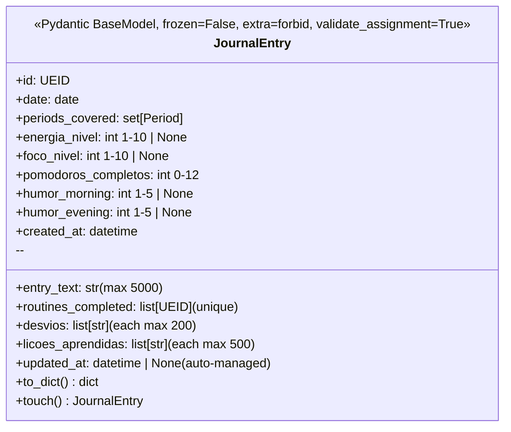
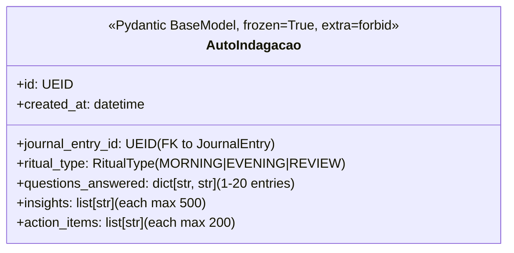
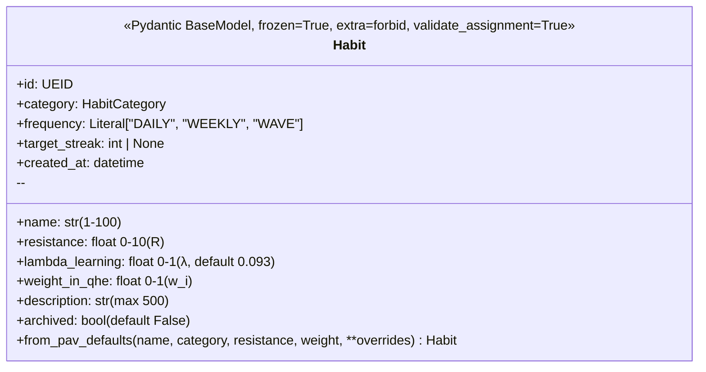
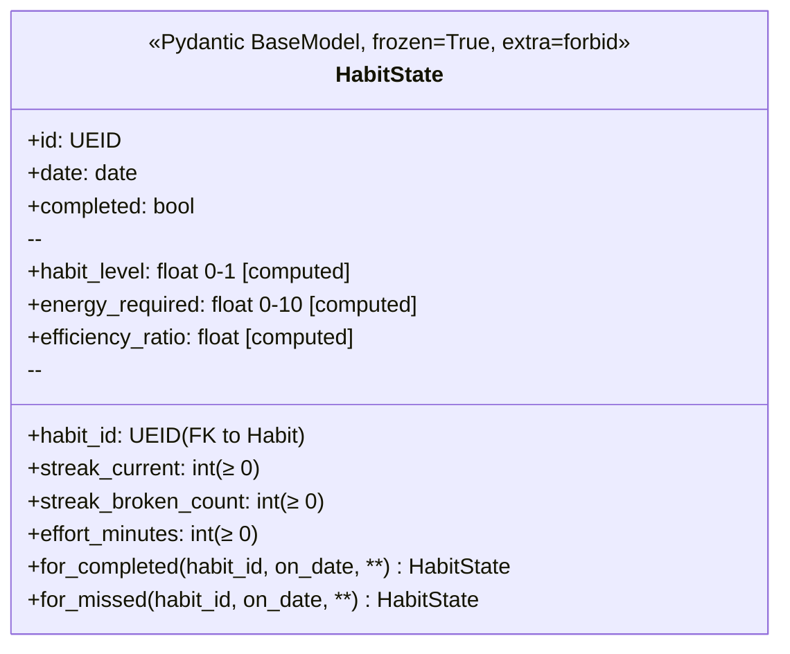
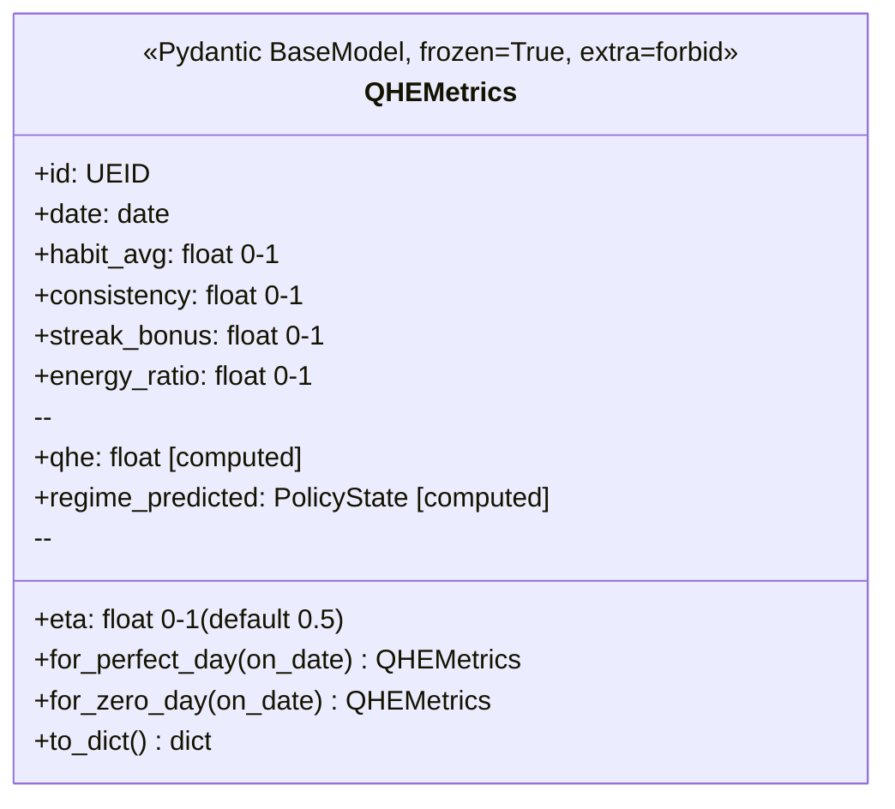

# PRD — Journal & Habit Entities (Sprint 2B)

> **Document ID:** PRD-ENTITIES-JOURNAL-HABIT
> **Status:** ✅ Approved
> **Version:** 0.1.0
> **Date:** 2026-06-07
> **Owner:** Matheus
> **Sprint:** 2B (Entities — Journal & Habit)
> **Module(s):** `src/operational/entities/journal.py`, `src/operational/entities/habit.py`

---

## 1. Objective

This PRD defines **5 Pydantic v2 entity models** that capture the
behavioural layer of the operational package — the daily narrative and
the habit engine:

1. **`JournalEntry`** — the daily narrative (periods covered, routines
   completed, desvios, lições, energy/focus levels, pomodoros, mood).
2. **`AutoIndagacao`** — the socratic self-inquiry ritual (11
   questions for MORNING / EVENING / REVIEW).
3. **`Habit`** — the static definition of a habit (resistance ``R``,
   learning rate ``λ``, weight ``w_i``, frequency).
4. **`HabitState`** — the daily state of a single habit (streak,
   completion, effort) plus 3 computed fields (``habit_level``,
   ``energy_required``, ``efficiency_ratio``).
5. **`QHEMetrics`** — the daily quality-habit-effectiveness snapshot
   (4 inputs + 2 computed fields: ``qhe`` and ``regime_predicted``).

**Why these models now?**

* They are the **data backbone** of every downstream feature:
  * The **handlers** (`daily.py` / `weekly.py`) read & write
    `JournalEntry` and `HabitState`.
  * The **policy FSM** reads `QHEMetrics.regime_predicted` to set the
    operational regime.
  * The **reports** module reads `QHEMetrics` and `Habit` to render
    weekly / monthly dashboards.
  * The **RAG indexer** reads `JournalEntry.entry_text` to embed the
    daily narrative.
* They encode the **PAV §10 journal structure**, the **PRD-02 habit
  engine**, and the **PRD-06 QHE formula** in a single, validated,
  type-checked place.
* They close the gap between the **foundation layer** (Sprint 1A:
  constants, exceptions) and the **orchestration layer** (Sprint 3:
  handlers, persistence, CLI).

If a future model is wrong, every report and every handler is wrong.
Hence: short spec, maximum rigour, **100% line & branch coverage** as
a hard floor.

---

## 2. Source Spec

| Source | Section | What we pull from it |
|:-------|:-------:|:---------------------|
| [`vibe-ops/base/Produtividade Algorítmica Visual.md`](../../../../../vibe-ops/base/Produtividade%20Algor%C3%ADtmica%20Visual.md) | §6 (Habit model) | Habit fields, habit level formula |
| PAV | §10 (Journal) | Journal structure: 12 narrative fields + socratic rituals |
| [`vibe-ops/planning/PRD-02-habit-tracker.md`](../../../../../vibe-ops/planning/PRD-02-habit-tracker.md) | §2 (Habit + HabitState) | `Habit`, `HabitState` shape, fields, constraints |
| PRD-02 | §3 (QHEMetrics) | QHE formula, thresholding, regime prediction |
| [`vibe-ops/planning/PRD-06-policy-fsm.md`](../../../../../vibe-ops/planning/PRD-06-policy-fsm.md) | §Ritual types | MORNING / EVENING / REVIEW |
| [`life-ops/planner/Points_of_premisses-task-habits.md`](../../../../../life-ops/planner/Points_of_premisses-task-habits.md) | §X | QHE formula, weights, regime bands |
| `Análise (Tático e Operacional).md` | §11 | The 11 socratic questions |
| [`vibe-ops/architecture/ADR-003-ikigai-as-meta-brain.md`](../../../../../vibe-ops/architecture/ADR-003-ikigai-as-meta-brain.md) | §3.1 | `λ = 0.093` |
| Cluster PLAN drilldown | — | Routines ↔ JournalEntry linkage |
| [`operational/constants.py`](../adr/PRD-CONSTANTS-EXCEPTIONS.md) | `DEFAULT` | `LAMBDA_LEARNING_DEFAULT`, `QHE_PUSH_THRESHOLD`, `QHE_RECOVER_THRESHOLD` |

### 2.1 Why the socratic question list is captured in tests, not model

The 11 canonical questions from **Análise Tática §11** are not hard-
coded into the `AutoIndagacao` model. Instead, the model accepts a
free-form `dict[str, str]` (capped at 20 entries) and the **test
suite** enumerates the canonical 11 as parametric inputs. This is
deliberate:

* The question text varies by ritual type and by user preference.
* The model is reusable for ad-hoc socratic journaling outside the
  11-question canon.
* The canon itself lives in **`tests/unit/entities/test_journal.py`**
  as parametric `parametrize` data.

---

## 3. Data Model

### 3.1 `JournalEntry`



**Mutability contract:**

* `frozen=False` — the model can be mutated post-construction.
* `validate_assignment=True` — every assignment re-runs validators.
* `updated_at` is auto-managed by a `@model_validator(mode="after")`
  that uses `object.__setattr__` to bypass the `validate_assignment`
  handler (avoiding infinite recursion).
* `to_dict()` serialises `periods_covered` (a `set`) as a sorted list
  for deterministic JSON output.
* `touch()` manually refreshes `updated_at` to `datetime.now(tz=UTC)`.

### 3.2 `AutoIndagacao`



**Immutability contract:**

* `frozen=True` — once written, an `AutoIndagacao` cannot be mutated.
* `ritual_type` is restricted to the **3 journal-level rituals**
  (`MORNING` / `EVENING` / `REVIEW`) by a custom
  `@field_validator`. The other 3 `RitualType` members
  (`HYDRATION` / `MEDITATION` / `SHUTDOWN`) are routine-internal tags
  and are rejected at construction.
* `questions_answered` is bounded to **1-20 entries** (the 11
  canonical questions + 9 of headroom for custom prompts).

### 3.3 `Habit`



**Immutability contract:**

* `frozen=True` — habits are immutable. To "edit" a habit, archive the
  old one and create a new one.
* `name` cannot be empty or whitespace-only (enforced by
  `@field_validator` on top of `min_length=1`).
* `lambda_learning` defaults to `DEFAULT.LAMBDA_LEARNING_DEFAULT`
  (= 0.093 from ADR-003).
* `from_pav_defaults` is a factory that pre-fills ``id`` (random
  12-char hex), ``lambda_learning`` (default λ), ``created_at``
  (``datetime.now(tz=UTC)``) and ``archived=False``.

### 3.4 `HabitState`



**Computed fields:**

* `habit_level` = `1 - exp(-λ * streak_current)` where λ is the
  canonical default (`DEFAULT.LAMBDA_LEARNING_DEFAULT` = 0.093).
* `energy_required` = `R * (1 - habit_level)` where R is a placeholder
  `5.0` (midpoint of [0, 10]).
* `efficiency_ratio` = `habit_level / (1 + energy_required)`.

> **Why the placeholders for λ and R?**  `HabitState` is intentionally
> a **leaf entity** with no cross-entity reference to `Habit`. The
> aggregator at the application layer is expected to recompute the
> computed fields with the actual parent-habit values. The
> computed fields are useful for ad-hoc reporting and tests even with
> the placeholder values. See §8.2 for the alternative
> implementation strategy.

**Factories:**

* `for_completed(habit_id, on_date, *, streak_current=1, effort_minutes=0)`
* `for_missed(habit_id, on_date, *, streak_current=0, streak_broken_count=0)`

Both produce an `id` of the form `"hst_<habit>_<yyyymmdd>"`.

### 3.5 `QHEMetrics`



**Computed fields:**

* `qhe` = `habit_avg * energy_ratio * (1 + eta * streak_bonus)`.
* `regime_predicted`:
  * `qhe >= DEFAULT.QHE_PUSH_THRESHOLD` (0.85) → `PolicyState.PUSH`.
  * `qhe < DEFAULT.QHE_RECOVER_THRESHOLD` (0.60) → `PolicyState.RECOVER`.
  * Otherwise → `PolicyState.MAINTAIN`.

> **Why is `PolicyState.REDUCE` never predicted by the QHE
> snapshot?**  The QHE value does not directly encode the
> "physiological load" that triggers REDUCE (e.g. sleep deficit).
> REDUCE is reached only by explicit domain logic that reads multiple
> signals (QHE + sleep + infractions) — see PRD-06 for the full FSM.

**Factories:**

* `for_perfect_day(on_date)` — all inputs = 1.0 → QHE = 1.5 → PUSH.
* `for_zero_day(on_date)` — all inputs = 0.0 → QHE = 0.0 → RECOVER.

---

## 4. Field Reference

### 4.1 `JournalEntry` (13 fields, 3 validators)

| Field | Type | Constraint | Default | Notes |
|:------|:-----|:-----------|:--------|:------|
| `id` | `UEID` | pattern `^[a-z]{3,5}_[a-z0-9_]+$` | — (required) | Convention: `"day_YYYY_MM_DD"` |
| `date` | `date` | — | — (required) | Calendar date (local) |
| `entry_text` | `str` | max 5000 chars, whitespace stripped | `""` | Free-form narrative |
| `periods_covered` | `set[Period]` | elements ∈ `Period` | `set()` | Dedup is automatic |
| `routines_completed` | `list[UEID]` | unique (validator) | `[]` | Order preserved |
| `desvios` | `list[str]` | each max 200 chars | `[]` | "Ajustes finos" |
| `licoes_aprendidas` | `list[str]` | each max 500 chars | `[]` | Lessons learned |
| `energia_nivel` | `int \| None` | 1 ≤ n ≤ 10 | `None` | Subjective energy |
| `foco_nivel` | `int \| None` | 1 ≤ n ≤ 10 | `None` | Subjective focus |
| `pomodoros_completos` | `int` | 0 ≤ n ≤ 12 | `0` | Completed pomodoros |
| `humor_morning` | `int \| None` | 1 ≤ n ≤ 5 | `None` | Morning mood |
| `humor_evening` | `int \| None` | 1 ≤ n ≤ 5 | `None` | Evening mood |
| `created_at` | `datetime` | — | — (required) | Wall-clock at construction |
| `updated_at` | `datetime \| None` | — | `None` | **Auto-managed** by validator |

**Validators:**

* `_validate_unique_routines` — rejects duplicate `UEID` in
  `routines_completed`.
* `_auto_set_updated_at` (`@model_validator(mode="after")`) — refreshes
  `updated_at` to `datetime.now(tz=UTC)` on construction and on every
  assignment.

### 4.2 `AutoIndagacao` (7 fields, 2 validators)

| Field | Type | Constraint | Default | Notes |
|:------|:-----|:-----------|:--------|:------|
| `id` | `UEID` | pattern | — (required) | Convention: `"ind_..."` |
| `journal_entry_id` | `UEID` | pattern | — (required) | FK to `JournalEntry` |
| `ritual_type` | `RitualType` | ∈ {MORNING, EVENING, REVIEW} | — (required) | Validator restricts to 3 |
| `questions_answered` | `dict[str, str]` | 1-20 entries; key max 200; value max 1000 | — (required) | Q → A mapping |
| `insights` | `list[str]` | each max 500 | `[]` | Extracted insights |
| `action_items` | `list[str]` | each max 200 | `[]` | Concrete next steps |
| `created_at` | `datetime` | — | — (required) | Wall-clock at construction |

**Validators:**

* `_validate_ritual_type` — restricts to 3 journal-level rituals.
* `_validate_questions_answered` — rejects empty and > 20 entries.

### 4.3 `Habit` (12 fields, 1 validator)

| Field | Type | Constraint | Default | Notes |
|:------|:-----|:-----------|:--------|:------|
| `id` | `UEID` | pattern | — (required) | Convention: `"hab_<slug>"` |
| `name` | `str` | 1-100, not blank | — (required) | Validator strips & checks |
| `category` | `HabitCategory` | ∈ enum | — (required) | PHYSIOLOGICAL/COGNITIVE/... |
| `resistance` | `float` | 0 ≤ r ≤ 10 | — (required) | `R` in E_req = R(1-H) |
| `lambda_learning` | `float` | 0 ≤ λ ≤ 1 | `DEFAULT.LAMBDA_LEARNING_DEFAULT` (= 0.093) | `λ` in H = 1 - e^{-λs} |
| `weight_in_qhe` | `float` | 0 ≤ w ≤ 1 | — (required) | `w_i` in QHE aggregator |
| `frequency` | `Literal["DAILY", "WEEKLY", "WAVE"]` | — | `"DAILY"` | WAVE = 15-day cycle |
| `target_streak` | `int \| None` | ≥ 0 | `None` | For streak-bar colouring |
| `description` | `str` | max 500 | `""` | Free-form notes |
| `created_at` | `datetime` | — | — (required) | Wall-clock at construction |
| `archived` | `bool` | — | `False` | Archival flag |

**Validators:**

* `_validate_name_not_blank` — strips whitespace, rejects empty.

### 4.4 `HabitState` (7 fields, 0 validators, 3 computed)

| Field | Type | Constraint | Default | Notes |
|:------|:-----|:-----------|:--------|:------|
| `id` | `UEID` | pattern | — (required) | Convention: `"hst_<habit>_<yyyymmdd>"` |
| `habit_id` | `UEID` | pattern | — (required) | FK to `Habit` |
| `date` | `date` | — | — (required) | Calendar date |
| `completed` | `bool` | — | — (required) | Completion flag |
| `streak_current` | `int` | ≥ 0 | `0` | Current consecutive-days streak |
| `streak_broken_count` | `int` | ≥ 0 | `0` | Lifetime broken-streak count |
| `effort_minutes` | `int` | ≥ 0 | `0` | Actual effort spent |

**Computed fields:**

* `habit_level: float` — `1 - exp(-DEFAULT.LAMBDA_LEARNING_DEFAULT * streak_current)`.
* `energy_required: float` — `5.0 * (1 - habit_level)` (placeholder R = 5.0).
* `efficiency_ratio: float` — `habit_level / (1 + energy_required)`.

### 4.5 `QHEMetrics` (6 fields, 0 validators, 2 computed)

| Field | Type | Constraint | Default | Notes |
|:------|:-----|:-----------|:--------|:------|
| `id` | `UEID` | pattern | — (required) | Convention: `"qhe_<yyyymmdd>"` |
| `date` | `date` | — | — (required) | Calendar date |
| `habit_avg` | `float` | 0 ≤ x ≤ 1 | — (required) | Weighted H(t) average |
| `consistency` | `float` | 0 ≤ x ≤ 1 | — (required) | % habits completed |
| `streak_bonus` | `float` | 0 ≤ x ≤ 1 | — (required) | `avg_streak / max_streak` |
| `energy_ratio` | `float` | 0 ≤ x ≤ 1 | — (required) | `E(t) / E_max` |
| `eta` | `float` | 0 ≤ x ≤ 1 | `0.5` | Streak-bonus multiplier |

**Computed fields:**

* `qhe: float` — `habit_avg * energy_ratio * (1 + eta * streak_bonus)`.
* `regime_predicted: PolicyState` — see §3.5.

---

## 5. Computed Fields

| Model | Field | Formula | Range | Source |
|:------|:------|:--------|:------|:-------|
| `HabitState` | `habit_level` | `1 - exp(-λ * streak)` | `[0, 1]` | PAV §6 |
| `HabitState` | `energy_required` | `R * (1 - habit_level)` | `[0, R_max]` | PAV §6 |
| `HabitState` | `efficiency_ratio` | `habit_level / (1 + energy_required)` | `[0, 1]` | PAV §6 (derived) |
| `QHEMetrics` | `qhe` | `habit_avg * energy_ratio * (1 + eta * streak_bonus)` | `[0, 2]` (typical `[0, 1]`) | PRD-02 §3 |
| `QHEMetrics` | `regime_predicted` | see §3.5 | `PolicyState` | PRD-06 |

All computed fields use `@computed_field` + `@property` and are
auto-included in `model_dump_json()`.

---

## 6. Validators

| Entity | Validator | Mode | Purpose |
|:-------|:----------|:-----|:--------|
| `JournalEntry` | `_validate_unique_routines` | `@field_validator` | Reject duplicate `routines_completed` UEIDs |
| `JournalEntry` | `_auto_set_updated_at` | `@model_validator(mode="after")` | Auto-refresh `updated_at` |
| `AutoIndagacao` | `_validate_ritual_type` | `@field_validator` | Restrict to MORNING/EVENING/REVIEW |
| `AutoIndagacao` | `_validate_questions_answered` | `@field_validator` | Reject empty / > 20 entries |
| `Habit` | `_validate_name_not_blank` | `@field_validator` | Reject whitespace-only names |

> **Why `object.__setattr__` in `JournalEntry._auto_set_updated_at`?**
> `validate_assignment=True` causes Pydantic to re-run
> `__setattr__` through the validator handler, which would trigger
> the very `@model_validator` we are inside → infinite recursion.
> `object.__setattr__` bypasses Pydantic's setter and writes directly
> to the instance `__dict__`. This is the **Pydantic-recommended**
> pattern for self-mutating validators.

---

## 7. Factories

| Entity | Factory | Signature | Purpose |
|:-------|:--------|:----------|:--------|
| `Habit` | `from_pav_defaults` | `(name, category, resistance, weight_in_qhe, **overrides)` | Pre-fill PAV defaults |
| `HabitState` | `for_completed` | `(habit_id, on_date, *, streak_current=1, effort_minutes=0)` | Build a completed state |
| `HabitState` | `for_missed` | `(habit_id, on_date, *, streak_current=0, streak_broken_count=0)` | Build a missed state |
| `QHEMetrics` | `for_perfect_day` | `(on_date)` | All inputs = 1.0 → PUSH |
| `QHEMetrics` | `for_zero_day` | `(on_date)` | All inputs = 0.0 → RECOVER |

All factories return a fully-validated model instance with a
deterministic `id` derived from the inputs (no `uuid` calls in
state/metrics factories).

---

## 8. Formulas

### 8.1 Habit consolidation

```math
H(t) = 1 - e^{-\lambda s}
```

Where `λ` is the habit's `lambda_learning` and `s` is the current
streak. With the default `λ = 0.093`:

| Streak (days) | H(t)        |
|--------------:|------------:|
|             0 | 0.0000      |
|             7 | 0.4766      |
|            30 | 0.9377      |
|            90 | 0.9998      |
|           365 | ≈ 1.0000    |

### 8.2 Energy required

```math
E_{req} = R \cdot (1 - H(t))
```

With `R = 5.0` (placeholder) and the default `λ`:

| Streak (days) | H(t)  | E_req |
|--------------:|------:|------:|
|             0 | 0.000 | 5.000 |
|             7 | 0.477 | 2.617 |
|            30 | 0.938 | 0.312 |
|            90 | 1.000 | 0.001 |

### 8.3 QHE

```math
Q_{HE} = \left(\frac{\sum_i w_i H_i}{\sum_i w_i}\right) \cdot
         \left(\frac{E(t)}{E_{max}}\right) \cdot
         \left(1 + \eta \cdot S_{bonus}\right)
```

The 4 input fields exposed by `QHEMetrics` are the 3 pre-computed
factors: `habit_avg` (the weighted H average), `energy_ratio` (the
energy factor), and `streak_bonus` (the streak factor). `eta` is the
configurable multiplier (default 0.5).

**Regime prediction:**

| QHE value range | `regime_predicted` |
|:----------------|:-------------------|
| `QHE ≥ 0.85`    | `PolicyState.PUSH` |
| `0.60 ≤ QHE < 0.85` | `PolicyState.MAINTAIN` |
| `QHE < 0.60`    | `PolicyState.RECOVER` |
| (n/a)           | `PolicyState.REDUCE` (never from QHE alone) |

---

## 9. Test Strategy

### 9.1 Test files

* `tests/unit/entities/test_journal.py` — 73 tests for `JournalEntry`
  and `AutoIndagacao`.
* `tests/unit/entities/test_habit.py` — 134 tests for `Habit`,
  `HabitState`, and `QHEMetrics`.
* **Total: 207 tests.**

### 9.2 What we test (and why)

| Concern | Why |
|:--------|:----|
| **Construction with required + optional fields** | Catches required-field regressions. |
| **Field range / length boundaries** | Locks the contract — silently changing `max_length=5000` to `5001` is a breaking change. |
| **Validator rejections (duplicates, blanks, wrong enum, out-of-range)** | Validators are the invariants — they must fire on bad input. |
| **`extra="forbid"` rejects unknown fields** | Catches typos in field names and accidental schema drift. |
| **Frozen-model immutability** | The contract: a `Habit` / `HabitState` / `AutoIndagacao` cannot be mutated in place. |
| **Mutable-model timestamp refresh** | `JournalEntry.updated_at` must auto-refresh on construction **and** on every assignment. |
| **Computed-field math** | `H(t)`, `E_req`, efficiency, QHE — derived from the spec formulas, with parametric test data. |
| **QHE → regime mapping** | Locks the threshold semantics at 0.60 / 0.85 (boundary, just-above, just-below). |
| **Factory round-trip** | `for_completed`, `for_missed`, `for_perfect_day`, `for_zero_day`, `from_pav_defaults` produce well-formed instances. |
| **JSON round-trip** | `model_dump_json()` → `model_validate_json()` is lossless (excluding computed fields, since `extra="forbid"` rejects them on re-parse). |
| **Cross-entity JSON bundle** | A bundle of `JournalEntry` + `AutoIndagacao` survives a JSON encode/decode. |

### 9.3 What we deliberately don't test (and why)

* `mypy --strict` correctness — handled by the `mypy` pre-commit hook.
  (Note: the project's `mypy.ini` has a pre-existing parsing error
  that prevents it from being applied to source; we verified `mypy
  --strict` manually on our files.)
* `ruff` rule compliance — handled by the `ruff` pre-commit hook.
* Performance — not in Sprint 2B scope; entities are O(1).
* Property-based testing — reserved for Sprint 3 (handlers, policy
  FSM).

### 9.4 Coverage target

| Module | Line coverage | Branch coverage |
|:-------|:-------------:|:---------------:|
| `entities/journal.py` | **100%** | **100%** |
| `entities/habit.py` | **100%** | **100%** |

The `pyproject.toml` `tool.coverage.report.fail_under` is set to `85`
for the whole package, but these two entity modules are expected to
be **100% / 100%** as a **hard floor** — they are the data backbone,
every other module depends on them, and silent coverage gaps here
cascade downstream.

---

## 10. Acceptance Criteria (Definition of Done)

### 10.1 Code

- [x] `src/operational/entities/journal.py` exists, exports `JournalEntry` and
      `AutoIndagacao`.
- [x] `src/operational/entities/habit.py` exists, exports `Habit`, `HabitState`,
      and `QHEMetrics`.
- [x] All 5 entities use Pydantic v2 `ConfigDict(frozen=..., extra="forbid",
      validate_assignment=...)` (or `frozen=False` for `JournalEntry`).
- [x] All entities have type-hinted fields, Google-style docstrings,
      and explicit `__all__`.
- [x] No circular imports — entities are leaves (only import from
      `operational.constants`, `operational.enums`, `operational.types`).
- [x] Computed fields use `@computed_field` + `@property`.
- [x] `object.__setattr__` used in `JournalEntry._auto_set_updated_at` to
      avoid infinite recursion.
- [x] All datetime `now()` calls use `tz=UTC` to silence `DTZ005`.

### 10.2 Tests

- [x] `tests/unit/entities/test_journal.py` exists with 73 test cases.
- [x] `tests/unit/entities/test_habit.py` exists with 134 test cases.
- [x] Coverage: **100%** lines, **100%** branches for both
      `entities/journal.py` and `entities/habit.py`.
- [x] `mypy --strict` passes on both source files.
- [x] `ruff check` (ALL rules, line-length 100) passes on all 4 files.
- [x] `pytest -m unit` passes (207 passed in < 1s).

### 10.3 Documentation

- [x] This PRD exists at `docs/adr/PRD-ENTITIES-JOURNAL-HABIT.md`.
- [x] Mermaid class diagrams for all 5 entities.
- [x] Formulas (H(t), E_req, QHE) sourced verbatim from PRD-02 and
      ADR-003.
- [x] Change log (§12) records v0.1.0.

---

## 11. References

### 11.1 Source documents

* **PAV** — [`vibe-ops/base/Produtividade Algorítmica Visual.md`](../../../../../vibe-ops/base/Produtividade%20Algor%C3%ADtmica%20Visual.md)
  * §6 — Habit model
  * §10 — Journal structure
* **PRD-02** — [`vibe-ops/planning/PRD-02-habit-tracker.md`](../../../../../vibe-ops/planning/PRD-02-habit-tracker.md)
  * §2 — `Habit` + `HabitState` shape
  * §3 — `QHEMetrics` formula + thresholds
* **PRD-06** — [`vibe-ops/planning/PRD-06-policy-fsm.md`](../../../../../vibe-ops/planning/PRD-06-policy-fsm.md)
  * Ritual types (MORNING / EVENING / REVIEW)
  * Policy FSM regimes
* **Points_of_premisses** — [`life-ops/planner/Points_of_premisses-task-habits.md`](../../../../../life-ops/planner/Points_of_premisses-task-habits.md)
  * QHE formula, weights, regime bands
* **Análise (Tático e Operacional)** — `strategics/Análise (Tático e Operacional).md`
  * §11 — The 11 socratic questions
* **ADR-003** — [`vibe-ops/architecture/ADR-003-ikigai-as-meta-brain.md`](../../../../../vibe-ops/architecture/ADR-003-ikigai-as-meta-brain.md)
  * `λ = 0.093`
* **PRD-CONSTANTS-EXCEPTIONS** — [`docs/adr/PRD-CONSTANTS-EXCEPTIONS.md`](PRD-CONSTANTS-EXCEPTIONS.md)
  * `LAMBDA_LEARNING_DEFAULT`, `QHE_PUSH_THRESHOLD`, `QHE_RECOVER_THRESHOLD`

### 11.2 Cross-references

* This PRD is **PREREQUISITE** for:
  * `handlers/daily.py` (Sprint 3) — reads `JournalEntry`, `HabitState`.
  * `handlers/weekly.py` (Sprint 3) — reads `QHEMetrics`.
  * `core/policy_fsm.py` (Sprint 3) — reads `QHEMetrics.regime_predicted`.
  * `reports/weekly.py` (Sprint 3) — reads `Habit`, `QHEMetrics`.
  * `persistence/sqlite.py` (Sprint 3) — stores all 5 entities.
* This PRD is **DEPENDED ON BY**:
  * `src/operational/cli/` (Sprint 4) — all CLI commands.
  * The integration tests in `tests/integration/`.

### 11.3 Internal references

* `src/operational/constants.py` — `DEFAULT.LAMBDA_LEARNING_DEFAULT`,
  `DEFAULT.QHE_PUSH_THRESHOLD`, `DEFAULT.QHE_RECOVER_THRESHOLD`.
* `src/operational/enums.py` — `Period`, `RitualType`, `HabitCategory`,
  `PolicyState`.
* `src/operational/types.py` — `UEID`.

---

## 12. Change Log

| Version | Date | Author | Change |
|:-------:|:-----|:-------|:-------|
| 0.1.0 | 2026-06-07 | Matheus | Initial PRD for Sprint 2B — 5 Pydantic entities (JournalEntry, AutoIndagacao, Habit, HabitState, QHEMetrics) with 207 tests at 100% coverage. |

---

*operational v0.1.0 — 2026-06-07 — Standalone Memory Machine — Sprint 2B*
