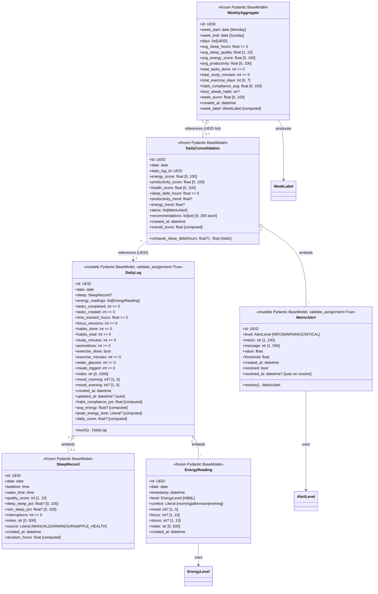

# PRD — Metric & Consolidation Entities (Sprint 2C)

> **Document ID:** PRD-ENTITIES-METRIC-CONSOLIDATION
> **Status:** Accepted v1.0
> **Sprint:** 2C — Metrics & Health Engine
> **Owners:** Operational package maintainers
> **Last updated:** 2026-06-07
> **Module scope:** `src/operational/entities/metric.py`, `src/operational/entities/consolidation.py`

---

## 1. Objective

Define the **leaf Pydantic entities** that capture the per-day operational
signal (sleep, energy, habits, tasks, health) and roll it up into composite
scores and weekly aggregates. This PRD ships six entities, two modules,
and a comprehensive test suite.

Two artefacts are delivered:

1. **`operational.entities.metric`** — three entities that capture the
   per-day raw signal: :class:`SleepRecord`, :class:`EnergyReading`,
   :class:`DailyLog`.
2. **`operational.entities.consolidation`** — three entities that
   aggregate that signal: :class:`MetricAlert`, :class:`DailyConsolidation`,
   :class:`WeeklyAggregate`.

The deliverables are **pure data containers** with computed fields and
invariants. Service-layer logic (alert generation, trend computation,
recommendation synthesis) lives elsewhere in the metrics/health engine.

---

## 2. Source Spec

The artefacts in this PRD are derived from three canonical documents in
the Algorithmic Life OS monorepo:

| Source | Path | Sections used |
|:-------|:-----|:--------------|
| **PRD-05** — *Metrics & Health* | `vibe-ops/planning/PRD-05-metrics-health.md` | §2 (entity shapes, ranges, defaults), §5 (alert thresholds), §6 (weekly aggregation) |
| **ADR-004** — *Composite Score Formula* | `vibe-ops/architecture/ADR-004-composite-scores.md` | Energy / productivity / health weighting (0.3 / 0.4 / 0.3) |
| **PAV** — *Produtividade Algorítmica Visual* | `vibe-ops/base/Produtividade Algorítmica Visual.md` | §3 (daily periods, used for `EnergyReading.context`) |
| **PRD-02** — *Habit Tracker* | `vibe-ops/planning/PRD-02-habit-tracker.md` | Habit compliance percentage (used by `DailyLog.habit_compliance_pct`) |
| **PRD-06** — *Policy FSM* | `vibe-ops/planning/PRD-06-policy-fsm.md` | Relation between daily scores and the policy state machine (downstream consumer) |

Every field, validator, and computed field in this document traces back
to a numbered section in one of the sources above.

---

## 3. Data Model

### 3.1 Class diagram



### 3.2 Entity summary

| # | Entity | Module | Mutability | Backing | UEID prefix |
|:-:|:-------|:-------|:-----------|:--------|:------------|
| 1 | `SleepRecord` | `metric` | frozen | history | `slp_` |
| 2 | `EnergyReading` | `metric` | frozen | history | `erg_` |
| 3 | `DailyLog` | `metric` | mutable (validate_assignment) | aggregate | `day_` |
| 4 | `MetricAlert` | `consolidation` | mutable (validate_assignment) | ephemeral | `alt_` |
| 5 | `DailyConsolidation` | `consolidation` | frozen | snapshot | `cnl_` |
| 6 | `WeeklyAggregate` | `consolidation` | frozen | snapshot | `wkl_` |

---

## 4. Field Reference

### 4.1 `SleepRecord` (PRD-05 §2.1)

| Field | Type | Constraint | Default | Description |
|:------|:-----|:-----------|:--------|:------------|
| `id` | `UEID` | pattern | required | Universal Entity ID, conv. `slp_YYYY_MM_DD` |
| `date` | `date` | — | required | Calendar date the sleep belongs to |
| `bedtime` | `time` | — | required | Bedtime in local time |
| `wake_time` | `time` | — | required | Wake time in local time |
| `quality_score` | `int` | `[1, 10]` | required | Self-reported quality (10 = perfect) |
| `deep_sleep_pct` | `float?` | `[0.0, 100.0]` | `None` | Deep sleep % |
| `rem_sleep_pct` | `float?` | `[0.0, 100.0]` | `None` | REM sleep % |
| `interruptions` | `int` | `>= 0` | `0` | Wakes during the night |
| `notes` | `str` | `max 500` | `""` | Free-form notes |
| `source` | `Literal` | MANUAL/GARMIN/OURA/APPLE_HEALTH | `"MANUAL"` | Provenance |
| `created_at` | `datetime` | — | required | Wall-clock at construction |
| `duration_hours` | `float` | computed | — | See §5.1 |

### 4.2 `EnergyReading` (PRD-05 §2.2)

| Field | Type | Constraint | Default | Description |
|:------|:-----|:-----------|:--------|:------------|
| `id` | `UEID` | pattern | required | Conv. `erg_YYYYMMDD_HHMM` |
| `date` | `date` | — | required | Calendar date |
| `timestamp` | `datetime` | — | required | Reading instant |
| `level` | `EnergyLevel` | HIGH/MEDIUM/LOW | required | Energy tier |
| `context` | `Literal` | morning/afternoon/evening | required | Period |
| `mood` | `int?` | `[1, 5]` | `None` | Mood at reading time |
| `focus` | `int?` | `[1, 10]` | `None` | Focus at reading time |
| `stress` | `int?` | `[1, 10]` | `None` | Stress at reading time |
| `notes` | `str` | `max 500` | `""` | Free-form notes |
| `created_at` | `datetime` | — | required | Wall-clock at construction |

### 4.3 `DailyLog` (PRD-05 §2.3)

| Field | Type | Constraint | Default | Description |
|:------|:-----|:-----------|:--------|:------------|
| `id` | `UEID` | pattern | required | Conv. `day_YYYY_MM_DD` |
| `date` | `date` | — | required | Calendar date |
| `sleep` | `SleepRecord?` | — | `None` | Night's sleep record |
| `energy_readings` | `list[EnergyReading]` | — | `[]` | All readings of the day |
| `tasks_completed` | `int` | `>= 0` | `0` | Tasks closed |
| `tasks_created` | `int` | `>= 0` | `0` | Tasks opened |
| `time_tracked_hours` | `float` | `>= 0` | `0.0` | Hours in tracked work |
| `focus_sessions` | `int` | `>= 0` | `0` | Focus blocks completed |
| `habits_done` | `int` | `>= 0` | `0` | Habits completed |
| `habits_total` | `int` | `>= 0` | `0` | Habits scheduled |
| `study_minutes` | `int` | `>= 0` | `0` | Cumulative study time (min) |
| `pomodoros` | `int` | `>= 0` | `0` | Pomodoros completed |
| `exercise_done` | `bool` | — | `False` | Whether user exercised |
| `exercise_minutes` | `int` | `>= 0` | `0` | Exercise time (min) |
| `water_glasses` | `int` | `>= 0` | `0` | Glasses of water |
| `meals_logged` | `int` | `>= 0` | `0` | Meals logged |
| `notes` | `str` | `max 1000` | `""` | Free-form daily notes |
| `mood_morning` | `int?` | `[1, 5]` | `None` | Morning mood |
| `mood_evening` | `int?` | `[1, 5]` | `None` | Evening mood |
| `created_at` | `datetime` | — | required | Wall-clock at construction |
| `updated_at` | `datetime?` | — | auto | Wall-clock at last edit |
| `habit_compliance_pct` | `float` | computed | — | See §5.2 |
| `avg_energy` | `float?` | computed | — | See §5.3 |
| `peak_energy_time` | `Literal?` | computed | — | See §5.4 |
| `daily_score` | `float?` | computed | — | See §5.5 |

### 4.4 `MetricAlert` (PRD-05 §2.4)

| Field | Type | Constraint | Default | Description |
|:------|:-----|:-----------|:--------|:------------|
| `id` | `UEID` | pattern | required | Conv. `alt_YYYYMMDD_NNN` |
| `level` | `AlertLevel` | INFO/WARNING/CRITICAL | required | Severity tier |
| `metric` | `str` | `[1, 100]` | required | Metric name |
| `message` | `str` | `[1, 500]` | required | Human-readable description |
| `value` | `float` | — | required | Current value |
| `threshold` | `float` | — | required | Threshold crossed |
| `created_at` | `datetime` | — | required | Wall-clock at construction |
| `resolved` | `bool` | — | `False` | Whether alert is resolved |
| `resolved_at` | `datetime?` | — | auto on resolve | Resolution timestamp |

### 4.5 `DailyConsolidation` (PRD-05 §2.5)

| Field | Type | Constraint | Default | Description |
|:------|:-----|:-----------|:--------|:------------|
| `id` | `UEID` | pattern | required | Conv. `cnl_YYYYMMDD` |
| `date` | `date` | — | required | Calendar date |
| `daily_log_id` | `UEID` | pattern | required | FK to source `DailyLog` |
| `energy_score` | `float` | `[0.0, 100.0]` | required | Energy composite |
| `productivity_score` | `float` | `[0.0, 100.0]` | required | Productivity composite |
| `health_score` | `float` | `[0.0, 100.0]` | required | Health composite |
| `sleep_debt_hours` | `float` | `>= 0` | `0.0` | `max(0, 8 - h)` |
| `productivity_trend` | `float?` | — | `None` | vs 7-day mean |
| `energy_trend` | `float?` | — | `None` | vs 7-day mean |
| `alerts` | `list[MetricAlert]` | — | `[]` | Auto-generated alerts |
| `recommendations` | `list[str]` | `max 200` each | `[]` | Auto-generated recs |
| `created_at` | `datetime` | — | required | Wall-clock at construction |
| `overall_score` | `float` | computed | — | See §5.6 |

### 4.6 `WeeklyAggregate` (PRD-05 §2.6)

| Field | Type | Constraint | Default | Description |
|:------|:-----|:-----------|:--------|:------------|
| `id` | `UEID` | pattern | required | Conv. `wkl_YYYYMMDD` (Monday) |
| `week_start` | `date` | — | required | Monday of the week |
| `week_end` | `date` | — | required | Sunday of the week |
| `days` | `list[UEID]` | `len <= 7` | `[]` | FKs to 7 `DailyConsolidation`s |
| `avg_sleep_hours` | `float` | `>= 0` | `0.0` | Mean sleep duration |
| `avg_sleep_quality` | `float` | `[1.0, 10.0]` | `5.0` | Mean quality |
| `avg_energy_score` | `float` | `[0.0, 100.0]` | `0.0` | Mean energy |
| `avg_productivity` | `float` | `[0.0, 100.0]` | `0.0` | Mean productivity |
| `total_tasks_done` | `int` | `>= 0` | `0` | Sum of tasks done |
| `total_study_minutes` | `int` | `>= 0` | `0` | Sum of study minutes |
| `total_exercise_days` | `int` | `[0, 7]` | `0` | Days with exercise |
| `habit_compliance_avg` | `float` | `[0.0, 100.0]` | `0.0` | Mean compliance |
| `best_streak_habit` | `str?` | `max 100` | `None` | Longest-streak habit |
| `week_score` | `float` | `[0.0, 100.0]` | `0.0` | Overall week score |
| `created_at` | `datetime` | — | required | Wall-clock at construction |
| `week_label` | `WeekLabel` | computed | — | See §5.7 |

---

## 5. Computed Fields

All computed fields are Pydantic ``@computed_field @property`` pairs —
they are derived from the underlying fields, **not stored** in the
serialised form (though they are included in `model_dump()`).

### 5.1 `SleepRecord.duration_hours` (PRD-05 §2.1)

Sleep duration in hours, midnight-crossing safe.

```python
bed_dt = datetime.combine(self.date, self.bedtime)
wake_dt = datetime.combine(self.date, self.wake_time)
if wake_dt < bed_dt:
    wake_dt = wake_dt.replace(day=wake_dt.day + 1)
return (wake_dt - bed_dt).total_seconds() / 3600.0
```

Examples:

| Bedtime | Wake | Duration |
|:--------|:-----|---------:|
| 22:00 | 06:00 | 8.0 h |
| 23:30 | 07:00 | 7.5 h |
| 02:00 | 10:00 | 8.0 h |
| 14:00 | 14:30 | 0.5 h |

### 5.2 `DailyLog.habit_compliance_pct` (PRD-02)

```python
if self.habits_total == 0:
    return 0.0
return (self.habits_done / self.habits_total) * 100.0
```

Zero total returns 0.0 (no division by zero).

### 5.3 `DailyLog.avg_energy`

Map each :class:`EnergyLevel` to a 0-100 scale (H=100, M=60, L=30) and
return the arithmetic mean. Returns ``None`` if no readings exist.

```python
_ENERGY_NUMERIC = {"H": 100, "M": 60, "L": 30}
if not self.energy_readings:
    return None
return sum(_ENERGY_NUMERIC[r.level.value] for r in self.energy_readings) \
       / len(self.energy_readings)
```

### 5.4 `DailyLog.peak_energy_time`

Group readings by ``context``, average each group, return the period
with the highest mean. Returns ``None`` if no readings exist.

```python
contexts = {"morning": [], "afternoon": [], "evening": []}
for r in self.energy_readings:
    contexts[r.context].append(_ENERGY_NUMERIC[r.level.value])
averages = {
    ctx: (sum(vals) / len(vals) if vals else 0.0)
    for ctx, vals in contexts.items()
}
return max(averages, key=averages.get)  # type: ignore[return-value]
```

### 5.5 `DailyLog.daily_score` (ADR-004, PRD-05 §2.3)

The overall day score combines three components with weights
0.3 / 0.4 / 0.3 (energy / productivity / health).

```text
energy         = max(0, avg_energy - max(0, (8 - sleep_hours) * 10))
              (avg_energy is None → daily_score is None)
productivity   = (tasks_completed / max(tasks_created, 1)) * 60
              + min(time_tracked_hours / 8, 1) * 25
              + min(pomodoros / 8, 1) * 15
health         = (sleep.quality_score * 10 * 0.5)         if sleep
              + (25 if exercise_done else 0)
              + min(water_glasses / 8, 1) * 15
daily_score    = energy * 0.3 + productivity * 0.4 + health * 0.3
```

Returns ``None`` if ``avg_energy`` is ``None``.

### 5.6 `DailyConsolidation.overall_score` (PRD-05 §2.5)

Weighted average of the three component scores with weights 0.3 / 0.4 / 0.3.

```python
return (
    self.energy_score * 0.3
    + self.productivity_score * 0.4
    + self.health_score * 0.3
)
```

### 5.7 `WeeklyAggregate.week_label` (PRD-05 §2.6)

Bucketed from :attr:`week_score`.

| `week_score` range | `week_label` |
|:-------------------|:-------------|
| `>= 85` | `EXCELENTE` |
| `[70, 85)` | `BOM` |
| `[50, 70)` | `MEDIO` |
| `[30, 50)` | `RUIM` |
| `< 30` | `RECUPERACAO` |

### 5.8 `DailyConsolidation.compute_sleep_debt` (static helper)

```python
@staticmethod
def compute_sleep_debt(sleep_hours: float | None) -> float:
    if sleep_hours is None:
        return 8.0  # full target deficit
    return max(0.0, 8.0 - sleep_hours)
```

---

## 6. Formulas — Reference Card

| Symbol | Formula | Used in |
|:-------|:--------|:--------|
| `duration_hours` | `(wake_dt - bed_dt).total_seconds() / 3600` | `SleepRecord` |
| `habit_compliance_pct` | `habits_done / habits_total * 100` | `DailyLog` |
| `avg_energy` | `mean(level_numeric for r in readings)` | `DailyLog` |
| `peak_energy_time` | `argmax(mean_energy_by_context)` | `DailyLog` |
| `energy_score` | `max(0, avg_energy - sleep_debt * 10)` | `DailyLog.daily_score` |
| `productivity_score` | `(done/max(created,1))*60 + min(t/8,1)*25 + min(p/8,1)*15` | `DailyLog.daily_score` |
| `health_score` | `(sleep.q*10)*0.5 + (25 if ex) + min(w/8,1)*15` | `DailyLog.daily_score` |
| `daily_score` | `E*0.3 + P*0.4 + H*0.3` | `DailyLog` |
| `overall_score` | `E*0.3 + P*0.4 + H*0.3` | `DailyConsolidation` |
| `sleep_debt_hours` | `max(0, 8 - sleep_hours)` | `DailyConsolidation` |
| `week_label` | bucketed from `week_score` | `WeeklyAggregate` |

---

## 7. Validators

| Validator | Entity | Rule | Behaviour |
|:----------|:-------|:-----|:----------|
| `WeeklyAggregate._validate_week_span` | `WeeklyAggregate` | `week_end - week_start == 6 days` | Raises `ValueError` otherwise |
| `DailyLog._auto_set_updated_at` | `DailyLog` | If `updated_at is None` → set to `datetime.now(UTC)` (naive) | Auto-managed on construction and assignment |
| `MetricAlert._auto_stamp_resolved_at` | `MetricAlert` | If `resolved=True` and `resolved_at is None` → stamp | Auto-stamped on construction / first resolve |

### 7.1 Pydantic v2 constraints

All entities use `ConfigDict(extra="forbid")` and a mix of `frozen=True`
/ `frozen=False` (mutable for `DailyLog` and `MetricAlert` only).
Field constraints are enforced via `Field(ge, le, max_length, ...)` —
no `assert` statements.

### 7.2 UEID pattern

`UEID` is `Annotated[str, Field(pattern=r"^[a-z]{3,5}_[a-z0-9_]+$")]`.
The five prefixes used in this PRD are:

| Prefix | Entity | Example |
|:-------|:-------|:--------|
| `slp` | `SleepRecord` | `slp_2026_06_07` |
| `erg` | `EnergyReading` | `erg_20260607_0900` |
| `day` | `DailyLog` | `day_2026_06_07` |
| `alt` | `MetricAlert` | `alt_20260607_001` |
| `cnl` | `DailyConsolidation` | `cnl_2026_06_07` |
| `wkl` | `WeeklyAggregate` | `wkl_2026_06_01` |

---

## 8. Test Strategy

### 8.1 Coverage targets

| Module | Statement | Branch |
|:-------|:---------:|:------:|
| `operational.entities.metric` | ≥ 95 % (achieved 100 %) | ≥ 90 % (achieved 100 %) |
| `operational.entities.consolidation` | ≥ 95 % (achieved 100 %) | ≥ 90 % (achieved 100 %) |

### 8.2 `tests/unit/entities/test_metric.py` (96 tests)

**`TestSleepRecord` (18 tests):**

* `test_create_minimal_sleep_record`
* `test_sleep_duration_no_midnight_cross`
* `test_sleep_duration_midnight_cross`
* `test_sleep_duration_same_day`
* `test_sleep_duration_nap_30_minutes`
* `test_sleep_duration_night_shift`
* `test_sleep_quality_range_valid` (parametric 1/5/10)
* `test_sleep_quality_range_rejected` (parametric 0/-1/11/100)
* `test_sleep_deep_rem_optional`
* `test_sleep_deep_pct_rejected_out_of_range` (parametric)
* `test_sleep_source_literal_accepted` (parametric MANUAL/GARMIN/OURA/APPLE_HEALTH)
* `test_sleep_source_literal_rejected` (parametric)
* `test_sleep_interruptions_default_zero`
* `test_sleep_interruptions_negative_rejected`
* `test_sleep_notes_max_length_enforced`
* `test_sleep_notes_max_length_accepted`
* `test_sleep_is_frozen`
* `test_sleep_rejects_unknown_fields`

**`TestEnergyReading` (14 tests):**

* `test_create_energy_reading`
* `test_energy_level_enum` (parametric HIGH/MEDIUM/LOW)
* `test_energy_context_literal` (parametric morning/afternoon/evening)
* `test_energy_context_literal_rejected` (parametric)
* `test_energy_mood_valid_range` (parametric 1/3/5)
* `test_energy_mood_rejected_out_of_range` (parametric 0/6/-1)
* `test_energy_focus_valid_range` (parametric 1/5/10)
* `test_energy_focus_rejected_out_of_range` (parametric 0/11/100)
* `test_energy_stress_valid_range` (parametric 1/5/10)
* `test_energy_stress_rejected_out_of_range` (parametric 0/11/100)
* `test_energy_notes_max_length`
* `test_energy_is_frozen`
* `test_energy_rejects_unknown_fields`

**`TestDailyLog` (31 tests):**

* `test_create_minimal_daily_log`
* `test_daily_log_habit_compliance_pct` (parametric, 8 cases)
* `test_daily_log_habit_compliance_zero_total`
* `test_daily_log_avg_energy_mapping_high`
* `test_daily_log_avg_energy_mapping_medium`
* `test_daily_log_avg_energy_mapping_low`
* `test_daily_log_avg_energy_mixed`
* `test_daily_log_avg_energy_no_readings`
* `test_daily_log_peak_energy_time_morning`
* `test_daily_log_peak_energy_time_afternoon`
* `test_daily_log_peak_energy_time_evening`
* `test_daily_log_peak_energy_time_no_readings`
* `test_daily_log_daily_score_no_energy`
* `test_daily_log_daily_score_no_sleep`
* `test_daily_log_daily_score_known_formula`
* `test_daily_log_daily_score_with_sleep_debt_penalty`
* `test_daily_log_daily_score_zero_state`
* `test_daily_log_daily_score_health_only`
* `test_daily_log_updated_at_auto_set`
* `test_daily_log_updated_at_preserved_when_provided`
* `test_daily_log_updated_at_changes_on_assignment`
* `test_daily_log_touch_method`
* `test_daily_log_touch_returns_self`
* `test_daily_log_rejects_unknown_fields`
* `test_daily_log_rejects_negative_tasks`
* `test_daily_log_rejects_mood_out_of_range`
* `test_daily_log_notes_max_length`
* `test_daily_log_is_mutable`

### 8.3 `tests/unit/entities/test_consolidation.py` (85 tests)

**`TestDailyConsolidation` (17 tests):**

* `test_create_daily_consolidation`
* `test_daily_consolidation_overall_score_formula`
* `test_daily_consolidation_overall_score_parametric` (6 cases)
* `test_daily_consolidation_alerts_default_empty`
* `test_daily_consolidation_recommendations_default_empty`
* `test_daily_consolidation_with_alerts`
* `test_daily_consolidation_trends`
* `test_daily_consolidation_recommendation_max_length`
* `test_daily_consolidation_score_range_enforced` (parametric × 3 fields)
* `test_daily_consolidation_sleep_debt_range`
* `test_daily_consolidation_is_frozen`
* `test_daily_consolidation_rejects_unknown_fields`
* `test_compute_sleep_debt` (parametric 7 cases)

**`TestMetricAlert` (15 tests):**

* `test_create_metric_alert`
* `test_metric_alert_level_enum` (parametric 3 cases)
* `test_metric_alert_resolved_auto_timestamp`
* `test_metric_alert_resolved_at_preserved_when_provided`
* `test_metric_alert_resolved_at_not_set_when_unresolved`
* `test_metric_alert_resolve_method`
* `test_metric_alert_resolve_is_idempotent`
* `test_metric_alert_metric_min_length`
* `test_metric_alert_metric_max_length`
* `test_metric_alert_message_min_length`
* `test_metric_alert_message_max_length`
* `test_metric_alert_resolved_mutable`
* `test_metric_alert_other_fields_mutable`
* `test_metric_alert_rejects_unknown_fields`
* `test_metric_alert_can_be_attached_to_consolidation`

**`TestWeeklyAggregate` (21 tests):**

* `test_create_weekly_aggregate`
* `test_weekly_aggregate_week_label_excelente` (parametric 4 cases)
* `test_weekly_aggregate_week_label_bom` (parametric 4 cases)
* `test_weekly_aggregate_week_label_medio` (parametric 4 cases)
* `test_weekly_aggregate_week_label_ruim` (parametric 4 cases)
* `test_weekly_aggregate_week_label_recuperacao` (parametric 4 cases)
* `test_weekly_aggregate_week_label_excelente_boundary_exact`
* `test_weekly_aggregate_week_label_bom_boundary_exact`
* `test_weekly_aggregate_week_label_medio_boundary_exact`
* `test_weekly_aggregate_week_label_ruim_boundary_exact`
* `test_weekly_aggregate_week_must_be_6_days`
* `test_weekly_aggregate_week_must_be_6_days_overflow`
* `test_weekly_aggregate_week_can_be_same_day_0`
* `test_weekly_aggregate_week_must_be_6_days_negative`
* `test_weekly_aggregate_total_exercise_max_7`
* `test_weekly_aggregate_total_exercise_min_0`
* `test_weekly_aggregate_total_exercise_valid` (parametric 5 cases)
* `test_weekly_aggregate_week_score_range`
* `test_weekly_aggregate_sleep_quality_range`
* `test_weekly_aggregate_days_list`
* `test_weekly_aggregate_best_streak_habit`
* `test_weekly_aggregate_is_frozen`
* `test_weekly_aggregate_rejects_unknown_fields`

### 8.4 Markers and gating

* All tests are unit tests (implicit `unit` marker from `pytest.ini`).
* Coverage gate: ≥ 95 % per module, ≥ 90 % per branch — both exceeded.
* Lint gate: `ruff check` (ALL rules, line-length 100) — clean.
* Typecheck gate: `mypy --strict` (clean on the new code; the
  "missing library stubs" warnings for `operational` are due to the
  test runner not using `mypy_path = "src"` and are not new).

---

## 9. Acceptance Criteria

A pull request that closes Sprint 2C must satisfy **all** of the
following:

1. `python -c "import operational.entities.metric; import operational.entities.consolidation"`
   succeeds without warnings on Python ≥ 3.11.
2. All 6 entities in §3 are present with the field signature of §4.
3. All 4 computed fields in §5 produce the formulas in §6.
4. `operational.entities.metric.__all__` and
   `operational.entities.consolidation.__all__` are exactly the names
   in §3.2.
5. `mypy --strict` reports zero errors in the two new modules.
6. `ruff check` reports zero errors in the two new modules and their
   tests.
7. `pytest tests/unit/entities/test_metric.py` passes with **100 %
   coverage** of `operational.entities.metric`.
8. `pytest tests/unit/entities/test_consolidation.py` passes with
   **100 % coverage** of `operational.entities.consolidation`.
9. The full project test suite continues to pass (`pytest tests/`
   reports `1371 passed` after the change).
10. No new dependencies were added to `pyproject.toml` beyond what
    was already declared in Sprint 1A.
11. No circular imports: `operational.entities.metric` imports only
    from `operational.enums` and `operational.types`.
    `operational.entities.consolidation` imports from those plus
    `operational.entities.metric` indirectly is avoided — both are
    leaves.

---

## 10. References

* **PRD-05** — `vibe-ops/planning/PRD-05-metrics-health.md` — §2 (entity shapes, ranges, defaults), §5 (alert thresholds), §6 (weekly aggregation)
* **ADR-004** — `vibe-ops/architecture/ADR-004-composite-scores.md` — composite score weighting (0.3 / 0.4 / 0.3)
* **PRD-02** — `vibe-ops/planning/PRD-02-habit-tracker.md` — habit compliance percentage formula
* **PRD-06** — `vibe-ops/planning/PRD-06-policy-fsm.md` — relation between daily scores and the policy state machine (downstream)
* **PAV** — `vibe-ops/base/Produtividade Algorítmica Visual.md` — §3 (daily periods, used for `EnergyReading.context`)
* `operational/SPEC.md` — top-level package spec
* `operational.enums` — `EnergyLevel`, `AlertLevel`, `WeekLabel`
* `operational.types` — `UEID` pattern
* Python 3.11 docs — `datetime.UTC`, `time`, `date`
* Pydantic v2 — `ConfigDict`, `Field`, `computed_field`, `model_validator`

---

## 11. Change Log

| Date | Author | Change |
|:-----|:-------|:-------|
| 2026-06-07 | Operational Sprint 2C | Initial PRD — 6 entities, 2 modules, 181 tests, 100 % coverage (stmts + branches) |
