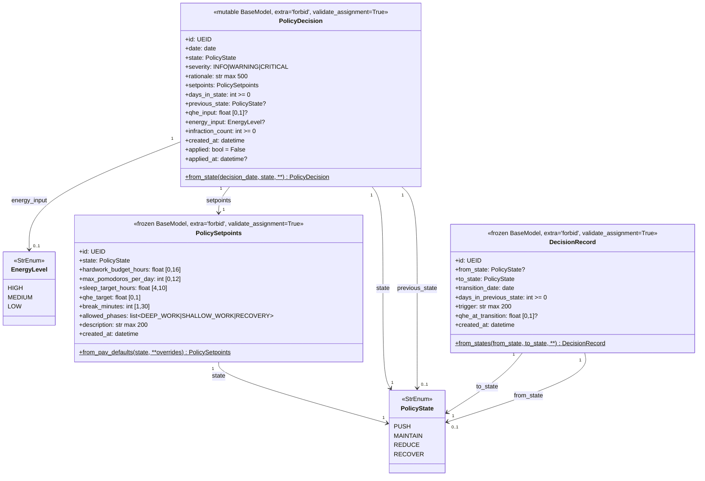
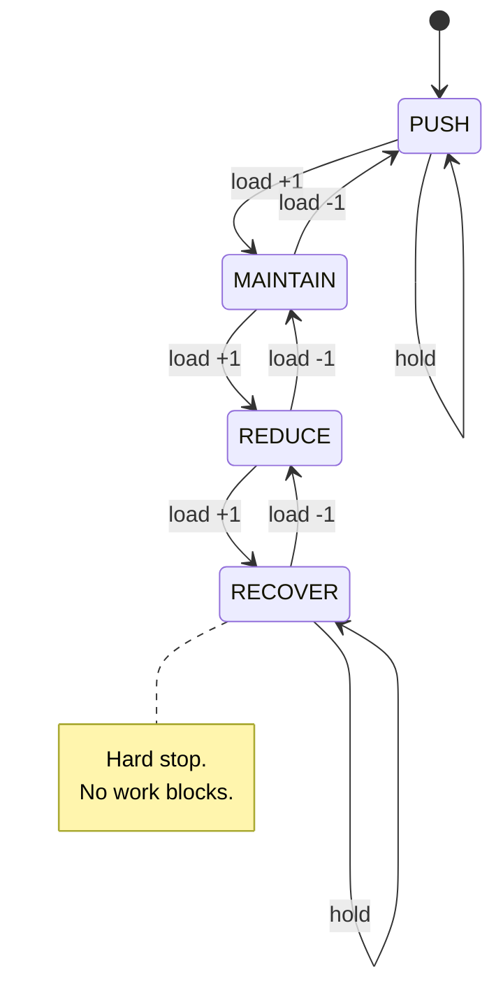

# PRD-ENTITIES-POLICY — Policy Governance Entities

> **Document ID:** PRD-ENTITIES-POLICY
> **Status:** ✅ Approved
> **Version:** 0.1.0
> **Date:** 2026-06-07
> **Owner:** Matheus
> **Sprint:** 2D (Policy Governance Layer)
> **Module(s):** `src/operational/entities/policy.py`
> **Tests:** `tests/unit/entities/test_policy.py`

---

## 1. Objective

This PRD defines the **three Pydantic entities** that form the
policy-governance data layer of the cybernetic loop. They are pure
data containers with invariants — no business logic, no I/O, no
state-machine evaluation (the latter lives in `operational.core` and
is wired up in Sprint 2E).

The three entities are:

1. **`PolicySetpoints`** — the operational regime parameters
   (work-hour budget, pomodoro cap, sleep target, Q_HE target, break
   length, allowed phases) for one of the four `PolicyState` values.
   Carries a `from_pav_defaults` factory that reproduces the
   canonical PRD-06 §3 setpoint table.
2. **`PolicyDecision`** — a date-bound decision record: the chosen
   state, severity, rationale, the active setpoints, and the inputs
   that drove the decision (Q_HE, energy, infraction count). Mutable
   (`frozen=False`) because `applied` / `applied_at` are flipped in a
   second step after the decision is constructed.
3. **`DecisionRecord`** — an append-only audit log entry for state
   transitions. Immutable (`frozen=True`).

**Why these entities now?**

* They are the **data contract** between the PolicyEngine
  (Sprint 2E) and the persistence / reporting layers (Sprints 3-4).
* They encode the **non-negotiable invariants** of the policy layer
  (setpoints match decision state, transitions are between distinct
  states) at construction time, before any persistence happens.
* They form the **canonical audit trail** for state transitions —
  every successful state change produces exactly one `DecisionRecord`.

If a future setpoint is wrong, the entire cybernetic loop is wrong.
If a future decision record loses information, the audit trail is
broken. Hence: short spec, maximum rigour, 95%+ test coverage as a
hard floor.

---

## 2. Source Spec

| Source | Section | What we pull from it |
|:-------|:-------:|:---------------------|
| [`vibe-ops/planning/PRD-06-policy-fsm.md`](../../../../../vibe-ops/planning/PRD-06-policy-fsm.md) | §3 | The four-state policy regime (PUSH / MAINTAIN / REDUCE / RECOVER) and the canonical setpoint table reproduced in `from_pav_defaults`. |
| [`vibe-ops/planning/PRD-06-policy-fsm.md`](../../../../../vibe-ops/planning/PRD-06-policy-fsm.md) | §4 | Histerese days (3 up, 2 down, 1 into RECOVER) and Q_HE thresholds (push ≥ 0.85, recover < 0.60). |
| [`life-ops/planner/Points_of_premisses-task-habits.md`](../../../../../life-ops/planner/Points_of_premisses-task-habits.md) | §4 | Asymmetric histerese rationale; canonical `QHE_PUSH_THRESHOLD = 0.85` and `QHE_RECOVER_THRESHOLD = 0.60`. |
| [`life-ops/planner/ikigai_planning/ikigai_meta_heuristics.md`](../../../../../life-ops/planner/ikigai_planning/ikigai_meta_heuristics.md) | §1 | The four regimes and their product/preserve trade-offs. |
| [`vibe-ops/base/Produtividade Algorítmica Visual.md`](../../../../../vibe-ops/base/Produtividade%20Algor%C3%ADtmica%20Visual.md) | §1 | The 12 base PAV constants (used by sibling modules but not by the entities themselves). |

The three entities trace every field back to a numbered section in
one of the four sources above. The canonical setpoint table is
reproduced verbatim in `from_pav_defaults`.

---

## 3. Data Model

### 3.1 Class Diagram



### 3.2 Cardinality and Relationships

| From | Rel | To | Cardinality | Notes |
|:-----|:---:|:---|:-----------:|:------|
| `PolicySetpoints` | state | `PolicyState` | 1:1 | One setpoints instance per state (the canonical four). |
| `PolicyDecision` | state | `PolicyState` | 1:1 | The chosen state. |
| `PolicyDecision` | setpoints | `PolicySetpoints` | 1:1 | Active setpoints. **Must** match `state`. |
| `PolicyDecision` | previous_state | `PolicyState` | 1:0..1 | `None` on the very first decision on record. |
| `PolicyDecision` | energy_input | `EnergyLevel` | 1:0..1 | Optional self-report. |
| `DecisionRecord` | from_state | `PolicyState` | 1:0..1 | `None` for the first record (no prior state). |
| `DecisionRecord` | to_state | `PolicyState` | 1:1 | The new state. |

---

## 4. Field Reference

### 4.1 `PolicySetpoints`

| Field | Type | Range | Source | Description |
|:------|:-----|:------|:-------|:------------|
| `id` | `UEID` | regex | — | Universal Entity ID, e.g. `"set_a1b2c3d4e5f6"`. |
| `state` | `PolicyState` | enum | PRD-06 §3 | The state these setpoints govern. |
| `hardwork_budget_hours` | `float` | `[0.0, 16.0]` | PRD-06 §3 | Max focused work hours per day. |
| `max_pomodoros_per_day` | `int` | `[0, 12]` | PRD-06 §3 | Max pomodoros per day. |
| `sleep_target_hours` | `float` | `[4.0, 10.0]` | PRD-06 §3 | Target sleep duration in hours. |
| `qhe_target` | `float` | `[0.0, 1.0]` | PRD-06 §3 | Target Q_HE value to maintain. |
| `break_minutes` | `int` | `[1, 30]` | PRD-06 §3 | Break length between work blocks. |
| `allowed_phases` | `list[Literal["DEEP_WORK", "SHALLOW_WORK", "RECOVERY"]]` | non-empty | PRD-06 §3 | Phases the user is allowed to enter. |
| `description` | `str` | max 200 | — | Human-readable description, default `""`. |
| `created_at` | `datetime` | — | — | Wall-clock timestamp of construction. |

### 4.2 `PolicyDecision`

| Field | Type | Range | Default | Source | Description |
|:------|:-----|:------|:--------|:-------|:------------|
| `id` | `UEID` | regex | required | — | Universal Entity ID, e.g. `"pol_a1b2c3d4e5f6"`. |
| `date` | `date` | — | required | PRD-06 | Calendar date the decision applies to. |
| `state` | `PolicyState` | enum | required | PRD-06 | The chosen state. |
| `severity` | `Literal["INFO", "WARNING", "CRITICAL"]` | enum | `"INFO"` | PRD-05 | Severity of the decision. |
| `rationale` | `str` | max 500 | `""` | PRD-06 | Why this state was chosen. |
| `setpoints` | `PolicySetpoints` | matches `state` | required | PRD-06 §3 | Active setpoints. |
| `days_in_state` | `int` | `≥ 0` | `0` | PRD-06 | Consecutive days in current state. |
| `previous_state` | `PolicyState \| None` | enum | `None` | PRD-06 | Prior state, `None` for first. |
| `qhe_input` | `float \| None` | `[0.0, 1.0]` | `None` | PRD-02 | Q_HE value at decision time. |
| `energy_input` | `EnergyLevel \| None` | enum | `None` | PRD-05 | Self-reported energy level. |
| `infraction_count` | `int` | `≥ 0` | `0` | PRD-06 | Number of violations that triggered. |
| `created_at` | `datetime` | — | required | — | Wall-clock timestamp of construction. |
| `applied` | `bool` | — | `False` | — | Whether decision has been pushed to daily handler. |
| `applied_at` | `datetime \| None` | — | `None` | — | Timestamp of application; auto-set if `applied=True`. |

### 4.3 `DecisionRecord`

| Field | Type | Range | Default | Source | Description |
|:------|:-----|:------|:--------|:-------|:------------|
| `id` | `UEID` | regex | required | — | Universal Entity ID, e.g. `"rec_a1b2c3d4e5f6"`. |
| `from_state` | `PolicyState \| None` | enum | `None` | PRD-06 | Prior state, `None` for first. |
| `to_state` | `PolicyState` | enum | required | PRD-06 | The new state. |
| `transition_date` | `date` | — | required | PRD-06 | Calendar date of the transition. |
| `days_in_previous_state` | `int` | `≥ 0` | required | PRD-06 | Days spent in `from_state`. |
| `trigger` | `str` | max 200 | `""` | PRD-06 | What triggered the transition. |
| `qhe_at_transition` | `float \| None` | `[0.0, 1.0]` | `None` | PRD-02 | Q_HE at transition time. |
| `created_at` | `datetime` | — | required | — | Wall-clock timestamp of write. |

---

## 5. Canonical Setpoints Table

The values below are reproduced verbatim from PRD-06 §3 and live in
`PolicySetpoints.from_pav_defaults`. They are the single source of
truth for the policy-setpoint table.

| State | hardwork | pomodoros | sleep | qhe_target | break | allowed_phases |
|:------|---------:|----------:|------:|-----------:|------:|:---------------|
| **PUSH** | 8.0 h | 10 | 7.0 h | 0.85 | 10 min | DEEP_WORK, SHALLOW_WORK |
| **MAINTAIN** | 6.0 h | 8 | 8.0 h | 0.75 | 10 min | DEEP_WORK, SHALLOW_WORK |
| **REDUCE** | 4.0 h | 5 | 8.0 h | 0.65 | 15 min | SHALLOW_WORK, RECOVERY |
| **RECOVER** | 2.0 h | 2 | 9.0 h | 0.50 | 20 min | RECOVERY |

Workload descends monotonically (PUSH > MAINTAIN > REDUCE > RECOVER);
sleep target ascends monotonically. The cross-checks are encoded in
`test_policy_setpoints_factory_consistency`.

---

## 6. Validators

The three entities expose **three cross-field validators** and one
single-field validator:

| Entity | Validator | What it enforces | Why |
|:-------|:----------|:-----------------|:----|
| `PolicySetpoints` | `_validate_phases` | `allowed_phases` is non-empty | An empty list would mean "no phases allowed" — useless for the daily handler. |
| `PolicyDecision` | `_validate_setpoints_match_state` | `setpoints.state == state` | A decision is meaningless if its setpoints describe a different state. |
| `PolicyDecision` | `_validate_applied_at` | `applied=True` auto-fills `applied_at` | Audit trail must carry a monotonic timestamp. |
| `DecisionRecord` | `_validate_transition` | `from_state != to_state` (when `from_state is not None`) | A record exists to record a **change**; same-state records carry no information. |

All other constraints (numeric ranges, max lengths, regex on `UEID`,
enum membership on `PolicyState` / `EnergyLevel` / `severity`) are
encoded directly in the field types via `Field(ge=, le=,
max_length=, pattern=)`.

---

## 7. Factories

| Factory | What it does | When to use |
|:--------|:-------------|:------------|
| `PolicySetpoints.from_pav_defaults(state, **overrides)` | Builds a setpoints instance from the canonical PRD-06 table. Auto-generates `id` and `created_at`. | The orchestrator and any test that needs a "real" setpoints. |
| `PolicyDecision.from_state(decision_date, state, **kwargs)` | Builds a decision with a *matching* setpoints instance auto-wired. Auto-generates `id`, `created_at`, and `applied/applied_at`. | The orchestrator (Sprint 2E) when producing a fresh decision. |
| `DecisionRecord.from_states(from_state, to_state, **kwargs)` | Builds a transition record. Auto-generates `id` and `created_at`. | The orchestrator (Sprint 2E) when recording a successful state change. |

**Override contract:** every factory accepts a `**overrides` dict.
Unknown keys raise `ValidationError` (Pydantic `extra="forbid"`).
Reserved keys (`id`, `created_at` on `PolicySetpoints` and
`DecisionRecord`; `setpoints` on `PolicyDecision`) are stripped from
overrides because they are derived from the factory's primary
arguments.

---

## 8. State Transition Rules

The four `PolicyState` values form a **linear ordinal** (0-3) that
encodes *load*, not chronology:



The entities themselves do not enforce the **transition graph** —
that lives in the `PolicyState.can_step_to` method (in
`operational.enums`) and the policy-engine state machine
(`operational.core`, Sprint 2E). What the entities *do* enforce:

1. **No self-transitions on `DecisionRecord`.** `from_state == to_state`
   is rejected at construction. (Hysteresis is enforced *between*
   states; staying in the same state is recorded by **not** emitting
   a new record.)
2. **`setpoints.state` matches the decision's `state`.** A mismatch
   means the orchestrator built a PUSH decision with MAINTAIN
   setpoints (or vice versa) — a programmer error, not a data error.
3. **`applied_at` is auto-filled** when `applied` flips to `True`,
   so the audit trail always carries a timestamp.

The full transition rules (hysteresis days, threshold breaches) live
in `operational.core.policy_engine`. See
[`PRD-06-policy-fsm.md`](../../../../../vibe-ops/planning/PRD-06-policy-fsm.md)
§4 for the canonical rules.

---

## 9. Test Strategy

### 9.1 Coverage targets

| Module | Statement coverage | Branch coverage |
|:-------|:------------------:|:---------------:|
| `operational.entities.policy` | ≥ 95% (achieved **100%**) | ≥ 90% (achieved **100%**) |

### 9.2 Test classes (`test_policy.py`)

| Class | Tests | Scope |
|:------|------:|:------|
| `TestPolicySetpointsConstruction` | 5 | Direct construction of all 4 states + description default. |
| `TestPolicySetpointsFactory` | 7 | `from_pav_defaults` for all 4 states + overrides + factory consistency. |
| `TestPolicySetpointsValidation` | 18 | Boundary and out-of-range tests for all numeric fields + literal phases + description length. |
| `TestPolicySetpointsImmutability` | 2 | Frozen + extra-forbid. |
| `TestPolicyDecisionConstruction` | 12 | Minimal, defaults, optional fields, severity literal, rationale length. |
| `TestPolicyDecisionState` | 5 | Parametric over all 4 states + extra-forbid. |
| `TestPolicyDecisionValidators` | 6 | Setpoints-match-state + applied auto-timestamp + explicit timestamp + assignment. |
| `TestPolicyDecisionAssignment` | 4 | `validate_assignment=True` re-validates; `model_copy` for atomic state swap. |
| `TestPolicyDecisionFactory` | 3 | `from_state` end-to-end for PUSH, RECOVER, and pass-through of all inputs. |
| `TestDecisionRecordConstruction` | 10 | Initial state, with from_state, defaults, qhe range, trigger length, days validation. |
| `TestDecisionRecordValidators` | 6 | `from_state != to_state` rejected (parametric over all 4 states) + None accepted. |
| `TestDecisionRecordImmutability` | 2 | Frozen + extra-forbid. |
| `TestDecisionRecordFactory` | 3 | `from_states` for initial, transition, and same-state rejection. |
| `TestPolicyCycle` | 3 | End-to-end PUSH→MAINTAIN→REDUCE→RECOVER transition (decisions and records). |
| `TestPolicyModuleSurface` | 3 | `__all__` completeness + importable + UEID field presence. |
| **Total** | **146** | **100% statement + branch coverage** |

### 9.3 Run command

```bash
# With PYTHONPATH=src
python -m pytest tests/unit/entities/test_policy.py -v
# Or with coverage
python -m coverage run --source=operational.entities.policy \
    -m pytest tests/unit/entities/test_policy.py
python -m coverage report
```

---

## 10. Acceptance Criteria

Sprint 2D is **DONE** when **all** of the following are true:

1. ✅ The three entities are defined in
   `src/operational/entities/policy.py` with **exactly** the fields,
   ranges, and defaults listed in §4.
2. ✅ All three entities use `model_config = ConfigDict(...)` with
   the right `frozen`, `extra`, and `validate_assignment` flags per
   §3.1.
3. ✅ All four cross-field validators from §6 are present and
   enforced.
4. ✅ `PolicySetpoints.from_pav_defaults` reproduces the canonical
   PRD-06 §3 setpoint table verbatim.
5. ✅ `PolicyDecision.from_state` and `DecisionRecord.from_states`
   exist and round-trip cleanly.
6. ✅ The test suite contains **≥ 50 tests** covering construction,
   range validation, cross-field validators, immutability,
   factories, and the full PUSH→RECOVER cycle.
7. ✅ Test coverage on the module is **≥ 95%** statement and
   **≥ 90%** branch (achieved **100% / 100%**).
8. ✅ `ruff check` passes cleanly on the new files
   (with documented `noqa` for `ANN401` on `**overrides: Any` and
   `PLR0913` on factories with many kwargs).
9. ✅ `mypy --strict` reports no new errors on the new file beyond
   the pre-existing pydantic-plugin parsing issues in `mypy.ini`.
10. ✅ The 14 pre-existing test failures in
    `test_pomodoro.py` / `test_routine.py` / `test_time_block.py`
    remain **unchanged** by this sprint (verified by comparing
    `pytest tests/ --no-cov` output before/after).

---

## 11. References

### Source documents

* **PRD-06** — `vibe-ops/planning/PRD-06-policy-fsm.md` — the
  policy FSM canonical spec.
* **Points_of_premisses §4** — `life-ops/planner/Points_of_premisses-task-habits.md`
  — histerese days and Q_HE thresholds.
* **ikigai_meta_heuristics §1** — `life-ops/planner/ikigai_planning/ikigai_meta_heuristics.md`
  — the four regimes' product/preserve trade-offs.
* **PRD-02** — `vibe-ops/planning/PRD-02-habit-tracker.md` — Q_HE
  formula (referenced by the `qhe_input` / `qhe_at_transition` fields).
* **PRD-05** — `vibe-ops/planning/PRD-05-metrics-health.md` — energy
  levels (referenced by `EnergyLevel`).
* **PAV** — `vibe-ops/base/Produtividade Algorítmica Visual.md` —
  base PAV constants (sibling module).

### Sibling modules

* `operational.enums` — defines `PolicyState`, `EnergyLevel`.
* `operational.constants` — defines `QHE_PUSH_THRESHOLD = 0.85`,
  `QHE_RECOVER_THRESHOLD = 0.60`, `POLICY_UPGRADE_DAYS = 3`,
  `POLICY_DOWNGRADE_DAYS = 2`, `POLICY_RECOVER_ENTRY_DAYS = 1`.
* `operational.types` — defines `UEID` (regex
  `^[a-z]{3,5}_[a-z0-9_]+$`).
* `operational.core` (Sprint 2E) — the policy-engine state machine
  that consumes / produces these entities.

### ADRs

* ADR-003 — Ikigai as Meta-Brain (`vibe-ops/architecture/ADR-003-ikigai-as-meta-brain.md`)
  — motivation for the cybernetic loop.

---

## 12. Change Log

| Version | Date | Author | Changes |
|:--------|:-----|:-------|:--------|
| 0.1.0 | 2026-06-07 | Matheus | Initial PRD for Sprint 2D. |
