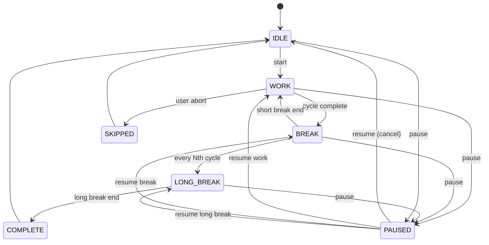
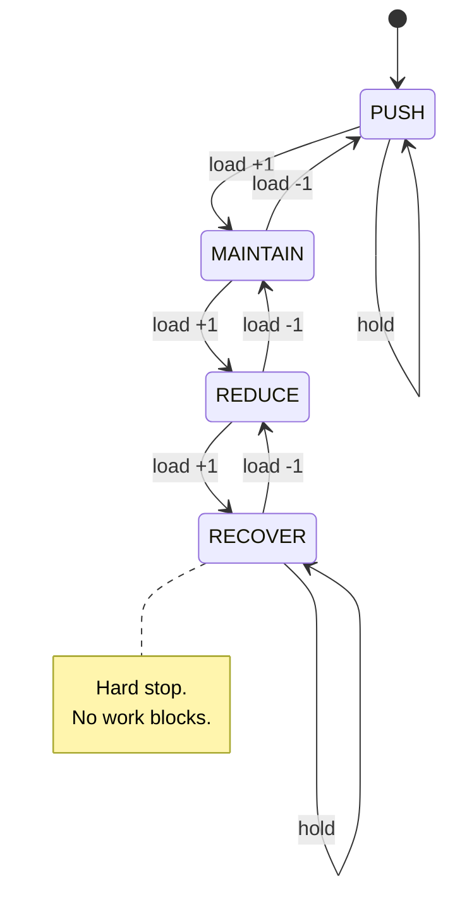

# PRD-ENUMS-TYPES — Enumerations and Type System

> **Status:** Accepted v1.0
> **Sprint:** 1B
> **Owners:** Operational package maintainers
> **Last updated:** 2026-06-07
> **Module scope:** `operational.enums`, `operational.types`

---

## 1. Objective

Define the **canonical, exhaustively-tested, type-safe vocabulary** that
every other module in the `operational` package builds on. Sprint 1B
delivers two artefacts:

1. **`operational.enums`** — ten `StrEnum` classes that name every
   discrete concept in the operational/cybernetic domain (routines,
   rituals, habit categories, energy tiers, sleep quality, pomodoro
   state, policy state, weekly labels, alert severity, etc.).
2. **`operational.types`** — branded type aliases (`Hour`, `Minute`,
   `UEID`, `StreakInt`, `Score`), three runtime-checkable protocols
   (`Repository`, `Clock`, `Logger`) and three TypeVars (`T`,
   `T_Entity`, `T_Enum`).

The deliverables are intentionally **pure data definitions** — no
arithmetic, no I/O, no side effects. Downstream modules import from
this layer and add behaviour.

---

## 2. Source Spec

The artefacts in this PRD are derived from three canonical documents in
the Algorithmic Life OS monorepo:

| Source | Path | Sections used |
|:-------|:-----|:--------------|
| PAV — *Produtividade Algorítmica Visual* | `vibe-ops/base/Produtividade Algorítmica Visual.md` | §3 (Periods, Routines, Rituals), §7 (Sleep Calculation / Quality), §9 (Pomodoro state machine) |
| PRD-02 — *Habit Tracker* | `vibe-ops/planning/PRD-02-habit-tracker.md` | §2 (Habit categories) |
| PRD-05 — *Metrics & Health* | `vibe-ops/planning/PRD-05-metrics-health.md` | Energy levels, weekly aggregation, alert levels |
| PRD-06 — *Policy FSM* | `vibe-ops/planning/PRD-06-policy-fsm.md` | Four-state operational regime (PUSH / MAINTAIN / REDUCE / RECOVER) |

All ten enums and every TypeAlias/Protocol/TypeVar in this document
trace back to a numbered section in one of the four sources above.

---

## 3. Enum Catalog

### 3.1 Summary table

| # | Enum | Source | Member count | String convention |
|:-:|:-----|:-------|:------------:|:------------------|
| 1 | `Period` | PAV §3 | 3 | UPPERCASE |
| 2 | `RoutineType` | PAV §3 | 4 | UPPERCASE |
| 3 | `RitualType` | PAV §3 | 6 | UPPERCASE |
| 4 | `HabitCategory` | PRD-02 §2 | 5 | lowercase |
| 5 | `EnergyLevel` | PRD-05 | 3 | short letter (H/M/L) |
| 6 | `QualityLabel` | PAV §7 | 5 | lowercase |
| 7 | `PomodoroState` | PAV §9 | 7 | UPPERCASE |
| 8 | `PolicyState` | PRD-06 | 4 | UPPERCASE |
| 9 | `WeekLabel` | PRD-05 | 5 | lowercase |
| 10 | `AlertLevel` | PRD-05 | 3 | UPPERCASE |

**Total: 45 enum members.**

### 3.2 `Period` (PAV §3)

Three daily periods. Used to bucket routines, time blocks, and journal
entries by time of day.

| Member | Default start (h) | Default end (h) | Description |
|:-------|:-----------------:|:---------------:|:------------|
| `MANHA` | 3 | 5 | Early start, pre-work |
| `TARDE` | 8 | 17 | Core work day |
| `NOITE` | 18 | 21 | Shutdown, review, wind-down |

Helper API: `default_start_hour`, `default_end_hour`, `is_work_period`.

### 3.3 `RoutineType` (PAV §3)

| Member | Description |
|:-------|:------------|
| `ENTRY` | Morning ritual |
| `CORE` | Main task of the period |
| `TRANSITION` | Inter-period transition |
| `EXIT` | End-of-day ritual |

Helper API: `is_ritual`, `is_boundary`.

### 3.4 `RitualType` (PAV §3)

| Member | Default period | Notes |
|:-------|:--------------|:------|
| `HYDRATION` | (any) | Water, available in any period |
| `MEDITATION` | MANHA | Short morning sit |
| `SHUTDOWN` | NOITE | Pre-sleep routine |
| `REVIEW` | NOITE | Daily scorecard |
| `MORNING` | MANHA | Generic morning ritual |
| `EVENING` | NOITE | Generic evening ritual |

Helper API: `default_period`, `is_evening`.

### 3.5 `HabitCategory` (PRD-02 §2)

Lowercase values by spec.

| Member | `is_body` | `is_mind` | Description |
|:-------|:---------:|:---------:|:------------|
| `PHYSIOLOGICAL` | yes | no | Sleep, water, exercise |
| `COGNITIVE` | no | yes | Reading, meditation |
| `SOCIAL` | no | no | Connections, calls |
| `CREATIVE` | no | yes | Art, writing |
| `RITUAL` | no | no | Routines, transitions |

Helper API: `is_body`, `is_mind`.

### 3.6 `EnergyLevel` (PRD-05)

Compact single-letter encoding for dense storage.

| Member | `numeric` | `label` | Order |
|:-------|:---------:|:--------|:------|
| `LOW` | 0 | "Low" | smallest |
| `MEDIUM` | 1 | "Medium" | middle |
| `HIGH` | 2 | "High" | largest |

Comparable with `<`, `<=`, `>`, `>=`. Comparing to non-`EnergyLevel`
returns `NotImplemented` and falls through to `TypeError`.

### 3.7 `QualityLabel` (PAV §7)

Sleep duration bucket.

| Member | `min_hours` | Range (h) | Description |
|:-------|:-----------:|:---------:|:------------|
| `EXCELENTE` | 9.0 | ≥ 9 | Excellent |
| `BOM` | 8.0 | [8, 9) | Good |
| `ACEITAVEL` | 7.0 | [7, 8) | Acceptable |
| `HARDCORE` | 4.0 | [4, 7) | Sporadic |
| `CRITICO` | 0.0 | < 4 | Critical |

Class method: `QualityLabel.from_hours(hours: float) -> QualityLabel`
clamps negative inputs and classifies into the correct bucket.

### 3.8 `PomodoroState` (PAV §9)

Seven-state machine with explicit transitions.



| State | `is_terminal` | `is_active` | `is_paused` |
|:------|:-------------:|:-----------:|:-----------:|
| `IDLE` | yes | no | no |
| `WORK` | no | yes | no |
| `BREAK` | no | yes | no |
| `LONG_BREAK` | no | yes | no |
| `PAUSED` | no | no | yes |
| `SKIPPED` | yes | no | no |
| `COMPLETE` | yes | no | no |

Helper API: `is_terminal`, `is_active`, `is_paused`,
`can_transition_to(other) -> bool`.

### 3.9 `PolicyState` (PRD-06)

Four-state operational regime. Ordinal encodes *load*, not chronology.

| State | `ordinal` | `is_productive` | `is_protective` | `is_critical` |
|:------|:---------:|:---------------:|:---------------:|:-------------:|
| `PUSH` | 0 | yes | no | no |
| `MAINTAIN` | 1 | yes | no | no |
| `REDUCE` | 2 | no | yes | no |
| `RECOVER` | 3 | no | yes | yes |

Comparable with `<`, `<=`, `>`, `>=`. `can_step_to(target)` enforces
hysteresis: a single step is allowed only when the ordinal difference
is exactly `±1`.



### 3.10 `WeekLabel` (PRD-05)

| Member | `min_score` | Range | Description |
|:-------|:-----------:|:-----:|:------------|
| `EXCELENTE` | 0.9 | ≥ 0.9 | Excellent |
| `BOM` | 0.75 | [0.75, 0.9) | Good |
| `MEDIO` | 0.6 | [0.6, 0.75) | Average |
| `RUIM` | 0.4 | [0.4, 0.6) | Poor |
| `RECUPERACAO` | 0.0 | < 0.4 | Recovery |

Class method: `WeekLabel.from_score(score: float) -> WeekLabel`
clamps to `[0, 1]`.

### 3.11 `AlertLevel` (PRD-05)

| Member | `severity` | `requires_action` | Order |
|:-------|:----------:|:-----------------:|:------|
| `INFO` | 0 | no | lowest |
| `WARNING` | 1 | yes | middle |
| `CRITICAL` | 2 | yes | highest |

Comparable. Non-`AlertLevel` comparisons raise `TypeError`.

---

## 4. Type System

### 4.1 Branded type aliases

| Alias | Underlying | Constraint | Validator | Example |
|:------|:-----------|:-----------|:----------|:--------|
| `Hour` | `int` | `0 ≤ x ≤ 23` | Pydantic | `0`, `12`, `23` |
| `Minute` | `int` | `0 ≤ x ≤ 59` | Pydantic | `0`, `30`, `59` |
| `UEID` | `str` | regex | Pydantic | `"hab_morning_water"` |
| `StreakInt` | `int` | `x ≥ 0` | Pydantic | `0`, `42`, `1_000` |
| `Score` | `float` | `0.0 ≤ x ≤ 1.0` | Pydantic | `0.0`, `0.85`, `1.0` |

All five are `Annotated[T, Field(...)]` so that Pydantic validates at
model construction while static type checkers see plain primitives.

**UEID pattern (BNF):**

```
UEID     ::= PREFIX "_" SLUG
PREFIX   ::= [a-z]{3,5}               # 3 to 5 lowercase letters
SLUG     ::= [a-z0-9_]+               # one or more lowercase alphanum/underscore
```

Allowed prefixes in the operational package: `hab`, `rou`, `pmo`,
`blk`, `day`, `wkl`, `rlg`, `evn`. The validation layer does not
enforce the prefix whitelist (kept open for future entities); call
sites should match against `^[a-z]{3,5}_` before using a UEID.

### 4.2 TypeVars

| Name | Bound | Purpose |
|:-----|:------|:--------|
| `T` | none | Free generic parameter |
| `T_Entity` | `BaseModel` | Pydantic-typed entity for repositories and transformers |
| `T_Enum` | `StrEnum` | StrEnum-typed parameter for label resolvers and CLI converters |

The bound is the `__bound__` attribute on the TypeVar object; this
is verified in unit tests.

---

## 5. Protocols

### 5.1 `Repository[T_Entity]`

```python
@runtime_checkable
class Repository(Protocol, Generic[T_Entity]):
    def get(self, id: UEID) -> T_Entity | None: ...
    def list(self, filters: dict[str, Any] | None = None) -> list[T_Entity]: ...
    def upsert(self, entity: T_Entity) -> UEID: ...
    def delete(self, id: UEID) -> bool: ...
    def count(self, filters: dict[str, Any] | None = None) -> int: ...
```

**When to use:**

* `InMemoryRepository` — tests and ephemeral sessions.
* `SqliteRepository` — production persistence (Sprint 2).
* `JsonRepository` — human-readable snapshots (Sprint 7).

**Contract:**

* `upsert` is idempotent.
* `delete` returns `False` when the entity is absent.
* `list`/`count` with `filters=None` enumerate every entity.
* `list` always returns a new list (never a view into internal state).

### 5.2 `Clock`

```python
@runtime_checkable
class Clock(Protocol):
    def now(self) -> datetime: ...
    def today(self) -> date: ...
```

**When to use:**

* `SystemClock` — production. Returns `datetime.now()` and
  `date.today()`.
* `FrozenClock(fixed: datetime)` — tests. Always returns `fixed`.

**Rationale:** decouples every time-dependent algorithm (pomodoro
timer, sleep calculator, weekly aggregator) from global state.

### 5.3 `Logger`

```python
@runtime_checkable
class Logger(Protocol):
    def info(self, msg: str, **fields: Any) -> None: ...
    def warning(self, msg: str, **fields: Any) -> None: ...
    def error(self, msg: str, **fields: Any) -> None: ...
```

**When to use:**

* Stdlib `logging.Logger` adapter (one-line wrapper).
* `loguru.Logger` adapter (one-line wrapper).
* Custom list-capturing logger for tests.

The `**fields` payload is **structured metadata** for downstream
sinks (JSON files, SQLite event tables, dashboards). It is not
formatted into the human message.

---

## 6. API Surface

```text
operational.enums
├── Period            (3 members) — PAV §3
├── RoutineType       (4 members) — PAV §3
├── RitualType        (6 members) — PAV §3
├── HabitCategory     (5 members) — PRD-02 §2
├── EnergyLevel       (3 members) — PRD-05
├── QualityLabel      (5 members) — PAV §7
├── PomodoroState     (7 members) — PAV §9
├── PolicyState       (4 members) — PRD-06
├── WeekLabel         (5 members) — PRD-05
└── AlertLevel        (3 members) — PRD-05

operational.types
├── Hour              Annotated[int, Field(ge=0, le=23)]
├── Minute            Annotated[int, Field(ge=0, le=59)]
├── UEID              Annotated[str, Field(pattern=r"^[a-z]{3,5}_[a-z0-9_]+$")]
├── StreakInt         Annotated[int, Field(ge=0)]
├── Score             Annotated[float, Field(ge=0.0, le=1.0)]
├── Repository        Protocol + Generic[T_Entity] + runtime_checkable
├── Clock             Protocol + runtime_checkable
├── Logger            Protocol + runtime_checkable
├── T                 TypeVar (unbound)
├── T_Entity          TypeVar (bound=BaseModel)
└── T_Enum            TypeVar (bound=StrEnum)
```

Public surface is exactly the `__all__` of each module; private
helpers live below that boundary.

---

## 7. Test Strategy

### 7.1 Coverage targets

| Module | Statement coverage | Branch coverage |
|:-------|:------------------:|:---------------:|
| `operational.enums` | ≥ 95% | ≥ 90% |
| `operational.types` | ≥ 95% | ≥ 90% |

### 7.2 Test classes (`test_enums.py`)

* `TestEnumBase` — generic invariants, parameterised over all 10
  enums. Verifies `StrEnum` inheritance, value uniqueness,
  iteration, JSON roundtrip, member singleton property, and
  `ValueError` on unknown values.
* `Test{EnumName}` — one class per enum with behaviour-specific
  tests:
  * `Period` — `default_start_hour`, `default_end_hour`,
    `is_work_period`, chronological ordering.
  * `RoutineType` — `is_ritual`, `is_boundary`.
  * `RitualType` — `default_period`, `is_evening`.
  * `HabitCategory` — `is_body`, `is_mind`, lowercase values.
  * `EnergyLevel` — `numeric`, `label`, full ordering.
  * `QualityLabel` — `min_hours`, parameterised
    `from_hours(hours)` over 13 boundary cases.
  * `PomodoroState` — `is_terminal`, `is_active`, `is_paused`,
    parameterised `can_transition_to` over 15 allowed/denied edges.
  * `PolicyState` — `is_productive`, `is_protective`, `is_critical`,
    ordering operators, parameterised `can_step_to` over 11 cases.
  * `WeekLabel` — `min_score`, parameterised `from_score` over 13
    cases (including out-of-range clamping).
  * `AlertLevel` — `severity`, `requires_action`, ordering.
* `TestEnumCrossCutting` — module `__all__` completeness,
  `str(member) == value`, and value-non-emptiness for every enum.

### 7.3 Test classes (`test_types.py`)

* `TestHourTypeAlias`, `TestMinuteTypeAlias` — accept endpoints,
  reject out-of-range.
* `TestUEIDTypeAlias` — 7 valid UEIDs accepted, 12 invalid patterns
  rejected.
* `TestStreakIntTypeAlias`, `TestScoreTypeAlias` — endpoints, range
  rejections.
* `TestRepositoryProtocol` — runtime protocol flag, complete
  implementation passes `isinstance`, incomplete implementation
  fails, non-class inputs fail, full CRUD smoke test on a fake
  in-memory implementation.
* `TestClockProtocol` — system clock and frozen clock satisfy
  protocol; missing `now` fails.
* `TestLoggerProtocol` — capturing logger satisfies protocol;
  partial logger fails; structured field capture verified.
* `TestTypeVars` — `__bound__` is `BaseModel` / `StrEnum` / `None`
  for `T_Entity` / `T_Enum` / `T` respectively; generic class
  parameterisation does not raise; `issubclass(Repo, Repository)`
  works at runtime.
* `TestModuleSurface` — `__all__` contains every public name;
  every name in `__all__` is importable.

### 7.4 Markers and gating

* All tests carry the implicit `unit` marker from `pytest.ini`.
* `pytest --cov-fail-under=85` enforces the project minimum.
* Lint and typecheck gates run via `scripts/lint.sh` and
  `scripts/typecheck.sh`.

---

## 8. Conventions

### 8.1 Why `StrEnum` (and not `Enum` or `Literal`)

* **JSON-serialisable natively** — `json.dumps(member.value)` round-
  trips without a custom encoder.
* **SQLite-friendly** — stored as `TEXT`, comparable with `WHERE
  column = ?`.
* **Self-documenting** — `print(Period.MANHA)` reads as `"MANHA"`.
* **Tooling-aware** — Pydantic v2, Typer, Rich and Hypothesis all
  understand `StrEnum` natively.
* **Frozen by default** — `StrEnum` members are singletons; you
  cannot accidentally redefine them.

`typing.Literal` was rejected because it cannot carry helper
methods, cannot be iterated, and cannot be inspected at runtime
without `typing.get_args()`.

### 8.2 Why `runtime_checkable` Protocols

`@runtime_checkable` is required so that **structural conformance**
can be asserted with `isinstance` in tests, fakes and dependency
injection. The cost is small (only methods whose names match are
checked), and the benefit is huge: a class that implements
`get/list/upsert/delete/count` is *automatically* a valid
`Repository` even if it does not explicitly inherit from the
protocol.

### 8.3 Why `Annotated[T, Field(...)]`

`Field` carries the validator (`ge`, `le`, `pattern`) at runtime so
that Pydantic models raise `ValidationError` on bad input. At the
type-checker level, the alias still resolves to the bare primitive
(`int`, `str`, `float`), so the rest of the codebase can treat
`Hour`, `Minute`, `UEID`, `StreakInt` and `Score` as plain types.

### 8.4 Naming and style

* Class names are **PascalCase**.
* Enum members are **UPPERCASE** for state-machine / period enums
  and **lowercase** for human-readable categorical enums
  (`HabitCategory`, `QualityLabel`, `WeekLabel`) — exactly as the
  upstream specs declare.
* Every class has a **Google-style docstring** explaining the
  domain meaning, the source spec section, and the helper methods.
* Every public name is in the module `__all__`.

### 8.5 No circular imports

`operational.types` may import from `pydantic` and the stdlib but
**must not import from `operational.entities` or
`operational.core`**. This guarantees that the type system can be
loaded before any domain module, which is essential for the test
suite's module discovery.

---

## 9. Acceptance Criteria

A pull request that closes Sprint 1B must satisfy **all** of the
following:

1. `python -c "import operational.enums; import operational.types"`
   succeeds without warnings on Python ≥ 3.11.
2. Every enum in §3 is present and exposes all members listed.
3. `operational.enums.__all__` is exactly the 10 names in §3.1.
4. `operational.types.__all__` is exactly the 11 names in §6.
5. `mypy --strict` reports zero errors in both modules.
6. `ruff check` reports zero errors in both modules.
7. `pytest tests/unit/test_enums.py` passes with **≥ 95% coverage**
   of `operational.enums`.
8. `pytest tests/unit/test_types.py` passes with **≥ 95% coverage**
   of `operational.types`.
9. `verify_sprint.py` reports PASS for the `enums` and `types`
   checks.
10. No new dependencies were added to `pyproject.toml` beyond what
    was already declared in Sprint 1A.

---

## 10. References

* PAV spec — `vibe-ops/base/Produtividade Algorítmica Visual.md`
* PRD-02 — `vibe-ops/planning/PRD-02-habit-tracker.md`
* PRD-05 — `vibe-ops/planning/PRD-05-metrics-health.md`
* PRD-06 — `vibe-ops/planning/PRD-06-policy-fsm.md`
* `operational/SPEC.md` — top-level package spec
* Python 3.11 docs — `enum.StrEnum`,
  `typing.Protocol`, `typing.Annotated`, `typing.TypeVar`
* Pydantic v2 — `Field(ge=le=pattern=description=)` semantics

---

## 11. Change Log

| Date | Author | Change |
|:-----|:-------|:-------|
| 2026-06-07 | Operational Sprint 1B | Initial PRD — 10 enums, 5 type aliases, 3 protocols, 3 TypeVars, ~270 tests |
