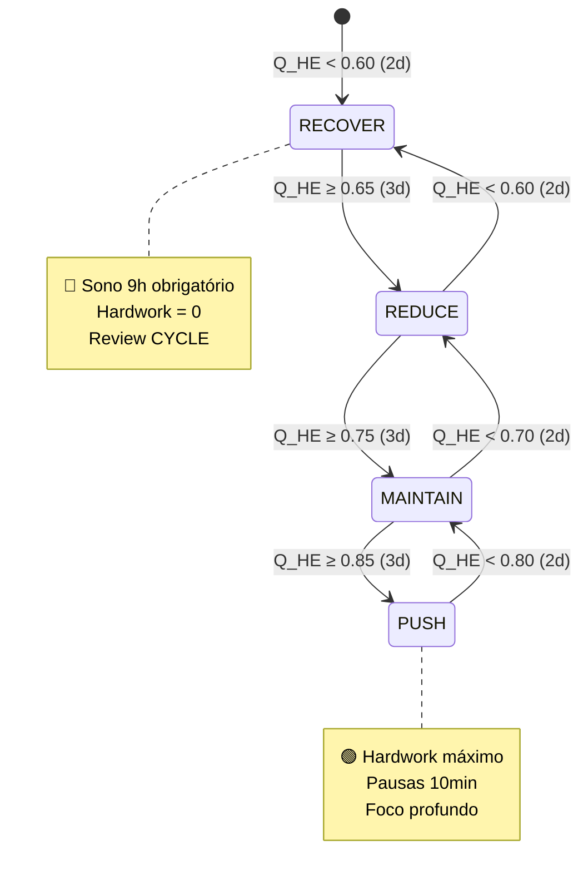

# 🔍 CRÍTICA DE RIGOR MATEMÁTICO & ENGENHARIA DE CONTEXTO
## *Revisão Espaçada, Axiomas de Auto-Performance e Eficiência Indexada por Hábitos*

---

## 📐 1. CRÍTICA ESTRUTURAL DO MODELO ATUAL

### ✅ Pontos Fortes (Mantidos)
| Componente | Rigor | Alinhamento ao Seu Caso |
|:-----------|:------|:------------------------|
| $H(t) = 1 - e^{-\lambda t}$ | ✅ Biologicamente válido | ✅ Captura consolidação assintótica de rotinas |
| $E(t) = t e^{-kt}$ | ✅ Assimetria de fadiga realista | ✅ Compatível com blocos Pomodoro e janelas de energia |
| MDP + Knapsack | ✅ Otimização multi-recurso | ✅ Pronto para alocação de energia diária finita |
| WAVE/CYCLE/PHASE | ✅ Fractal temporal coerente | ✅ Alinha revisão espaçada com checkpoints fisiológicos |

### ⚠️ Lacunas Críticas (A Corrigir)
| Lacuna | Impacto no Seu Caso | Solução Proposta |
|:-------|:-------------------|:-----------------|
| Tempo contínuo vs. realidade discreta | Seu sistema opera em blocos (50/10min), janelas fixas (3-5am, 18-21h), dias com/sem curso | Discretização por $\Delta t = 1 \text{ dia}$ com operadores de transição estocástica |
| Revisões não formalizadas como controle | Reviews são mencionados, mas não atuam como renormalizadores de $\lambda$ e $k$ | Operador $\mathcal{R}_n$ com gatilhos em $t \in \{7,15,30,45\}$ |
| Eficiência derivada, não indexada por hábitos | Você quer que sono/meditação/streaks modulem diretamente a eficácia do hardwork | Quociente $Q_{HE}$ com pesos adaptativos por rotina |
| Caos tratado como ruído, não como política | Infrações (acordar >5am, sono <6h) devem ativar downgrade de política, não apenas alertas | Matriz de decisão com histerese e compensação estocástica |

---

## 🔄 2. POSTULADOS DE REVISÃO ESPAÇADA (OPERADORES DE RENORMALIZAÇÃO)

### 📜 Postulado 1: A Revisão como Operador de Controle
> *"A consolidação de hábito não é um processo passivo. Revisões espaçadas atuam como operadores de renormalização que recalibram a taxa de aprendizado $\lambda$, drenam fadiga acumulada $k$, e renormalizam o vetor de estado $\mathbf{s}_t$."*

#### 🧮 Operador de Revisão Discreta $\mathcal{R}_n$
$$
\mathcal{R}_n(\mathbf{s}_t) = 
\begin{cases}
H_{n+1} = H_n + \alpha \cdot C_{comp} \cdot (1 - H_n) - \beta \cdot \sigma_E \\
k_{n+1} = k_n \cdot (1 - \gamma \cdot R_{qual}) \\
\lambda_{n+1} = \lambda_n \cdot (1 + \delta \cdot \Delta S_{streak})
\end{cases}
$$

| Parâmetro | Significado | Faixa | Gatilho |
|:----------|:------------|:------|:--------|
| $\alpha$ | Ganho de consolidação | $[0.1, 0.3]$ | $C_{comp} \geq 0.85$ |
| $\beta$ | Penalidade de variância energética | $[0.05, 0.15]$ | $\sigma_E > 2.0$ |
| $\gamma$ | Drenagem de fadiga por review | $[0.1, 0.25]$ | $R_{qual} \in \{BOM, EXCELENTE\}$ |
| $\delta$ | Aceleração por streak | $[0.02, 0.08]$ | $\Delta S_{streak} > 0$ |

#### 📅 Calendário de Gatilhos (Discreto)

```mermaid
gantt
    title Calendário de Revisões Espaçadas (WAVE/CYCLE)
    dateFormat  D
    axisFormat  %d
    
    section WAVE 1
    MID_WAVE (Ajuste Carga)   :d1, 7, 1d
    WAVE_END (Consolidação)   :d2, 15, 1d
    
    section CYCLE 1
    MID_CYCLE (Renormalização) :d3, 30, 1d
    CYCLE_END (Checkpoint)    :d4, 45, 1d
    
    section PHASE 1
    MID_PHASE (Estratégia)    :d5, 90, 1d
    PHASE_END (Maestria)      :d6, 180, 1d
```

---

## 🏛️ 3. AXIOMAS DE AUTO-PERFORMANCE & QUOCIENTES DE EFICIÊNCIA

### 📜 Axiomas Fundamentais (Single-Player)
| # | Axioma | Formulação | Implicação Prática |
|:--|:-------|:-----------|:-------------------|
| A1 | **Primazia do Hábito** | $P_{real} \propto H(t) \cdot E(t)$ | Horas de tela são consequência, não causa. Rotinas consolidadas geram performance automática. |
| A2 | **Eficiência Seletiva** | $\max \sum \frac{P_i}{E_{req,i}}$ s.t. $\sum E_{req,i} \leq E_{total}$ | Focar no que gera maior retorno por unidade de energia. Volume ≠ Eficácia. |
| A3 | **Anti-Fragilidade Temporal** | $\pi(\mathbf{s}_{t+1}) = \mathcal{F}(\mathbf{s}_t, \epsilon_t)$ | Violações de constantes não quebram o sistema; ativam políticas de compensação estocástica. |
| A4 | **Inércia de Streak** | $P(s \to s+1) = 1 - e^{-\mu s}$ | Quanto maior o streak, menor o custo cognitivo para manter a rotina. |

### 📊 Quociente de Eficiência Indexada por Hábitos ($Q_{HE}$)
$$
Q_{HE}(t) = \left( \frac{\sum_{i=1}^{n} w_i \cdot H_i(t)}{\sum w_i} \right) \cdot \frac{E(t)}{E_{max}} \cdot \left(1 + \eta \cdot \frac{S_{streak}}{S_{max}}\right)
$$

| Componente | Descrição | Peso Base ($w_i$) | Fonte de Dados |
|:-----------|:----------|:------------------|:---------------|
| $H_{sono}(t)$ | Consolidação da janela 18-21h → 3-5am | 0.35 | `SleepRecord` |
| $H_{med}(t)$ | Consolidação da meditação matinal | 0.20 | `HealthMetrics` |
| $H_{workout}(t)$ | Consolidação do treino físico | 0.25 | `HealthMetrics` |
| $H_{lunch}(t)$ | Consolidação do almoço leve (≤35min) | 0.10 | `TimeBlock` |
| $S_{streak}$ | Streak atual da rotina âncora | $\eta=0.15$ | `DecisionRecord` |

> 💡 **Interpretação:** $Q_{HE} \in [0, 1]$. Se $Q_{HE} \geq 0.85$, o sistema está em **Regime de Alta Eficácia**. O hardwork escala naturalmente. Se $Q_{HE} < 0.60$, ativar **Política de Recuperação** antes de tentar compensar com horas extras.

---

## 🎲 4. MATRIZES DE DECISÃO ESTOCÁSTICAS & ADAPTAÇÃO AO CAOS

### 🧭 Espaço de Estados Discreto $\mathbf{s}_t$
$$
\mathbf{s}_t = \left[ Q_{HE}(t), \; C_{comp}(t), \; \text{Infrações}_{24h}, \; \text{TipoDia} \right]
$$

### 📋 Matriz de Política $\pi(\mathbf{s}_t)$
| $Q_{HE}$ | $C_{comp}$ | Infrações | TipoDia | Política $\pi(\mathbf{s}_t)$ | Ação Imediata |
|:---------|:-----------|:----------|:--------|:-----------------------------|:--------------|
| $\geq 0.85$ | $\geq 0.90$ | 0 | Livre | 🟢 **PUSH** | Maximizar hardwork (9h) |
| $\geq 0.85$ | $\geq 0.90$ | 0 | Curso | 🟢 **PUSH** | Hardwork 4h + foco aula |
| $[0.70, 0.85)$ | $[0.80, 0.90)$ | ≤1 | Qualquer | 🟡 **MAINTAIN** | Seguir orçamento padrão |
| $[0.60, 0.70)$ | $[0.70, 0.80)$ | ≤2 | Qualquer | 🟠 **REDUCE** | -25% hardwork, pausas 15min |
| $< 0.60$ | $< 0.70$ | ≥2 | Qualquer | 🔴 **RECOVER** | Cancelar hardwork, sono 9h, review |

### 🌪️ Função de Adaptação ao Caos (Histerese)
$$
\pi_{t+1} = 
\begin{cases}
\text{UPGRADE} & \text{se } Q_{HE} \geq \theta_{up} \text{ por } 3 \text{ dias} \\
\text{DOWNGRADE} & \text{se } Q_{HE} \leq \theta_{down} \text{ por } 2 \text{ dias} \\
\text{HOLD} & \text{caso contrário}
\end{cases}
$$

| Limiar | Valor | Propósito |
|:-------|:------|:----------|
| $\theta_{up}$ | 0.80 | Evita oscilação por pico isolado |
| $\theta_{down}$ | 0.65 | Resposta rápida a degradação |
| Janela | 2-3 dias | Filtra ruído gaussiano ($\epsilon \sim \mathcal{N}$) |

---

## 🔌 5. INTEGRAÇÃO ARQUITETURAL (CLI → DATA-MESH)

### 🗺️ Mapeamento de Componentes
| Conceito Matemático | Módulo CLI | DataClass | Fluxo de Dados |
|:--------------------|:-----------|:----------|:---------------|
| $H(t), E(t), Q_{HE}$ | `business_logic/habit_engine.py` | `HabitState` | Calculado a cada `prod report daily` |
| $\mathcal{R}_n$ | `decorators/scheduler.py` | `ReviewTrigger` | Gatilho em $t \in \{7,15,30,45\}$ |
| $\pi(\mathbf{s}_t)$ | `business_logic/policy_engine.py` | `PolicyDecision` | Output no dashboard + alertas |
| $C_{comp}, \sigma_E$ | `models/core.py` | `TimeBlock`, `HealthMetrics` | Input manual CLI → agregação |
| Streak $S$ | `models/decision.py` | `DecisionRecord` | "O que fiz ontem que preciso fazer sempre?" |

### 🌐 Visão Data-Mesh (Futuro)

> 🔑 **Princípio de Separação:** O domínio de hábitos otimiza o *substrato biológico e cognitivo*. O domínio de trabalho/estudo consome $Q_{HE}$ e $\pi(\mathbf{s}_t)$ para ajustar orçamentos. A produtividade é emergente, não forçada.

---

## 🧠 6. QUESTÕES SOCRÁTICAS PARA PRÓXIMA ITERAÇÃO

1. **Sobre Pesos Adaptativos:** Os pesos $w_i$ em $Q_{HE}$ devem ser fixos ou evoluir via UCB (Upper Confidence Bound) conforme seu histórico pessoal? Qual rotina historicamente mais impacta sua energia vespertina?
2. **Sobre Revisões Espaçadas:** O operador $\mathcal{R}_n$ deve ser executado automaticamente ao fechar um bloco temporal, ou requer input narrativo ("O que aprendi?") para calibrar $\alpha, \beta, \gamma$?
3. **Sobre Caos vs. Rigidez:** Quando $Q_{HE} < 0.60$, o sistema força `RECOVER`. Você prefere um downgrade gradual (mantendo 1-2 pomodoros críticos) ou corte total para evitar dívida de fadiga?
4. **Sobre Streaks:** A pergunta *"O que fiz ontem que preciso fazer sempre?"* deve gerar um streak único global, ou múltiplos streaks por rotina (sono, meditação, almoço leve)? Qual granularidade evita fragilidade?
5. **Sobre Data-Mesh:** Quando plugarmos o domínio de trabalho, $Q_{HE}$ deve modular o orçamento de horas (ex: $Q_{HE}=0.7 \Rightarrow$ -30% hardwork), ou apenas sugerir realocação de tarefas (críticas vs. administrativas)?

---

## ✅ CHECKLIST DE REFINAMENTO MATEMÁTICO

| Tarefa | Status | Módulo Alvo |
|:-------|:------:|:------------|
| Discretizar $H(t), E(t)$ para $\Delta t = 1$ dia | 🔄 | `habit_engine.py` |
| Implementar $\mathcal{R}_n$ com gatilhos em 7/15/30/45 | ⬜ | `scheduler.py` |
| Calcular $Q_{HE}$ com pesos base + adaptação UCB | ⬜ | `policy_engine.py` |
| Matriz $\pi(\mathbf{s}_t)$ com histerese 2-3 dias | ⬜ | `policy_engine.py` |
| Mapear "O que fazer sempre?" → Streak indexado | ⬜ | `decision.py` |
| Preparar schema Data-Mesh para cross-domain | ⬜ | `mesh/schema.py` |

---

> 💡 **Síntese:** Produtividade não é volume. É a derivada da consistência habitual multiplicada pela energia disponível. Este modelo transforma suas rotinas em *ativos compostos*: quanto mais consolidadas, menor o custo cognitivo, maior a eficácia do hardwork, e mais resiliente o sistema ao caos diário.

Deseja que eu formalize a implementação discreta de $Q_{HE}$ e $\mathcal{R}_n$ em pseudocódigo pronto para `habit_engine.py`, ou prefere primeiro calibrar os pesos $w_i$ com seus dados históricos reais? 🧭