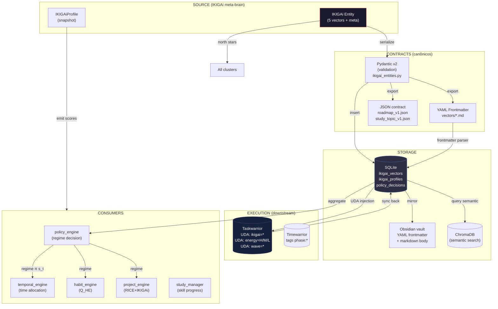

# IKIGAi Propagation — Data Flow Across Contracts

> Como os 5 vetores IKIGAi **propagam dados** entre contratos YAML, Pydantic,
> SQLite, Taskwarrior UDAs, e Obsidian frontmatter.
>
> Este doc é o **guia do integrador**: mostra o "caminho do dado" de ponta
> a ponta, sem ambiguidade.

---

## 1. Os 5 "Produtos" que IKIGAi Propaga

O meta-brain IKIGAi emite 5 tipos de **produtos canônicos** que fluem
pelos contratos:

| # | Produto | Tipo | Quem consome | Cluster |
|---|---|---|---|---|
| 1 | **Vector scores** (4+1 floats) | $0 \leq s_i \leq 100$ | `policy_engine`, `temporal_engine`, `habit_engine` | PLAN |
| 2 | **Vector weights** ($w_1..w_5$) | $0 \leq w_i \leq 1.5$ | `temporal_engine` (alocação), `project_engine` (RICE) | PLAN/PROJ |
| 3 | **Regime** $\pi(s_t)$ | enum: PUSH/MAINTAIN/REDUCE/RECOVER | `temporal_engine`, `cluster_plan`, `cluster_proj` | PLAN |
| 4 | **Phase** (FUNDAÇÃO/BUSCA/HACKATHON/RECOVER/OVERCLOCK) | enum: 5 phases | IKIGAi weights recalibration | PLAN |
| 5 | **Alignment score** $\|\vec{I}\|$ | $0 \leq score \leq 100$ | `AI Harness` (epistemic, metrics), `triagem` | (hub) |

## 2. Diagrama de Propagação



## 3. Contratos de Fronteira (por produto)

### 3.1. Vector scores → policy_engine

```yaml
# Contrato de entrada para policy_engine
vector_scores:
  passion: 78.0     # 0-100
  skill: 82.0
  market: 65.0
  revenue: 71.0
  course: 88.0
  ikigai_score: 76.5  # meta-vetor
  alignment_label: "converging"

# Output policy_engine:
regime: "PUSH"  # PUSH|MAINTAIN|REDUCE|RECOVER
rationale: "Q_HE 0.87 + ikigai_score 76 + stable 5d"

# Source of truth: vibe-ops/src/storage/schema.sql `policy_decisions`
# Storage: SQLite `ikigai_vectors` (a criar) + `policy_decisions` (existe)
```

### 3.2. Vector weights → temporal_engine

```yaml
# Pesos dinâmicos por fase
phase: "FUNDAÇÃO"
weights:
  w_passion: 0.15
  w_skill: 0.40
  w_market: 0.15
  w_revenue: 0.10
  w_course: 0.20

# Output temporal_engine:
allocation:
  bloco_manha_min: 90   # 3-5h treino + 5-6h deep work
  bloco_tarde_min: 240  # 14-17h hard work
  bloco_noite_min: 120  # 18-20h shutdown

# Source of truth: IKIGAi north star + atual fase
# Storage: SQLite `temporal_waves`, `temporal_cycles`, `temporal_phases`
```

### 3.3. Vector scores → Taskwarrior UDA

```bash
# Injeção de UDA ikigai em tasks
task add "Implementar JWT auth" project:vibe-ops \
    ikigai:revenue \
    energy:H \
    wave:wave-2026-Q2-1

# Mapeamento (PRD-04 §4):
# ikigai:revenue → revenue_vector_priority
# energy:H → uda_energy
# wave:wave-2026-Q2-1 → uda_wave
```

### 3.4. Vector scores → Obsidian Frontmatter

```yaml
# Frontmatter canônico (vectors/vector-passion.md, etc.)
---
type: ikigai_vector
vector: passion
name: "Software Engineering & Problem Solving"
current_score: 78
target_score: 90
activities:
  - "Coding side projects"
  - "Contributing to open source"
projects:
  - "vibe-ops"
  - "AxeGuard"
habits:
  - "morning-code"
  - "reading-tech"
trend: up
last_updated: "2026-05-10"
ikigai_score: 76.5
alignment_label: "converging"
---
```

### 3.5. Regime → setpoints (downstream)

```yaml
# policy_engine emite regime, temporal_engine consome
regime: PUSH
setpoints:
  hardwork_budget_h: 4.0
  pause_min: 10
  sleep_target_h: 7.5
  qhe_target: 0.85
  c_comp_target: 0.90

# Source: vibe-ops/src/schemas/pydantic_v2.py PolicyState
# Storage: SQLite `policy_decisions`
```

## 4. Garantias de Consistência

### 4.1. Schema-First (ADR-001 §2.1)

Todo contrato de dados é definido **antes** da implementação:
- YAML schema → Pydantic v2 → SQL DDL → TW UDAs
- Mudança no schema = migração versionada

### 4.2. Idempotência via `upstream_id` (12-char SHA-256 prefix)

- **Plan entities**: `upstream_id = SHA-256(file_path)[:12]`
- **Tasks**: `tw_uuid` é o FK
- **Sync**: re-executar pipeline **não cria duplicatas**

### 4.3. Append-Only (vibe-ops convention)

- Documentos de planejamento **nunca** sobrescritos
- Versões incrementadas no nome do arquivo (e.g., `vibe-ops-2.yaml`)
- Histórico mantido em `score_history` (VectorScorePoint)

### 4.4. Human-in-the-Loop

- Humano escreve Markdown (vectors/*.md, Obsidian frontmatter)
- Pipeline extrai e enriquece (Pydantic → SQLite)
- Humano aprova triagens (triagem.md)
- AI Harness apenas **sugere**, não decide

### 4.5. Single FK Strategy (ADR-001)

Para evitar explosão de UDAs, Taskwarrior carrega **apenas o nó folha**:
- TW: `project:O2.M3` (FK único)
- Data-Mesh: conhece árvore completa `S1 → O2 → M3`
- Sync enriquece automaticamente

## 5. Pontos de Atenção (Failure Modes)

| Failure Mode | Detecção | Mitigação |
|---|---|---|
| Drift: Pydantic ≠ SQL | Test suite (Sprint 1) | Migrations Alembic |
| Drift: TW UDAs ≠ YAML | `triagem.md` (orfa tasks) | Sync reverso valida |
| Drift: vectors/*.md ≠ ikigai_scorer.py output | Validação semanal | Sprint 1 reescreve scorer |
| Drift: regime ≠ regime setpoints | CLI `life plan check-policy` (a criar) | Override manual documentado |

## 6. Cross-refs

| Doc | Propósito |
|---|---|
| [`vibe-ops/architecture/ADR-001-data-flow-topology.md`](../../../vibe-ops/architecture/ADR-001-data-flow-topology.md) | Princípios topológicos |
| [`vibe-ops/architecture/ADR-002-mesh-contracts-state-machines.md`](../../../vibe-ops/architecture/ADR-002-mesh-contracts-state-machines.md) | Contratos tipados |
| [`vibe-ops/architecture/ADR-003-ikigai-as-meta-brain.md`](../../../vibe-ops/architecture/ADR-003-ikigai-as-meta-brain.md) | IKIGAi como meta-brain |
| [`vibe-ops/architecture/ADR-005-data-mesh-topology.md`](../../../vibe-ops/architecture/ADR-005-data-mesh-topology.md) | Topologia data-mesh |
| [`vibe-ops/doc/01-data-mesh-strategy.md`](../../../vibe-ops/doc/01-data-mesh-strategy.md) | Estratégia |
| [`vibe-ops/doc/01.5-data-contracts-and-pipelines.md`](../../../vibe-ops/doc/01.5-data-contracts-and-pipelines.md) | Contratos + pipelines (master) |
| [`vibe-ops/specs/SPEC-05-cybernetic-epistemic-mesh.md`](../../../vibe-ops/specs/SPEC-05-cybernetic-epistemic-mesh.md) | Hybrid RAG |
| [`vibe-ops/specs/schema-frontmatter-contract-v2.md`](../../../vibe-ops/specs/schema-frontmatter-contract-v2.md) | Frontmatter canônico |
| [`vibe-ops/specs/schema-pydantic-models-v2.md`](../../../vibe-ops/specs/schema-pydantic-models-v2.md) | Pydantic v2 canônico |
| [`vibe-ops/src/contracts/planning.v1.yaml`](../../../vibe-ops/src/contracts/planning.v1.yaml) | Contrato planning |
| [`vibe-ops/src/contracts/registry.yaml`](../../../vibe-ops/src/contracts/registry.yaml) | Schema registry |
| [`vibe-ops/contracts/roadmap_v1.json`](../../../vibe-ops/contracts/roadmap_v1.json) | Roadmap JSON |
| [`vibe-ops/contracts/study_topic_v1.json`](../../../vibe-ops/contracts/study_topic_v1.json) | Study topic JSON |
| [`vibe-ops/src/middleware/sync_engine.py`](../../../vibe-ops/src/middleware/sync_engine.py) | Sync engine (Obsidian↔SQLite↔TW) |
| [`vibe-ops/src/pipeline/policy_engine.py`](../../../vibe-ops/src/pipeline/policy_engine.py) | Regime state machine |

---

*ikigai_propagation.md — v1.0 — 2026-06-05 — Como IKIGAi propaga dados entre contratos/DBs*
