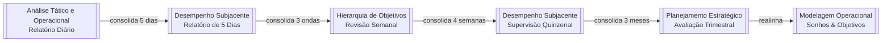
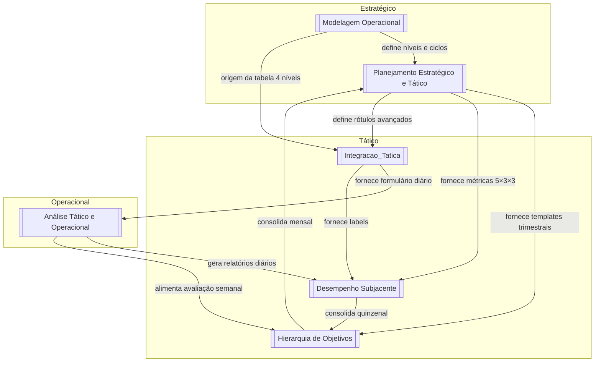

# 00 — ÍNDICE PROGRESSIVO: Guidelines Teóricos

> **Mapa de navegação exclusivo da camada estratégica/tática/operacional** do Algorithmic Life OS.
> Este índice cobre **apenas** os 6 documentos de `strategics/` (mirror em `time-tasker/strategics/`).
> Use-o como **ponto de partida** para qualquer planejamento, análise ou revisão de ciclo.

---

## 🔌 CENTRAL ENGINE: Planning-with-Files

> **Status:** Active · **Path:** `strategics/planning-with-files/` · **Version:** v3.1.3
>
> The **canonical planning engine** for all long-running agentic tasks. Installed via:
> ```bash
> cd strategics/planning-with-files && git pull   # periodic update
> ```
>
> Provides 3 persistent files per task (`task_plan.md`, `findings.md`, `progress.md`) +
> a **deterministic completion gate** that holds the agent until the plan is actually done.
> Used as the standard for `.omo/plans/*.md` and `.omo/evidence/*.txt` in this repo.
>
> **Route map:**
> - `skills/` — SKILL.md standard for 60+ agents (Claude Code, Codex, Cursor, Kiro, OpenCode, Hermes, Factory, Continue, Gemini, Mastra, Pi, etc.)
> - `commands/` — slash commands (`/plan-goal`, `/plan-loop`, `/plan-status`, `/plan-attest`)
> - `templates/` — task_plan.md template, loop.md, autonomous variants
> - `docs/` — evals.md, perf-notes.md, attestation-locking.md, integration guides
> - `examples/` — real-world usage examples
>
> **Update policy:** Run `git pull` in `strategics/planning-with-files/` monthly or when
> a new version is announced. The engine is source-of-truth for the planning loop semantics
> (completion gate, hash attestation, parallel isolation, etc.).

---

## 🗺️ Mapa Conceitual: De onde começar?

```
┌─────────────────────────────────────────────────────────────────────────────┐
│                         PIRÂMIDE DE GRANULARIDADE                           │
├─────────────────────────────────────────────────────────────────────────────┤
│                                                                             │
│     ┌─────────────────────────────────────────────────────────────┐        │
│     │                     ESTRATÉGICO                             │        │
│     │  ┌─────────────────────┐    ┌─────────────────────────────┐│        │
│     │  │ Modelagem           │◄──►│ Planejamento                ││        │
│     │  │ Operacional         │    │ (Estratégico e Tático)      ││        │
│     │  │ • Pirâmide E/T/O    │    │ • Dual-Frame PAE×Hierárquico││        │
│     │  │ • 4 Níveis          │    │ • Proporção 5×3×3           ││        │
│     │  │ • Ciclo de 180 dias │    │ • Teste de Fogo             ││        │
│     │  └─────────────────────┘    └─────────────────────────────┘│        │
│     └─────────────────────────────────────────────────────────────┘        │
│                                ▼                                            │
│     ┌─────────────────────────────────────────────────────────────┐        │
│     │                      TÁTICO                                 │        │
│     │  ┌─────────────────┐  ┌─────────────────┐  ┌─────────────┐ │        │
│     │  │ Hierarquia de   │  │ Desempenho      │  │ Integração  │ │        │
│     │  │ Objetivos       │  │ Subjacente      │  │ Tática      │ │        │
│     │  │ • Rev. Semanal  │  │ • Folha 5×3×3   │  │ • Labels    │ │        │
│     │  │ • Rev. Mensal   │  │ • Supervisão    │  │ • Tags      │ │        │
│     │  │ • Templates     │  │   Quinzenal     │  │ • Formulário│ │        │
│     │  └─────────────────┘  └─────────────────┘  └─────────────┘ │        │
│     └─────────────────────────────────────────────────────────────┘        │
│                                ▼                                            │
│     ┌─────────────────────────────────────────────────────────────┐        │
│     │                    OPERACIONAL                              │        │
│     │           ┌─────────────────────────────┐                  │        │
│     │           │ Análise (Tático e           │                  │        │
│     │           │  Operacional)               │                  │        │
│     │           │ • Blocos Diários            │                  │        │
│     │           │ • Rotina Inicial/Final      │                  │        │
│     │           │ • Relatórios Diários        │                  │        │
│     │           └─────────────────────────────┘                  │        │
│     └─────────────────────────────────────────────────────────────┘        │
│                                                                             │
└─────────────────────────────────────────────────────────────────────────────┘
```

**Regra de Ouro:**  
> `Modelagem Operacional` define **o que** e **por quê**.  
> `Planejamento (Estratégico e Tático)` define **quando** e **quanto**.  
> `Hierarquia de Objetivos` + `Desempenho Subjacente` definem **como avaliar**.  
> `Integração Tática` define **como registrar e etiquetar**.  
> `Análise (Tático e Operacional)` define **como executar no dia a dia**.

---

## 1. ESTRATÉGICO — Visão de Longo Prazo (6-12 meses)

### 1.1 Modelagem Operacional
**Função:** *O DNA do sistema.* Define a pirâmide de desempenho, os 4 níveis de granularidade e a estrutura cíclica integrada (PAE + Hierárquica).

**Seções-chave e links de navegação:**
- **Níveis da Pirâmide** → Se você chegou aqui vindo de uma revisão mensal, retorne para [[Planejamento (Estratégico e Tático)#3.1 Planejamento Trimestral]]
- **Dual-Frame Temporal** → Para ver a proporção 5×3×3 detalhada, vá para [[Planejamento (Estratégico e Tático)#1.1.2 Proporção 5x3x3]]
- **Hierarquia de Objetivos** → Para rastrear sonhos até tarefas, veja [[Integracao_Tatica#3 Fluxo de Registro e Revisão por Nível]]
- **Blocos Diários** → Para descer ao nível operacional, vá para [[Análise (Tático e Operacional)#2.3 Blocos de Tempo (Diários)]]

**Tabela-resumo:**

| Conceito | PAE | Estrutura Hierárquica | Onde aprofundar |
|----------|-----|----------------------|-----------------|
| Ciclo base | Trimestre (Q1-Q4) | 45 dias úteis | [[Planejamento (Estratégico e Tático)#1.1.1]] |
| Subdivisão | Meses/Semanas | Ondas de 3 semanas | [[Planejamento (Estratégico e Tático)#2.1.2]] |
| Revisão estratégica | Mensal (fim do trimestre) | Após 180 dias úteis | [[Desempenho Subjacente#3 Dimensão: Planejamento]] |

---

### 1.2 Planejamento (Estratégico e Tático)
**Função:** *O manual de construção.* Expandemétricas, protocolos avançados, templates e mecanismos de garantia de qualidade.

**Seções-chave e links de navegação:**
- **Proporção 5×3×3** → Para ver como isso vira rotina diária: [[Análise (Tático e Operacional)#2 Micro-Fase]]
- **Macro-Fase (180 dias)** → Para acompanhar por ciclos menores: [[Desempenho Subjacente#2.2 Revisão Geral da Onda]]
- **Teste de Fogo** → Para as 5 dimensões de avaliação, correlacione com [[Hierarquia de Objetivos#3 Visão Geral do Relatório]]
- **Correção do Trajeto** → Para o protocolo pós-onda: [[Análise (Tático e Operacional)#2.2 Ondas]]
- **Sistema Kaizen** → Para o loop diário de melhoria: [[Análise (Tático e Operacional)#Rotina Final]]
- **Sistema de Rótulos** → Para a convenção completa: [[Integracao_Tatica#2 Estrutura de Documentação]]

**Diagrama de decisão estratégica (ASCII):**

```
Início do Trimestre
       │
       ▼
┌─────────────────┐
│ Definir Sonhos  │────► [[Modelagem Operacional#1.2 Componentes]]
│ (6-12 meses)    │
└────────┬────────┘
         │
         ▼
┌─────────────────┐
│ Quebrar em      │────► [[Planejamento (Estratégico e Tático)#1.2 Hierarquia de Objetivos]]
│ Objetivos       │
│ (3 meses)       │
└────────┬────────┘
         │
         ▼
┌─────────────────┐     Não     ┌─────────────────────────────┐
│ Passa no Teste  │────────────►│ Correção do Trajeto         │
│ de Fogo?        │             │ [[Planejamento#3.2]]        │
└────────┬────────┘             └─────────────────────────────┘
         │ Sim
         ▼
┌─────────────────┐
│ Replanejar      │────► [[Desempenho Subjacente#3.2 Avaliação Trimestral]]
│ Próximo Ciclo   │
└─────────────────┘
```

---

## 2. TÁTICO — Execução e Avaliação Intermediária (15 dias – 3 meses)

### 2.1 Hierarquia de Objetivos
**Função:** *Os templates de revisão.* Fornece estruturas padronizadas para Revisão Semanal (meta-oriented) e Revisão Mensal (sonho-oriented).

**Seções-chave e links de navegação:**
- **Revisão Semanal** → Alimenta o relatório quinzenal em [[Desempenho Subjacente#2.1 Supervisão Quinzenal]]
- **Revisão Mensal** → Consolida dados para o [[Planejamento (Estratégico e Tático)#6.2 Modelo de Avaliação Trimestral]]
- **Tabela de Metas** → Os status aqui alimentam o Kanban descrito em [[Análise (Tático e Operacional)#5.1 Visão Geral]]

---

### 2.2 Desempenho Subjacente
**Função:** *A folha de pontuação.* Intersecta execução (5 dias), análise (3 semanas) e planejamento (3 meses) na proporção 5×3×3.

**Seções-chave e links de navegação:**
- **Dimensão Execução (5 dias)** → Para o registro diário detalhado: [[Análise (Tático e Operacional)#2.4 Relatórios e Supervisões]]
- **Dimensão Análise (3 semanas)** → Para a supervisão quinzenal: [[Planejamento (Estratégico e Tático)#3.3 Sistema de Supervisão Quinzenal]]
- **Dimensão Planejamento (3 meses)** → Para o planejamento trimestral: [[Planejamento (Estratégico e Tático)#6.1 Modelo de Planejamento Trimestral]]
- **Template Principal de Diligência** → Use em conjunto com [[Integracao_Tatica#5.2 Relatórios]]

**Fluxo de consolidação (Mermaid):**



---

### 2.3 Integracao_Tatica
**Função:** *O sistema nervoso.* Conecta todos os níveis via labels, tags e fluxo de registro padronizado.

**Seções-chave e links de navegação:**
- **Organização em 4 Níveis** → Origem da tabela em [[Modelagem Operacional#1. Organização em Níveis de Granularidade]]
- **Labels Gerais** → Implementação prática dos rótulos de [[Planejamento (Estratégico e Tático)#4.1 Sistema de Rótulos]]
- **Formulário Diário** → Aplicado nas rotinas de [[Análise (Tático e Operacional)#Rotina inicial]]
- **Interface Kanban/Pyplot** → Visualização dos dados de [[Hierarquia de Objetivos#Seção 2: Avaliação Detalhada das Metas]]

**Modelo relacional de tags (ASCII):**

```
Sonho: #PublicarLivro
   │
   ├──► Objetivo: #RascunhoCap1 (revisão quinzenal #revisão)
   │       │
   │       ├──► Meta: #Semana1-Escrever20pg (relatório semanal #relatórios)
   │       │       │
   │       │       ├──► Tarefa Diária: #Dia1-5pg (narrativa #narrativa)
   │       │       │       └──► Label: #escrita_execucao_diaria_ativo
   │       │       │
   │       │       └──► Checklist: [[Integracao_Tatica#3.4 Nível 4: Tarefas]]
   │       │
   │       └──► Vinculação: [[Modelagem Operacional#3.1 Nível 1: Sonhos]]
   │
   └──► Tag Área: #Carreira
```

---

## 3. OPERACIONAL — Execução Imediata (Diária)

### 3.1 Análise (Tático e Operacional)
**Função:** *O campo de batalha.* Blocos diários, rotinas de alinhamento/balanceamento e relatórios de eficiência.

**Seções-chave e links de navegação:**
- **Micro-Fase / Ciclos** → Para entender o contexto de 45 dias úteis: [[Planejamento (Estratégico e Tático)#2.1.2 Micro-Fase]]
- **Ondas** → Para a revisão após 3 semanas: [[Desempenho Subjacente#2.2 Revisão Geral da Onda]]
- **Blocos Diários** → Para o sistema de blocagem temporal: [[Planejamento (Estratégico e Tático)#2.2 Estrutura Diária]]
- **Rotina Inicial** → Questões matinais correlacionadas com [[Integracao_Tatica#4 Formulário Diário]]
- **Rotina Final** → Questões noturnas que alimentam [[Desempenho Subjacente#1.1 Estrutura dos Registros Diários]]
- **Interface de Relatórios** → Kanban/Calendário/Pyplot descritos em [[Integracao_Tatica#5.1 Visão Geral]]

---

## 4. TOPOLOGIA RELACIONAL ENTRE OS DOCUMENTOS

### 4.1 Diagrama de dependência (Mermaid)



### 4.2 Matriz de Interseção Estratégica × Tática × Operacional

```
                    │  ESTRATÉGICO        │  TÁTICO             │  OPERACIONAL
────────────────────┼─────────────────────┼─────────────────────┼─────────────────────
Documento Principal │ Modelagem Op.       │ Hierarquia de Obj.  │ Análise T&O
                    │ Planejamento E&T    │ Desempenho Sub.     │
                    │                     │ Integração Tática   │
────────────────────┼─────────────────────┼─────────────────────┼─────────────────────
Pergunta Central    │ O QUE fazer?        │ COMO está indo?     │ O QUE foi feito
                    │ POR QUÊ?            │ O QUE ajustar?      │ hoje?
────────────────────┼─────────────────────┼─────────────────────┼─────────────────────
Horizonte           │ 6-12 meses          │ 15 dias – 3 meses   │ 1 dia
────────────────────┼─────────────────────┼─────────────────────┼─────────────────────
Produto Principal   │ Sonhos & Objetivos  │ Relatórios de       │ Narrativa + Checklist
                    │                     │ avaliação           │
────────────────────┼─────────────────────┼─────────────────────┼─────────────────────
Revisão             │ Mensal/Trimestral   │ Quinzenal/Semanal   │ Diária
────────────────────┼─────────────────────┼─────────────────────┼─────────────────────
Tag Principal       │ #supervisão         │ #revisão /          │ #narrativa /
                    │                     │ #relatórios         │ #to-do
────────────────────┼─────────────────────┼─────────────────────┼─────────────────────
Link Downstream     │ Planejamento E&T    │ Integração Tática   │ ───
                    │                     │ Análise T&O         │
────────────────────┼─────────────────────┼─────────────────────┼─────────────────────
Link Upstream       │ ───                 │ Modelagem Op.       │ Desempenho Sub.
                    │                     │ Planejamento E&T    │ Integração Tática
```

---

## 5. FLUXO PROGRESSIVO DE USO (Walkthrough)

### Dia 1 — Primeiro contato com o sistema
1. Leia **[[Modelagem Operacional]]** inteiro para entender a pirâmide.
2. Pule para **[[Planejamento (Estratégico e Tático)#1.2 Hierarquia de Objetivos]]** e defina seus sonhos.
3. Use **[[Integracao_Tatica#3.1 Nível 1: Sonhos]]** para estruturar o registro.

### Dia 2-5 — Primeira semana operacional
1. Execute a **[[Análise (Tático e Operacional)#Rotina inicial]]** pela manhã.
2. Execute os blocos diários conforme **[[Planejamento (Estratégico e Tático)#2.2.1 Sistema de Blocagem Temporal]]**.
3. Execute a **[[Análise (Tático e Operacional)#Rotina Final]]** à noite.
4. Use **[[Integracao_Tatica#3.4 Nível 4: Tarefas]]** para checklists.

### Dia 7 — Primeira revisão semanal
1. Abra **[[Hierarquia de Objetivos#1. Revisão Semanal]]** e preencha o template.
2. Transfira taxas de conclusão para **[[Desempenho Subjacente#1.2 Relatório Consolidado]]**.

### Dia 15 — Primeira supervisão quinzenal
1. Abra **[[Desempenho Subjacente#2.1 Supervisão Quinzenal]]**.
2. Aplique o **[[Planejamento (Estratégico e Tático)#3.2 Correção do Trajeto]]** se necessário.

### Dia 45 — Fim da primeira onda
1. Execute a **[[Análise (Tático e Operacional)#2.2 Ondas]]**: Revisão Geral / Correção do Trajeto.
2. Atualize **[[Planejamento (Estratégico e Tático)#6.2 Modelo de Avaliação Trimestral]]**.

### Dia 180 — Teste de Fogo
1. Aplique o template de **[[Planejamento (Estratégico e Tático)#3.1 Teste de Fogo]]**.
2. Reinicie o ciclo estratégico em **[[Modelagem Operacional]]**.

---

## 6. NAVEGAÇÃO RÁPIDA POR OBJETIVO

| Se você quer... | Vá direto para... | E depois para... |
|-----------------|-------------------|------------------|
| Entender o sistema todo em 5 min | [[Modelagem Operacional#Níveis da Pirâmide do Desempenho]] | [[Planejamento (Estratégico e Tático)#1.2 Hierarquia de Objetivos]] |
| Planejar um sonho de longo prazo | [[Planejamento (Estratégico e Tático)#6.1 Modelo de Planejamento Trimestral]] | [[Integracao_Tatica#3.1 Nível 1: Sonhos]] |
| Criar uma rotina diária | [[Análise (Tático e Operacional)#2.3 Blocos de Tempo]] | [[Planejamento (Estratégico e Tático)#2.2.2 Protocolo de Execução por Bloco]] |
| Fazer uma revisão de sábado | [[Hierarquia de Objetivos#1. Revisão Semanal]] | [[Desempenho Subjacente#1.2 Relatório Consolidado]] |
| Calcular minha eficiência | [[Planejamento (Estratégico e Tático)#1.1.2]] (fórmula) | [[Desempenho Subjacente#2.1 Supervisão Quinzenal]] |
| Corrigir o planejamento após uma onda ruim | [[Planejamento (Estratégico e Tático)#3.2 Correção do Trajeto]] | [[Análise (Tático e Operacional)#2.2 Ondas]] |
| Definir labels para busca futura | [[Integracao_Tatica#2 Estrutura de Documentação]] | [[Planejamento (Estratégico e Tático)#4.1 Sistema de Rótulos]] |
| Ver se estou alinhado com meus sonhos | [[Planejamento (Estratégico e Tático)#7.2 Sistema de Garantia de Coerência]] | [[Hierarquia de Objetivos#2. Revisão Mensal]] |

---

## 7. GLOSSÁRIO CRUZADO DOS DOCUMENTOS

| Termo | Definido em | Usado em |
|-------|-------------|----------|
| **PAE** | [[Modelagem Operacional]] | [[Planejamento (Estratégico e Tático)]], [[Análise (Tático e Operacional)]] |
| **Onda** | [[Modelagem Operacional#2.2 Ondas]] | [[Planejamento (Estratégico e Tático)#2.1.2]], [[Análise (Tático e Operacional)#2.2]] |
| **Ciclo (45 dias)** | [[Modelagem Operacional#2.1 Macro-Fase]] | [[Desempenho Subjacente#2.2]], [[Análise (Tático e Operacional)#2 Micro-Fase]] |
| **Teste de Fogo** | [[Planejamento (Estratégico e Tático)#3.1]] | [[Modelagem Operacional#1.2]] |
| **Correção do Trajeto** | [[Planejamento (Estratégico e Tático)#3.2]] | [[Análise (Tático e Operacional)#2.2]] |
| **Supervisão Quinzenal** | [[Desempenho Subjacente#2.1]] | [[Planejamento (Estratégico e Tático)#3.3]] |
| **Balanceamento** | [[Análise (Tático e Operacional)#2.4]] | [[Desempenho Subjacente#1.1]] |
| **Arremate** | [[Planejamento (Estratégico e Tático)#Glossário]] | [[Análise (Tático e Operacional)#2.3]] |
| **Proporção 5×3×3** | [[Planejamento (Estratégico e Tático)#1.1.2]] | [[Desempenho Subjacente#Estrutura Geral]] |

---

## 8. NOTAS DE MANUTENÇÃO DESTE ÍNDICE

- Ao criar um novo documento em `strategics/`, registre-o na **Seção 4** (Topologia Relacional).
- Ao renomear uma seção, atualize os *anchor links* deste índice.
- O mirror `time-tasker/strategics/` deve manter os mesmos nomes de arquivo para os links funcionarem em ambos os contextos.
- Tags como `#execucao-semanal` e `#execucao-diaria` são definidas em [[Hierarquia de Objetivos]] e [[Análise (Tático e Operacional)]], respectivamente.

---

*Índice progressivo estratégico-tático-operacional*  
*Atualizado em: 2026-05-15*

---

## Commit Log

### 2026-06-30 — Central Engine Integration

- **Repo cloned:** `planning-with-files` v3.1.3 → `strategics/planning-with-files/`
- **Index updated:** `strategics/00-ÍNDICE-PROGRESSIVO.md` (added 🔌 Central Engine section)
- **Policy docs updated:** `system_architecture_and_tracking_framework.md`, `design_system_and_knowledge_tracking.md` (added engine references)
- **Theory docs (5):** `Planejamento (E&T)`, `Hierarquia de Objetivos`, `Desempenho Subjacente`, `Integracao_Tatica`, `Análise (T&O)` (added engine references)
- **Commits:**
  - `ebf049d docs(strategics): add planning-with-files as central engine reference` (index)
  - (next commit) `docs(strategics): add central engine reference to all 6 theory docs`
- **Update policy:** Run `cd strategics/planning-with-files && git pull` monthly

## Session Log

- **2026-06-30:** 2 boulders closed (period-reports-sync + agentic-markdown-system), 91 evidence files
- **2026-06-30:** planning-with-files repo cloned to strategics/ as central engine
- **2026-06-30:** Routes updated across 8 strategics docs (6 theory + 2 policy)
- **Current HEAD:** `ebf049d62baac43e7b3c6b9000967fc92cfb951c`
- **Next available plans:** vault-bidirectional-sync.md, pav-tui-textualize.md
