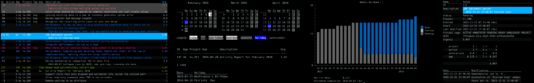
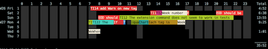

# Engenharia de Pipelines: Contratos Off-Chain e Operação "Zero-Input"

Este documento detalha a engenharia do fluxo de dados (Data Pipeline) que conectará o Planejamento em Markdown/Backlogs ao Taskwarrior, visando minimizar o erro humano e maximizar o registro de metadados sem exigir digitação manual no terminal.

## 1. O Conceito: Modelagem Off-Chain e API Push

Sob a arquitetura de Data-Mesh, criaremos um "Compilador de Backlog" (um script ou agente estruturado). O fluxo funcionará da seguinte maneira:

1. **Modelagem de Dados Upstream:** Você define estruturas aninhadas em Markdown usando listas ou tabelas (ex: `## Sprint 1`, `- [ ] Feature Login -> 2h`). Este ambiente é flexível para Elicitação de Requisitos e PDR (Product Design Requirements).
2. **O Pipeline de Dados (API Push):** O script lê o repositório de Markdown, processa os requisitos, cruza os metadados estabelecidos no contexto do documento (Qual é o Sonho/Objetivo raiz desse projeto?) e **injeta** as tarefas diretamente no banco SQLite (`.task`) ou compila os arquivos `.data` via chamadas de API do Taskwarrior ou binário CLI oculto.
3. **Tarefas Fortemente Tipadas (Zero Esforço):** Quando a tarefa "cai" no Taskwarrior, ela já vem com *todas* as anotações geradas algoritmicamente. O projeto raiz, o `due date` calculado pelo calendário base, e a única chave (UDA) referenciando seu nó no grafo de planejamento.

## 2. A Rotina Operacional: "Read-and-Execute Only" e Visualização Terminal-Native

A principal métrica de sucesso desse pipeline é a eliminação do input manual. O seu dia a dia no terminal será focado exclusivamente em gerir o estado de execução:

* `task ls` (Visualizar o que o algoritmo preparou como prioridade)
* `task <id> start` (Ligar o cronômetro do Timewarrior para medir o ROI e tempo gasto)
* `task <id> stop` ou `task <id> done` (Mudar o estado binário)

Uma vez que o *Pipeline* injetou a carga de dados invisivelmente via API, você passa a ter acesso imediato a **Relatórios Gráficos e Analíticos diretamente no Terminal**, tirando proveito dos *built-ins* do ecossistema:

### Dashboards e Outputs Analíticos Nativos e Plugins

1. **Taskwarrior Burndowns & Calendários:**

   * `task burndown.daily` / `weeky` / `monthly`: Gera gráficos ASCII mostrando a taxa de resolução (Net Fix Rate) para entender se a *Sprint* está convergindo.
   * `task ghistory`: Mostra um histograma gráfico de tarefas criadas vs concluídas por mês.
   * `task calendar`: Rendenriza um calendário visual demarcando os vencimentos e feriados.
   * `task summary`: Plota um resumo tabular do progresso percentual orgânico por projeto (`project:S1`).
2. **Timewarrior Reports & Timelines:**

   * `timew summary`: Extrato analítico rígido com o tempo total logado por `tag` ou `project`.
   * `timew chart`: Renderiza um formidável gráfico de Gantt multi-colorido no terminal, ilustrando o *timeline* visual dos seus blocos de foco durante o dia (ver gráficos estilo timeline).
3. **Terminal UIs e Plugins Essenciais (Acíclicos):**
   Para estender a visualização local *antes* mesmo de recorrer à interface do Data-Mesh web, integram-se ferramentas de UI de terminal conectadas à mesma ponte CLI:

   * **`taskwarrior-tui`:** Software em Rust que encapsula o banco e gera interfaces TUI com painéis de navegação responsivos, gráficos *Sparkline* de produtividade e logs iterativos diretamente no TTY.
   * **`VIT` (Visual Interactive Taskwarrior):** Uma abstração *Vim-like* veloz para navegar nas listas coloridas sem teclar os referidos `ids` repetidamente.

### Benefícios Diretos (Vetor em Fractais)

Com pouquíssimos comandos de mudança de estado, o sistema irradia métricas para todos os lados. Quando você crava um `task 1 done`:

* O Timewarrior fecha o `chart`, pintando e salvando a janela de registro.
* O Taskwarrior atualiza o banco local reduzindo a barra do gráfico de `burndown`.
* O Motor do Data-Mesh varre a atualização, recalcula a % de conclusão do Objetivo raiz e ajusta a infraestrutura de tempo financeiro de ROI na conta real.

A operação "Read-and-Execute Only" no terminal não é apenas um atalho de teclado abstrato; é o verdadeiro "Efeito Borboleta" do Data-Mesh. Chamamos esse paradigma de desenrolar de **Vetor em Fractais**: uma única e trivial alteração de estado tático na ponta da ferramenta (a extremidade agulhada do vetor) reverbera exponencialmente (como fractais visuais) e é transmitida através de todo o organograma tridimensional do sistema de forma invisível.

**A Anatomia Abstrata da Transmissão de Dados:**
Quando você finaliza a bateria de trabalho e aperta o gatilho `task 1 done`, você desencadeia em cascata:

1. **O Micro-Vetor (Tático Operacional Local CLI):**

   * *Ação na Borda:* O status puramente atômico da tarefa altera de `pending` a `completed`.
   * *Propagação em Terminais:* O Timewarrior recebe o hook, computa que você trabalhou 35 minutos e fecha imediatamente a janela de tempo com uma tag precisa, esculpindo este bloco maciço colorido na *timeline gráfica do TTY*. Simultaneamente, esse timestamp modifica o SQLite `(.task)` engatilhando a renderização imediata de uma redução da barra ascendente no `task burndown`.
2. **O Meso-Vetor (O Middleware Analisador):**

   * *Ação Invisível:* Nossos pipelines de sincronização extraem o `.data` log para realizar uma batida (Diff) diária via `Daemon` (Cron).
   * *A Propagação Computacional:* A `upstream_id` única (Seu Nó Folha/Foreign Key) é interceptada na rede de arrasto. O sistema, sabendo ler os parsers dos Markdowns Upstream, processa celeremente que essa task encerra o épico da `Sprint 1`. Instantaneamente atualiza e estampa 100% de conclusão na feature.
3. **O Macro-Vetor (Analytics Estratégico/Telemetria de Vida Ouro):**

   * *Ação Arquitetônica:* Acoplados ao pipeline de dados (o *DataWarehouse* isolado off-chain), o banco analítico se recarrega e aplica o JOIN.
   * *O Vínculo de Valor (ROI Econômico):* Na visualização Master dos Dashboards em Web, o sistema acusa que todo aquele cluster abstrato de *Sonhos baseados em Renda de Programação* aumentou sua integridade orgânica. Os 35 minutos medidos e fechados no Timewarrior passam pelo algoritmo de custo, sendo faturados nas planilhas de DRE do `GnuCash` para te devolver como métrica na hora, por exemplo, o índice de rentabilidade desse esforço diário num domingo à noite.

**Visualização Diagramática Abstrata do Fluxo:**
`[CLI User Input] ➔ { Task Engine Hook } ➔ [UDA Hash Extractor] ➔ { Middleware Batch ETL } ➔ [ Markdown Planning Graph ] ➔ { Analytics/BI Mesh } ➔ [ Finance & Life Dashboards ]`

Isso instaura múltiplas perspectivas analíticas simultâneas sob o pretexto mínimo de interagir com pouquíssimas palavras. Seu modelo mental volta a atuar apenas em ser pragmático em "fazer".

## 3. Avaliação de Trade-Offs e Pitfalls

A arquitetura de *API-Push / Data-Mesh* carrega riscos consideráveis de engenharia que devem ser planejados:

| Fator de Risco                                          | Descrição                                                                                                                                       | Estratégia de Mitigação                                                                                                                                                                                                                                                             |
| :------------------------------------------------------ | :------------------------------------------------------------------------------------------------------------------------------------------------ | :------------------------------------------------------------------------------------------------------------------------------------------------------------------------------------------------------------------------------------------------------------------------------------- |
| **Sincronização Bidirecional (Sync Conflicts)** | Se você alterar o nome da tarefa ou sua data de entrega*dentro* do Taskwarrior, e rodar o compilador do pipeline de novo, quem sobrepõe quem? | O TW deve ser considerado `Source of Truth` apenas para o **Status** (`pending`, `completed`, `deleted`) e **Tempo** e como `Slave` para Metadados e Nomeclaturas. O pipeline precisa fazer *Merge*, não Overwrite cego.                                      |
| **Tarefas Espontâneas (Ad-Hoc)**                 | Tarefas imprevistas (ex: "Consertar bug crítico X que surgiu agora").                                                                            | Como a tarefa não veio do Backlog, se for criada direto no TW será "Órfã". Teremos que adotar uma regra: Tarefas urgentes recebem `project:INBOX` ou um ID genérico no TW para serem alocadas no Backlog *a posteriori*, ou um script rápido que atualize o backlog reverso. |
| **Complexidade de Scripts**                       | Manter o Parser de Markdown e o injetor do TW em funcionamento a longo prazo.                                                                     | Usar esquemas e contratos rígidos. Ex: YAML Header em arquivos Markdown para definir o "Escopo Base" dos IDs que alimentarão o Taskwarrior. Menos heurísticas no texto, mais tags delimitadas no arquivo fonte.                                                                     |

### 3.1 A Fragilidade dos Sync Conflicts Bidirecionais (Deep Dive)

* **A Ruptura Potencial:** Se uma requisição urgente ocorrer, e você alterar nomes, escopos `(size)` ou `due` *dentro* do terminal com Taskwarrior, o que acontece quando voltamos a ligar o compilador upstream na hora seguinte? Ocorre "Silently Overwritten Data", onde descrições de CLI feitas na correria são esmagadas.
* **A Rígida Mitigação (Contrato Master-Slave Múltiplo):** O Planejamento Markdown com Headings de Frontmatter é decretado como o `Master Source of Truth` inquestionável para **Metadados, Descrições Nominais e Datas Abstratas**. O banco do Taskwarrior é decretado como `Master` exclusivamente para o log irrevogável de **Status Binários (Done/Delete) e Registros Delta de Tempo**. O motor rodará em unidirecionalidade de tipagens e só aceitará inputs de metadados externos. Edições de nomeclatura na ponta da CLI serão metodicamente banidas/ignoradas pela regra do sistema.

### 3.2 O Buraco Negro das Tarefas Espontâneas (Micro-Ad-Hocs Ordinárias)

* **A Ruptura Potencial:** Na pressa das 16h surge um bug violento. Você não vai abrir seu *Obsidian*, diagramar um planejamento markdown e injetar para rodar o pipeline. Você fará um simples `task add "Fix bug x" +bug`.
* **O Elo Mais Fraco:** O "Orphan Pattern". Como a criação bypassou a API, ela surge nua: carece do DNA `upstream_id`. O vetor fractal da macro-observabilidade afunda porque o Data-Mesh não sabe rastrear essa hora gasta.
* **A Mitigação Tática Sistemática:** Dois vetores práticos: Primeiro, instituir o rigor do `project:INBOX`. O sistema acolhe e aceita Ad-Hocs dentro do TW, e um script noturno *Reverse-Sync* varre a `.data`, acha orfãos pelo filtro `project:INBOX` & `upstream_id:NULL` e gera propostas de log em um buffer file de revisões como `triagem.md`. O dev aloca manualmente numa revisão curta as órfãs aos seus projetos corretos.

### 3.3 A Imprevisibilidade Estrutural de Parsers Customizados (Markdown/Ast)

* **A Ruptura Potencial:** Se extrairmos dados baseados fortemente no formato do texto visual via Regex, espaços mal digitados quebram a pipeline, os Jobs travam, e a CLI reflete erros catastróficos.
* **Engenharia de Prevenção Robusta:** Extirpar as manipulações RegEx ingênuas. O parser deve utilizar árvores sintáticas nativas (Bibliotecas AST seguras). Todo o "Suco Analítico" será rigidamente blindado em blocos YAML (Frontmatter) inquebráveis sobre o arquivo. Todo texto fora dos parâmetros delimitados é estritamente consumido apenas para leitura humana.

## Resumo da Arquitetura de Contratos

Todo o esforço complexo de tipagem de dados é resolvido "em tempo de compilação" pelas ferramentas de engenharia de software antes mesmo de chegar ao banco do Taskwarrior. Na ponta humana, a operação volta a parecer trivial (apenas registrar início, fim e conclusão), gerando altíssima adesão e consistência analítica sem fadiga.

---

## 4. Avaliação Crítica da Stack do Middleware (Data-Mesh)

Para construir a infraestrutura que fará as pontes off-chain, precisamos avaliar as categorias de banco de dados e processamento de dados adequadas. Como este é um sistema focado em um único usuário (*Single-Player*), **Manutenabilidade, Cobertura de Comunidade e Extensibilidade** têm peso muito maior do que *Throughput* de milhões de acessos.

Devemos priorizar aquilo que exija menos energia de devops (visto que o tempo é restrito ao fim de semana). Soluções *embbeded* portáteis com vasta comunidade reduzem débitos técnicos.

Elegemos então a tríade ideal (ETL, Armazenamento e BI) e suas respectivas naturezas (OLTP/OLAP/TSDB), com as contramedidas contra opções pesadas:

### 4.1. O "ETL" Motor Ingestor & Parser (A Alma de Backend)

* **O Eleito:** Scripts em Python rodando em background (Cronjobs / *Systemd Local* WSL) consumindo a biblioteca `tasklib` e parseando Markdown com `Python-Frontmatter`.
* **O "Por que não?" Node.js ou Rust:** Rust rodaria garantindo extrema rigidez de tipos, mas Python reina insuperável na ecologia da Engenharia de Dados. O tempo levado para iterar "vibe-ops" aos Domingos não encontra paralelos.
* **O Pitfall Abordável:** Tipagem dinâmica frágil. Usaremos `Pydantic Models` no início para validar o contrato *JSON Payload*, transformando-o num contrato tipado rigoroso.

### 4.2. O "Analytics Data Warehouse" (A Retenção de Conhecimento Híbrida)

* **O Eleito Inicial (OLTP Leve):** SQLite (Aproveitando a abstração na própria workspace). Servirá como o "Coração do Backlog", garantindo a estrutura relacional do Planejamento onde as chaves imutáveis habitam.
* **O Crescimento Analítico (OLAP Colunar):** DuckDB formatando `parquet`. Recomendado apenas quando formos sobrepor anos de histórico.
* **Por que não PostgreSQL ou Supabase?** Manter um PostgreSQL rodando (ou gastando tokens cloud) para analisar 1 único indivíduo é um erro crasso e overhead antissustentável da cultura minimal. O DuckDB/SQLite rodam emulando um simples arquivo local.

### 4.3. O TSDB Nativo e o BI de Ponta Final

* **A "Time Series Database" (TSDB):** Timewarrior.
  * **Papel na Arquitetura:** A faceta de *Telemetria de Vida* gerada pelo Timewarrior (eventos de start/stop e durações) é essencialmente uma série temporal.
  * **Trade-off Mitigado:** Faremos uma ponte de extração puramente scriptada. O Timewarrior já salva dados localmente de forma genial, evitando a complexidade de subir containers do InfluxDB ou Prometheus. Excelente para integrar direto no Python.
* **O BI Exibidor (Frontend):** Streamlit hospedado no localhost. Tudo gerado "como código" em `.py`, consumindo o banco local e plotando Painéis de ROI integrados às dores contábeis do `GnuCash/Finanças`, com Taskwarrior-TUI como plano reserva na CLI.

### Declaração Firme da Stack Concreta do Workflow

Esta arquitetura eleita refina com rigor os preceitos de velocidade e escalabilidade com Manutenção `Fully-Local`:

* **Source of Truth (Documentação e Estratégia)**: `.md` Files + YAML Frontmatter.
* **Ingestion Pipeline/ETL (Integração)**: `Python` Core Engine (`Pydantic` Models) + `tasklib`.
* **Execution Tático (Ponta Final CLI)**: Binários nativos `Taskwarrior` e `Timewarrior`.
* **Analytics Warehouse (Armazenamento)**: Banco relacional embutido Portable `DuckDB/SQLite`.
* **Observability/BI Interface**: `Streamlit` localhost integrando painéis de ROI baseados em Tempo vs Custo Mapeado.

---

## 5. Feature Engineering: O que o Taskwarrior já oferece? (Built-ins vs UDAs)

Para que a tipagem guiada pelo Data-Mesh minimize o atrito manual, precisamos dominar **para que exatamente servem as UDAs** frente às funcionalidades já nativas do TW.

### Propriedades Built-in (Use o máximo possível)

Estas são suportadas nativamente pela sintaxe curta do terminal e afetam o coeficiente de urgência matematicamente:

1. **`project`:** Suporta hierarquias em string (`S1.O2.M3.T4`). Excelente para servir de "Nó Folha" (Chave Estrangeira) para amarrar a tarefa ao banco de Planejamento, *sem precisar criar UDAs*. As views e filtros do TW aceitam regex facilmente (ex: `project:S1.*`).
2. **`tags`:** Contextos e ambientes (`@vscode`, `@design`, `@wsl`). Ideais para "Ativação de Vibe" ou modo de operação, filtrando rapidamente o que pode ser feito agora.
3. **`depends`:** (Ex: `depends:14`) Cria a rede de bloqueios naturais da engenharia de software. Modifica fortemente a urgência (tarefas bloqueadas ficam no lixo do radar até serem destrravadas).
4. **`due` (Vencimento), `wait` (Incubação), `scheduled` (Disponível a partir de):** Controle de esteira de tempo baseada em SLA.

### E para que servem as UDAs (User Defined Attributes)?

Se os Built-ins já cobrem hierarquia, prazos, bloqueios e rótulos, as UDAs servem apenas para campos onde você precisa de **Tipagem Estrita** e **Ordenação Customizada** que não são nem prazos nem tags:

* **`size` ou `estimate`:** Uma UDA numérica gerada pelo Planejador limitando as "Story Points" (ex: 2h, 4h). Permite gerar relatórios somando o total de "peso" da tarefa. As `tags` não permitem conta matemática (+Small +Medium não resulta em soma temporal).
* **`jira_id` ou `github_issue`:** Um ID exato atrelado a sistemas externos para hyperlinking no terminal.
* **`revenue_impact`:** UDA numérica ou enum (`HIGH`, `LOW`) para injetar o "Valor Econômico" da tarefa diretamente nos algoritmos de urgência do `.taskrc` (o TW permite multiplicar a urgência baseada no valor de uma UDA customizada).

**A Regra de Ouro (Data-Mesh Edge):**
O foco do middleware off-chain é processar e injetar esses dados. Se uma tarefa exige `size`, `impact_score` e `project_hierarchy`, **nenhum deles deve ser digitado pelo humano**. O algoritmo injeta. Ao humano cabe apenas focar no "fazer". Só usaremos UDAs para aquilo que estrita e matematicamente influenciar nosso filtro e polinômio de urgência dentro do terminal na *hora da execução*. Todo o resto (Análises complexas, descrições ricas, histórico) habita o Planejamento.

---

## 6. Modelagem de Dados para os Documentos (Planejamento Upstream)

A fim de extrair informações ricas sem poluir o Taskwarrior, estruturaremos a base de conhecimento do Planejamento sob rígidos padrões estruturais em Markdown e JSON/YAML (como Frontmatter).

### Estruturação de Metadados em YAML/Frontmatter

Cada épico ou projeto no repositório de documentação (`planning/` ou afins) conterá metadados formatados em YAML no topo do arquivo. Estes dados formam os "Contratos Fonte" que a esteira processará.

```yaml
---
id: "proj_alfa_01"
title: "Desenvolvimento do Módulo de Autenticação"
entity_type: "project"
parent_goal: "obj_q3_seguranca"
revenue_impact: HIGH
tags: ["@backend", "@security"]
---
```

### O Formato de Checklists Tipados

No corpo do arquivo Markdown, usaremos uma gramática minimalista e amigável a regex para listar os entregáveis de software a nível micro:

```markdown
### Entregáveis da Sprint

- [ ] `task_01`: Implementar login com JWT (size: 4h) depends: `task_null`
- [ ] `task_02`: Criar middleware de refresh token (size: 3h) depends: `task_01`
```

O Script Compilador (Parser) lerá as marcações habituais de markdown (`- [ ]`), extrairá o ID via regex inteligente, capturará o tamanho logado e qualquer amarração de dependência explícita, fundindo-os então com os metadados macro listados no YAML.

## 7. Estrutura do Contrato de Dados (The Payload Off-Chain)

Ao realizar o "Merge" de contexto entre as declarações no Frontmatter e as micro tarefas, o pipeline gerará um **Contrato de Dados Intermediário** tipicamente em JSON. Isso desacopla inteiramente a inteligência do Parser da mecânica de Ingestão no Taskwarrior.

### Exemplo de Payload Generativo (Contrato de Malha de Dados)

```json
{
  "contract_version": "1.0",
  "sync_timestamp": "2026-03-19T08:00:00Z",
  "source_system": "markdown_planner",
  "tasks": [
    {
      "upstream_id": "task_01",
      "description": "Implementar login com JWT",
      "project_hierarchy": "obj_q3_seguranca.proj_alfa_01",
      "tags": ["backend", "security"],
      "udas": {
        "size": "4h",
        "revenue_impact": "HIGH"
      },
      "dependencies": []
    },
    {
      "upstream_id": "task_02",
      "description": "Criar middleware de refresh token",
      "project_hierarchy": "obj_q3_seguranca.proj_alfa_01",
      "tags": ["backend", "security"],
      "udas": {
        "size": "3h",
        "revenue_impact": "HIGH"
      },
      "dependencies": ["task_01"]
    }
  ]
}
```

**Regra do Contrato Prático:** Note que o Taskwarrior *nunca* verá o parâmetro cru "parent_goal"; ele verá apenas a tipagem final da string concatenada em `project_hierarchy`, manipulada e injetada com precisão.

## 8. Engenharia do Pipeline de Ingestão (API Push)

Com o contrato JSON homologado pela Data-mesh, o bot de ingestão transfere as cargas dimensionais para os registros do Taskwarrior de maneira integralmente silenciosa e sem fricção.

### Ciclo de Mapeamento Temporal (Push)

Empregaremos bibliotecas confiáveis como o módulo `tasklib` em ecossistema Python, ou rotinas via scripts bash/powershell como wrappers puros ao binário em chamadas batch de `task import`.
A operação tem restrição total para primar por **Idempotência**:
O middleware exigirá no `taskrc` a configuração de uma UDA global blindada, que podemos chamar de `backlog_id` (que corresponderá exatamente ao `upstream_id` do JSON) alocada internamente à cada registro de `.data`.
Antes de realizar a inserção push de `task_01`, o motor checa no terminal: `task backlog_id:task_01 export`.

* **Ausência de Carga (Empty):** Autentica a injeção inédita (Novo Registro `task add`).
* **Detecção Duplicativa:** Compara os campos analíticos sensíveis como prazos, hierarchy de projetos, hashes de string, etc. Se houver variação legítima do Markdown de planejamento, realiza apenas overwrites modificativos seletivos na chave UUID detectada (`task <uuid> modify ...`).

### Isolamento do Operador

Com a fundação ativada, o utilizador **jamais** precisará realizar comandos exaustivos no CLI formatando argumentos como:
`task add "Criar middleware" project:obj_q3_seguranca.proj_alfa_01 +backend size:3h depends:uuid_x`

Ele escreverá puramente na camada de documentação visual Markdown/Kanban de preferência, emitirá um call (ou um hook git ao dar commit no planejamento / macro push script `make push-tasks`), e toda a esteira de prioridades do Taskwarrior alinhará seu estado global automaticamente, aguardando início lógico.

## 9. Vínculos Enxutos e Chaves Estrangeiras

No paradigma sólido que este Data-Mesh busca orquestrar, entende-se fundamentalmente que o Taskwarrior deve carregar em sua espinha dorsal **estritamente Chaves Estrangeiras (Foreign Keys)** alusivas a toda a verdadeira riqueza relacional robusta em metadados documentados.

### A Arte da Separação de Preocupações (SoC - Separation of Concerns)

* **Downstream (Taskwarrior CLI):** Teremos um atributo minimalista: `project:S1.O2.Proj_Alfa`.
* **Upstream (Bancos Mesh):** O Script entende em plenitude sistêmica que `S1` significa Sistema de Infra 1, que o Objetivo 2 corrobora para tração de lucros secundários anuais, mantendo o panorama do negócio inteligível.

Na arquitetura da *Fase de Observabilidade*:

1. Scripts exportarão periodicamente os pacotes de tarefas finalizadas e os extratos consolidados pelo Timewarrior.
2. Cruzarão os IDs brutos de `project` e `tags` capturados na execução (terminal) com sua gigantesca base indexada de conhecimento de contexto via SQL Joins ou Graph links.
3. Desenharemos painéis Grafana ou Relatórios Consolidados de altíssima rentabilidade técnica *sem gastar um kilobyte das otimizações nativas (indexes hash)* atadas estritamente ao framework do `.task`.

Isso garante uma arquitetura Data-Mesh que seja ao mesmo tempo inquebrável, perenamente rápida a longo prazo para input CLI single-player e rica graficamente na ponta web.

---

## 10. Workflow End-to-End: O Poder da Chave Única (UDA)

Para concretizar a análise cirúrgica requisitada: por que utilizarenas **UM único identificador (UDA "Foreign Key")** via API off-chain e não a tipagem manual múltipla via CLI? Como essa UDA unitária elimina a complexidade global?

### O Cenário A: Taskwarrior "Fully Bounded" (Fadiga Operacional)

Imagine que tentamos estruturar o Taskwarrior como a "Única Ferramenta". Cada tarefa precisa refletir nossa burocracia complexa do Planejamento no momento exato em que digitamos. O comando seria:
`task add "Consertar bug do Header" project:S1.O2.M3 sonho:1 okr_id:XYZ5 limit_size:4h revenue_impact:high type:bug`

**Pitfalls Críticos do Cenário A:**

1. **Sobrecarga Cognitiva Inumana:** É intolerável fazer esse input manual e tipado no shell diariamente a cada microtarefa.
2. **Poluição Aguda do Terminal:** Um simples `task ls` resulta num grid quebrado onde os metadados engastados nas UDAs engolem as colunas, rasgando o Output TTY e impedindo você de ler inclusive as descrições da própria tarefa (um dos maiores defeitos de sobrecarregar com plugins customizados na raiz).
3. **Database Bloat Disfarçado:** Os hooks do TW executados em cada alteração seriam tão pesados processando ligações string-to-string que destruiria por completo a promessa de ferramenta "veloz C++".

### O Cenário B: Arquitetura "Zero-Input" & Foreign Key (A Redenção)

Para destruir os males do Cenário A, adicionamos apenas uma única UDA inócua no `.taskrc`: A `upstream_id` (a Foreign Key do pipeline).

**Fase 1: O Planejamento Livrecognotivo (Upstream)**
Você abre seu VSCode / Obsidian e em `planning/S1-O2.md`, e digita organicamente sua documentação visual:
`- [ ] Consertar bug do Header -> Size 4h (Bug Crítico de Front)`

**Fase 2: A Mágica da Compilação Temporal (API Push)**
O seu motor Data-Mesh em Python varre o arquivo Markdown. Ele carrega as entidades de frontmatter e diz: "Hmm, esse Markdown representa o Sonho 1 Financeiro, o OKR XYZ5, com Alto Impacto Econômico. Vou transformar 'Bug crítico de Front' em uma label nativa `+bug` e ligar ao projeto principal `project:S1`."
O Motor dispara invisivelmente a API para a DB do Taskwarrior:
`task add "Consertar bug do Header" project:S1 +bug upstream_id:hashAlpha01 size:4h`

**Fase 3: Execução Limpa, Veloz e Estética (O Poder Terminal-Native)**
Você senta no computador, abre o terminal: `task ready`.
Seu terminal plota um resultado enxuto, perfeitamente alinhado:
`[ID 1 | Proj: S1 | Desc: Consertar Bug do Header | Tags: bug | Size: 4h]`

Você executa: `task 1 start`. O Timewarrior liga o tracker passivamente.
Quando exausto, digite: `task 1 done`. O `burndown.daily` atualiza sua barra e o evento cessa. Tudo feito sem lixo na tela, e zero strings gigantes formatadas por mãos humanas.

**Fase 4: Resgatando o Tesouro Complexo (Data-Mesh Analytics / DB Joins)**
Uma semana depois, num domingo com a mente tranquila, você quer analisar: "Mas e quanto tempo eu gastei em esforço direcionado ao Sonho Financeiro 1, frente ao OKR XYZ5?"
O Data-Mesh re-abre sua execução que rodou no background extraindo registros (`.data`).

*Onde diabos informa no Taskwarrior que essa tarefa era para o OKR XYZ5?*
Em lugar nenhum! **Essa é a mágica do Sistema Desacoplado!**
Mas o pipeline extracional visualizou que toda a task portava uma key: `upstream_id:hashAlpha01`.
Off-chain (via scripts Python Data-Mesh, Pandas ou SQL Join), o sistema vai à malha e faz a pergunta trivial: "Quem elaborou hashAlpha01?". O Planning Markdown responde em milissegundos.
Na ponta final Web (Dashboards Grafana/Streamlit custom), o Mesh plota aquele painel sofisticado integrativo com precisão contábil e matemática rigorosa, provando seu ROI (Retorno do tempo investido) sobre seu Sonho raiz 1.

**Conclusão Prática**
Essa Foreign Key (UDA Unificada Oculta) funciona como uma **ponta de amarração** ancorada no Taskwarrior, que não contamina o pipeline de CLI limpo original programado pelo Dev. Esse mecanismo mitiga, limpa, extrai, cruza os relatórios e retorna inteligência financeira brutal sem engarrafar as ações táticas humanas.
