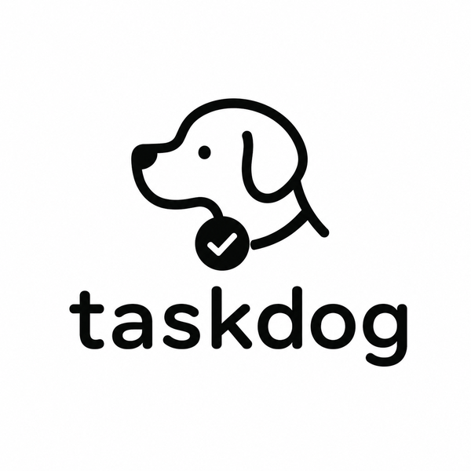

# Taskdog

<p align="center">
  
</p>

A task management system with CLI/TUI interfaces and REST API server, featuring time tracking, schedule optimization, and beautiful terminal output. Designed for individual use. Stores tasks locally in an SQLite database.


## Try It Out

Try taskdog with ~50 sample tasks. No installation required — just Docker:

```bash
docker run --rm -it ghcr.io/kohei-wada/taskdog:demo
```

For the best experience, run the server in a container and connect from your host:

```bash
docker run --rm -d -p 8000:8000 --name taskdog-demo ghcr.io/kohei-wada/taskdog:demo

# Wait for the server and demo data to be ready (~15s)
docker logs -f taskdog-demo 2>&1 | grep -m1 "Server ready"

uvx --from taskdog-ui taskdog tui
```

## Features

- **Multiple Interfaces**: CLI, full-screen TUI, and REST API
- **Schedule Optimization**: 9 algorithms (greedy, genetic, monte carlo, etc.)
- **Search & Filter**: fzf-style queries, progressive filter chains, multi-field sort
- **Time Tracking**: Automatic tracking with planned vs actual comparison
- **Gantt Chart**: Visual timeline with workload analysis
- **Task Dependencies**: With circular dependency detection
- **Markdown Notes**: Editor integration with Rich rendering
- **Audit Logging**: Track all task operations
- **MCP Integration**: Claude Desktop support via Model Context Protocol

## Quick Example

```bash
taskdog add "My first task" --priority 10
taskdog list
taskdog gantt
taskdog tui
```

## Where to Go Next

- [Getting Started](getting-started.md) — step-by-step setup
- [CLI Reference](reference/cli.md) — every command and option
- [API Guide](reference/api-guide.md) — REST API usage
- [Configuration](configuration.md) — all configuration options
- [Design Philosophy](design-philosophy.md) — why Taskdog works this way

## Architecture

UV workspace monorepo with five packages:

| Package | Description |
| ------- | ----------- |
| [taskdog-core](https://pypi.org/project/taskdog-core/) | Core business logic and SQLite persistence |
| [taskdog-client](https://pypi.org/project/taskdog-client/) | HTTP API client library |
| [taskdog-server](https://pypi.org/project/taskdog-server/) | FastAPI REST API server |
| [taskdog-ui](https://pypi.org/project/taskdog-ui/) | CLI and TUI interfaces |
| [taskdog-mcp](https://pypi.org/project/taskdog-mcp/) | MCP server for Claude Desktop |

## License

MIT License — see [LICENSE](https://github.com/Kohei-Wada/taskdog/blob/main/LICENSE) for details.
