# ADR-005: Topologia do Data-Mesh (4 Domínios Autônomos)

**Status:** Proposta
**Data:** 2026-06-05
**Autores:** Matheus + AI Agent
**Contexto:** `life/vibe-ops/`

---

## 1. Contexto

O workspace `life/vibe-ops/` tem **7 sub-grafos** (PRDs 01-07) que precisam
trocar dados. A estratégia de data-mesh visa **desacoplar** esses sub-grafos
para que cada um evolua independentemente.

O problema é: **como conectar 7 sub-grafos sem acoplamento rígido, sem
duplicação de dados, e sem perda de contexto?**

**Origem conceitual:** [`vibe-ops/doc/01-data-mesh-strategy.md`](../doc/01-data-mesh-strategy.md) (v1, 56 linhas) define a "Grande Divisão" entre Planejamento (upstream) e Execução (downstream). Este ADR expande para **4 domínios** com **6 contratos** entre eles.

---

## 2. Decisão

### 2.1. Os 4 Domínios Autônomos

| Domínio | Sub-grafos | Owner | SoT (Source of Truth) |
|---|---|---|---|
| **PLANNING** | PRD-01 (temporal), PRD-02 (habit), PRD-06 (policy) | Humano (Markdown) | Obsidian vault + `planning_entities` table |
| **STUDY** | PRD-03 (study backlog) | Coding agent (Pydantic) | SQLite `study_*` tables |
| **DEV** | PRD-04 (project execution) | Coding agent (Pydantic) | SQLite `dev_*` tables + TW `.task` |
| **METRICS** | PRD-05 (metrics & health) | Coding agent (Pydantic) | SQLite `metrics`, `policy_decisions` tables |

### 2.2. Os 6 Contratos entre Domínios

```mermaid
flowchart LR
    PLAN["PLANNING<br/>(Obsidian + planning_entities)"]
    STUDY["STUDY<br/>(study_* tables)"]
    DEV["DEV<br/>(dev_* tables + TW)"]
    METRICS["METRICS<br/>(metrics + policy)"]

    PLAN -->|"C1: skill_requirements"| STUDY
    PLAN -->|"C2: regime + time allocation"| DEV
    PLAN -->|"C3: window constants (3-5h, 18-21h)"| METRICS

    STUDY -->|"C4: knowledge_applied (skills used)"| DEV
    STUDY -->|"C5: study_hours (aggregate)"| METRICS

    DEV -->|"C6: revenue + velocity (R$/hora)"| METRICS

    METRICS -->|"Feedback: regime + Q_HE"| PLAN
    METRICS -->|"Feedback: cognitive_debt"| STUDY
    METRICS -->|"Feedback: Q_HE → tempo budget"| DEV

    style PLAN fill:#1a1a2e,stroke:#ff6b6b
    style STUDY fill:#16213e,stroke:#4a6fa5
    style DEV fill:#16213e,stroke:#4a4a6a
    style METRICS fill:#2d2d44,stroke:#4a4a6a
```



| # | Contrato | Origem | Destino | Dados |
|---|---|---|---|---|
| **C1** | `skill_requirements` | PLANNING | STUDY | `tech_stack` de SoftwareProject → Skill entities + StudyTopic backlog |
| **C2** | `regime + time_allocation` | PLANNING | DEV | `policy_engine` emite regime → DEV ajusta sprint velocity |
| **C3** | `window_constants` | PLANNING | METRICS | 22 constantes (`HORARIO_ACORDAR_MIN/MAX`, etc.) → validação |
| **C4** | `knowledge_applied` | STUDY | DEV | `Skill.projects_using` → SoftwareProject tech_stack |
| **C5** | `study_hours` | STUDY | METRICS | `Σ StudySession.duration_minutes` → DailyMetrics.hours_learn |
| **C6** | `revenue + velocity` | DEV | METRICS | `SoftwareProject.actual_revenue` + `Sprint.velocity_actual` → metrics |

### 2.3. Domain Ownership (Single Source of Truth)

| Dado | Owner | Consumidores |
|---|---|---|
| Sonhos, objetivos, metas | PLANNING | STUDY, DEV (C1) |
| Skills, topics, materials, sessions | STUDY | PLANNING (skill_requirements), DEV (knowledge_applied), METRICS (study_hours) |
| Projects, epics, sprints, tasks | DEV | PLANNING (regime), METRICS (revenue) |
| Pomodoros, sleep, regime | METRICS | PLANNING (regime feedback), DEV (velocity adjustment) |
| Time tracking (Timewarrior) | DEV (TW) | METRICS (extração) |
| IKIGAi scores (5 vetores) | METRICS (scorer) | PLANNING, STUDY, DEV (input para decisions) |

### 2.4. Cross-Domain Joins (quando e como)

**Joins são feitos pelo Middleware Python** (não pelo SQL nem pelo Obsidian):

```python
# Exemplo: encontrar tasks que requerem skills com cognitive_debt > 0
def find_blocked_tasks_by_skill_gap(project_id: str) -> list[Task]:
    project = dev_repo.get_project(project_id)
    required_skills = extract_skill_requirements(project.tech_stack)
    study_topics = study_repo.get_topics_by_skills(required_skills)
    blocked_topics = [t for t in study_topics if t.is_blocked]
    return [task for task in project.tasks if any(s in blocked_topics for s in task.required_skills)]
```

**Onde mora:** [`vibe-ops/src/pipeline/fk_resolver.py`](../src/pipeline/fk_resolver.py) e [`vibe-ops/src/middleware/sync_engine.py`](../src/middleware/sync_engine.py).

### 2.5. Garantias

- **Schema-First** (ADR-002): YAML → Pydantic → SQL
- **Idempotência**: `upstream_id` como chave de merge
- **Append-Only**: documents nunca são sobrescritos
- **Single FK Strategy** (ADR-001 §3.1): TW carrega apenas `project:O2.M3`, Data-Mesh conhece a árvore completa
- **Human-in-the-Loop**: humano escreve Markdown, pipeline extrai

---

## 3. Alternativas Consideradas

### 3.1. Alternativa A: PostgreSQL como Data Warehouse — Rejeitada

**Motivos da Rejeição:**
- Overhead de manutenção (daemon)
- Single-user não justifica
- SQLite + DuckDB cobrem 95% dos casos
- Migration path é mais complexo

### 3.2. Alternativa B: Monolito (1 schema, 1 Pydantic model unificado) — Rejeitada

**Motivos da Rejeição:**
- Acoplamento forte (mudança em 1 sub-grafo quebra todos)
- Refatoração cara
- Impossível extrair sub-grafo (ex: STUDY virar serviço separado)
- Domain ownership fica difuso

### 3.3. Alternativa C: Sem contratos (TUDO é FK direto) — Rejeitada

**Motivos da Rejeição:**
- Acoplamento cego (mudança em STUDY quebra PLANNING)
- Sem versionamento
- Sem idempotência

### 3.4. Alternativa D: Event-driven (Kafka-like) — Rejeitada por complexidade

**Motivos da Rejeição:**
- Over-engineering para single-user
- Single Source of Truth ainda precisa ser derivada
- Latência adicional

---

## 4. Consequências

### 4.1. Positivas

- **Cada sub-grafo evolui independentemente** (append-only)
- **Domain ownership claro** (PLANNING/STUDY/DEV/METRICS)
- **6 contratos explícitos** (não implícitos)
- **Auditabilidade** (idempotency via upstream_id)
- **Flexibilidade** (qualquer sub-grafo pode virar serviço separado)

### 4.2. Negativas / Riscos Aceitos

- **Cross-domain joins são middleware-only** (não-SQL)
- **6 contratos = 6 places para drift** (mitigado por testes)
- **Single-user não testa 100% dos casos** (concorrência, particionamento)
- **Vector store (ChromaDB) é opcional** (sqlite-vec fallback)

### 4.3. Mitigações

- **Testes de contrato** em `vibe-ops/tests/` (Sprint 1)
- **`triagem.md`** (ADR-001) para inconsistências detectadas
- **verify_mesh.py** (root) para sanity check de imports
- **Review trimestral** dos 6 contratos

---

## 5. Implementação

### Sprint 1 (esta semana)
- [ ] Documentar 6 contratos em `ikigai_propagation.md` (✅ já feito)
- [ ] Implementar `fk_resolver.py` para joins cross-domain
- [ ] Adicionar `v_dashboard_study_dev` view (já existe em `schema.sql`)

### Sprint 2-3
- [ ] Adicionar migrations para tabelas inter-domínio
- [ ] Implementar `cross_cluster_priority` (RICE + IKIGAi)
- [ ] Testes de contrato

### Sprint 4+
- [ ] Migrar para Neo4j (opcional) se grafo de dependencies crescer
- [ ] Adicionar `reconciliation.md` automático

---

## 6. Referências

### Docs autoritativos

- [`vibe-ops/doc/01-data-mesh-strategy.md`](../doc/01-data-mesh-strategy.md) — Estratégia (v1, 56 linhas)
- [`vibe-ops/doc/01.5-data-contracts-and-pipelines.md`](../doc/01.5-data-contracts-and-pipelines.md) — Contratos + pipelines (master, 29K)
- [`vibe-ops/doc/03-data-mesh-enrichment.md`](../doc/03-data-mesh-enrichment.md) — Enrichment (27K)

### ADRs relacionados

- [ADR-001: Data Flow Topology](ADR-001-data-flow-topology.md) — topologia
- [ADR-002: Mesh Contracts & State Machines](ADR-002-mesh-contracts-state-machines.md) — contratos
- [ADR-003: IKIGAi as Meta-Brain](ADR-003-ikigai-as-meta-brain.md) — IKIGAi
- [ADR-004: Hybrid RAG Strategy](ADR-004-hybrid-rag-strategy.md) — RAG

### Specs

- [`vibe-ops/specs/SPEC-05-cybernetic-epistemic-mesh.md`](../specs/SPEC-05-cybernetic-epistemic-mesh.md) — Cybernetic mesh
- [`vibe-ops/specs/schema-pydantic-models-v2.md`](../specs/schema-pydantic-models-v2.md) — Pydantic v2
- [`vibe-ops/src/contracts/planning.v1.yaml`](../src/contracts/planning.v1.yaml) — Contrato planning

### Implementação

- [`vibe-ops/src/middleware/sync_engine.py`](../src/middleware/sync_engine.py) — Middleware principal
- [`vibe-ops/src/pipeline/fk_resolver.py`](../src/pipeline/fk_resolver.py) — FK resolver cross-domain
- [`vibe-ops/src/pipeline/sync_orchestrator.py`](../src/pipeline/sync_orchestrator.py) — Orchestrator
- [`vibe-ops/src/pipeline/router.py`](../src/pipeline/router.py) — Event router
- [`vibe-ops/src/pipeline/unified_router.py`](../src/pipeline/unified_router.py) — Unified router
- [`vibe-ops/src/storage/data_mesh_adapter.py`](../src/storage/data_mesh_adapter.py) — Data-mesh adapter

### Cluster docs (consumidores)

- [`../../CLUSTER_PLAN.md`](../CLUSTER_PLAN.md) — Cluster 1 (rotinas)
- [`../../CLUSTER_PROJ.md`](../CLUSTER_PROJ.md) — Cluster 2 (PMO↔TW)
- [`../../CLUSTER_STUDY.md`](../CLUSTER_STUDY.md) — Cluster 3 (PKM)

### IKIGAi Planning

- [`../../life-ops/planner/ikigai_planning/README.md`](../life-ops/planner/ikigai_planning/README.md) — Overview
- [`../../life-ops/planner/ikigai_planning/ikigai_propagation.md`](../life-ops/planner/ikigai_planning/ikigai_propagation.md) — Data flow
- [`../../life-ops/planner/ikigai_planning/ikigai_4_vectors.md`](../life-ops/planner/ikigai_planning/ikigai_4_vectors.md) — 5 vetores

---

*ADR-005 — v1.0 — 2026-06-05 — Topologia do Data-Mesh (4 Domínios Autônomos, 6 Contratos)*
