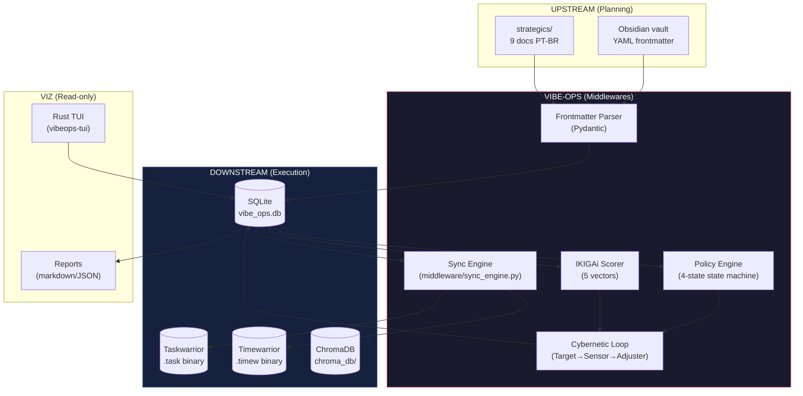

# Arquitetura & Decisões do Vibe-Ops

> Este diretório contém os **diagramas de bloco**, a documentação do
> **Data-Mesh**, e os **registros de decisões arquiteturais (ADRs)** do
> Vibe-Ops. Serve para documentar os "Porquês" das tecnologias escolhidas,
> trade-offs de escalabilidade, e estruturas de bancos de dados.

## Como Usar Este Diretório

- **Se você está implementando:** comece por ADR-001 (topologia) → ADR-002 (contratos) → ADR-003 (IKIGAi)
- **Se você está auditando:** leia ADR-001, ADR-002, ADR-005 em ordem
- **Se você está decidindo nova tech:** leia ADR-001 (alternativas) + ADR-004 (RAG strategy)

## Índice de ADRs

| ADR | Título | Status | Data | Linhas | Arquivo |
|---|---|---|---|---|---|
| ADR-001 | Data Flow Topology | Aceita | 2026-05-03 | 141 | [`ADR-001-data-flow-topology.md`](ADR-001-data-flow-topology.md) |
| ADR-002 | Mesh Contracts & State Machines | Aceita | 2026-06-05 | ~300 | [`ADR-002-mesh-contracts-state-machines.md`](ADR-002-mesh-contracts-state-machines.md) |
| ADR-003 | IKIGAi as Meta-Brain | Proposta | 2026-06-05 | ~280 | [`ADR-003-ikigai-as-meta-brain.md`](ADR-003-ikigai-as-meta-brain.md) |
| ADR-004 | Hybrid RAG Strategy | Proposta | 2026-06-05 | ~250 | [`ADR-004-hybrid-rag-strategy.md`](ADR-004-hybrid-rag-strategy.md) |
| ADR-005 | Data Mesh Topology | Proposta | 2026-06-05 | ~250 | [`ADR-005-data-mesh-topology.md`](ADR-005-data-mesh-topology.md) |

## Princípios Arquiteturais (consolidados de ADR-001 §2.1)

| Princípio | Descrição | Origem |
|---|---|---|
| **Fully Local** | Zero dependência de cloud. Todos os dados residem no filesystem local. Soberania total. | ADR-001 §2.1 |
| **Append-Only** | Documentos de planejamento nunca são sobrescritos — apenas expandidos. Garante rastreabilidade. | ADR-001 §2.1 |
| **Single Source of Truth (por domínio)** | Cada sistema "manda" no seu domínio de dados. Não há duplicação autoritativa. | ADR-001 §2.1 |
| **Schema-First** | Todo contrato de dados é definido ANTES da implementação. Pydantic valida antes de injetar. | ADR-001 §2.1 |
| **Human-in-the-Loop para Metadados** | O humano escreve Markdown. O pipeline extrai e enriquece. O humano aprova triagens. | ADR-001 §2.1 |
| **Idempotência** | Re-executar o pipeline não cria duplicatas. `upstream_id` como chave de idempotência. | ADR-001 §2.1 |
| **Determinismo** | Sem LLM no pipeline diário/semanal. Apenas aritmética + funções algébricas. | IKIGAi planning |
| **AI-Native Documentation** | Docs otimizados para coding agents e swarm sub-agents. | IKIGAi planning |

## Diagrama Top-Level (Vibe-Ops)



## Diagrama dos 4 Tiers (origem: SYSTEMS_TOPOLOGY §1)

```
TIER 0 — Intenção Estratégica:    docs, strategics/, vibe-ops/base/, life-ops/planner/
TIER 1 — Orquestração (CLI Hub):  centrals/, handlers/, plugins/, cli/
TIER 2 — Mesh Cibernético:         vibe-ops/src/{cybernetics, pipeline, middleware}
TIER 3 — Armazenamento + Contratos: vibe-ops/src/{storage, schemas, contracts, models}
TIER 4 — Execução (Downstream):    taskwarrior/, life-ops/, vibe-ops/vibeops-tui/
```

## Cross-refs

### Documentos Autoritativos (origem)

- [`vibe-ops/doc/01-data-mesh-strategy.md`](../doc/01-data-mesh-strategy.md) — Estratégia data-mesh (v1)
- [`vibe-ops/doc/01.5-data-contracts-and-pipelines.md`](../doc/01.5-data-contracts-and-pipelines.md) — Contratos + pipelines (master, 29K)
- [`vibe-ops/doc/02-tw-factory-reset.md`](../doc/02-tw-factory-reset.md) — TW factory reset
- [`vibe-ops/doc/03-data-mesh-enrichment.md`](../doc/03-data-mesh-enrichment.md) — Data-mesh enrichment (27K)
- [`vibe-ops/doc/solucoes_extensoes_tw.md`](../doc/solucoes_extensoes_tw.md) — Soluções + extensões TW
- [`vibe-ops/doc/tw-vanilla_limits_analysis.md`](../doc/tw-vanilla_limits_analysis.md) — Limites TW vanilla

### Specs & Schemas

- [`vibe-ops/specs/SPEC-05-cybernetic-epistemic-mesh.md`](../specs/SPEC-05-cybernetic-epistemic-mesh.md) — Cybernetic mesh
- [`vibe-ops/specs/schema-frontmatter-contract-v2.md`](../specs/schema-frontmatter-contract-v2.md) — Frontmatter v2
- [`vibe-ops/specs/schema-pydantic-models-v2.md`](../specs/schema-pydantic-models-v2.md) — Pydantic v2
- [`vibe-ops/specs/schema-planner-extension.md`](../specs/schema-planner-extension.md) — Planner extension

### Cluster Docs (consumidores)

- [`../../CONCEPTUAL_MODEL.md`](../../CONCEPTUAL_MODEL.md) — T→B→S framework
- [`../../SYSTEMS_TOPOLOGY.md`](../../SYSTEMS_TOPOLOGY.md) — Middlewares M1-M8
- [`../../CLUSTER_PLAN.md`](../../CLUSTER_PLAN.md) — Cluster 1
- [`../../CLUSTER_PROJ.md`](../../CLUSTER_PROJ.md) — Cluster 2
- [`../../CLUSTER_STUDY.md`](../../CLUSTER_STUDY.md) — Cluster 3

### IKIGAi Planning (cérebro)

- [`../../life-ops/planner/ikigai_planning/README.md`](../../life-ops/planner/ikigai_planning/README.md) — IKIGAi meta-brain docs
- [`../../life-ops/planner/ikigai_planning/ikigai_4_vectors.md`](../../life-ops/planner/ikigai_planning/ikigai_4_vectors.md)
- [`../../life-ops/planner/ikigai_planning/ikigai_north_star_metrics.md`](../../life-ops/planner/ikigai_planning/ikigai_north_star_metrics.md)
- [`../../life-ops/planner/ikigai_planning/ikigai_propagation.md`](../../life-ops/planner/ikigai_planning/ikigai_propagation.md)
- [`../../life-ops/planner/ikigai_planning/ikigai_meta_heuristics.md`](../../life-ops/planner/ikigai_planning/ikigai_meta_heuristics.md)

### Index (navegação)

- [`../../ARCHITECTURE_INDEX.md`](../../ARCHITECTURE_INDEX.md) — Índice canônico da workspace

---

*README.md — v1.0 — 2026-06-05 — Arquitetura & Decisões do Vibe-Ops (rewrite)*
