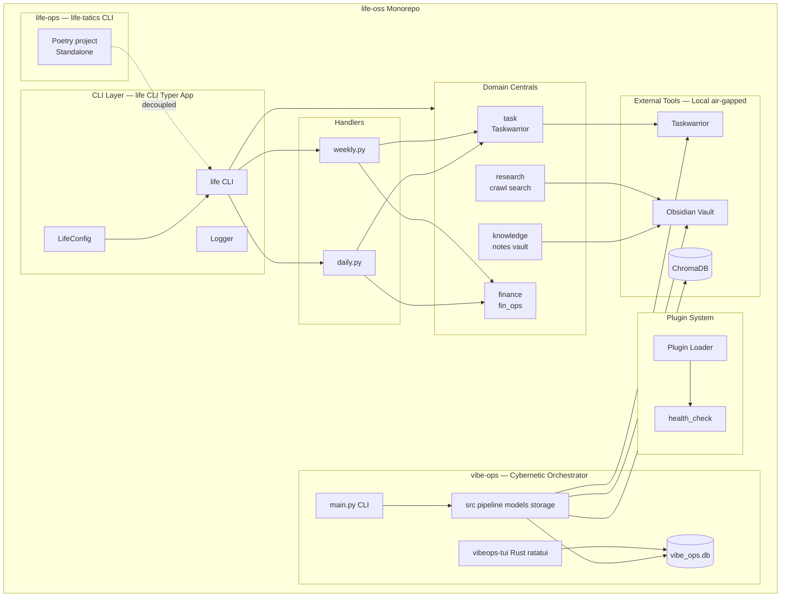
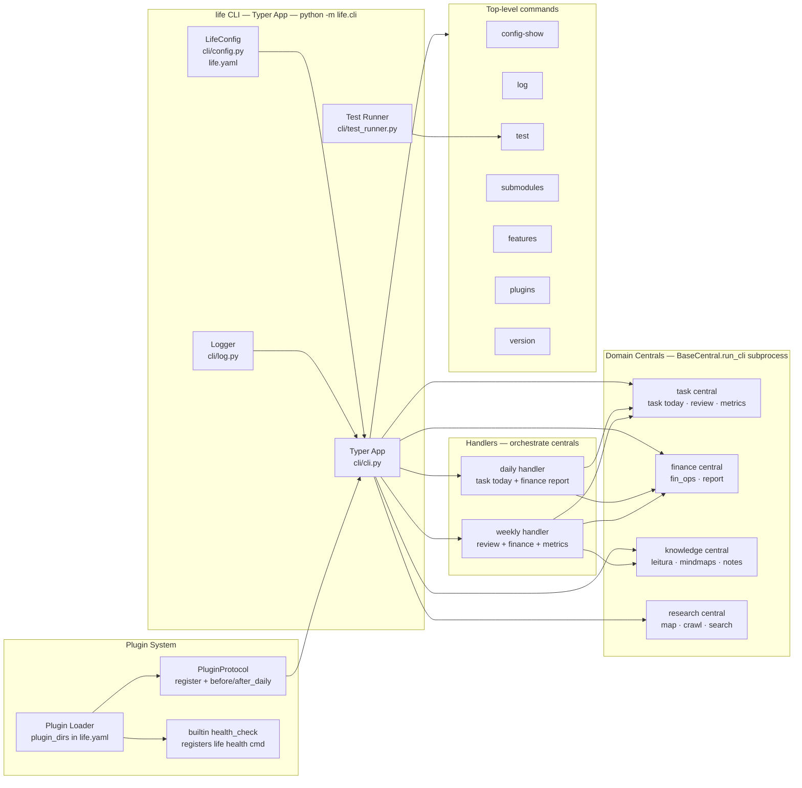
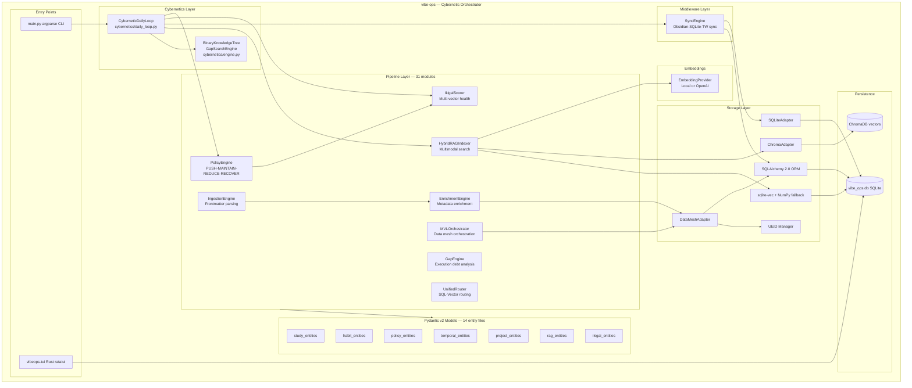
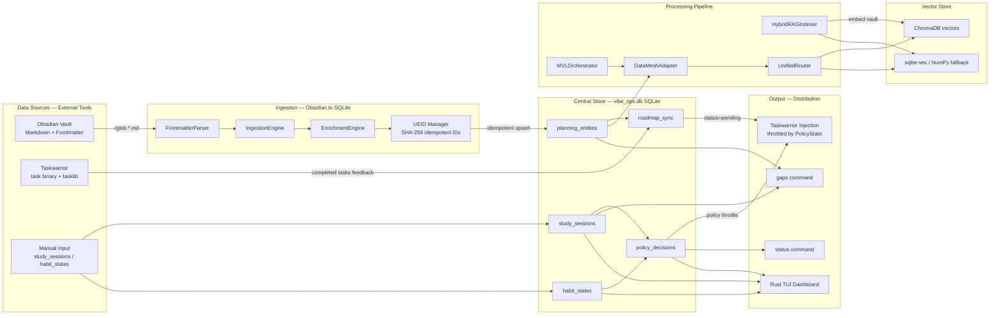
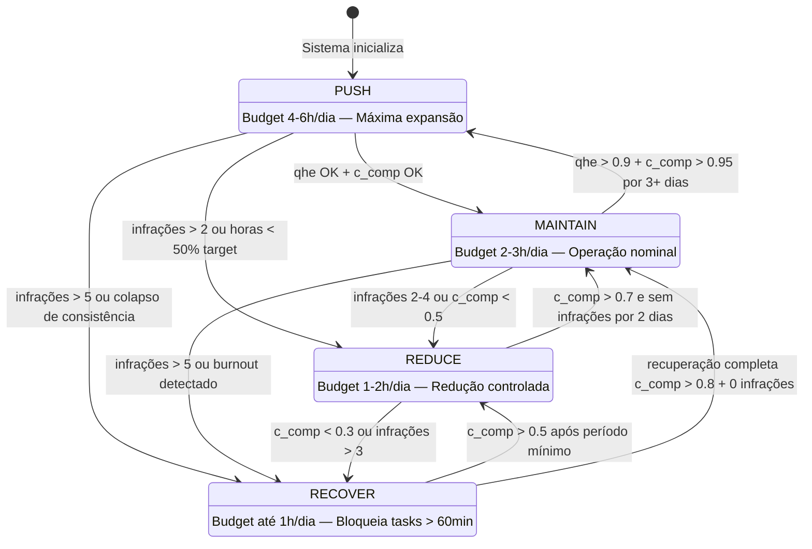

# Topologia do Sistema — Algorithmic Life OS

> Gerado em: 2026-05-18  
> Série completa de diagramas arquiteturais em 6 camadas.

---

## Diagrama 1 — Visão Geral do Monorepo



---

## Diagrama 2 — CLI Layer (Typer App)



---

## Diagrama 3 — vibe-ops Arquitetura Interna



---

## Diagrama 4 — Loop Cibernético Target-Sensor-Adjuster (Sequência)

```mermaid
sequenceDiagram
    participant CLI as main.py CLI
    participant LOOP as CyberneticDailyLoop
    participant IKI as IkigaiScorer
    participant SENSOR as SQLite Sensor
    participant POL as PolicyEngine
    participant SYNC as SyncEngine
    participant RAG as HybridRAGIndexer
    participant TW as Taskwarrior
    participant OBS as Obsidian Vault
    participant DB as vibe_ops.db
    participant CHROMA as ChromaDB

    CLI->>LOOP: execute_daily_cycle(date)

    Note over LOOP,IKI: 1. TARGET — Setpoint computation
    LOOP->>IKI: compute_score()
    IKI->>DB: query study/habit/health metrics
    DB-->>IKI: raw vectors
    IKI-->>LOOP: {global, study, dev, health} scores

    Note over LOOP,SENSOR: 2. SENSOR — Real execution capture
    LOOP->>SENSOR: _read_sensor_data(date)
    SENSOR->>DB: SELECT study_sessions WHERE date=?
    SENSOR->>DB: SELECT habit_states WHERE date=?
    DB-->>SENSOR: actual_hours, consistency, infractions
    SENSOR-->>LOOP: metrics dict

    Note over LOOP,POL: 3. ADJUSTER — Cybernetic correction
    LOOP->>DB: _get_previous_decision()
    DB-->>LOOP: prev PolicyDecision
    LOOP->>POL: evaluate(metrics, prev_decision, date)
    POL-->>POL: state machine PUSH-MAINTAIN-REDUCE-RECOVER
    POL-->>LOOP: PolicyDecision {policy, budget, alerts}

    Note over LOOP,DB: 4. PERSIST
    LOOP->>DB: INSERT policy_decisions

    Note over LOOP,TW: 5. SYNC — Distribution
    LOOP->>SYNC: sync_sqlite_to_taskwarrior(policy.value)
    SYNC->>DB: SELECT planning_entities JOIN roadmap_sync
    DB-->>SYNC: pending study plans
    SYNC->>TW: tasks.add / tasks.filter (upsert)
    TW-->>SYNC: uuid
    SYNC->>DB: UPDATE roadmap_sync SET tw_uuid

    Note over LOOP,CHROMA: 6. SEMANTIC INDEXING
    LOOP->>RAG: index_vault(vault_path)
    RAG->>OBS: rglob *.md
    OBS-->>RAG: markdown files
    RAG->>CHROMA: embed + upsert vectors
    RAG->>DB: store RAG metadata

    LOOP-->>CLI: PolicyDecision (final)
```

---

## Diagrama 5 — Data Flow (Obsidian → SQLite → Taskwarrior ↔ ChromaDB)



---

## Diagrama 6 — Policy Engine State Machine


