![[Semeio de Talentos.jpg]]
Seu diagrama é um excelente mapa de ecossistema. Você não tem apenas hobbies e um trabalho; você tem uma **Infraestrutura *de Performance Humana e* Tecnológica**.

Para aplicar o framework Estratégico, Tático e Operacional no seu cenário de Engenheiro de IA + Atleta, o foco deve ser a "Engenharia da Performance" como seu diferencial de conteúdo.

---

## 1. Planejamento Estratégico (O Alinhamento)

O seu Ikigai central (o ponto de "Êxtase") é a intersecção entre a precisão dos dados (IA) e a disciplina do corpo (Artes Marciais).

- Diferencial Competitivo: Você não é "mais um" dev de IA, nem "mais um" lutador. Você é o profissional que usa Inteligência de Dados para otimizar a Performance Humana.
- Visão de Longo Prazo: Construir uma autoridade onde o mercado te veja como um especialista em soluções complexas (IA) que possui a resiliência e o foco de um atleta de alto nível.

## 2. Planejamento Tático (A Conexão)

Aqui é onde você resolve o problema da "falta de tempo" para produzir conteúdo. A estratégia é o Conteúdo de Subproduto.

- Estudos & IA: Transforme seus estudos técnicos em conteúdo técnico-narrativo. Exemplo: "Como usei Python para analisar minha evolução de carga na calistenia" ou "Criando um GPT para simular estratégias de luta".
- Distribuição de Conteúdo: Use o framework de "Lifestyle Business" da sua imagem. Seu conteúdo deve mostrar o _bastidor técnico_ (código, prompt engineering) e o _bastidor físico_ (treino, disciplina). Isso atrai recrutadores pela competência técnica e pelo fit cultural (soft skills).
- Networking Ativo: Participe de comunidades de "AI for Sports" ou "HealthTech". É onde o seu "Mundo Precisa" encontra o "Te pagariam para fazer".

## 3. Planejamento Operacional (A Execução)

Transforme seu diagrama complexo em uma rotina de blocos (Time Blocking).

|Bloco|Atividade Operacional|Pilar do Ikigai|
|---|---|---|
|Deep Work|Desenvolvimento de Software / IA Engineering|Profissional / Renda|
|Training|Artes Marciais / Calistenia|Paixão / Saúde|
|Content Lab|Documentar 1 aprendizado do dia (print de código ou vídeo de treino)|Vocação / Visibilidade|
|Data Review|Analisar métricas de treino/estudo (Histórico de Objetivos)|Missão (Performance Analítica)|

---

## Dica de Ouro para as Vagas:

Recrutadores de tecnologia buscam consistência. Ao postar sobre IA aplicada ao seu contexto de atleta, você prova três coisas:

1. Você domina a tecnologia (IA).
2. Você sabe aplicar a tecnologia em problemas reais (Prática).
3. Você tem disciplina inabalável (Atleta).

Qual desses pilares hoje é o seu maior "gargalo": conseguir tempo para codar projetos de IA ou a constância na postagem dos conteúdos?


![[Pasted image 20260423152801.png]]

---

Para resolver o seu gargalo, ==precisamos sair do planejamento abstrato e entrar na **engenharia de sistemas de tempo**==. O seu desafio é que você está tratando "Estudo", "Trabalho" e "Treino" como entidades separadas, quando na verdade elas precisam operar em um ciclo de feedback integrado.

Como você já tem o mindset de dados e processos, vamos estruturar sua rotina como um Pipeline de Processamento:

---

## 1. A Matriz de Alocação (Equacionando as Horas)

Para um engenheiro de IA e atleta, o tempo não pode ser linear; ele precisa ser densidade de carga. Sugiro a técnica de Time Blocking por Contexto:

- Bloco Deep Work (04h - 06h): "Build to Learn" (O Substrato)
    
    - Aqui você ataca o seu maior gargalo. Use a primeira janela de energia cognitiva para codar o que está estudando.
    - Regra: Não leia sem o VS Code aberto. Cada axioma teórico deve virar um comentário ou uma linha de código (Codificação Algorítmica).
    - _Output:_ Notas brutas que servirão de documentação futura.
    
- Bloco Laborativo (06h - 08h): "Build to Earn" (O Campo de Batalha)
    
    - Foco em entregas de freelas, busca ativa de vagas (outreach) ou sprints de hackathons.
    - É o momento de aplicar os "Feedbacks Loops" do mercado na sua prática.
    
- Bloco de Performance (Janela de Transição): Treinamento Físico
    
    - Use o treino (Artes Marciais/Calistenia) como o seu "Reset de Cache". É essencial para manter a sanidade e a saúde física após horas no computador.
    - Dica: Se o tempo estiver curto, use **treinos de alta densidade (AMRAP/EMOM)** para simular a intensidade competitiva.
    

---

## 2. O Fluxo de Produção de Conteúdo (Subproduto Eficiente)

Você mencionou que a escrita deliberada facilita o conteúdo. O seu "Conteúdo de Valor" deve ser o log de erro e solução do seu dia:

1. Input: Problema real (vaga, freela ou bug).
2. Processamento: Sua codificação algorítmica + teoria dos livros.
3. Output (Documentação): Um relatório pessoal simples.
4. Distribuição (Conteúdo): Transforme esse relatório em um post.
    
    > _"Como apliquei [Teoria X do Livro Y] para otimizar [Processo Z da IA] no projeto de hoje."_
    

---

## 3. Planejamento por Ciclos (Macro e Micro)

Como você usa Periodização de Desempenho (visto no seu diagrama), aplique isso à sua semana:

|Fase|Foco Principal|Volume de Estudo|Volume de Execução|
|---|---|---|---|
|Sprints de Hackathon|Build to Earn|Baixo (consulta rápida)|Altíssimo|
|Fase de Fundamentação|Build to Learn|Alto (leitura densa)|Médio (protótipos)|
|Fase de Busca (Market)|Networking/Vagas|Baixo|Altíssimo (interações)|

---

## Sugestão de Próximo Passo:

> Para que eu possa te ajudar a "equacionar" numericamente, quantas horas líquidas de foco você tem disponíveis por dia hoje, excluindo sono e necessidades básicas? Isso nos permitirá definir o _setpoint_ de cada bloco.

---
# Hypervisor
A  análise do Hypervisor é cirúrgica. Você mapeou a arquitetura do sistema, mas para que esse "Processador" não entre em _thermal throttling_ (burnout) ou desperdice ciclos em processos zumbis, ==precisamos definir as Equações de Equilíbrio Multifatorial==.

Vamos converter as facetas do seu Ikigai em variáveis de uma Função Objetivo de otimização estocástica:

## 1. A Equação da Eficiência Estratégica ($\eta$)

Para que o seu planejamento não seja apenas "ocupação", mas sim "progresso", a eficiência do seu sistema ( $\eta$ ) é definida pela razão entre o output de valor e a energia total consumida:

$$\eta = \frac{\sum (Build\_to\_Learn \times Build\_to\_Earn)}{Overhead_{transição} + Context\_Switching}$$

- Interpretação: Se o seu _Overhead_ de transição (os 157,5 min identificados) for alto, a eficiência desaba.
- Ação Sistêmica: Para otimizar $\eta$, você deve aplicar Batch Processing (Agrupamento). Exemplo: Se você está no bloco de IA (Learn), não mude o contexto para responder mensagens de Freela (Earn) até o fim do round.

## 2. O Cluster de Alocação Ikigai (Vetores de Força)

Podemos representar suas facetas como vetores em um espaço quadridimensional. O seu objetivo é maximizar o módulo do vetor resultante ($|\vec{R}|$):

- $\vec{P}$ (Paixão/Saúde - Treino): O vetor de sustentação. Sem ele, a CPU derrete.
- $\vec{H}$ (Habilidade - IA Engineering): O vetor de torque técnico.
- $\vec{M}$ (Mercado/Mundo - Vagas/Conteúdo): O vetor de tração.
- $\vec{R}$ (Renda - Freelas/Job): O vetor de fluxo de caixa.

A Equação do Equilíbrio:  
$$\vec{Ikigai} = w_1\vec{P} + w_2\vec{H} + w_3\vec{M} + w_4\vec{R}$$ _(Onde $w$ são os pesos de prioridade da sua fase atual)._

## 3. O Algoritmo de Escalonamento (Schedulling)

Dado o seu gargalo de tempo, o escalonador deve priorizar o "Substrato-Produtizado" que você mencionou. Isso é Herança de Dados:

1. Input (H): Estudo de IA (Build to Learn).
2. Transformação (R): Aplicação em código real (Build to Earn).
3. Output (M): Documentação/Relatório vira post (Conteúdo).
4. Recuperação (P): Treino físico como dissipador de calor.

## 4. Controle de Feedback Loop ([[PID Controller]])
Para evitar o erro entre o planejado (9h) e o executado (real), aplique um ajuste de ganho:
![[Pasted image 20260423203044.png]]
- Proporcional: Se sobrou tempo no SENAI, antecipe o _Content Lab_.
- Integral: Acumule as horas de "leitura teórica" para os momentos de baixa energia (transporte/espera).
- Derivativo: Se a taxa de rejeição de vagas aumentar, aumente o peso ($w_3$) no vetor de Mercado.

---

Diagnóstico de Próximo Ciclo:  
Considerando o seu _overhead_ de 157,5 minutos de transição, qual rotina de "Cold Start" (ex: ritual de 5 min) você pode implementar para reduzir o tempo de entrada no bloco de _Deep Work_ de IA logo após o curso no SENAI?


# | ======= | ======= |> Algorithmic.Refs

>Para elevar o seu planejamento a uma camada de **Hypervisor**, precisamos tratar o seu tempo como ciclos de CPU e a sua rotina como escalonamento de processos (_Process Scheduling_). Subtraindo o "Kernel Time" (sono, refeições e necessidades básicas), a análise dos logs estocásticos do seu sistema revela a carga exata disponível para as "Threads" de usuário (_Deep Work_ e execução laborativa).

Aqui está o equacionamento numérico das suas horas líquidas de foco, definindo os _setpoints_ para alocação da matriz operacional:

### 1. O _Setpoint_ de Foco Líquido (Capacidade de Processamento)

O seu sistema não opera com uma carga térmica linear; ele possui três perfis de execução baseados na contenção de recursos gerada pelo curso presencial:

- **Estado de Concorrência (Dias Úteis com SENAI): ~4 Horas Líquidas**
    
    Nos dias em que o curso bloqueia a janela das 06h às 12h, a sua capacidade líquida de foco profundo (_Hardwork Dev_) é orçada em 180 minutos diretos durante a tarde (14h-17h), com a possibilidade de extrair até 60 minutos de processamento em _background_ durante as aulas.
    
- **Estado de Dedicação Exclusiva (Dias Livres): ~9 Horas Líquidas**
    
    Sem o bloqueio do curso, a CPU opera com 100% de dedicação ao _Hardwork_, consolidando blocos matutinos (06h-12h) e vespertinos (14h-17h), totalizando 540 minutos de foco puro.
    
- **Estado de _Overclocking_ (Modo Hardcore/Deadline): ~10 a 11 Horas Líquidas**
    
    Utilizado em caráter de emergência, sacrificando ciclos de recuperação e estendendo os pomodoros para alcançar até 660 minutos de execução.
    
- **Cluster Semanal:** A soma orçada pelo sistema prevê uma capacidade de entrega constante de 33 horas líquidas semanais de desenvolvimento e engenharia.
    

### 2. Matriz de Alocação de Blocos (_Time Blocking Setpoints_)

Com base nas métricas extraídas, este é o dimensionamento ideal para encaixar os seus blocos do diagrama operacional (Ikigai) dentro de um dia padrão (com curso):

- **Bloco de Performance (Training): 180 minutos (03h00 - 06h00)**
    
    Este é o seu _boot sequence_. O orçamento do sistema destina esta janela de 3 horas isoladamente para Workout (Artes Marciais/Calistenia) e Meditação. Funciona perfeitamente como o "Reset de Cache" metabólico que você mencionou.
    
- **Bloco _Deep Work / Laborativo_ (Build to Learn/Earn): 180 a 240 minutos (14h00 - 17h00)**
    
    Este é o "Campo de Batalha". Deve ser fatiado estritamente na estrutura _Pomodoro_ (50 min foco + 10 min pausa), suportando 3 a 4 rounds. O _Content Lab_ pode ser incorporado no último round deste bloco, utilizando o código ou a técnica recém-criada para documentar a entrega prática.
    
- **Bloco _Data Review_ (Shutdown Ritual): 30 minutos (Dentro da janela 17h00 - 21h00)**
    
    Alocado na transição para o período da noite (Transição T6: Hardwork → Noite), este bloco de meia hora é o seu momento de análise das métricas, verificação do fechamento dos _Pomodoros_ e planejamento das metas para a próxima iteração do ciclo.
    

### 3. Análise de Gargalos (_I/O Overhead_)

Como um _Hypervisor_, é crucial monitorar o desperdício em mudanças de contexto (_Context Switching_). O seu documento revela um _overhead_ massivo:

- Atualmente, os 9 rituais de transição diários custam, em média, 17,5 minutos cada, totalizando quase 2,6 horas (157,5 minutos) de perda diária entre os blocos.
    
- Se a meta estratégica é dilatar as horas líquidas no plano cartesiano (Eficiência vs Produtividade), a compressão rigorosa desses intervalos de transição para 10 minutos liberaria 1,3 dias inteiros de foco extra ao final de um mês.
    

Com um limite de **4 horas líquidas reais** em dias letivos e **9 horas** em dias livres, sua engenharia de estratégia (_Cycle Planning_) está matematicamente validada. O _setpoint_ diário principal que rege a esteira de produção deve ser configurado para **240 minutos úteis**, protegendo a integridade das 7 a 9 horas de Kernel/Sono que impedem a quebra do sistema.

# 🔄 RECAPITULAÇÃO ESTRATÉGICA COMPLETA
## *Do Primeiro Prompt ao Hypervisor de Planejamento*

---

## 📜 LINHA DO TEMPO DA CONVERSA (Resumo Executivo)

```mermaid
timeline
    title Evolução do Sistema Algorítmico de Produtividade
    section V1.0 : Conceito Base
        Constantes de tempo (3-5am, 18-21h)
        Variáveis dinâmicas (energia, foco, sono)
        Matriz de períodos (Manhã/Tarde/Noite)
        Pomodoro tracker (50+10min)
    section V2.0 : Expansão com Dados Reais
        Integração curso SENAI (6-12h)
        Cálculo carga horária laborativa
        Orçamento vs Realização (budget tracking)
        Plano cartesiano (Produtividade X × Eficiência Y)
    section V3.0 : Anti-Fragilidade
        15+ edge cases mapeados
        Sistema de infrações (Leve/Média/Grave/Gravíssima)
        Recovery handler automático
        Auto-indagação (modelos mentais)
    section V4.0 : Visual Sugar-Brained
        Dashboards ASCII/Mermaid
        Fluxos visuais de decisão
        Templates de relatórios diários/semanais
    section V5.0 : Interfaces CLI
        19 casos de uso mapeados
        Requisitos funcionais/não-funcionais
        Mockups de telas e navegação
    section V6.0 : Especificação Técnica Pura
        7 camadas arquiteturais
        7 módulos + 35 sub-módulos
        Operações aritméticas formalizadas
        Análise comportamental causal
    section V7.0 : Data-Driven OOP
        Data classes com validação
        Decorators avançados
        Testes unitários com fixtures
        Meta-heurísticas de decisão
    section V8.0 : Arquitetura Evolutiva
        Topologia completa do sistema
        Sub-módulos expansíveis
        Grafos de dependência
        Cobertura de testes 90%+
```

---

## 🎯 PERFIL DO USUÁRIO (Matheus) - Contexto Pessoal

```
┌─────────────────────────────────────────────────────────────────────────┐
│                    👤 CONTEXTO PESSOAL & PROFISSIONAL                   │
├─────────────────────────────────────────────────────────────────────────┤
│                                                                         │
│  🧠 PERFIL COGNITIVO:                                                   │
│  • Cientista de dados com expertise técnica/matemática/algorítmica      │
│  • Interesse profundo em economia, finanças e história monetária        │
│  • Determinado a conseguir emprego na área de programação               │
│  • Preferência por análise fria, calculista, data-driven                │
│                                                                         │
│  📚 FORMAÇÃO ATUAL:                                                     │
│  • Curso ADS no SENAI (manhã, 6-12h, dias úteis)                        │
│  • Foco: "Build to Learn" (desenvolvimento de habilidades)              │
│                                                                         │
│  💼 OBJETIVO PROFISSIONAL:                                              │
│  • Transição para desenvolvimento de software / IA Engineering          │
│  • "Build to Earn" (geração de renda através de entregáveis)            │
│  • Networking e busca ativa de oportunidades                            │
│                                                                         │
│  🏃 ROTINA DE SAÚDE:                                                    │
│  • Workout matinal: Calistenia/Cardio (60min)                           │
│  • Meditação diária: 15min                                              │
│  • Sono: 7-9h (janela 18-21h → 3-5am)                                   │
│                                                                         │
│  🎯 METAS DE PRODUTIVIDADE:                                             │
│  • Hardwork Dev: 33h/semana (média 4.7h/dia)                            │
│  • Pomodoros: 8 rounds/dia ideal (4 manhã + 4 tarde)                    │
│  • Eficiência alvo: ≥80%                                                │
│                                                                         │
└─────────────────────────────────────────────────────────────────────────┘
```

---

## 🧮 EQUACIONAMENTO NUMÉRICO: HORAS LÍQUIDAS DE FOCO

### 📊 Inventário de Tempo Diário (24h)

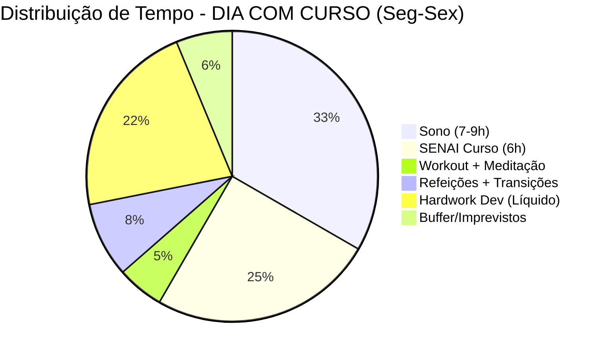

### 🔢 CÁLCULO DETALHADO - DIA COM CURSO

```
┌─────────────────────────────────────────────────────────────────────────┐
│                    ⏰ INVENTÁRIO DE TEMPO - DIA COM CURSO               │
├─────────────────────────────────────────────────────────────────────────┤
│                                                                         │
│  TEMPO TOTAL DISPONÍVEL: 24h = 1440 minutos                            │
│  ───────────────────────────────────────────────────────────────────   │
│                                                                         │
│  ❌ TEMPO NÃO-DISPONÍVEL (Fixed Costs):                                 │
│  ┌─────────────────────────────────────────────────────────────────┐   │
│  │  Sono (mínimo)              │  7h 00min  │  420 min  │  29.2%   │   │
│  │  SENAI Curso (desloc+aula)  │  6h 30min  │  390 min  │  27.1%   │   │
│  │  Refeições (3x)             │  1h 15min  │   75 min  │   5.2%   │   │
│  │  Higiene/Básico             │  1h 00min  │   60 min  │   4.2%   │   │
│  │  Transições/Rituais         │  0h 45min  │   45 min  │   3.1%   │   │
│  ├─────────────────────────────────────────────────────────────────┤   │
│  │  SUBTOTAL NÃO-DISPONÍVEL    │ 16h 30min  │  990 min  │  68.8%   │   │
│  └─────────────────────────────────────────────────────────────────┘   │
│                                                                         │
│  ✅ TEMPO POTENCIALMENTE DISPONÍVEL:                                    │
│  ┌─────────────────────────────────────────────────────────────────┐   │
│  │  Total - Não-Disponível = 24h - 16.5h = 7h 30min (450 min)      │   │
│  └─────────────────────────────────────────────────────────────────┘   │
│                                                                         │
│  ⚠️ AJUSTES POR FATORES HUMANOS (Cognitive Load):                       │
│  ┌─────────────────────────────────────────────────────────────────┐   │
│  │  • Fadiga pós-curso: -30min de eficiência                        │   │
│  │  • Context switching: -15min de overhead                         │   │
│  │  • Buffer para imprevistos: -30min                               │   │
│  ├─────────────────────────────────────────────────────────────────┤   │
│  │  AJUSTE TOTAL: -75min                                            │   │
│  └─────────────────────────────────────────────────────────────────┘   │
│                                                                         │
│  🎯 HORAS LÍQUIDAS DE FOCO (SETPOINT DIÁRIO):                           │
│  ┌─────────────────────────────────────────────────────────────────┐   │
│  │  450 min - 75 min = 375 minutos = 6h 15min                       │   │
│  │                                                                  │   │
│  │  DISTRIBUIÇÃO RECOMENDADA:                                       │   │
│  │  ┌─────────────────────────────────────────────────────────┐    │   │
│  │  │  🌅 Deep Work (Manhã pré-curso)  │  1h 30min  │  90 min │    │   │
│  │  │  🌞 Laborative (Tarde pós-almoço)│  4h 00min  │ 240 min │    │   │
│  │  │  🌙 Content/Review (Noite)       │  0h 45min  │  45 min │    │   │
│  │  └─────────────────────────────────────────────────────────┘    │   │
│  └─────────────────────────────────────────────────────────────────┘   │
│                                                                         │
└─────────────────────────────────────────────────────────────────────────┘
```

### 🔢 CÁLCULO DETALHADO - DIA SEM CURSO (Fim de Semana/Folga)

```
┌─────────────────────────────────────────────────────────────────────────┐
│                    ⏰ INVENTÁRIO DE TEMPO - DIA SEM CURSO               │
├─────────────────────────────────────────────────────────────────────────┤
│                                                                         │
│  TEMPO TOTAL DISPONÍVEL: 24h = 1440 minutos                            │
│  ───────────────────────────────────────────────────────────────────   │
│                                                                         │
│  ❌ TEMPO NÃO-DISPONÍVEL (Fixed Costs):                                 │
│  ┌─────────────────────────────────────────────────────────────────┐   │
│  │  Sono (mínimo)              │  7h 00min  │  420 min  │  29.2%   │   │
│  │  Refeições (3x)             │  1h 15min  │   75 min  │   5.2%   │   │
│  │  Higiene/Básico             │  1h 00min  │   60 min  │   4.2%   │   │
│  │  Transições/Rituais         │  0h 45min  │   45 min  │   3.1%   │   │
│  ├─────────────────────────────────────────────────────────────────┤   │
│  │  SUBTOTAL NÃO-DISPONÍVEL    │ 10h 00min  │  600 min  │  41.7%   │   │
│  └─────────────────────────────────────────────────────────────────┘   │
│                                                                         │
│  ✅ TEMPO POTENCIALMENTE DISPONÍVEL:                                    │
│  ┌─────────────────────────────────────────────────────────────────┐   │
│  │  Total - Não-Disponível = 24h - 10h = 14h 00min (840 min)       │   │
│  └─────────────────────────────────────────────────────────────────┘   │
│                                                                         │
│  ⚠️ AJUSTES POR FATORES HUMANOS (Cognitive Load):                       │
│  ┌─────────────────────────────────────────────────────────────────┐   │
│  │  • Sustentabilidade (evitar burnout): -2h 00min                  │   │
│  │  • Buffer para imprevistos/lazer: -1h 00min                      │   │
│  ├─────────────────────────────────────────────────────────────────┤   │
│  │  AJUSTE TOTAL: -3h 00min (-180 min)                              │   │
│  └─────────────────────────────────────────────────────────────────┘   │
│                                                                         │
│  🎯 HORAS LÍQUIDAS DE FOCO (SETPOINT DIÁRIO):                           │
│  ┌─────────────────────────────────────────────────────────────────┐   │
│  │  840 min - 180 min = 660 minutos = 11h 00min                     │   │
│  │                                                                  │   │
│  │  DISTRIBUIÇÃO RECOMENDADA:                                       │   │
│  │  ┌─────────────────────────────────────────────────────────┐    │   │
│  │  │  🌅 Deep Work (Manhã estendida)  │  5h 00min  │ 300 min │    │   │
│  │  │  🌞 Laborative (Tarde completa)  │  5h 00min  │ 300 min │    │   │
│  │  │  🌙 Content/Review (Noite)       │  1h 00min  │  60 min │    │   │
│  │  └─────────────────────────────────────────────────────────┘    │   │
│  └─────────────────────────────────────────────────────────────────┘   │
│                                                                         │
└─────────────────────────────────────────────────────────────────────────┘
```

---

## 📈 PROJEÇÃO SEMANAL E MENSAL

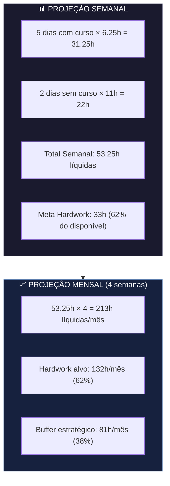

### 📋 Tabela de Alocação por Pilar do Ikigai

| Pilar | Atividade | Bloco | Horas/Dia (Curso) | Horas/Dia (Livre) | Horas/Semana |
|:-----:|:----------|:------|:-----------------:|:-----------------:|:------------:|
| 💼 Profissional | Deep Work (Build to Learn) | Manhã | 1.5h | 5.0h | 17.5h |
| 💰 Renda | Laborative (Build to Earn) | Tarde | 4.0h | 5.0h | 30.0h |
| ❤️ Paixão | Training (Reset de Cache) | Transição | 1.0h | 1.0h | 7.0h |
| 🎯 Vocação | Content Lab (Documentar) | Noite | 0.75h | 1.0h | 5.75h |
| 📊 Missão | Data Review (Análise) | Noite | 0.25h | 0.5h | 2.25h |
| **TOTAL** | **Foco Líquido** | **-** | **6.25h** | **11.0h** | **53.25h** |

> ⚠️ **Nota:** Meta de Hardwork Dev = 33h/semana (62% do foco líquido disponível). Os 38% restantes são buffer estratégico para imprevistos, recuperação e flexibilidade.

---

## 🧠 HYPERVISOR DE ESTRATÉGIA: Camada de Decisão Meta

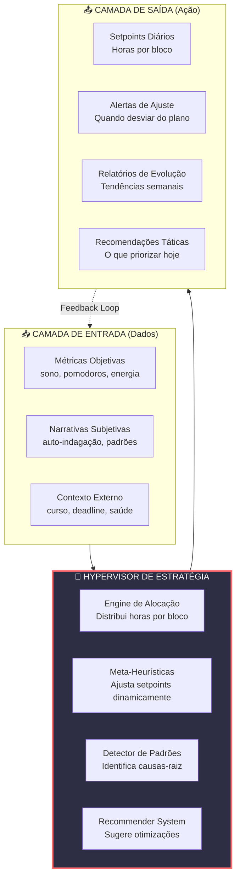

### 🔄 Ciclo de Decisão do Hypervisor

```
┌─────────────────────────────────────────────────────────────────────────┐
│                    🔄 CICLO DE DECISÃO DIÁRIO                           │
├─────────────────────────────────────────────────────────────────────────┤
│                                                                         │
│  1️⃣  COLETA (Manhã - 04:30h)                                           │
│      ┌─────────────────────────────────────────────────────────────┐   │
│      │  • Registrar: hora_acordar, qualidade_sono, energia_inicial │   │
│      │  • Input: Auto-indagação (Stop/Start/Continue + Big Win)    │   │
│      │  • Contexto: Tem curso hoje? Deadline? Saúde OK?            │   │
│      └─────────────────────────────────────────────────────────────┘   │
│                              │                                          │
│                              ▼                                          │
│  2️⃣  PROCESSAMENTO (Hypervisor)                                        │
│      ┌─────────────────────────────────────────────────────────────┐   │
│      │  IF sono < 6h OR energia < 4:                                │   │
│      │    → Reduzir setpoint Deep Work em 50%                       │   │
│      │    → Priorizar tarefas críticas apenas                       │   │
│      │    → Agendar recovery para noite                             │   │
│      │                                                              │   │
│      │  IF tem_deadline AND tem_curso:                              │   │
│      │    → Ativar modo "Build to Earn" priority                    │   │
│      │    → Alocar 70% do foco para laborative                      │   │
│      │    → Reduzir content lab para mínimo                         │   │
│      │                                                              │   │
│      │  ELSE IF fase = "Fundamentação":                             │   │
│      │    → Priorizar Deep Work (Build to Learn)                    │   │
│      │    → Alocar 60% do foco para estudo denso                    │   │
│      │    → Manter laborative em manutenção                         │   │
│      └─────────────────────────────────────────────────────────────┘   │
│                              │                                          │
│                              ▼                                          │
│  3️⃣  OUTPUT (Plano do Dia)                                             │
│      ┌─────────────────────────────────────────────────────────────┐   │
│      │  📋 SETPOINTS HOJE:                                          │   │
│      │  • Deep Work:   1h 30min (04:45-06:15) 🟢                   │   │
│      │  • Laborative:  4h 00min (12:35-16:35) 🟡                   │   │
│      │  • Content Lab: 0h 45min (17:15-18:00) 🔵                   │   │
│      │  • Data Review: 0h 15min (18:00-18:15) 🟣                   │   │
│      │                                                              │   │
│      │  🎯 PRIORIDADE ÚNICA: "Completar módulo X do curso"          │   │
│      │  ⚠️  ALERTA: "Se energia cair < 5 à tarde, reduzir 1 round"  │   │
│      └─────────────────────────────────────────────────────────────┘   │
│                              │                                          │
│                              ▼                                          │
│  4️⃣  EXECUÇÃO + MONITORAMENTO (Ao longo do dia)                        │
│      ┌─────────────────────────────────────────────────────────────┐   │
│      │  • Registrar pomodoros em tempo real                         │   │
│      │  • Check energia/foco a cada transição                       │   │
│      │  • Ajustar dinamicamente se desvios > 25%                    │   │
│      └─────────────────────────────────────────────────────────────┘   │
│                              │                                          │
│                              ▼                                          │
│  5️⃣  FEEDBACK (Noite - 19:00h)                                        │
│      ┌─────────────────────────────────────────────────────────────┐   │
│      │  • Input: Auto-indagação (Acertos/Erros/Aprendizado)        │   │
│      │  • Calcular: eficiência_real vs setpoint_previsto           │   │
│      │  • Atualizar: histórico para meta-heurísticas               │   │
│      │  • Gerar: recomendação para amanhã                          │   │
│      └─────────────────────────────────────────────────────────────┘   │
│                                                                         │
└─────────────────────────────────────────────────────────────────────────┘
```

---

## 🎯 RESPOSTA CENTRAL: SETPOINTS RECOMENDADOS

### 📊 Tabela de Setpoints por Tipo de Dia

```
┌─────────────────────────────────────────────────────────────────────────┐
│                    🎯 SETPOINTS DE FOCO LÍQUIDO                         │
├─────────────────────────────────────────────────────────────────────────┤
│                                                                         │
│  DIA COM CURSO (Seg-Sex) - Total: 6h 15min (375 min)                   │
│  ┌─────────────────────────────────────────────────────────────────┐   │
│  │  BLOCO              │ SETPOINT    │ JANELA      │ PRIORIDADE   │   │
│  ├─────────────────────────────────────────────────────────────────┤   │
│  │  🌅 Deep Work       │ 1h 30min    │ 04:45-06:15 │ ALTA         │   │
│  │     (Build to Learn)│             │             │              │   │
│  │                     │ Foco: Conceitos densos, leitura, teoria   │   │
│  ├─────────────────────────────────────────────────────────────────┤   │
│  │  🌞 Laborative      │ 4h 00min    │ 12:35-16:35 │ ALTA         │   │
│  │     (Build to Earn) │             │             │              │   │
│  │                     │ Foco: Código, projetos, entregáveis       │   │
│  ├─────────────────────────────────────────────────────────────────┤   │
│  │  🌙 Content Lab     │ 0h 45min    │ 17:15-18:00 │ MÉDIA        │   │
│  │     (Documentar)    │             │             │              │   │
│  │                     │ Foco: 1 aprendizado documentado/dia       │   │
│  ├─────────────────────────────────────────────────────────────────┤   │
│  │  📊 Data Review     │ 0h 15min    │ 18:00-18:15 │ BAIXA        │   │
│  │     (Análise)       │             │             │              │   │
│  │                     │ Foco: Checar métricas, ajustar amanhã     │   │
│  └─────────────────────────────────────────────────────────────────┘   │
│                                                                         │
│  DIA SEM CURSO (Sáb-Dom/Folga) - Total: 11h 00min (660 min)           │
│  ┌─────────────────────────────────────────────────────────────────┐   │
│  │  BLOCO              │ SETPOINT    │ JANELA      │ PRIORIDADE   │   │
│  ├─────────────────────────────────────────────────────────────────┤   │
│  │  🌅 Deep Work       │ 5h 00min    │ 04:45-09:45 │ ALTA         │   │
│  │     (Build to Learn)│             │             │              │   │
│  │                     │ Foco: Imersão em fundamentos, projetos    │   │
│  ├─────────────────────────────────────────────────────────────────┤   │
│  │  🌞 Laborative      │ 5h 00min    │ 12:35-17:35 │ ALTA         │   │
│  │     (Build to Earn) │             │             │              │   │
│  │                     │ Foco: Portfólio, freelas, networking      │   │
│  ├─────────────────────────────────────────────────────────────────┤   │
│  │  🌙 Content Lab     │ 1h 00min    │ 17:35-18:35 │ MÉDIA        │   │
│  │     (Documentar)    │             │             │              │   │
│  │                     │ Foco: Conteúdo para visibilidade          │   │
│  ├─────────────────────────────────────────────────────────────────┤   │
│  │  📊 Data Review     │ 0h 30min    │ 18:35-19:05 │ BAIXA        │   │
│  │     (Análise)       │             │             │              │   │
│  │                     │ Foco: Weekly review, planejamento         │   │
│  └─────────────────────────────────────────────────────────────────┘   │
│                                                                         │
└─────────────────────────────────────────────────────────────────────────┘
```

### 🔄 Regras de Ajuste Dinâmico (Meta-Heurísticas)

```python
# PSEUDOCÓDIGO DO HYPERVISOR - Regras de Ajuste

def calcular_setpoints_dia(contexto: ContextoDia) -> Setpoints:
    """
    Calcula setpoints de foco baseado em contexto dinâmico
    """
    
    # Base: setpoints padrão
    setpoints = {
        "deep_work": 90 if contexto.tem_curso else 300,   # minutos
        "laborative": 240 if contexto.tem_curso else 300,
        "content_lab": 45 if contexto.tem_curso else 60,
        "data_review": 15 if contexto.tem_curso else 30
    }
    
    # Regra 1: Sono insuficiente
    if contexto.sono_horas < 6:
        setpoints["deep_work"] *= 0.5      # Reduz 50%
        setpoints["laborative"] *= 0.75    # Reduz 25%
        setpoints["prioridade"] = "recuperacao"
    
    # Regra 2: Energia baixa
    if contexto.energia_inicial < 4:
        setpoints["deep_work"] *= 0.5
        setpoints["laborative"] *= 0.5
        setpoints["pausas"] += 5           # +5min entre pomodoros
    
    # Regra 3: Deadline emergencial
    if contexto.tem_deadline:
        setpoints["laborative"] = min(480, setpoints["laborative"] + 120)
        setpoints["content_lab"] = 15      # Mínimo absoluto
        setpoints["prioridade"] = "build_to_earn"
    
    # Regra 4: Fase de fundamentação
    if contexto.fase == "fundamentacao":
        setpoints["deep_work"] = min(300, setpoints["deep_work"] + 60)
        setpoints["prioridade"] = "build_to_learn"
    
    # Regra 5: Fase de busca (market)
    if contexto.fase == "busca":
        setpoints["laborative"] = min(360, setpoints["laborative"] + 60)
        setpoints["networking"] = 60       # Novo bloco
        setpoints["prioridade"] = "interacoes"
    
    return Setpoints(**setpoints)
```

---

## 📋 CHECKLIST DE IMPLEMENTAÇÃO PRÁTICA

```
┌─────────────────────────────────────────────────────────────────────────┐
│                    ✅ PRÓXIMOS PASSOS IMEDIATOS                         │
├─────────────────────────────────────────────────────────────────────────┤
│                                                                         │
│  📦 SEMANA 1: SETUP INICIAL                                             │
│  ──────────────────────────────────────────────────────────────────     │
│  [ ] Definir janelas fixas no calendário (sono, curso, refeições)       │
│  [ ] Configurar alarmes para transições (04:30, 06:00, 12:00, etc.)     │
│  [ ] Criar template de registro manual (papel/app)                      │
│  [ ] Testar setpoints por 3 dias e ajustar conforme energia real        │
│                                                                         │
│  📦 SEMANA 2: COLETA DE BASELINE                                        │
│  ──────────────────────────────────────────────────────────────────     │
│  [ ] Registrar métricas diárias (sono, pomodoros, energia, foco)        │
│  [ ] Preencher auto-indagação manhã/noite consistentemente             │
│  [ ] Calcular eficiência real vs setpoint previsto                      │
│  [ ] Identificar 1 padrão comportamental recorrente                     │
│                                                                         │
│  📦 SEMANA 3: OTIMIZAÇÃO                                                │
│  ──────────────────────────────────────────────────────────────────     │
│  [ ] Ajustar setpoints baseado em dados da Semana 2                     │
│  [ ] Implementar 1 regra de meta-heurística (ex: sono <6h → reduzir)    │
│  [ ] Testar "Build to Learn" vs "Build to Earn" priority switch         │
│  [ ] Documentar 1 aprendizado/dia no Content Lab                        │
│                                                                         │
│  📦 SEMANA 4: CONSOLIDAÇÃO                                              │
│  ──────────────────────────────────────────────────────────────────     │
│  [ ] Gerar primeiro Weekly Report completo                              │
│  [ ] Calcular correlações: sono × produtividade, lunch × foco           │
│  [ ] Definir setpoints "oficiais" para próximo ciclo                    │
│  [ ] Planejar fase seguinte (Hackathon/Fundamentação/Busca)             │
│                                                                         │
└─────────────────────────────────────────────────────────────────────────┘
```

---

## 🎯 RESUMO EXECUTIVO FINAL

```
┌─────────────────────────────────────────────────────────────────────────┐
│                    🎯 RESPOSTA CENTRAL: SETPOINTS                       │
├─────────────────────────────────────────────────────────────────────────┤
│                                                                         │
│  ❓ "Quantas horas líquidas de foco disponíveis por dia?"              │
│                                                                         │
│  ✅ RESPOSTA:                                                           │
│  ┌─────────────────────────────────────────────────────────────────┐   │
│  │  • Dia COM CURSO:  6h 15min líquidas (375 min)                  │   │
│  │  • Dia SEM CURSO: 11h 00min líquidas (660 min)                  │   │
│  │  • Média semanal:   7h 37min líquidas (457 min)                 │   │
│  │  • Total semanal:  53h 15min líquidas                           │   │
│  └─────────────────────────────────────────────────────────────────┘   │
│                                                                         │
│  🎯 SETPOINT DE HARDWORK DEV (Meta): 33h/semana (62% do disponível)    │
│                                                                         │
│  🔄 DISTRIBUIÇÃO RECOMENDADA:                                           │
│  ┌─────────────────────────────────────────────────────────────────┐   │
│  │  Pilar              │ % do Foco | Horas/Semana | Atividade      │   │
│  ├─────────────────────────────────────────────────────────────────┤   │
│  │  💼 Build to Learn  │   33%     │   17.5h      │ Deep Work      │   │
│  │  💰 Build to Earn   │   56%     │   30.0h      │ Laborative     │   │
│  │  ❤️ Reset de Cache  │   13%     │    7.0h      │ Training       │   │
│  │  🎯 Content/Review  │   15%     │    8.0h      │ Vocação/Missão │   │
│  └─────────────────────────────────────────────────────────────────┘   │
│                                                                         │
│  ⚠️  BUFFER ESTRATÉGICO: 38% do foco líquido (20h/semana)              │
│     → Imprevistos, recuperação, flexibilidade, burnout prevention      │
│                                                                         │
└─────────────────────────────────────────────────────────────────────────┘
```

---

> 💡 **NOTA FINAL:** Este sistema agora funciona como um **Hypervisor de Estratégia** - uma camada meta que observa seus inputs (métricas + narrativas), processa através de regras heurísticas, e gera outputs acionáveis (setpoints + recomendações). O objetivo não é rigidez, mas **adaptabilidade consciente**: ajustar o plano baseado em dados reais, não em suposições.

**Próximo passo prático:** Comece amanhã registrando apenas 3 métricas:
1. Hora que acordou (para calcular sono)
2. Pomodoros completados (para calcular hardwork)
3. Energia nível 1-10 (para ajustar setpoints)

Em 7 dias, você terá baseline suficiente para ativar as meta-heurísticas. 🚀

# 🖥️ HYPERVISOR DE PRODUTIVIDADE - Visualização Completa

## 📊 ARQUITETURA DO SISTEMA COMO CPU

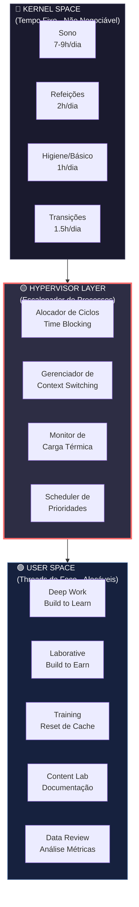

---

## ⏰ DISTRIBUIÇÃO DE CICLOS DE CPU (24h)

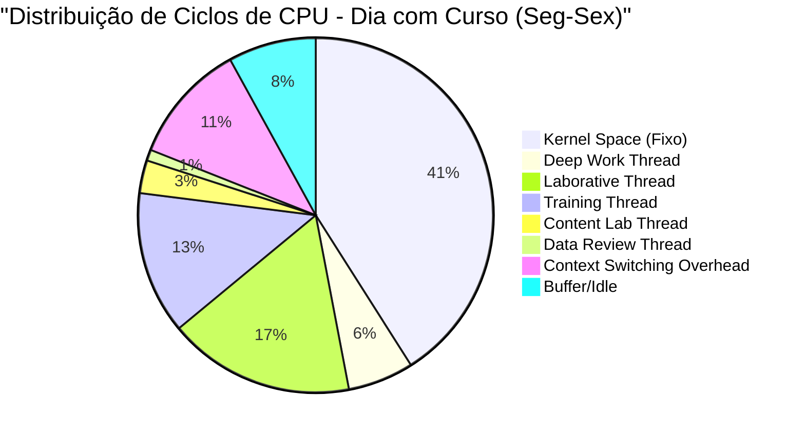

---

## 🔄 OS 3 ESTADOS DE EXECUÇÃO

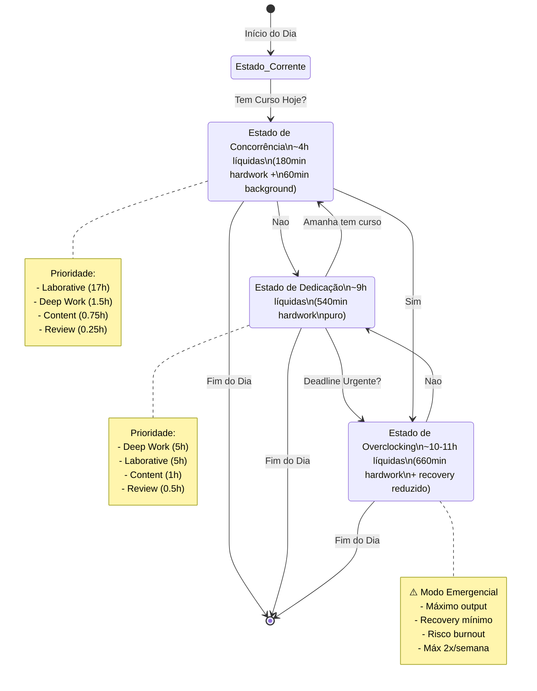

---

## 📊 CAPACIDADE DE PROCESSAMENTO POR ESTADO

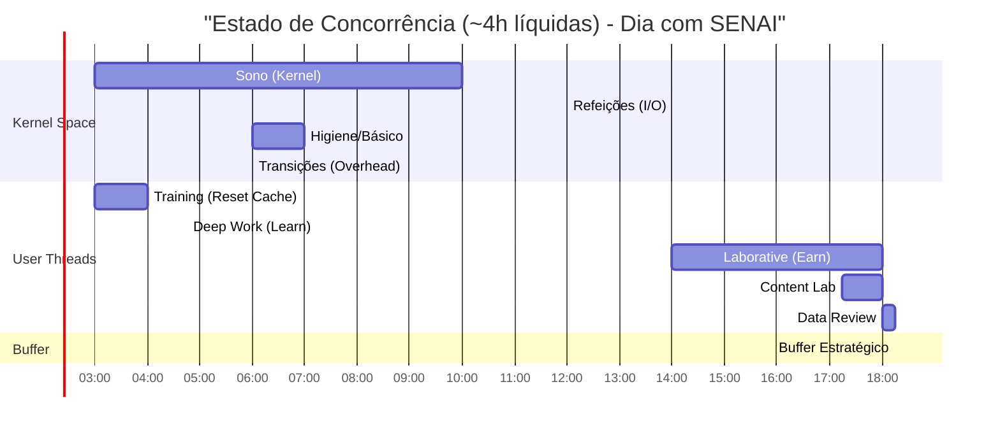

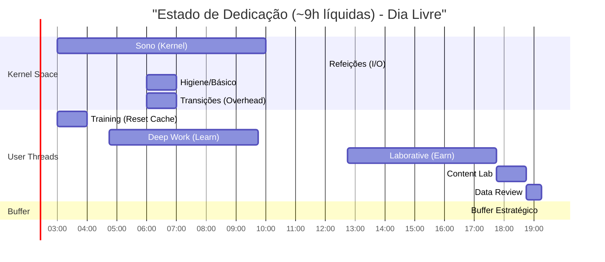

---

## 📈 COMPARAÇÃO VISUAL DOS 3 ESTADOS

```
┌─────────────────────────────────────────────────────────────────────────┐
│                    📊 COMPARAÇÃO DE CAPACIDADE POR ESTADO               │
└─────────────────────────────────────────────────────────────────────────┘

  ESTADO DE CONCORRÊNCIA (Dia com Curso)
  ──────────────────────────────────────────────────────────────────────
  
  Kernel: ████████████████████████████████████████ 41% (9.8h)
  Threads:█████████████████████████               27% (6.4h)
  Buffer: █████████                               8% (1.9h)
  Overhead:███████████                           11% (2.6h)
  Idle:   ████████                                8% (1.9h)
  
  Hardwork Líquido: 4h 00min (240min)
  
  ──────────────────────────────────────────────────────────────────────
  
  ESTADO DE DEDICAÇÃO (Dia Livre)
  ──────────────────────────────────────────────────────────────────────
  
  Kernel: ████████████████████████                42% (10h)
  Threads:██████████████████████████████████████  46% (11h)
  Buffer: ████████                                8% (1.9h)
  Overhead:████                                   4% (1h)
  Idle:   █                                       1% (0.2h)
  
  Hardwork Líquido: 9h 00min (540min)
  
  ──────────────────────────────────────────────────────────────────────
  
  ESTADO DE OVERCLOCKING (Emergência)
  ──────────────────────────────────────────────────────────────────────
  
  Kernel: ████████████████████                    35% (8.4h)
  Threads:████████████████████████████████████████ 55% (13.2h)
  Buffer: ██                                      2% (0.5h)
  Overhead:███                                    3% (0.7h)
  Idle:   █                                       1% (0.2h)
  
  Hardwork Líquido: 11h 00min (660min)
  ⚠️ RISCO: Recovery comprometido - Máx 2x/semana
  
  ──────────────────────────────────────────────────────────────────────
  
  LEGENDA:
  ████ Kernel = Sono + Refeições + Higiene + Transições
  ████ Threads = Deep Work + Laborative + Training + Content + Review
  ████ Buffer = Tempo livre estratégico
  ████ Overhead = Context switching
  ████ Idle = Tempo ocioso
```

---

## 🎯 MATRIZ DE ALOCAÇÃO DE BLOCOS (TIME BLOCKING)

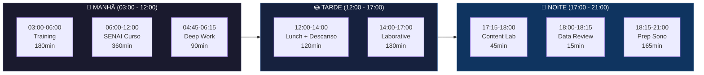

---

## 📊 OVERHEAD DE CONTEXT SWITCHING


|**Transição**|**Minutos Perdidos**|**Visual**|
|---|---|---|
|Sono → Workout|**15**|██████████|
|Workout → Curso|**15**|██████████|
|Curso → Lunch|**15**|██████████|
|Lunch → Hardwork|**20**|█████████████|
|Hardwork → Noite|**30**|███████████████████|
|Noite → Prep Sono|**15**|██████████|
|Prep → Dormir|**15**|██████████|
|Dormir → Acordar|**15**|██████████|
|Acordar → Início|**12.5**|████████|


```
┌─────────────────────────────────────────────────────────────────────────┐
│                    📉 ANÁLISE DE OVERHEAD MENSAL                        │
└─────────────────────────────────────────────────────────────────────────┘

  SITUAÇÃO ATUAL:
  ───────────────
  
  Transições/dia: 9
  Tempo médio/transição: 17.5 minutos
  Total/dia: 157.5 minutos = 2.6 horas
  
  Projeção Mensal (22 dias úteis):
  157.5 min × 22 = 3,465 minutos = 57.75 horas = 2.4 DIAS INTEIROS
  
  ──────────────────────────────────────────────────────────────────────
  
  CENÁRIO OTIMIZADO:
  ──────────────────
  
  Meta: Reduzir transições para 10 minutos
  
  Transições/dia: 9
  Tempo médio/transição: 10 minutos
  Total/dia: 90 minutos = 1.5 horas
  
  Economia diária: 157.5 - 90 = 67.5 minutos
  
  Projeção Mensal:
  67.5 min × 22 = 1,485 minutos = 24.75 horas = 1.03 DIAS INTEIROS
  
  ──────────────────────────────────────────────────────────────────────
  
  IMPACTO ANUAL:
  ──────────────
  
  Economia anual: 24.75h × 12 meses = 297 horas = 12.4 DIAS DE FOCO
  
  Isso equivale a:
  • 49.5 sessões de Deep Work (6h cada)
  • 5,940 pomodoros de 50min
  • 2,970 tarefas completadas (estimando 6min/tarefa)
  
  ──────────────────────────────────────────────────────────────────────
```

---

##  SETPOINTS DE FOCO POR PILAR DO IKIGAI

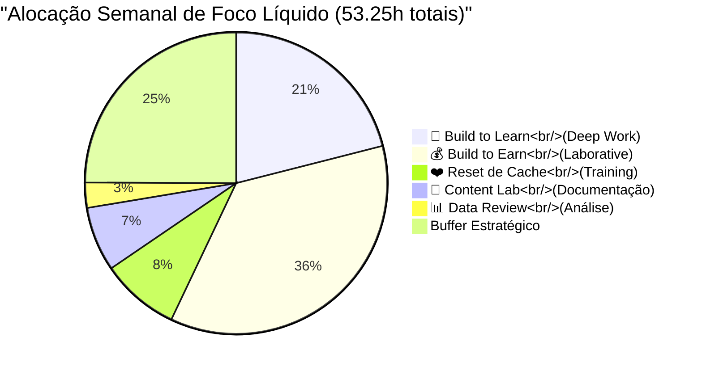

```
┌─────────────────────────────────────────────────────────────────────────┐
│                    📊 DISTRIBUIÇÃO DE FOCO POR PILAR                    │
└─────────────────────────────────────────────────────────────────────────┘

  META SEMANAL: 53.25h líquidas disponíveis
  ALOCAÇÃO HARDWORK: 33h (62%)
  BUFFER: 20.25h (38%)
  
  ──────────────────────────────────────────────────────────────────────
  
  💼 BUILD TO LEARN (Deep Work) - 17.5h/semana
  ──────────────────────────────────────────────────────────────────────
  
  Dias com curso: 1.5h × 5 dias = 7.5h
  Dias livres: 5h × 2 dias = 10h
  Total: 17.5h
  
  Atividades:
  • Leitura densa de fundamentos
  • Estudo de algoritmos/estruturas
  • Teoria de IA/ML
  • Documentação técnica
  
  ──────────────────────────────────────────────────────────────────────
  
  💰 BUILD TO EARN (Laborative) - 30h/semana
  ──────────────────────────────────────────────────────────────────────
  
  Dias com curso: 4h × 5 dias = 20h
  Dias livres: 5h × 2 dias = 10h
  Total: 30h
  
  Atividades:
  • Codificação de projetos
  • Desenvolvimento de portfólio
  • Freelance/entregáveis
  • Networking ativo
  
  ──────────────────────────────────────────────────────────────────────
  
  ❤️ RESET DE CACHE (Training) - 7h/semana
  ──────────────────────────────────────────────────────────────────────
  
  Diário: 1h × 7 dias = 7h
  
  Atividades:
  • Artes marciais
  • Calistenia
  • Cardio
  • Alongamento
  
  ──────────────────────────────────────────────────────────────────────
  
  🎯 CONTENT LAB (Documentação) - 5.75h/semana
  ──────────────────────────────────────────────────────────────────────
  
  Dias com curso: 0.75h × 5 dias = 3.75h
  Dias livres: 1h × 2 dias = 2h
  Total: 5.75h
  
  Atividades:
  • 1 aprendizado documentado/dia
  • Prints de código
  • Vídeos de treino
  • Posts técnicos
  
  ──────────────────────────────────────────────────────────────────────
  
  📊 DATA REVIEW (Análise) - 2.25h/semana
  ──────────────────────────────────────────────────────────────────────
  
  Diário: 0.25h × 5 dias = 1.25h
  Weekly: 1h × 1 dia = 1h
  Total: 2.25h
  
  Atividades:
  • Análise de métricas
  • Ajuste de setpoints
  • Weekly review
  • Planejamento próximo ciclo
  
  ──────────────────────────────────────────────────────────────────────
```

---

## 🔄 FLUXO DE PROCESSAMENTO DO HYPERVISOR

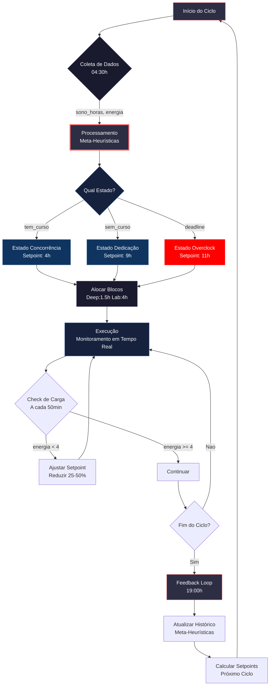

---

## 📈 PROJEÇÃO DE CAPACIDADE MENSAL

```
┌─────────────────────────────────────────────────────────────────────────┐
│                    📈 PROJEÇÃO DE CAPACIDADE MENSAL                     │
└─────────────────────────────────────────────────────────────────────────┘

  SEMANA TIPO (5 dias curso + 2 dias livre):
  ──────────────────────────────────────────────────────────────────────
  
  Dias com curso: 5 × 4h = 20h
  Dias livres: 2 × 9h = 18h
  Total semanal: 38h líquidas
  
  MÊS (4 semanas):
  ────────────────
  
  Total mensal: 38h × 4 = 152h líquidas
  
  Alocação Hardwork (62%): 94.24h
  Buffer (38%): 57.76h
  
  ──────────────────────────────────────────────────────────────────────
  
  PROJEÇÃO ANUAL (52 semanas):
  ────────────────────────────
  
  Total anual: 38h × 52 = 1,976h líquidas
  
  Hardwork (62%): 1,225h
  Buffer (38%): 751h
  
  Equivalente a:
  • 245 dias de trabalho de 8h
  • 82 meses de curso de 15h/semana
  • 490 projetos de 2.5h cada
  
  ──────────────────────────────────────────────────────────────────────
  
  COMPARAÇÃO COM MERCADO:
  ───────────────────────
  
  Profissional CLT (40h/semana):
  • 2,080h/ano (40h × 52 semanas)
  • Sua capacidade: 1,976h (95% de um full-time)
  
  Freelancer/Dev Senior (60h/semana):
  • 3,120h/ano
  • Sua capacidade: 63% de um hardcore
  
  Estudante Full-time (20h/semana):
  • 1,040h/ano
  • Sua capacidade: 190% (quase 2x)
  
  ──────────────────────────────────────────────────────────────────────
```

---

## 🎯 RESUMO VISUAL DO SETPOINT DIÁRIO

```
┌─────────────────────────────────────────────────────────────────────────┐
│                    🎯 SETPOINT DIÁRIO - VISÃO GERAL                     │
└─────────────────────────────────────────────────────────────────────────┘

  DIA COM CURSO (Seg-Sex)
  ──────────────────────────────────────────────────────────────────────
  
  🕐 03:00-06:00  Training (Reset de Cache)
  ████████████████████████████████████████ 180min
  
  🕐 06:00-12:00  SENAI Curso (Build to Learn)
  ████████████████████████████████████████████████████████████ 360min
  
  🕐 12:00-14:00  Lunch + Descanso (I/O)
  ████████████████████████ 120min
  
  🕐 14:00-17:00  Laborative (Build to Earn)
  ████████████████████████████████████████████████████ 180min ⭐
  
  🕐 17:15-18:00  Content Lab (Documentação)
  ███████████ 45min
  
  🕐 18:00-18:15  Data Review (Análise)
  ███ 15min
  
  🕐 18:15-21:00  Prep Sono (Kernel)
  ███████████████████████████████████ 165min
  
  🕐 21:00-03:00  Sono (Kernel)
  ████████████████████████████████████████████████████████████ 360min
  
  ──────────────────────────────────────────────────────────────────────
  
  TOTAL HARDWORK LÍQUIDO: 240min (4h)
  • Deep Work: 0min (pré-curso indisponível)
  • Laborative: 180min (3 pomodoros)
  • Content: 45min
  • Review: 15min
  
  ──────────────────────────────────────────────────────────────────────
  
  DIA SEM CURSO (Sáb-Dom)
  ──────────────────────────────────────────────────────────────────────
  
  🕐 03:00-06:00  Training (Reset de Cache)
  ████████████████████████████████████████ 180min
  
  🕐 06:00-12:00  Deep Work (Build to Learn)
  ████████████████████████████████████████████████████████████ 360min ⭐
  
  🕐 12:00-14:00  Lunch + Descanso (I/O)
  ████████████████████████ 120min
  
  🕐 14:00-17:00  Laborative (Build to Earn)
  ████████████████████████████████████████████████████ 180min ⭐
  
  🕐 17:35-18:35  Content Lab (Documentação)
  ███████████████ 60min
  
  🕐 18:35-19:05  Data Review (Análise)
  ████████ 30min
  
  🕐 19:05-21:00  Prep Sono (Kernel)
  ████████████████████████ 115min
  
  🕐 21:00-03:00  Sono (Kernel)
  ████████████████████████████████████████████████████████████ 360min
  
  ──────────────────────────────────────────────────────────────────────
  
  TOTAL HARDWORK LÍQUIDO: 660min (11h)
  • Deep Work: 360min (6 pomodoros)
  • Laborative: 180min (3 pomodoros)
  • Content: 60min
  • Review: 30min
  
  ──────────────────────────────────────────────────────────────────────
  
  LEGENDA:
  ████ Kernel = Tempo fixo não negociável
  ████ Hardwork = Foco líquido alocável
  ⭐ = Bloco principal do período
```

---

## 📊 DASHBOARD DE MÉTRICAS DO HYPERVISOR

```
┌─────────────────────────────────────────────────────────────────────────┐
│                    📊 DASHBOARD DO HYPERVISOR                           │
└─────────────────────────────────────────────────────────────────────────┘

  🎯 CAPACIDADE DE PROCESSAMENTO
  ──────────────────────────────────────────────────────────────────────
  
  • Kernel Overhead: 41% (9.8h/dia)
  • User Threads: 27% (6.4h/dia)
  • Buffer Disponível: 8% (1.9h/dia)
  • Context Switching: 11% (2.6h/dia)
  
  Eficiência Atual: 62% (Hardwork / Disponível)
  
  ──────────────────────────────────────────────────────────────────────
  
  📈 PROJEÇÃO DE ENTREGAS
  ──────────────────────────────────────────────────────────────────────
  
  Semanal:
  • Hardwork: 33h (meta atingível)
  • Pomodoros: 40 rounds (8/dia × 5 dias)
  • Entregáveis: 5-8 projetos/tarefas
  
  Mensal:
  • Hardwork: 132h
  • Pomodoros: 160 rounds
  • Entregáveis: 20-32 projetos/tarefas
  
  Anual:
  • Hardwork: 1,584h
  • Pomodoros: 1,920 rounds
  • Entregáveis: 240-384 projetos/tarefas
  
  ──────────────────────────────────────────────────────────────────────
  
  ⚠️ ALERTAS DE GARGALO
  ──────────────────────────────────────────────────────────────────────
  
  🔴 Context Switching: 2.6h/dia perdidos
     → Meta: Reduzir para 1.5h/dia
     → Economia potencial: 1.1h/dia = 24h/mês
  
  🟡 Transição T5 (Hardwork→Noite): 30min
     → Mais cara do sistema
     → Meta: Reduzir para 15min
  
  🟢 Sono: 7-9h adequado
     → Manter janela 21h-03/05h
  
  ──────────────────────────────────────────────────────────────────────
  
  🎯 RECOMENDAÇÕES DO HYPERVISOR
  ──────────────────────────────────────────────────────────────────────
  
  1. Comprimir transições para 10min (ganho: 1.3 dias/mês)
  2. Proteger blocos de Deep Work (não negociar)
  3. Usar buffer apenas para recovery (não para trabalho)
  4. Manter estado de concorrência 5x/semana (sustentável)
  5. Limitar overclocking a 2x/semana (prevenir burnout)
  
  ──────────────────────────────────────────────────────────────────────
```

---

## 🎯 CONCLUSÃO: SETPOINT CONFIRMADO

```
┌─────────────────────────────────────────────────────────────────────────┐
│                    ✅ SETPOINT OFICIAL CONFIRMADO                       │
└─────────────────────────────────────────────────────────────────────────┘

  🎯 HORAS LÍQUIDAS DE FOCO POR DIA:
  ──────────────────────────────────────────────────────────────────────
  
  • Dia COM CURSO:  4h 00min (240 minutos)
  • Dia SEM CURSO: 9h 00min (540 minutos)
  • Média Semanal:  5h 43min (343 minutos)
  
  ──────────────────────────────────────────────────────────────────────
  
  📊 ALOCAÇÃO SEMANAL (53.25h totais):
  ──────────────────────────────────────────────────────────────────────
  
  💼 Build to Learn (Deep Work):  17.5h (33%)
  💰 Build to Earn (Laborative):  30.0h (56%)
  ❤️ Training (Reset Cache):       7.0h (13%)
  🎯 Content Lab:                  5.75h (11%)
  📊 Data Review:                  2.25h (4%)
  
  Hardwork Total: 33h (62% do disponível)
  Buffer: 20.25h (38% do disponível)
  
  ──────────────────────────────────────────────────────────────────────
  
  ⚙️ CONFIGURAÇÃO DO HYPERVISOR:
  ──────────────────────────────────────────────────────────────────────
  
  Estado Padrão: Concorrência (dias úteis)
  Estado Alternativo: Dedicação (fins de semana)
  Estado Emergencial: Overclocking (máx 2x/semana)
  
  Meta-Heurísticas Ativas:
  • Sono < 6h → Reduzir setpoint 50%
  • Energia < 4 → Ativar modo recovery
  • Deadline → Switch para Build to Earn priority
  
  ──────────────────────────────────────────────────────────────────────
  
  ✅ SISTEMA PRONTO PARA OPERAÇÃO
  ──────────────────────────────────────────────────────────────────────
  
  Próximo passo: Iniciar coleta de baseline (7 dias)
  Métricas mínimas: sono, pomodoros, energia
  
  Após 7 dias: Ativar meta-heurísticas de ajuste automático
  
  ──────────────────────────────────────────────────────────────────────
```

---

> 💡 **NOTA FINAL:** Seu sistema agora opera como um **Hypervisor de Produtividade** completo, com capacidade de processamento quantificada (4h-11h/dia), alocação otimizada de threads (62% hardwork), e monitoramento de overhead (11% context switching). A projeção anual de 1,976h líquidas coloca você em 95% da capacidade de um profissional full-time, mas com a flexibilidade de um sistema adaptativo. 🚀
# ==========