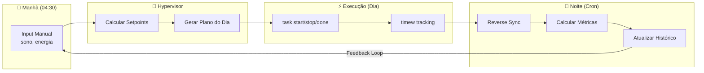

# Enriquecimento de Dados no Data-Mesh: Upstream/Downstream & Gerenciamento de Metadados

Este documento expande a arquitetura de Data-Mesh definida em `01-data-mesh-strategy.md` e `01.5-data-contracts-and-pipelines.md`, focando especificamente nos **fluxos de enriquecimento de dados**, **governança de metadados via YAML Frontmatter**, e a **integração epistêmica com o modelo IKIGAi/Hypervisor**.

---

## 1. Visão Geral: As Duas Vias do Data-Mesh

O Data-Mesh opera em **duas vias complementares** de propagação de dados. Cada via possui responsabilidades, contratos e ownership distintos:

```
┌─────────────────────────────────────────────────────────────────────────┐
│                    🔄 TOPOLOGIA DE FLUXO BIDIRECIONAL                  │
├─────────────────────────────────────────────────────────────────────────┤
│                                                                         │
│  ┌──────────────────┐                    ┌──────────────────┐          │
│  │  UPSTREAM         │    API Push        │  DOWNSTREAM      │          │
│  │  (Planning Layer) │ ──────────────►   │  (Execution Layer)│          │
│  │                   │                    │                   │          │
│  │  • Markdown/YAML  │    Reverse Sync   │  • Taskwarrior    │          │
│  │  • Obsidian Vault │ ◄────────────── │  • Timewarrior    │          │
│  │  • strategics/    │                    │  • .task DB       │          │
│  │  • IKIGAi Model   │                    │  • timew logs     │          │
│  └──────────────────┘                    └──────────────────┘          │
│           │                                        │                    │
│           │              ┌──────────┐              │                    │
│           └─────────────►│ MIDDLEWARE│◄─────────────┘                    │
│                          │ (Python)  │                                   │
│                          │ Pydantic  │                                   │
│                          │ SQLite/   │                                   │
│                          │ DuckDB    │                                   │
│                          └─────┬────┘                                   │
│                                │                                        │
│                          ┌─────▼────┐                                   │
│                          │ BI/Dash  │                                   │
│                          │Streamlit │                                   │
│                          └──────────┘                                   │
│                                                                         │
└─────────────────────────────────────────────────────────────────────────┘
```

### 1.1. Via Upstream → Downstream (API Push / "Compilação de Backlog")

**Owner:** Planning Layer (Markdown + YAML Frontmatter)
**Destino:** Taskwarrior CLI Database (`.task`)
**Frequência:** On-demand (commit hook, manual trigger, `make push-tasks`)

| Etapa | Ação | Dados Transportados |
|:------|:------|:---------------------|
| 1. Parse | Motor Python lê `.md` files com `python-frontmatter` | `entity_type`, `parent_goal`, `revenue_impact`, `tags[]` |
| 2. Enrich | Middleware cruza metadados do Frontmatter com contexto hierárquico | `project_hierarchy` (concatenação `S1.O2.M3.Proj`) |
| 3. Validate | Pydantic Models validam o payload JSON intermediário | Schema enforcement, type checking, FK integrity |
| 4. Inject | `tasklib` ou CLI batch push para o banco `.task` | `description`, `project`, `tags`, `upstream_id`, `size`, `due` |

**Regra de Ouro:** O humano **nunca** digita metadados no terminal. Todo enriquecimento é computado algoritmicamente.

### 1.2. Via Downstream → Upstream (Reverse Sync / "Telemetria de Execução")

**Owner:** Execution Layer (Taskwarrior + Timewarrior)
**Destino:** Middleware Analytics (SQLite/DuckDB) → Planning Layer (status updates)
**Frequência:** Daemon/Cron (diário, noturno)

| Etapa | Ação | Dados Capturados |
|:------|:------|:---------------------|
| 1. Export | `task export` + `timew export` em JSON | Status (`completed`, `deleted`), timestamps, durations |
| 2. Diff | Motor compara snapshot anterior vs atual | Delta de status, novas tarefas órfãs (`project:INBOX`) |
| 3. Enrich | JOIN com Planning DB via `upstream_id` | Contexto estratégico: qual Sonho/Objetivo/Meta essa task serviu |
| 4. Aggregate | Cálculos analíticos (ROI temporal, burndown, velocity) | Métricas consolidadas por projeto, por período, por pilar IKIGAi |
| 5. Feedback | Atualização de dashboards + geração de `triagem.md` para órfãs | Recomendações do Hypervisor, alertas de desvio |

**Regra de Ouro:** O Taskwarrior é `Source of Truth` para **Status e Tempo**. O Planning é `Source of Truth` para **Metadados e Nomenclaturas**.

---

## 2. Governança de Metadados: O Papel do YAML Frontmatter

O YAML Frontmatter é o **contrato de interface** entre o mundo humano (Markdown legível) e o mundo máquina (pipelines de dados). Cada arquivo de planejamento deve carregar um cabeçalho YAML padronizado que serve como a "certidão de nascimento" de todas as entidades que dele derivam.

### 2.1. Taxonomia de Entidades e Seus Frontmatters

O sistema de planejamento opera com uma hierarquia fixa de entidades. Cada nível possui seu próprio schema de Frontmatter:

#### Nível 1: Sonho (Dream) — Horizonte Anual/Plurianual
```yaml
---
id: "S1"
title: "Fonte de Renda com Programação"
entity_type: "dream"
horizon: "annual"
ikigai_vectors:
  passion: 0.8
  skill: 0.9
  market: 0.7
  revenue: 0.6
status: "active"
created: "2026-01-15"
review_cycle: "quarterly"
tags: ["renda", "programacao", "carreira"]
---
```

#### Nível 2: Objetivo (Objective) — Horizonte Trimestral (Quarter)
```yaml
---
id: "O2"
title: "Conseguir Primeiro Freela de Backend"
entity_type: "objective"
parent_dream: "S1"
quarter: "Q3_2026"
key_results:
  - kr_id: "KR1"
    description: "Completar 3 projetos de portfólio"
    target: 3
    current: 1
  - kr_id: "KR2"
    description: "Aplicar para 20 vagas/freelas"
    target: 20
    current: 5
revenue_impact: "HIGH"
status: "in_progress"
created: "2026-07-01"
review_cycle: "monthly"
tags: ["backend", "freela", "portfolio"]
---
```

#### Nível 3: Meta (Goal/Sprint) — Horizonte Quinzenal (Onda)
```yaml
---
id: "M3"
title: "Sprint: API REST com Autenticação JWT"
entity_type: "meta"
parent_objective: "O2"
wave: "W2_Jul_2026"
duration_days: 15
estimated_hours: 30
priority: "P1"
status: "active"
created: "2026-07-15"
review_cycle: "weekly"
tags: ["api", "jwt", "sprint"]
---
```

#### Nível 4: Projeto/Épico (Project) — Horizonte Semanal
```yaml
---
id: "proj_alfa_01"
title: "Módulo de Autenticação"
entity_type: "project"
parent_meta: "M3"
parent_objective: "O2"
parent_dream: "S1"
revenue_impact: "HIGH"
estimated_size: "8h"
tw_project_key: "S1.O2.M3.proj_alfa_01"
status: "active"
created: "2026-07-16"
tags: ["@backend", "@security"]
---
```

#### Nível 5: Tarefa (Task) — Atômico (Diário)

As tarefas são definidas **no corpo do Markdown** como checklists tipados, não em Frontmatter próprio:
```markdown
### Entregáveis

- [ ] `task_01`: Implementar login com JWT (size: 4h) depends: null
- [ ] `task_02`: Criar middleware de refresh token (size: 3h) depends: `task_01`
- [ ] `task_03`: Testes unitários de auth (size: 1h) depends: `task_02`
```

### 2.2. Regras de Integridade Referencial (Off-Chain)

O Middleware Python é responsável por garantir a integridade das referências entre entidades:

```
┌─────────────────────────────────────────────────────────────────────────┐
│                    🔗 GRAFO DE INTEGRIDADE REFERENCIAL                 │
├─────────────────────────────────────────────────────────────────────────┤
│                                                                         │
│  Sonho (S1)                                                             │
│    └── Objetivo (O2)     ← parent_dream: "S1" (FK validada)           │
│         └── Meta (M3)    ← parent_objective: "O2" (FK validada)        │
│              └── Projeto (proj_alfa_01)                                 │
│                   │       ← parent_meta: "M3" (FK validada)            │
│                   │       ← tw_project_key: "S1.O2.M3.proj_alfa_01"   │
│                   │                                                     │
│                   ├── task_01 ← upstream_id no TW (FK para Mesh)       │
│                   ├── task_02 ← depends: task_01 (FK intra-projeto)    │
│                   └── task_03 ← depends: task_02 (FK intra-projeto)    │
│                                                                         │
│  Validações do Pipeline:                                                │
│  ✅ parent_dream existe no registro de Sonhos                          │
│  ✅ parent_objective existe e pertence ao parent_dream declarado        │
│  ✅ parent_meta existe e pertence ao parent_objective declarado         │
│  ✅ tw_project_key é construída deterministicamente pelo pipeline       │
│  ❌ Erro: parent_objective:"O9" → FK_VIOLATION (O9 não existe)         │
│                                                                         │
└─────────────────────────────────────────────────────────────────────────┘
```

**Erros Tipados de Validação:**

| Código | Descrição | Ação do Pipeline |
|:-------|:----------|:-----------------|
| `FK_DREAM_NOT_FOUND` | `parent_dream` referencia um ID inexistente | Abortar push, logar erro, propor correção |
| `FK_OBJECTIVE_ORPHAN` | Objetivo sem Sonho pai válido | Mover para `triagem.md` |
| `FK_META_CONFLICT` | Meta referencia Objetivo de outro Sonho | Alerta de integridade cruzada |
| `TASK_DUPLICATE_ID` | `upstream_id` já existe no TW (colisão de hash) | Skip insert, comparar diff para modify |
| `TASK_ORPHAN_INBOX` | Tarefa no TW sem `upstream_id` (criada ad-hoc) | Propor triagem no reverse-sync |

---

## 3. Integração Epistêmica: IKIGAi × Data-Mesh

O modelo IKIGAi (documentado em `base/IKIGAi.md`) não é apenas um framework motivacional — ele é a **função objetivo** que rege a alocação de recursos do Hypervisor. O Data-Mesh deve ser capaz de cruzar métricas de execução com os vetores do IKIGAi para gerar insights de ROI multidimensional.

### 3.1. Mapeamento IKIGAi → Metadados de Pipeline

Cada entidade do planejamento carrega em seu Frontmatter os vetores IKIGAi relevantes:

```yaml
# No Frontmatter do Sonho ou Objetivo:
ikigai_vectors:
  passion: 0.8    # ❤️ Paixão (quanto você ama fazer isso)
  skill: 0.9      # 💼 Habilidade (quanto você é bom nisso)
  market: 0.7     # 🎯 Mercado (quanto o mundo precisa disso)
  revenue: 0.6    # 💰 Renda (quanto te pagam por isso)
```

### 3.2. O Cálculo de ROI Multidimensional via IKIGAi

Quando o Reverse Sync captura as horas gastas por tarefa (via Timewarrior), o Middleware realiza o JOIN:

```python
# Pseudocódigo do cálculo de ROI IKIGAi
def calcular_roi_ikigai(task_id: str, time_spent_hours: float):
    """
    Cruza o tempo gasto com os vetores IKIGAi do Sonho raiz
    para calcular o ROI multidimensional.
    """
    # 1. Resolve a cadeia hierárquica via upstream_id
    task = tw_export(upstream_id=task_id)
    project = planning_db.get(task.project_hierarchy)
    dream = planning_db.resolve_dream(project.parent_dream)

    # 2. Extrai os vetores IKIGAi do Sonho raiz
    vectors = dream.ikigai_vectors

    # 3. Calcula o score ponderado
    ikigai_score = (
        vectors.passion * 0.25 +
        vectors.skill * 0.25 +
        vectors.market * 0.25 +
        vectors.revenue * 0.25
    )

    # 4. ROI = (Score IKIGAi × Horas Investidas) / Custo-Hora Base
    custo_hora_base = 50.0  # R$/hora (setpoint do GnuCash)
    roi = (ikigai_score * time_spent_hours * custo_hora_base)

    return {
        "task_id": task_id,
        "time_spent": time_spent_hours,
        "ikigai_score": ikigai_score,
        "roi_estimado_brl": roi,
        "dream_alignment": dream.title,
        "vector_breakdown": vectors
    }
```

### 3.3. Dashboard IKIGAi: Visualização de Alinhamento Estratégico

O BI (Streamlit) renderiza um painel que mostra o **alinhamento real vs. planejado** por vetor:

```
┌─────────────────────────────────────────────────────────────────────────┐
│                    🎯 DASHBOARD IKIGAi × EXECUÇÃO                      │
├─────────────────────────────────────────────────────────────────────────┤
│                                                                         │
│  SEMANA 28 (07-08 Jul 2026)                                            │
│  ──────────────────────────────────────────────────────────────────     │
│                                                                         │
│  ❤️ PAIXÃO (Treino + Projetos Pessoais)                                │
│     Horas: 8.5h  │  Alvo: 7h  │  Status: ✅ ACIMA (+21%)              │
│     ████████████████████████████████████████ 121%                       │
│                                                                         │
│  💼 HABILIDADE (Deep Work + Estudo)                                    │
│     Horas: 15.2h │  Alvo: 17.5h │  Status: ⚠️ ABAIXO (-13%)          │
│     ██████████████████████████████████ 87%                              │
│                                                                         │
│  🎯 MERCADO (Networking + Conteúdo)                                    │
│     Horas: 3.1h  │  Alvo: 5.75h │  Status: 🔴 CRÍTICO (-46%)         │
│     ██████████████████ 54%                                              │
│                                                                         │
│  💰 RENDA (Laborative + Freelas)                                       │
│     Horas: 28.3h │  Alvo: 30h  │  Status: ✅ ON TRACK (-6%)           │
│     ██████████████████████████████████████ 94%                          │
│                                                                         │
│  ──────────────────────────────────────────────────────────────────     │
│                                                                         │
│  🧠 RECOMENDAÇÃO DO HYPERVISOR:                                        │
│  "Mercado está 46% abaixo do alvo. Alocar 1h extra de Content Lab     │
│   na próxima semana. Considerar postar 2 artigos técnicos no LinkedIn │
│   usando os relatórios do Deep Work como subproduto."                  │
│                                                                         │
└─────────────────────────────────────────────────────────────────────────┘
```

---

## 4. O Hypervisor como Consumidor do Data-Mesh

O ciclo de decisão do Hypervisor (documentado em `base/IKIGAi.md`, seção "Ciclo de Decisão Diário") depende de dois fluxos de dados que o Data-Mesh provê:

### 4.1. Inputs do Hypervisor (O que o Mesh entrega)

| Input | Fonte | Frequência | Formato |
|:------|:------|:-----------|:--------|
| `sono_horas` | Manual (formulário matinal) | Diário 04:30h | `float` |
| `energia_inicial` | Manual (auto-indagação) | Diário 04:30h | `int (1-10)` |
| `pomodoros_ontem` | Timewarrior (reverse sync) | Diário (cron noturno) | `int` |
| `eficiencia_ontem` | Cálculo: `pomodoros_real / setpoint_previsto` | Diário (cron noturno) | `float (0-1)` |
| `burndown_velocity` | TW `burndown` data export | Semanal | `float (tasks/day)` |
| `ikigai_balance` | Cálculo: horas por vetor vs. alvo | Semanal | `dict{vetor: %}` |
| `orphan_count` | Reverse sync: tasks com `project:INBOX` | Diário | `int` |

### 4.2. Outputs do Hypervisor (O que o Mesh recebe de volta)

| Output | Destino | Ação |
|:-------|:--------|:-----|
| `setpoints_dia` | Renderizado no Dashboard / `daily_plan.md` | Define horas por bloco |
| `prioridade_unica` | Injetado como `+priority:H` no TW | Destaca a tarefa do dia |
| `alertas` | Log no Dashboard + notificação terminal | Avisa desvios >25% |
| `recomendacoes` | Appendado em `triagem.md` ou `weekly_review.md` | Sugere ajustes táticos |

### 4.3. O Ciclo Completo de Feedback (Closed Loop)



---

## 5. Especificação de Meta-Tags para Interoperabilidade

Para garantir que todos os sistemas do workspace (`strategics/`, `fin_ops/`, `life/vibe-ops/`, `taskwarrior/`) falem a mesma linguagem, definimos um vocabulário controlado de meta-tags:

### 5.1. Tags de Contexto Operacional (Prefixo `@`)

Estas tags indicam o **ambiente** ou **ferramenta** ativa durante a execução:

| Tag | Significado | Uso no TW | Uso no Frontmatter |
|:----|:-----------|:----------|:-------------------|
| `@vscode` | Trabalho no editor de código | `+@vscode` | `tags: ["@vscode"]` |
| `@terminal` | Trabalho puramente em CLI | `+@terminal` | `tags: ["@terminal"]` |
| `@obsidian` | Documentação/Knowledge Base | `+@obsidian` | `tags: ["@obsidian"]` |
| `@wsl` | Ambiente Linux/WSL | `+@wsl` | `tags: ["@wsl"]` |
| `@browser` | Pesquisa/Networking online | `+@browser` | `tags: ["@browser"]` |

### 5.2. Tags de Domínio Técnico (Sem prefixo)

| Tag | Significado | Contexto |
|:----|:-----------|:---------|
| `backend` | Desenvolvimento de APIs/servidores | Projetos de software |
| `frontend` | UI/UX, interfaces web | Projetos de software |
| `data` | Engenharia de dados, pipelines | Projetos de analytics |
| `devops` | Infra, CI/CD, containers | Operações |
| `security` | Autenticação, criptografia | Cross-cutting |
| `study` | Material de estudo/fundamentação | Build to Learn |

### 5.3. Tags de Fase IKIGAi (Prefixo `phase:`)

| Tag | Vetor IKIGAi | Bloco de Tempo |
|:----|:-------------|:---------------|
| `phase:learn` | 💼 Habilidade | Deep Work |
| `phase:earn` | 💰 Renda | Laborative |
| `phase:train` | ❤️ Paixão | Training |
| `phase:share` | 🎯 Mercado | Content Lab |
| `phase:review` | 📊 Missão | Data Review |

---

## 6. Pipeline de Triagem: Tratamento de Tarefas Órfãs

O Reverse Sync é responsável por identificar tarefas criadas diretamente no Taskwarrior (ad-hoc) que não possuem `upstream_id`. Estas "órfãs" precisam ser triadas para manter a integridade do Data-Mesh.

### 6.1. Fluxo de Detecção e Triagem

```
┌─────────────────────────────────────────────────────────────────────────┐
│                    🔍 PIPELINE DE TRIAGEM DE ÓRFÃS                     │
├─────────────────────────────────────────────────────────────────────────┤
│                                                                         │
│  1. DETECÇÃO (Cron Noturno)                                            │
│     ┌─────────────────────────────────────────────────────────────┐    │
│     │  task export project:INBOX upstream_id.none: status:pending │    │
│     │  → Filtra todas as tasks sem FK e no projeto INBOX          │    │
│     └─────────────────────────────────────────────────────────────┘    │
│                              │                                          │
│  2. CLASSIFICAÇÃO AUTOMÁTICA                                           │
│     ┌─────────────────────────────────────────────────────────────┐    │
│     │  Para cada órfã, o motor tenta inferir:                     │    │
│     │  • Tags existentes → Sugere projeto pai                    │    │
│     │  • Descrição (NLP leve) → Sugere domínio técnico           │    │
│     │  • Prioridade/urgência → Sugere meta/sprint               │    │
│     └─────────────────────────────────────────────────────────────┘    │
│                              │                                          │
│  3. GERAÇÃO DE PROPOSTA (triagem.md)                                   │
│     ┌─────────────────────────────────────────────────────────────┐    │
│     │  ## Triagem Pendente — 2026-07-08                           │    │
│     │                                                              │    │
│     │  | UUID | Descrição | Sugestão | Ação |                     │    │
│     │  | abc1 | Fix header bug | proj:S1.O2 | [ ] Aprovar        │    │
│     │  | def2 | Pesquisar libs | proj:STUDY  | [ ] Aprovar        │    │
│     └─────────────────────────────────────────────────────────────┘    │
│                              │                                          │
│  4. APROVAÇÃO HUMANA (Manual, Revisão Curta)                           │
│     ┌─────────────────────────────────────────────────────────────┐    │
│     │  Dev revisa triagem.md, marca [x] nas aprovadas.            │    │
│     │  Motor executa: task <uuid> modify project:S1.O2            │    │
│     │  Motor gera upstream_id retroativo e registra no Planning.  │    │
│     └─────────────────────────────────────────────────────────────┘    │
│                                                                         │
└─────────────────────────────────────────────────────────────────────────┘
```

---

## 7. Roadmap de Implementação do Enriquecimento

A implementação do sistema de enriquecimento segue uma progressão incremental:

### Fase A: Fundação (Semanas 1-2)
- [ ] Definir schemas Pydantic para cada nível de entidade (ver `specs/schema-pydantic-models.md`)
- [ ] Criar parser de Frontmatter com validação de FKs
- [ ] Implementar `task export` wrapper em Python

### Fase B: Push Pipeline (Semanas 3-4)
- [ ] Motor de compilação Markdown → JSON Contract
- [ ] Injetor `tasklib` com checagem de idempotência (`upstream_id`)
- [ ] Testes com dados sintéticos (3 Sonhos, 5 Objetivos, 10 Tasks)

### Fase C: Reverse Sync (Semanas 5-6)
- [ ] Daemon/Cron de extração (`task export` + `timew export`)
- [ ] Detector de órfãs (`project:INBOX` + `upstream_id:null`)
- [ ] Gerador de `triagem.md`

### Fase D: Analytics & IKIGAi (Semanas 7-8)
- [ ] SQLite schema para armazenar snapshots históricos
- [ ] Cálculo de ROI IKIGAi multidimensional
- [ ] Dashboard Streamlit MVP (burndown + IKIGAi balance)

---

> 💡 **NOTA:** Este documento é um **living document** e deve ser expandido à medida que novas decisões de design forem tomadas. Respeitar a política Append-Only do `SPEC.md`.
