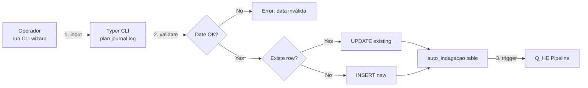
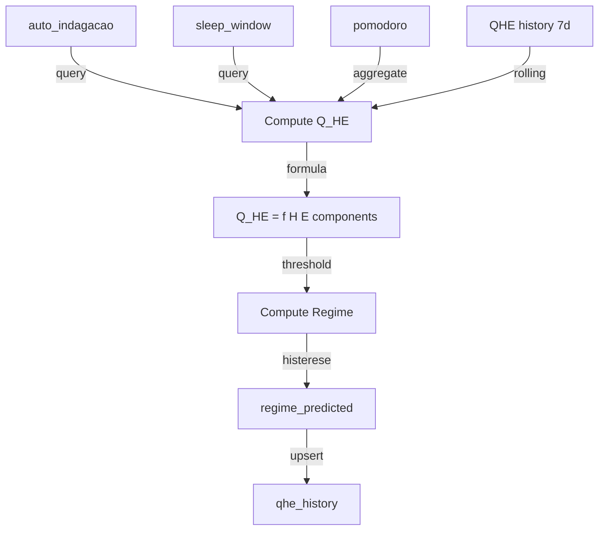
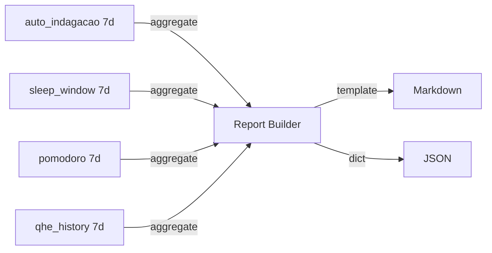

# Spec: Cluster PLAN — Pipelines (Sprint 1)

> Especificação técnica dos **pipelines** que processam os inputs do Cluster PLAN.
> **Apenas aritmética + queries SQLite**. **Zero LLM, zero embeddings, zero NLP.**

---

## 1. Visão Geral

O Cluster PLAN tem **3 pipelines principais** (Sprint 1):

1. **Journal Pipeline** — input wizard → `auto_indagacao` table
2. **Q_HE Pipeline** — inputs → `qhe_history` table + regime
3. **Report Pipeline** — inputs → reports (markdown + JSON)

Todos são:
- **Determinísticos** (mesmo input → mesmo output)
- **Offline-first** (sem dependência de network)
- **Idempotentes** (re-execução não causa side effects)

---

## 2. Journal Pipeline

### 2.1. Diagrama



### 2.2. Algoritmo

```python
def log_journal(ritual_type: str, date: date, answers: dict) -> dict:
    """
    Sprint 1 — Sprint 1 Algoritmo de Journal Pipeline.
    """
    # 1. Validate date
    today = date.today()
    if date > today:
        raise ValueError(f"Date cannot be in future: {date}")
    if (today - date).days > 7:
        raise ValueError(f"Date too old (max 7d retroactive): {date}")

    # 2. Validate ritual_type
    if ritual_type not in ("morning", "afternoon", "evening"):
        raise ValueError(f"Invalid ritual: {ritual_type}")

    # 3. Check existing
    existing = db.query(AutoIndagacao).filter(
        AutoIndagacao.date == date,
        AutoIndagacao.ritual_type == ritual_type
    ).first()

    # 4. Upsert
    if existing:
        for key, value in answers.items():
            setattr(existing, key, value)
        existing.updated_at = datetime.now()
        db.commit()
        updated = True
    else:
        new = AutoIndagacao(
            date=date,
            ritual_type=ritual_type,
            **answers
        )
        db.add(new)
        db.commit()
        updated = False

    # 5. Trigger Q_HE pipeline
    qhe = compute_qhe_for_date(date)
    regime = compute_regime_for_date(date, qhe)

    return {
        "date": str(date),
        "ritual_type": ritual_type,
        "qhe": qhe,
        "regime": regime,
        "updated_existing": updated
    }
```

### 2.3. Performance Target

- Validação: < 10ms
- Upsert: < 50ms
- Q_HE compute: < 100ms
- Total: < 200ms (target: < 1s)

---

## 3. Q_HE Pipeline

### 3.1. Diagrama



### 3.2. Algoritmo Q_HE (origem: PRD-02 §3)

```python
def compute_qhe_for_date(date: date) -> float:
    """
    Q_HE = (Σ w_i · H_i(t) / Σ w_i) · E(t)/E_max · (1 + η · S_streak/S_max)

    Componentes:
    - H_sono: 1 - exp(-λ · streak_sono),  λ=0.093
    - H_med: 1 - exp(-λ · streak_med)
    - H_workout: 1 - exp(-λ · streak_workout)
    - H_lunch: 1 - exp(-λ · streak_lunch)
    - S_streak: streak global de hábitos âncora
    """
    # Buscar streak atual
    streak_sono = get_streak("habit_sono", date)
    streak_med = get_streak("habit_meditacao", date)
    streak_workout = get_streak("habit_treino", date)
    streak_lunch = get_streak("habit_almoco_leve", date)
    streak_global = min(streak_sono, streak_med, streak_workout, streak_lunch)

    # Calcular H(t) = 1 - e^(-λ·streak)
    lam = 0.093
    h_sono = 1 - math.exp(-lam * streak_sono)
    h_med = 1 - math.exp(-lam * streak_med)
    h_workout = 1 - math.exp(-lam * streak_workout)
    h_lunch = 1 - math.exp(-lam * streak_lunch)

    # Pesos base
    w = {"sono": 0.35, "med": 0.20, "workout": 0.25, "lunch": 0.10}
    w_sum = sum(w.values())
    h_avg = sum(w[k] * h for k, h in zip(w.keys(), [h_sono, h_med, h_workout, h_lunch])) / w_sum

    # E(t)/E_max (energia, baseado em sleep quality)
    sleep = get_sleep_window(date)
    if sleep and sleep.quality_score:
        e_ratio = sleep.quality_score / 10.0
    else:
        e_ratio = 0.5  # default neutro

    # Streak bonus
    s_streak = streak_global
    s_max = 30  # target
    eta = 0.15

    qhe = h_avg * e_ratio * (1 + eta * (s_streak / s_max))
    return round(min(1.0, max(0.0, qhe)), 4)
```

### 3.3. Algoritmo Regime (origem: PRD-06 §2 + ikigai_meta_heuristics §1)

```python
def compute_regime_for_date(date: date, qhe: float) -> str:
    """
    Regime π(s_t) com histerese 2-3 dias.

    Estados: PUSH, MAINTAIN, REDUCE, RECOVER
    """
    # Buscar últimos 3 dias (histerese)
    history = db.query(QHEHistory).filter(
        QHEHistory.date >= date - timedelta(days=3),
        QHEHistory.date <= date
    ).order_by(QHEHistory.date.asc()).all()

    if len(history) < 1:
        # Sem histórico: default MAINTAIN
        return "MAINTAIN"

    # Regra 1: RECOVER (emergência)
    last_3_qhe = [h.qhe_score for h in history[-3:]]
    if len(last_3_qhe) >= 2 and all(q < 0.60 for q in last_3_qhe):
        return "RECOVER"

    # Regra 2: PUSH (alta performance)
    if qhe >= 0.85 and (sleep and sleep.duration_hours and sleep.duration_hours >= 7):
        if len(last_3_qhe) >= 3 and all(q >= 0.85 for q in last_3_qhe):
            return "PUSH"

    # Regra 3: MAINTAIN
    if 0.70 <= qhe < 0.85:
        return "MAINTAIN"

    # Regra 4: REDUCE
    if 0.60 <= qhe < 0.70:
        return "REDUCE"

    # Default: MAINTAIN
    return "MAINTAIN"
```

---

## 4. Report Pipeline

### 4.1. Diagrama



### 4.2. Algoritmo Report Semanal

```python
def generate_weekly_report(end_date: date) -> dict:
    """
    Gera report semanal determinístico.
    Apenas queries SQLite + aritmética.
    """
    start_date = end_date - timedelta(days=6)

    # Query 1: Pomodoros planejados vs fechados
    pomodoros = db.query(Pomodoro).filter(
        Pomodoro.date >= start_date,
        Pomodoro.date <= end_date
    ).all()

    planned = db.query(AutoIndagacao).filter(
        AutoIndagacao.date >= start_date,
        AutoIndagacao.date <= end_date
    ).all()

    total_planned = sum(
        (p.pomodoros_planned_morning or 0) +
        (p.pomodoros_planned_afternoon or 0) +
        (p.pomodoros_planned_evening or 0)
        for p in planned
    )
    total_done = sum(1 for p in pomodoros if p.status == "completed")
    total_interrupted = sum(1 for p in pomodoros if p.status == "interrupted")
    yield_pct = (total_done / max(total_planned, 1)) * 100

    # Query 2: Distribuição de regime
    regime_counts = db.query(QHEHistory).filter(
        QHEHistory.date >= start_date,
        QHEHistory.date <= end_date
    ).all()
    days_pushed = sum(1 for r in regime_counts if r.regime == "PUSH")
    days_maintain = sum(1 for r in regime_counts if r.regime == "MAINTAIN")
    days_reduce = sum(1 for r in regime_counts if r.regime == "REDUCE")
    days_recover = sum(1 for r in regime_counts if r.regime == "RECOVER")

    # Query 3: Q_HE trend
    qhe_trend = [r.qhe_score for r in sorted(regime_counts, key=lambda x: x.date)]

    # Query 4: IKIGAi avg (placeholder Sprint 1, real Sprint 6)
    ikigai_avg = {
        "passion": 0.0,  # TBD Sprint 6 (ikigai_scorer.py)
        "skill": 0.0,
        "market": 0.0,
        "revenue": 0.0
    }

    # Query 5: Transições
    transitions = db.query(TransitionRitual).filter(
        TransitionRitual.date >= start_date,
        TransitionRitual.date <= end_date
    ).all()
    transitions_total_minutes = sum(t.duration_minutes or 0 for t in transitions)

    return {
        "period": {"start": str(start_date), "end": str(end_date)},
        "summary": {
            "pomodoros_planned": total_planned,
            "pomodoros_done": total_done,
            "pomodoros_interrupted": total_interrupted,
            "yield_pct": round(yield_pct, 1),
            "days_pushed": days_pushed,
            "days_maintain": days_maintain,
            "days_recover": days_recover
        },
        "ikigai_avg": ikigai_avg,
        "qhe_trend": qhe_trend,
        "transitions_total_minutes": round(transitions_total_minutes, 1)
    }
```

### 4.3. Output Formatter (Markdown)

```python
def render_markdown(report: dict) -> str:
    md = f"""# Weekly Report: {report['period']['start']} → {report['period']['end']}

## Summary
- Pomodoros: {report['summary']['pomodoros_done']}/{report['summary']['pomodoros_planned']} ({report['summary']['yield_pct']}%)
- Regime: 🟢 PUSH={report['summary']['days_pushed']} | 🟡 MAINTAIN={report['summary']['days_maintain']} | 🟠 REDUCE={report['summary'].get('days_reduce', 0)} | 🔴 RECOVER={report['summary']['days_recover']}

## Q_HE Trend
{format_qhe_chart(report['qhe_trend'])}

## Transições
- Total: {report['transitions_total_minutes']} min (alvo: ≤ 45 min/dia × 7 = 315 min)

## IKIGAi Avg (Sprint 6+)
- (TBD — Sprint 6 implementa `ikigai_scorer.py` 5 vetores)
"""
    return md
```

---

## 5. Performance Targets

| Pipeline | Target | Medição |
|---|---|---|
| Journal Pipeline | < 200ms (CLI end-to-end) | stopwatch |
| Q_HE Pipeline | < 100ms (per date) | stopwatch |
| Report Pipeline (weekly) | < 2s (end-to-end) | stopwatch |
| Report Pipeline (monthly) | < 5s | stopwatch |
| Sleep Window computation | < 50ms | stopwatch |

**Sem LLM, sem embeddings, sem charts interativos** (apenas markdown table ASCII).

---

## 6. Cross-refs

- [`../planning/CLUSTER_PLAN_DATA_MODEL.md`](../planning/CLUSTER_PLAN_DATA_MODEL.md) — Schema
- [`../planning/CLUSTER_PLAN_USER_STORIES.md`](../planning/CLUSTER_PLAN_USER_STORIES.md) — User stories
- [`../planning/CLUSTER_PLAN_CLI_SPEC.md`](../planning/CLUSTER_PLAN_CLI_SPEC.md) — CLI
- [`../PRD-02-habit-tracker.md`](../PRD-02-habit-tracker.md) — Q_HE formula
- [`../PRD-06-policy-governance.md`](../PRD-06-policy-governance.md) — Regime state machine
- [`../../life-ops/planner/Points_of_premisses-task-habits.md §3-4`](../../life-ops/planner/Points_of_premisses-task-habits.md) — Q_HE math
- [`../../life-ops/planner/ikigai_planning/ikigai_meta_heuristics.md §1`](../../life-ops/planner/ikigai_planning/ikigai_meta_heuristics.md) — Regime algorithm

---

*spec-cluster-plan-pipelines.md — v1.0 — 2026-06-05 — Pipelines determinísticos para Cluster PLAN*
